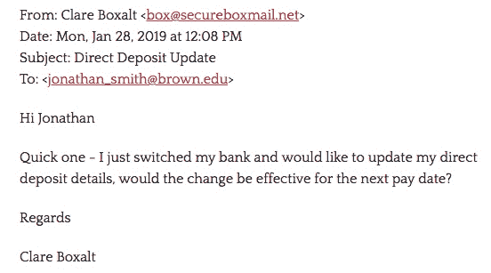
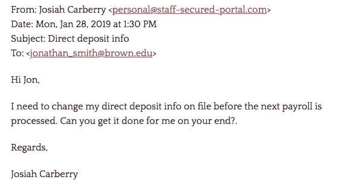

# 直接存款骗局:不要上当！

> 原文：<https://www.social-engineer.com/direct-deposit-scams-dont-get-fooled/>

直接存款骗局是一种商业电子邮件泄露或电子邮件帐户泄露(BEC/EAC)方案。这些骗局非常普遍，影响到所有行业。事实上，在 2019 年， [FBI 的互联网犯罪投诉中心](https://pdf.ic3.gov/2019_IC3Report.pdf) (IC3)收到了 23775 起 BEC/EAC 诈骗案的报告，调整后的损失为 17 亿美元。值得注意的是，根据该报告，直接存款 BEC/EAC 诈骗案也大幅上升。显然，这是一个组织需要警惕的骗局。

你的公司使用直接存款支付工资吗？因为直接存款可以节省开支，许多公司都这样做。作为一名员工，我喜欢直接存款的便利。它让我能快速拿到我的薪水，也让我不用去自动取款机和/或银行排队。对我来说，这是应对疫情冠状病毒的一大优势。然而，鉴于 FBI 的调查结果，组织需要认真对待这一骗局，并实施安全策略来保护自己。在这个月的博客中，我们将探讨直接存款诈骗是如何运作的，如果你被骗了该怎么办，以及如何保护你的公司免受直接存款诈骗。

## 直接存款骗局如何运作

这种类型的计划使用[社会工程策略](https://www.social-engineer.com/)，比如模仿和操纵。正如在以前版本的直接存款诈骗中看到的那样，网络犯罪分子会伪装成人力资源(HR)人员，并通过网络钓鱼电子邮件联系寻求工资信息的员工。然而，在最新的版本中，坏演员互换了角色。现在，他们假扮成员工。通常是 CEO 或 CFO 等高价值员工。然后，他们通过电子邮件联系人力资源人员，请求更改他们的直接存款信息。

是什么让这个骗局如此危险？首先，在这个[新变种中，](https://www.cnbc.com/2019/04/09/new-wire-fraud-scam-targets-your-direct-deposit-info-paycheck.html)电子邮件很容易绕过恶意通信的技术控制。为什么会这样呢？因为钓鱼邮件不包含索要钱财的内容，没有明显的拼写错误，而且简短友好。稍后我会详细讨论这一点。此外，坏人正在使用免费的电子邮件服务，如 Gmail。他们只需用员工的名字创建一个新账户。通过这样做，他们规避了旨在检测员工电子邮件黑客企图的工具。

第二，钓鱼邮件操纵情绪。坏演员专门制作电子邮件来制造一种紧迫感。例如，冒充 CEO，网络罪犯可能要求更改他们的直接存款信息，这必须发生在处理下一份工资单之前。如果人力资源员工回复并提供帮助，坏人会发送新的银行路由信息。然后，薪水会被存入网络罪犯的账户。结果，员工被困在等待补发工资，公司要为被盗资金负责，而坏演员却白拿了钱。无论从哪个角度来看，这都是一个糟糕的场景。

## 邮件看起来像什么

你好奇这些邮件是什么样子的吗？这里有几个发送给[布朗大学](https://it.brown.edu/alerts/read/request-change-direct-deposit-information)的直接存款钓鱼邮件的例子。

<figure id="attachment_3706" aria-describedby="caption-attachment-3706" style="width: 552px" class="wp-caption aligncenter">

<figcaption id="caption-attachment-3706" class="wp-caption-text">Screen shot from Brown University</figcaption>

</figure>

<figure id="attachment_3707" aria-describedby="caption-attachment-3707" style="width: 564px" class="wp-caption aligncenter">

<figcaption id="caption-attachment-3707" class="wp-caption-text">Screen shot from Brown University</figcaption>

</figure>

## 如果你被骗了该怎么办

如果你的公司被骗了，你该怎么办？迅速而有目的地做出反应很重要。FBI 的[互联网犯罪投诉中心](https://www.ic3.gov/default.aspx)建议采取以下行动:

*   一旦发现骗局，立即联系发起金融机构。请求召回或撤销。以及持有无害信或赔偿信。
*   向联邦调查局互联网犯罪投诉中心([https://www.ic3.gov/default.aspx](https://www.ic3.gov/default.aspx))投诉。请确保输入所有必需的数据。

没有人想经历直接存款诈骗带来的焦虑、沮丧和财务损失。因此，作为一个组织，采取措施加强您的安全态势。你能做什么？注重人的因素的安全培训是必须的！

## 保护您的组织免受直接存款诈骗

为了保护您的组织免受直接存款诈骗和其他网络犯罪的侵害，入侵检测系统、防火墙和其他监控网络的设备非常重要。然而，在您的安全策略中，不要忽视人的因素是绝对重要的。例如，在直接存款诈骗中，网络罪犯的目标是人，而不是网络。这让我想起了之前的一点。在最近的这些直接存款诈骗中，坏人正在编写绕过技术控制的电子邮件。显然，培训员工理解和识别恶意的社会工程策略非常重要。为此，我们建议进行[社会工程风险评估。](https://www.social-engineer.com/social-engineering-risk-assessment/)您的组织将收到对您潜在风险的专家分析，使您能够计划、培训和准备应对社会工程攻击。

实施网络钓鱼培训，如[网络钓鱼即服务](https://www.social-engineer.com/phishing-as-a-service-phaas/) (PHaaS)也是必须的。PHaaS 培训提高员工意识并提供教育。它还为您的组织提供了一个持续、可重复的评估网络钓鱼风险的流程。

## 最佳实践

随着数百万人因为冠状病毒而转向远程工作，这里有一些在[Social-Engineer.org 四月简讯](https://www.social-engineer.org/newsletter/working-remotely-cybersecurity-tips-to-work-from-home-safely/)中提到的基本最佳实践，可以加强您组织的安全性:

*   不要点击或下载任何东西，除非它来自一个经过验证的发件人。不确定？打电话给你的同事核实一下。
*   对你在电话中给出的信息保持警惕，记住对让你感到不舒服的请求说不是没关系的。
*   锁好你的电脑——尤其是当你在一个共享空间工作的时候。
*   技术支持诈骗者瞄准了远程工作人员。在点击弹出窗口说你的电脑有安全问题或者操作系统需要更新之前要小心。
*   保持沟通——不要让你的偏远位置让你失去与同事和雇主的沟通。呆在圈子里会让你不太可能上当受骗。

## 不要被骗了

随着网络犯罪分子对旧骗局进行调整并创造新的花样，我们也必须采用和调整新的安全策略。现在是实施包含人的因素的安全培训的时候了！[社会工程师有限责任公司](https://www.social-engineer.com/social-engineering-services/)可以提供帮助！

*来源:*
*[https://pdf.ic3.gov/2019_IC3Report.pdf/](https://pdf.ic3.gov/2019_IC3Report.pdf)*
*[https://www.social-engineer.com/](https://www.social-engineer.com/)*
*[https://it . brown . edu/alerts/read/request-change-direct-deposit-information](https://it.brown.edu/alerts/read/request-change-direct-deposit-information)*
*[https://www.social-engineer.com/services/](https://www.social-engineer.com/services/)*
*[https://www . CNBC . com/2019/04/09/new-wire](https://www.cnbc.com/2019/04/09/new-wire-fraud-scam-targets-your-direct-deposit-info-paycheck.html)*

*图片:*
*[https://its . uiowa . edu/news/it-security-office-warns-work-home-schemes](https://its.uiowa.edu/news/it-security-office-warns-work-home-schemes)*