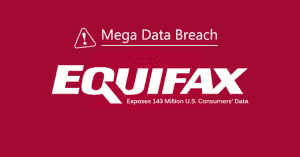

# Equifax 违规和您需要了解的内容

> 原文：<https://www.social-engineer.com/equifax-breach-need-know/>

似乎一天没有 没有 的另一个“违约”故事出现在新闻中。以至于你可能会发现自己忽略了它们，把它们当成了另一个新闻故事。

但是我们敦促你不要忽视这一点。**请。**T3**T5T7】**

【2017 年 5 月 Equifax 被攻破。看起来黑客利用了 Apache STRUTS 缺陷中的漏洞。65%的财富 100 强公司使用 STRUTS，所以这个漏洞不是 Equifax 独有的。T5】

Equifax 直到 2017 年 7 月才发现漏洞。根据计算，攻击者在他们的系统中至少有 3 个月的时间。

### 他们得到了什么？

希望你坐下了。如果没有，你可能想要。

1.43 亿人卷入了这次泄密事件。攻击者 得以 获得:

*   社保号码
*   出生日期
*   信用卡号码
*   驾驶证号码
*   电话号码

18 岁以上的美国人有 245，576，909 人(根据 2016 年人口普查)。这意味着，由于 Equifax 系统中的一个未打补丁的缺陷，58%的美国成年人都可能被入侵。T5】

基本上 ， 这是一个身份盗窃的秘方。这就是我们写这篇博客的原因。

### 警惕身份骗局

我们会在下面给你一些关于如何冻结你的信用的信息，但是，在此期间， ， 这不是唯一的问题。这些信息在世界各地被交易和出售。这意味着你，是的，你，现在是一个目标的视觉骗局，网络钓鱼诈骗，和组合攻击。

### 你能做什么？

小心点。下面是一些提示:

*   不要点击电子邮件中的任何链接。如果您收到一封电子邮件，不要复制并粘贴链接，而是打开浏览器，使用已知的 URL 访问该网站。
*   如果有人打电话给你，说他们需要任何 PII(个人身份信息)，不要给他们任何东西。到网上，获得该组织、银行或信用卡公司的合法号码，然后直接打电话给他们。
*   不要将此视为信用卡违约。当你的卡被盗时，公司有保险让你全身而退。这不一样；如果有人窃取了你的身份，然后 用你的信息开了信用账户、贷款账户或其他账户，可能要花好几年才能清理干净。
*   监控你的信用。现在小心点！！！Equifax 提供免费监控，但是如果你接受，你就放弃了参与集体诉讼的权利。这是肮脏的游泳池，Equifax，我希望你们没有人签署了这一骗局。
*   冻结你的信用。老实说，这是一个巨大的痛苦。当你想买车时，这会使事情变得困难。但是你 得 想想这样做还是有人能以你的名义开户的。最简单的方法就是联系各大局: Equifax:[www.freeze.equifax.com](https://www.freeze.equifax.com)  Experian:[experian.com/freeze/center.html](https://experian.com/freeze/center.html)  TransUnion:[freeze.transunion.com](https://freeze.transunion.com)

完成后，您将收到一个 PIN 码，使用您的点数做任何事情都需要这个 PIN 码，不要弄丢了。 就我个人而言，我会考虑这样做，即使是为了你的孩子。 T10】

如果你是这次泄密的受害者，并且你的身份被利用， 立即采取行动 。注销你的信用卡，更改密码，监控你的信用。不要坐等他们联系你——你需要采取主动，快速行动 。

保持警惕。保持警惕。注意安全。