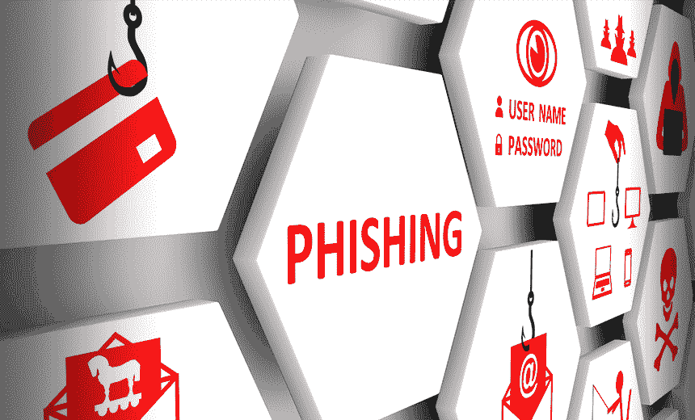

# 对抗费西合唱团

> 原文：<https://www.social-engineer.com/fight-the-phish/>

又是一个十月，又是一个网络安全意识月。最重要的主题#BeCyberSmart 把我们带到了我们的讨论中，抗击费西合唱团！由于[网络钓鱼](https://www.social-engineer.org/framework/attack-vectors/phishing-attacks-2/)是恶意行为者极其有效的攻击媒介，这是一个我们可以全心全意支持的话题。网络钓鱼攻击目前占[报告的安全事件](https://enterprise.verizon.com/resources/reports/2019-data-breach-investigations-report.pdf)的 80%以上。仅在 2020 年，就有 241，342 起[关于网络钓鱼诈骗的投诉](https://www.ic3.gov/Media/PDF/AnnualReport/2020_IC3Report.pdf)，调整后的损失超过 5400 万美元。过去几年网络钓鱼攻击的增加凸显了提高警惕的必要性。个人和公司都强调报告可疑电子邮件和意识培训的必要性，这一点比以往任何时候都更加重要。如果你有兴趣了解更多关于意识培训的信息，请点击阅读更多关于 Social-Engineer，LLC 的受控网络钓鱼服务[。](https://www.social-engineer.com/services/se-phishing-service/)

## 点击还是不点击

在确定电子邮件是合法邮件还是网络钓鱼邮件时，批判性思维起着关键作用。迈克尔·斯克里文和理查德·保罗(1987)将批判性思维定义为“积极而熟练地评估通过观察产生的信息的智力训练过程。”网络钓鱼电子邮件利用恐惧、贪婪和好奇等情绪来影响目标采取所需的行动。此外，它们通常传达一种紧迫感。与其立即行动，不如花点时间停顿一下。评估发送者是否要求你采取有意义的行动。例如，您的银行是否要求您提供您的银行代号，或者他们应该已经有的其他信息？同样重要的是注意邮件的语法。正确吗？有拼错的单词吗？让我们来分解一些确定电子邮件是否安全的具体方法。

### *要验证，您必须澄清*

从验证发件人开始。很多时候，恶意行为者会使用明显不属于他们所冒充的公司的电子邮件地址。检查那个地址是很好的第一步。此外，如果电子邮件要求您提交财务信息或通过链接提供任何个人信息，请不要点击它。相反，请联系发送方(无论是金融机构还是其他组织)来验证请求。验证请求时，不要使用电子邮件中提供的联系信息。相反，使用通过该公司的官方网站找到的联系信息。如果需要，在官方网站上登录您的帐户，查看任何通知。

### *检查链接*

一种快速查看电子邮件中链接路径的方法是将光标悬停在它上面。但是注意不要点击！这样，您可以看到链接的目的地，而不必导航到它。有时，电子邮件会包含一个“退订”链接或按钮。但是，不要立即相信这些链接。一定要先悬停并查看它的路径。很多时候，目的地与网络钓鱼电子邮件中的其他链接相同，或者很容易被识别为可疑的目的地。

### 如果有疑问——扔掉它！

基于链接的网络钓鱼电子邮件攻击仍然是恶意行为者获取您的个人信息的一种简单方法。正因为如此，记住，如果有疑问，就把它扔掉。试着把你现实世界的知识也应用到网络世界。如果你不认识某人，你会小心翼翼地不接受他们的东西。同样，要小心来自未知发件人的任何电子邮件，甚至是看起来来自你认识的人的电子邮件。如果你无法验证它的真实性，为了安全起见，删除邮件。

### *举报可疑邮件*

如果你收到一封可疑的邮件，无论你是否点击，向你的公司报告是很重要的。如果您点击了，您的安全团队将能够帮助您减轻损害。报告可疑电子邮件是保护公司安全的重要一环。举报他们的人越多，就越容易警告和保护公司的其他人。公开交流和了解正确的报告程序是防范网络钓鱼攻击的最佳手段之一。

## 社会工程钓鱼服务(SEPS)

组织应培训和教育员工检测社会工程攻击，以提高整体安全性。钓鱼你自己的员工的概念已经存在很多年了；然而，定制的和连续的网络钓鱼服务的概念是独特的。

自始至终，社会工程师帮助一个组织最不可预测的资产(他们的人)成为第一道防线。如果员工了解向内部安全部门报告可疑活动的价值，他们很可能会以同样的方式应对现实世界的情况。社会工程师团队不是简单地培训员工寻找可疑活动，而是教导用户运用批判性思维，识别钓鱼电子邮件，以及如何正确报告和回应它们。员工了解他们有责任保护的资产以及如何更好地保护它们非常重要。安全始于每个用户。

通过发送第一波精心制作的网络钓鱼电子邮件，Social-Engineer 为组织对这些类型的攻击的易感性创建了一个基线。在那里，我们的团队会进行全面的汇报，重点是补救和教育。我们通过日益复杂的网络钓鱼意识教育来重复这一过程。通过开展持续和定期的网络钓鱼活动，组织可以快速形成网络钓鱼意识和教育文化。我们的服务还可以提供高级指标，如点击率和报告率、惯犯和趋势数据，以确定具体的改进领域，并最终确定投资回报。如果您有兴趣与社会工程师合作#BeCyberSmart，请[联系我们的团队](https://www.social-engineer.com/services/se-phishing-service/)获取个性化报价。

*来源*
[*https://www . social-engineer . org/framework/attack-vectors/phishing-attacks-2/*](https://www.social-engineer.org/framework/attack-vectors/phishing-attacks-2/)
[*https://enterprise . Verizon . com/resources/reports/2019-data-breach-investigations-report . PDF*](https://enterprise.verizon.com/resources/reports/2019-data-breach-investigations-report.pdf)
[*https://www . ic3 . gov/Media/PDF/annual report/2020 _ ic3 report*](https://www.ic3.gov/Media/PDF/AnnualReport/2020_IC3Report.pdf)

*图片:[https://www . bankinfosecurity . com/phishing-scheme-uses-Google-drive-to-avoid-security-report-a-12924](https://www.bankinfosecurity.com/phishing-scheme-uses-google-drive-to-avoid-security-report-a-12924)T3】*