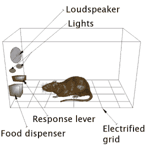

# 作为社会工程师的操作性条件反射

> 原文：<https://www.social-engineer.com/operant-conditioning-as-a-social-engineer/>

社会工程师需要利用许多工具来完成他们的目标。今天我们将讨论操作性条件反射。我们中的许多人可能在高中时就了解了伊凡·巴甫洛夫的狗和他开创性的经典条件反射。简而言之，巴甫洛夫研究了当狗认为它们可能得到食物时发生的不自觉的流涎。如果你有一只狗，你知道那是什么样子。经典条件作用的研究是围绕着在有机体中引起不自觉的反应。

经典条件反射经常与操作性条件反射混淆，尽管它们相似，但它们是不同的，并提供不同的益处。[操作性条件作用](https://www.scholarpedia.org/article/Operant_conditioning "operant conditioning")围绕着引发自愿反应，如指导人们购买某种产品或做出代理人认为合意的其他选择。作为社会工程师，理解这两种条件作用的区别是很重要的。当然，这既有积极的一面，也有消极的一面。在这篇博客中，我们将只探索在目标中创造积极效果的效用。

## 营销中的操作条件作用

想想为帮助销售“依偎”衣物柔顺剂而创造的吉祥物“依偎熊”。以很多人的标准来看，这只熊非常可爱。他也像我们年轻时的泰迪熊一样柔软。在电视广告中，我们先了解了这只熊及其吸引力，然后前往商店，在[依偎产品](https://www.snuggle.com/#filter=.products "Snuggle")的盒子和瓶子上看到了同一只熊。关于熊的一切，从声音到外貌，都预示着柔软。

起亚的“Hamstars”是营销中运用操作性条件反射的另一个例子。随着嘻哈文化在美国不断发展壮大，尤其是在年轻人中，以这种方式制作广告是有意义的。宣传传统的危险，吉祥物说唱与众不同，开拓创新。起亚不仅销售仓鼠的可爱汽车(以及特别版[“仓鼠”模型](https://www.autotrader.com/research/article/new-research/83098/kia-rolls-out-hamstar-soul-special-edition.jsp "Hamstar")，还有一个服装生产线。

爱护动物协会最近的营销视频说明狗可以被教会“驾驶”汽车，这是跨物种操作性条件反射的另一个例子。如果通过条件反射训练后，狗可以展示它们的智力，那么也许人类也会习惯于更开放地接受领养狗的想法。操作性条件反射塑造了狗的行为，这当然不是本能的(开车)，SPCA 希望它将影响我们自己的行为(收养而不是从饲养员那里买小狗，等等)，因为许多人都在寻找一只非常年轻的狗，没有潜在的麻烦历史，并且与其他人接触最少。

## 你能做什么

开始在你的电视上寻找积极的条件反射，在你的收音机上听它。在你与他人的交谈中要意识到这一点，并根据你接收到的信息，将你所接受的信息与他人希望你做的事情联系起来。在社会工程领域，这种意识可能是你自己做决定的区别，也可能是你自己做决定的错觉。显然，从收容所领养一只狗或者开一辆起亚都没有错，只是要明白你为什么要这么做。意识是关键。

将这一点包括在您的安全意识培训中，这样您的公司就不会像测试中的老鼠一样做出反应，而这正是恶意社会工程师想要的。认识到这些技能无论是积极的还是消极的都是一样的；改变的只是意图。当我们为客户进行[社会工程师测试](https://www.social-engineer.com/social-engineering-penetration-test/ "SE Pentests")时，我们利用这一点来展示调节人们是多么容易。然后，我们在培训中使用这些结果。

我们每天都受到营销人员、朋友、家人和同事的影响——只要意识到它对你的影响。注意安全。