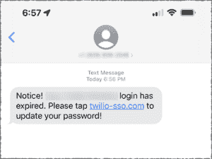

# 社会工程新闻中的粉碎

> 原文：<https://www.social-engineer.com/smishing-in-social-engineering-news/>

SMiShing 使用 SMS(短消息服务)作为攻击媒介。攻击者的目的是欺骗目标在他们的设备上安装恶意软件，或者泄露帐户信息。攻击者伪造一个微笑消息，让接收者认为该通信来自熟悉或可信的来源。然后，坏演员向他们的目标发送包含恶意链接的垃圾邮件。如果单击该链接，会将目标重定向到攻击者控制的网站。SMiShing 是一种社会工程攻击，因为犯罪分子利用了目标的漏洞；信任、乐于助人或对察觉到的危险迅速采取行动的愿望。SMiShing 对企业来说是一个非常现实的安全威胁，因为现在有 39%的员工通过个人设备访问公司数据。

## Twilio 报告攻击失败

对 Twilio 员工的攻击损害了员工和客户的账户。2022 年 8 月 4 日，Twilio 发现有人未经授权访问了与有限数量的 Twilio 客户账户相关的信息。攻击者是如何获得访问权限的？根据 [Twilio 的事件报告](https://www.twilio.com/blog/august-2022-social-engineering-attack)，现在和以前的员工收到了声称来自 Twilio IT(信息技术)部门的短信。短信暗示员工的密码已经过期，或者他们的日程已经改变。SMiShing 消息包含一个链接，单击该链接会将员工带到由攻击者控制的 URL(统一资源定位器)。这些网址使用了包括“Twilio”、“Okta”和“SSO”在内的词汇来欺骗员工。如果他们点击这个链接，就会进入一个模仿 Twilio 登录页面的网页。

###### 
*图片:https://www . twilio . com/blog/August-2022-social-engineering-attack*

## 测试。教育。保护。–社会工程师管理的微笑服务

对 Twilio 的攻击凸显了恶意行为者如何通过将攻击集中在公司员工身上来威胁信息安全。您的员工是否接受过识别恶意攻击的培训？Social-Engineer 的[托管微笑服务](https://www.social-engineer.com/managed-services/managed-smishing-service/)旨在测试、教育和保护你的人际网络。我们应用经过科学验证的方法来发现漏洞、定义风险并提供补救措施。我们全面管理的计划通过数据驱动的定位和培训来衡量和跟踪员工如何应对恶意攻击。

请今天就联系我们进行咨询。

[www.Social-Engineer.com](https://www.social-engineer.com/)