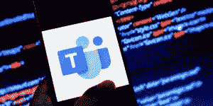

# 社会工程新闻:微笑

> 原文：<https://www.social-engineer.com/social-engineering-news-smishing-2/>

随着越来越多的公司向远程/混合工作人员过渡，恶意攻击继续激增。根据一项 [皮尤研究中心的调查](https://www.pewresearch.org/social-trends/2022/02/16/covid-19-pandemic-continues-to-reshape-work-in-america/) ，59%的美国雇员全部或大部分时间在家工作。这种转变意味着员工现在更有可能使用手机或平板电脑等移动设备来访问公司信息和账户。坏演员注意到了这一点，并利用了这种对移动设备的依赖。他们使用流行的移动通讯应用程序和数字渠道来帮助远程员工提高工作效率，如 Facebook Messenger、WhatsApp、LinkedIn、Zoom、微软团队、Google Meet 和 Slack 来促进攻击。因此，微笑是企业不能再忽视的威胁。T17T19】

## 缺少什么

SMiShing 这个词来自于将 SMS(短消息服务)和 [phishing](https://www.social-engineer.org/framework/attack-vectors/phishing-attacks-2/) 结合在一起，SMS 是手机短信的原始技术。在这两种情况下，坏人的目标都是窃取个人或财务信息。

### 下面的社会工程新闻故事展示了坏人是如何利用消息应用和数字渠道的

一支老练的队伍发起进攻。据 VentureBeat 的[报道，一个坏演员冒充 CEO(首席执行官)到中国出差，向该公司的几名员工发送了一条 WhatsApp 消息，邀请他们参加一个团队会议。当员工参加团队会议时，他们认为他们看到的是 CEO 的视频直播。然而，这实际上是从过去的电视采访中截取的首席执行官的视频。为了让骗局更有说服力，这个坏演员添加了一个假背景，让 CEO 看起来真的在中国。现在有个转折，团队会议没有音频。这位“首席执行官”聊天说他遇到了音频馈送的问题，并告诉员工，“*因为我无法完成这项工作，请通过这个 SharePoint 链接将信息发送给我。*’”](https://venturebeat.com/2022/02/23/microsoft-teams-is-the-new-frontier-for-phishing-attacks/)

## 

*形象:文图博*

## 使用我们的托管服务进行测试、培训和保护

您如何保护您的公司免受上述攻击？让您的员工能够识别攻击非常重要。在 [Social-Engineer，LLC](https://www.social-engineer.com/) ，我们全面管理的企业可扩展计划通过数据驱动的定位和培训来衡量和跟踪您的员工如何应对基于文本的网络钓鱼攻击。我们全面管理的 SMiShing 服务提供定制模板、基于故障的定制培训以及全面的报告。要在[安排咨询](https://www.social-engineer.com/managed-services/managed-smishing-service/)，请今天联系我们。