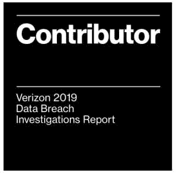

# 威瑞森·DBIR——首席执行官们受到了攻击

> 原文：<https://www.social-engineer.com/the-verizon-dbir-the-c-suite-is-under-attack/>

[威瑞森 2019 DBIR](https://enterprise.verizon.com/resources/reports/dbir/2019/introduction/) 由来自 86 个国家的 41，686 起安全事件的分析组成，其中 2，013 起被确认为数据泄露。该报告证实，犯罪分子通过社会工程攻击积极瞄准人类的弱点。根据今年的数据泄露调查报告(DBIR)，在 2，013 起确认的数据泄露中，33%包括社交攻击。有鉴于此，很明显，所有 T2 公司都容易受到社会攻击。所以，如果你是一家中小型企业，不要认为你已经摆脱困境。值得注意的是，在今年的报告中，*小型*企业占所有数据泄露的 43%。所有组织中的具体目标是谁？最高管理层。它受到攻击，感受到社会工程攻击的冲击。

<figure id="attachment_9391" aria-describedby="caption-attachment-9391" style="width: 300px" class="wp-caption aligncenter">

<figcaption id="caption-attachment-9391" class="wp-caption-text">Social-Engineer, LLC is proud to be a contributor for the 12th edition of the Verizon 2019 DBIR.</figcaption>

</figure>

### 首席执行官们受到了攻击

首席执行官、首席财务官、首席运营官和首席信息官等高管是网络犯罪分子的主要目标。他们成为社交工程攻击目标的可能性是其他员工的 12 倍。财务收益仍然是首要目标。总体而言，71%的违规行为都有财务动机。

由于高级管理人员拥有最高级别的访问权限，并且在提出和批准请求的指挥链中处于更高的位置，因此他们的电子邮件登录凭据对网络犯罪分子非常有吸引力。对于攻击者来说，被盗的凭据和被泄露的电子邮件帐户就像是拥有了这座城市的钥匙。犯罪分子可以在公司的网络内随意来去，就像一个值得信赖的朋友。不需要暴力。一个受损的高级管理人员电子邮件帐户可以用来发送电汇请求，然后犯罪分子只需等待资金到达。近年来，Snapchat、美泰和 FACC 都成为了 BEC 骗局的受害者。威瑞森报告称，商务电子邮件泄露(BEC)攻击代表了 370 起事件，其中 248 起被确认为违规。

[网络钓鱼](https://www.social-engineer.org/framework/attack-vectors/phishing-attacks-2/)和[伪装](https://www.social-engineer.org/framework/attack-vectors/vishing/)是攻击者窃取凭证的常用手段。由于首席管理人员处理的电子邮件数量庞大，他们比其他员工更容易受到网络钓鱼的威胁。每天，他们都要对多个需要快速解决的问题做出例行回应，创造一个有利于“先点击再思考”的环境。犯罪分子还从数据泄露和破坏中获取凭证。2017 年[首席执行官电子邮件暴露研究](https://press.f-secure.com/2017/10/25/study-shows-30-of-ceos-have-been-pwned-passwords-exposed/)发现，81%的世界顶级首席执行官的个人信息暴露在垃圾邮件列表或泄露的营销数据库中。此外，对于 1/3 的首席执行官来说，他们通过公司电子邮件访问的服务已经被黑客攻击，他们用于该服务的密码已经泄露。

### 增强您企业的防御能力

所有企业，无论大小，都容易受到社会工程攻击。那么，您能做些什么来加强您企业的防御呢？我们建议采取以下行动:

*   实施安全培训，并意识到[涉及高管](https://www.social-engineer.com/assess-your-risks/)。对于高级管理人员来说，了解恶意行为者如何利用他们的个人和专业在线曝光来发起社会工程攻击是非常重要的。考虑到这一点，[社会工程风险评估(SERA)](https://www.social-engineer.com/social-engineering-risk-assessment/) 为您公司的潜在风险提供专家分析。它可以帮助您计划、教育和准备社会工程攻击。
*   所有员工都应该接受网络安全培训。这包括新员工、老员工、高管以及承包商。了解网络钓鱼攻击带来的威胁的员工不太可能点击恶意链接，而更有可能报告可疑活动。实施了[网络钓鱼服务](https://www.social-engineer.com/services/phishing-as-a-service-phaas/)的组织会发现恶意软件感染率、笔记本电脑重新镜像、偷渡式下载和广告软件大幅减少。

此外，[网络安全和基础设施安全局(CISA)](https://www.us-cert.gov/ncas/tips/ST04-003) 建议采用以下最佳实践来最大限度地减少对您信息的访问:

*   为每个设备或帐户创建唯一的强密码。
*   此外，考虑使用密码管理器。
*   如果可能，请使用双因素身份验证。
*   正确使用安全问题。对于要求您设置一个或多个密码重置问题的帐户，请使用只有您自己知道的个人信息。不要在社交媒体上发布可能让别人更容易猜到您的密码的信息。
*   为每台设备上的每个用户创建唯一的帐户也同样重要。

### 现在就行动吧！

不要推迟安全培训和安全意识。今天就采取必要的行动*来加强您企业的防御。*

 **来源:
*[https://enterprise . Verizon . com/resources/executive briefs/2019-dbir-executive-brief . pdf](https://enterprise.verizon.com/resources/executivebriefs/2019-dbir-executive-brief.pdf)*
*[https://enterprise . Verizon . com/resources/reports/dbir/2019/introduction/](https://enterprise.verizon.com/resources/reports/dbir/2019/introduction/)*
*[https://www . social-engineer . com/phishing-c-suite-executives-keep-biting/](https://www.social-engineer.com/phishing-c-suite-executives-keep-biting/)**

*图片:
威瑞森数据泄露调查报告**