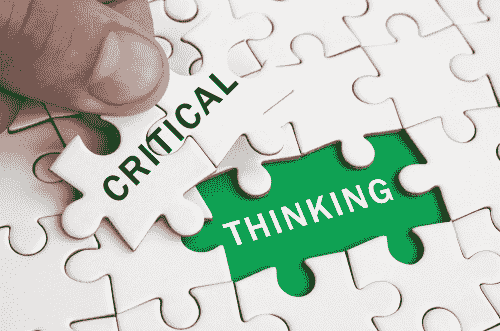

# 什么是批判性思维？

> 原文：<https://www.social-engineer.com/what-is-critical-thinking/>

在安全意识和相关培训领域，术语批判性思维被认为是 抵御社会工程攻击的有效手段 。那么，什么是 批判性思维 ？ 如何在日常活动中应用，使用户或整个用户–基地更加安全？

根据 [批判性思维的基础](https://www.criticalthinking.org/pages/defining-critical-thinking/766) ，一个“训练有素的批判性思考者”收集并评估相关信息得出有理有据的结论和解决方案 。一个人在认识和评估自己的假设、含义和实际后果的同时，还能在可供选择的思想体系内进行开明的思考。

让我们把它分解一下。“收集和评估相关信息 、 ”是非常重要的一块。这些天来，我们被大量的信息淹没了。因此，能够看穿迷雾，专注于与特定情况相关的事情是至关重要的。

“得出有理有据的结论和解决办法 ， ”更主观一点，因情况不同而变化。从社会工程防御的角度来看 ， 这通常涉及到使用规定的政策和程序作为您的路标，以找到合理的解决方案。如果攻击者要求的是专有或机密性质的信息，那么您公司制定的政策应该明确说明在这种情况下应该怎么做。

最后一点，“认识和评估他们的假设、含义和实际后果 、 ”是批判性思考者头脑中的所有想法。如果我向攻击者提供他们所要求的信息或按照他们的要求行动，会发生什么？该行为的后果可能从轻微的对个人或公司造成毁灭性的后果。这需要在采取行动之前解决， 或者至少是 ，如果点击了 链接或者泄露了信息， 需要 认识到出现了错误，然后 个人应该 向适当的安全联系人报告该活动。T32

### 我们如何提高批判性思维能力？

批判性思维的主要障碍是情感。这是所有社会工程师用来颠覆训练用户可能 让 接收并让他们采取行动的策略，即使这可能不符合他们的最佳利益。

攻击者使用的 [最常见的情绪触发器](https://techgenix.com/social-engineering-attacks/) 是 恐惧、信任、好奇、 和 贪婪 。这些可以一起或单独使用，试图用足够的情绪淹没目标，批判性思维是不可能的。那个 时刻 能够 实际上是 的触发点，那个 情境 需要批判性思维。

当你收到一封电子邮件或一个电话， ， 无论出于什么原因 ， 你开始对正在呈现的内容或信息感到过度情绪化，这时你应该退后一步，重新评估情况。除了生死攸关的时刻，任何事情都不会因为额外的一两分钟分析而受到负面影响。这一小段时间足以让你的智力意识看到你的情感意识看过去的缺陷危险或后果。

能力 有效 思考 批判 真正归结为实践 和洞察自己的精神状态。所有这些都可以作为安全意识计划的一部分来教授，它将对那些实践它的人的日常生活产生深远的影响，无论是个人还是专业的 作为对社会工程攻击的防御 。

采取 n 注意如果你情绪激动 al 在某种情况下， 评估正在提出的请求，并理解 采取那种行动的后果。运用这些简单的策略，成为一个批判性的思考者。 嗯 ， s 说起来简单但是 it 需要练习才能掌握。

*来源:* *[https://www . critical thinking . org/pages/defining-critical-thinking/766](https://www.criticalthinking.org/pages/defining-critical-thinking/766)* *[https://techgenix.com/social-engineering-attacks/](https://techgenix.com/social-engineering-attacks/)*