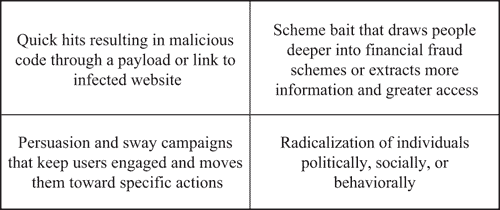
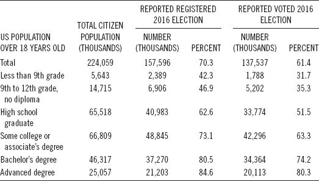
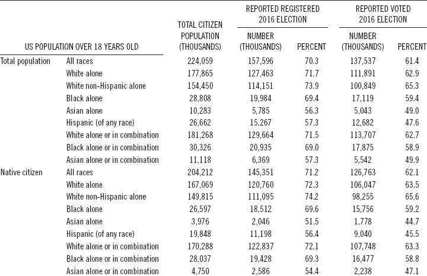
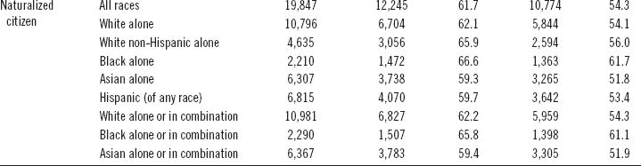

# 8

# 教育人们预防社会工程攻击

要防止社会工程攻击，主要的防御措施是防止垃圾邮件，要求代码运行系统的权限，并且是各种组织和政府机构提供的各种提示和建议。希望这些努力有助于减少社会工程攻击的数量和效果，但攻击仍在继续，每年造成数十亿美元的损失。因此，需要大大扩展向公众传授预防知识的努力，最重要的是应包括对抗虚假信息、错误信息和假新闻的准确信息，并且使用公正和准确的信息。这将需要利用所有沟通工具，以便向人们通报通过所有媒体传播的不准确或恶意材料。本章探讨了在试图防止社会工程攻击造成损害时，捍卫者面临的许多挑战，无论这些攻击源自圣彼得堡还是华盛顿特区。

## 8.1 社会工程攻击有各种形式和大小

对许多网站上提供的提示和建议进行审查，以帮助保护消费者，明显显示需要更大的努力使这些信息更加有用并且更广泛地传播。除了有用性和分发不足之外，大多数有关社会工程的提示和建议都相当肤浅。需要防御的社会工程攻击不止一种，而且单一的教育和意识建设方法是不够的。图 8.1 展示了人们可能成为受害者的四种社会工程攻击类型，结果只会给他们的生活带来一系列问题。

图 8.1 社会工程攻击类型。

本书的前几章详细介绍了许多不同类型的社会工程攻击和动机。为了帮助规划意识和教育计划，图 8.1 中显示的四类社会工程攻击可以作为教育工作者的规划和指导工具。通过电子邮件或链接到恶意网站的快速攻击肯定是最容易解释和防御的攻击，但仍然存在的问题是为什么这么多人仍然成为此类攻击的受害者。

诱饵攻击计划吸引人们深入欺诈计划或获取更多信息和更大系统访问权限是有效的，因为人们要么对此类攻击涉及的安全问题不太关注，要么陷入虚假承诺、贪婪或某种原始欲望中，希望点击链接提供的奖品。尽管有成千上万次关于此类攻击的警告，人们仍然年复一年地陷入陷阱。

说服和影响力攻击更加复杂，社会工程更加精密。对于阴谋内幕的承诺，或者有关名人或政治家的恶意文字或照片，让用户保持参与并推动他们朝着更具体的行动。这包括继续关注帖子或电子邮件以了解更多信息或看到更多内容，尤其是涉及情感话题如伊斯兰恐惧症、仇外症、种族主义、性别歧视或对自由主义者的仇恨时。这些攻击旨在尽可能长时间地让人们参与，并在可能的情况下将他们招募到一个类似思想的象征性团体或部落中。这种类型的攻击更难解释，因为人们是在回应他们的信仰，并被他们想要听到或看到的东西所吸引，而不是更加平衡的观点。

针对个人在政治、社会或行为上的激进化设计的社会工程攻击比说服攻击更加复杂，对那些具有对仇恨、种族主义、无政府主义、暴力和反社会行为倾向的人更加有效。这些攻击活动在过去几年中由伊拉克和叙利亚伊斯兰国、伊拉克和黎凡特伊斯兰国、伊斯兰国或伊斯兰国（ISIS）等组织所推广，他们努力招募支持者或战士，但俄罗斯在 2016 年选举前后对美国的社会工程攻击同样复杂，当然同样卑鄙。

除了了解社会工程攻击的类型之外，还很重要了解互联网用户群体如何根据社会、经济和教育特征分为多个部分。这些群体学习方式不同，保留信息的方式也不同，对安全问题的关注程度也不同。许多人在线工作时完全忽视安全问题。

## 8.2 需要教育的选民群体的多样性

使一刀切的意识或教育宣传失效的动力之一是人口的多样性。在 2014 年至 2020 年间，分裂和说服攻击在几个国家的选举中被广泛使用。这些攻击在某些人群中非常有效，而在其他人群中效果较差。在美国，随着教育程度的提高，选民的投票和登记率往往会增加。2016 年，美国至少拥有学士学位的公民的投票率为 76.3%，而没有获得高中文凭的公民为 34.3%。表 8.1 显示了 2016 年美国选民的多样化教育水平，而表 8.2 则显示了 2016 年选举期间，按种族、西班牙裔起源和出生地区划的本土化和归化公民的投票和登记情况。^(1, 2)

**表 8.1** 2016 年美国选民的教育水平多样性

*来源*：2016 年选举和登记。美国人口调查局。

**表 8.2** 2016 年本土化和归化公民按种族、西班牙裔起源和出生地区划的投票和登记

 

*来源*：2016 年选举和登记。美国人口调查局。

这些数据说明了学习风格的多样性，这是无法通过单一的一刀切的意识或教育计划来满足的。要与这些多样化的人群有效沟通，将需要多种沟通方式，也许需要用多种语言、方言和媒介进行沟通。人口普查数据显示，可能需要开发专门的意识计划的人口细分。

除了需要开发多种方法来教育选民如何识别来自竞选来源的可靠客观信息之外，还需要教育选民如何识别社会工程化的偏见新闻媒体和社交媒体活动。政客们会借助第一修正案来为他们使用虚假信息、误导性声明以及对自己才能和动机以及对手弱点的明显谎言辩护。保守派承认他们正在为权力而进行一场文化战争，并且不在乎他们是否撒谎、作弊、偷窃或玷污美国民主来取得胜利。因此，需要独立的组织领导教育工作，以应对社会工程化的政治信息传播，并提供替代的主导叙事。

美国选举援助委员会已与地方选举官员合作，制定了一系列有关选举管理的有用提示。该系列提供了提示并建议最佳实践，以帮助人们运行高效和有效的选举。选民教育项目影响选民投票率。精心策划的项目可以激励和鼓励公民参与选举过程。最重要的是，作为教育工作的一部分，应包括准确的信息，以抵制虚假信息、错误信息和假新闻，并得到可信声音的支持。应使用所有沟通工具来通知人们有关通过所有媒体传播的不准确材料。以下七个提示应有助于加强选民教育工作。³

+   提示#1：使用数据指导您规划选民教育工作的方法。您对选民了解得越多，您的方法就会越有效。记住不同的选民有不同的学习风格。了解如何最好地接触选民以对抗欺骗性营销，包括新闻源、网站、社交媒体、印刷媒体、广播、电视或面对面。通过收集和审查过去选举的数据来深入了解选民：

    +   未投票

    +   作废选票

    +   临时选票上的错误

    +   按选区的邮寄投票

+   提示#2：保持您的网站更新；经常审查和评估它。保持其新鲜和易于访问，具有突出的首页。为了使您的网站用户友好，确保具有干净、简单、视觉吸引人的呈现方式，避免用过多的图形和照片拥挤内容。用简单的语言写作，并链接到常见问题解答部分（FAQs），并突出对选民最感兴趣的常见问题解答。此外：

    +   在常见问题解答（FAQ）部分包括注册要求、投票地点以及提前和邮寄投票信息。

    +   强调任何影响选民的新法律或信息。

    +   发布一个包括截止日期和对选民具有特殊意义的日期的运营日历的简化版本。

    +   链接到提供针对各种类型选民的复杂主题的详细解释的网站。

    +   包括选举官员目录。

    +   提供帮助台的联系信息。

    +   如果您的法规允许，可以链接到候选人和政党的网站。

    +   请求非党派的公民和倡导团体、学校以及大学或大专院校链接到您的网站。

    +   为媒体创建一个新闻包。包括新闻稿、社交媒体帖子、库存照片以及您关于选举准备活动的任何视频。

    +   链接到有关投票率趋势和注册的历史数据。

    +   宣传您的选民教育活动。邀请媒体参加。

    +   使用适应性沟通工具，如增强字体和所有材料的音频格式，以满足视觉障碍选民的需求。

    +   记得经常更新您的网站。

    +   指定一名熟知情况的工作人员担任您的在线经理。

    +   为听力受损选民创建所有材料的电传打字机（一种供聋哑人、听力受损者或有严重言语障碍者使用的通讯设备）（TTY）格式。

    +   使您网站上的所有信息都对您司法管辖区的少数族裔语言团体可用，并提供书面和音频翻译。

    +   考虑聘请网页设计公司评估网站的可用性。

+   提示#3：尝试将社交媒体作为教育工具，包括 Twitter、Facebook、YouTube、移动应用和电子邮件，这可以帮助您接触到年轻和首次投票的选民。有效的社交媒体存在需要大量员工时间承担，但相比传统媒体方法可以节省大量成本。请指定知识渊博且热情洋溢的员工听取并适当回复选民的直接问题和评论。还有助于制作一个适用于 Facebook 页面的电子“我已投票”贴纸，并鼓励关注者使用它，并在选举日联系他们的关注者。最后，请要求无党派的公民和倡导团体、学校和大学在其网站上包含一个链接，以关注您的 Facebook 和 Twitter 办公室。

+   提示#4：依靠多种媒体，因为许多选民更容易从印刷品、电视、广播或广告中获得信息。鼓励当地媒体广泛报道您的选民教育活动。发布频繁的新闻稿，要求当地报纸将您的选民指南作为插页印刷，并倡导政治正确以帮助您的活动获得更多正面报道。此外，与当地广播、电视和公共广播电台联系，安排有关与选民利益相关的及时正面消息宣传活动的公益广告。使用教育性广告牌或与公共交通官员合作，在公共交通工具上放置标志也有助于此事。其他有用的行动包括：

    +   请咨询当地公用事业公司和政府办公室，了解在其定期邮件中插入选民教育传单的相关事宜。

    +   使用多种语言发布选民信息手册、手掌卡或书签的常规邮件。

    +   向您所在州的残疾人权利倡导办公室和代表残障公民的组织征求如何最好地接触残障公民的建议。

    +   向部落长和少数族裔选民以及少数族裔语言倡导团体征求关于以文化相关格式提供选民教育的适当方法的意见。

+   提示#5：给予选民个人关注，并使您和您的员工时刻了解所有选举法律、日期和程序，以便最好地帮助直接联系您项目的选民。您可以通过个人互动来协助选民，通过指派知识渊博的工作人员来帮助亲自访问您办公室的选民，并在您的办公室更新、提供和 prominently 显示的选民教育手册、手掌卡和书签的充足供应。

+   建立一个社区外展项目对公民团体、老年中心和退休院进行安排，并安排携带注册表格、教育手册、选举日历和投票系统演示到访老年中心。通过在长期护理机构开展项目来保持居民的参与并使其保持选民注册信息的及时性，与本地企业和行业组织、政府机构以及非党派倡导团体合作，将教育带给选民。

+   尽可能多地进行互动，并提供帮助学校、学院和大学进行模拟选举，在选民登记活动期间派遣志愿者演讲者，并向其他举办选民教育活动的团体提供您的投票设备、隐私展位和故障排除者进行演示，这些活动可以在您的场所或其场所举行。如果可能的话，在选民登记截止日期前几周建立临时卫星地点，提供选民信息和服务。如果可能的话，使用移动办公室访问购物中心、老年中心、图书馆和大学等人流量较大的地区。

+   Tip #6：为您管辖区域的选民创建一份选民工具包，其中包含必要的信息。在选民工具包中包括如何注册以及注册截止日期以及选民身份要求的信息。还包括投票日期、时间和时间、样票、选民指南、邮寄和邮寄投票选项、您的帮助台和工作人员的联系信息、您的网站地址，以及 Facebook 和 Twitter 的帐户名称。

+   Tip #7：跨平台协调教育，并利用多种不同格式的选民教育工具。例如，在网上和手册格式中提供您的选民工具包，通过印刷品、电子邮件、社交媒体和移动应用程序提供定期通讯，以及及时发布有关选民的文章和与选民相关的截止日期。通过电子邮件、Twitter 和 Facebook 帖子以及邮寄提醒选民即将到来的日期。此外，在您的网站上，提供选区地图和驾驶路线图，通过移动应用程序和在所有平台上链接到地图软件。

+   如有可能，提供有关如何投票、如何使用技术以及您的办公室如何确保选举结果安全准确的演示或教育视频。将这些演示上传到 YouTube 和其他电子渠道。³

## 8.3 通过教育互联网用户来中和点击诱饵

钓鱼或使用引诱人深陷金融欺诈计划或获取更多信息和更大系统访问权限的诡计，仍然是用于实施互联网犯罪的主要社会工程方法之一。有许多网站提供防范欺诈的提示，都在重申一个基本主题。Box 8.1 展示了向消费者传达打击在线欺诈计划的典型信息。⁴

Box 8.1 打击互联网犯罪的典型公共服务信息

钓鱼是指骗子使用假电子邮件、短信或山寨网站尝试窃取个人身份或个人信息，如信用卡号、银行账号、借记卡 PIN 码和账户密码。骗子可能会声称用户的帐户已被入侵，或者用户的某个帐户被错误收费。

基本信息通常随后跟随互联网用户应该谨慎的提示。虽然标准消息明确表述，但传达显然不够有效。如果美国，事实上，整个世界，真的要更成功地抵御社会工程攻击，将需要在教育工作中投入更多的努力。这可能需要一个与 20 世纪 50 年代和 60 年代汽车安全带使用相提并论的规模的运动，该运动持续至今。其他大规模的教育工作包括反吸烟、环境保护，如“不乱扔垃圾”和“不污染”，以及“怀孕时不要饮酒”。

美国教育部教育技术办公室（OET）的《国家教育技术计划》可能是解决方案的一部分。OET 制定国家教育技术政策，并确立技术如何用于改变教学和学习的愿景，以及如何通过 K-12、高等教育和成人教育实现全时全地学习。

OET 提出技术可以是转变学习的强大工具。它可以帮助确认和促进教育者与学生之间的关系，重新发明我们的学习和合作方法，缩小长期存在的公平和可访问性差距，并适应学习经验以满足所有学习者的需求。OET 认为，教育领导者应该设定一个愿景，创建提供正确工具和支持的学习经验，使所有学习者都能茁壮成长。此外，教育利益相关者应承诺跨组织和地理边界共同努力，利用技术改善美国的教育。OET 通过以下方式履行其使命：

+   促进利用技术实现变革性学习体验的平等获取权；

+   支持为州、地区和学校领导者以及教育工作者提供个性化的专业学习；

+   确保所有学习者在课堂上连接到宽带互联网，并在学校和家中获得高质量、负担得起的数字学习资源；

+   培育一个强大的企业家和创新者生态系统；以及，

+   领先的前沿研究，提供新型证据，并定制和改进学习。

国家教育技术计划（NETP）制定了一个通过技术实现学习的国家愿景和计划，通过借鉴领先的教育研究人员、地区、学校和高等教育领导者、课堂教师、开发人员、企业家和非营利组织的工作。计划中提供的原则和示例与《每个学生成功法案》（ESSA）授权的支持有效技术使用活动（第四章 A）一致，该法案于 2015 年 12 月由国会批准。自 2010 年 NETP 以来，美国在利用技术改变学习方面取得了显著进展：

+   对话已经从是否应该在学习中使用技术转变为如何利用技术改进学习，以确保所有学生都能获得高质量的教育体验。

+   技术越来越多地被用于个性化学习，让学生更多地选择他们学习的内容和方式以及学习的速度，为他们组织和引导自己的终身学习做准备。

+   学习科学的进步提高了我们对人们如何学习以及哪些个人和环境因素对他们的成功影响最大的理解。

+   研究和经验提高了我们对人们在 21 世纪生活和工作中需要了解的知识以及他们需要获得的技能和能力的理解。通过教师预备培训计划和专业学习，教育工作者正在获得使用技术实现学习成果的经验和信心。

+   先进的软件已经开始允许我们根据个体学习者的需求和能力调整评估，并提供几乎实时的结果。

+   在全国范围内，已经取得了确保每所学校都具有高速课堂连接作为其他学习创新的基础的进展。

+   数字设备的成本大幅降低，计算能力增加，高质量互动教育工具和应用程序的可用性也增加。

+   技术使我们能够重新思考物理学习空间的设计，以适应学习者、教师、同行和导师之间新的和扩展的关系。⁵

## 8.4 重新思考如何打包社会工程预防信息

教育中最大的挑战之一是理解人们学习的方式不同。人们学习的方式不止一种，这意味着必须有多种教学方法来有效地传达同样的信息以达到更多人。国家教育技术计划（NETP）正在努力推动多种学习模式与技术的结合。

个性化学习是指学习的速度和教学方法都针对每个学习者的需求进行优化的教学。学习目标、教学方法和教学内容（以及其顺序）都可能根据学习者的需求而变化。此外，学习活动对学习者有意义和相关，是由他们的兴趣驱动的，通常是自主发起的。

在混合式学习环境中，学习既在线上进行，也在线下进行，增强并支持教师的实践。这种方法通常允许学生对学习的时间、地点、路径或速度有一定的控制，包括使用视觉内容。在许多混合式学习模式中，学生在与老师的面对面时间中的一部分是在大群体中，与老师或导师的面对面时间是在小群体中，还有一部分时间是与同伴一起学习和相互学习的。混合式学习通常通过重新配置物理学习空间来促进学习活动，提供一系列优化了协作、非正式学习和个人学习的技术支持学习区域。

连通性的增加也增加了教导学习者如何成为负责任的数字公民的重要性。我们需要引导发展能够以有意义、有成效、尊重和安全的方式使用技术的能力。例如，帮助学生学会使用适当的在线礼仪，认识到他们的个人信息可能会在网上被收集和使用，并利用对全球社区的访问来改善周围的世界，可以帮助他们成功地应对一个连通世界中的生活。掌握这些技能需要对技术工具有基本的理解，并能够对其在学习和日常生活中的使用做出越来越明智的判断。

需要注意的是对早期教育技术研究的研究以及这些研究如何在未来更广泛地应用于学习。作为网络学习的一部分，美国国家科学基金会（NSF）正在研究将新兴技术与学习科学的进展相结合所提供的机会。以下是 NSF 作为该努力的一部分资助的项目的示例。

+   增加游戏和模拟的使用，让学生在不离开教室的情况下体验共同完成项目的经历：学生积极参与一种感到紧急的情况，必须决定要测量什么以及如何分析数据以解决一个具有挑战性的问题。在一个例子中，整个教室成为一个缩小版的地震模拟。当扬声器播放地震声音时，学生可以在房间的不同位置对模拟地震仪进行读数，检查新出现的断层线，并拉紧麻线以确定震中。另一个例子是机器人辅助语言学习（RALL-E），在其中学习汉语的学生与一台展示各种面部表情和手势的机器人交谈，配备了语言对话软件。这样的机器人将允许学生在没有说新语言的常规焦虑的情况下参与社交角色扮演体验。RALL-E 还鼓励文化意识，同时鼓励良好的语言技能使用，并通过实践来建立学生的信心。

+   新的连接物理和虚拟交互与学习技术的方式，将有形与抽象相结合：例如，有一个分子项目，学生可以操作分子的物理球棍模型，而摄像头可以感知模型并将其可视化为相关的科学现象，比如分子周围的能量场。学生与物理模型的有形互动与更抽象的概念模型相连，支持学生理解的增长。朝着类似的目标，小学生利用平板表面上的笔和代表性工具以及手绘草图，画出数学情境的图片，就像在纸上一样。与纸张不同的是，他们可以轻松地复制、移动、分组和转换他们的图片和表现方式，以帮助他们表达他们所学的数学知识。这些可以与老师共享，通过人工智能，计算机可以帮助老师看到草图中的模式，并支持老师将学生的表达作为强大的教学资源。

+   交互式三维成像软件正在创造潜在的变革性学习体验：学生通过三维眼镜和笔，可以使用从地球的层到人类心脏的各种图像。这种多功能技术允许学生使用学校通常无法负担得起的物体，从而提供更丰富、更吸引人的学习体验。

+   增强现实（AR）作为一种探索我们环境和历史的新方式：变革教育探索项目的研究人员探讨了 AR 技术可以用于支持批判性探究策略和过程学习的方式和目的。学生可以使用带有 AR 的移动设备增强他们在当地历史遗址的实地体验。除了体验现场的实际情况外，AR 技术还允许学生从几个社会角度观看和体验现场，并跨越几个时期查看其结构和用途。研究重点放在 AR 技术在基于探究的实地工作中的潜力上，对于分析时间变化在重要性上的学科，以促进对如何长时间内的非常小的变化可能会累积成非常大的变化的理解。⁶

合作伙伴关系，如教师培训项目与学区之间的合作，象征着我们需要在所有教育群体之间建立的合作关系的类型，如果我们希望将技术在学习中的应用从附加组件提升为教育体系的一个基本组成部分。技术不应该与内容学习分开，而应该被用来转变和扩展教师学习的前期和在职学习作为教师学习的一个组成部分。我们的教育体系继续看到在线学习机会和混合学习模式的显著增加。高等教育机构、学区、课堂教师和研究人员需要齐聚一堂，以确保从业者能够获取关于支持在线和混合空间学习的研究支持实践的当前信息，并了解新兴在线技术的最佳使用方式。⁵

## 8.5 防止个人激进化

互联网上社会工程学的最复杂模型是个人公民对其人民或政府的激进化以及他们加入暴力极端主义。ISIS 的招募和激进化模式是国际狂热分子如何利用社会工程将人们转变为进行暴力行为和犯下反人类罪行的激进分子的历史极端例子。

在反恐战争取得成功和逮捕了许多基地组织主要领导人后，该组织袭击美国本土的能力受到了削弱，但逐渐从完全由基地组织中央控制转变为更广泛的运动的逊尼派极端主义运动。基地组织和其他组织仍致力于攻击美国，并且也试图通过传播社会工程化的、暴力的、伊斯兰的、极端主义的宣传通过媒体和互联网来扩大他们在英语国家的西方穆斯林中的吸引力。美国人的伊斯兰激进化，无论是外国出生还是本土出生，都已成为一个日益关注的问题。美国境内存在着伊斯兰组织以及白人至上主义和其他国内仇恨和恐怖组织。成功阻止激进化扩散的关键在于识别早期阶段的模式和趋势。

联邦调查局将国内极端分子定义为看似已经同化，但实际上拒绝了美国文化价值观、信仰和环境的美国人。来自本土的极端分子的威胁可能规模较小，而不像基地组织等海外恐怖组织那样，但在心理影响上可能更大。自 2005 年以来，联邦调查局、其他联邦机构和外国合作伙伴已拆除了一个独立于任何已知恐怖组织的全球极端分子网络。与该网络有关的几个个人因在美国和其他国家策划恐怖袭击而被逮捕。涉及本土极端分子案件的增加似乎可能代表了执法对以前未被视为恐怖主义的活动敏感度增加，但我们不能排除本土现象和国内反社会团体以及国内狂热者日益普及的可能性。

互联网是一种让年轻的、精通计算机的西方人（无论男女）进行激进化的场所，他们认同极端意识形态的仇恨信息，并有时渴望参与意识形态冲突。在增加了执法审查的 9/11 后环境中，一代支持和同情暴力极端主义的年长支持者和同情者已将他们的激进化、招募和物质支持活动转移到了网上。通过互联网的激进化是参与性的，个人积极参与在网上交换极端主义宣传和言论，这可能有助于暴力极端主义事业和意识形态动机的暴力行为。这些在线活动进一步加强了他们的洗脑，建立了世界各地极端分子之间的联系，并可能成为未来恐怖活动的跳板。⁷

国内恐怖主义是由受到或与主要基于美国的运动相关联的个人和/或团体实施的，例如主张政治、宗教、社会、种族或环境极端意识形态的主权公民。例如，2014 年 6 月 8 日，拉斯维加斯枪击事件中，两名餐厅内的警察遭到伏击式袭击身亡，这是由一个持有反政府观点并打算利用枪击发动革命的已婚夫妇所犯下的。国内恐怖主义的威胁总体上仍然持续存在，行为者跨越了第一修正案保护的权利，以犯罪来推动他们的政治议程。三个因素促成了恐怖主义威胁格局的演变：

+   互联网：国际和国内行为者通过消息平台和社交工程化的在线图片、视频和出版物在互联网上建立了广泛的存在，这有助于这些团体激进化和招募接受极端信息的个人。这些信息不断地向参与致力于各种事业的社交网络的人们提供，尤其是那些习惯于在社交媒体环境中进行交流的年轻人。

+   社交媒体的使用：除了使用互联网外，社交媒体使国际和国内恐怖分子得以在虚拟空间中与居住在美国的人们取得前所未有的接触，以便实施国内袭击、支持招募和灌输努力。ISIS 特别鼓励支持者在所在地对目标，尤其是软目标，进行简单袭击，或前往伊拉克和叙利亚 ISIS 控制的领土并加入其作为外国战士的行列。这一信息在美国和国外的支持者中引起共鸣，最近几起袭击者声称是代表 ISIS 行动。

+   本土暴力极端分子（HVEs）：FBI 必须确定那些在美国内部激进化并成为 HVEs 的同情者，他们渴望从内部对国家发动袭击。FBI 将 HVEs 定义为在美国境内的全球圣战受启发个人，他们主要在美国激进化，并且没有直接与外国恐怖组织合作。目前，FBI 正在调查每个州中疑似的 HVEs。

2019 年 2 月，白宫发布的一项政策声明承认，美国公众日益依赖互联网进行社交、商务交易、获取信息、娱乐以及创建和分享内容。互联网的快速增长带来了机遇，但也存在风险，联邦政府致力于赋予公众成员保护自己免受包括网络极端主义在内的全部网络威胁的能力。

暴力极端主义的至上主义团体和暴力主权公民正在利用在线工具和资源传播社会工程学的暴力和分裂信息。这些团体利用互联网传播宣传，识别和培养潜在的招募对象，并补充他们现实世界的招募工作。这些团体的一些成员和支持者访问主流社交媒体网站，看看是否有人可能被招募或鼓励实施暴力行为，寻找将目标吸引到私人交流中的机会，并利用流行媒体，如音乐视频和在线视频游戏。尽管互联网为美国人提供了无数连接机会，但它也为暴力极端主义者提供了接触新受众和进行极端化的工具。

作为防止国内发生网络极端主义暴力的起点，联邦政府将重点关注提高对威胁的认识，并向社区提供实用信息和工具以确保在线安全。在这个过程中，美国政府计划与科技行业密切合作，考虑可以帮助对抗网络暴力极端主义的政策、技术和工具。公司已经制定了促进互联网安全的自愿措施，例如欺诈警告、身份保护和互联网安全提示。

这种方法与帮助社区免受一系列在线威胁，如网络欺凌、诈骗者、帮派和性侵犯者的互联网安全原则一致。虽然每种威胁都是独特的，但经验表明，一个了解充分的公众，配备了在网上保持安全所需的工具和资源，对于保护社区至关重要。追求这样的方法也与《赋予当地合作伙伴防止美国发生暴力极端主义》和《赋予当地合作伙伴防止美国发生暴力极端主义战略实施计划》中概述的基于社区的框架一致。

为了更有效地组织工作，美国政府计划成立一个针对网络激进化暴力的跨机构工作组，于 2013 年初成立，由白宫国家安全工作人员主持，涉及来自美国各部门的反对暴力极端主义专家、互联网安全专家以及公民自由和隐私从业者。该工作组将负责制定实施互联网安全方法以应对网络暴力极端主义的计划，协调联邦政府的活动，评估实施计划的进展，并确定进一步采取的行动来对抗网络激进化暴力。该工作组将与联邦部门和机构合作，主要通过三种方式提高对网络暴力极端主义的认识并传播保持安全的工具。

首先，关于网络暴力极端主义的信息将被纳入现有的联邦政府互联网安全倡议中。教育部、联邦调查局（FBI）、联邦贸易委员会（FTC）、国土安全部（DHS）和其他机构的互联网安全倡议已经覆盖了数百万美国人，并且相关部门和机构将努力添加与网络激进化相关的材料。

提高对互联网安全意识的主要政府平台是由 FTC 管理的 OnGuard Online，涉及 16 个部门和机构，包括 DHS、司法部（DOJ）和教育部。OnGuard Online，除了其他联邦政府的互联网安全平台如 Stop.Think.Connect 和 Safe Online Surfing（SOS）外，还将开始包含关于网络暴力极端主义的信息。这些信息还将发布在国土安全部网站的反制暴力极端主义主页上，并根据新的最佳实践和研究进行更新。

第二，联邦政府将与全国各地的地方组织合作，传播有关威胁的信息。联邦政府互联网安全意识工作成功的一个原因是他们与地方组织密切合作，如学区、家长教师协会、地方政府和执法部门，向社区传达信息。执法部门在提高有关激进化暴力的意识方面尤为重要，并且已经得到司法部的支持正在制定相关资料。执法部门和机构已建立了互联网安全项目和与社区成员以及地方组织的关系，可以向多个受众提供关于在线暴力极端主义和招募威胁的重要信息。各部门和机构将向地方合作伙伴提供有关这一威胁的最新评估，并鼓励他们将这些信息纳入他们的项目和倡议中。

第三，各部门和机构将利用与社区的既有合作，提供关于网络安全的信息以及有关极端暴力分子如何利用互联网针对和利用社区的细节。全国各地的美国联邦检察官，他们历来在一系列公共安全问题上与社区合作，正在协调这些联邦层面的地方参与工作，得到其他部门和机构的支持，例如国土安全部、卫生与公众服务部（HHS）和教育部。美国联邦检察官和其他参与社区参与的人员将努力将有关互联网激进化暴力的信息纳入他们的工作中，视情况而定。与此同时，联邦政府将与州、地方和部落政府以及执法官员进行合作，借鉴他们在应对在线威胁，包括暴力极端主义方面的经验。

随着联邦政府实施这一努力，各机构将继续调查和起诉那些利用互联网招募他人策划或实施暴力行为的人，同时确保他们继续维护个人隐私和公民自由。预防网络激进化暴力既需要积极主动的解决方案来减少暴力极端分子影响目标受众的可能性，也需要确保法律得到严格执行。 ⁹

## 8.6 FBI 儿童

FBI 在为儿童提供网络安全教育方面表现出色的领域是儿童安全。考虑到互联网上潜在的许多危险，从儿童捕食者到网络欺凌者，从恶意软件到各种骗局，年轻人从小就学会网络安全的重要性。这正是为什么联邦调查局在 2012 年 10 月推出了 FBI 安全在线冲浪互联网挑战赛，并配有一个专门的新网站。FBI-SOS 是一个免费、有趣且信息丰富的计划，通过教育三年级到八年级的学生掌握在线安全的基本要点，促进网络公民意识。对于教师来说，该网站提供了一个符合州和联邦互联网安全法规的现成课程，包括在线测试和一个鼓励学习和参与的全国比赛。一个安全的在线系统使教师能够注册他们的学校，管理他们的班级，自动评分他们的学生考试，并请求考试成绩。

FBI-SOS 网站（[`www.fbi.gov/fbi-kids`](https://www.fbi.gov)）设有六个岛屿，每个年级一个，包含适合各年龄段的游戏、视频和其他互动材料。该网站涵盖了手机安全、个人信息保护、密码强度、即时通讯、社交网络和在线游戏安全等主题。视频包括那些面对网络欺凌者和网络捕食者的孩子们的真实故事。

FBI-SOS 包括全国各地学校之间的月度比赛。根据参与学生人数分为三个类别。每个类别中得分最高的十名学校每月在排行榜上展示。在可能的情况下，每个类别中的获胜学校将接待当地的 FBI 特工。过去几个学年，SOS 在线网络计划的受欢迎程度已经增长，如表 8.3 所示。

**表 8.3** 完成 SOS 计划的学生

| 学年 | 学生人数 |
| --- | --- |
| 2012–2013 | 24,475 |
| 2013–2014 | 75,377 |
| 2014–2015 | 275,656 |
| 2015–2016 | 497,248 |
| 总计 | 872,756 |

一旦教师的账户得到验证，他们将收到一封带有独特 URL 的电子邮件，以管理他们的班级，并附有进一步的说明。链接永不过期，因此他们不需要每年注册 FBI-SOS。一旦注册，他们可以为每个学生创建班级和访问测试密钥。FBI 不会存储任何关于学生的信息，因此教师有责任创建测试密钥并跟踪分配给每个学生的测试密钥。学生将通过各种适合其年级的岛屿上的各种游戏和活动进行导航。当学生完成最后一个活动时，他们可以点击“参加考试”冲浪板参加考试。

此时，学生应确信他们已准备好完成考试，因为考试只能进行一次。学生需要输入分配给他们的访问密钥才能参加考试。一旦班级中的所有学生完成了测试并教师点击了“评分”按钮，考试就会自动评分。测试结束后立即显示每个学生的得分和任何错误答案的列表的临时网页。教师可以要求学生打印和保存此网页，和/或通过班级管理系统要求每个班级的考试结果。班级结果显示测试密钥的个人得分。

各个学校的总分与全国其他类似班级规模的学校的结果进行比较，作为全国月度竞赛的一部分。不同类别由每个学校参与的学生人数确定：Starfish 为 1–50 名参与者，Stingray 为 51–100 名参与者，Shark 为 100+名参与者。每个类别在一个月内的前十名分数可以在排行榜上查看。除了在排行榜上显示的内容外，FBI 不会保留或分发全国学校的排名。排行榜在每个月结束时重置。

每个月从 9 月至 5 月的每个参与类别中得分最高的学校将获得 FBI-SOS 证书。获奖学校的教师还提供证书，他们可以填写并分发给每个学生。对于非获奖学校或学生，没有参与证书。可能的话，每个月每个类别的获奖学校将接待一位当地 FBI 特工。学校每年只能参加一次比赛。

在教室或家中任何时候都可以访问 SOS，学生可以按自己的节奏完成岛屿活动和考试。然而，请记住，更快地完成考试会产生更高的分数。活动不需要一次完成。虽然 FBI-SOS 网站全年可访问，但测试和竞赛仅在 9 月 1 日至 5 月 31 日进行。夏季月份没有测试。

FBI-SOS 的目标是促进网络公民意识，帮助学生在参与有趣的互动游戏的同时学习在线安全知识。该项目旨在应对当前的网络安全威胁，同时考虑到每个年级水平的在线使用和知识。

还有一个名为“不要成为傀儡：揭开暴力极端主义的面纱”的青少年反对暴力极端主义（CVE）FBI 意识项目。 FBI 的主要责任是与众多合作伙伴合作，保护国家免受暴力极端分子的攻击。其中一个重要的做法是从一开始就阻止年轻人接受暴力极端主义意识形态。

这个网站就是为了帮助实现这一目标而设计的。由联邦调查局与社区领导人和其他合作伙伴协商建立，它使用一系列互动材料来教育青少年了解暴力极端主义的破坏性质，并鼓励他们批判性地思考其信息和目标。该网站强调，通过盲目接受激进意识形态，青少年实质上成为了暴力极端分子的傀儡，他们只是希望他们执行他们的破坏性任务，这通常包括针对或杀害无辜人群([`www.fbi.gov/cve508/teen-website`](https://www.fbi.gov))。

联邦调查局鼓励全美各地的社区团体、家庭和高中使用该网站作为他们教育工作的一部分。所有美国人都被要求与联邦调查局一起揭露暴力极端主义宣传的诱人性质，并提供对暴力的积极替代方案。该网站有五个主要部分，每个青少年都必须完成才能成功完成该程序：

+   什么是暴力极端主义？

+   为什么会有人变成暴力极端分子？

+   已知的暴力极端组织有哪些？

+   暴力极端分子是如何取得联系的？

+   暴力极端分子对谁产生影响？

完成前五个部分后，青少年被要求回顾最后一个部分《寻求帮助的地方》，然后打印并手动签署一份完成证书。联邦调查局将使用证书链接作为度量工具来计算成功完成该程序的人数，但在这样做时不会跟踪或存储任何用户信息。该程序包括一些有关美国宪法第一修正案保障的自由和这些自由的限制的一般信息。联邦调查局建议在开始该程序之前，教师对这一主题进行更深入的讨论。联邦调查局还建议，在青少年使用该网站或完成该程序后，教师可供讨论材料。其他组织也可以考虑将该网站纳入安全简报和反欺凌计划中。

教师强调，该节目中呈现的暴力极端主义例子代表了边缘意识形态，不应与任何主流宗教、族裔或政治团体的信仰混淆。提供适当的背景信息是重要的，以确保没有人会利用该节目的材料来欺凌或排斥他人。

本网站在少年关闭网页浏览器或关闭计算机后不会保留其在程序中的进度。因此，该程序必须在一个会话或一次坐下中完全完成。该网站的一个部分包含通过 YouTube 流式传输的视频。如果一个组织在其计算机上阻止了 YouTube，请确保在青少年开始在线程序之前解除此限制。不需要注册即可使用本网站。FBI 不会在此网站中接受或存储任何姓名或其他可识别个人信息。¹⁰

2017 年 11 月 30 日，代理国土安全部部长伊莲·杜克宣布将社区合作办公室（OCP）转变为反恐预防合作办公室（OTPP）。OTPP 的使命是增强关于威胁的教育和社区意识，根据需要向反恐预防利益相关者提供资源，协调相关的国土安全部反恐预防活动，积极对抗恐怖主义的激进化和招募，并促进及早警告，以便前线防御者能够干预并阻止袭击，并帮助阻止个人走向暴力之路。OTPP 是联邦、州、地方、部落和领土层面合作伙伴提高效率的主要领导、创新和支持来源。它还利用国土安全部的资源和关系，并应用部长的个人领导力，赋予公共和私营部门领导者推动社会变革以对抗暴力极端主义的能力。

OTPP 实施全方位的合作伙伴关系，支持和增强执法机构、宗教领袖、地方政府官员和社区防止恐怖组织激进化和招募的努力。OTPP 还为这些利益相关者提供培训和技术支持，以制定支持具有韧性社区的 CVE 预防计划。OTPP 以以下目标领导部门的 CVE 任务：

+   社区参与。OTPP 与民权和民事自由办公室合作，促进社区参与，建立意识，并与社区合作伙伴进行对话，包括与国土安全部高级领导层的接触。

+   领域支持扩展和培训。OTPP 支持全国各地的国土安全部现场工作人员发展和加强当地合作伙伴关系，并提供培训机会。

+   资助支持。OTPP 与联邦紧急事务管理局（FEMA）合作，为 2016 财年反对暴力极端主义资助计划下的社区项目提供 1000 万美元的资助。这些项目的执行期限延续至 2019 年 7 月。

+   慈善参与。OTPP 与慈善界合作，最大化支持当地社区，并鼓励长期合作伙伴关系；

+   科技行业的参与。 OTPP 与科技行业合作，以识别和放大网络上的可信声音，并推广反对激进化和暴力极端主义信息的对抗叙事。 ¹¹

## 8.7 结论

防止社会工程攻击成功需要计算机用户保持警惕并养成安全的互联网习惯。各种组织和政府机构提供的提示单虽然在减少社会工程攻击的数量和有效性方面确实有所帮助，但全球数百万人仍然成为受害者，这清楚表明教育工作需要得到大力扩展和现代化。

## 8.8 要点

本章涵盖的要点包括：

+   存在几种不同的社会工程攻击方法和目标，这使得意识宣传活动和教育计划的开发具有挑战性。

+   除了有用性和分发不足之外，大多数关于社会工程攻击预防的提示单和建议都是乏味、肤浅且不够有效。

+   一刀切的教育和意识建设方法不足以教导人们抵御社会工程攻击。

+   说服和影响力攻击更加复杂，社会工程更加精密。

+   针对个人在政治、社会或行为上激进化的社会工程攻击对那些具有对仇恨、种族主义、无政府主义、暴力和反社会行为倾向的人更有效。

+   需要教导选民如何识别社会工程偏见新闻媒体和社交媒体活动，以便教育他们如何识别来自竞选来源的可靠客观信息。

+   如果美国，事实上，全世界，要真正努力抵抗社会工程攻击，就需要在教育事业上付出更多的努力。

+   人们学习的方式不止一种，这意味着必须有多种教授相同信息的方式，以有效地触达更多的人。

+   个性化学习是指学习的速度和教学方法针对每个学习者的需求进行优化的教学。

+   在混合学习环境中，学习在线和面对面进行，增强和支持教师实践。这种方法通常允许学生在学习的时间、地点、路径或速度上有一定的控制，包括使用视觉内容。

+   互联网上最复杂的社会工程模型是个人公民对其人民或政府的激进化，以及他们被招募加入暴力极端主义。

## 8.9 研讨会讨论主题

研究生或专业级研讨会的讨论主题包括：

+   在研讨会参与者中，有哪些人在自己或他们认识的人成为社会工程攻击的受害者时有过什么经历？他们是如何从攻击中恢复的？

+   讨论参与者对互联网上建议人们如何预防社会工程攻击的信息持有的观点。

+   讨论为什么参与者认为政府为什么不投资更多来教育人们有关图 8.1 中呈现的各种社会工程攻击类型。

## 8.10 研讨会小组项目

将参与者分成多个小组，每个小组花 10 到 15 分钟时间制定一份关于如何教育人们有关图 8.1 中呈现的社会工程攻击类型的方法清单。完成后，让小组交换他们的方法清单，并花 10 到 15 分钟时间批评和综合清单。作为一个班级见面讨论，讨论在查看其他小组清单后，小组原始清单可能如何被修改。

### 关键术语

+   替代性主导叙事：旨在通过提供一个完整的文化、政治或社会哲学来取代暴力极端主义叙事，从而消除极端主义叙事的吸引力。

+   反信息传播：是一种将激进极端主义信息与之对抗的过程，以减轻对暴力极端主义的招募和激进化。

+   反对激进化的反叙事：是一种中和或使设计用来激进化个人或团体的叙事无效的叙事。

+   可信声音：是那些受信任的社区领袖、宗教领袖和知识分子的声音，他们可以对社会或社区产生积极影响。

+   欺骗性营销：是误导人们关于产品、服务或公司活动真实事实的广告或宣传。

+   虚假信息：是为了欺骗而提供的虚假和无关信息。

+   国内反社会团体：是一群人或小型社会，他们反对他们生活和/或工作的更大社会。

+   国内狂热分子：是居住在他们杀害、破坏或传播仇恨和恐惧的国家的激进团体。

+   仇恨信息：是社交媒体帖子，使用恶劣的语言嘲笑或歧视少数民族或种族群体。

+   意识形态冲突：是由激进团体对主流社会和少数群体发动的冲突。

+   意识形态动机的暴力：是个人或团体对目标实施的暴力，因为他们相信这些个人或团体在某种程度上是劣等的，应该受到伤害或消灭。

+   国际狂热分子：是与他们周围世界极度不同的个人、人群或小型社会，他们的信仰系统与他们生活的更大现实完全脱节，并倾向于以暴力方式或在政治上或经济上具有破坏性的方式表现出这些差异。他们是跨越边界的激进团体的成员，或者影响其他国家的个人或团体去杀人、破坏或传播仇恨和恐惧。

+   新闻动态：是 Facebook 上不断更新、高度个性化的故事列表，包括状态更新、照片、视频、链接以及与个人在 Facebook 上连接的人和事物的活动。新闻动态的目标是向人们展示最相关的故事。

+   政治正确性：使用非偏见性、非歧视性的词语、短语或图像来传达思想或信息。

+   积极信息推广活动：是促进积极社会行为并抵制负面信息的活动。

+   极端化：是将先前非暴力个人或团体灌输进反社会暴力意识形态和行动的过程。

+   招募和灌输：是吸引人们加入一个事业并教授与事业相关的教义的过程。

+   社交媒体存在：是组织利用社交媒体账户和应用程序与个人或团体沟通，以及在任何社交媒体应用程序上提及、评论、讨论和展示与组织相关的任何材料。

+   主权公民：是反政府极端分子，他们相信即使他们身体上居住在这个国家，他们与美国是分开的或“主权”的。因此，他们认为他们不必向任何政府当局负责，包括法院、征税实体、机动车部门或执法部门。

+   视觉内容：是添加到社交媒体帖子中的任何照片、视频或插图。

## 参考文献

+   1\. 2016 年投票和登记。美国人口调查局。访问日期为 2019 年 2 月 26 日。[`www2.census.gov/programs-surveys/demo/tables/voting/UnitedStates.xlsx`](https://www2.census.gov)

+   2\. 报告的原住民和入籍公民的投票和登记情况，按种族、西班牙裔血统和出生地区：2016 年 11 月。访问日期为 2019 年 2 月 26 日。[`www2.census.gov/programs-surveys/cps/tables/p20/580/table11.xlsx`](https://www2.census.gov)

+   3\. 加强选民教育计划的 7 个提示。美国选举援助委员会。2014 年 7 月。访问日期为 2019 年 2 月 26 日。[`www.eac.gov/assets/1/28/EducatingVoters%5B3%5D-508%20Compliant.pdf`](https://www.eac.gov)

+   4\. 网络安全。美国政府。访问日期为 2019 年 2 月 27 日。[`www.usa.gov/online-safety#item-37272`](https://www.usa.gov)

+   5\. 美国教育部国家教育技术计划。美国教育部，教育技术办公室（OET）。访问日期：2019 年 2 月 28 日。[`tech.ed.gov/netp/#`](https://tech.ed.gov)

+   6\. 第 1 节：通过技术参与和赋权学习。美国教育部国家教育技术计划。美国教育部，教育技术办公室。访问日期：2019 年 2 月 28 日。[`tech.ed.gov/netp/learning/`](https://tech.ed.gov)

+   7\. 唐纳德·范·达因副助理主任的证词，美国联邦调查局反恐怖主义处。在国会国土安全委员会情报、信息共享和恐怖主义风险评估小组之前。华盛顿特区，2006 年 9 月 20 日。访问日期：2019 年 3 月 1 日。[`archives.fbi.gov/archives/news/testimony/islamic-radicalization`](https://archives.fbi.gov)

+   8\. 恐怖主义。美国联邦调查局。访问日期：2019 年 3 月 1 日。[`www.fbi.gov/investigate/terrorism`](https://www.fbi.gov)

+   9\. 青少年在线安全：致力于反对美国的网络激进化暴力。Youth.gov。访问日期：2019 年 3 月 1 日。[`youth.gov/feature-article/online-safety-youth-working-counter-online-radicalization-violence-united-states`](https://youth.gov)

+   10\. FBI 儿童专区。美国联邦调查局。访问日期：2019 年 3 月 2 日。[`www.fbi.gov/fbi-kids`](https://www.fbi.gov).

+   11\. 反恐怖主义防范合作伙伴关系。国土安全部。访问日期：2019 年 3 月 2 日。[`www.dhs.gov/terrorism-prevention-partnerships`](https://www.dhs.gov).
