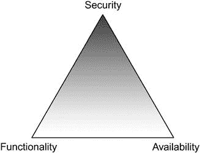

# 第二章：企业安全链中的薄弱环节

加文·沃森，RandomStorm 有限公司高级安全工程师

公司更愿意投资于防御技术，而不是开发人员意识培训和加强政策和流程，这种情况仍然非常普遍。本章将解释为什么采取这种方法，为什么这种方法不够有效，并清楚地描绘公司实际上有多脆弱。

### 关键词

数据分类；客户服务心态；薄弱的意识和培训；薄弱的政策；薄弱的流程；最薄弱的环节

本章信息

• 为什么人员是最薄弱的环节

• 利用易受攻击的用户保护数据

• 特权的问题

• 数据分类和知情需求

• 安全性、可用性和功能性

• 客户服务心态

• 糟糕的管理示例

• 缺乏意识和培训

• 薄弱的安全政策

• 薄弱的流程

## 介绍

读者现在已经了解了社会工程的概念，以及使用真实和虚构的例子的各种技术。本章现在专注于社会工程对企业的威胁。

利用易受攻击的人员获取敏感信息的想法可能看起来相当明显。如果一个攻击者尽管尽了全力，仍然无法攻击存储、处理或传输敏感数据的系统，因为有强大的技术安全控制，那么他们可能会攻击使用该系统的个人。

严酷的现实是，犯罪分子或敌对个人或团体越来越意识到，最有效的攻击方法是利用人为因素，而不是采用往往昂贵且困难的技术攻击。

将这一点放入背景中，一个犯罪组织可能会被吸引入侵一家一级商户的网络（每年处理超过 600 万笔卡交易），并非法提取存储在其中的付款卡数据。对于犯罪分子来说，这些提取的数据的价值起始于每张付款卡记录约为$4（在各种非法网络聊天室上出售）—$2400 万，或用于购买大量商品，在黑市上出售（例如，600 万×$50 购买—价值$3 亿的商品），以每件$30 的折扣出售—$1.8 亿。

考虑到这一点，通过利用人性的漏洞，用一个微笑就能轻松获得对这些数据的访问的吸引力是易于理解的。

然而，如果这个概念如此明显，为什么企业和他们的人员继续忽视这一点，使自己处于脆弱状态呢？简单的答案是，虽然理解了社会工程的概念，但个人脆弱的各种原因并不一定那么直截了当。人员不可能仅仅听说社会工程就决定避免成为其受害者。虽然第三章将讨论利用人性的各种方式，但本章将集中讨论因业务本身的缺陷而影响员工的脆弱性。这类业务问题甚至可以使最警觉的个人也容易受到社会工程的攻击。

接下来的章节将探讨这些问题，涵盖企业在社会工程和安全方面面临的一些最重要挑战。这些挑战包括如何保护敏感信息但又允许人员访问它，审查安全、可用性和功能之间的问题关系。将就数据分类、需要知道、过度权限、客户服务心态以及缺乏有效的安全意识和培训与社会工程之间的关系进行探讨。

本章将通过探讨由于弱政策和程序或过于具体或模糊的程序而引起的社会工程漏洞，以及如何滥用权威使原本强大的政策完全无效来结束。

## 为什么人员是最薄弱的环节

“人是你安全体系中最薄弱的环节”这句话经常被安全专家使用。然而，企业继续忽视或忽略这个简单的概念。为了充分探讨这个观点，我们将以一个名为“弱点公司”的虚构企业为例。

有一天早晨，弱点公司的人员来到办公大楼前解锁前门并升起百叶窗。进入后，他们输入正确的代码以停用主要警报。他们爬楼梯到达主要办公室，并再次输入代码以访问电子门禁系统。因此，每天早晨人员需要穿过四层不同的安全控制，这对攻击者来说肯定是一个相当大的挑战。这种控制是企业中最重要的投资之一。

一名攻击者决定闯入“易受攻击公司”的主要办公室，窃取包含敏感和有价值信息的笔记本电脑。在对各种安全控制进行快速检查后，他们选择爬梯子，通过砸破窗户进入。这样一来，他们立即绕过了三项安全控制，只剩下主警报系统。这让他们在任何人可能调查警报声之前有限的时间内，抓住几台笔记本电脑和各种敏感文件。在这种情况下，企业通常的反应是在物理控制上投入更多资金，这可能非常有效。在这里，企业可能决定安装高安全窗户，安装闭路电视系统，安全家具或其他机制，以帮助防止攻击者破坏窗户和/或窃取笔记本电脑。

现在假设攻击者想要避免引起任何警报，更倾向于避免混乱的“砸砸抢”方式。相反，他们打扮得与员工相匹配，复制一个假员工徽章，并在繁忙的午餐时间尾随员工进入场所，通过拿着一个超市购物袋，就像其他人一样。攻击者成功地漫不经心地走过接待处，与其他人员融为一体。当没有人注意时，攻击者在办公室四处走动，将各种笔记本电脑放入袋子中，安装几个键盘记录器，并从打印机上抓取一些文件，然后返回。所有这些直到午餐后人们回到他们的桌子继续工作时才被发现，即使在那时，直到有人提出可能发生了盗窃，这仍然是一个谜。这种情况展示了社会工程攻击的一个极其简单的例子。他们没有直接操纵任何人或从员工那里获取任何信息。相反，他们创造了一个似乎合理的情况，并间接操纵了人们的感知。旁观者相信攻击者是公司员工的一员，这一点通过徽章、服装、自信的步态、购物袋以及与其他人员融为一体来验证。这种攻击非常有效，企业可能毫无准备地应对这种情况。对这种事件的典型反应是匆忙部署一个无效的全公司安全意识计划。也就是说，如果有任何反应的话。这是可以理解的，考虑到大多数公司可能更倾向于保持这种事件非常低调。

企业为什么将安全预算投入错误的领域？原因在于：当攻击者打破窗户时，解决方案很简单，实施物理解决方案（更坚固的窗户）。然而，当攻击者诱使员工透露信息或允许他们进入受限区域时，解决方案就不那么明显了。问题在于物理安全漏洞是有形实体；它们可以直接互动并解决。然而，社会工程漏洞是“无形”的，比如与人类本性或弱弱程序相关的漏洞。大多数企业对减轻无形安全问题的风险方法并不熟悉。解决方案通常涉及深度防御方法，可能涉及多种直接和间接策略。

在企业甚至开始制定有效的防御策略之前，他们首先需要充分了解为什么他们的人员是安全链中最薄弱的环节。

当试图解释为什么员工容易受到这种攻击时，很容易归咎于人类本性；“*他们太容易受骗了，他们会相信任何事情*”。然而，企业本身往往存在许多安全弱点，这些弱点转化为与员工相关的弱点。

在指责员工之前，最好先从业务流程中的弱点入手。

### 有脆弱用户的安全数据

存储在系统中的敏感数据永远无法完全安全。然而，为了探讨易受攻击的员工概念，让我们假设发明了一个无法被未经授权用户渗透的数据库。黑客可以探测该服务，他们可以看到它可用，但无论他们如何努力，他们都无法访问数据。直接攻击这个数据库根本不是一个可行的选择。因此，与其直接攻击数据库，唯一的其他方法就是攻击与该数据库交互的实体。

当将视角从直接攻击系统转变为攻击使用系统的人时，利益变得非常有趣。在上述数据库示例中，攻击者可能试图欺骗该用户透露其数据库凭据或以其他方式访问数据库。然而，尽管这可能是主要目标，但不一定是实现这一目标的最佳方式。例如，攻击者可以试图欺骗用户代表自己访问数据库并透露其中的信息，修改某些信息，甚至删除部分信息。与直接获取访问数据库所需信息相反，用户可以成为与数据库交互的木偶。只要攻击者的借口足够好，用户可能会在毫不知情的情况下执行这一操作，从而造成安全漏洞。攻击者可能会在不引起任何警报的情况下实现他们的目标，因为这种成功的攻击非常难以检测。

把用户视为木偶能够真实地展现出其影响范围，显著扩大了安全考虑的范围。同一个数据库用户很可能可以访问公司的电子邮件服务、工作站、企业专有软件以及诸如文件共享之类的一般内部网络资源。除了数据库凭据外，他们可能还了解员工层次结构、门禁代码、钥匙位置、建筑布局、员工喜欢的酒吧、所使用的设备、敏感或关键信息，甚至是首席执行官喜欢喝的咖啡，仅举几例。

上述个人很可能拥有足够的知识和特权，无意中损害了业务。因此，妥协了这名员工就相当于给攻击者打开了“王国的大门”。如果他们能有效地操纵这名员工，那就等于在内部找到了帮手，这就是所谓的“内部工作”。

当考虑到一个企业可能有数百甚至数千名员工属于这一类别时，问题就会升级。此外，一个全面的安全漏洞往往是由于一个员工成员被成功地针对而导致的。以这种方式看待问题似乎几乎是无法解决的，攻击者的胜算肯定是占据优势的。

通过让每个员工了解敏感信息，使其能够访问敏感服务并让他们进入敏感区域，企业实际上是在为他们的员工挂上了象征性的标靶。企业正在把每一个固有脆弱的员工变成一个极有价值的目标；通过企业本身的各种安全漏洞使他们变得更加脆弱。因此，社会工程攻击之所以如此有效，也就不足为奇了。

### 特权的问题

为了使企业正常运作，必须向每个员工授予某些特权。这是不可避免的，总会有那些由于其工作性质而被认为是高价值目标的个体以及被认为是低价值目标的个体的需求。然而，特权真正对企业对社会工程的易受攻击性产生了多大影响？或者换句话说，员工对社会工程师的实际价值是什么？企业在考虑社会工程威胁时是否应该以某种特定方式处理特权？

分配给员工的特权越大，他们对企业的风险就越大。很明显，员工可以访问的服务和数据越多，他们可能造成的损害就越大。重要的是要记住，绝大多数攻击都是内部工作，无论是故意还是意外。仅从这个角度来看，审慎考虑是否授予员工太多特权是明智的。

大部分员工被授予太多特权，仅仅是为了避免业务中断的事实是现实。人员成员请求访问某项服务或信息，并且没有考虑避免一些繁琐的程序，IT 部门就授权了。通过这样做，企业正在逐渐将每个员工都转变为更大的威胁，无论是从内部攻击的角度还是该员工被社会工程师妥协的潜力角度来看都是如此。

社会工程师会瞄准特权用户吗？也许会，尤其是如果他们直接访问目标数据。然而，非常重要的一点是要明白，社会工程师会选择最不费力的路径。因此，将所有安全控制和培训都放在你最高特权的员工身上可能会被证明是一次毫无价值的冒险。

假设一个社交工程师想要访问敏感的病人记录。他们应该针对外科医生还是针对护士？外科医生可以直接访问数据。但是，他们可能接受过额外的特定培训，了解何时可以以及何时不可以讨论这些敏感信息。对外科医生进行社交工程攻击当然是可能的，也许通过对家庭成员或同事进行精心伪装。然而，这需要大量的计划。护士可能更容易受到攻击，但根本无法访问病人记录。但是，护士可以访问存储这些记录的计算机系统。只需向每位主任护士发送一个精心设计的钓鱼电子邮件可能就足够了。任何点击恶意链接的护士可能会无意中为攻击者创建一个“后门”，从而访问网络。提升权限后，敏感数据就可以被访问，而无需与外科医生互动。通过他们的工作性质，外科医生拥有较高的权限，而护士拥有相对较低的权限，但这并不真正妨碍了犯罪者。事实是，通过对 20 位主任护士进行钓鱼攻击，成功的几率要比欺骗医生揭示病人记录的几率高得多。

权限远远超出了企业基于角色的系统对用户的规定。例如，假设根据员工的档案，他们有权限访问互联网、公共文件共享和一套软件包，以执行他们特定的工作角色。假设社交工程师能够说服这名员工透露任何信息或让其执行任何任务。就该员工被授予的工作角色特定权限而言，社交工程师不会获得太多好处，因为该用户无权访问任何对社交工程师特别有用的敏感信息或服务。然而，这些基本权限可以用来对企业发起极其有效的攻击。如果社交工程师说服用户透露其电子邮件帐户凭据，那么社交工程师可以使用相同的帐户向特权人员发送钓鱼电子邮件。这些内部钓鱼电子邮件极其难以防御，因为企业无法知道谁真正发送了它们。收件人很可能会被欺骗下载恶意软件并将其上传到公共文件共享，从而危及其他用户。

如果社会工程师能够完全操控一个权限较低的员工，他们可以安排一个承包商的会议室，透露企业使用的远程访问软件或使用的操作系统和网页浏览器版本。所有这些都与企业授予人员的权限无关。企业根本无法达到防止社会工程师获取可能用于对抗组织的信息所需的粒度级别。

不管企业是否向员工授予高或低的权限，社会工程师都可以利用这一点。这里重要的是不要将安全控制和意识培训仅分配给被视为高价值目标的那些员工。安全控制和培训应适用于企业中的每个人，因为每个员工都是社会工程师的潜在目标。

### 数据分类和需知

在某些环境中，敏感信息泄露的可能性是一个极为严重的问题，例如政府或军事组织。这些环境中采取了哪些安全控制措施，而大多数企业没有采取呢？一切都归结为数据的重要性以及确保它得到适当处理。关于数据分类系统已经有大量的书籍被撰写，因此我们只会触及绝对基础知识以及它们与社会工程漏洞的关系。

为了让商业组织提高其数据安全性，它们可以根据各种行业安全标准进行基准测试。这些标准包括信息分类作为定义的安全控制。例如，ISO/IEC 27001:2013 A.8.2.1 规定：“信息应根据其对组织的价值、法律要求、敏感性和重要性进行分类”。因此，这样一个数据分类方案的示例将是：

• **敏感**

这些是如果泄露将对企业造成最大损害的信息。通常这些信息是投资策略或战略计划等。这类信息是最受限制的，也许只有少数几个员工能够访问。

• **机密**

这类信息如果泄露也会对公司造成损害，但不及敏感信息那么严重。这可能是财务信息、客户信息、病人记录等。

• **私有**

此类信息通常特定于一个部门，并不会给公司造成重大损害。然而，通常还有其他原因，这些数据仍然应该保持安全。诸如人力资源部门内的员工详细信息之类的信息将属于这一类别。

• **专有**

这些信息通常是业务独有的，并且在某些情况下可以向第三方披露。这可能是新产品的设计或新服务的计划。

• **公开**

这些是企业不认为特别有害的信息，例如建筑物位置、员工数量等。

上述列表在重视防止潜在损害业务的情况下似乎是对数据类型的一个非常明智的分离。

相比之下，军事或政府数据分类方案可能如下所示：

• **绝密**

公开顶级机密信息可能会对国家安全造成损害。这是最高度限制的数据类型。

• **秘密**

这些信息可能也会对国家安全造成损害，但不像绝密信息那样严重。

• **机密**

这些信息不一定会对国家安全造成损害，但出于其他法律原因应该保密。

• **敏感但未分类**

这些信息可能不会对国家安全造成损害，但可能以其他方式造成损害。

• **未分类**

这是未被视为敏感的信息，因此没有分类。

两种数据分类系统之间存在明显的类比，主要区别在于整体目标。政府和军事组织关心的是保护国家安全，而商业组织关心的是在商业上保护自己。

当涉及到对社会工程攻击的易受影响性时，主要问题在于企业不必使用商业分类系统。军事和政府机构必须出于各种法律原因等使用他们的系统。企业有选择权，他们的决定通常是基于他们认为自己的信息有多敏感。受社会工程师攻击的绝大多数企业通常将其信息分类为“机密”和“公开”两类。这种分类系统的细粒度不足导致与每种信息类型相关的具体控制的缺乏。如果没有足够的安全控制措施，并且越来越多的员工可以访问数据，企业就越容易受到社会工程攻击的影响。

在商业和军事组织处理其数据的方式之间还有另一个重要区别，即“需要知道”的概念。在军事组织中，一个人可能具有访问敏感信息的所有相关安全许可，但如果他们没有“需要知道”该信息来执行他们的职责，他们可能会被拒绝访问。这是一种非常有效的安全措施，可以限制敏感信息的流动。

在商业组织中，“需要知道”的概念很少被实施，通常被视为不必要的安全控制。这会产生什么影响？即使企业决定实施完整的数据分类系统列表，各个类别之间可能仍会有重要信息的泄漏。没有“需要知道”的限制，任何级别的员工都有可能访问不需要执行其职责的敏感信息，使他们对企业构成更大的威胁。这些信息可能被视为敏感，但这并不意味着低权限的员工不能访问它们。

军事组织中，许可级别直接映射到数据的分类；如果权限不足或等于，就无法访问该数据。在商业组织中，唯一形式的安全许可是所使用的基于角色的系统，很少直接映射到数据的敏感性。

这并不意味着企业应该开始使用军事风格的数据处理方法。重点只是他们也不应该做相反的事情；实施一个所有人员都可以访问所有数据的弱数据分类系统。

### 安全性、可用性和功能性

安全、可用性和功能之间存在明确的关系，通常被描述为图 2.1 中显示的三重性。 

图 2.1 安全性、可用性和功能性三重性。

当你增加其中一个方面时，其他两个方面就会减少。例如，如果你想要功能和可用性，那么安全性就会受到影响。如果你想要系统尽可能安全，那么你必须降低功能，减少用户的可用性。

通过“可用性”，我们指的是系统对用户的可访问性。在类似的表达中，有时也称为“可用性”。

大多数企业都接受了在安全性和可用性之间努力平衡的不可避免的挑战。如果你让系统更安全，就会使其对用户的可用性降低，反之亦然。如果企业无法找到平衡点，他们可能会通过不安全的系统创建问题，或者用户在有效地完成工作方面遇到困难。例如，如果建筑物各处都有活动网络点，攻击者可能随时可以插入笔记本电脑并攻击网络服务。然而，用户发现能够在会议室和其他地方插入他们的笔记本电脑非常有用，尤其是如果他们无法访问无线网络。在这里，平衡可能偏向可用性太多。企业可能决定实施端口安全控制并禁用所有不必要的网络点。现在他们对攻击者的恶意笔记本设备有更大的抵抗力。然而，不断需要为合法用户禁用和启用端口和端口安全成为了一场管理噩梦。现在平衡已经偏向安全性太多。在社会工程方面，这种平衡行为同样困难。

作者们充分了解绕过大多数网络访问控制和端口安全机制的技术。上述示例仅仅是为了展示平衡安全性和可用性的困难。

假设一家企业发现，帮助台部门泄露了太多信息。一名社会工程师通过电话联系，与员工交谈，并在通话结束后得知了 IT 部门负责人的姓名、地址和直接电话号码。在这里，如果你将帮助台工程师视为服务而不是个人，那么平衡已经偏向了可用性和功能性。企业可以决定限制帮助台工程师在电话中能够说什么，以及不能说什么，也许可以为他们提供一个使用的脚本。这将减少“功能性”，以增加安全性。社会工程师随后再次打电话过来，这次冒充 IT 主管，并利用他们的权限向工程师施加压力，要求其遵守他们的要求。社会工程师成功地引诱出了员工知道他们不应该透露的信息。企业随后决定，平衡显然仍然不正确，因此他们实施了一个来电识别过程，通过该过程，来电者将在已知号码上被回拨。这将减少可用性以增加安全性。作为回应，社会工程师再次冒充员工，并声称他们正在使用个人电话，因为他们的商务电话坏了，并绕过了识别过程。企业回应道，制定了一个硬性政策，只有已知号码可以使用，不论情况如何。员工们被告知，如果他们违反或弯曲这一政策，他们可能会受到纪律处分。这进一步减少了可用性以增加安全性。熟练的社会工程师现在考虑其他可能的解决方案，例如欺骗电话公司转移呼叫，或者只是以其他方式攻击企业。现在，企业相信他们已经取得了良好的平衡，直到一个真正的人员成员用个人电话拨打电话，声称有紧急情况，实际上是因为他们的商务电话坏了。对于那个人员成员来说，平衡肯定是不正确的，因为他们绝望地与拒绝帮助他们的帮助台工程师争论。

上述示例显然有些夸张，但它确实展示了达到正确平衡有多么困难。企业试图通过降低可用性来提高安全性，直到它开始过度限制自己的人员成员。

安全和可用性问题的另一个常见例子是企业试图实施强密码策略。企业决定用户必须使用包含大写字母、数字和特殊字符的长、复杂密码。人们认为这将显著提高企业的整体安全性。然而，对于无法记住新复杂密码的用户来说，可用性几乎不存在。因此，该用户决定将新复杂密码写下来，以防再次忘记。突然间，密码安全策略变得完全无效。社会工程师充分意识到这类问题，并经常寻找办公室周围写有密码的信息（如小便条、日历、日记等）。

安全与功能性有何关联？在安全领域经常说，最安全的系统往往是最简单的系统，漏洞通常源于复杂性。通过增加系统的功能性，你增加了系统可能受到攻击的方式。

假设目标企业对安全非常谨慎。员工没有任何出站互联网访问、电子邮件系统、传真，甚至无法通过标准邮件进行通信。几乎不可能进入建筑物。与人员成员联系的唯一现实途径是通过一个彻底筛选每个来电者的呼叫中心使用电话。这家企业的通信方式的“功能性”受到严重限制。然而，这导致了一个较小的攻击面，从而使它们更加安全。社会工程师必须计划通过电话发动攻击，这绝非易事，尤其是如果目标公司和人员的在线存在极少。

大多数企业无法像上面的例子描述的那样运作，它们别无选择，只能提供多种通信方式。因此，对于绝大多数企业，社会工程师可以通过电话、电子邮件、传真、书面文件，当然还有亲自等多种方式进行攻击。

实际上，很难预测影响安全、功能性和可用性平衡的后果，这使得这成为企业面临的最艰巨挑战之一。然而，这一挑战必须应对，因为这种平衡的任何变化都会引入新的漏洞，社会工程师必然会利用这些漏洞。

### 客户服务心态

员工是否接受过对社会工程学的脆弱性培训？至少在大多数企业中，特别是在像前台接待员或帮助台技术员这样的角色中，他们确实接受了帮助性的培训。如果员工接受了帮助性的培训，那么只要问题属于他们的专业领域，他们就会尽力解决你的问题。社会工程师善于利用这一点，向员工提出一个问题，解决这个问题很可能会在某种程度上帮助社会工程师。以下对话是一个例子：

| 呼叫中心 | “早上好，易受攻击公司。我是莎拉，请问有什么可以帮您的？” |
| --- | --- |
| 社会工程师 | “早上好，莎拉，我叫杰克·马丁……线路似乎有点不清晰，你能听到我说话吗？” |
| 呼叫中心 | “先生，我能听到您说话的声音很清楚。” |
| 社会工程师 | “好的，我找对了帮助台吗？” |
| 呼叫中心 | “是的，先生，有什么可以帮忙的？” |
| 社会工程师 | “太好了，我刚刚和你们的主管谈话，但是我们之间的一个非常重要的对话中断了，现在我记不得他们的名字了。你能想到可能是谁吗？” |
| 呼叫中心 | “哦，好的，抱歉，那……好吧，可能是詹姆斯，你是说他吗？” |
| 社会工程师 | “不幸的是，我只记得他们的姓。” |
| 呼叫中心 | “詹姆斯·史密斯？” |
| 社会工程师 | “啊！是的！就是这个！我们在谈论一个你们同事，他一直，嗯，就是不太乐意帮忙的。听着，你能给我他的直拨号码吗，以防我再次在谈话中间被切断？” |
| 呼叫中心 | “当然可以，您应该可以联系到他……。” |

这个例子展示了社会工程师如何利用员工渴望帮助的心态。这几乎不是一个复杂的社会工程攻击，只使用了最微妙的技巧。然而，它一次又一次地证明是有效的。前两个问题必然会得到“是”的回答，这是有意的。员工被巧妙地引导进了一个积极而愿意合作的心态，从而使第三个问题更有可能得到积极的回答。如果社会工程师立即询问主管的姓名和直拨号码，那么员工可能会不太响应。

一旦达到了愉快的心态，社会工程师就会提出问题。他们正在与主管进行重要的对话，但突然断线了，他记不起他们的名字。员工可以轻松解决这个问题，并使用一个明显的把戏透露全名。通过强调对话的重要性，社会工程师对员工施加了轻微的压力。社会工程师并没有直接询问人的姓名，而是提出了一个涉及姓名的解决方案。在帮助台员工的心目中，这两者之间存在很大的区别。最后，通过提出第二个问题，获得了直拨。他们一直在断线，所以希望能直接拨号回拨。同样，这个问题很容易解决。然后，社会工程师加入了一个关于通话性质的暗示，即有关同事的通话。这有望在帮助台员工中引起好奇心，增加他们愿意提供帮助的可能性。通过提出问题而不是直接要求信息，社会工程师利用了客户服务心态。只要社会工程师能够通过人员可以解决的问题的解决方案实现其目标，客户服务的这种脆弱性就会存在。

答案是去除良好的客户服务心态吗？那肯定会有助于防范社会工程，因为板着脸的暴躁而固执的接待员可能会拒绝提供任何信息，这可能是出于恶意而不是程序。然而，你的企业很快就会遭受到负面客户反馈的猛烈抨击。

这种客户服务心态成为漏洞的程度取决于政策和程序。如果人员接受了帮助培训，但没有遵循任何规定什么可以透露什么不可以透露的政策或程序，那么企业的一个环节就存在严重的弱点。

### 不良管理示例

“自上而下”的方法缺失是许多安全书籍中的常见话题。简单的事实是，如果没有管理支持，那么你的项目很可能注定失败。当管理层不重视社会工程的威胁时会发生什么？这会使公司更容易受到影响吗？简短的答案显然是“是的”！如果没有管理的“买入”，那么就不太可能有用于防御策略的预算，员工也不太可能支持没有管理支持的概念。如果没有健全的政策和程序、人员意识和培训以及安全评估，企业将自己暴露于攻击之下。

假设管理团队并没有真正意识到社会工程的威胁，但由于监管或合规驱动因素不得不实施防御措施。防御策略可能已经就位，但管理团队的缺乏支持是否仍然会造成问题？当然会。当安全程序不适合他们时，管理团队可能会抵制安全程序，并可能拒绝参加意识和培训计划，理由是这不适用于他们。管理团队的立场使他们成为冒充技术的可能目标，如果管理团队一贯绕过安全控制，那么社会工程师也可以这样做。管理团队为员工树立了良好的榜样是非常重要的。

### 缺乏意识和培训

员工意识和培训的重要性在第十五章中详细讨论，包括如何规划、设计和实施有效的计划。然而，在这一部分中包括是值得的，因为完全缺乏任何意识和培训可能是企业可能犯的最重大错误，特别是在防御社会工程攻击方面。

意识和培训计划确保：

• 员工了解他们的工作角色、责任以及这些角色和责任与企业使命的关系。

• 员工了解有关信息安全的各种业务安全政策和程序。

• 员工至少具有安全最佳实践和各种控制措施的基础知识，以保护他们负责的信息资产。

员工可能变得极易受到社会工程攻击的两种主要方式。第一种是通过企业本身的各种弱点，如前所述。第二种是确保人类本性完全容易被利用。这将通过忽视进行任何社会工程意识和培训来实现。

上述是安全意识和培训计划的一般目标。如果目标是为员工提供抵御社会工程攻击所需的工具，则可以进行扩展。

社会工程意识和培训计划确保：

• 员工了解社会工程攻击是如何执行的。

• 员工具有检测攻击、适当回应并在可能的情况下防止任何暴露的知识和培训。

这一切听起来可能相对明显，但设计和实施一个有效的计划并不那么简单。通常企业选择一系列未能产生任何真正影响并且肯定不提供所需的“培训”的演示文稿。

### 弱安全政策

关于加强企业政策和程序以防范社会工程攻击的想法，在第十四章中有详细介绍。即使那些通常对社会工程攻击莫名其妙地免疫的员工，也可能因为政策和程序的薄弱而变得脆弱。这就是为什么有一整章专门致力于帮助企业改进当前的政策和程序，并创建新的、更注重安全性的替代方案。最后几节将探讨一些政策和程序中最常见的弱点，它们如何使企业脆弱，以及社会工程师如何利用它们。

企业安全政策是一套不断更新的文件，解释企业打算如何保护其物理和信息资产。通常，一家企业理想情况下应该有涵盖以下内容的政策：

• 信息敏感性

• 可接受的使用

• 计算机安全

• 桌面安全

• 电子邮件安全

• 互联网安全

• 移动安全

• 网络安全

• 物理安全

• 服务器安全

• 无线安全

上述列表当然不是详尽无遗的，根据企业的规模和复杂性，可能需要更多的政策。这是企业可能犯的最明显的错误之一，即一开始就没有这些政策。如果企业不花时间制定这些政策，那么他们就不能指望员工按照这些政策中定义的最佳实践行事。如果员工不知道如何安全地使用设备和服务，那么他们就会变得极易受到攻击。

企业常犯的另一个错误是制定这些政策，但未能有效地向员工传达这些政策。这些文件被上传到某个中央内部网或 Wiki 服务，并且只有在人员违反某些政策方面时才会被访问。人员是否期望在入职过程中吸收这些信息？大多数企业会声称是这样的，但有多少员工会这样做？此外，自入职以来，IT 基础设施和政策又发生了多少次变化？政策中的信息应该构成基础安全意识和培训计划的基础。员工应该定期接触这些政策中的信息，作为持续培训的一部分。

假设一家企业已经制定了一套安全政策，并向所有员工提供了这些政策的内容，并定期沟通这些政策的内容。员工对政策的陈述和支持企业目标的方式有透彻的理解。如果这些政策的内容太弱，以至于对企业的安全几乎没有实际影响，那么这一切都将是一种浪费时间。什么是“弱”安全政策？以下段落是与信息敏感性相关的安全政策的一个示例摘录：

“机密”分类包括所有可能泄露会损害公司成功的信息。这包括诸如商业秘密、潜在收购和开发计划等信息。它还应包括一些不那么敏感的信息，如人员层次结构、电话目录、一般企业信息等。机密信息不应向非员工透露。

我们已经讨论过数据分类系统，并在这里看到它们作为安全政策的一部分的使用方式。上述摘录似乎是合理的，说明了不应向公众透露的信息类型。然而，“敏感”这个词是非常相对的，一条信息对于员工和企业可能是完全无害的，但对于社会工程师却非常有用。

信息应该像拼图一样对待。以下是员工可能无意中泄露的拼图片段列表。这些信息片段对于社会工程师来说非常有用，但至少对于普通员工来说并不明确属于“机密”范畴：

• 那位特定的员工正在参加为期几天的会议。

• 我们目前使用的清洁公司是...

• 当您到达时，我们将为您提供一张卡片，您可以使用它在整个建筑物中打开门。

• 是的，我们可以在午餐时间浏览互联网。

• 那时您需要与一位保安交谈，因为接待处将没有人员。

• 要重置您的密码，您需要与克莱尔交谈，并让她给我们发送一封电子邮件以获取授权。

如果社会工程师可以以某种方式利用足够多的这些片段，他们可能能够拼凑出足够多的图像以便利用。例如，如果您知道某个员工离开了，您可以打电话给企业并冒充他们。一个非常老套的社会工程攻击是到企业宣称与您知道已经离开的员工有会面。这可能对于放置带有恶意软件的 USB 驱动器（希望员工会捡起并将其连接到他们的工作站）或者简单地与接待员交流并研究接待处的布局都非常有用。

安全政策的主要问题在于它说明了哪些信息通常应被视为机密，但没有说明为什么以及如何将其用于反对企业。没有了为什么或者如何，要遵守该政策就变得困难，因为许多信息项将处于灰色地带。对一些员工来说，现有的清洁公司可能与办公室地毯的颜色一样无害。该政策未能为员工提供足够的信息，以清楚地判断什么应该透露，什么不应该透露。

政策通常是有意模糊的，包括所有必要的信息来充分解释每个方面将导致一个非常庞大的文件。期望员工吸收一份 250 页的安全概念政策是更加不现实的。然而，大多数政策之所以模糊是因为它们太泛泛。如果企业确保政策与其个别要求一致，那么他们可以更具体而不会太冗长。

当政策过于具体时，员工可能会误解或错误解释特定政策项的目的。以下是关于业务内部密码传输的个别政策项的示例。

用户密码绝不能以明文形式通过电子邮件发送给任何内部或外部收件人。

这个政策项听起来还算公平，电子邮件帐户可能会被入侵或电子邮件本身被拦截。然而，尽管有这样的政策，员工们仍然可能会在办公室里大声喊出密码，或者在电话中清晰地拼写出来，让所有人都听到。他们仍然会把它们写下来，打印出来，并公开与同事分享，以节省时间。该政策正在解决一个非常具体的问题，而没有解决更大的整体安全概念。

安全政策也可能因为对安全系统弱点的理解不足而变得薄弱。例如，一家公司可能有一个与电子邮件使用相关的安全政策，其中规定：

用户应该检查电子邮件中超链接的位置，以确保它不会导向恶意位置。

大多数现代网络钓鱼攻击都是基于指向恶意网站的链接而不是恶意附件，因此这个政策是很好的建议。然而，如果攻击者在企业网站中发现了跨站脚本（XSS）漏洞，该链接可能会导向他们的官方网站，但然后将用户重定向到恶意网站而用户并不知情。这个特定的安全政策实际上会帮助攻击者。

XSS 漏洞允许攻击者将客户端脚本（如 JavaScript）注入到网页中。如果攻击者能够诱使用户点击恶意链接或访问恶意网页，攻击者可能能够在用户的浏览器中执行恶意 JavaScript，在受影响的域的上下文中。

这是另一个关于密码强度的常见弱安全政策示例。这个政策通常在微软的 Active Directory 中配置，以尝试强制执行强密码。

所有员工的密码必须是八个字符长，包含一个大写字母和一个数字。

最常用的密码是什么？为了满足这些复杂性要求并且仍然记住大多数员工会选择的密码，“Password1”。或者通常是他们工作的地方加上一个“1”，比如例如 Liverpool1。

上述示例可以说更多地涉及计算机系统安全而不是社会工程学。然而，该政策条款之所以薄弱，是因为它没有考虑到人性。社会工程学是利用人性，因此这个例子非常合适。

### 弱的程序

程序是任何企业的关键部分，定义为“按照一定顺序或方式进行的一系列行动”。它们确保业务任务以一致的方式执行，符合企业的期望。如果企业的程序薄弱，那么人员就会变得容易受到攻击。所谓“薄弱”，是指攻击者可以绕过或规避某种方式来绕过程序。

例如，以下常见程序与承包商签到相关：

当承包商到达接待处并介绍自己时：

1. 确保承包商填写签到簿的适当部分，包括日期、姓名、公司、被访人、通行证号码和车辆注册信息（如果需要）。

2. 向承包商发放“承包商”专用的射频识别（RFID）通行证。

3. 联系“被访人”以通知他们承包商的到来。

4. 邀请承包商坐在指定区域等待。

上述程序似乎相当明智，绝大多数企业都使用类似的程序。然而，从社会工程师的角度来看，这个程序很可能会被滥用。

• **点 1：**

如果承包商被要求填写签到簿，那么他们可能会看到之前的访客。如果之前的访客来自“易受攻击的工程师公司”访问“IT 部门”，那么他们可能是第三方支持技术人员。通过可见的车辆注册信息，社会工程师可以简单地等到他们回到车辆，看看那个人穿着什么，携带了什么工具，甚至与他们聊天以获取更多信息。这些都是在可能的冒充攻击中提供帮助的极好信息。

如果侦察揭示了管理层中某人的姓名，并且签到表显示有人正在拜访该人，那么社会工程师可以利用这一点来获得信任。他们可能会联系那位经理，声称是那个人的同事；“*嗨，我知道我的同事大卫今天拜访了您，我可以问一下会议进行得如何吗？*” 从经理的角度来看，打电话的人必须是真实的，否则他们怎么可能知道会议的情况呢？要获取上述任何信息，社会工程师显然需要到达签到阶段。然而，他们可以简单地写下虚假信息并提供一个他们知道不存在的联系人。当接待员通知他们时，他们可以简单地声称他们显然犯了错误，道歉并毫无事端地离开。

• **点 2：**

这里的问题是程序的执行顺序。承包商在验证之前就获得了一个射频识别卡。社会工程师可以好好看看这张卡，也许是为了制作一张用于将来攻击的假卡。此外，还有使用专业设备重播射频信号的可能性。与上述情况类似，当验证失败时，社会工程师可能已经获得了他们想要的信息。

• **第 3 和第 4 点：**

程序的这一部分很重要，因为在发送承包商之前，绝不能先联系现场联系人。然而，程序并没有考虑到无法遵循的情况，这正是社会工程师可能正在期待的。

如果社会工程师到达后登记，然后告诉接待员主要联系人不在，但说他们可以自行工作，接待员会知道该怎么做吗？如果社会工程师提到了足够多的名字，解释了一个非常有说服力的情况，看起来很合理，并且听起来很有说服力，接待员很可能会接受社会工程师对不执行程序的理由。事实上，在不知道该怎么做的情况下，接受社会工程师的理由很可能是解决问题的诱人选择。社会工程师可能解释说，他们已经和他们的经理海伦谈过了，她说可以不受监护地工作，完全知道海伦目前正在出差。

程序并不总是以安全为考量设计的，更多地侧重于尽力保持业务的顺利运行。简单的“如果然后”和“假如”语句的缺乏会导致员工需要自行解释程序，这会导致社会工程师可能操纵的情况发生。上述程序可能更关心的是防火安全，而不是阻止社会工程师。

有关加固程序的更多信息，请参阅第十四章。

## 总结

这一章讨论了许多企业主要投资于物理和技术安全控制，而忽视了投资于社会工程防御策略的现象。探讨了企业面临的一些最常见的安全挑战，展示了企业内部的弱点如何转化为员工的弱点。有一句常见的说法是“人是最薄弱的一环”，很多人会认为员工天生容易受到攻击，对企业构成最大的风险。然而，本章节表明这并不一定是全部。企业安全问题，如授予过多权限、无效的数据分类、缺乏需知需会、弱政策、弱程序甚至是不良管理示例，都显著地增加了员工对社会工程的易受攻击性。一些更加困难的挑战，如平衡安全、功能和可用性，表明企业往往面临着艰难的斗争。

第三章 着重于人性的脆弱性，而不是企业结构内部的脆弱性。这些是与社会工程最常相关的脆弱性。本章将涵盖基本技术，如伪装和冒名顶替，然后在此基础上探讨更高级的主题，如信息聚合、利用情绪状态和目标个性分析。每个概念都将从一般社会工程的角度和与评估相关的角度进行讨论。
