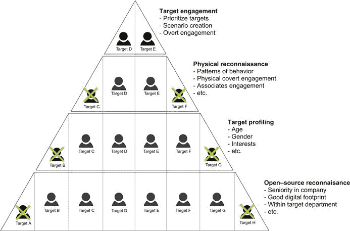
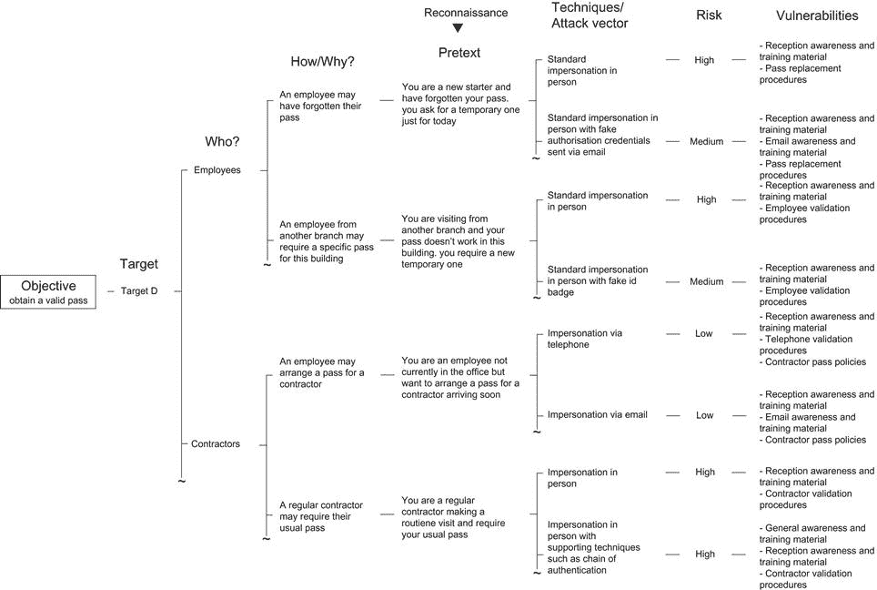

第七章

# 创建有针对性的场景

加文·沃森，随机风暴有限公司，高级安全工程师

一旦与客户达成一致的目标，下一阶段就是设计满足这些目标的场景。本章提供了一系列模型，测试人员可以使用这些模型创建有效的场景，这些场景不仅能够实现目标，还能识别多个漏洞，而不是集中在单一的安全缺陷上。这些模型的最终目的是确保评估为客户提供价值，并改进他们的安全性。

### 关键词

社会工程场景；目标识别；目标画像；物理侦察；假设设计映射；掩护故事；退出策略

本章内容

• 场景的组成部分

• 目标识别

• 开源侦察

• 目标画像

• 物理侦察

• 目标参与

• 假设设计映射

• 对未知情况的规划

• 特定场景的结果

• 掩护故事

• 退出策略

• 设计以失败为目标

## 引言

第六章讨论了社会工程评估威胁建模阶段的利弊。这一关键阶段确定了最重要的安全威胁，通过将评估重点放在正确的领域上，确保为客户创造价值。

为了测试每个确定的威胁，安全顾问将设计并执行社会工程场景。这些场景由多个组件组成，本章的第一部分将介绍这些组件。每个组件都是经过精心选择的，以便每个场景都能够识别特定的漏洞并达到明确的目标。

任何场景的一个基本组成部分是目标，有时也称为标记。在社会工程方面，这几乎总是指一个人。作者用于记录其决策过程的目标识别模型将被讨论。此外，这个模型也可以被初学者用来辅助设计场景。这提供了一个清晰且易于遵循的流程。

一旦确定了明确的目标和目标，下一阶段将是设计一种假设（或合理的情况）以满足该目标，并识别特定的漏洞。可以使用“假设设计映射”方法来辅助并记录场景设计背后的思考过程。

场景并不总是设计为成功，因为失败的场景通常可以识别出独特的安全问题。将设计场景失败将被讨论，还将讨论计划意外事件和准备好退出策略。

## 场景的组成部分

到了评估的这一步，安全公司应该对客户面临的重大威胁有一个清晰的了解。因此，现在是设计评估业务面临威胁、确定多个漏洞并最终提高客户整体安全性的场景的时候了。

每个场景都有多个组成部分，每个部分都必须明确定义，以帮助测试公司和客户自身（即使仅在文档方面）。为了在上下文中解释每个组成部分，我们将使用第四章中提出的常见短游戏攻击场景之一。

• **威胁**

客户担心他们的呼叫中心主要由未经训练的学生组成，容易受到基本的社交工程攻击。如果攻击者获得了一位权限极高的员工的电子邮件账户，可能会对企业的声誉造成严重甚至不可挽回的损害。由于呼叫中心员工数量众多，安全风险可能非常重大。

• **目标**

目标应该从一开始就清晰，并直接与客户的某个威胁相关联。在这种情况下，目标非常简单：

获取高权限用户的电子邮件账户访问权限。

当然，首先还有一些较小的目标要完成，比如侦察和目标识别，但这是本场景的主要总体目标。

• **目标**

本章的下一节将讨论正式的目标识别方法。然而，为了本示例的目的，我们将假设这已经完成。以下员工已被确定为本场景的合适目标。

• **A. 史密斯，B. 史密斯，C. 史密斯**

可能会有多个目标群体，每个群体与特定场景相关联，因此在此时清楚地定义它们非常重要。

• **攻击向量**

在本示例中，我们的攻击将通过电话进行，根据客户的规定。在这里定义这一点是重要的，因为同样的场景理论上也可以通过电子邮件执行。

• **借口（可能的情况和角色）**

选择的借口应该是可以实现同样目标的众多借口之一。本章的后续部分将介绍生成借口的正式方法。然而，为了本示例的目的，将使用短游戏攻击场景的借口，如前所述。因此，角色和可能的情况如下：

首席执行官（角色）正在与重要客户会面，并希望重置密码，因为他当前的电子邮件账户密码不再有效。

• **主要技术**

这个例子中使用的主要技术是冒充，因为目标需要相信呼叫者是首席执行官。严格来说，伪装也是在这种情况下使用的主要技术，但由于伪装将形成绝大多数社会工程情景的基础，通常不需要定义它。

• **次要/支持技术**

次要技术可用于识别额外的漏洞和/或增加成功的机会（如果增加成功有益）。在这个例子中，测试人员可以使用“压力和解决方案”来更有效地操纵目标。 “压力”可能是首席执行官正在开会，他们对情况不满意，“解决方案”是快速重置密码。如果要使用此支持技术，则假设如下：

首席执行官正在与非常重要的客户开会，他对自己的密码无效感到恼火。他们希望尽快重置密码，否则可能会对帮助台员工产生后果。

• **漏洞识别**

发现的漏洞直接映射到情景中使用的主要和支持技术。例如：

主要技术−基本冒充=呼叫者识别程序中的漏洞

次要技术−压力和解决方案=意识和培训计划中的弱点

• **业务暴露** 业务暴露是威胁代理成功利用漏洞后可能造成的潜在损害，即社会工程师成功获取员工的电子邮件账户并将内容发布到网络上所造成的损害。清楚定义暴露并将其呈现为最坏情况是很重要的。成功的攻击和明确定义的暴露至少可以在争取改善安全性的预算时提供很大的支持。

• **规则规定**

在设计任何情景之前，这个组件通常会与客户讨论。初始简报将明确定义规则，如不锁拾、不损坏公司财产、不干扰业务活动和严格禁止进入某些区域等。然而，在这个阶段的规则意味着可以设计多个具有不同规则的情景来识别不同的问题。例如，客户可能决定不想进行任何锁拾活动，因为这可能会损坏锁，而更换锁的费用很昂贵。然而，一两个情景可能涉及锁拾，只要它们限制在建筑物的某些区域。然后，测试人员可以执行具有和不具有锁拾的情景，并将结果呈现给客户，这可能是非常令人惊讶和有价值的。因此，定义规则是各个情景的组成部分至关重要。

• **资源**

某些情景可能只需要一个工程师，而其他情况可能需要多个工程师。在某些情况下，多个工程师可以在支持角色中补充情景，增加成功的机会。因此，执行特定情景所需的资源是一个重要的组成部分。例如，可能有一个带有两种变体的单一情景，一种是一个工程师，另一种是两个工程师。两种情景之间的结果差异可能很大。

• **环境因素**

这些是组织无法控制的影响情景的因素。例如，如果下雨，社会工程师看起来会很奇怪在外面潜伏。如果雾天，安全摄像头将受到影响。如果天气炎热，窗户和门可能会被打开。因此，重要的是将这些细节作为情景的一部分包括进来，因为在没有环境因素干扰时可能需要重复。

## 目标识别

社会工程师通常会在头脑中执行目标识别，甚至可能在他们演绎复杂情景时切换目标。作为专业的安全顾问，这种自由式情景执行并不总是一个可行的选择。这并不是说顾问在评估过程中不应该利用机会，只是重要的是保持清晰的结构。向客户呈现错综复杂和零散的结果很少有益于改善安全性的尝试。重要的是要尽量保持情景清晰和一致，以便它们能够识别出它们被设计来解决的问题。此外，过程的文档记录对于帮助客户理解所识别的问题以及作为以后进行额外测试的参考是至关重要的。最后，对于一家开展社会工程评估的公司来说，这种正式的方法可以帮助保持整个过程的清晰和可管理性。

正式的目标识别是一个结构化的排除过程，最终只得出少数被视为最适合（达到目标的）目标。图 7.1 显示了一个基本的通用目标识别三角形，可用于许多不同的情况。在攻击一个企业时，每个员工都是一个潜在目标，以及与该企业直接和间接相关的每个人。因此，这个过程的起点是用这些目标建立三角形的基础。目标数量将会减少，因为它们根据某些标准被“提升”到更高的层次。图 7.1 中的各个标准层次相当一般，因此它们可以应用于不同的目标。

图 7.1 通用目标识别三角形。

为了充分解释这个过程，我们将选择一个简单的目标：

获得进入目标建筑的有效员工通行证。

### 公开情报侦察

所提供的例子显示了我们的三角形的基础如何被填充，公司 xyz 的所有员工都是目标 A 到 H。一个真实的公司当然可能会有更多的员工，但是八个足以演示这个过程。

要使目标晋升到更高一层，他们必须通过一系列基本标准。在第一层，标准基于公开资源情报或初始侦察。由于攻击的第一步是研究目标，因此这是完全合理的。仅根据您远程收集的信息和攻击的总体目标，就有可能消除大量潜在目标。

• **公司的资深度**

选择比其他人拥有更高权限的目标通常是有利的。但是，如果目标需要针对脆弱的新员工，则相反是真的。

• **良好的数字足迹**

如果对目标的信息有限，则没有什么可基于的决定。作为回应，可以决定设计攻击以获得此信息，但这需要有一个充分的理由，因为这可能需要你可能没有的时间。但是，如果目标是 CEO，并且研究显示关于他们的信息很少，那么设计攻击以获取此信息可能是合理的。

• **在目标部门内**

虽然理论上任何员工都可以提供有效的通行证，但通常是接待处提供，因此在正确的部门提升目标是有意义的。

在这个例子中，A 和 H 目标都没有达到任何标准，因此被淘汰了。这导致 B 到 G 目标被提升到三角形的下一层。然而，在淘汰目标时，不一定是非黑即白的。被提升的目标可能只是比其他目标符合更多的标准，或者被淘汰的目标可能没有满足“一些”标准。最终由顾问决定如何提升和淘汰目标。

在这个例子中，有三个标准用于做出决定。在真实世界的评估中，将根据目标的复杂性、业务和范围内的员工数量等情况而有很多标准。

### 目标轮廓

三角形的下一层专注于目标个人资料。以前的标准包括有很好的数字足迹；对于每个目标应该有足够的信息来做出决策。在这一点上，决策是基于目标的个人特征做出的。显然，这些特征不能保证成功；这个想法只是为了增加基于概括的成功机会。例如，钓鱼邮件攻击可能比针对年轻一代更容易成功地针对年长者。关键词在于“可能”。

• **年龄**

如上所述，某些攻击取决于目标的年龄而更成功。然而，尽管倾向于针对年长者，因为他们可能不那么懂得计算机，但一定要非常小心，不要浪费宝贵的时间。如果目标是操纵目标透露信息，那么选择一个年轻的新手可能比选择一个六十多岁的坚强的前军人目标更好。仔细考虑目标和标准如何影响任何决定促进或消除目标是很重要的。

• **性别**

这些标准不是因为作者认为一种性别比另一种更容易受到社会工程的影响。这是因为场景或目标可能是性别特定的。例如，客户可能怀疑他们的男性主导的呼叫中心人员在一个年轻女孩打电话给他们要求重置密码时没有遵循正确的程序。因此，为了符合客户的规格，消除女性目标是一个好主意。当然，也可以建议使用男声并针对女性员工的替代场景可能会产生有趣的结果。

• **兴趣**

如果研究发现目标有很多兴趣，那么这些信息可以用来对付他们。

在示例目标中，年龄和性别相对不重要，因此基于 B 和 G 目标的可用兴趣少于其他目标而将它们排除了。

### 实地侦察

三角形的第三层远离远程侦察，聚焦于目标及其与目标的关系。

• **行为模式**

这些标准可能根据目标的目标而有很大不同。例如，如果目标是在他们在办公室时给他们打电话，那么了解他们工作的时间将是一个好主意。同样，如果目标是通过信息引诱与目标接触，则了解他们在哪里吃午饭或何时出去抽烟将是一个好主意。此外，这些标准可能更基本，比如目标在整个测试时间段内实际上是不可用的。

• **身体上的秘密接触**

与行为模式类似，目标可以根据是否可以真正参与而被提升或淘汰。物理隐蔽参与可能意味着拍照或录制目标以进行信息收集。因此，如果可以获得某些目标的良好照片和录音，那么有理由优先提升他们而不是其他人。这种程度的参与通常对于大多数社会工程评估并不是必要的，这里包括的只是为了彻底展示这个过程。现实世界的攻击很可能会涉及这一层目标识别，特别是如果攻击持续数月。

• **关联参与**

通过转化参与，应该清楚地了解谁与目标有关。他们的亲密朋友和工作同事可能成为攻击主要目标的额外途径。例如，一个亲密同事可以作为社会证明支持技术的一部分。同样，如果明显地两个同事密切合作，那么最好避免通过冒充另一个（比如通过电话）来攻击其中一个，因为他们很可能会认出冒名顶替者。

在这个例子中，目标 C 和 F 在测试窗口期间将不可用。这些信息可以被利用，因为如果他们不在场，就可以冒充他们。然而，在给定的情景下，他们并不适合作为目标。

### 目标参与

最终层揭示了基于收集到的所有信息的最佳攻击目标。在三角形内不再需要做出关于淘汰或提升的决定。一直工作到三角形的顶部已经确定了 D 和 E 作为最有利的目标，他们都是接待员。请记住，现实世界的情景可能会有许多最初的目标，因此在三角形顶部可能不止两个目标。

• **优先考虑目标**

最终目标在整体适用性方面会有差异。例如，一个可能比另一个符合标准稍微多一些，因此，优先考虑目标并集中精力先处理最有前途的目标是个好主意。

• **情景创建**

现在目标或目标已经确定，是时候设计一个合适的社会工程情景了。目标和目标可以作为“借口设计映射”的基础，这是下一节中解释的一个过程。

• **公开参与**

这是与目标互动的最后阶段：实际执行社会工程情景。

请记住，很可能到达这个阶段，然后意识到最终目标实际上毫无意义。或者在执行场景之后，您可以进一步攻击其他目标。在这些情况下，重点放在三角形中的下一层上，重新审视之前被淘汰的目标。通过遵循这个过程，可以按照尽可能有效地使用分配的时间的顺序针对正确的人员。

## 预文本设计映射

前一节描述的目标识别过程揭示了两个合适的目标：目标 D 和 E。现在，该过程可以继续到使用目标 D 和获取有效通行证的目标的预文本设计映射阶段。

图 7.2 显示了我们目标的一个预文本设计地图示例。地图从目标和选择的目标开始。在这个初始阶段，很可能有一个以上的目标，并为每个继续树，但是例子将尽可能简单。

图 7.2 预文本设计图示例。

树在“Who”阶段分支，回答了与目标和目的相关的人是谁的问题。在我们的例子中，问题是“前台接待员会给谁发有效的通行证？”。这产生了两个明显的分支，即“承包商”和“员工”，因为前台接待员肯定会向这些群体发放通行证。这只是为了例子而列举的两种可能性，因为这里可能列出更多的群体，比如访客。

下一个分支回答了“为什么”或“如何”的问题，例如“前台接待员为什么会给承包商或员工发放有效通行证？”例如，员工可能忘记了带他们的通行证，因此需要今天的临时通行证。或者通行证可能被发放给执行例行维护的承包商。这可以看作是我们树中的第一个分支。发放通行证的原因有很多，应该列出尽可能多的原因。这构成了预文本的基础，并有助于绘制各种可能性的思维导图。通过将这些分成不同的组，比随机挑选更容易生成可能性。

一旦“如何/为什么”部分增加了可能性，那么开始创建借口的过程就开始了。其想法是继续从“如何/为什么”部分开始，并结合侦察信息来详细说明细节。例如，树上的第一个借口是基于冒充忘记通行证的员工。侦察可能已经透露出，在测试窗口期间某个员工不会在办公室，并且他们刚刚开始工作，这样前台接待员工可能不会很了解他们。类似地，关于承包商执行例行维护的可能性，侦察可能已经透露出每周都会有第三方访问的详细信息。

下面的第二个借口是基于冒充另一个分公司的员工，并尝试获取临时通行证。侦察可能已经透露出另一个分公司的详细信息以及制作假身份证的必要图像。因此，这个借口肯定是可能的。显然，进行的研究越多，创建借口就越容易。

确定了借口之后，下一阶段是澄清将使用的技术。这是一个关键阶段，通过彻底和有效来确保为客户创造价值。树枝上列出了可以在同一借口期间使用的备选技术。例如，涉及忘记通行证的第一个借口可以尝试两种方式。顾问可以简单地冒充员工并要求一张徽章，或者他们可以在到达前首先向前台发送一封假的授权电子邮件。同样，这些只是可能列在这里的许多不同技术中的两种。这两种方法都带有一定的风险，这些风险在技术旁边列出。在图中，仅冒充被归类为高风险，而带有电子邮件授权的冒充被归类为中风险。其原因是电子邮件提供可信度（即使它不符合标准程序），因此风险应该稍低一些。风险分配没有刻度，它纯粹是定性的，最终是顾问的决定。

使用的伪装手法和攻击向量将在成功达成目标时导致不同的漏洞被识别。在我们的例子中，仅仅冒充身份将识别出与接待员特定的意识培训和通行证更换程序相关的问题。然而，如果采用另一种方法，使用电子邮件授权函，它也会识别出与电子邮件特定的意识培训相关的问题。乍一看，第二种方法似乎更有利，但事情并不总是那么简单。如果采用第二种方法，确实会识别出更多的漏洞，但采用第一种方法将意味着这些漏洞更为重要（因为顾问不需要任何额外的可信度来获得通行证，他们只是要求得到了）。

根据这棵树，另一个可能性是，如果雇员安排了一个承包商，接待员会给予通行证。一个可能的技术是通过电话或电子邮件进行冒充。请记住，这只是许多可能性中的两种。在这里，两种不同的攻击向量导致了不同的漏洞被识别出来。电话攻击向量将识别出电话呼叫者验证程序的问题，而电子邮件攻击向量将识别出与电子邮件特定的意识和培训材料相关的问题。此外，由于这两者都是远程攻击向量，因此风险相对较低。

当以这种方式呈现风险水平和已识别的漏洞时，我们可以开始就评估中使用的假设做出一些明智的决定。例如，在评估开始时使用较低风险的假设，而在评估结束时使用较高风险的假设将是有益的。同样，由于我们可以看到每个假设识别了哪些漏洞，我们可以选择那些将识别出不同漏洞横截面的假设。当然，如果时间不是问题，那么可以尝试尽可能多的假设。然而，在大多数社会工程评估中，时间很可能是非常有限的。

## 对未知进行规划

有些专业的社会工程师拥有真正的“口才天赋”，可以在测试中自如地进入和离开任何情况。然而，当试图为希望进入社会工程领域的公司提供建议时，指出这一事实并不特别有帮助。如果他们天生具备这方面的天赋，那么他们肯定会觉得更容易，但这并不意味着如果他们不是非常外向，他们就不能进行扎实的社会工程评估。事实是，熟能生巧；如果有人坚持下去，他们最终将自然而然地进行技术操作，并且付出最小的努力。遵循本书的建议，保持评估的结构化和有效性对客户更有利，而不是试图自信、直言不讳、能言善辩。

对于不太自信于目标任务的顾问来说，为未知情况做计划的想法可能非常吸引人。然而，准备好所有答案的想法当然是荒谬的，因为他们不可能为每种可能的情况都做准备。如果一名保安突然走过来声称正在进行随机员工通行证检查，这是预先计划的吗？很可能不是，但至少客户会在报告中得到一个绿色的勾选。如果计划未知情况是如此困难，那么考虑各种可能的结果还有什么意义呢？答案当然是：这取决于情况。如果正在计划进行针对钓鱼邮件的攻击，那么可能的结果会通过邮件回复呈现出来，因此可能会有足够的时间来决定适当的应对措施。如果正在执行旨在欺骗特定接待员的场景，那么可能会发生任何事情，而且可能没有太多时间来考虑适当的应对措施。例如，就在顾问走进接待区时，接待员可能会意外更换，使得针对特定目标配置的攻击失效。一位经验丰富的顾问可能会立即转向另一种方法。然而，一位新的社交工程师可能会感到恐慌，可能最终不知所措，从而冒着被暴露的风险。不幸的是，他们实际上不能站在那里考虑该如何进行才是最好的，至少这可能会引起怀疑。提前考虑一些可能事件可以帮助避免这种情况。以下几节中解释了一些方法。

### 情景特定的结果

一旦确定了目标并设计了场景，将假象设计映射树扩展到包括可能的结果可能是有帮助的。然后可以考虑这些结果并计划适当的应对措施。每个场景应该都有明显的可能结果需要包括在内。例如，让我们考虑社交工程中最老套的情景之一：送货员。这个想法是通过假装成送货人来进入建筑物。当你考虑到可能的结果时，这个场景显然是相当荒谬的。  

• **接待员要求把包裹放在接待处**

有多少企业真实地允许送货员进入公司，直接把包裹交给收件人？也许有些，但如果是这样，那么企业根本不需要进行社交工程评估，他们首先需要从基本的安全措施开始。这种结果是最有可能的，因此攻击将被中断，顾问被迫离开大楼，几乎没有取得任何成果。

• **你不是我们的常规送货人？**

即使制作了一个令人信服的假制服和证件，员工们也有可能注意到这不是平时的送货人。当他们在表上签字时，是否完美复制了？如果送货人通常使用电子设备记录签名，那么咨询师是否拥有此设备？货车呢，看起来正常吗？如果他们觉得有什么不对劲，他们可能会试图证明身份，这可能是个挑战，尤其是如果准备时间很短的情况下。由于这种结果很可能发生，他们最好有一个非常令人信服的掩护故事和退出策略，如果他们打算尝试的话。

• **真实的送货人刚刚到达或与假冒者同时到达**

一个相当尴尬但非常可能发生的结果是，真正的送货人突然出现或在咨询师到达时同时到达。尽管进行了彻底的侦察，但他们可能会因为无法事先计划的原因而早到或迟到。如果发生这种情况，怀疑将很快引起，情况将变得非常棘手。

• **接待员让顾问通过**

这确实是一个“可能性”，但考虑到其他各种结果，这确实是最不可能的。

一个非常常见的错误是基于这样一个假设进行所有规划：情景将成功：为进入大楼做好充分准备，前往目标部门，实现目标并无事离开。然而，如果忽视了其他基本的初始结果的考虑，整个攻击可能会受到威胁。

上面关于送货司机的例子表明，考虑基本结果可能导致决定不尝试攻击。然而，在大多数情况下，考虑结果更多是为了增加成功的机会，减少失败引起的重大问题的可能性。

如果情景设计得足够巧妙，甚至可能在一个失败时发生其他情况。例如，旨在分散安全人员注意力的情景可能会导致在最初的分散失败后设计的操纵安全人员的情景。因此，借口设计树实际上可以从可能的结果点重复。

### 掩护故事

严格来说，一旦设计了借口，就应该建立一个掩护故事。在许多方面，制定掩护故事不过是为了填补可能受到质疑的细节。应该非常清楚地知道咨询师为什么在那里以及为什么打电话或发送电子邮件。然而，掩护故事不仅仅是为了防止受到怀疑的员工质询，它还确保了常见和无害的问题不会引起怀疑。

• **无害的问题**

假设情景涉及冒充一名电工，前来现场对员工的笔记本电脑进行 PAT 测试。看起来很简单，但是如果一名员工无辜地问顾问在哪里接受过 PAT 测试培训呢？不管顾问“相信”自己是那个角色多少，他们都不可能凭空捏造答案，也不应该依赖于能够巧妙地摆脱困境。如果他们对这样一个无害而无伤大雅的问题没有一个迅速的回答，那他们可能会有麻烦。第三章涵盖了冒充的基础知识以及有关角色的问题。然而，考虑到人们在随意谈话中可能会问的问题，也很重要。为角色建立背景，并扩展到出席的目的。

• **具有挑战性的问题**

如果顾问受到挑战，那么可能会问一些可以预料到的问题。至少顾问必须能够回答以下问题是至关重要的：

• 角色姓名

• 公司名称

• 公司地址

• 同事姓名

• 现场联系人

• 打电话、发送电子邮件或出席的目的。

还有其他需要考虑的不那么明显但仍可能使事情变得困难的领域。

• 当地认知：如果您冒充员工并询问某个部门在哪里，您可能会很快引起怀疑。

• 员工停车场：与上述相同，如果冒充员工，则不要停在访客停车场。

• 车辆注册号码：您可能需要在签到簿上写下这个号码。如果提供了一个假的号码，则确保您能够熟记。

• 手机号码：使用您自己的手机还是临时的手机？如果是为了评估而暂时使用，请确保您知道这个号码。如果被问及号码而不知道它，可能会显得可疑。

### 出口策略

出口策略是欺骗设计图的另一个可能的延伸。无论攻击准备得多么小心和彻底，都有一些结果是难以恢复的。正是这些结果需要出口策略，以提供损害控制。出口策略不一定是解救情况的方法，它们是结束情况而不引起进一步怀疑或破坏整个攻击的方法。

对于非常自信和准备充分的实习社会工程师，通过电话与目标进行交流时，如果发生了他们没有预料到的情况，往往会突然崩溃并挂断电话。这种对目标“逃避”的举动只会证实他们的怀疑。如果顾问能够巧妙地摆脱困境，那就太好了，如果不能，那么他们可以尝试以下一些方法：

• **转移**

声称突然想起了另一件事情要谈论，并将对话引导到那个话题上，同时思考如何回答之前的问题：“*哦！在我忘记之前，我能问你关于...的事吗？*”。

• **打断**

声称刚刚被同事打断，要求回电话给目标或让他们等一分钟。这将给你时间思考如何最好地回应，但不要等太久。

• **装傻**

根据被问及的内容，假装忘记了某事或表现得没有被告知过可能是一个合适的选择。请目标稍等片刻，让你查找信息。

• **质疑问题**

用问题回答问题是一种拖延时间思考如何回答的方式。例如，如果被问及员工编号，可以通过询问为什么需要它，通常在哪里写的，或者关于授权流程的细节来争取时间。

• **忽视问题**

这可能看起来是一种冒险的方式，但忽视问题并继续下去有时会导致目标放弃并继续前进，即使只是为了礼貌。

面对目标时，除了转移注意力外，上述方法并不理想。在棘手的情况下，顾问可以尝试以下方法。

• **突然想起了什么**

刚刚想起在车里留下了一份重要文件或设备，需要去拿回来，以免再次忘记。

• **电话**

并非每个人的手机都设置了可听到的铃声，有些人只依赖震动。因此，这可以用来假装接到电话并进行一场假对话，借此借口突然离开，或者利用对话时间重新考虑方法。

## 设计失败

每个创建的情景最初都设计成可以成功，并突出显示特定的漏洞。然而，“失败”的情景可能会凸显出额外的安全问题。例如，顾问可能会试图显得可疑，以评估员工如何质疑新面孔（从而识别出意识和培训计划存在的问题），而不是使用支持技术避免被挑战。作者执行的一项特定评估清楚地展示了这一点。尽管最佳努力试图劝阻，但客户坚持认为，服务器房间的访问应该是主要目标。进行了侦察，设计了适当的情景以识别漏洞，并安排工程师来执行这些情景。未知的是，客户已经告知所有员工将进行一次评估，以及评估将在哪一天进行。一旦顾问进入建筑物，可疑的员工立即包围了他们。他们质疑顾问问他们是谁以及为什么在这里。尽管顾问对这种突袭感到有些惊讶，但他们保持镇定，并解释他们是从另一个分部来访，并展示了他们的“假”员工工牌（幸运的是，这与他们正在执行的当前情景一致）。在看到员工工牌后，审讯者立即放弃了指控，并解释说：“*哦，谢天谢地！显然今天会有一个‘神秘购物者’类型的人出现，所以我们都警惕起来了！IT 部门就在那边*。”顾问充分利用了这种情况，与员工长时间地聊起了这位“神秘购物者”。在这个例子中，顾问最初并没有打算以这种方式受到挑战，但被挑战确定了意识和培训计划的一个非常严重的问题，或者说没有这样的计划。

另一个类似的例子涉及一名安保人员的失败挑战。两名顾问参与了一项标准评估。其中一种情景导致他们只获得了一个有效通行证。评估接近尾声时，顾问们决定尝试使用通行证同时将他们两个人带进建筑物内。他们成功地获得了通行权限，但是一名安保人员通过安全摄像头观察到了这种“搭便车”行为。安保人员迅速拦截了这两名顾问，并要求查看他们的员工工牌。一名顾问出示了有效的工牌，另一名声称忘记了自己的工牌，因此使用了同事的工牌。安保人员将没有工牌的员工护送回安全室进一步询问，然后允许另一名持有有效工牌的顾问继续前行。如果这是一次真实的攻击，尽管其中一名个体被抓获，另一个个体将自由继续他们的任务。

包括那些注定会失败的情景是重要的，但不应总是以黑白分明的方式处理。有时，最好的方法是设计一系列情景，所有情景都具有相同的目标，但复杂程度不同。为了更清楚地解释这一点，请考虑一种电子邮件钓鱼攻击场景。通过设计完美的电子邮件钓鱼攻击，直到细节到无法被收件人识别为假的程度，你很有可能成功。但是，这证明了什么呢？可能是向客户呈现一个最坏的情景：“*看看攻击者可能做什么！*”。问题在于客户将极其难以抵御这样的攻击，那么评估实际上取得了什么成就？相反，假设测试公司插入了一些小错误，如拼写错误、略有不同的域名或电子邮件签名中的不一致之处。现在，员工有可能发现这些问题并联系 IT 帮助台进行报告。这又告诉客户什么？相当多。它告诉他们，他们的员工正在寻找这些问题并适当地报告它们。如果他们没有收到任何电话，那么他们知道他们的意识和培训计划需要改进。如果攻击被简化为基础知识，涉及非常简单的钓鱼攻击，那么员工没有电话通知将表明存在严重的安全问题！这些不同程度的攻击可以同时发起，因为测试公司知道他们将它们发送给谁，客户知道谁打电话报告了问题。此外，如果钓鱼邮件正在收集凭据，那么测试公司可以看到谁受到了攻击。

## 总结

确保为客户提供价值至关重要，尤其是在时间有限的情况下。已经讨论了目标识别和借口设计的正式方法。这些方法确保情景针对最相关的领域，并尽可能多地识别漏洞。

情景并非总是按计划进行，考虑到结果、准备好掩盖故事并知道你的退出策略都可以大大提高成功的机会。

下一章将介绍如何在评估过程中收集和利用开源情报。
