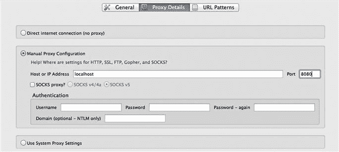
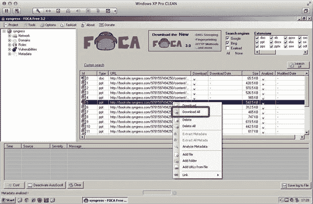

# 第八章：利用开源情报

Richard Ackroyd，高级安全工程师，RandomStorm Limited

俗话说“如果我有八个小时去砍树，我会花六个小时磨斧头”，这句话与这个阶段完美地契合。 您执行的侦察工作将决定或破坏社交工程的参与。 它确实将成为任何随后工作的基础。 我们可以随时获取大量信息。 本章将向您展示如何找到并操纵它以帮助您进行评估。 将涵盖收集电子邮件地址、文档元数据、企业网站和社交媒体的内容。

### 关键词

被动蜘蛛；FOCA；Metagoofil；图像元数据；Exiftool；图像挑选器；Wget；GeoSetter；反向图像搜索引擎；PDFGrep；文件混淆；theharvester；Sam Spade；Jigsaw；Recon-ng；社交媒体；LinkedIn；Facebook；DNS 记录；CeWL；WHOIS 记录

本章的信息

• 企业网站

• 员工姓名

• 员工层次结构

• 电话号码

• 员工照片和数据

• 主动和被动蜘蛛

• 文档元数据

• FOCA

• Metagoofil

• 字符串

• PDFGrep

• 图像元数据

• ExifTool

• 图像选择器

• WGET

• GeoSetter

• 反向图像搜索引擎

• 不太元数据

• 电子邮件地址和电子邮件枚举

• 网络钓鱼攻击

• 密码攻击

• 电子邮件地址命名约定

• 社交媒体

• 领英

• Facebook

• Twitter

• DNS 记录和枚举

• Dnsrecon

• 子域名暴力破解和枚举

• CeWL

• WhoIS

## 介绍

第七章介绍了一个创建有针对性场景的模型。 本章将介绍如何使用公开可用的信息来对特定目标进行轮廓化。

这是社交工程的一个真正有趣的部分。 一个典型企业放入公共领域的信息真的非常引人入胜。 令人恐慌的是，大多数组织甚至都没有意识到他们正在这样做。 信息可以通过文档元数据或其公共 IP 地址的注册详细信息泄漏出来。 这是社交工程的一个真正迷人的方面，也将在渗透测试中证明有用。

本章将首先介绍企业的网络存在，以及如何对其进行询问以获取有用信息。 这些信息可能是基本的，例如企业的直拨电话和电子邮件地址。 或者，它可以用来提供假象的基石。 看似不起眼的信息片段，如合作伙伴、供应商和客户，突然变得非常有趣。

将介绍从企业网站直接恢复信息的方法，无论是被动还是主动的性质。

接下来，本章介绍了获取公司电子邮件地址背后的过程和工具。在绝大多数社会工程攻击中，电子邮件地址都是金子般珍贵的。它们不仅为钓鱼攻击提供了基础，还提供了组织内其他邮箱的命名约定。

获取这些电子邮件地址的工具通常不会告诉我们它们是在哪里找到的。我们将追溯到它们的来源，以展示这有多有用。例如，在最近的社会工程活动中，发现一大部分这些电子邮件地址实际上是在员工发布的文档中找到的。这些文档并不在公司网站上提供，但包括直拨电话、手机号码以及大量其他有用的情报。

文档元数据将在以下部分进行介绍。本章将介绍一些流行的工具，用于收集和解析发布在公司网站上的文档。预计将看到的内容包括用户名、本地工作站的文件夹结构、电子邮件地址和输出中的操作系统。毫无疑问，这对社会工程师非常有用。

接下来是对社交媒体网站、博客和论坛的调查。所有这些都可以成为关于潜在目标的信息的有用来源。接下来要进行搜索引擎收集。“Google”搜索引擎是一款多么出色的侦察工具，总是让人惊讶不已。还简要介绍了 DNS 和 Whois 记录的主题，如何获得它们，使用哪些工具，以及如何将获得的情报应用于您的参与。最后，本章提供了关于如何使用提取的所有信息的指导，包括与数据操作相关的一些常见任务，例如构建用户和密码列表，这些可以在进一步的攻击中利用。本章将涵盖许多真正出色的技术、技巧和工具，让我们开始吧。

本章中使用的绝大多数工具都安装在 Kali Linux 中。您可以在这里下载虚拟机或 ISO：[`www.kali.org`](http://www.kali.org)。

## 公司网站

在寻求对任何业务进行情报收集时，他们的公司网络存在是显而易见的起点。然而，有哪些信息是不能立即看到的？隐藏的宝藏在哪里，如何将它们应用到正在进行的评估中？通常发现大多数企业对潜在攻击者提供的信息量感到惊讶。可以预期找到什么样的信息，以及为什么对社会工程师以及恶意个人来说这些信息是有用的？

### 商业目的

了解企业的业务、理念以及其运作方式始终是关键信息。如果选择的方法是冒充员工，那么需要进行彻底的研究才能成功。了解组织的基本情况以及行业内使用的术语可以帮助很多。了解一个企业也可以在对可能正在使用的系统类型进行有根据的猜测时提供帮助。

一些深入调查还可以提供有关在电话或现场拜访中可能会面临多少阻力的线索。如果企业习惯于与政府和军事机构打交道，那么社会工程师在信息安全方面遇到的人很可能是经过良好训练的。这样的组织更可能是组织化的，会按照流程进行操作。评估组织的潜在安全态度的其他指标还包括信息保障标准的标志，如 ISO 或 PCI。同样，这些都是提示，表明企业内的一些人可能接受过培训，这可能使他们更难以被利用。

社会工程师所做的很多工作是盲目进行的，至少起初是这样，因此建议尽可能多地从这个过程中获取信息。准备不足就是准备失败。

### 合作伙伴、客户、供应商

许多组织在其网站上发布客户、合作伙伴和供应商列表。还有什么更好的借口可以进行信息收集呢？打电话到帮助台并冒充客户很可能会获得一些有用的信息。如果目标组织有客户门户，有可能通过尝试重置客户的密码来获得访问权限。在许多情况下，获得某人信任所需的只是他们认为是私人的一点知识。这可能是客户门户的 URL 和使用客户的姓名。在许多情况下，添加一种紧急感可以施加所需的所有压力，以推动事情的发展。

### 电子邮件地址

电子邮件地址在社会工程攻击中异常有用，这将在本章后面更详细地讨论，包括如何从公开可用资源中收集它们。有几种利用它们的方法，例如选择进行有针对性或广泛规模的网络钓鱼攻击，或者使用它们攻击 VPN 和电子邮件门户。尽管后者更像是渗透测试领域的内容，但许多社会工程参与都采用了这种混合方法。

电子邮件地址还可以指示内部用户名的约定，这意味着如果可以识别更多员工，那么可以建立更大的电子邮件和用户列表。这些可以在整个参与过程中用于进一步攻击。

### 员工姓名

公司网站上的员工名字数量可能仅限于董事和股东。在组织有员工撰写的博客或新闻文章的情况下，仍然有可能找到层级更低的人。员工的名字在伪装角度或在电话时提及名字时很有用。大多数人会认为 LinkedIn 是这种信息的更好资源。只需确保他们当前的就业状况是准确的。冒充不再为目标工作的员工将不太可能提供任何好处。

### 员工层级结构

了解员工层级对社会工程师总是有用的。自称是某个领导职位的人的电话可能会以意想不到的方式顺利进行。多少呼叫中心的员工敢冒险冒犯整个部门的负责人？另一个角度是熟悉或不熟悉的情况。选择一个不太可能经常与呼叫中心员工联系的员工意味着被识破的机会较小。没有什么比经历整个建立你的伪装企图过程后，却被你的目标说“*嘿，你听起来不像鲍勃…*”更糟糕的了。此时，你可能已经在组织层面引起了警报。

### 电话号码

电话号码，像电子邮件地址一样，对于持续的互动也是关键。通常情况下，组织只会公布中央总机的号码，因此通常认为这更安全，因为总机工作人员可能接受了特定角色的安全培训。然而，情况通常并非如此。接电话的人受雇于帮助和支持企业，而不是成为障碍。他们可能会接听大量的电话，这意味着很少有时间对每个电话进行审查，也很少有机会识别重复的来电者。因此，总机经常成为攻击目标，以获取企业内其他员工的直线电话。很少有人会因除了姓名和电话目的以外的任何事情而受到质疑。即使他们受到质疑，组织每年可能会接到成千上万个入站销售电话，因此不太可能引起任何怀疑。

另一个有趣的向量与责任缺乏认证已经通过另一名员工的人有关。当涉及到信息泄露时，这可能给组织带来严重问题。不能简单地认为对话的对象是客户，仅仅因为有人告诉你他们是客户，并不意味着在向他们提供任何敏感信息之前就不能进行验证。

### 员工和企业位置的照片

本章后面将调查数字照片中所包含的各种隐藏信息带来的智能潜力。这可能包括照片拍摄设备的类型、地理位置等。

然后是照片中更明显的情报。这可以是从物理位置的照片，到办公室的内部布局，甚至是身份证。[Images.google.com](http://Images.google.com)对这种努力来说是绝对的宝藏。例如，通常可以在宣传照片中发现身份证，并用它们来重新制作副本。即使是粗略制作的身份证，也足以让社会工程师在没有员工或安全人员干预的情况下绕过建筑物。事实上，社会工程师往往可以很快地使用喷墨打印机制作一个徽章。尽管是在照片纸上打印的，但它仍然可能通过安全人员的近距离检查。他们可能只是看照片或者只是执行程序。

在收集了企业网络存在的一些有用信息之后，我们使用了哪些工具来检索它呢？

### 爬虫

爬虫，有时也称为爬行器，旨在索引网站及其内容。它们通过从种子 URL 开始并识别这些站点上的所有超链接来实现这一点。然后爬虫访问这些链接中的每一个，最终构建出所涉及的网站的完整地图。爬虫最常用于谷歌和必应等搜索引擎提供商。这形成了当搜索时内容如何被提供的基础。

爬虫对社会工程师和渗透测试人员都非常有用。这是因为它允许以自动化和有效的方式完全映射企业的网络存在。

爬虫可以 passively 和 actively 对网站进行攻击。下面介绍一种用于被动地映射网站结构的工具。

#### 被动爬虫

如果任何侦察工作开始引起警报，那么所有的努力都可能白费。如果我们能 passively 地爬取一个网站，那不是很好吗？事实上，通过使用“代理爬虫”就可以实现这一点。

谷歌和必应等大型搜索引擎提供商花费大量时间爬取互联网，以便搜索引擎用户无需自行操作。为什么不利用一下呢？

使用由屡获殊荣的 Ryan Dewhurst（@ethicalhack3r）创建的 Passive Spider（[`github.com/RandomStorm/passive-spider`](https://github.com/RandomStorm/passive-spider)）来映射网站。[`www.ethicalhack3r.co.uk`](http://www.ethicalhack3r.co.uk)。

被动爬虫利用搜索提供商的工作，通过利用搜索结果来给出网站的布局。

在撰写本文时，被动爬虫仅使用必应搜索引擎，但需要注册免费的必应开发者 API 密钥才能执行任何搜索。

安装需要 Ruby，但非常简单。已在运行 Ruby 1.9.3 的 OSX 上进行了测试，也可以在 Kali Linux 上运行，同样在 Ruby 1.9.3 上工作。

以下是安装说明：

```
git clone https://github.com/RandomStorm/passive-spider.git
```

```
cd passive-spider
```

```
gem install bundler && bundle install.
```

或者，您也可以直接从 GitHub（[www.https://github.com](http://www.https://github.com)）下载 ZIP 存档并提取文件。

在 passive-spider 目录中有一个名为 api_keys.config 的文件。这是您需要在引号之间输入之前提到的 Bing 搜索 API 密钥的地方。

确保 pspider.rb 文件具有执行权限：

```
chmod +x pspider.rb
```

此时，被动蜘蛛已准备就绪。让我们看看它收集了什么信息。

```
./pspider.rb --domain syngress.com
```

```
[+]---------------------[+]
```

```
[+] Passive Spider v0.2 [+]
```

```
[+]---------------------[+]
```

```
Shhhhh… by Ryan'ethicalhack3r' Dewhurst
```

```
Part of The RandomStorm Open Source Initiative
```

```
[+] URLs: 59
```

```
http://booksite.syngress.com/
```

```
http://www.syngress.com/?cur=usd
```

```
http://booksite.syngress.com/companion/conrad/practice_exams.php
```

```
http://booksite.syngress.com/companion/conrad/
```

```
http://booksite.syngress.com/companion/issa.php
```

```
http://www.syngress.com/about-us
```

```
http://booksite.syngress.com/companion/special_interests.php
```

```
http://booksite.syngress.com/companion/conrad/podcasts.php
```

```
http://booksite.syngress.com/companion/conrad/Conrad_PracticeExamA/COU36289844/open.html
```

```
http://booksite.syngress.com/companion/certification.php
```

```
http://booksite.syngress.com/companion/hacking_penetration.php
```

```
http://booksite.syngress.com/9781597494250/content/
```

```
http://www.syngress.com/news/nacdl-cacjs-5th-annual-forensic-science-seminar-march-23-24-las-vegas/
```

```
http://www.syngress.com/special-interests/
```

```
http://www.syngress.com/events/5th-annual-cai-security-symposium---northern-ky-univ-oct-28th-highland-heights-ky/
```

```
http://booksite.syngress.com/companion/digital_forensics.php
```

```
http://booksite.syngress.com/Landy/index.php
```

```
http://www.syngress.com/news/securabits-100th-podcast---guest-harlan-carvey-and-craig-heffner-tonight-march-7th-7-30-est/
```

```
http://booksite.syngress.com/9781597494250/content/Video/HIPT/module06/index.html
```

```
http://www.syngress.com/events/7th-annual-scada-and-process-control-system-security-summit-orlando-florida/
```

```
http://www.syngress.com/information-security-and-system-administrators/Dictionary-of-Information-Security/
```

```
http://www.syngress.com/news/read-the-latest-review-for-digital-forensics-with-open-source-tools-by-altheide-and-carvey/
```

```
http://booksite.syngress.com/9781597494250/content/Video/HIPT/module02_E/index.html
```

如您所见，输出非常直观。现在我们已经在未触摸它的情况下获得了目标公司网站的基本布局。在开始任何更积极的测试之前，强烈建议采用这种方法。可能需要更积极的蜘蛛来处理整个网站。这将在本章后面介绍。

被动蜘蛛不止于此。它还显示了查询期间找到的任何文档，这对社交工程师来说可能非常有用。为什么查看元数据时文档很有用将在本节后面介绍。此外，文档通常非常有用，因为它们经常包含员工的联系方式。

滚动到结果的底部会显示在搜索期间找到的任何子域和有趣的关键字。

#### 使用 OWASP Zed Attack Proxy 进行主动蜘蛛。

Zed Attack Proxy (ZAP) 是一个易于使用的集成渗透测试工具，用于查找 Web 应用程序中的漏洞。

它设计用于被各种安全经验水平的人使用，因此非常适合对渗透测试尚不熟悉的开发人员和功能测试人员。

ZAP 提供了自动扫描器以及一套工具，使您能够手动查找安全漏洞。

[`www.owasp.org/index.php/OWASP_Zed_Attack_Proxy_Project`](https://www.owasp.org/index.php/OWASP_Zed_Attack_Proxy_Project)

ZAP 是另一个非常棒的开源工具，我们可以利用它，但它提供的全部功能远远超出了本书的范围。目前我们感兴趣的是它的蜘蛛能力。

ZAP 之所以被称为 ZAP，是因为它代理您的连接到您选择的目标。这使得 ZAP 能够拦截并篡改任何出站请求或入站响应。

启动 ZAP 后，您需要配置浏览器指向它，通过在代理设置中配置 localhost 和端口 8080 来进行。我使用 Firefox 的 FoxyProxy 插件，但其他浏览器也有替代品。如果您将要频繁更改设置，则 FoxyProxy 等应用程序更快，并且您可能会这样做。

所以，让我们安装 ZAP 并配置浏览器，以便我们可以拦截流量。为了本节的目的，我假设您正在使用 Firefox。

步骤 1：转到 FoxyProxy 网站：[`addons.mozilla.org/en-US/firefox/addon/foxyproxy-standard/`](https://addons.mozilla.org/en-US/firefox/addon/foxyproxy-standard/)。

步骤 2：点击“继续下载”。

步骤 3：点击“添加到 Firefox”。

步骤 4：Firefox 应提示您安装 FoxyProxy。此时需要重新启动 Firefox。

就是这样。接下来，我们需要配置 FoxyProxy 以启用将所有流量发送到 ZAP。

步骤 1：在 URL 栏末尾找到 FoxyProxy 按钮，右键点击它。选择选项。

步骤 2：点击“添加新代理”（图 8.1）。

步骤 3：填写“localhost”和端口 8080 的代理设置（图 8.2）。

当启用 FoxyProxy 时，它将自动将 HTTPS 和 HTTP 流量发送到 ZAP。如果没有使用 FoxyProxy，则可能需要在浏览器或系统设置中单独配置 HTTPS 代理。

步骤 4：点击顶部的“常规”按钮，并给条目命名，“Owasp ZAP”即可。

步骤 5：选择一个颜色作为条目的颜色，然后点击“确定”完成设置。


图 8.1 添加新代理。



图 8.2 FoxyProxy 设置。

现在要启用代理，只需右键点击地址栏末尾的小狐狸图标，然后选择“用 OWASP ZAP 代替所有 URL”。此选项将通过 ZAP 发送所有 HTTP 和 HTTPS 流量。由于尚未启动，因此没有任何网站会加载。

在本节开始提供的链接中获取 ZAP 后，有一个 Windows 安装程序和一个 Mac 版本。给出的示例是在 Mac 上运行它，但是无论如何，流程都是相同的。通过安装和运行 ZAP，将呈现以下屏幕（图 8.3）。


图 8.3 ZAP 初始界面。

因此，让我们跳回 Firefox 浏览一个网站，看看会发生什么。这通过使用 Damn Vulnerable Web Application ([`www.dvwa.co.uk`](http://www.dvwa.co.uk)) 进行演示，该应用是本书的目的，也包含在 OWASP Broken Web Applications 操作系统中（图 8.4）。


图 8.4 ZAP 请求。

这表明所访问的站点显示在左侧的“站点”框中。底部窗格中是单个 HTTP 请求。此时，唯一感兴趣的是蜘蛛，但鼓励读者探索 ZAP 的其他功能。

如果感兴趣的是拦截发送到 HTTPS 站点的请求，则需要接受 ZAP 证书，以便可以解密和重新加密流量。

这里是蜘蛛进程的概述：

步骤 1：点击蜘蛛按钮。

第二步：在左侧的“站点”菜单中选择要部署网络爬虫的站点。

第三步：点击播放按钮，等待其完成（图 8.5）。


图 8.5 ZAP 网络爬虫。

爬网站可能是侵入性的，并可能在某些系统上引起问题。在执行任何形式的主动测试之前，请注意风险并寻求许可。

#### 这些信息对社会工程师有什么用呢？

被动和主动的网络爬虫都已经被调查过了，但是这些信息对社会工程师有什么用呢？网站布局只是进一步探索的前奏；它帮助提供对侦察路径的指导，并确保时间有效利用。它可以提供一目了然的信息，对任何社会工程师都可能有用，如商业伙伴、门户、客户、供应商和联系页面。它还可以帮助识别大型网站上的文档和关键字。所有这些信息都可以用作进一步侦察的基础。最终，这些信息将导致一个或多个构建基础的假设。

网络爬虫只是侦察生命周期中非常早期使用的工具之一。在彻底了解了这个工具之后，看一下其他可供社会工程师使用的一些工具是非常重要的。

### 文档元数据

文档元数据基本上是存储在办公文档中的属性信息。当创建 Microsoft Word 或 PDF 文档时，会自动为其添加一些元数据，即使作者并不真正知道。任何拥有该文档的人都可以检索到这些信息。

通常，元数据将是安装办公产品时选择的用户和商业名称。至少可以通过从办公应用程序中查看文档属性来查看一些文档元数据（图 8.6）。


图 8.6 安装选项被填充到 Microsoft Word 文档的元数据中。

这清楚地表明，至少文档可能提供了创建者的姓名。这样，它就可以被添加到用户名单中，或者在致电组织时作为一个名字的参考。

还有许多其他的元数据标签可以由个人添加，以及一些应用程序自动添加的标签。

在这些隐藏的元数据中，通常可以找到操作系统版本、目录结构和用户。此外，还可以找到用于创建文件的确切软件版本。以下是一些提取这些信息的工具：

#### 字符串

字符串搜索可在文件及其元数据中搜索可打印的字符串，并在终端中显示它们。

例如，当运行 strings 对 PDF 文件进行搜索时，下面是其输出（图 8.7）：


图 8.7 字符串从 PDF 文件输出。

```
mac1:rich$ strings mypdfdocument.pdf
```

在这种特殊情况下，可以检索到正在使用的操作系统 Mac OSX 10.0.4，以及正在使用的 Acrobat 版本。在现实世界中，特别是如果客户的网站上有大量文档的情况下，收集这些信息肯定需要很长时间。幸运的是，有很多工具可以自动化这个过程。

#### FOCA—[`www.informatica64.com/foca.aspx`](http://www.informatica64.com/foca.aspx)

FOCA 是一个为渗透测试人员设计的信息收集工具的 Windows 应用程序。它通常被认为是这类工作中最好的工具之一。它涵盖了本书未涵盖的多种功能。Pro 版本应该被视为任何频繁使用该应用程序的人的一项有价值的投资。

用户在使用 FOCA 时的第一印象之一就是它的易用性。它完全由 GUI 驱动，布局合理，对大多数人来说非常直观。

提取元数据的过程几乎完全自动化。FOCA 给定一个域名，然后它会查找出存在的任何文档。接下来，FOCA 被告知下载文档并提取元数据。它会对每种类型进行分类，并将它们显示在一个易于导航的树中。然后可以将元数据导出到文件中以便操作。真的没有比这更容易的了。

下面是使用可从提供的链接下载的 FOCA Free 进行的过程演示。需要提供一个电子邮件地址，但这对于一个出色的应用程序来说是微不足道的代价。

在 FOCA 的首次启动时，用户将看到一个与 图 8.8 类似的屏幕。


图 8.8 FOCA。

这是“逐步指南”：

步骤 1：点击左上角的“项目”，然后点击“新项目”。

步骤 2：给项目命名，然后在“域网站”字段中输入一个域名。这应该只是 [mydomain.com](http://mydomain.com)，而不是一个 URL。

步骤 3：告诉 FOCA 在哪里存储项目文档，并添加可能以后有用的任何注释（图 8.9）。

步骤 4：点击“创建”，选择一个位置保存项目文件。桌面现在就够了。

现在，会看到一个类似于 图 8.10 中的屏幕。

选择 Google 和 Bing，将扩展名保持不变。扩展名是 FOCA 将在搜索中查找的文件类型。

步骤 5：点击“搜索全部”。

文档应该开始填充屏幕。名称、大小和类型都将可见。

步骤 6：现在文档搜索已经完成，右键单击任何文档，然后选择“全部下载”。这将把所有文档下载到您之前配置的位置（图 8.11）。

下载所有文档可能需要一些时间。去拿杯咖啡，5 分钟后再来查看一下。

步骤 7：现在所有文档都已下载，请再次右键单击搜索结果中的任何文档，并选择“提取所有元数据”。


图 8.9 FOCA—设置项目。


图 8.10 FOCA 文件扩展名。



图 8.11 FOCA 下载文档。

这应该会产生一个良好组织的元数据视图（图 8.12）。


图 8.12 FOCA 元数据。

FOCA 已从所有可用文档中提取了用户、文件夹结构、软件版本和操作系统，而所需的一切只是给出一个域名。在真实的世界评估中，将看到比这张截图显示的更多细节，假设客户在发布文档之前未对其进行消毒。很少有“密码”元数据类别到目前为止能够见到光明，但它往往是首先被寻找的内容。

例如，右键单击左侧的任何元数据类别，并将结果导出到文件中，可以特别有用用于构建用户列表。

此外，在文档窗格中右键单击并添加一个本地文件或目录进行元数据提取也可能非常有用。

这展示了 FOCA 的一些用途；但是，FOCA 也有开源替代品。让我们现在看一个。

#### Metagoofil

Metagoofil 的工作方式类似于 FOCA。它首先从 Google 搜索，然后从目标网站下载文档。然后，Metagoofil 可以开始从文档中剥离元数据，并在报告中呈现结果。与 FOCA 一样，Metagoofil 能够检索用户名、软件版本、电子邮件地址和文档路径。

Metagoofil 可以从[`code.google.com/p/metagoofil/`](http://code.google.com/p/metagoofil/)获取，并且已经在 Linux 和 OSX 中进行了测试。它还应该捆绑在 BackTrack 和 Kali Linux 中。

这里是命令行开关的一个例子：

```
******************************************************
```

```
* Metagoofil Ver 2.2            *
```

```
* Christian Martorella          *
```

```
* Edge-Security.com            *
```

```
* cmartorella_at_edge-security.com   *
```

```
******************************************************  
```

```
 Usage: metagoofil options
```

```
    -d: domain to search
```

```
    -t: filetype to download (pdf,doc,xls,ppt,odp,ods,docx,xlsx,pptx)
```

```
    -l: limit of results to search (default 200)
```

```
    -h: work with documents in directory (use "yes" for local analysis)
```

```
    -n: limit of files to download
```

```
    -o: working directory (location to save downloaded files)
```

```
    -f: output file
```

```
 Examples:
```

```
 metagoofil.py -d apple.com -t doc,pdf -l 200 -n 50 -o applefiles -f results.html
```

```
 metagoofil.py -h yes -o applefiles -f results.html (local dir analysis)
```

这其实非常简单。给 Metagoofil 一个域名，告诉它要查看的文档类型，以及限制搜索结果和文件下载的数量。这些限制将由客户的规模和可用时间来定义。如果只有很短的侦察时间窗口，最好尝试避免下载大量每种类型的文档。无论如何，某些客户可能只有少数几个文档。在这里运行工具以查看它返回了什么：

```
metagoofil -d offensivesite.com -t doc -l 200 -n 50 -o /root/Desktop/metadata/ -f results.html
```

使用 -d 开关设置了域，-t 定义了 .doc（Microsoft Word），然后使用 -l 开关将搜索结果限制为 200 个。每种类型下载的文件数量由 -n 选项定义为 50。接下来，选择将文件下载到桌面上的 metadata 文件夹中。最后，结果被发布到一个 HTML 文件中，使用 -f 选项。以下是该工具的输出：

```
******************************************************
```

```
* Metagoofil Ver 2.2
```

```
* Christian Martorella
```

```
* Edge-Security.com
```

```
* cmartorella_at_edge-security.com
```

```
******************************************************
```

```
[-] Starting online search…
```

```
[-] Searching for doc files, with a limit of 200
```

```
  Searching 100 results…
```

```
 Searching 200 results…
```

```
Results: 8 files found
```

```
Starting to download 20 of them:
```

```
----------------------------------------
```

```
[1/20] /onoes=en
```

```
  [x] Error downloading /onoes=en
```

```
[2/20] http://www.offensivesite.com/docs/2323.doc
```

```
[3/20] http://www.offensivesite.com/docs/11.doc
```

```
[4/20] http://www.offensivesite.com/docs/22.doc
```

```
[5/20] http://www.offensivesite.com/docs/123.doc
```

```
[6/20] http://www.offensivesite.com/docs/122.doc
```

```
[7/20] http://www.offensivesite.com/docs/bob.doc
```

```
[8/20] http://www.offensivesite.com/docs/testing.doc
```

```
[9/20] http://www.offensivesite.com/docs/lotsometadata.doc
```

```
[10/20] http://www.offensivesite.com/docs/doc.doc
```

```
[11/20] http://www.offensivesite.com/docs/diary.doc
```

```
[12/20] http://www.offensivesite.com/docs/random.doc
```

```
[13/20] http://www.offensivesite.com/docs/things.doc
```

```
[14/20] http://www.offensivesite.com/docs/morethings.doc
```

```
[15/20] http://www.offensivesite.com/docs/manual.doc
```

```
[16/20] http://www.offensivesite.com/docs/passwords.doc
```

```
[17/20] http://www.offensivesite.com/docs/creditcardnumbers.doc
```

```
[18/20] http://www.offensivesite.com/docs/fortknoxdoorcodes.doc
```

```
[19/20] http://www.offensivesite.com/docs/safecombination.doc
```

```
[20/20] http://www.offensivesite.com/docs/deathstarplans.doc
```

```
[+] List of users found:
```

```
--------------------------
```

```
Edmond Dantès
```

```
Jim Seaman
```

```
Andrew Gilhooley
```

```
Charlotte Howarth
```

```
Bryn Bellis
```

```
Owen Bellis
```

```
Gavin Watson
```

```
Andrew Mason
```

```
James Pickard
```

```
John Martin
```

```
[+] List of software found:
```

```
-----------------------------
```

```
Microsoft Office Word
```

```
Microsoft Office Word
```

```
Microsoft Office Word OSX
```

```
Microsoft Word 10.0
```

```
Microsoft Word 9.0
```

```
[+] List of paths and servers found:
```

```
-------------------------------------
```

```
'C:\Documents and Settings\TheEmperor\My Documents\deathstarplans.doc'
```

```
'S:\My Documents\creditcardnumbers.doc'
```

```
'C:\Documents and Settings\chazzles\Application Data\Microsoft\Word\AutoRecovery save of passwords.doc'
```

```
'/Users/jseaman/Documents/safecombination.doc'
```

```
[+] List of e-mails found:
```

```
----------------------------
```

```
Edmond Dantès@offensivesite.com
```

```
Jim Seaman@offensivesite.com
```

```
Andrew Gilhooley@offensivesite.com
```

```
Charlotte Howarth@offensivesite.com
```

```
Bryn Bellis@offensivesite.com
```

```
Owen Bellis@offensivesite.com
```

```
Gavin Watson@offensivesite.com
```

```
Andrew Mason@offensivesite.com
```

```
James Pickard@offensivesite.com
```

```
John Martin@offensivesite.com
```

哇，我们真的赢得了头彩。一个命令和几次下载后，我们已经知道了关于目标的大量更多数据。结果还通过 -o 命令开关放入了一个漂亮格式的 HTML 文件中（见图 8.13）。


图 8.13 Metagoofil 结果 HTML。

Metagoofil 也可以与本地下载的文件一起工作。例如，如果有人将文件作为邮件附件发送，可以让 metagoofil 去除其中的元数据。只需使用 -h 命令开关。

```
mac1:rich$ metagoofil -h yes -o /root/Desktop/metadata/ -f results2.html
```

这假设我们已经将本地文档放在 /root/Desktop/metadata 目录中。从这里开始的过程是相同的。Metagoofil 剥离文档元数据并将其打印到屏幕上，同时将结果写入 results.html 文件。

#### 为什么文档元数据对社会工程师有用

我猜你现在可以看出为什么这是社会工程师的有用工具了。几个命令和几次下载后，我们已经收集了大量关于目标组织的信息。我们知道目标在使用什么软件，而且在很多情况下，知道他们使用的操作系统。

我们知道谁为他们的出版物创建文档。我们有一个不错的电子邮件地址收集，可以用于钓鱼攻击或以电子邮件为主要通信手段的借口。考虑到我们知道他们可能在使用的软件和操作系统，我们还可以确保选择更有可能在目标环境下奏效的攻击。

所有这一切之上，内部用户名和这些用户的命名约定已经被收集。这在执行混合评估或尝试攻击登录门户或 Webmail 时可能会很有用。这还意味着可以对 LinkedIn 和其他社交媒体网站进行挖掘，获取员工列表，然后用于构建更大规模的电子邮件地址列表，用于任何钓鱼攻击。别忘了，每个文档都可能包含有效的借口基础，所以要认真检查它们。

### 照片元数据

每个数字文件创建的事实都无法逃避。这可能是相对无害的信息，比如创建它的系统类型，或者可能是更敏感的信息，比如拍摄该照片的确切地理位置。

智能手机的时代确保了这些设备成为拍照的最受欢迎的设备，记住这些设备也具有内置的 GPS 功能。这意味着每张直接上传到 Facebook、LinkedIn 或 Twitter 的照片中也包含位置数据。这些信息被称为 Exif（可交换图像文件格式）数据。

下面是一些用于提取 Exif 数据的工具。

#### Exiftool—[`www.sno.phy.queensu.ca/~phil/exiftool/`](http://www.sno.phy.queensu.ca/~phil/exiftool/)

Exiftool 是 Windows 和 OSX 都支持的免费 Exif 阅读器。这个例子使用的是 OSX 版本，但 Windows 版本的工作方式基本相同。

Exiftool 不仅可以用于检索元数据，还可以用于编辑元数据，这意味着它可以用于在发布之前对任何企业照片进行消毒处理。

运行该应用程序非常简单，只需告诉它从哪张照片中提取数据即可。

```
mac1:rich$ exiftool myphoto.jpg
```

随着读者跟着书本阅读，他们可能会看到屏幕上满满的输出。对于我们作为社交工程师来说，很多信息都是多余的，但有些东西很突出（参见图 8.14）。


图 8.14 Exiftool 数据。

第一张屏幕截图向我们展示了一些关键信息（即图像创建的时间以及所使用的手机和软件类型）。后者如果他们正在寻找漏洞或潜在的资产回收将会更有用。像这个例子中的旧版 IOS 更容易被检索数据。照片被拍摄的时间也很有用，主要是为了了解照片对我们是否仍然相关。也许我们正在尝试识别业务的卫星办事处的位置，但我们知道它们仅在特定日期之后开业。

接下来是真正有趣的部分；图像被拍摄的纬度和经度（参见图 8.15）。在这个例子中，完整字符串为 51°30′39.60″N，0°5′6.60″W。


图 8.15 Exiftool 地理位置数据。

我在这里选择的地图工具是谷歌地图，可以预见的。我们需要稍微修改字符串，以便谷歌接受它。你只需要从纬度和经度中都删除“deg”。那么，当照片拍摄时我在哪里？（参见图 8.16）。结果证明，就在伦敦 Gherkin 大楼附近。


图 8.16 谷歌地图位置。

如何自动化图像检索和元数据提取过程？当然，应该避免逐个下载文件并逐个剥离它们。恰好，某人已经解决了这个问题。

这里是一些选项。

#### 图像选择器——Firefox 的一个附加组件——[`addons.mozilla.org/en-us/firefox/addon/image-picker/`](https://addons.mozilla.org/en-us/firefox/addon/image-picker/)

Image picker 是 Firefox 的一个附加组件，可以从您正在浏览的页面下载所有图片。安装 Firefox 附加组件非常简单。点击上面的链接，点击安装，然后重新启动 Firefox。

当 Firefox 重新启动时，将会有一个看起来像一个带有下载箭头的图片的小按钮。点击这个按钮将会有一个选项来下载标签中的所有图片。

这个附加组件仍然只在图片较多的网站上才真正有用，因为它不会搜索网站以查找图片。所以，如果目标是 Flickr 或 Picasa 账户，这可能是一个非常有用的工具，更不用说非常简单直接地使用了。

现在有很多照片，所以 Exiftool 可以用来处理整个目录。命令是一样的，只是给它目录名而不是图片名。

```
mac1:rich$ exiftool owlpictures
```

如果有必要，您可以使用 grep 查找所需的值。以下命令将打印每张照片的 GPS 位置。

```
mac1:rich$ exiftool owlpictures | grep'GPS Position'
```

有趣的是，Twitter 会清除上传到其平台的所有图片的 Exif 数据，因此这对我们不再是一个感兴趣的渠道了。这在以前并不总是这样，一些知名案例突显了这个问题。Paterva 的创始人 Roelof Temmingh（[`paterva.com/web6/`](http://paterva.com/web6/)）曾经做过一次演讲和演示，突显了谁在 NSA 停车场内发推文。他们使用 Maltego 来收集地理位置数据，很快就能突出 NSA 的潜在员工，以及联系相当惊人的个人数据。像这样的创造性思维真的可以增强社会工程的参与度，更不用说，也许我们在安全方面寻找的地方不对。

#### 使用 Wget 从网站下载图片

Wget 是一个命令行工具，可以建立与网站的 HTTP、HTTPS 和 FTP 连接，主要用于自动检索文件。它是一个可用于 Linux、OSX 和 Windows 的命令行工具。如果使用的是 OSX 或 Linux，用户可能已经拥有它了。如果没有，请查看这里下载和安装包—[`www.gnu.org/software/wget/`](http://www.gnu.org/software/wget/)。

可以指示 Wget 在页面上蜘蛛链接并下载它找到的任何图片到特定的深度。基本上它会做 Image Picker 所做的事情，但是更强大。还记得《社交网络》中马克·扎克伯格需要下载所有学生的 Facebook 头像的场景吗？他也用了 wget。

```
mac1:rich$ wget -r -l1 -A.jpg www.offensivesite.com
```

```
mac1:rich$ exiftool www.offensivesite.com | grep ‘GPS Position’
```

这个命令将从该网站递归下载文件，并跟踪一个层级的链接，从每个链接下载图片。然后，它会将它们全部方便地放在一个名为[www.offensivesite.com](http://www.offensivesite.com)的目录中。再次，Exiftool 指向该目录以剥离所有 GPS 数据。

#### GeoSetter—[`www.geosetter.de/en/`](http://www.geosetter.de/en/)

GeoSetter 是一个 Windows 应用程序，它从图像中剥离地理数据，然后构建地图。它非常简单易用，并快速突出显示可能用于评估的物理位置。它支持将数据导出到谷歌地球，并编辑地理信息，如果您希望清理图像。

GeoSetter 是一个带有简单安装程序的 GUI 应用程序。只需告诉应用程序要查看的图像在哪里，它就会完成剩下的工作。这可以通过点击“图像”菜单项，然后打开正确的文件夹来实现。如果你有大量的图像集合，导入图像可能需要一段时间，所以请耐心等待，并检查左侧图像下方的进度指示器。

出于科学兴趣，我上传了我的 iPhone 照片库的内容，并对其进行了地理标记（参见图 8.17）。


图 8.17 GeoSetter 的操作。

立即可以通过图像位置的分组来确定我大部分时间所在的地点。iPhone 的所有者住在英格兰约克郡利兹市郊。利兹市被大量的地图标记遮挡。

选择所有相关图像并从图像菜单中选择“导出到谷歌地球”也是可视化数据的一种好方法。最终结果与上面的谷歌地图非常相似，但是每个图像都有覆盖而不是地图标记。这使得可以迅速识别哪些图像是在哪里拍摄的（参见图 8.18）。


图 8.18 谷歌地球输出。

汇总所有数据是一个相当简单的任务。一个公司网站或员工博客已被定位，并使用 wget 下载了每个图像。接下来，可以使用 Exiftool 或 GeoSetter 来标记图像拍摄的位置。以下是这种练习可以为社会工程师提供的有用情报的一些示例：

• 公司的各个地点和办公室

• 数据中心位置

• 组织员工社交的潜在地点

• 与组织相关的客户和供应商

• 公司设备类型（iPhone，Android）

• 设备名称。（iPhone 设备名称很常常也是用户的姓名。）

一些组织将他们的设施位置严密保密，因此展示由于未教育员工有关 Exif 数据而造成的损害可以是一个有价值的练习。

确定员工可能聚集的地点为社会工程师提供了各种机会。这可能只是简单地偷取一个 RFID 徽章，或者在员工放松警惕时胁迫获取信息。

Twitter 曾经是这种信息的宝库，但现在上传时已清除 Exif 数据。这是 Twitter 的一个很好的举措，希望更多人效仿。

### 反向图像搜索引擎

谈到图像，应该认真研究一下反向图像搜索引擎。这些服务提供了上传图像文件并观察搜索引擎将其追溯到其他位置的功能。其中一些还尝试将图像中的属性与在线存储的其他照片进行匹配，例如颜色和形状。

虽然有很多，但最流行的可能是谷歌的反向图像搜索—[`www.google.com/insidesearch/features/images/searchbyimage.html`](http://www.google.com/insidesearch/features/images/searchbyimage.html)和 Tineye—[`www.tineye.com`](http://www.tineye.com)。

这两种服务都提供了上传文件或提供文件 URL 的功能。请注意，如果上传了图像，则重要的是确保图像权利没有被授予给其他人。

这种服务对社会工程师很有用，因为它帮助将单个图像映射回社交网络账户、博客、Twitter 账户、公司网站和个人网站。例如，将同事的 LinkedIn 照片输入到 Google 反向图像搜索中。它立即在搜索结果中识别出他们的 Twitter 账户，因此如果在公司网站上发现了员工的照片但不知道是谁，这将提供非常有用的功能。将更多在线存在关联到个人，就越有可能构建一个可信的借口并获取更多情报。

### 不是元数据

文档中还有其他种类的数据，不能被忽视。它们不是元数据片段，也不一定直接可见于文档中，但它们可能是最具破坏力的。

首先，也是最明显的是文档内容。在上传到组织网站的文件中找到与内部系统或员工相关的信息，甚至是整个联系人列表并不完全不寻常。这就是为什么经常搜索这些文件以获取有趣信息可能是值得的原因。有几种方法可以做到这一点，有些是手动的，有些则不是。

使用 OSX 中的内置“查找器”是可以选择的方式之一。只需浏览到包含文件的文件夹，点击右上角的放大镜，然后选择关键字“密码”或“系统”等。另一个好主意是搜索电话号码的区号部分。查找器然后会返回任何需要进一步调查的匹配项。

### PDFGrep—[`pdfgrep.sourceforge.net`](http://pdfgrep.sourceforge.net)

如果说有一个工具确实做到了其所说的，那么 PDFGrep 就是其中之一。它可以指向单个 PDF 文件或整个目录，并搜索其中的所有选定模式。它可以使用正则表达式以及直接字符串匹配。

为了在 Kali Linux 中编译工具，需要安装 poppler，这是一个用于 PDF 渲染的工具集。

```
root@pentest:/pdfgrep-1.3.0# apt-get install libpoppler-cpp0.
```

然后，只需按照 PDFGrep 目录中的 INSTALL 文件中的说明进行操作。

简而言之，shell 命令 `./configure; make; make install’ 应该配置、构建和安装这个软件包。

```
Next, all that is needed is to issue each of those commands and watch out for any errors that crop up. So ./configure first. Wait for the process to finish without error. Then the same for “make” and “make install.”
```

完成此过程后，应该会有一个名为“pdfgrep”的可执行文件。运行它非常简单，这里是一个搜索文档中“密码”一词的示例。

```
root@pentest:/pdfgrep-1.3.0# pdfgrep -R password /root/Desktop/docs/
```

```
/root/Desktop/docs//email.pdf:Your password at first logon will be “Password1”
```

鉴于模式可以是正则表达式，唯一的限制就是你的想象力。可以搜索包含、以某些值开头或以某些值结尾的字符串。

即使不知道正则表达式，也有许多很好的示例可以通过谷歌搜索获得。以下是在这些文档中要注意的一些示例，有些比其他的更常见。

• 国民保险（英国）或社会保障（美国）号码。

• 电话号码

• 电子邮件地址

• 邮政编码（然后应该可以找到地址）

• 姓名（搜索头衔，先生，夫人，博士等）。

Pdfgrep 是在任何侦察工作中快速查找关键数据的好方法。如果已经使用了 Metagoofil 或 FOCA，每个都已经从公司网站下载了所有 PDF 文档。现在，可以重新运行 pdfgrep 对文件夹进行关键字搜索。然而，这并不是手动审查每个文档的替代方法，但可以帮助节省大量时间。

### 文档混淆

尽管这肯定是较为晦涩的文件消毒问题之一，但已经在几个场合看到过。

第一次看到这种情况是在一次渗透测试中，但很快意识到它也可以很好地应用于社会工程。相关组织似乎在提交到他们的网站之前没有进行任何真正的文件消毒过程。当工程师在通过 FOCA 下载的文档列表中查找时，他们注意到其中几个已经用黑色方块和矩形混淆了。在 Adobe Creative 套件中打开这些文档后，可以移开形状，显示下面的敏感数据。这绝对可以算作是较为罕见的问题之一，但始终值得手动检查这些文档。

### Way Back Machine—[`archive.org/web/web.php`](http://archive.org/web/web.php)

Way Back Machine 是一个存档旧版网站的工具。在某些情况下，它可以追溯数年，并定期快照许多网站。检查目标域名以查找诸如联系方式和实际位置等敏感信息通常是很有用的。虽然信息安全在今天非常重要，但你不必回溯太久就会意识到情况并非总是如此。

正如明显可见的那样，企业的网站存在很多信息可以供社会工程师使用。其中一些更明显的包括联系方式、员工层级和业务目的。这些信息与客户、供应商和合作伙伴相关的信息一起，可以用来形成有效的借口。当加上本节讨论的工具可以收集到的所有出色情报时，这次工作开始看起来非常健康。让我们直接深入探讨电子邮件地址，如何找到它们以及它们在这类工作中的重要性。

## 电子邮件地址

在评估过程中获取目标的电子邮件地址的重要性不言而喻，但它们却被毫不考虑地泄露出去。它们用于注册论坛、在线购物账户、社交网络甚至个人博客。电子邮件地址是否应该被更加重视？它是否应该像保护皇冠珠宝一样对待？

通常的经验一直是很多企业不监管他们的用户如何使用公司电子邮件地址。有时，只分配邮箱给那些真正需要的人可能会更好。

那么为什么社会工程师对看似不重要的信息如此感兴趣呢？

### 钓鱼攻击

钓鱼攻击在现代威胁格局中变得非常流行。这样做的原因可能有两个。首先，它们非常容易执行，至少达到基本标准。其次，每天都有数百万人上当受骗。对于任何可能的骗子来说，这似乎是一个胜利的组合。

将钓鱼演练作为社会工程工作的一部分总是值得的，特别是在尝试进行定向攻击时。话虽如此，广泛范围的钓鱼攻击也有其位置，这只是时间问题。钓鱼攻击以及如何执行它们将在第九章中更详细地介绍。

### 密码攻击

正如前面提到的，很多工作都包括渗透测试和社会工程的元素。例如，收集电子邮件地址可以让攻击者使用 Outlook Web Access（OWA）进行攻击。电子邮件地址还可以分解成不同的排列组合，以猜测用户的内部命名惯例。然后可以利用这些信息来攻击 VPN 门户。

### 内幕知识

收集电子邮件地址，然后查找其在互联网上的使用情况可能会带来更多有用的信息。这可能会引发一种假装的借口。假装成一个无法登录邮箱的用户致电组织可能看起来老套，但这在历史上很成功。只要知道组织的 OWA 或 VPN 设备的 URL 以及用户名，就足以为成功的攻击创造足够的可信度。如何找到组织的资产将在本章稍后详细讨论，届时将看到 DNS 枚举技术。

### 电子邮件地址约定

尽管在查看密码攻击时简要提到过，但一个企业电子邮件地址可以是一个真正的入门点。

大多数组织尝试发布通用邮箱，例如 info@targetbusiness.com。这使得社会工程师难以进行任何形式的网络钓鱼。如果可以访问单个用户的地址，则所有情况都会改变。现在可以使用 LinkedIn（[www.linkedin.com](http://www.linkedin.com)）获取目标企业所有员工的列表。这些情报可以用来创建一个更大的潜在目标电子邮件地址列表，可以合理地确定它们存在。

现在已经介绍了收集企业电子邮件地址的几个好理由，接下来将概述如何实现这一目标。

#### theharvester—[`code.google.com/p/theharvester/`](https://code.google.com/p/theharvester/)

theharvester 实际上不仅仅是执行电子邮件地址检索，它还可以找到子域、员工姓名、主机和开放端口等等。该工具的意图是在渗透测试期间提供情报收集平台。它返回的信息对于社会工程师仍然有用，可能比严格意义上的渗透测试者更有用。

该工具默认包含在 BackTrack 和 Kali Linux 中。

theharvester 是一个命令行工具，但如文档中的示例所示，使用起来非常简单：

```
Examples:./theharvester.py -d microsoft.com -l 500 -b google
```

```
     ./theharvester.py -d microsoft.com -b pgp
```

```
      ./theharvester.py -d microsoft -l 200 -b linkedin
```

使用 `-d` 命令开关指定目标域名或组织。

`-b` 命令开关是您想要使用的搜索机制，可以是“Google”、“Bing”或“all”。

`-l` 命令开关限制您将检索到的结果数量。

让我们针对一个实际域名运行 theharvester 看看它会带回什么。

```
root@pentest:~# theharvester -d syngress.com -b all
```

```
Full harvest.
```

```
[+] Emails found:
```

```
------------------
```

```
solutions@syngress.com
```

```
matt@syngress.com
```

```
sales@syngress.com
```

```
user@syngress.com
```

```
catherine@syngress.com
```

```
www.solutions@syngress.com
```

```
amy@syngress.com
```

```
andrew@syngress.com
```

```
solutions@syngress.com
```

```
customercare@syngress.com
```

```
amy@syngress.com
```

```
support@syngress.com
```

为了简洁起见，输出已经被减少，但是 theharvester 已经非常快速和高效地识别出了 12 个可以通过搜索引擎收集的电子邮件地址，这些可以在一个项目中使用。需要注意的是，不需要提供域名，只需将公司名称传递给 theharvester 即可。这可能导致结果的某些不准确性，因此在攻击之前务必小心使用。它还可以导致其他顶级域名（TLDs）的结果，例如.com，.co.uk 和.org，否则可能会被忽略。一般的发现是指定完整的域返回最可用的结果，因此建议手动循环遍历每个 TLD。

与早期涵盖的 Metagoofil 一样，可以将结果输出到 HTML 文件以便更容易查看（图 8.19）。


图 8.19 theharvester 的结果。

```
root@pentest:~# theharvester -d syngress.com -b all -f results.html
```

已经建立了目标域的电子邮件地址的命名约定，LinkedIn 可以被收集以创建更多的地址。同样，theharvester 提供了这个功能。

```
root@pentest:/# theharvester -d syngress -b linkedin
```

```
[-] Searching in Linkedin.
```

```
  Searching 100 results.
```

```
Users from Linkedin:
```

```
=================
```

```
Amy Pedersen
```

```
Larry Pesce
```

```
Shawn Tooley
```

```
Vitaly Osipov
```

```
Elsevier
```

```
Becky Pinkard
```

```
Vitaly Osipov
```

```
Eli Faskha
```

```
Gilbert Verdian
```

```
Alberto Revelli
```

```
Raj Samani
```

```
Cherie Amon
```

```
Amy Pedersen
```

```
David Harley CITP FBCS CISSP
```

```
Chris Gatford
```

```
Arno Theron
```

```
Lawrence Pingree
```

```
Christopher Lathem
```

```
Craig Edwards
```

```
Justin Clarke
```

```
Byungho Min
```

显然，有必要稍微操纵一下这个列表才能得到正确的输出，但攻击面的大小每一分钟都在增加。

theharvester 发现的内容比我们在这一点上将要涵盖的要多，尽管我鼓励您自己尝试。所有功能都非常自说明和易于访问。

#### FOCA

FOCA 已经在专门查看文档元数据时有所涉及，因此这部分将简要说明。在那个主题中，可以从文档中检索到电子邮件地址。这些也可以导出到文本文件中，以便将所有工具的输出合并。使用几种工具获取情报是一个好策略，以确保完整覆盖。优秀的社会工程师总是在寻找收集开源情报的新方法，因此重要的是每个工具的输出都被操纵并构建成一个情报的主列表。

#### Metagoofil

与 FOCA 一样，已经涵盖了使用 Metagoofil 的基础知识。Metagoofil 将从文档元数据中剥离电子邮件地址，并以可用格式打印到屏幕上。像往常一样，强烈建议从尽可能多的不同来源获得情报，并将它们存储在信息的主列表中。作为一个快速的提醒，命令应该看起来像这样：

```
metagoofil -d syngress.com -t doc,pdf -l 200 -n 50 -o /root/Desktop/metadata/ -f results.html
```

不要忘记可以选择除了.doc 和.pdf 以外的其他文件类型。检查其他文档类型总是值得的，因为永远不知道可能会发现什么有趣的信息。

#### Whois

Whois 记录通常附有行政、技术和注册联系人。每个记录都可能包含电子邮件地址，可以添加到我们的列表中。Whois 命令可以在 Linux 命令行中轻松运行：

```
root@pentest:/# whois microsoft.com
```

```
Registrant:
```

```
    Domain Administrator
```

```
    Microsoft Corporation
```

```
    One Microsoft Way
```

```
    Redmond WA 98052
```

```
    US
```

```
    domains@microsoft.com +1.4258828080 Fax: +1.4259367329
```

为了简洁起见，输出已经被缩短了，但它提供了最终产品的一个想法。通常会删除或清理这些记录以避免信息泄露，但在每次参与中仍应进行检查。

#### Sam Spade

Sam Spade 是一个免费的 Windows 实用程序，可用于多种侦察练习。虽然它可能不是最新最好的，实际上它已经存在了我记忆中的时间，但它仍具有一些可以添加到任何侦察工作中的不错功能。

不幸的是，官方网站 [`www.samspade.org`](http://www.samspade.org) 在撰写时已经关闭，没有恢复的迹象。幸运的是，在网络上仍有许多地方提供安装程序，因此可以尝试以下链接：

[`www.majorgeeks.com/files/details/sam_spade.html`](http://www.majorgeeks.com/files/details/sam_spade.html).

Sam Spade 更像是一个工具包，而不仅仅是一个单一的技巧。它涵盖了从 DNS 枚举到网站爬行的所有内容，对于这个练习来说，后者是感兴趣的。

当爬取网站时有几种选项可用，其中之一是搜索电子邮件地址并将其呈现在输出中。将网站镜像到本地目录进行进一步调查，甚至克隆网站进行钓鱼攻击都是可行的选项（参见图 8.20）。


图 8.20 Sam Spade。

由于 Sam Spade 已经存在了很长时间，大多数人认为它不再具有太多相关性，但它仍然是工具箱中的另一个有用工具。当然，有其他方法可以获得相同的功能，但拥有选择总是有用的。

#### 锯齿

最近被 Salesforce 收购的 Jigsaw 是一个最初以众包方式进行的联系管理网站。虽然网站的完整访问并非免费，但提供的信息量是巨大的。

对 Syngress 的搜索返回了 341 条联系记录，其中包括姓名和职位。通过深入了解每条记录，可以检索到单个电子邮件地址和电话号码。深入了解每个联系人都需要消耗点数，可以支付，但实际上真正需要的只是一个电子邮件地址，然后可以根据其约定构建列表。由于一些积分可免费获得，因此可以尝试获取所需的电子邮件地址。这是因为查看每个员工的姓名不仅是免费的，而且以列表形式呈现，易于操作（参见图 8.21）。


图 8.21 锯齿结果。

上述格式可以直接复制粘贴到 Excel 或其他工具中进行其他处理，例如 cat、sed、awk 等。因此，如果我们选取列表中的第一个联系人并深入了解，就可以获取电子邮件地址格式（参见图 8.22）。


图 8.22 锯齿结果。

现在我们知道约定是名字.姓氏，我们可以为进一步的攻击构建电子邮件地址列表。我将上述内容复制到 Excel 中，然后将名字列导出到名为“emailsort.txt”的文本文件中以进行进一步编辑。之后，通过命令行使用“awk”对其进行一些调整。

```
ssclownboat$ awk -F,'{print $2"."$1}' emailsort.txt | sed's/$/@elsevier.com/'
```

```
Zoe.Aarden@elsevier.com
```

```
 Amanda.Acerbi@elsevier.com
```

```
 Yasushi.Adachi@elsevier.com
```

```
 Kelly.Adamitis@elsevier.com
```

```
 Bob.Adams@elsevier.com
```

```
 Aurora.Adams@elsevier.com
```

```
 Catherine.Adenle@elsevier.com
```

```
 Maria.Aguilar@elsevier.com
```

```
 Arie.Akker@elsevier.com
```

```
 Mark.Albertsen@elsevier.com
```

```
 David.Allen@elsevier.com
```

```
 Charlotte.Alman@elsevier.com
```

```
 Ketan.Ambani@elsevier.com
```

```
 Mayur.Amin@elsevier.com
```

```
 Mindy.Anderson@elsevier.com
```

```
 Trygve.Anderson R. Ph@elsevier.com
```

```
 Raisa.Andryczyk@elsevier.com
```

```
 Joan.Anuels@elsevier.com
```

```
 Denielle.Ardilla@elsevier.com
```

```
…Output truncated for brevity…
```

我在这里所做的是读取包含姓氏.名字格式用户的文件，并用 awk 交换这些值，使名字首先出现。然后我使用“sed”将“@elsevier.com”添加到每行的末尾。如果你不满意列表不包含重复项，你可以进一步通过“sort -u”对唯一性进行排序。你也可以通过使用 Excel 来实现相同的结果，方法是使用逗号作为分隔符导入姓氏.名字文本文件，交换字段并使用 concatenate 添加@elsevier.com。

#### Recon-ng—[`bitbucket.org/LaNMaSteR53/recon-ng`](https://bitbucket.org/LaNMaSteR53/recon-ng)—还包括一些 Jigsaw 模块

“recon/contacts/gather/http/web/jigsaw”模块只需提供一个公司名称即可发挥其魔力。它将获取每个联系人记录并将其添加到其数据库供您使用。

```
recon-ng > use recon/contacts/gather/http/web/jigsaw
```

```
recon-ng [jigsaw] > #
```

```
recon-ng [jigsaw] > set company syngress
```

```
COMPANY => syngress
```

```
recon-ng [jigsaw] > run
```

```
[*] Gathering Company IDs…
```

```
[*] Query: http://www.jigsaw.com/FreeTextSearchCompany.xhtml?opCode=search&freeText=syngress
```

```
[*] Unique Company Match Found: 4604397
```

```
[*] Gathering Contact IDs for Company ‘4604397’…
```

```
[*] Query: http://www.jigsaw.com/SearchContact.xhtml?rpage=1&opCode=showCompDir&companyId=4604397
```

```
[*] Fetching BotMitigationCookie…
```

```
[*] Query: http://www.jigsaw.com/SearchContact.xhtml?rpage=1&opCode=showCompDir&companyId=4604397
```

```
[*] Gathering Contacts…
```

```
[*] [44073477] Cathy Boyer - Sales and Marketing (Saint Louis, MO - United States)
```

```
[*] [44089692] Steve Mackie - Sales and Marketing (Everett, WA - United States)
```

```
[*] [44164766] Ben Cox - Manager Global Infrastructure Development (Kidlington - United Kingdom)
```

```
[*] [44289059] Ian Hagues - Delta BI Analyst (Kidlington - United Kingdom)
```

```
[*] [45455694] Daniela D Georgescu - Executive Publisher (New York, NY - United States)
```

联系人可以从数据库中复制，你可以根据先前的示例开始构建潜在电子邮件地址列表。

正如在本节中所见，有许多技术可以用来利用收集或猜测电子邮件地址。接下来是社交媒体的使用以及如何在社会工程活动中利用它。

## 社交媒体

社交网络网站一直是社会工程师获取信息的金矿。人们在诸如 Facebook 之类的网站上上传了他们的整个生活，而不会考虑他们的隐私。

根据 Facebook 创始人马克·扎克伯格的说法，隐私的时代已经结束了。但他当然会这么说。在他看来，对你了解得越多，越好。为什么？因为这能让 Facebook 更有效地将你商品化。他们可以以更有针对性的方式提供广告，并确保点击率尽可能高。当然，这是基于有针对性广告是 Facebook 意图的极限的假设。

随着社交网络成为日常生活的一部分，它越来越受到新闻媒体的关注。隐私一直是一个持续关注的问题，社交网络的运作方式发生了重大变化以解决这个问题。看到这些主流新闻文章的影响是很有趣的。使用 Facebook 等网站的绝大多数人现在比以往任何时候都更加关注隐私问题。这证明了如果以正确的方式传递意识练习，并且与接收者相关，它们确实可以非常有效。

鉴于社交网络站点已经加强了他们的游戏，社会工程师还能够利用它们吗？为了回答这个问题，我们将查看一些更受欢迎的社交媒体网站，并确定任何有用的情报。

### LinkedIn

LinkedIn 基本上是企业界的 Facebook 等同物。它是一个在线社交应用程序，允许人们在各个行业之间建立联系。阅读本文的大多数人可能已经有了账户，并在该网站上建立了某种类型的个人资料。

所需的大部分有用信息与个人资料相关。LinkedIn 个人资料本质上是在线简历。人们会添加他们的工作经历、技能和专业知识、照片和参考资料。还可以为他们的特定技能背书。

基本上，LinkedIn 对于试图追踪某人或某人的技能集的任何人来说都是信息的宝库。因此，LinkedIn 在销售和招聘环境中异常受欢迎。正是这种员工信息的丰富性使得 LinkedIn 对社会工程师来说价值连城。

经常发现的情况是一个组织会在 LinkedIn 上管理他们自己的小组。这个功能的好处在于它为我们提供了一个现成的员工列表，包括他们的整个历史。如果社会工程师试图冒充一名员工，这种情报水平将会非常有用。正如之前已经提到的，假设已经发现了地址的约定，这也可以用于构建电子邮件地址列表。换句话说，它扩大了攻击面。

值得注意的是，LinkedIn 不是免费的。它也不是匿名的。当查看他人的个人资料时，他们可能会知道这已经被做过。因此，注册专业版，避免使用个人资料，并在“他人查看您的个人资料时看到的内容”选项中更改设置控制面板，选择“*您将完全匿名*”的单选按钮是有益的。

在 LinkedIn 的免费版本中有一个限制，但在任何情况下都可以绕过。例如，搜索一个组织名称，它会显示一个员工列表。但它不会显示每个人的全名。通常，结果的第一页会显示全名，其余的会显示名字和姓氏的首字母。

搜索了 Syngress 作为一家企业，然后我们选择了他们的母公司 Elsevier。在结果的第一页中，发现了“Steve.E”的姓名。通过点击个人资料，它表示“*升级以获取全名*”。最好的选择是免费获取。只需选择图片右侧、职位标题下的所有内容，然后将其复制并粘贴到 Google 中（参见图 8.23）。


图 8.23 LinkedIn 侦察。

或许一般的信念是这不会起作用，但第二个命中正是所需的。点击它会显示员工的全名，从而可以将其添加到目标列表中或在电话中使用名字（参见图 8.24）。


图 8.24 LinkedIn 详细信息显示。

实际上是我们销售人员向我展示了这个黑客技巧，我被它的简单性所震惊，也被我们销售团队的狡猾本质所震惊。

我们已经介绍了一个可以从 LinkedIn 收集信息的工具，即无法估量地有用的“theharvester”。

```
theharvester -d elsevier -l 500 -b linkedin
```

提供的输出需要在使用之前手动批准。theharvester 将会捕获组织内的过去员工以及现在的员工。

### Recon-ng—[`bitbucket.org/LaNMaSteR53/recon-ng`](https://bitbucket.org/LaNMaSteR53/recon-ng)

Recon-ng 是针对社交工程师和渗透测试人员的侦察框架。它随 Kali Linux 一起提供，因此您只需在命令 shell 中键入“recon-ng”即可启动它。我建议您使用“git clone—[`bitbucket.org/LaNMaSteR53/recon-ng.git`](https://bitbucket.org/LaNMaSteR53/recon-ng.git)”获取最新版本。然后您可以运行 ./recon-ng.py 来启动和运行它。如果您熟悉 Metasploit，那么这会感觉很熟悉。导航非常类似，每个模块的设置也是如此。

linkedin_auth 模块依赖于 LinkedIn 上的用户帐户和 API 密钥来收集联系人详情。一旦配置好了，你只需设置目标公司名称并运行该模块（参见图 8.25）。


图 8.25 Recon-ng 输出。

设置这个非常简单。注册开发者 API 密钥，然后用“keys add”命令将密钥分配给 recon-ng。 Recon-ng 将指导您完成其余的设置。

在使用 LinkedIn 时还有更长远的方法。例如，建立假档案并与目标员工建立网络联系。虽然这个角度可能会产生结果，但超出了本节的范围。

### Facebook

毫无疑问，Facebook 是目前存在的最流行的社交网络网站，但这主要是从个人使用的角度来看的。虽然在 Facebook 上有企业存在，但它们的范围肯定比 LinkedIn 更有限。

有几个潜在的信息收集领域可以利用。首先，之前记录的技术可以收集公司资料中的任何图片。在这种情况下，不是在寻找 GPS 位置数据，因为 Facebook 在上传时会删除这些数据，而是在寻找位置的照片、办公室内部或员工的照片。

另一种途径是查看任何帖子上的评论，看看这些评论是否可以与目标的员工帐户联系起来。

对于社会工程师来说，其中一种更强大的工具是图搜索。这个 Facebook 功能允许制定搜索词，与任何被 Facebook 用户接触过的东西相关联。可能性几乎无限，但显然需要目标拥有某种程度的访问权限。让我们快速看一下一些有用的术语，并看看结果如何。

“*喜欢微软的人*”—一个有趣的搜索词，可以确定潜在的合作伙伴、员工或投资者。至少可以将其归类为有用信息，但通过一些手动调查可能会更多。试试看用你的雇主，看看结果是否是员工，可以肯定其中相当一部分是。现在开始浏览个人资料，寻找有用信息。建议从“地点”功能开始。当用户签到或在帖子中添加位置时，这就会显示出来。从本质上讲，这是员工活动的地图，很可能包含公司的地点。

“*在微软工作的人*”—现在事情开始变得真正有趣了。可以看到声称在微软工作的所有人的完整列表，包括职称。每个这样的个人资料都可能包含用于任何社会工程活动的敏感信息。

这也可以修改为查看潜在的前员工，“*2012 年曾在微软工作的人*”。

“*在华盛顿雷德蒙德拍摄的微软照片*”—如果有一个大概的实际位置，这个搜索可以得到很棒的结果。你可以从对目标一无所知到对场地的大致布局以及物理安全的概念。

“*在华盛顿雷德蒙德工作的微软员工拍摄的照片*”—这将是一个有用的搜索词，当寻找可能包含工作证的员工照片时。同样，结果可能还包含有关物理安全的有用信息。

“*华盛顿哥伦比亚特区微软员工访问过的地方*”—当寻找员工聚会地点时，这是一个有趣的搜索词。搜索结果可以进一步缩小到确切去过这些地点的员工。在结果中，点击“*微软员工曾在此处*”按钮，以获取人员名单。这将自动填充搜索词，例如，“*微软员工曾访问 9:30 俱乐部*”。

当然，通过帐户的隐私设置可以限制访问。很多人可能不知道这甚至是可能的，更不用说花时间来锁定了。这就像拥有一个人们生活的谷歌搜索引擎一样。

Recon-ng 有一个模块，通过 API 从图搜索中收集敏感数据，但该功能似乎已被移除。我预测未来会出现大量的侦察工具，用于此功能。

让我们简要地查看一下 Twitter，以完成社交网络站点的概述。

### Twitter

Twitter 是另一个存在的更受欢迎的社交媒体网站。与 Facebook 或 LinkedIn 不同，Twitter 中的个人资料概念非常有限。您可以添加一些关于自己的细节，但远不及 LinkedIn 或 Facebook 的水平。这在一定程度上缩小了我们的攻击面，但 Twitter 有时仍然可以是一个有用的情报来源。

Twitter 是另一个经常受到公众关注的社交媒体提供商，因此他们逐渐加强了安全性。例如，现在在上传时已经清除了 Exif 数据，因此我们无法再从用户的照片中获取位置数据。

即使事情在一定程度上被封锁，仍然有一些有趣的角度可以追求。

### Recon-ng

Recon-ng 再次提供了一个有用的侦察模块。Twitter 联系人收集模块搜索提到您提供的句柄的用户。这可以帮助为将来使用的潜在同事绘制地图。

需要在 [`dev.twitter.com`](https://dev.twitter.com) 注册 Twitter API，但拥有 Twitter 账户允许我们使用该账户登录，但仍需要填写一个表格说明应用程序的意图和一两个其他细节。

启动 recon-ng 就像在命令 shell 中输入它并等待控制台弹出一样简单。然后只需使用“use”命令选择模块。

```
recon-ng > use recon/contacts/gather/http/api/twitter
```

```
recon-ng [twitter] > show options
```

```
 Name Current Value Req Description
```

```
 ---- ------------- --- -----------
```

```
 DTG  no date-time group in the form YYYY-MM-DD
```

```
 HANDLE  yes target twitter handle
```

在这一点上，您可以开始使用“keys add”命令配置您的 API 密钥。您将配置 twitter_api 和 twitter_secret 两个密钥。在 Twitter 控制面板中，这些实际上被称为“消费者密钥”和“消费者密钥”。

```
recon-ng [twitter] > keys add twitter_api myconsumerkeygoeshere
```

```
[*] Key'twitter_api’ added.
```

```
recon-ng [twitter] > keys add twitter_secret myconsumersecretgoeshere
```

```
[*] Key'twitter_secret’ added.
```

接下来，只需设置所选的句柄并运行该模块

```
recon-ng [twitter] > set HANDLE @David_Cameron
```

```
HANDLE => @David_Cameron
```

```
recon-ng [twitter] > run
```

```
[*] Searching for users mentioned by the given handle.
```

```
[*] Searching for users who mentioned the given handle.
```

```
 +---------------------------------------+
```

```
 |  Handle  |  Name  |  Time  |
```

```
 +---------------------------------------+
```

```
 | StopLeseMajeste | Emilio Esteban | Mon Aug 26 16:23:20 +0000 2013 |
```

```
 | AuthorSaraKhan | Sara Khan   | Mon Aug 26 16:23:00 +0000 2013 |
```

```
 | HIGHtenedStoner | UK4legalWeeD  | Mon Aug 26 16:08:12 +0000 2013 |
```

该工具应该能够在不必手动搜索目标的 Twitter 历史记录的情况下缩小潜在同事的范围。一旦与 LinkedIn 和 Facebook 的数据相关联，情报的准确性应该呈指数增长。

## DNS 记录

枚举 DNS 记录可能会在社会工程和渗透测试中带来一些有趣的发现。例如，知道组织的网络邮件服务的位置以及用户名和电子邮件地址，如果您打电话给帮助台，立即可以获得可信度。大多数一线帮助台操作员不会了解子域暴力破解，他们会假设如果您知道 URL，那么您就是员工。我曾经处于这样的情况，仅凭这些信息就成功地通过电话重置了员工的域密码。

从渗透测试的角度来看，这些信息可以用来识别在密码攻击中可以利用的关键资产。正如我已经指出的，许多项目包括社会工程和渗透测试的元素。

因此，鉴于我们已经介绍了如何获取员工的电子邮件地址，那么在参与中如何使用 DNS 呢？

### Dnsrecon—[`github.com/darkoperator/dnsrecon`](https://github.com/darkoperator/dnsrecon)—Twitter—@Carlos_Perez

当涉及到 DNS 侦察时，Dnsrecon 是我的首选工具。它易于使用，快速而灵活。它附带了 Kali 和 Backtrack，因此启动系统并按照操作进行测试。

以下是标准输出的方式：

```
root@pentest:~# dnsrecon -d syngress.com
```

```
[*] Performing General Enumeration of Domain: syngress.com
```

```
[!] Wildcard resolution is enabled on this domain
```

```
[!] It is resolving to 92.242.132.15
```

```
[!] All queries will resolve to this address!!
```

```
[-] DNSSEC is not configured for syngress.com
```

```
[*]      SOA ns.elsevier.co.uk 193.131.222.35
```

```
[*]      NS ns0-s.dns.pipex.net 158.43.129.83
```

```
[*]      NS ns0-s.dns.pipex.net 2001:600:1c0:e000::35:2a
```

```
[*]      NS ns.elsevier.co.uk 193.131.222.35
```

```
[*]      NS ns1-s.dns.pipex.net 158.43.193.83
```

```
[*]      NS ns1-s.dns.pipex.net 2001:600:1c0:e001::35:2a
```

```
[*]      MX syngress.com.inbound10.mxlogic.net 208.65.144.3
```

```
[*]      MX syngress.com.inbound10.mxlogic.net 208.65.145.2
```

```
[*]      MX syngress.com.inbound10.mxlogic.net 208.65.145.3
```

```
[*]      MX syngress.com.inbound10.mxlogic.net 208.65.144.2
```

```
[*]      MX syngress.com.inbound10.mxlogicmx.net 208.65.145.2
```

```
[*]      MX syngress.com.inbound10.mxlogicmx.net 208.65.144.2
```

```
[*]      A syngress.com 50.87.186.171
```

```
[*] Enumerating SRV Records
```

```
[-] No SRV Records Found for syngress.com
```

```
[*] 0 Records Found
```

基本上，开始权威记录已被枚举，并且已恢复名称服务器（NS）和邮件交换（MX）记录。在某些情况下，这些信息可能有用，但这里没有什么特别令人兴奋的。

### 子域暴力破解

这里所说的暴力破解是一个误称，因为我们将使用一个列表或字典，但原则仍然适用。Dnsrecon 被指示使用可能的子域名列表，并对每个进行名称查找。任何成功返回的都将被打印到屏幕上，为我们提供了有关目标公开面的洞察。由于这些名称可以被解析的速度很快，所以有可能在很短的时间内完成大量列表的处理。虽然不太可能对 DNS 服务器造成任何干扰，但始终要记住可能对系统造成的影响。

幸运的是，dnsrecon 附带了一个可以用于入门的标准名称列表。以下是开始使用该命令的方式：

```
root@pentest:~# dnsrecon -d apple.com -t brt -D /usr/share/dnsrecon/namelist.txt
```

```
[*] Performing host and subdomain brute force against apple.com
```

```
[*]      CNAME access.apple.com www.access.apple.com
```

```
[*]      A www.access.apple.com 17.254.3.40
```

```
[*]      CNAME apple.apple.com apple.com
```

```
[*]      A apple.com 17.172.224.47
```

```
[*]      A apple.com 17.149.160.49
```

```
[*]      A apple.com 17.178.96.59
```

```
[*]      A asia.apple.com 17.172.224.30
```

```
[*]      A asia.apple.com 17.149.160.30
```

```
[*]      A asia.apple.com 17.83.137.5
```

```
[*]      A au.apple.com 17.254.20.46
```

```
[*]      A b2b.apple.com 17.254.2.97
```

```
[*]      A bz.apple.com 17.151.62.52
```

```
[*]      A bz.apple.com 17.151.62.54
```

```
[*]      A bz.apple.com 17.151.62.53
```

输出中返回了大量已确认的子域。命令结构很简单。-d 用于定义需要查看的域，然后-t 用于指定类型，这里是 brt 或“暴力破解”。然后我们使用-D 开关提供了一个潜在子域名列表，然后使用 Kali 中附带的标准名称列表。还有比列出的更多的结果。尝试使用独立的域名进行实验，看看能发现什么。

有一些单词列表和备选方法绝对值得探索。首先，Ryan Dewhurst，又名@ethicalhack3r 对这个主题进行了一些研究。通过利用 Alexa 前 100 万名，并对每个域尝试区域传送，他能够获得 6%的成功率。这显然产生了大量的数据，就纯文本列表而言是如此。Ryan 友善地将这些数据分割成更可用的文件供我们使用。您可以在这里查看完整的帖子：[`www.ethicalhack3r.co.uk/zone-transfers-on-the-alexa-top-1-million-part-2/#more-17123`](http://www.ethicalhack3r.co.uk/zone-transfers-on-the-alexa-top-1-million-part-2/#more-17123)。

如果使用 Ryan 的“子域前 5000 名”列表，会看到更好的结果吗？随着时间的推移，这很有可能，因为这些是真实世界的子域名，涵盖了广泛的范围。

作为直接比较，dnsrecon 针对[apple.com](http://apple.com)同时使用标准的“namelist.txt”和 Ryan 的“subdomains-top1mil-5000.txt”进行了运行。namelist.txt 文件返回了 194 条记录。“subdomains-top1mil-5000.txt”文件返回了 408 条记录。无论如何，这都是值得思考的问题。

但是，如果我们想要更有针对性地尝试呢？如果我们想要生成一个特定于我们所针对的业务的列表，我们可以做些什么？

### CeWL—[`www.digininja.org/projects/cewl.php`](http://www.digininja.org/projects/cewl.php)

Robin Wood 的 CeWL 项目是一个 Ruby 应用程序，将 Spider 目标网站，并基于该站点的内容构建一个单词列表。虽然该工具的绝大多数用例是构建密码列表，但在用作子域列表生成器时也观察到了良好的结果。实质上，它将提供我们所希望的大致定位列表。列表中的每个单词都直接来自目标网站。

命令的样子如下：

```
root@pentest:/home/cewl# ruby cewl.rb --help
```

帮助文件始终是最好的起点。我会让你尝试一下选项，现在我们所需的只有以下内容：

```
root@pentest:/home/cewl# ruby cewl.rb --depth 1 www.apple.com
```

注意深度选项。正如我们在谈论 Spidering 时提到的，我们不希望爬取庞大网站上的每个链接。这将耗费大量时间，如果您正在进行中的任务，甚至可能引起警报。

CeWL 默认会将输出打印到屏幕上，但如果需要，您可以将其重定向到文件中。

CeWL 生成的单词列表总共返回了 171 条记录。虽然它的结果远不及“5000.txt 文件”那么多，但通常会挑出那些否则会被忽略的几个，因为它们非常特定于业务。这就是为什么始终建议同时使用两种方法以确保良好的覆盖范围。我们排序和修剪后的子域列表的总大小为 282 个条目。尝试对您自己的域名使用这些方法，看看有多少被忽略。

### Whois 记录

在谈论电子邮件地址收集时，我们简要提到了 Whois 记录。除了电子邮件地址外，它们还为我们提供其他有用的情报。

首先，Whois 可以识别分配给组织的地址空间。首先执行针对目标网站的 nslookup，然后对返回的 IP 地址执行 Whois。

```
root@pentest:~# nslookup www.apple.com
```

```
Server: 172.16.55.2
```

```
Address: 172.16.55.2#53
```

```
Non-authoritative answer:
```

```
www.apple.com canonical name=www.isg-apple.com.akadns.net.
```

```
www.isg-apple.com.akadns.net canonical name=www.apple.com.edgekey.net.
```

```
www.apple.com.edgekey.net canonical name=e3191.dscc.akamaiedge.net.
```

```
Name:    e3191.dscc.akamaiedge.net
```

```
Address: 95.100.205.15
```

```
root@pentest:~# whois 95.100.205.15
```

```
inetnum:   95.100.192.0 - 95.100.207.255
```

```
netname:   AKAMAI-PA
```

```
descr:    Akamai Technologies
```

```
country:   EU
```

```
admin-c:   NARA1-RIPE
```

```
tech-c:   NARA1-RIPE
```

```
status:   ASSIGNED PA
```

```
mnt-by:   AKAM1-RIPE-MNT
```

```
mnt-routes: AKAM1-RIPE-MNT
```

```
source:   RIPE # Filtered
```

在这个网站上，地址空间属于 Akamai，但在您的评估中情况并非总是如此。值得一提的是，查看目标是否拥有自己注册的地址空间，然后对其进行侦察。通过这一步和之前的 DNS 侦察，您应该能够很好地了解他们的公共资源布局。

Whois 记录还包含物理地址、电子邮件地址和电话号码。我们的销售人员最近试图联系一个组织的总部，但呼叫中心工作人员不愿提供号码。稍后进行快速的 Whois 查询，我们得到了总部直拨池中的第一个号码，有人接听了电话，我们与所需的人交谈了。这不仅对我们有用，而且证明了非技术人员认为不是公开知识的内容。使用被视为特权信息打电话，可以增加您的主张的说服力。

你将经常看到的另一条信息也可以被社会工程师利用。当你运行 Whois 并得到一个托管公司时，你已经有了一个潜在的借口。你可以说：“*嗨，我是来自 XYZ 托管的 Rob，我们早些时候在您的机柜中的一个服务器上看到了一个红灯，您有没有注意到任何问题？*”此时你可以感受到个人的警惕程度，等待并看看回应是什么——他们可能至少会确认他们的系统确实是托管在那里的，即使只是说他们没有注意到问题。也许可以提供 KVM 登录到系统并弄清楚发生了什么。你可能会得到在其他地方也管用的凭证。无论你选择什么样的理由，你至少可以带着一个可用的借口打电话。

另一种选择是注册一个与托管公司类似的电子邮件域，并在业务关键时间发送计划中的停机邮件。对这封邮件的反应很可能是恐慌，你可能会在不经意间捕捉到一个会点击你恶意链接的人。你的邮件内容将在我们关于电子邮件攻击的章节中讨论。不过，作为一个入门，我会说为托管公司创建一个克隆的客户门户是一个安全的选择。

从一个简单的 Whois 中可以得到令人惊讶的信息。在许多情况下，组织会对记录进行清理以避免滥用。

### 利用情报

我们在本章中穿插讨论了数据的操作。本质上，有数据我们会直接使用，也有间接使用。当我说间接时，我指的是打电话给帮助台并提及 VPN 门户的 URL 或用户的电子邮件地址。当我说直接时，我更多地考虑对目标资产进行直接密码攻击。要执行这种类型的攻击，我们需要从我们收集到的数据中构建用户列表。

让我们以前面 recon-ng 中的 Jigsaw 模块为例。我们使用 'recon/contacts/gather/http/web/jigsaw' 模块来收集一个企业的联系人。模块完成后，我们可以输入“show contacts”来查看结果。我们也可以选择将结果放入一个逗号分隔值 (CSV) 文件中，方法是输入“use reporting/csv_file”，然后输入“run”。输出看起来会像下面这样：

```
“Walt”,“Christensen”,“”,“Vice President Shared Services”,“Maryland Heights, MO”,“United States”
```

```
“Wendy”,“Bibby”,“”,“General Manager”,“New York, NY”,“United States”
```

```
“Wendy”,“McMullen”,“”,“Senior Marketing Manager”,“Philadelphia, PA”,“United States”
```

```
“Wendy”,“Shiou”,“”,“Manager Planning and Analysis and Finance”,“New York, NY”,“United States”
```

```
“Wesley”,“Stark”,“”,“Director, Software Engineering”,“New York, NY”,“United States”
```

```
“Willem”,“Wijnen”,“”,“Test Engineer”,“New York, NY”,“United States”
```

```
“William”,“Schmitt”,“”,“Executive Publisher”,“New York, NY”,“United States”
```

就像上一个 Jigsaw 示例一样，我的做法现在是尝试建立一个实际的电子邮件地址约定，通常是通过查看公司网站或检查 Whois 记录来完成。举个例子，为了论证目的，我们假设目标用户的电子邮件是 firstname.lastname@offensivesite.com。我们可以操纵上述 CSV 文件来为我们构建该列表。

```
root@pentest:~/Desktop# sed 's/"//g' contacts.txt | awk -F, '{print $1"."$2"@offensivesite.com"}'
```

```
Walt.Christensen@offensivesite.com
```

```
Wendy.Bibby@offensivesite.com
```

```
Wendy.McMullen@offensivesite.com
```

```
Wendy.Shiou@offensivesite.com
```

```
Wesley.Stark@offensivesite.com
```

```
Willem.Wijnen@offensivesite.com
```

```
William.Schmitt@offensivesite.com
```

显然，在列表更大的情况下，这是有利的，就像在这个例子中一样，为了清醒起见，这里只是简要描述。首先剥离引号，然后基于逗号分隔符打印第一个和第二个字段（名字和姓氏）。接下来，在每一行的末尾附加 @companyname.com。有更优雅的方法来做这件事，但这是快速并且有效的，因此将尝试找到最合适的方法。Microsoft 用户可以使用这种方式来操纵数据。即使对于 Windows 用户来说，随时准备一个 Linux 虚拟机来执行数据操作也是值得的。

尝试将上述列表与整个侦察过程中收集到的电子邮件地址结合起来。这可以分成针对性和广泛范围的网络钓鱼攻击组，以及在面向公众的门户网站上使用它们进行密码攻击。所有这些都归结为已确定的范围。如前所述，混合评估包括渗透测试和社会工程学的元素，因此对 OWA 的密码攻击并非不可能。

Metasploit 框架附带了一个针对 OWA 的密码攻击模块。“auxiliary/scanner/http/owa_login” 只需配置以下细节即可工作：

RHOST — OWA 系统的目标 IP 地址。

RPORT — OWA 正在监听的端口，通常是 443。

USER_FILE — 我们上面创建的输出。通常“firstname.lastname”也可以像完整的电子邮件地址一样起作用。

PASSWORD — 从基础开始。Password1、password、password1\. 如果检索到了许多联系人，则找到其中之一的机会很高。不要忘记尝试组织的名称。

运行模块时，它将针对已获取的每个用户尝试指定的密码，显示任何成功或失败。不幸的是，需要注意的是，有可能会锁定账户。毫无疑问，这将像盲目飞行一样，除非有人愿意通过电话透露锁定策略。务必慎重行事，并将尝试次数控制在每 30 分钟一到两次以下。这应该低于大多数锁定前尝试次数为三次，并在尝试的 30 分钟后重置计时器的阈值。

如果进行密码攻击并获得了一些账户的访问权限，接下来会发生什么？如果范围允许，检查电子邮件中的敏感信息。可能会发现更多的系统或客户要求被侵犯的信息的进一步访问详细信息。

完成了这一步之后，整个公司的地址列表就可以下载了，从而使得对 OWA 的另一种密码攻击成为可能。这可能提供了比已经拥有的更特权的账户。

这个账户也可以被用作进一步钓鱼攻击的基础，只不过这一次攻击将来自企业内部，更有可能被信任。当受害者看到回应纷至沓来时，他们可能会警觉起来。

另一个有趣的想法是将恶意附件附加到会议请求或日历条目中。人们很少会怀疑，因为我们习惯于被告知电子邮件附件是万恶之源。另一个角度是尝试利用这些账户攻击其他系统。通常会发现 VPN 系统与 Active Directory 绑定进行身份验证。可能可以通过 Citrix 获得对内部服务器的远程访问。此时，这可能已经远远超出了本文的范围，而进入了渗透测试的领域。

## 摘要

在本章中，我们涵盖了社会工程和渗透测试的侦察的许多方面。我们研究了如何利用企业网站作为情报来源，并突出了可以检索到的信息类型。我们研究了搜索引擎收集和生活在如此互联的时代的影响。然后我们研究了电子邮件地址收集，并讨论了为什么这看似无害的信息在落入错误手中时会被用来对付我们。

没有探讨侦察的讨论会完整，而不看一下更受欢迎的社交网络网站。虽然我们讨论的不仅仅是这三大社交网站，但它们今天肯定是最相关的。我们看了一下如何绕过 LinkedIn 的一些限制来获取联系方式，以及如何利用 Facebook 的图搜索产生惊人的效果。

我们还研究了如何使用 DNS 和 Whois 记录来增强您的评估，以及它们通常包含比较明智的更多信息。

最后，我们简要地研究了如何操纵这些数据，以便在攻击中使用。

幸运的是，或许是精心策划，我们现在将进入下一章节中的电子邮件攻击向量。这意味着我们可以利用刚刚收集到的大量数据进行一系列攻击。
