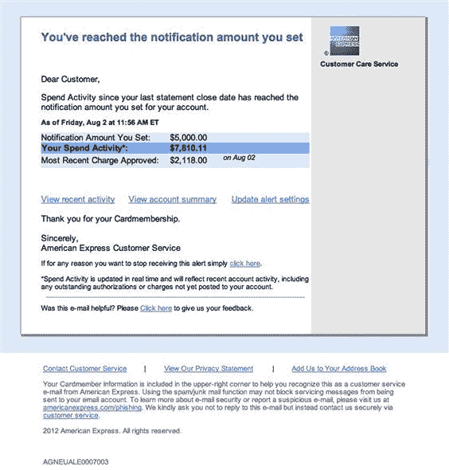

第九章

# 电子邮件攻击矢量

理查德·阿克罗伊德，RandomStorm Limited 高级安全工程师

钓鱼攻击之所以如此流行，是有原因的，它们有效。RSA，全球领先的信息安全组织之一，于 2011 年成功遭受了正是这种类型的攻击。本章将介绍创建成功的钓鱼攻击所涉及的过程和工具，作为社会工程评估的一部分，并旨在提高您客户的防御能力。

### 关键词

钓鱼攻击；钓鱼式攻击；客户端攻击

## 简介

在第八章中，讨论了利用开源情报来增强我们的评估的主题。其中包括收集公司电子邮件地址以在我们的攻击中使用。在本章中，我们将介绍如何利用这些情报以及如何执行一些常见的电子邮件攻击。

首先，将讨论钓鱼攻击的使用，分析它们为何如此有效的原因。着眼于“钓鱼式攻击”和“拖网式攻击”，以及它们如何在任何持续的参与中都有一席之地，并查看一些真实世界的示例以巩固观点。

下一个要讨论的话题是使用电子邮件进行主动信息收集的行为。这一活动将增强先前获得的情报，从而实现更有教育意义和有针对性的攻击。收集到的信息主要将来自于对精心制作的电子邮件的回复，以及离开办公室的回复。离开办公室的回复对社会工程师来说是绝对的宝藏，因此这将受到密切关注，并演示如何利用这些信息。

之后，读者将学习如何为社会工程师创建一些可信的理由或“借口”，以帮助他们在未经邀请的情况下联系某人。这些方法不需要像人们通常认为的那样复杂！保持简单。

接下来将讨论电子邮件攻击，调查一些常见的攻击类型，例如凭证窃取和使用恶意载荷。在本节中，将讨论电子邮件伪造与设置假域名之间的区别，作为攻击源。

事情将以检查如何使用 Metasploit 和社会工程工具包（SET）设置钓鱼活动而结束。这些出色的开源工具使这一过程变得比想象中更容易。

## 钓鱼攻击简介

什么是钓鱼攻击，为什么它很重要呢？从技术角度来看，钓鱼最初是向大量目标电子邮件地址发送电子邮件，目的是收集敏感数据。这些数据可能是用户名和密码，或者银行详细信息。攻击者可能的目标甚至可能是某人的信用卡详细信息。为了谈论这类攻击的真正根源，有必要回到几百年前，看看像“西班牙囚犯”骗局这样的书面信件攻击，本质上等同于今天的预付费欺诈。

钓鱼攻击不再局限于电子邮件，因为其他交付机制已被攻击者证明同样可靠。例如，社交网络站点是钓鱼的流行分发手段之一。另一种选择是弹出窗口和网站中嵌入的恶意内容。通常，这种机制出现在不太健康的网站上，比如那些含有成人或盗版内容的网站。俗话说，“*与狗躺着，起来添虱*”。

本章将重点放在电子邮件作为攻击的交付机制上。

几乎可以肯定，任何拥有电子邮件账户的人至少会见过钓鱼电子邮件，有些甚至被它们骗过。

最常见的钓鱼骗局一眼就能看出来。它们写得很糟糕，格式也很差，通常会被任何值得一提的垃圾邮件过滤器拦截。令人担忧的是更专业的努力。这些是那种将呈现出非常精心制作的电子邮件，看起来来自合法组织，如银行、eBay 或 PayPal。它看起来与真实组织的官方电子邮件完全相同，但有一个非常重要的区别。它旨在收集银行凭据或感染系统以安装恶意软件。

在更具针对性的“鱼叉式钓鱼”攻击中，攻击者在创建攻击时投入的努力可能是巨大的。电子邮件不仅与合法电子邮件难以区分，而且还会包含特定于其目标的钩子。在许多情况下，目标会感到被迫立即采取行动。这种攻击的根源很可能来自不太具有针对性的钓鱼活动。攻击者常常利用初始广泛范围攻击中收集的信息来建立鱼叉式钓鱼的基础。

## 为什么钓鱼攻击有效

从概念和实践的角度来看，为什么钓鱼攻击有效呢？

首先，谁是潜在的目标？你认识多少人没有电子邮件地址？我怀疑答案将是“*与我认识的没有手机的人数相同*。”谷歌最近发布了其 GMAIL 服务的一些数据。他们称，他们每月有 4.25 亿活跃用户！这只是一个邮件提供商，虽然是最流行的一个。

整个 Google 的发布内容可以在这里找到：

[`googleblog.blogspot.co.uk/2012/06/chrome-apps-google-io-your-web.html`](http://googleblog.blogspot.co.uk/2012/06/chrome-apps-google-io-your-web.html)

有了这样规模的目标范围，这几乎就像是在桶里捕鱼一样容易。总结这一点，饱和度是这一切的关键。为什么要针对少数人使用的鲜为人知的服务进行攻击，而不是针对可以针对数亿人的服务呢？即使只有少数人上钩，对攻击者来说仍然有很多好处。

为了将这一威胁置于背景中，RSA 反欺诈指挥中心最近的一项研究显示，2012 年，英国的消费者和企业因网络犯罪而损失了估计 270 亿英镑。其中，消费者损失的 60 亿英镑中，有 4.058 亿英镑归因于钓鱼攻击。根据这项研究，这使得英国成为全球最“钓鱼”的国家，损失的钓鱼金额是美国的 10 倍(*来源*: [`www.antifraudnews.com/scam-information/`](http://www.antifraudnews.com/scam-information/))。

因此，似乎绝大多数用户在执行与电子邮件相关的操作之前并没有仔细检查电子邮件。事实上，如果没有反病毒软件和反垃圾邮件软件，这对于当前全球超过 20 亿人口的互联网用户群来说肯定会是一个更大的问题，根据引用的谷歌文章。

### 客户端攻击

深入探讨钓鱼攻击成功的原因意味着需要稍微看一下技术，包括传统的防御策略。客户端攻击的概念是，发送到计算机的入站流量，即使在家中，通常也会被路由器或防火墙阻止。然而，任何出站连接很少受到相同限制的约束。在家里，客户端到互联网上任何资源的完整出站访问是有可能的，无论是合法的还是恶意的。即使在企业环境中，客户端也很有可能具有某些出站访问权限，尽管这些权限也会在一定程度上受到诸如防火墙和内容过滤器等安全设备的限制和控制。

这就是为什么电子邮件钓鱼攻击如此有效。举个例子，如果攻击者想要破坏系统，他们可能会选择在电子邮件中包含一个恶意文件，比如一个嵌有负载的 PDF。如果负载绕过了入站防病毒签名，也许是通过编码或加密机制，那么出站访问就会允许目标向攻击者建立返回连接。在某种程度上，这就像等待行星排列一样。创建一个既可以绕过外围防火墙又可以绕过客户端防病毒的负载是一回事，目标系统仍然需要对攻击具有漏洞性。这就是为什么对数百万封电子邮件进行广泛的钓鱼尝试是成功的原因。它们只需要找到 1-2%的处于脆弱状态的系统就足够有效，因此是有利可图的。

另一种方式，也可以说是更成功的方法，就是根本不附加任何东西。这些是最具风险的攻击方式，也是两者中更难检测到的。它通常是一封看起来像是来自金融机构的电子邮件，比如在线银行提供商。邮件中可能会有某种类型的请求，也许是一条通知，说有一笔大额出账交易从某个账户进行了，然后提供一个链接，登录在线银行以确认其合法性。当然，只要有人点击链接登录，他们的凭据就会被攻击者使用克隆站点收集起来。克隆站点很可能会将受害者重定向回合法的银行网站，让他们以为自己输错了密码。等到他们登录到实际账户时，账户已经是空的了。不幸的是，并非所有的在线银行提供商都采用了双因素身份验证设备，这只会加剧问题。尽管如此，即使是双因素系统也不能解决所有问题，如果认证被拦截，仍然有可能重放捕获的凭据来登录合法的银行网站；唯一的区别将是攻击者进行身份验证的受限时间。这是因为大多数双因素系统生成的是一次性使用的限时密码。这个过程可能会被攻击者自动化，所以时间限制很少成为问题。

总之，钓鱼攻击之所以有效，是因为目标数量庞大，客户端防御不够理想，以及人们愿意点击几乎一切他们收到的东西。

## 鱼叉式钓鱼（Spear phishing）与搜寻式攻击

### 搜寻式攻击

谈到基于电子邮件的攻击时，搜寻式攻击（trawling）无疑是最常见的。这些邮件每天都会收到，稍微有点可疑，已经发送给了数百万人。它们根本不是针对个人设计的，因此在收件人甚至还没有读完它们之前就可以轻松识别出来。前提是它们首先要到达收件箱。

在对组织进行评估时，原则仍然存在。会向在侦察阶段收集到的所有企业地址发送一封通用电子邮件。通常这是由于严格的时间框架或者因为客户想要测试内部系统和政策是否按照预期运行。事实上，虽然这些行动可以为客户提供价值，但它们相当笨拙，并且往往会在企业内触发广泛的警报。邮件的内容仍然会在一定程度上针对组织，但肯定不会像更有针对性的方法那样具有详细的细节。

## 鱼叉式网络钓鱼

鱼叉式网络钓鱼会采用更加个人化的方式进行攻击。会针对商业机构内的特定部门或个人，以确保能够获得合适的反应。

举例来说，一个在商业环境中工作并且每天都处理大量电子邮件的人，比如招聘顾问，很可能成为带有恶意简历附件的垃圾邮件的目标。他们很可能经常收到这种类型的电子邮件，因此，假设电子邮件的正文写得很好，他们很可能会打开附件。这次行动的侦察工作可以完全使用 LinkedIn 完成，在开源情报章节中有所涵盖。邮件并不需要很复杂，只需简单说明他们正在寻找某个特定职位的工作，并要求将你的简历记录下来，以便在有职位空缺时联系。

攻击手段可以比这个更加个人化。在过去一次任务的侦察阶段中，注意到目标组织的一名员工在当地一个壁球联赛中使用了他们的企业电子邮件地址。相关的电子邮件地址是使用“theharvester”发现的，而团队已经追踪到了它的来源。该网站详细列出了过去和即将进行的比赛，包括一些该员工将要参加的比赛。

攻击向量现在已经足够简单。甚至不需要为电子邮件注册一个假域名。只需假扮为联赛中即将出现的对手之一，并使用一个通用的 GMAIL 帐户，就可以创建一个针对受害者的电子邮件。该电子邮件将包含有关不得不临时重新安排的即将到来的比赛的信息，并提供一些有关新日期详细信息的有用链接。当然，这些链接在点击时将显示日期，因为这需要尽可能真实，但它也会加载一个损害他们系统的恶意 Java 小程序。选择攻击的正确时间至关重要。显然，这封电子邮件需要在办公时间内发送，以增加损害企业机器的机会。这也减少了损害非企业机器的风险，这绝对不是本意。

构建一个良好的鱼叉式网络钓鱼电子邮件极大地依赖于在侦察阶段收集到的情报。可能会发现没有可用的信息，因此整个组织必须被搜寻。正如在开源情报部分所指出的，追溯每个企业电子邮件地址在互联网上的来源通常会打开一些攻击途径，就像上面的挤压示例一样。在这里也不要忘记检查 Facebook Graph Search 的结果—“*在 xyzcorp 工作的人*”非常有用。也许，在这个阶段能够深入了解人们的兴趣，并找到可以利用的东西！

## 真实世界的网络钓鱼示例

在讨论了什么是网络钓鱼及其各种形式之后，提供一些真实世界的例子将非常有用，然而，有大量在线资源（[`www.hoax-slayer.com`](http://www.hoax-slayer.com)，[`www.antifraudnews.com`](http://www.antifraudnews.com)，[`www.securelist.com/en/`](http://www.securelist.com/en/)等）供读者使用，以加深对威胁的理解和认识。

## 美国运通—驱动下载

他们说一幅图画出千言万语，所以看看图 9.1。这是最近收到的一封电子邮件的示例。



图 9.1 驱动下载网络钓鱼电子邮件。

乍一看，它看起来并不可怕。实际上，对于一个偶然观察者来说，它可能看起来完全合法。品牌看起来还可以，布局也不错。事实上，这实际上是一个驱动下载网络钓鱼诈骗，最早在 2012 年被注意到，并且相当普遍。驱动下载基本上是在目标机器上下载恶意软件而目标不知情。通常通过恶意链接传递这些。

这封邮件的实际收件人既没有，也从未拥有过美国运通卡。显然，它被设计成发送给大量潜在目标，希望有几个百分点点击邮件中的一个超链接。点击链接会发现它们都指向同一个恶意 URL。在这种情况下，该站点可能托管恶意 Java 小程序或 ActiveX 控件，这将允许完全妥协任何易受攻击的系统。

始终值得在浏览器和邮件客户端中启用悬停功能。这些在指针悬停在链接上时显示真正的 URL。

## 阿塔纳索夫·加文博士——预付费诈骗

这是预付费诈骗的典型例子，而且相对而言写得相当不错。当然，这并不意味着商店更加可信。预付费诈骗（也称为 419 骗局或尼日利亚骗局）基本上是诱使受害者花费一点钱，承诺未来大笔报酬的过程。它们和时间一样古老，可以追溯到 19 世纪和“西班牙囚犯”骗局。关于这种类型骗局的更多信息可以在[`www.hoax-slayer.com/nigerian-scams.html`](http://www.hoax-slayer.com/nigerian-scams.html)找到（图 9.2）。


图 9.2 预付费诈骗电子邮件。

这种骗局有很多角度，但大多数都涉及某种错误的继承，或者至少是一个陷入困境的富有个人。当然，在当前 23 亿使用互联网的人中，受害者可能是唯一能够拯救他们的人。

别自欺欺人，这些邮件完全不可信，但肯定有人在上当受骗。否则，为什么它们会存在呢？正如已经指出的，这种骗局至少写得很好。这在钓鱼邮件中并不常见。这很可能是因为从事这种活动的热点地区通常不以英语为母语。

## 苹果 ID 诈骗——收集凭证

实际上，这是一种真正精心制作的钓鱼行为。前提是收到一封邮件，要求验证苹果 ID，方法是通过提供的链接登录。点击链接后，会看到一个非常专业的苹果 ID 登录页面的复制品。页面上的所有其他超链接都指向合法的苹果页面，除了“忘记密码”和“创建帐户”链接。这些链接实际上返回到攻击者的站点，该站点实际上呈现一个 404 错误页面。骗子显然还没有完全解决问题（图 9.3）。


图 9.3 苹果 ID 诈骗。

第一个线索是，苹果绝不会发送一封请求验证登录详细信息的电子邮件。第二个指标是 URL，与苹果毫无关系。看看图 9.4，看看这些欺诈活动是如何精心制作的。


图 9.4 低端电子邮件诈骗。

显然，很难将其与真实情况区分开来。最近，Apple ID 钓鱼诈骗案件正在增加。这可能是因为其中大多数与信用卡相关联，用于 iPhone 和 iPad 上的快速购买。类似这种的克隆创建，稍后在本章中进行讨论。任何之前没有创建过的人都会对整个过程的简单性感到震惊，以及这将在几秒钟内启动！

## 没有人会上当的。没有。从来没有。

这是尽可能低端的。即使垃圾邮件过滤器也捕获了这一个。因此，这个例子仅被包括进来，以展示苹果案例和这个劣质诈骗之间的对比。

是的，ccunit@zhot.net。看起来很合理。真的有人会上当吗？它们肯定有一定的流通原因。也许只是用于娱乐目的？事实上，亲自回应这封邮件，以科学的名义，实在是非常诱人的，尤其是在阅读了以下内容之后：

请回复此邮件，以便我指导您如何获取您的金额。

显然，已经花费了足够的时间讨论这个例子；事实上，花在讨论上的时间可能比制作这个骗局的骗子花费的时间还要多。

## 主动电子邮件侦察

尽管我们的社会工程学参与已经广泛讨论了侦察阶段，但仍然有进一步探索更多信息的空间。简单来说，电子邮件将发送到目标组织，而响应可以成为进一步攻击的基础。

这绝对是一种更具侵入性的信息收集方法，这也意味着更大的风险。这还意味着，随着风险而来的可能是更大的回报。可以发现一些小小的信息，这些信息对于任何正在进行的电子邮件攻击和总体参与都是非常有用的。即使看似无害的信息也可以为攻击者提供丰富的资源。例如，商业界几乎每个人都使用自动化的电子邮件离职回复，但是这样做合适吗？这是否会为潜在的违规行为打开大门？继续阅读以了解详情。

## 未投递报告

在这里，简要涉及了未投递报告（NDRs）的主题，因为它们通常至少包含有关组织资产的一些信息，特别是如果它们托管自己的邮件服务器。

这个过程相当简单，而且绝对值得花费 5 秒钟来执行。只需向目标组织的一个已知不存在的地址发送一封电子邮件。就是这样。

几秒钟后，会返回一个 NDR。这里感兴趣的是 SMTP 头中的 X-Received 和 X-Originating-IP 值。这些字段有时可能包含内部 IP 地址空间，这对于攻击者在适当位置时总是有用的！

```
  MIME-Version: 1.0
```

```
  X-Received: by 10.68.254.42 with SMTP id af10mr2443747pbd.154.1378061024083;
```

```
  Sun, 01 Sep 2013 11:43:44 -0700 (PDT)
```

```
  Received: by 10.70.28.225 with HTTP; Sun, 1 Sep 2013 11:43:44 −0700 (PDT)
```

```
  Date: Sun, 1 Sep 2013 19:43:44 +0100
```

如果评估的一部分需要插件和黑客攻击，一旦组织总部被物理入侵，这绝对值得一小笔支出。至少会知道一些内部 IP 地址空间。

## 离开办公室时的自动回复

许多企业鼓励员工使用它们，但通过使用它们会透露哪些信息？人们是否通过包含过多信息而使自己暴露于攻击？在大多数情况下，答案是肯定的。人们通过泄露看似无害的信息而使自己暴露。

在合作期间，即使不进行直接的电子邮件攻击，离开办公室时的自动回复也是情报的绝佳来源。

可以找到什么，以及如何利用这些信息？

首先，它确认了账户的存在以及有人在使用。这可能是在合作期间可以验证的第一点。它还确认了电子邮件地址的公司命名约定。当然，这意味着可以根据最佳猜测调整任何电子邮件列表。

在离开办公室时，通常会在自动回复中包含“*我离开时应联系谁*”的信息，这至少为接下来的合作提供了更多确认的联系方式。当打电话时，可以提及缺席员工的名字。例如，“*嘿，上周我和汤姆交谈过，他说他这周要休假，但说我可以过来坐坐，用他的桌子。我到接待处时可以找你吗？*”或者如果觉得这样有点冒险，“*他说他已经为我安排了一个会议室/热座，你能告诉我到达时需要和谁联系吗？*”再次强调，这不仅通过知道员工的名字建立了可信度，还表明他们在被打电话时会不在。一种普遍的看法是目标会立即将这种情报与自动回复联系起来，但事实上，大多数人根本不会多想。

接下来，也可能是回复中最有用的信息，将是签名。签名中充满了诸如直拨电话号码、移动电话号码等诱人的信息，更不要忘记签名本身。然后，整个签名将被复制并在与目标组织的其他员工交流时使用。这将是因为注册了类似目标的域名。令人惊讶的是，这种方法有多么有效！这将在本章后面更详细地讨论。

在回应中我们还会期待看到什么？一个明显且常见的包含是办公室离开的日期和预计返回日期。这在测试的物理部分中可能非常有用，特别是当其他线索很少时。在处理这种情况时有几种合理的选择。

## 不存在的会议

第一种选择是出席与缺席的个人的会议。然而，这与工程师能否轻松扮傻和在接待员发现目标缺席时表现出惊讶紧密相关。此时，常常会认为游戏结束了，然后离开，但如果操作得当，可以进一步利用接待员的愧疚感，比如“*我们来这么远只是为了见他，而且被保证他会在，你确定他今天不会回来吗？*”此时，可以鼓励接待人员再次核实，始终展现出礼貌和专业的态度，尽管表现出不耐烦通常会迫使个人做出积极的回应。确认目标缺席后，可以询问接待员是否有一个安静的地方可以打一些私人电话，以确认发生了什么，也许是一个会议室？幸运的话，这可能会为进入建筑物铺平道路，但在最坏的情况下，工程师可以毫无疑虑地离开，而不引起任何怀疑。与会议室的替代方案是询问目标是否有一个食堂，以便在再次上路之前吃点东西和喝点东西。当然，如果事先已经确定食堂区域超出了物理安全控制范围，这将更有用。在过去的合作中，社会工程师已经被发放通行证，并被引导走向通往食堂区域的门。在去食堂的路上有一排会议室，每个会议室都有活动的接口。接下来会发生什么，不难猜到！

## 冒充缺席的员工

这个可能更难以实现，但在多次实践中我们成功过。其前提很简单，你打电话给一个联系人，最好是前台，假装是离开的员工。你告诉前台有一个与承包商的会议，他们打算进行一些重要的维护工作，但被忽视了你请假了，但你忘了自己有承包商来为你执行工作，而且不能与他们见面。此时，需要澄清的是，你询问在这种情况下安排通行证的程序是什么？此外，在此时，还可以尝试预订一个会议室，以便承包商有地方可以工作。这是一种令人惊讶的有效但简单的获取未经授权进入场所的方法。经常发现，如果咨询师能够表现得焦急，并暗示你真的犯了一个大错，更有可能从目标那里引起同情。你甚至可以考虑通过提到安排工作的费用以及试图避免你的老板发现你犯了如此基本的错误来加强同情票。这对你的参与有两个效果。首先，你通过提及一个有权威的人物增加了一点压力。其次，前台不太可能告诉内部任何人正在发生什么。当这个计划成功时，进出都非常顺畅。关键部分是能够以合理的方式完成面对面的事情。然而，已经通过电话安排好通行证后，面对面的事情就更容易了。这与对你的前文有真正信仰是一样的，这也使得出现变得更容易。必须有强烈的信念，认为存在合法的理由在那里。  

## 创建可信的电子邮件情景

现在我们已经看到了通过这些技巧我们可以获得多少有用的信息，那么在发送电子邮件时，我们如何避免被识破呢？我们需要一些足够通用以避开怀疑，但又足够具体以获得人们回应的情景。

在本节中，我将介绍一些我们过去成功使用过的可用示例。

记住，你不一定需要演出这个前文；你只是在寻找员工的回应或者离岗信息。不要想得太复杂，只需要构想一些情景，让你被联系到是出于未经邀请的状态，并将其塑造成你自己的情况。

这并不是说你不能将最初的侦察转变为攻击。这取决于你得到的回应类型。如果你觉得可以与某人建立融洽关系，或者可能找到一个易受攻击的目标，那就去试试吧。

如果您将电子邮件发送给许多人，请确保将所有目标密件抄送到电子邮件中。一封发给一百个内部联系人的邮件总会引起目标组织的警觉

## 工作经验实习

这是最直接的策略之一，通常可以发送到企业内任意数量的电子邮件地址。只需确保每个目标都在密件抄送字段而不是收件人字段中。尝试将电子邮件目标列表分成几组，以避免在一次尝试中烧毁所有桥梁。

这个想法很简单，建立一个虚假的邮件账户，选择提供者，比如 GMAIL。考虑使用一个女性名字来设置账户，以利用 IT 行业被认为是男性主导的环境这一事实，结果人们比起男性更不警惕。如果对目标有更多了解，这可以定制以匹配特定目标。

因此，请考虑发送一封类似以下内容的电子邮件：

早上好，

我目前正在寻找一份作为大学学位一部分的工作经验实习。我正在寻找当地的企业，并注意到贵组织在我选择的市场营销领域非常突出。您能告诉我您是否接受工作实习生，或者将来是否会这样做吗？您能提供的任何与此相关的帮助将不胜感激。

致以最诚挚的问候，乔安妮

避免过于复杂或过度思考的方法。没有必要用一大段文字来压倒目标，因为目标一看到就更有可能将其放入回收站。现在，只需坐下来等待回复即可。

通常情况下，预计会收到一些外出办公回复的消息，它们的实用性已经被讨论过了。几乎不可避免地会有人回复，提供更多信息或者提供信息表明这封电子邮件将被转发给相关部门。偶尔，这封电子邮件可能会将相关部门抄送到电子邮件中，提供另一个有效的目标。

## 武器化情景

武器化这种方法相当简单，但依赖于组织内可以建立关系的人的回复。如果你能在几封电子邮件中保持对话，目标就会完全放松警惕。不要低估通过电子通信与某人交流的感觉。这就是我们生活的时代！

在这一点上，现实的做法是附上您的简历，或者附上您的网站链接，其中有您的工作样本。当然，简历中将嵌入一个有效负载，而作品集将提供一个恶意的 Java 小程序。我会说，考虑到目前的情况，网站链接更有可能逃避安全系统的检测。

## 大学项目

这是另一种简单而不错的方法，它的工作方式与“工作经验实习”类似。这个想法是利用与目标企业相关的学校或学院项目，并询问是否有人在企业内部有能力提供帮助。通常最好选择一个在该地区的教育机构，他们可能以前可能已经联系过的机构。

下午好，

我目前在 XYZ 学院学习，并且正在从事与航空航天领域广告使用相关的项目。我的一个朋友注意到您位于该地区，并且在行业中很受尊敬。我想知道您是否能给我一些建议或提供能够帮助的人的联系方式？我在项目上有点落后，所以任何帮助将不胜感激。

亲切的问候，罗布·史密斯

再次强调，这只是一个简单的电子邮件，类似的事情企业可能会经常收到。冒充学生提供了保证，而且电子邮件中没有任何不合适的地方提供了一个保证干净的退出，如果需要的话。

## 武器化情景

鉴于正在寻求项目帮助和批评，这种情况非常适合包含一个指向工作的链接，当然这可能是恶意的。更好的是，如果社会工程团队中有足够年轻的成员可以做到，为什么不看看是否可以安排面对面会议，与企业内部的某人见面。出现并有护送、通行证和在那里的理由是最好的。一个非常基本的网站可以在很短的时间内完善，以增加可信度。此外，考虑准备一些问题，可能会透露有关内部系统的信息。

例如，其中一个问题可能是：

您是如何监视竞争对手在广告方面的做法，并保持领先的？

如果他们回答说他们使用互联网来研究他们选择的领域，那么他们无意中提供了关于他们拥有出站互联网访问的非常必要的信息。这在以后的有效载荷部署中可能会派上用场。显然，鉴于已安排了面对面的访问，原始链接不会是恶意的，以避免被发现的风险。它可能是一个记录所有访问的干净网站，以便了解网络访问的水平，以及他们正在使用的浏览器类型。

另一个非恶意网站的有趣想法是在页面中包含一些指向实际存在于不同端口的其他页面的链接。例如，TCP/22 用于 SSH。如果链接对目标有效，它将能够将流量隧道化到网络外。

因此，经过几个例子的介绍，以及您如何在实际参与中使用它们，让我们用一些更多的例子来总结本节。我不会设计一个示例电子邮件，让您自己想出一个场景。

## 招聘顾问

同样地，关键在于不受欢迎的招聘顾问的电子邮件是司空见惯的；因此，这不会引起警觉。

假设是有几个候选人，担任不同的角色需要被安置，其中一些候选人将是业务中可用角色的理想人选。在邮件中提供一些候选人及其技能的详细信息，并使其看起来可信。

同样地，可能会有自动回复、非送达报告（NDRs）和真实回复。希望在真实回复中能找到愿意处理邮件或至少提供相关详情的人。然后可以引入包含嵌入式负载的简历。

## 销售人员

这将是获取有关内部系统信息的一个好场景。例如，如果任务是确定目标组织是否使用思科交换机；可以伪装成硬件供应商的电子邮件，提供一些关于思科交换机的好交易。他们可能会无意中提供他们已经有了思科设备的首选供应商的信息——结果！从这里，可以通过几封电子邮件逐渐发展关系，并逐渐获取更多信息，甚至可能导致对目标的电话。这种情况可以应用于任何技术以获取有关基础设施的信息。对于终端用户明显可见的技术，甚至可能会得到他们的回复。这里的一个经典例子是防病毒软件。请记住，任何直接收到的回复都是一个额外的好处。这纯粹是在寻找可以在进一步攻击中使用的非送达报告、签名和自动回复。

这些类型的电子邮件，只要稍加时间和精力，就可以为评估带来巨大的成果。在看完创建个别攻击之前，以下是一些防范钓鱼攻击的基本思路！

## 防范钓鱼攻击

防范钓鱼攻击可以分为两个高层次的类别：技术方法和人为方法。这两者的结合最有可能防止这些类型的攻击。本章不会讨论教育员工的具体细节；这些只是改善你的姿态方法的高层次想法。

教育和意识方面的想法在第十五章中有更详细的介绍。

## 技术方法

钓鱼攻击的技术方法是那些终端用户实际上并不涉及的方法。换句话说，尽量在人为参与之前尽量减少风险。下面将讨论一些可能有所帮助的技术。

### 在网关、邮件服务器和终端或客户端机器上设置垃圾邮件和防病毒产品

这些解决方案将挑出易捡的果实和明显的欺诈行为。

### 基于主机的入侵预防或“HIPS”产品，以及基于网络的入侵预防系统

这些系统可以识别出恶意活动和网络流量，假设流量未加密。

### 客户端应用程序打补丁

确保客户端应用程序保持最新。这包括 Java、Adobe Reader 和浏览器！绝大多数客户端攻击都针对 Java 和 Adobe 产品。

### 出站内容过滤——防火墙和代理

将出站端口访问限制到绝对最低限度应该是首要步骤之一；然而，这在许多组织中都是缺乏的。大多数企业倾向于关注入站访问并保护周边。这导致了坚固的外部，软弱的内部的情况。

使用白名单的内容过滤可能是更好的方法之一。维护一个允许网站的最小列表，几乎没有恶意链接会漏过检查。透明代理可能是最佳选择，因为它们对用户来说是最难绕过的，而且他们会试图绕过它们。

## 人为方法

人为方法是用户在工作时可以直接实施的方法。它们通常是应该在家和工作场所都实施的简单建议。

首先，确保在悬停在超链接上时显示真实的 URL。用户需要知道其功能，并且需要解释，显示为链接的内容并不总是合法的。

在工作场所教育用户一般信息安全实践也会有所帮助。例如，确保用户知道合法的服务和企业不会发送要求敏感细节的电子邮件。

运行悬赏计划。如果用户识别出恶意电子邮件并将其提请给技术团队，他们将获得奖励。然后使用恶意电子邮件来教育普通用户群体。显然，避免仅仅将其转发到整个邮件列表—例如选择截图。

尽可能向用户展示更多的钓鱼邮件示例，并指出它们之间的共同特征。

给用户灌输一种偏执的感觉可能看起来有些极端，但在涉及到未经请求的通信时，这是唯一的出路。每一份入站通信都应该被仔细检查是否存在恶意内容。

记得在邮件客户端中启用功能，以便在发件人字段中显示完整的电子邮件地址。许多邮件客户端会用发送者在配置他们的帐户时设置的名称来替换此内容！

## 建立自己的攻击

在本节中，我们将探讨设置社会工程学参与的电子邮件攻击。通常来说，大多数参与方会使用 SET——[`www.trustedsec.com/downloads/social-engineer-toolkit/`](https://www.trustedsec.com/downloads/social-engineer-toolkit/) 和 Metasploit——[`www.metasploit.com`](http://www.metasploit.com)。

这两个工具都可以免费获取，并且都随着 BackTrack 和 Kali Linux 一起发布。

SET 由 David Kennedy，又名 ReL1K 创建，是一个用于自动化评估大部分工具的框架。对于本节，我们将专注于与电子邮件相关的攻击。

## 欺骗电子邮件与伪造域名

在我们实际执行攻击之前，我想谈一下关于电子邮件攻击的一个重要问题。

首先，人们仍然谈论欺骗电子邮件，好像它们在当今的环境中具有相关性；但实际上，它们很少起作用。有几种不同的技术使欺骗变得非常困难，并且存在于许多邮件网关中。首先，大多数产品会意识到外部邮件不应该来自内部或公司域。换句话说，如果你欺骗邮件看起来是来自 bob@offensivesite.com，邮件网关会知道你不属于这里并删除消息。

第二个特性是反向 DNS 查询。邮件网关会检查你的 IP 地址是否解析为你在 SMTP 连接时声称发送的域。当它意识到没有匹配时，它会删除或隔离你的消息。这意味着你需要有一个正确设置的 SMTP 服务器，并且你需要拥有一个可以使用的域。所以相信我当我说，你永远不会以 bill.gates@microsoft.com 发件人地址给微软的某人发送邮件。这是不可能的。除非你是比尔·盖茨，如果是的话，谢谢你购买这本书，比尔。这并不意味着你不能在向另一个组织发送邮件时冒充比尔；这只取决于他们的邮件网关和相关安全产品设置得有多好。

欺骗电子邮件的最大问题之一是，即使你认为它们可能有效，你也会冒着等待回复浪费大量时间的风险。电子邮件攻击是盲目的努力，除非你收到自动回复或实际回复，否则你不会知道它是否达到了目标。

因此，如果你想要让你的电子邮件看起来像是来自内部联系人，最好的选择就是注册一个类似的域名，或者一个与之相同但顶级域名（TLD）不同的域名。例如，你的目标可能在使用[offensivesite.com](http://www.offensivesite.com)，但我们可以去注册[offensivesite.net](http://www.offensivesite.net)。你认为在一个组织中有多少非技术员工会注意到这个差异？即使他们注意到了，他们会质疑吗？也许这是另一个可以考虑纳入组织教育政策中的事项。

谈到注意到差异，还有一个有趣的欺骗想法。在大多数邮件客户端中，当接收到一封电子邮件时，你看不到发送者字段中的电子邮件地址。你看到的是一个名字。这个名字是发送者在设置他们的账户时定义的，本身也可用作一种欺骗手段。对于未来的参与者来说，这绝对值得牢记，而且是的，这在以前的某些情况下确实奏效过。

我的首选方法始终是注册一个类似的域名。有时候，你可能会被迫更换一些看起来相似的字符，因为所有的域名都被占用了，但这只是其中一部分乐趣。通常我们会使用谷歌应用程序进行此过程，因为它简单且快速上手。你注册你的域名，几乎可以立即开始为任何你最喜欢的借口设置多个邮箱。你可以为每个账户设置一个与目标组织相匹配的 HTML 签名，这只会增加合法性。事实上，我敢说大多数人可能只看这个来判断电子邮件是否来自内部联系人。这就像是电子时代的制服！

阻止包含你公司名称的任何域名不是一个好主意吗？即使你没有拥有该域名本身？值得思考。

## SET

正如我们之前简要提到的，SET 是一个出色的社会工程学框架，将极大地帮助您减轻参与的工作量。对于你的客户来说，这意味着你可以在更短的时间内提供更多价值。每个人都赢！

那么我们在哪里可以找到 SET 呢？假设你正在使用 Kali Linux，你可以在命令 shell 中键入 se-toolkit，或者在 Kali 菜单中找到它，路径为应用程序>Kali Linux>利用工具>社会工程学工具包。

在此时假设没有发生任何爆炸，你应该会看到类似于图 9.5 的东西。


图 9.5 SET 菜单。

SET 完全是菜单驱动的，这使得它非常容易上手。我会从按下“5”键开始，并等待任何更新完成后再继续。

## 鱼叉式网络钓鱼攻击向量

鱼叉式网络钓鱼向量是一种非常流畅、自动化的方式，可以创建和传递恶意文件给选择的目标。SET 包含执行所有繁重工作的功能，包括发送电子邮件。接下来是创建负载并使用 SET 登录到 Google Apps GMAIL 帐户并发送电子邮件。

如果这将定期进行，那么建立模板并使用 SET 传递任何恶意电子邮件可能是值得的。

因此，如果您现在正在查看 SET 的主页面，请选择 Spear Phishing Attack Vector 的选项 1，然后选择选项 2 创建一个 FileFormat Payload。

在这一点上，您将看到一个庞大的选项列表。如果您对目标的内部系统了解足够，最好选择适合环境的选项。在这个例子中，我们将坚持基本原则，在 PDF 中嵌入一个恶意可执行文件—选项 15（图 9.6）。


图 9.6 PDF 嵌入式 EXE。

接下来，您将选择使用自己的 PDF 作为恶意文件的基础，或者使用空白模板。在这里的选择将取决于您希望摆脱多干净。也许您需要一个备用计划，以防负载路径不起作用。在这种情况下，请确保您的 PDF 包含与您现有假设相关的一些有效内容。出于演示目的，我们将选择内置的空白 PDF。

在这一点上，如果您熟悉 Metasploit，您将会认出这一页上的许多内容。这是您选择要部署的负载类型的时候。在这一点上，您需要仔细考虑您的目标。可能值得看看加密的负载，以确保应用防火墙和入侵防御系统不会破坏您的计划。

为了示例起见，我们将坚持使用反向 Meterpreter 负载—选项 2。该负载将连接回我们，假设目标在我们定义的端口上具有出站连接。再次值得考虑典型客户端可能具有的出站访问类型，例如 TCP/80 上的 HTTP 或 TCP/443 上的 HTTPS，因为我们将在下一步定义这个。

在提示时输入您的 IP 地址和您想要监听的端口。我们将选择 TCP/443，因为它比 TCP/22（SSH）更有可能被允许出站。

在这一点上，如果你愿意，你可以选择重命名文件。再次强调，如果有必要，使其符合你的假设！

现在您应该看到 SET 大规模电子邮件屏幕，这是我们设置谁将接收我们的负载的地方。

选择选项 1—电子邮件攻击单个电子邮件地址

选择选项 2—一次性使用电子邮件模板—现在你可以输入自己的电子邮件内容。

选择选项 1—使用 GMAIL 帐户进行电子邮件攻击。

标准的 GMAIL 帐户会扫描 PDF，因此您可能会在这一点被阻止。Google Apps 商业帐户的限���较少。

现在，您将被提示输入您的 GMAIL 帐户和密码，或者如果您选择了其他 SMTP 服务器，则输入其详细信息。

邮件将被发送，现在您将被提示设置一个 Metasploit 监听器。同样，SET 将根据您为恶意 PDF 提供的详细信息为您处理这个问题！图 9.7 显示了建立监听器的过程。


图 9.7 有效载荷处理程序。

在这一点上，这是一场等待游戏。在 Metasploit 中建立会话之前，不会知道有效载荷是否通过了所有防御技术的层层审查。它看起来是什么样子？

```
[*] Sending stage (751104 bytes) to 10.10.200.56
```

```
[*] Meterpreter session 2 opened (10.10.200.26:443 -> 10.10.200.56:1062) at 2013-09-04 16:32:08 +0100
```

此时，您可以运行所有常规的后期模块，或者在需要时尝试权限提升。我可能会从“hashdump”开始，以获取用于离线破解的本地帐户哈希。然后我会使用 incognito 检查域模拟令牌。有关后期渗透工作的信息，请参阅出色的《Metasploit：渗透测试员指南》，ISBN-10：159327288X。

在这里实现相同结果的其他方法有很多。使用 Metasploit 创建有效载荷，并使用所选的邮件客户端进行传送。重要的是有效载荷能够到达目标。

## 这种方法真的有效吗？

所有的写作都融合了一些真实世界的观点，因为归根结底，这是一本实用指南。我们讨论的任何内容都需要起作用。长话短说，这些类型的攻击确实越来越难以执行。现在有许多不同的技术可以用来减轻电子邮件带来的威胁，人们的意识也在提高。话虽如此，我们仍然看到了相当水平的成功。这绝对仍然是一项值得的练习。我建议您查看各种编码器、打包程序和加密器，尝试绕过这些防御。一个好的起点是查看 Veil 框架。这个工具集允许创建的有效载荷通常可以绕过大多数杀毒软件解决方案，但仍与 Metasploit 兼容。查看 Christopher Truncer 的网站获取更多信息——[`www.christophertruncer.com/veil-a-payload-generator-to-bypass-antivirus/`](https://www.christophertruncer.com/veil-a-payload-generator-to-bypass-antivirus/)。

让我们继续看看与直接发送恶意有效载荷相比的另一种选择！

## 恶意 Java 小程序

据我所知，Java 已经成为安全相关新闻媒体的头条新闻已经很长时间了，不幸的是，并不是因为正确的原因。它安装在全球数十亿台设备上，包括客户端工作站、服务器和基础设备。

近期注意到了几起针对 Java 软件的高调黑客攻击。微软、苹果和 Facebook 都是受害者之一。

您可以在以下链接中了解更多关于这些黑客攻击的信息：

[`blogs.technet.com/b/msrc/archive/2013/02/22/recent-cyberattacks.aspx`](http://blogs.technet.com/b/msrc/archive/2013/02/22/recent-cyberattacks.aspx)

[`www.facebook.com/notes/facebook-security/protecting-people-on-facebook/10151249208250766`](https://www.facebook.com/notes/facebook-security/protecting-people-on-facebook/10151249208250766)

[`www.bbc.co.uk/news/technology-21519856`](http://www.bbc.co.uk/news/technology-21519856)

这种类型的攻击针对客户端软件，以避开周边安全系统，并且有效！

鉴于这种类型的攻击正在现实世界中进行，它们也为我们的客户提供了出色的实际评估。因此，您可能认为设置这将非常复杂，并且在短期测试中耗时太长，不切实际。实际情况完全不同。SET 为我们提供了这种易于使用的功能。它是如何工作的。

您在公共服务器上托管一个克隆或定制的网站。这可能是目标公司网站或远程访问门户的直接克隆。该网站将由 SET 嵌入一个恶意的 Java 小程序。只要用户接受 Java 小程序，此有效载荷将在任何易受攻击的系统上提供一个 Meterpreter shell。

让我们走一遍，以证明这种攻击是多么简单直接。

假设您已经打开 SET 并按照以下步骤操作：

选择选项 2——网站攻击向量

选择选项 1——Java 小程序攻击方法

选择选项 2——网站克隆器

此时将询问您是否使用 NAT 或端口转发。换句话说，您是在路由器后面还是防火墙后面？询问的原因是需要确保反向监听器设置为有效载荷中的正确 IP 地址。如果您没有正确设置这一点，您的受害者最终会连接回您的私人 IP 地址，您的有效载荷将永远无法离开目标网络。为了我们的练习，我们将选择否。

为反向连接设置一个 IP 地址。这可能是您的 Kali Linux 或 BackTrack IP 地址。

输入要克隆的网站—我选择 GMAIL 进行此练习。

此时我们被要求再次选择有效载荷。

选择选项 2——Windows Reverse_TCP Meterpreter。

选择选项 4——后门可执行文件。

选择监听器的端口——现在保持默认值，TCP/443。

此时，SET 将启动 Metasploit 并自动启动各种监听器和处理程序。现在您需要做的就是让某人点击您的链接，那么我们该如何做呢？我通常会使用一个虚假的域，并确保我的借口是可信的。也许您会冒充支持团队的成员，并要求某人验证他们的凭据是否仍然适用于 VPN 或 Outlook Web Access。

无论您选择哪种诈骗，记住您可以更改显示的文本而不是实际 URL。查看图 9.8。


图 9.8 恶意超链接。

链接[owa.offensivesite.com](http://www.owa.offensivesite.com)实际上是指向[`192.168.1.153`](http://192.168.1.153)的链接，在这种情况下，这是我的实验室机器。这就是悬停的重要性所在！

在 Google Apps 中，您可以通过点击链条图片的小链接图标来实现这一点。您可以在“显示文本”框中放入任何值，当您的受害者收到电子邮件时，这就是显示出来的内容。那么当您的目标浏览网站时会发生什么？查看图 9.9。


图 9.9 恶意小程序。

正如你所看到的，用户仍然需要点击运行 Java 小程序，所以我们仍然需要克服一个障碍。不过只需要一个目标不小心，你就成功了。

```
[*] Sending encoded stage (751134 bytes) to 192.168.1.89
```

```
[*] Meterpreter session 1 opened (192.168.1.153:443 -> 192.168.1.89:1302) at 2013-09-05 20:32:08 +0100
```

这种攻击的一个有用方面是，即使有效载荷没有成功，每次点击仍然会记录在 Metasploit 控制台中。从技术角度来看，系统可能看起来很安全，但用户仍然在点击恶意链接。只需要一个零日漏洞就可以危害这些系统。

现在我们已经介绍了几种在钓鱼攻击中获取 shell 的不同方法；让我们看看使用克隆网站进行凭证收集。

## 使用克隆的网站来收集凭证

当涉及社会工程学时，这绝对是一种受欢迎的攻击类型。没有什么比等待第一个目标开始输入用户名和密码更令人兴奋的了。最近，克隆网站用于收集凭证的做法引起了公众的关注。叙利亚电子军似乎已经将其作为首选攻击向量，并迄今已经攻击了几个知名目标。他们通常会克隆属于目标组织的 Outlook Web Access 页面，然后使用各种方式欺骗目标登录。老实说，他们的一些攻击方法至少可以说是基本的，但仍然使他们能够访问一些真正知名目标的 Twitter 账户。这实际上只是一封电子邮件中的一个链接，没有解释，没有铺垫，几乎没有可信度。电子邮件看起来可信的原因是其中许多来自同一域中已经被攻击的帐户。这只是表明，即使是来自你认识的人的电子邮件也不能信任！

这类攻击在现实世界中如此普遍，使它们成为社会工程学参与的一项极好的实践评估。

那么，我们如何克隆一个带有登录表单的网站呢？好吧，SET 再次出现了。当我向你展示这些家伙是如何简化这个过程时，你就会明白为什么这是一种如此受欢迎的攻击方式。它也不依赖于任何类型的恶意文件，这意味着你不太可能受到安全设备或软件的限制。

再次启动 SET，并选择选项 2——网站攻击向量。

接下来选择凭证窃取攻击方法——选项 3 (图 9.10)。


图 9.10 凭证窃取攻击方法——选项 3。

在这一点上，你会被要求提供你的 IP 地址和一个要克隆的网站。我们将再次选择[www.gmail.com](http://www.gmail.com)。

同样，链接必须以更有可能被点击的方式传送，比如在“恶意 Java 小程序”部分给出的好例子。

SET 控制台会在输入凭据时显示任何凭据。然后它会将受害者重定向到实际的 GMAIL 网站，并告诉他他输错了凭据。希望他们没有注意到，攻击就能悄然进行。

正如在图 9.11 中所示，Bob 的 GMAIL 密码成功被捕获。如果这种攻击针对客户的 VPN 登录门户或 Outlook Web 访问，则此攻击将更具相关性。如何处理这些凭据在很大程度上取决于参与的范围。顾问可能会现场出现并使用它们登录桌面，或者直接使用它们登录 VPN 门户。无论哪种情况，这都是一种非常有效的测试方法，可以突显出政策和程序中的弱点。希望客户能够解决这些问题。


图 9.11 捕获的凭据。

## 这一切真的都是社会工程吗？

当我们引入新工具进行评估时，我经常问自己的一个问题。在许多情况下，您将执行混合评估，涵盖社会工程和渗透测试。在这种情况下，我们讨论的一切肯定都符合要求。我对这个问题的感觉是，攻击者不会把一只手绑在背后然后开始入侵。他们会利用任何可以利用的工具，无论是传统的社会工程和操纵策略，还是更多偏向于黑客攻击的东西。

对我来说，这取决于您如何发送电子邮件以及您在其中包含了什么内容，它是否真正可以被归类为社会工程。您是否使用了人类影响的因素？是否涉及借口？对于这些问题的答案很有可能是肯定的，而您甚至可能意识不到。社会工程的一些元素对我们来说是非常自然的。思考“*什么会促使我点击这个链接？*”的思维过程通常足以产生结果，而无需过度思考。

这是一个示例，来结束本章内容（图 9.12)！


图 9.12 示例电子邮件。

这里的电子邮件显然不是真实的，但是基于客户在评估的反馈部分中展示的内容。真是有趣，有多少传统的社会工程学概念和技巧涉及到了电子邮件攻击，只是在不同的环境中和通过不同的媒介传递。这再次证明了这是另一个非常简单的钓鱼攻击的例子。毫不奇怪，链接没有指向 Facebook！

## 总结

在本章中，解释了钓鱼攻击的所有方面，从一些真实世界的例子开始，有些很好，有些不太好。

然后，我们转移到了使用电子邮件作为侦察工具进行情报收集的艺术。我们看了在这个简单练习中可以恢复的信息类型，以及我们如何利用它们来进行进一步的攻击。由于通常包含大量信息，因此强调了自动回复的实用性。这些信息包括进一步的内部联系信息、电子邮件签名和目标缺席的时间框架。

我们随后研究了一些关于这种情报收集的可信情景。基本上，这些是可以发送而不触发任何警报的电子邮件。

与攻击相关的话题如果没有一些防御性的想法将不完整，所以我们简要地涉及了一些在这个不断变化的领域中可能有所帮助的概念。

我们转移到了执行我们自己的攻击的话题，首先讨论了电子邮件伪造与假域名之间的区别。然后，我们看了主要的攻击类型，包括凭据收集和通过各种方式传递负载。

为了总结本章，我们来看一个典型的钓鱼电子邮件，并确定了传统社会工程学技能如何适用于其中。

接下来我们将在下一章中看一下电话攻击向量。
