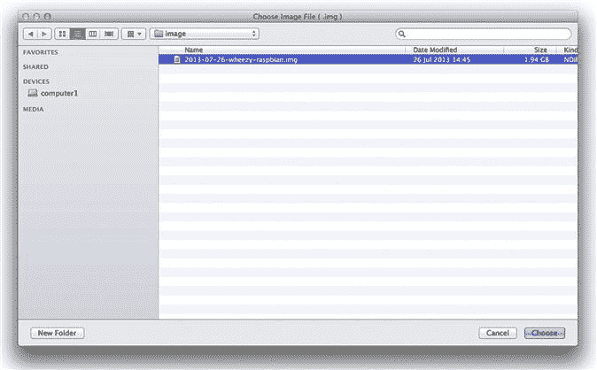

第十二章

# 用技术支持攻击

Richard Ackroyd，高级安全工程师，RandomStorm 有限公司

每个人都喜欢小工具，但除了是有趣的玩具外，它们还可以被利用以为社会工程攻击提供另一个维度。老套路是把无线接入点放入企业网络中并离开，但这实际吗？还有更好的工具吗？本章将涵盖 3G dropbox、无线工具和 3G KVM 开关。我们将步骤性地介绍如何在目标网络中构建支持完整虚拟专用网络（VPN）的 3G 启用 dropbox。

### 关键词

RaspberryPi；3G；dropbox；Raspbian；OpenVPN；反向 SSH

本章信息

连接到网络

电缆和实时端口测试仪

上网本

我在哪个子网？

端口安全

远程连接到网络

Dropbox

Dropbox 挑战

Pwnie Express

RaspberryPi

Intel NUC

亦属次等

构建您自己的‘Dropbox’

安装操作系统

回家打电话

设置基于证书的身份验证

创建 SSH 反向隧道

让它固定

添加 3G/4G 支持

选择一个 Dongle

屏幕，无线和其他硬件

Adafruit Pi Plate

无线 Dongle

为您的 Dropbox 选择一个外壳

将 OpenVPN 添加到我们的后门

路由问题及其克服方法

替代 Dropbox

3G 和 IP KVM

路由器

无线接入点

妥协内部系统

其他有用的小工具

按键记录器

音频录音设备

Teensy USB

恶意 USB 驱动器

WiFi Pineapple

## 介绍

在第十一章中，我们介绍了物理攻击向量，这通常占据社会工程评估的大部分内容。

本章重点介绍了各种小工具。我们将涵盖可用于增强我们评估的不同类型技术。

我们将研究连接到目标组织网络的过程以及可能阻碍此过程的常见障碍。我们还将研究一些设备，这些设备可以让我们能够从远程位置执行剩余的工作，有时被称为“dropboxes”。

在尝试评估的物理访问部分时，始终携带有用设备是很有用的，因此我们也将涵盖这些设备。

我们将通过查看 WiFi Pineapple 来结束本章，以帮助在参与过程中进行无线攻击。

### 远程连接到网络

如果定期进行社会工程评估，就会需要外泄数据。毕竟，这是对实际攻击的模拟。这可以是文件柜突袭，公司财产的移除，或者连接到网络并通过黑客方式达到目标。在本节中，将涵盖一些可能遇到的障碍和潜在的解决方法，以及在此任务中可能有用的一些技术。

#### 电缆和实时端口测试仪

典型的电缆测试仪需要访问物理网络电缆的两端，因此在这种情况下几乎没有用处。如果顾问走进一个充满补丁端口的房间，他们如何快速确定哪些端口是活动的，以便能够节省一些测试时间？虽然有一种设备可以做到这一点，但大多数选择价格过高。

第一个选项是 Smartronix LinkCheck — [`www.smartronixstore.com/index.cfm?fuseaction=product.display&Product_ID=18`](http://www.smartronixstore.com/index.cfm?fuseaction=product.display&Product_ID=18)。

这是一个小型设备，可以确定链接的可用性以及连接的速度。它们的零售价约为 60 美元，可能是执行基本网络连接检查的最具成本效益的方式。

Smartronix 还制造了一款更昂贵的设备，Linkup，可以将数据放入线路进行更全面的测试。

下一个选择是查看 Fluke Networks 制造的设备，但这些设备通常会花费数千英镑。它们是非常酷的设备，如果与大型企业网络一起使用，非常有用，但在渗透测试或社会工程业务中很难证明其必要性。这些设备将执行从物理连接测试到动态主机配置协议（DHCP）测试的所有操作。它们还能够进行数据包捕获。这些设备配备有全彩触摸屏，用于分析和报告目的。

使用 Raspberry Pi 和 LCD 屏幕显示网络状态和 IP 地址详情如何？Raspberry Pi 的使用在本章的 Dropbox 部分中有所涉及，还涉及到 Adafruit LCD Plate，它将显示 IP 地址。

最现实的选择是使用网络本，它可以兼作渗透测试黑客本。

#### 网络本

网络本是价格低廉的笔记本电脑，既小巧又相当强大。可以用不到 250 美元的价格购买到具有双核 CPU 和足够运行 Kali 或类似 Linux 发行版的 RAM 的网络本。例如，对一个热门的在线购物零售商进行了一个粗略的搜索，包括较低端的选项是一款全新的 WolVol BLACK 10 英寸带 WiFi 和摄像头的笔记本电脑（Android 4.2，双核处理器，8 GB 硬盘）仅售 149.94 美元。延长电池可以提供 6-8 小时的使用时间，使它们成为任何社会工程师的绝佳伴侣。

然而，作者手头有几台更高规格的 Asus EEE-PCs，各种形状和尺寸不一，用于这类工作。

由于它们的尺寸，它们很容易藏在人身上，无论是在大口袋还是公文包里。它们也很容易隐藏在公司环境中，并用作 Dropbox。

就成本和效益而言，它们应该被视为工具包中的基本物品。

#### 我在哪个子网？

在许多网络环境中，特别是用于客户端访问的地方，DHCP 是非常依赖的，但是如果 DHCP 不可用怎么办？如何收集关于本地子网和其中的主机的信息？

简单来说，通过运行数据包嗅探软件来找出谁在那里交流。Wireshark、TShark 或 TCPDUMP 是首选工具。显然，因为没有 IP 地址，就不会看到任何单播 IP 流量，但会看到广播，比如地址解析协议（ARP）流量。这可以立即显示出本地 IP 地址范围，并且通常可以指示默认网关。默认网关几乎总是给定子网中的第一个或最后一个地址，例如 1 或.254。

思科发现协议（CDP）也可以用来提供有用的信息。CDP 数据包将包含 IP 地址和虚拟局域网（VLAN）标记，这两者都可以在连接到网络或欺骗数据包时使用。

连接时不要忘记查找动态干线协议（DTP）数据包。可能可以建立到交换机的干线并放置在所选的 VLAN 中。在这些情况下，工具如 Yersinia 可能会很有用。

总是存在将 IP 分配给另一个主机的风险，所以在测试时请记住这一点。

#### 端口安全

端口安全和 802.1x 是用于保护交换网络中的恶意设备的机制。通过各种方式，它们控制哪些物理设备可以连接，它们可以访问什么，以及它们必须如何配置才能获得访问权限。简单的解决方案依赖于 MAC 地址过滤，而更复杂的解决方案则安装软件代理，并在允许其进入网络之前测量系统的安全状况。认证也可以使用证书和用户认证的组合来处理。

但是对于无法安装代理或证书的设备怎么办？在这种环境下如何进行身份验证？遗憾的是，通常的答案是通过它们的 MAC 地址。对我们来说，这意味着我们只需要一个受信任设备的 MAC 地址。四处寻找 VoIP 电话、打印机或瘦客户端，因为这些设备通常被添加到 MAC 地址绕过（MAB）列表中。这些设备类型通常在设备的某个地方有 MAC 地址印刷在贴纸上。

欺骗 MAC 地址很简单。在 Kali 中，我们会发出以下命令：

```
root@pentest:/home/# ifconfig eth0 down
```

```
root@pentest:/home/# macchanger -m BE:EF:BE:EF:BE:EF eth0
```

```
Permanent MAC: 00:0c:29:ed:1d:af (VMware, Inc.)
```

```
Current MAC: 00:0c:29:ed:1d:af (VMware, Inc.)
```

```
New  MAC: be:ef:be:ef:be:ef (unknown)
```

这个命令应该适用于大多数 Linux 发行版。

在 OSX 上，执行以下操作：

```
sudo ifconfig en1 ether BE:EF:BE:EF:BE:EF
```

就是这么简单！

在 Windows 操作系统中，可以下载应用程序，如 Etherchange—[`ntsecurity.nu/toolbox/etherchange/`](http://ntsecurity.nu/toolbox/etherchange/)。也可以在注册表中更改 MAC 地址。

### 远程连接到网络

社会工程的本质通常意味着没有时间坐在那里破解，甚至根本没有时间在网站上花费太多时间。很可能会有多个目标，这项工作需要在现场团队成员和办公室内或建筑外的人员之间分工合作。

这就是远程连接在测试中发挥重要作用的地方，但如何实现呢？简短的答案是部署一个“dropbox”。 Dropbox 是一个插入网络的设备，为团队成员提供进入目标范围的访问权限。有多种选项可供选择。最简单的方法是在建筑物内的某个地方放置一个无线接入点，并将其连接到公司 LAN。由于各种原因，这并不总是切实可行，因此可能需要更高级的解决方案，例如一个完全功能的个人电脑或路由器。让我们看看每个选项。

### Dropbox

Dropbox 通常是一个完全功能的计算机，可以插入网络并留在后面。这很有用，因为系统可能已经准备好使用一套完整的侦察和黑客工具。此外，根据需求和预算，可以选择多种不同的硬件平台和操作系统来实现。在转向这些选项之前，让我们看看部署 dropbox 时可能遇到的一些挑战。希望这能帮助我们找到更好的解决方案。

#### Dropbox 挑战

想象一下，没有授权进入建筑内部，需要插上设备并快速操作，可能会遇到什么障碍？在本章前面提到的活动端口和没有 DHCP 地址时，已经暗示了一些挑战。

首先，dropbox 需要相当小，可以隐藏在地板板块下或电缆整理篮中。它需要能够运行某种 Linux 发行版并且可用。一旦插入，清楚地显示它连接的端口是活动的至关重要。设备上的指示灯是一个好的开始，但显示设备已获取 IP 地址的屏幕也很有用。设备上的连接性也是一个要求。可能需要添加 USB 无线适配器进行数据包注入，或者添加 3G 万能钥匙进行远程控制。它显然需要一个有线网络端口。

设备也不需要运行得非常快，因为有很多轻量级的 Linux 发行版可用。当然，拥有更多的功率会更好，只是需要考虑到小尺寸的要求。

所涉及的系统还需要能够相对快速地启动。毕竟，等待设备上线的时间应该尽量避免。很可能只有有限的时间窗口来执行任务，以免被抓住现行。

总结一下，需求如下：

• 相当小

• 屏幕显示 IP 地址

• 指示灯显示网络连接和活动

• 大约一分钟启动

• 连接性——USB，有线网络

有很多选项可供选择，可以满足上述部分或全部要求。有些在某些方面更强大，但在其他方面可能会受到影响。例如，一台非常强大的机器可能不符合尺寸要求，尽管如稍后将讨论的那样，也有一些小而强大的选择。关键词始终是“妥协”。如果希望得到小而便宜的东西，那肯定不会太强大。

听到这个领域已经有商业选择可用可能不会让你感到惊讶。

#### Pwnie Express

[`pwnieexpress.com`](http://pwnieexpress.com)的人们已经开始制作渗透测试的投放盒有一段时间了。一切都始于 PwnPlug，它基本上是一个内置微型计算机的电源插头。在繁忙的办公环境中，这些设备相当容易隐藏。鉴于电源插座通常靠近网络插座，这无疑是一种隐蔽设备的好形态。Pwnie Express 制作了几种这些设备的变体，包括“PowerPwn”，这是一个完全功能的八路电源供应器。这些产品包括一个内置渗透测试工具的 Linux 发行版，以及诸如 3G/4G 适配器之类的酷功能，这样你就可以拨号回家。

这些产品唯一的缺点，尤其是对于那些业余爱好者来说，就是成本。 “PwnPlug Elite”售价为$995，而“PowerPwn”售价为$1495。这些设备更适合每周执行这种工作的组织，因此可以提供物有所值。

如果这是首选的选择，那么自建选项有哪些呢？

#### 树莓派

如果还没有听说过树莓派的人，很可能在过去几年里一直生活在洞穴里。自从宣布以来，树莓派的普及率就非常高，并且一直受到密集的媒体报道。当然，所有这些都是有充分理由的，因为树莓派确实是一件非常酷的设备。

基本上，树莓派是一台信用卡大小的计算机，配备了 256 或 512MB 的 RAM，800MHz 的 ARM CPU，有线网络和 USB。所有这些只需约$25。它是作为一台极低成本的计算机开发的，以帮助孩子们重新开始编程，但在改装和黑客社区中也得到了广泛应用。有各种各样的项目，从自动化喂鸟器到家庭自动化系统。Pi 的极低功耗意味着它也可以长时间地运行于电池组。

树莓派如何满足需求？嗯，它肯定符合体积要求，在迷你的 85.60 毫米 × 56 毫米 × 21 毫米，重量仅为 45 克的情况下，很难反对这一点。然而，用于操作系统的 SD 卡会略微突出这些尺寸。

它没有配备屏幕，但有几个 LCD 选项可供选择，可以集成到树莓派中。有些是由 USB 控制和供电的，有些直接插入树莓派的引脚。无论哪种情况，都可以显示 IP 地址。另一个选择是使用用于汽车倒车系统的微型彩色 TFT 屏幕之一。所有这些都可以在 eBay 和 [`www.adafruit.com`](http://www.adafruit.com) 上购买。在本章后面将介绍如何使用 Adafruit LCD。

树莓派还具有电源、磁盘活动、网络连接、双工和速度的指示灯，提供了连接到活动端口的信息。大多数操作系统的启动时间肯定在一分钟左右。一个良好的 Raspbian 版本在约 30 秒内开始响应 ping 命令，并在约 35 秒左右接受安全外壳（SSH）连接。

树莓派的普及意味着它也得到了许多主流 Linux 发行版的支持，其中许多提供了专为树莓派设计的镜像。更好的是，Kali Linux—[www.kali.org](http://www.kali.org)—也提供了一个适用于树莓派的镜像，它也非常好用。该镜像比大多数树莓派发行版大，并且需要一个 8 GB 的 SD 卡，但这些都不贵。

值得注意的是，树莓派只有 512 MB 的 RAM，因此在这里工作的约束条件很严格。它不会刷新任何速度记录，这么说吧，但对于大多数任务来说，它还是可以使用的（参见图 12.1）。


图 12.1 树莓派。

#### 英特尔 NUC

如果优先考虑性能，那么目前英特尔 NUC 就是“突出表现”的科技产品。NUC 不仅体积小，而且最新版本搭载了英特尔 Core i5 处理器。NUC 是一种裸机设备，可以安装内存、固态存储（SSD）和无线网卡。它还具有物理网络端口。这些微型计算机内部最多可以安装 16 GB 的 RAM，这意味着它们在这种应用中绝对速度飞快。当说它们小不是在开玩笑；它们的尺寸是 4 英寸 × 4 英寸 × 2 英寸，肯定很容易藏在不易发现的地方。它们还有另一个有用的属性，即作为投递箱，它们配备了与 VESA 兼容的支架。这意味着它们可以安装在热座位的显示器背面，而且在很长一段时间内可能不会被注意到，尤其是如果 LED 电源指示灯被隔离胶带遮挡的话。

因为它们使用 mSATA SSD 而不是机械硬盘，这些小型计算机的启动速度仅为几秒钟。

尽管需要做出一些牺牲，但这种性能是必须的。例如，它比树莓派要大，如果需要的话可能无法长时间运行在电池上。它也没有屏幕或任何轻松地内置到机箱中的方法。然而，可以通过使用外部显示器或远程同事提供信息来管理这一点，以确定何时建立所需的连接。这也不是一种廉价的方式来完成任务，尽管有一个更便宜的英特尔赛扬版本可供选择。但从速度和灵活性的角度来看，树莓派确实无法与其相提并论。

NUC 主板可以作为独立项目购买，并可以内置到带有屏幕的定制机箱中。标准 NUC 裸机机箱实际上没有多余的空间放置小工具（图 12.2）。


图 12.2 英特尔 Nuc。

#### 亚军

如果设备必须比树莓派更小，那么还有其他选择。首先，基于 Android 的迷你 PC，如 MK802 类型的设备是一个合理的选择。它们比 USB 存储设备稍大，搭载四核 ARM 处理器和 2GB 的 RAM！它们确实是小巨人。应该可以在系统上运行 Kali 的 ARM 分支之一。它们也相当便宜，目前约 60 英镑。当然，它们的微小尺寸意味着一些限制。例如，机箱内不可能内置屏幕，它们也没有有线以太网。一个 USB 转以太网的转接器可以解决问题，但这会随着每个新玩具的增加而增加设备的尺寸。尽管如此，它仍然会成为一个功能强大且小巧的“dropbox”。因为设备直接插入显示器，可能会有替代的 dropbox 模式。假设伪造一个应用程序来捕获凭据？当用户打开显示器时，他们看到的是他们的域登录画面，但实际上是“dropbox”。然而，顾问需要靠近才能迅速捡起它，因为第一个查看问题的 IT 人员很可能会察觉到问题并将其带走。

另一款即将推出的设备是 CuBox—[`cubox-i.com`](http://cubox-i.com)。

这些微型设备在很大程度上符合树莓派的模式，但将运行四核 CPU 并拥有 2GB 的 RAM。同样，这些设备基于 ARM CPU，因此可以通过一些小小的修改来运行大多数 Linux 发行版。它们的尺寸为 2 英寸×2 英寸×2 英寸，并配备千兆以太网。同样，任何外设或屏幕都无法放入机箱内，因此它们必须是外部的。或者可以定制一个 3D 打印的机箱。CuBox 也非常具有成本效益，意味着可以提供多个设备，而不会让银行破产。

### 构建自己的“dropbox”

在本部分中，将解释使用 512 MB 的 RaspberryPi 创建“dropbox”的过程。在此示例中，将使用 Raspbian Linux，但可以选择任何 ARM 发行版进行构建。最初的打算是使用 Kali Linux，但在撰写本文时，没有任何 I2C 支持。 I2C 驱动程序和工具用于控制 LCD，该 LCD 可用于显示有用的系统信息。例如，它可以用于显示通过 DHCP 接收到的 IP 地址。

将需要什么：

• 一个 RaspberryPi—最好是 512 MB 版本

• 一张 SD 卡—至少 8 GB，最好是速度较快的一张（例如，SanDisk Extreme 45 MB/S 卡）

• 一个电源供应—Pi 由 USB“On The Go”电缆供电

• 用于将操作系统写入 SD 卡的计算机—如果没有内置的读卡器，则需要一个读卡器

• Raspbian 映像—[`www.raspberrypi.org/downloads`](http://www.raspberrypi.org/downloads)

• SD 卡的映像工具。（例如，MAC 上强大的 RPi-SD 卡生成器—[`alltheware.wordpress.com/2012/12/11/easiest-way-sd-card-setup/`](http://alltheware.wordpress.com/2012/12/11/easiest-way-sd-card-setup/)）

### 安装操作系统

对于从未使用过 RaspberryPi 的人来说，安装操作系统肯定与标准 PC 有所不同。无论如何，这并不仅仅是插入 USB 存储设备并引导到安装程序的情况。 RaspberryPi 使用上述 SD 卡作为操作系统，因此需要工具将映像提取到 SD 卡上，并确保其可引导。有很多可用的工具，可以使整个过程完全无痛，因此不要害怕购买一个 Pi 并进行调试。

#### 第一部分—下载操作系统

确保为 Pi 获取正确的映像非常重要。随着发布新版本的 Pi 而进行的组件更改导致一些旧发行版无法引导。这的一个指示是红色的“电源”灯将亮起，而“活动”灯将闪烁一次。然后 Pi 将什么也不做。撰写本文时，最新的 Raspbian 映像与最近的 RaspberryPi 硬件上运送的新 Hynix 存储器完美配合。

转到[`www.raspberrypi.org/downloads`](http://www.raspberrypi.org/downloads)并下载当前 Pi 版本的 Raspbian。 Raspbian 是专为 Pi 构建的 Debian 的轻量级版本。

#### 第二部分—将操作系统写入卡中

如前所述，SD 卡将需要使用专用应用程序或者如果喜欢命令行，则使用“dd”进行映像。这个过程在很大程度上是非常安全的，但是如果不仔细注意，可能会擦除错误的磁盘。在这种情况下，要遵循的方法是量两次，切一次。

在 OSX 上，使用 RPi-SD 卡生成器，步骤如下：

• 步骤 1：启动 RPi-SD 卡生成器。它会询问 Raspbian.img 文件在哪里。选择它，然后点击确定（图 12.3）

• 步骤 2：如果插入了 SD 卡，请选择“继续”。如果没有，请在按继续之前连接它。确保 OSX 首先挂载了设备！

• 步骤 3：确保此窗口中仅选择了一个磁盘，并确保它是 SD 卡。选择的磁盘即将被擦除，然后安装 Raspbian。

要找出 SD 卡被挂载为何名称，请按苹果菜单按钮>关于此 Mac>更多信息>系统报告>读卡器。名称将在“BSD 名称”值旁边。

• 步骤 4：输入系统密码。然后它会声明在收到成功消息之前不要弹出 SD 卡。

• 步骤 5：按下确定按钮，映像过程开始。在菜单栏中会看到一个旋转的齿轮，表示进度。随时单击它以获取更多详细信息。

• 步骤 6：去喝杯咖啡吧，因为这可能需要一些时间。

• 步骤 7：出现一条消息，指示进程已完成，并将 SD 卡插入 Pi。成功！已创建一个可引导的 Raspbian Linux 系统！



图 12.3 选择 Raspbian 镜像。

也有其他方法可以将 SD 卡映像，例如使用命令行工具“dd”来实现相同的结果。使用应用程序意味着更少意外破坏数据的机会。

如果使用 Windows，win32diskimager 是一个不错的选择—[`sourceforge.net/projects/win32diskimager/`](http://sourceforge.net/projects/win32diskimager/)。这很简单；指向镜像，告诉它 SD 卡在哪里，然后等待任务完成。

#### 第三部分——安装后的任务

还有一两件事情需要完成。首先，对操作系统进行完全更新。然后根据需要安装任何自定义工具。强烈建议更改默认密码！

要登录 Pi，输入用户名“pi”和密码“raspberry”。

更改密码：

```
root@raspberrypi:~# sudo passwd pi
```

```
Enter new UNIX password:
```

```
Retype new UNIX password:
```

```
passwd: password updated successfully
```

```
root@raspberrypi:~#
```

更新操作系统：

```
root@raspberrypi:~# sudo apt-get update && sudo apt-get upgrade && sudo apt-get dist-upgrade
```

这可能需要一段时间，特别是如果连接不是特别快的话，不妨离开一会儿去喝杯咖啡，因为可能要等很长时间！

对于想要以无监视器的方式运行的用户，可以通过 SSH 登录 Pi。如果使用大于 8 GB 的 SD 卡，则可能需要扩展文件系统。Raspbian 将引导到一个菜单，允许自动更改分区大小，假设正在使用键盘和显示器。如果已经使用 SSH 远程连接到 Pi，则可以手动执行脚本以使用 sudo。/ raspbpi-config（图 12.4）。


图 12.4 运行中。

### 连接回家

当“dropbox”留在后面时，确保可以从远程位置访问它非常重要。有很多方法可以解决这个问题，有些方法比其他方法更好。一种经过验证的方法是创建一个反向 SSH 隧道。换句话说，树莓派将创建一个 SSH 连接返回到数据中心，允许任何流量通过此会话路由。

树莓派被要求拨出的原因是，简单地拨入是行不通的。不仅任何防火墙或路由器都会阻止入站访问，而且“dropbox”也没有进行任何网络地址转换。

另一种选择是考虑使用 OpenVPN 提供远程访问。这相对于 SSH 隧道有着明显的优势。OpenVPN 允许所有流量通过虚拟私有网络（VPN）路由。在这些情况下，它将与直接连接到网络一样。OpenVPN 将其所有流量发送到安全套接字层（SSL），这意味着它看起来就像标准的 Web 流量。这减少了被监视系统抓到的可能性。

首先让我们来看一下反向 SSH。设置 OpenVPN 将在本章后面进行讨论。

### 配置 SSH 隧道

在现实世界中，我们需要一个具有 SSH 开放端口的公共服务器。树莓派将连接到服务器，允许流量通过已建立的隧道发送。为了演示的目的，将使用一个 Ubuntu 服务器虚拟机作为 SSH 服务器，但您可以选择任何适合的发行版。

首先，需要配置客户端和服务器以接受不带静态密码的连接。为此，使用基于证书的身份验证。不过，请不要被吓到，这实际上非常简单。

#### 设置基于证书的身份验证

第 1 步：首先登录到树莓派并生成一个 Rivest Shamir and Adleman（RSA）密钥。确保以 root 用户身份运行此操作。可以使用命令“id”来检查这一点。

```
root@raspberrypi:~# ssh-keygen -t rsa
```

接受默认文件名，并在提示时不要配置密码短语。在部署实际设备时，这可以更改以符合任何组织政策。

第 2 步：接下来，将公钥从树莓派传输到将接受 SSH 连接的服务器。

```
root@raspberrypi:~# ssh-copy-id -i /root/.ssh/id_rsa.pub root@myserver
```

```
root@myserver’s password:
```

假设为服务器输入了密码，则应收到一个成功消息，表示密钥已添加。现在应该能够在树莓派和服务器之间进行 SSH，而无需输入密码。

```
root@raspberrypi:~# ssh root@192.168.1.156
```

```
The authenticity of host'192.168.1.156 (192.168.1.156)' can't be established.
```

```
ECDSA key fingerprint is f6:ff:45:04:2b:f4:33:42:34:a2:f2:06:78:da:f6:52.
```

```
Are you sure you want to continue connecting (yes/no)? yes
```

```
Warning: Permanently added'192.168.1.156' (ECDSA) to the list of known hosts.
```

```
Welcome to Ubuntu 12.10 (GNU/Linux 3.5.0-17-generic x86_64)
```

```
* Documentation: https://help.ubuntu.com/
```

```
 System information as of Mon Sep 16 22:09:51 BST 2013
```

```
 System load: 0.35   Processes:   79
```

```
 Usage of /: 5.7% of 18.45 GB Users logged in: 1
```

```
 Memory usage: 4%   IP address for eth0: 192.168.1.156
```

```
 Swap usage: 0%
```

```
 Graph this data and manage this system at https://landscape.canonical.com/
```

```
Last login: Mon Sep 16 22:09:06 2013
```

```
root@ubuntusrv:~#
```

通常，这就是使用证书身份验证启动并运行所需的全部内容。如果连接失败，请检查位于`/etc/ssh`中的`sshd_config`，并查看以下值。

• PermitRootLogin：如果要使用根用户，则应将其设置为“yes”

• RSAAuthentication：应设置为“yes”

• PubkeyAuthentication：应设置为“yes”

在为 root 账户设置密码后，一个默认的 Ubuntu 服务器构建在没有问题。结果可能会有所不同！检查 /var/log 中的日志以寻找任何明显的问题总是值得的。此外，可以从树莓派上运行一个详细的 SSH 连接 ssh -vvv root@myserver。这应该有助于解决任何故障排除问题。

#### 创建 SSH 反向隧道

这就是酷炫的部分。我们将告诉树莓派连接回我们的服务器，这在大多数情况下将在我们的数据中心中。它将建立一个 SSH 连接并告诉服务器打开一个新端口，例如 TCP/5555。然后可以登录到服务器以在端口 5555 上建立到 “localhost” 的 SSH 连接。然后，这将通过已建立的隧道向下转发到树莓派。这种方法绕过了任何入站访问控制，因为树莓派建立了出站连接。这只是搭车而已。诚然，这个概念起初可能有点令人困惑，所以让我们配置它并看看它有多简单。

让我们从在树莓派上发出的基本命令开始。

```
root@raspberrypi:~# ssh -N -R 5555:localhost:22 root@192.168.1.156
```

让我们稍微解释一下。我们已经从树莓派创建了一个到服务器 192.168.1.156 的 SSH 会话，使用的是 root 用户。由于我们已经设置了基于证书的身份验证，所以不需要密码。-N 命令开关是“不执行远程命令”，因为我们只想转发流量。-R 选项告诉服务器打开或绑定一个新的端口，本例中为本地主机的 5555 端口。

所以这有什么影响？简单来说，如果我们登录到我们的服务器并且 SSH 到本地主机的 5555 端口，我们应该可以找到答案。

```
root@ubuntusrv:~#ssh -l pi -p 5555 localhost
```

```
pi@localhost's password:
```

```
Last login: Tue Sep 17 19:26:23 2013 from localhost
```

```
pi@raspberrypi ~ $
```

成功！所有入站访问控制都已被颠覆，我们现在已经登录到了内部的设备！当然，在现实世界中事情并不总是那么简单，尤其是在高安全性的环境中。一些尝试的明显方法包括配置服务器以侦听 TCP/443 上的 SSH 连接，从而绕过网络出口的基本防火墙功能。

#### 让它牢记于心

好的，现在我们已经涵盖了启动和运行 SSH 会话的基础知识，但是这需要变得更可靠。当会话崩溃时，重新启动是不可能的。当它崩溃时，顾问甚至可能距离数百英里之遥！

有几种选择可用以确保这不会毁掉一天。例如：“autossh”。Autossh 将设置并监视任何 SSH 隧道，并根据需要重新启动它们。这样，无论插入了一个小木马的地方，它都会安心地拨打回家，从而使测试能够从远程位置完成。

首先，在我们的树莓派上安装 autossh。

```
pi@raspberrypi ~ $ sudo apt-get install autossh
```

接下来，我们需要测试 autossh 是否正常工作并让它建立一个隧道。让我们首先回顾一下之前的反向 SSH 示例，希望您也成功地让它工作了！

```
root@raspberrypi:~# ssh -N -R 5555:localhost:22 root@192.168.1.156
```

记住，这不需要密码，因为我们先前设置了基于证书的身份验证。现在让我们来看看如何设置一个相同的会话，但使用 autossh。

```
pi@raspberrypi ~ autossh -M 13000 -f -N -R 5555:localhost:22 root@192.168.1.156
```

就是这样了！这里发生了什么？autossh 被指示使用端口 13000 监视它的 SSH 连接。可以选择任何端口来执行此任务，对功能来说并不重要。暂时选择一个高端口。-f 命令开关在后台运行 autossh。其余的命令是对原始反向 SSH 命令的逐字复制。惊人地简单，不是吗？让我们为可靠性添加一些额外的内容。

```
pi@raspberrypi ~ autossh -M 13000 -o "ServerAliveInterval 60" -o "ServerAliveCountMax 3" -f -N -R 5555:localhost:22 root@192.168.1.156
```

好了，还有一项任务要完成，那就是确保隧道在启动时建立。毕竟，在参与过程中最好避免配置这个东西，不是吗？最完美的方法是插上它然后离开，对吧？

几乎可以肯定，每个不同的人都会有不同的做法，所以选择最适合自己的。例如：编辑/etc/rc.local 文件，在“exit 0”行之前添加命令。文件的末尾应该是这样的。

```
# autossh tunnel at boot
```

```
autossh -M 13000 -o "ServerAliveInterval 60" -o "ServerAliveCountMax 3" -f -N -R 5555:localhost:22 root@192.168.1.156
```

```
exit 0
```

现在已经创建了一个可以插入目标网络的设备。它将在启动时自动建立一个反向 SSH 隧道，并监视是否有问题。它还会重新建立任何失败的 SSH 隧道！但是如果设备没有出站 SSH 访问权限，或者所有出站访问都被代理过滤了怎么办？怎么给这个小盒子添加 3G/4G 支持呢？

### 添加 3G/4G 支持

部署这种类型的设备时的风险是它可能没有未经过滤的出站访问权限，也没有足够的时间来排查原因。在这种情况下，唯一的选择是部署一个带有“dropbox”的蜂窝数据设备，并让它自动连接到主机，以便其余的测试可以远程进行。当然，这些连接必须可靠处理，这也将被涵盖。

#### 选择设备

这可能是一个雷区，相信我！我成功地使用了一款华为 E160 USB 插头型号的设备和一张英国 Three SIM 卡。这种组合似乎很可靠。可以在以下链接找到经过验证的 3G 设备列表：[`elinux.org/RPi_VerifiedPeripherals#USB_3G_Dongles`](http://elinux.org/RPi_VerifiedPeripherals#USB_3G_Dongles)。

特别要注意的一点是功耗。从 USB 电源源运行树莓派和 3G 设备并不总是可行的，所以为什么不考虑使用带电源的 USB 集线器来确保可靠性呢。

我绝对建议尝试一下你手头上有的设备，也许你会有好运。如果没有，你可以在 eBay 和亚马逊上以相对较少的费用购买 E160。E160 的一个好处是它有一个外部天线插孔。这可以提高在信号较弱区域的连接可靠性。

确保插入的设备已解锁，可以使用所选的 SIM 卡。

#### 设置蜂窝连接

两个应用程序将用于启动此过程。第一个称为“Sakis3g”，这是一个用于连接 3G 网络的 Linux 工具集。Sakis3g 可以在以下网址找到：[`www.sakis3g.org`](http://www.sakis3g.org)。最近这个网站的稳定性一直不太好，因此可能需要寻找软件的替代下载位置。可以尝试在 sourceforge 上找到一个：[`downloads.sourceforge.net/project/vim-n4n0/sakis3g.tar.gz`](http://downloads.sourceforge.net/project/vim-n4n0/sakis3g.tar.gz)，或者使用 Way Back Machine：[`web.archive.org/web/*/http://www.sakis3g.org/`](http://web.archive.org/web/*/http://www.sakis3g.org/)。

我们还将使用“umtskeeper” — [`mintakaconciencia.net/squares/umtskeeper/`](http://mintakaconciencia.net/squares/umtskeeper/)。该应用程序基本上使用 Sakis3g 脚本进行实际连接，但确保它们是可靠的。就像 autossh 脚本一样，umtskeeper 将根据需要重新启动数据连接。

首先要做的是检查是否可以实现 3G 连接。可以使用 Sakis3g 来执行此任务。Sakis 是一个非常简单易用的应用程序，所有操作都是菜单驱动的，因此应该非常容易上手。提取后，您只需运行 sudo./sakis3g —interactive。

将呈现一个如 F0030 所示的菜单。


图 12.5 Sakis3G 菜单。

假设硬件兼容，并且 SIM 卡能在 USB 转接器上正常工作，那么真正需要的只是选择“Connect with 3G”。很少情况下可能需要选择选项 2 “*Only Prepare Modem*...”。一旦该过程完成，再次选择选项 1。Sakis 会确认连接是否成功。您可以通过运行 ifconfig 来确认这一点，现在应该显示一个 ppp 接口。尝试 ping 8.8.8.8（Google DNS）以确认出站访问。

#### 让它粘在一起

现在已确认 USB 转接器、SIM 卡和 Sakis 正常工作，让我们配置“umtskeeper”来管理这些事务。这将比仅仅使用 Sakis 稍微复杂一些，但至少可以减少不断返回以重新建立连接的需要。

首先，在树莓派上提取“umtskeeper”后，将 sakis3g 可执行文件复制到相同的文件夹中。这样，“umtskeeper”就知道在哪里轻松找到它了。从这里开始就是一个命令行的事情。让我们看看在英国 Three 网络上使其工作的命令。

```
pi@raspberrypi ~ $ sudo ./umtskeeper --sakisoperators "USBINTERFACE='0' OTHER='USBMODEM' USBMODEM='12d1:1003' APN='three.co.uk' APN_USER='' APN_PASS="""
```

Three 网络不需要 APN 用户名或密码，因此这些值都是空白的。必须与移动数据提供商进行检查，确认每个设置应该是什么。APN 可以从移动数据提供商处获得，在这种情况下是 three.co.uk。USBMODEM 值可以通过在插入了转接器的树莓派上运行 lsusb 来找到。以下是一个示例输出：

```
pi@raspberrypi ~ $ lsusb
```

```
Bus 001 Device 002: ID 0424:9512 Standard Microsystems Corp.
```

```
Bus 001 Device 001: ID 1d6b:0002 Linux Foundation 2.0 root hub
```

```
Bus 001 Device 003: ID 0424:ec00 Standard Microsystems Corp.
```

```
Bus 001 Device 004: ID 12d1:1003 Huawei Technologies Co., Ltd. E220 HSDPA Modem / E230/E270/E870 HSDPA/HSUPA Modem
```

正如您在输出中所看到的，ID 值是我们在 umtskeeper 字符串的 USBMODEM 值中使用的值。让我们运行命令看看会发生什么。

```
pi@raspberrypi ~ $ sudo /home/pi/umtskeeper/umtskeeper --sakisoperators "USBINTERFACE='0' OTHER='USBMODEM' USBMODEM='12d1:1003' APN='three.co.uk' APN_USER='' APN_PASS=""" &
```

```
[1] 3692
```

```
pi@raspberrypi ~ $ ---
```

```
2013-09-19 21:04:05 Start: PID = 3693
```

```
2013-09-19 21:04:05 Sending SIGTERM signal to running program instance with PID=400.
```

```
2013-09-19 21:04:05 stats period = 8 s, connection check period = 32 s
```

```
 Internet status:
```

```
 Network link status on ppp0: unknown
```

```
 Cell network: Connected.
```

```
2013-09-19 21:04:15 Internet connection is DOWN. Calling Sakis3G connect...
```

```
 Sakis3G cmdLine: nice /home/pi/umtskeeper/sakis3g connect USBINTERFACE='0' OTHER='USBMODEM' USBMODEM='12d1:1003' APN='three.co.uk' APN_USER='' APN_PASS=
```

```
 Sakis3G says...
```

```
 E160 connected to 3 (23420).
```

```
2013-09-19 21:04:25 Testing connection...
```

```
2013-09-19 21:04:34 Success... we are online!
```

```
pi@raspberrypi ~ $ ifconfig ppp0
```

```
ppp0  Link encap:Point-to-Point Protocol
```

```
   inet addr:10.128.9.181 P-t-P:10.64.64.64 Mask:255.255.255.255
```

```
   UP POINTOPOINT RUNNING NOARP MULTICAST MTU:1500 Metric:1
```

```
   RX packets:97 errors:0 dropped:0 overruns:0 frame:0
```

```
   TX packets:130 errors:0 dropped:0 overruns:0 carrier:0
```

```
   collisions:0 txqueuelen:3
```

```
   RX bytes:12363 (12.0 KiB) TX bytes:16949 (16.5 KiB)
```

成功了！我们现在有了一个供 Pi 使用的实时 3G 连接。至少我希望你也有。如果没有成功，请尝试验证您的移动运营商设置是否正确。有很多帮助论坛可以指导您找到正确的方向。

那么，就这样了吗？还没有。现在很重要的是确保这个连接在启动时启动并保持连接。同样，通过将命令添加到/etc/rc.local 文件中，使 3G 连接在启动时启动。这是我添加的内容。

```
/home/pi/umtskeeper --sakisoperators "USBINTERFACE='0' OTHER='USBMODEM' USBMODEM='12d1:1003' APN='three.co.uk' SIM_PIN='1234' APN_USER='0' APN_PASS='0'" --sakisswitches "--sudo --console" --devicename'Huawei' --log --silent --monthstart 8 --nat'no' &
```

在启动后，将界面启动需要一点时间，但它确实有效，而且非常可靠。这一点可以通过将 LCD 屏幕连接到显示 Pi 的 eth0 接口和 ppp0/3G 接口的 IP 地址的章节中得到更详细的解释。稍后在章节中还将更详细地查看其他有用的硬件。

这是到目前为止我们所拥有的概要。

• 运行当前 Linux 发行版的工作“dropbox”

• 使用基于证书的身份验证，在启动时自动建立并维护反向 SSH 隧道

• 在启动时自动建立并维护 3G 数据连接

现在，这个小的 dropbox 可以提供一个进入客户网络的跳转点，让我们看看如何安装一些有用的工具来使其变得更好。

### 安装有用的工具

选择“dropbox”的工具集肯定是个人偏好的问题；然而，有一些常见的工具大多数人都会想要安装。每个工具都可以根据需要手动安装，或者考虑查看由 Pwnie Express 团队维护的优秀的“Raspberry Pwn”项目。

脚本将下载并安装许多常见的渗透测试工具，为构建提供了一个良好的平台。

Raspberry Pwn 文件可以从[`github.com/pwnieexpress/Raspberry-Pwn`](https://github.com/pwnieexpress/Raspberry-Pwn)下载。请注意，并非所有工具都与 Raspbian 兼容，因此根据具体要求可能需要进行一些调整。

#### 安装 Raspberry Pwn

首先在 Pi 上安装 git，然后克隆 Pwnie Express 文件。

```
pi@raspberrypi ~ $ sudo apt-get install git
```

```
pi@raspberrypi ~ $ git clonehttps://github.com/pwnieexpress/Raspberry-Pwn.git
```

```
At this point, try changing into the Raspberry-Pwn directory with cd Raspberry-Pwn and run the installation script.
```

```
pi@raspberrypi ~/Raspberry-Pwn $ sudo./INSTALL_raspberry_pwn.sh
```

```
   === Raspberry Pwn Release 0.2 ===
```

```
 A Raspberry Pi Pentesting suite by PwnieExpress.com
```

```
----------------------------------------------------------------
```

```
 This installer will load a comprehensive security pentesting software suite onto your Raspberry Pi. Note that the Debian Raspberry Pi distribution must be installed onto the SD card before proceeding. See README.txt for more information.
```

```
Press ENTER to continue, CTRL+C to abort.
```

最终，应该会看到类似于此消息：

```
[+] Exploit-DB installed in /pentest.
```

```
[+] Setting default RAM allocation (disabled!)
```

```
[!] If your RPi board only has 256 MB ram please set split to
```

```
 224/32 using raspi-config.
```

```
---------------------------------------------------------------
```

```
Raspberry Pwn Release 0.2 installed successfully!
```

```
---------------------------------------------------------------
```

```
[+] In order for the new RAM allocation to take effect, we must
```

```
[+] now reboot the pi. Press [Ctrl-C] to exit without rebooting.
```

重启 Pi 后，应该会有一个崭新的“pentest”目录，其中装满了可帮助进一步努力的工具（图 12.6）！


图 12.6 Raspberry Pwn pentest 目录。

### 屏幕、无线和其他硬件

有许多树莓派的附加组件可以让你的生活变得更轻松，或者扩展你的 Dropbox 的功能。我们之前讨论过的一件事是一目了然地看到我们的 Dropbox 是否连接到网络。显然，树莓派上的指示灯会告诉我们它是否有物理连接，甚至它协商了什么速度，但我们还需要知道它是否有 IP 地址，对吧？为此，你可以选择一个小巧的彩色 TFT 屏幕，也可以选择一个 16×2 字符 LCD 的路径。如果你选择彩色屏幕，IP 地址将在启动时显示，因为此功能已包含在/etc/rc.local 启动脚本中。我选择了 16×2 LCD 来满足我的特定需求。

为什么不考虑添加无线适配器以启用握手捕获或充当伪装接入点呢？此外，树莓派还需要一个外壳，或者说根据具体情况可能需要几个外壳来适应任何情景。

#### [Adafruit Pi Plate](http://www.adafruit.com/products/1110)

虽然深入了解如何将这个套件焊接在一起远远超出了本书的范围，但简要了解其工作原理还是值得的。

该套件基本上是一组组件，你将自己进行焊接。但不要因此而却步，这个过程非常简单，即使是初学者也适用。但你需要一只相对稳定的手！Adafruit 在这里为 Pi 板的组装提供了一步一步的指南：[`learn.adafruit.com/`](http://learn.adafruit.com/)adafruit-16×2-character-lcd-plus-keypad-for-raspberry-pi/assembly。

还有什么比这更好的方式来介绍自己学习焊接呢？你可以在网上购买到价格合理的套件，其中包括所有必要的部件。我买了一个带有一把不错的焊接烙铁、焊锡、支架、备用烙铁头、吸锡器和一套辅助工具的套件。没有什么比制作这样的东西然后看到它输出你选择的信息更好的了。最后再给你一点鼓励，我以前从未焊接过，但组装这个板子却处理得很好。只要耐心点，多读几篇焊接指南，然后慢慢来。

图 12.7 显示了该套件的未组装状态。


图 12.7 AdaFruit 树莓派板套件。

组装完成后，树莓派板将插入主板上的通用输入/输出（GPIO）引脚。因为它不是直接焊接到树莓派上的，所以它可以被拆卸，用于不需要显示屏的项目，例如，如果你需要将它安装到较小的外壳中 (Figure 12.8).


图 12.8 组装好的树莓派和树莓派板。

硬件使用 Python 控制显示内容。Adafruit 提供了许多示例脚本，可以用于许多用途。例如，他们提供了一个 IP 时钟脚本，毫不奇怪地在一行上显示 IP 地址，在另一行上显示时间。这个脚本被修改为在一行上显示以太网接口的 IP 地址，在另一行上显示 3G PPP 接口的 IP 地址。这样，很明显当插入时，它同时连接到两个网络，使得顾问可以离开。

以下是代码：

```
#!/usr/bin/python
```

```
from Adafruit_CharLCDPlate import Adafruit_CharLCDPlate
```

```
from subprocess import *
```

```
from time import sleep, strftime
```

```
lcd = Adafruit_CharLCDPlate()
```

```
cmd = "ip addr show eth0 | grep inet | awk'{print $2}' | cut -d/ -f1"
```

```
cmd2 = "ip addr show ppp0 | grep inet | awk'{print $2}' | cut -d/ -f1"
```

```
lcd.begin(16,1)
```

```
def run_cmd(cmd):
```

```
  p = Popen(cmd, shell=True, stdout=PIPE)
```

```
  output = p.communicate()[0]
```

```
  return output
```

```
while 1:
```

```
  lcd.clear()
```

```
  ipaddr = run_cmd(cmd)
```

```
  ipaddr2 = run_cmd(cmd2)
```

```
  lcd.message(ipaddr2)
```

```
  lcd.message(ipaddr)
```

```
  sleep(1)
```

当它在我们的硬件上运行时，应该是什么样子在图 12.9 中。


图 12.9 完全功能显示显示 IP 地址。

显示每秒刷新一次，由代码行 sleep(1) 决定。您可以根据需要更改此设置。如果拔掉以太网接口，或者无线 3G 接收器，显示将停止显示相关的 IP 地址。可能需要 10 秒左右才能追赶上来。

如您从脚本中所见，您可以传递任何命令行字符串并显示结果。在这方面，您只受限于您的想象力。

有几个与这些显示器相关的项目比我的简单黑客工作要复杂得多。我建议查看 [`crushbeercrushcode.org/2013/03/developing-the-rogue-pi/`](http://crushbeercrushcode.org/2013/03/developing-the-rogue-pi/) 上的“RoguePi” 项目。

项目负责人卡伦·韦瑟尔在他的项目中使用了一个 RGB Pi Plate。它根据情况变换颜色。例如，在启动时它会运行连接检查，结果是绿色屏幕和成功消息。如果其中一个测试失败，屏幕就会变红。真是漂亮的东西！他友好地包含了用于执行所有这些操作的 Python 代码，我认为这是必读的！只需确保购买 Adafruit Pi Plate 的 RGB 版本以使用他的脚本！

#### 无线接收器

添加无线接口允许更灵活地执行更多攻击。首先，它可以用于捕获握手数据包、连接到公司无线网络或主持伪造访问点。另外，为什么不尝试只将其用作在失去其他连接方式时重新连接到“dropbox”的手段呢？

就硬件而言，阿尔法接收器通常是一个不错的选择，但值得注意的是，旧版本（例如可靠的阿尔法 AWUS036H）不支持无线 N。在这里提醒一下，Pi 可能不会很喜欢不得不为自己和无线接收器供电。对于所有外围设备，请使用带电源的集线器。

很可能会有强烈的愿望在 Pi 上安装 Aircrack-ng 套件。由于与 iw 存在冲突，它将无法从存储库中获取，因此需要从源代码构建。幸运的是，这并不是很复杂。

首先检查是否安装了“build-essential”和“libssl-dev”的最新版本，然后开始下载 Aircrack-ng 软件包。

```
pi@raspberrypi ~ $ sudo apt-get install build-essential
```

```
pi@raspberrypi ~ $ sudo apt-get install libssl-dev
```

```
pi@raspberrypi ~ $ mkdir aircrack
```

```
pi@raspberrypi ~ $ cd aircrack
```

```
pi@raspberrypi ~ $ wget http://download.aircrack-ng.org/aircrack-ng-1.2-beta1.tar.gz
```

```
pi@raspberrypi ~/aircrack $ tar -zxvf aircrack-ng-1.2-beta1.tar.gz
```

现在是时候开始制造工具了。其中一些步骤可能需要一段时间！

```
pi@raspberrypi ~/aircrack $ cd aircrack-ng-1.2-beta1/
```

```
pi@raspberrypi ~/aircrack/aircrack-ng-1.2-beta1 $ make
```

```
pi@raspberrypi ~/aircrack/aircrack-ng-1.2-beta1 $ sudo make install
```

```
pi@raspberrypi ~/aircrack/aircrack-ng-1.2-beta1 $ sudo apt-get install iw
```

```
pi@raspberrypi ~ $ sudo airodump-ng-oui-update
```

现在让我们插入 dongle 并启动 Airodump，看看是否一切正常！

```
pi@raspberrypi ~ $ sudo airmon-ng start wlan0
```

```
Interface Chipset   Driver
```

```
wlan0   Atheros AR9271  ath9k - [phy0]
```

```
   (monitor mode enabled on mon0)
```

```
pi@raspberrypi ~ $ sudo airodump-ng -w /home/pi/wirelesscap mon0
```

```
CH 1 ][ Elapsed: 32 s ] 2013-09-21 12:02
```

```
 BSSID   PWR Beacons #Data, #/s CH MB ENC CIPHER AUTH ESSID
```

```
 12:FE:F4:07:A1:E8 -61  60  0 0 6 54e. OPN   BTWiFi-with-FON
```

```
 02:FE:F4:07:A1:E8 -61  68  0 0 6 54e. OPN   BTWiFi
```

```
 6 A:C6:1 F:E8:84:2D −70  125  0 0 1 54e OPN   BTWiFi-with-FON
```

```
 10:C6:1 F:E8:84:2B −69  164  8 0 1 54e WPA2 CCMP PSK BTHub3-P3HP
```

```
 6 A:C6:1 F:E8:84:2C −67  168  0 0 1 54e OPN   BTWiFi
```

```
  BSSID   STATION   PWR Rate Lost Frames Probe
```

```
  00:FE:F4:07:A1:E8 B8:8D:12:3A:75:00 -60 0 - 1  0  19
```

选择可能是坚持这种攻击方式，试图捕获和破解握手，或者尝试设置一个 rogue AP。首选选择是在这种攻击向量中部署一个无线 Pineapple 并配合“dropbox”。如果需要，这可以将 Internet 流量路由到 Pi 并从其 3G 接口输出。

#### 选择一个适合你的 dropbox 的外壳

有很多潜在的“dropbox”外壳可供选择，但哪一个最适合我们的特定任务呢？这取决于与 Pi 一起部署的附件数量。如果它带有屏幕、无线和 3G dongle 发送出去，那么它就不适合任何标准的箱子。在这种情况下，为什么不试试小型的 Pelican 硬箱，比如 1050？这个箱子足够大，可以轻松地放入 Pi 和一些额外的好东西而不会出现任何问题。但是，它需要进行一些修改，以便使电源和网络电缆可以接入。它并不是最小的箱子，但是它仍然可以很容易地被隐藏在桌子或地板板下而不会出现问题（参见[图 12.10）。


图 12.10 Pelican 和标准 Pi 外壳。

还有更加隐秘的外壳类型，设计成藏在显眼处的，比如 OKW 的插头外壳系列，可以进行一些修改后使用——[`www.okw.co.uk/products/okw/plug.htm`](http://www.okw.co.uk/products/okw/plug.htm)。然而，这些修改可能相当广泛。首先，需要从 Pi 上拆下 S-Video 连接器，USB 端口也必须重新定位。但这并不是没有先例的，事实上一些人已经用 USB 头替换了当前的 USB 端口，然后连接了一个内部的、有源 USB 集线器。其中一位这样做的人是 Oliver Jenkins，可以从这里获取更多信息：[`www.oliverjenkins.com/blog/2012/6/changing-usb-socket-on-raspberry-pi`](http://www.oliverjenkins.com/blog/2012/6/changing-usb-socket-on-raspberry-pi)。

不管怎样，这不适合胆小的人，你至少要放弃任何保修！这是我在疯狂的日子里要做的事情清单上的一个想法（参见图 12.11 和 12.12）。


图 12.11 OKW 外壳。


图 12.12 带有 Pi 的 OKW 外壳。

当然还有其他选择。人们已经将这些“投递箱”集成到笔记本电源适配器、八路电源供应器、交换机、接入点以及其他各种回收箱中。一个不错的想法是将其集成到桌面交换机中，并将以太网端口直接连接到树莓派，但这是另一本书的话题。

### 将 OpenVPN 添加到我们的后门

在前面的部分简要提到了 OpenVPN。这个想法非常简单。与其仅依赖于反向 SSH 连接，为什么不建立一个完整的 VPN，允许我们无限制地访问目标网络？从所有方面来看，这就像坐在办公室里，通过有线连接访问局域网一样。这肯定比 SSH 隧道更加灵活！而且，这也可以通过我们的 3G 连接工作！如今，3G 和 4G 便携式设备是高带宽设备，不容忽视。

在我们的场景中，树莓派将成为 OpenVPN 客户端。它将与我们数据中心的服务器建立 VPN 连接。如果我们使用目标的互联网连接，这可以帮助我们绕过任何入站防火墙规则等访问限制。我们将能够配置 VPN，使我们能够通过隧道路由流量进入目标网络。为了保持简单，我将使用运行 Ubuntu Server 的虚拟机来模拟连接的数据中心端。我建议您跟随流程并自己构建它。

#### 安装 OpenVPN 并生成证书和密钥

首先让我们在服务器上设置 OpenVPN。这是一个相当简单的操作；我们只需要仔细遵循步骤，避免任何错误。

```
root@ubuntusrv:~# sudo apt-get install openvpn
```

是的，这就是构建所需的全部内容。接下来是配置服务器，首先要复制一些文件。

```
root@ubuntusrv:~# cp -R /usr/share/doc/openvpn/examples/easy-rsa /etc/openvpn
```

```
root@ubuntusrv:~# cd /etc/openvpn/easy-rsa/2.0
```

现在我们需要编辑“vars”文件以适应我们的需求。您要寻找将添加到我们将生成的证书中的值。例如：“export KEY_COUNTRY=“US”。”

坦率地说，对于我们的目的，这些值可以设置为任何值。使用您选择的文本编辑器编辑这些值。

然后我们需要运行一些脚本来启动事情。是的，下面的第一行是“点空格点斜杠。”

```
root@ubuntusrv:/etc/openvpn/easy-rsa/2.0#. ./vars
```

```
root@ubuntusrv:/etc/openvpn/easy-rsa/2.0#./clean-all
```

```
root@ubuntusrv:/etc/openvpn/easy-rsa/2.0#./build-ca
```

```
Generating a 1024 bit RSA private key
```

```
................................................................................++++++
```

```
...........++++++
```

```
writing new private key to'ca.key'
```

```
-----
```

```
You are about to be asked to enter information that will be incorporated
```

```
into your certificate request.
```

```
What you are about to enter is what is called a Distinguished Name or a DN.
```

```
There are quite a few fields but you can leave some blank
```

```
For some fields there will be a default value,
```

```
If you enter'.', the field will be left blank.
```

```
-----
```

```
Country Name (2 letter code) [UK]:
```

```
State or Province Name (full name) [UK]:
```

```
Locality Name (eg, city) [Leeds]:
```

```
Organization Name (eg, company) [hackjobinc]:
```

```
Organizational Unit Name (eg, section) []:
```

```
Common Name (eg, your name or your server's hostname) [hackjobinc CA]:
```

```
Name []:server
```

```
Email Address [me@myhost.mydomain]:
```

```
root@ubuntusrv:/etc/openvpn/easy-rsa/2.0#
```

按照输出要求配置几个选项，但我们已经将它们添加到“vars”文件中，因此只需按“enter”键保留每个值即可。正如我之前提到的，如果你愿意，也可以保留默认设置。

接下来需要执行的下一个脚本：

```
root@ubuntusrv:/etc/openvpn/easy-rsa/2.0#./build-key-server server #Answer ‘Y’ when asked to sign the certificate and then again when asked to commit.
```

```
root@ubuntusrv:/etc/openvpn/easy-rsa/2.0#./build-key client   #This generates a client certificate
```

```
root@ubuntusrv:/etc/openvpn/easy-rsa/2.0#./build-dh   #Diffie Helman Setup
```

现在我们需要将生成的密钥和证书移动到正确的目录中。

```
cd /etc/openvpn/easy-rsa/2.0/keys
```

```
cp ca.crt ca.key dh1024.pem server.crt server.key /etc/openvpn
```

#### 配置 OpenVPN

幸运的是，这一步非常简单。OpenVPN 随附示例配置，可以编辑以适应我们的设置。幸运的是，要使事情正常运行，需要改变的内容并不多。让我们从将示例配置复制到正确位置开始。

```
cp /usr/share/doc/openvpn/examples/sample-config-files/server.conf.gz /etc/openvpn
```

```
gunzip /etc/openvpn/server.conf.gz
```

现在我们需要编辑 server.conf 文件，并确保证书和密钥文件的位置正确设置为 /etc/openvpn/keys。使用 nano 打开 /etc/openvpn/server.conf ——sudo nano /etc/openvpn/server.conf

寻找涉及 ca.crt、server.crt 和 server.key 的部分。确保设置为 /etc/openvpn/ca.crt、/etc/openvpn/server.crt 和 /etc/openvpn/server.key。

到目前为止，服务器端就做到这些了。真的不算太痛苦。特别是考虑到隧道会在启动时自动建立。

现在，转到客户端，这里是树莓派 Dropbox。

#### 配置客户端

构建客户端的过程非常类似。首先安装 OpenVPN，并将客户端证书从服务器复制到 Pi。然后，我们将修改客户端示例配置以适应我们的需求。此时重新启动 OpenVPN 守护程序应该可以建立隧道。让我们开始吧！

如果 Pi 上的 root 帐户尚未启用，则现在需要启用。只需输入 passwd root 并输入新的 root 密码。

安装 OpenVPN ——sudo apt-get install openvpn

然后，返回服务器以使用安全复制（SCP）将证书文件复制到 Pi

```
root@ubuntusrv:/# cd /etc/openvpn/easy-rsa/2.0/keys
```

```
root@ubuntusrv:/# scp piclient.key piclient.crt ca.crt ca.key root@192.168.1.154:/etc/openvpn
```

你应该看到传输成功！如果没有，请尝试排除原因，因为如果没有这些传输，它将无法正常工作。

现在返回到 Pi 并复制随 OpenVPN 一起提供的示例配置。

```
pi@raspberrypi ~ $ sudo cp /usr/share/doc/openvpn/examples/sample-config-files/client.conf /etc/openvpn
```

接下来，编辑文件以匹配我们的环境——sudo nano /etc/openvpn/client.conf，找到字符串“remote my-server-1 1194”。将“my-server”更改为服务器的 IP 地址。默认情况下，端口是用户数据报协议（UDP）/ 1194，但可以选择任何端口。如果预计 VPN 将通过客户端的基础设施传输，则 TCP/443 可能是一个不错的选择。在这种情况下，隧道将通过 3G 建立，不应该有任何限制。

与之前编辑的 server.conf 类似，确保在 client.conf 中正确引用客户端密钥和证书非常重要。同样，每个文件都被复制到 /etc/openvpn，因此确保配置文件反映了这一点。

现在所需的一切就是在连接的每一端重新启动 OpenVPN 守护程序，从服务器开始 sudo /etc/init.d/openvpn restart。

此时，隧道应该已经建立。通过运行“ifconfig”和“route -n”来验证这一点。应该有一个“tun0”接口和使用它作为跳跃点的几条路由。

连接的每一端通常都会出现一个 10.8.0.x 的地址。尝试运行 NMAP 以查找远程端（Pi）分配给自己的地址——Nmap -sn 10.8.0.0/24。

作为示例，在这个设置中，Pi 获得了 10.8.0.6 的地址。实际上可以使用此地址直接与 Pi 通信，使用 SSH 或任何常用工具。所有这些流量都发送到 VPN！

这还没有完全完成，仍然需要稍微修改路由，以确保可以访问整个目标网络。

#### 路由问题及其克服方法

目前来看，无法从 OpenVPN 服务器 ping 到 Pi 的本地网络。原因有两点。首先，OpenVPN 需要配置为将 LAN 流量路由到 VPN 隧道下。其次，目标网络中的设备没有返回路由回到 10.8.0.0/24 网络，至少在这种情况下不会。显然，我们无法修改目标网络的路由表，也不想这样做。不过，有一个替代方案。我们可以将所有的流量隐藏在 Pi dropbox 的 LAN IP 地址后面。因为 Pi 插入了目标网络，所以知道该网络中的所有主机都能与其通信。这与某人可能如何配置家庭宽带路由器并隐藏所有家庭 PC 后面的单个公共 IP 地址相似。在我们的情况下，我们将将 10.8.0.0/24 网络转换为客户端的 192.168.1.x 网络。

在树莓派上配置以下内容。

```
sudo -i
```

```
iptables -F; iptables -t nat -F; iptables -t mangle -F
```

```
iptables -t nat -A POSTROUTING -o eth0 -j SNAT --to 192.168.1.154   #192.168.1.154 is the address of the eth0 interface of our Pi which is on the client network
```

```
echo 1 > /proc/sys/net/ipv4/ip_forward   #Allows the Pi to route traffic in and out, basically turning it into a router.
```

这应该处理连接的 Pi 端的路由。现在配置 OpenVPN 将流量发送到 192.168.1.0/24 下的 VPN 隧道。

我们只会在 OpenVPN 服务器上配置这个。

首先，我们需要再次编辑 server.conf，即 nano /etc/openvpn/server.conf。

找到标有“client-config-dir ccd”的行，并删除注释该行的分号。

直接在下面的行下面，添加一个路由到我们的 192.168.1.0 255.255.255.0 网络。

```
route 192.168.1.0 255.255.255.0
```

保存文件。

现在创建“ccd”目录并放置一个配置文件在其中。

```
mkdir /etc/openvpn/ccd
```

我们将创建的配置文件需要与客户端的名称相同。在我们的示例中，我们称之为“client”—这是在生成证书时选择的！

```
cd /etc/openvpn/ccd
```

```
nano client
```

然后在客户端文件中添加一个路由。

```
iroute 192.168.1.0 255.255.255.0
```

route 命令与之前使用的命令略有不同；不要混淆这两个，否则将无法工作！别忘了保存文件。我们所需要做的就是重新启动我们的 OpenVPN 服务器，我们应该能够开始工作了！

```
/etc/init.d/openvpn restart
```

```
root@ubuntusrv:~# route -n
```

```
Kernel IP routing table
```

```
Destination  Gateway   Genmask   Flags Metric Ref Use Iface
```

```
0.0.0.0   192.168.1.254 0.0.0.0   UG 0   0   0 eth0
```

```
10.8.0.0  10.8.0.2  255.255.255.0 UG 0  0  0 tun0
```

```
10.8.0.2  0.0.0.0  255.255.255.255 UH 0  0  0 tun0
```

```
172.16.0.0  0.0.0.0  255.255.0.0 U 0  0  0 eth1
```

```
192.168.1.0 10.8.0.2  255.255.255.0 UGH 0  0  0 tun0
```

正如你所见，我们现在有了一个路由到 192.168.1.0/24 网络，使用 tun0 接口，即我们的 VPN！该网络的网关是 10.8.0.2，属于我们的 RaspberryPi。您现在应该能够从 OpenVPN 服务器访问该网络中的任何内容。您需要为您希望访问的任何其他目标网络重复路由添加。您的访问方式与自己直接插入的方式没有什么不同，当然除了带宽。这在我们的 3G 连接上也足够工作，尽管我可能会在控制 Pi 后首先在客户端的连接上建立第二个隧道。

不要忘记，您可以允许您的 OpenVPN 服务器通过执行 echo 1 > /proc/sys/net/ipv4/ip_forward 语句来路由流量。然后，您可以使用服务器作为进入目标网络的网关，以便多个工程师可以访问范围。或者，您可以在每个顾问的计算机上安装 OpenVPN 客户端，并以这种方式访问目标。世界是你的！

### 替代性投递箱

在考虑在敌人阵地留下什么时，还有其他选择。它不一定必须是某种类型的计算机；它可以只是一种使连接进入目标网络的设备。让我们看看一些选项，以充实这个概念。

#### 3G 和 IP KVMs

最近发生的两起备受关注的入侵事件突显了使用 3G 启用的 KVMs（键盘、视频和鼠标）进行远程入侵的情况。KVM 是一种旨在提供系统控制台级访问权限的系统。本质上，这就像坐在显示器和键盘前一样。可以重新启动系统并进入 BIOS 并执行任何物理访问允许的任务。KVM 已经存在很长时间，并随着行业的发展而发展，提供网络连接和在某些情况下提供蜂窝网络连接。这在前面提到的两起入侵事件中得到了突出展示。

攻击针对桑坦德和巴克莱分行的银行计算机系统。3G 启用的 KVM 安装在分行计算机上，使攻击者能够远程控制系统并转移大笔资金。在桑坦德的情况下，在任何资金被盗之前就发现了该设备，但巴克莱就没有那么幸运。攻击者设法窃取了 130 万英镑。在看到设备使用图片后，似乎 IP KVM 连接到了一个允许远程连接的 3G 启用路由器。这些设备是隐蔽的，对于绝大多数人来说在办公室或分支机构环境中看起来并不突兀。

KVM 安装在看起来是经典社会工程类型攻击的情况下。他们冒充 IT 人员，声称是现场维护银行计算机的人员。虽然在撰写本文时尚未提供有关借口的具体信息，但我们在本书中已经涵盖了可能在整个过程中起作用的示例。现在的问题是，还有多少其他银行和组织在其网络上拥有这些恶意设备？

这些案例是现代攻击所构成的混合威胁的完美例子。它们整合了社会工程学元素以进入分支机构，然后利用技术相关的诡计获取远程访问权限。对我来说最有趣的是，他们是用现成的硬件完成的。毫无疑问，对于他们付出的努力，我确实有一定程度的钦佩，即使他们确实应该长期监禁。无论如何，我肯定会寻找价格合理的 IP/3G KVM！

我们在我们的投放盒搭建部分使用了 3G 连接。如果你还没有的话，自己动手搭建一个吧！

#### 路由器

一个支持 3G 的路由器绝对可以成为一个有用的“投放盒”。将设备插入网络并让它通过蜂窝网络创建 VPN 返回数据中心，就像拥有本地网络访问一样。有几家制造商生产适合的设备。思科和 DrayTek 制造了几款适合此工作的设备。也许你已经有这些设备中的一款了，如果是这样的话，就好好利用它吧。

在敌方阵地后面拥有一个完全功能的计算机在某种程度上确实提供了更多的灵活性，但在许多情况下，路由器可能是一个很好的选择。我们已经介绍了在 Linux 平台上使用 OpenVPN 来提供相同的连接选项，而且灵活性更强！

#### 无线接入点

对于社交工程活动来说，使用高品质无线接入点有很多好处。首先，它实际上是非常简单的，只需插上电源就可以了。假设设备做工精良，并且你尽量避免 AP 和远程位置之间有太多障碍物，那么你应该可以顺利进行。当然，无线接入点也存在明显的局限性和问题，这可能会在评估中给我们带来麻烦。首先，范围通常是一个问题，特别是在老建筑物或者有厚厚混凝土墙的地方。只要笔记本电脑有一个不错的天线，应该就不会有太多问题。考虑在接入点上安装一个高增益天线。另一个问题是可见性。如果目标有任何形式的无线入侵检测系统（IDS）解决方案，他们很可能会在任务完成之前追踪到接入点。在某些情况下，将接入点的服务集标识符（SSID）命名为邻近企业的名称就足以确保它能够逃过监控。

对于不同场景拥有几种不同类型的接入点确实非常方便，但是 Belkin Go N300 已经取得了一些显著的成功。它非常小，没有外部天线，但仍然似乎有良好的覆盖范围。它大约和一副牌的大小差不多，甚至看起来不像是一个接入点。非常适合隐藏在地板下甚至是显眼的地方。

#### 危害内部系统

公平地说，这个并不是物理上的“投递盒”，但逻辑上肯定符合要求。不仅仅带走硬件，还带上一个带有 Metasploit 负载的 USB 棒。然后可以用它来入侵内部系统并创建一个反向隧道回总部。当然，这种攻击依赖于找到一个未锁定的系统或说服其他人运行负载。无论如何，它可以提供与“投递盒”相同级别的访问权限，而不会被发现的风险。不过，当接待员拿到一个 USB 棒时，没有什么比一个杀毒软件通知更能表明“请叫安保”了。

### 其他有用的小工具

我喜欢小工具，从这一整章节你可能已经能够看出来了！我喜欢制造它们，调整它们，损坏它们，并让它们做一些它们本不应该做的事情。如果一切都只是按照说明书上说的那样，那会有多无趣呢？这可能就是我以我的职业为乐的原因。除了我们已经讨论过的内容，还有一些其他在社会工程学中必备的有用小工具。让我们来看看它们。

#### 键盘记录器

键盘记录器在各种形式上已经存在很长时间了。它们通常是一个小设备，位于键盘和计算机之间，用于捕获数据，比如每次按键。它们有 USB 和 PS2 两种格式，尽管在任何现代环境中可能很难找到 PS2 鼠标和键盘，但大多数信用卡设备使用 PS2 连接。

尽管它们非常古老，但在社会工程学中仍然异常有用。这主要原因是它们非常小，通常可能多年都不会被员工发现。尽管没有人会想要让它在那里放这么长时间。它们也非常简单快速安装，这在社会工程学中总是一个优点，因为时间几乎肯定会很紧张。

键盘记录器的主要挑战在于需要返回目标机器来取回它们，即使这样，谁知道它们会捕获到什么。目的是捕获系统的凭证，这些凭证可以在整个过程中使用，只要选择的机器看起来正在使用，那就成功了！

购买 USB 键盘记录器时要小心，确保它看起来像图 12.13 中所示的那样。


图 12.13 一个典型的 USB 键盘记录器。

请注意它有两个 USB 连接，一个插入目标计算机，另一个供键盘插入。很多人在出售一个基本上只是一个带有一些键盘记录软件的 USB 棒的“键盘记录器”。基本上，这样的一个可以很容易地使用 Metasploit 或社会工程工具包制作。

这种类型的键盘记录器的问题在于它们需要在目标主机上安装服务，这需要管理员权限。换句话说，它们部署速度慢且笨重。它们更多地被用于监控而不是社会工程的角度。

#### 录音设备

有很多商店出售音频监听设备。这些设备可以根据移动或声音触发录制。同样，留下设备的问题在于必须恢复才能访问录制的数据，就像键盘记录器一样。另一个想法是将 USB 麦克风添加到 RaspberryPi 的 Dropbox 中。然后可以用它来记录到本地文件，可以通过 OpenVPN 下载。甚至添加摄像头，这样目标组织就有了眼睛。在敏感区域或会议室中，“dropbox” 将特别有用。

#### Teensy USB

Teensy USB 基本上是一个小型的 USB 存储设备，被系统识别为人机接口设备，换句话说，一个键盘。该设备是可编程的，可以发出您需要的任何命令或一组按键。由于它被识别为键盘，它适用于所有类型的系统。

作为安全专业人员，这个功能集通常被用来妥协工作站和服务器。

更好的是，社会工程工具包支持创建与 Teensy 兼容的 Metasploit 负载。所需的只是在某处创建一个监听器，然后将 Teensy 插入目标主机。

#### 恶意的 USB 存储设备

值得注意的是，如果发现了一个未锁定的工作站，随时准备好一个恶意的 USB 存储设备是值得的。快速运行负载，然后在短时间内与总部的团队建立一个反向会话。

社会工程工具包支持生成利用 Autorun 的恶意 USB 存储设备，作为执行的方法。尽管如此，这种行为的通常风险仍然存在。这可能会触发杀毒软件或入侵防御系统（IPS）警报，并且迅速有人在较短的时间内寻找。确保负载编码和加密良好通常可以确保其绕过大多数杀毒软件解决方案，但出站连接可能仍然会被 IPS 标记。

有这个选择总是值得的，最好有它而不需要它，也比需要它而没有它要好。

#### WiFi Pineapple

我已经提到过这个疯狂的小魔盒，所以显然我真的很喜欢它们。它绝对是一个有用的设备，尽管它可能不符合经典社会工程的范畴。

如果您曾经连接到开放的无线网络，那么使用的设备将在过去的一天结束后继续搜索该网络。 Pineapple 利用了这一“特性”，通过响应声称是该接入点的探测请求来进行攻击。此时，客户端连接，通常受害者并不知情。现在，您就坐在了这个连接的“中间”，可以运行数据包捕获或重定向流量，甚至伪造域名服务（DNS）响应。显然，这是非常强大的，尤其是放在错误的手中！

对于社会工程师来说，非常重要的是要小心如何使用这些数据以及要注意什么。尽量避免陷入个人数据被捕获的境地，从而违反了一些法律。

同样地，虽然这不严格属于社会工程领域，但在混合评估中，它是一种非常有用的工具！

WiFi Pineapple 可以从 Hak5 购买 - [`hakshop.myshopify.com/products/wifi-pineapple`](http://hakshop.myshopify.com/products/wifi-pineapple)。售价$89.99，绝对物有所值。

## 概要

本章涵盖了使用各种技术类型来增强评估的内容。这包括了在执行参与的物理部分时遇到的一些挑战。物理部分是指顾问到达目标现场以获取未经授权的访问权限的地方。

我们还研究了与连接到物理网络相关的挑战，包括使用端口测试工具和网络书，以及涵盖了在现场时解决端口安全和缺乏 DHCP 的一些想法。

下一步是远程连接到网络的概念。这通常涉及连接到目标网络后在现场留下一个称为“dropbox”的设备。

我们仔细研究了使用树莓派构建我们自己的 3G 可用 dropbox。这包括增加诸如 LCD 屏幕显示连接状态等改进。然后，我们考虑了为设备添加 OpenVPN 支持，本质上为我们提供了对目标网络的不受限制的访问。

接下来，我们讨论了一些替代的 dropbox 想法，其中一些在最近的新闻媒体中受到了广泛关注。

为了总结本章，我们还介绍了一些可以在参与中使用的小工具和工具，包括键盘记录器、Teensy 和音频记录。

我真诚地希望你花时间建立自己的 dropbox。这将确实使你的评估与竞争对手区别开来。

下一章将重点介绍评估的主要成果，即客户报告。
