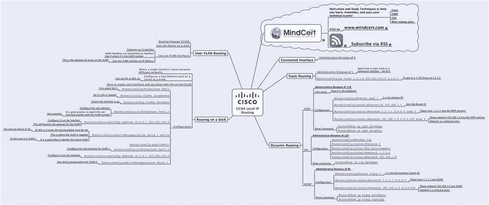
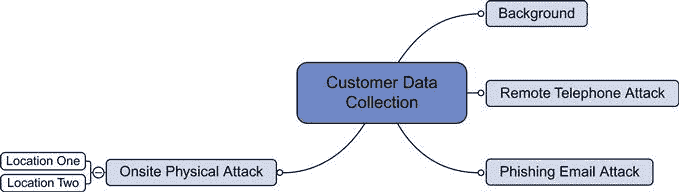
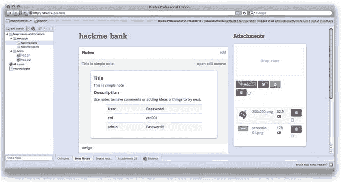
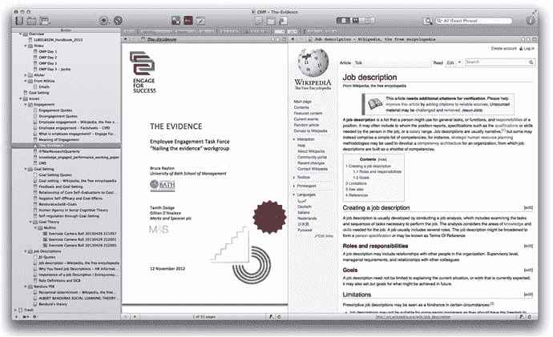
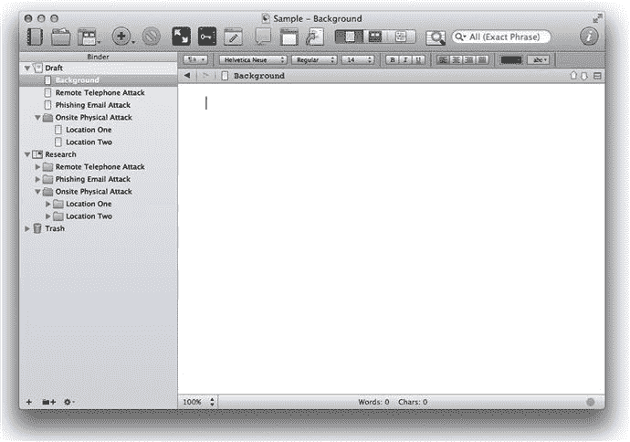
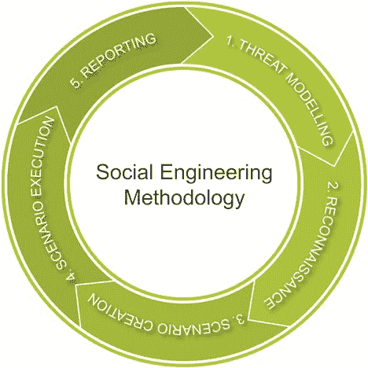

# 第十三章：撰写报告

安德鲁·梅森，技术总监，RandomStorm 有限公司

本章将介绍向客户提供的主要成果，即书面报告。将介绍报告清晰度和业务驱动因素的重要性，并提供社会工程学评估报告的示例模板以及汇总利益相关者发现的演示模板。

### 关键词

数据收集；心智绘图；报告撰写

本章内容

• 数据收集

• 操作系统文件夹结构和文本编辑器

• 心智绘图

• 文档管理工具

• 撰写报告

• 封面

• 标题页

• 免责声明页面

• 目录

• 社会工程概述

• 社会工程学方法论

• 威胁建模

• 侦察

• 场景创建

• 场景执行

• 报告撰写

• 引言

• 执行摘要

• 个人攻击向量

• 报告的交付

## 引言

第十二章讨论了社会工程攻击中使用的技术。本章将讨论社会工程报告以及如何撰写这样的报告以为客户提供最大价值。本章将介绍在评估过程中收集用于制定报告所需的数据，然后转向报告本身，并提出关于应包括的结构和要素的建议。最后一节将讨论报告如何向客户交付和呈现。

在专业服务机构工作的人很可能已经熟悉报告创建的任务。客户参与专业服务机构是为了执行诸如社会工程学评估之类的评估。几周的工作成果通常以书面报告的形式呈现给客户。本章的其余部分将介绍收集和组织所需信息以创建向客户提交报告的过程。

一个短期的专业服务项目通常会持续 5 天。在这 5 天中，通常会有 3 天用于测试，另外 2 天用于撰写报告。因此，报告结构的重要性对顾问至关重要，以确保建立有效的系统，提供给客户最大的价值。与大多数事物一样，顾问的经验越丰富，其流程就会变得更好。

值得注意的一点是竞争专业服务公司的报告结构之间的差异。本书的作者曾为几家公司工作，并观察到在向客户提供项目成果（报告）方面存在不同的标准。建议投资时间制作一个可根据客户基础复制的质量报告模板。

在进行评估和撰写报告之间通常会有一段时间。重要的是尽量将这段时间缩短，尽管在实践中，这通常包括旅行，在回到办公室并准备撰写所有三份评估报告之前执行两到三次评估。理想情况是在周一、周二和周三进行评估，然后在周四和周五撰写报告。

## 数据收集

在开始报告之前，需要收集和分析大量有意义的数据，以便在报告中加入一些有意义的数据。找到适合每个人的数据收集过程非常重要。

有许多收集数据的方法，读者找到适合自己的最佳方法非常重要。人们往往花费太多时间试图将新工具强行塞入他们的工作流程中，而不是集中精力关注实际的过程。重要的不是工具，而是如何有效地使用工具的过程，以便将数据收集到安全和可靠的格式中，以便在以后撰写报告时轻松解释。

没有什么比在完成任务结束几天后发现笔记收集不合理更糟糕的了。如果进行了多次评估，这一点尤为真实，因为评估过程中发生的事件有可能混为一谈，这使得严格记录笔记的实践变得比以往任何时候都更加重要。

收集的数据将具有敏感性质，必须小心确保这些信息在顾问的笔记本电脑上安全存储。设备安全性不在本书的范围之内，但任何提供社会工程服务的公司都应该已经实施了确保数据在传输过程中安全的流程。

将调查使用各种基于计算机的工具进行数据收集的三个示例。第一个是使用简单的文本编辑器和操作系统中的文件夹结构。第二个将是查看思维导图，这是本书作者们广泛使用的方法，第三个是使用特定的文档管理器，如 Scrivener。

这三个示例的共同过程是已经收集了数据，以便能够对其进行整理、分析和报告。这些数据将以案例文件的形式呈现。这个案例文件可以采用下面三个示例中的一个形式，也可以采用您选择的其他工具的格式。最重要的是确保数据以可以理解的格式收集，以便在返回办公室时进行整理和报告。

通常记录比所需信息更多的信息。不需要的信息可以随时排除，但没有比没有足够的信息来制定报告更糟糕的事情。因此，建议记录所做的所有工作，并拍摄所需数量的屏幕截图和照片来建立此案例文件。

### 操作系统文件夹结构和文本编辑器

收集数据的最简单方法之一是使用简单的文本编辑器和文件系统内的文件夹结构。所有操作系统都预装了至少一个文本编辑器。这可能是 Windows 上的**记事本**，OS X 上的**TextEdit**，或 Linux 上的**vi**。

这里的想法是构建一个模拟报告所有部分的文件夹结构。例如，如果有一个包括远程电话攻击、钓鱼邮件攻击和两个地点的现场物理攻击的评估任务，结构看起来类似于图 13.1 中所示的内容。

图 13.1 数据收集文件夹结构。

图 13.1 显示了在进入评估的每个服务的特定文件夹之前，顶级客户报告工作文件夹的情况。每个文件夹中都会创建一个文本文件，用于每项服务，并在评估过程中进行线性记录。随着评估的进行，任何文档证据，如屏幕截图、文件附件或照片，都可以添加到与评估的特定部分相关的文件夹中。

在评估结束时，需要有一个文件夹结构，每个文件夹中都有一个单一的文本文件，作为解释评估执行方式、采取的行动、结果和失败以及报告所需的其他任何内容的说明。除了这些文本文件，每个文件夹中还会有一系列文件，构成评估各部分发现的文档证据。

### 思维导图

思维导图是由英国的托尼·布赞创建的一种技术。思维导图是一种利用大脑的左右两侧协调工作的方式，通过利用左脑的技术性和右脑的更具创造性的一面。

传统学习非常偏向左脑，因为它涉及逻辑、细节和事实。右脑通常更模糊，由符号、图像和空间感知主导。

思维导图促进了可以被视为整体大脑思维的方式，利用大脑的两侧，更好地思考。思维导图通过利用左侧的技术细节和右侧的创造性展示机制来实现这一点。

所有这些听起来可能非常科学，但实际上意味着信息以一种称为思维导图的蜘蛛图表形式呈现。

一个示例思维导图可以在图 13.2 中看到。

图 13.2 示例思维导图。

要开始使用思维导图作为社会工程评估的数据收集工具，首先需要有一个初始结构。强烈建议每个客户评估创建一个单独的思维导图，为评估的每个主要部分使用一个核心分支。

使用与之前相同的示例评估，如果评估中包括两个位置的远程电话攻击、钓鱼邮件攻击和现场物理攻击，初始思维导图将类似于图 13.3 中所见。

图 13.3 数据收集思维导图。

如图 13.3 所示，有一个概述核心分支可用于与评估相关的信息和注释，然后每个后续核心分支反映评估的一部分。例如，每个核心分支也有子分支信息，以提供模板更完整结构的感觉。

要将思维导图用作数据收集工具，重要的是在评估过程中开始进行文本笔记。但是，与其以线性格式存储这些笔记，不如尝试将它们制作成思维导图的适当分支。大多数思维导图编辑器都具有创建文本笔记并从分支链接到这些笔记的能力，以便可以在应用程序内查看它们或打印出来供参考。除了在思维导图内使用文本笔记外，还可以链接到文件附件并将图像和照片直接放置到思维导图上。

思维导图已被证明有助于数据和信息回忆，并且在评估和实际撰写报告之间有几天时间时，有助于将数据置于上下文中。

作者在本章中首选的工具是思维导图。他使用思维导图作为记录评估数据的工具进行了数百次评估，并取得了很好的结果。

关于思维导图的更多信息可以从思维导图技术的创造者托尼·布赞（Tony Buzan）的网站获得，网址为[`www.thinkbuzan.com/`](http://www.thinkbuzan.com/)。

作者在创建思维导图时的首选工具是 MindJet：[`www.mindjet.com`](http://www.mindjet.com)。

下面是一些开源思维导图应用程序的列表：

• XMind：[`www.xmind.net`](http://www.xmind.net)

• FreeMind：[`freemind.sourceforge.net`](http://freemind.sourceforge.net)

• Compendium：[`compendium.open.ac.uk`](http://compendium.open.ac.uk)

• Mind42：[`mind42.com`](http://mind42.com)

• WiseMapping：[`www.wisemapping.com`](http://www.wisemapping.com)

• Bubbl.us：[`bubbl.us`](https://bubbl.us)

### 文档管理工具

第三种数据收集方法是使用文档管理工具。这些工具专门用于收集数据和撰写文稿。作者们使用过一些这样的工具来撰写书籍和剧本，其中一些专门针对特定类型的项目。

有一款专门用于编写安全报告的工具，名为 Dradis Pro：[`securityroots.com/dradispro/`](http://securityroots.com/dradispro/)。

Dradis Pro 旨在运行基础架构渗透测试，并且在能够直接从渗透测试人员使用的各种安全工具导入数据以及通过消除重复劳动和信息来提高报告部分的效率方面具有优势。Dradis Pro 可用于创建提交给客户的最终报告，并且可以定制以使用符合特定企业标准的模板。

Dradis Pro 的屏幕截图可以在图 13.4 中看到。

图 13.4 数据收集：Dradis Pro。

另一个文档管理工具，也是本书作者用于撰写项目的工具是来自 Literature and Latte 的 Scrivener，适用于 OS X 和 Windows，网址为 [`www.literatureandlatte.com/scrivener.php`](http://www.literatureandlatte.com/scrivener.php)。该网站的介绍称该工具为“*Scrivener 是一款强大的作家内容生成工具，它允许你专注于撰写和构建长篇和复杂的文稿。虽然它完全控制格式，但它的重点是帮助你完成那个令人尴尬的初稿*”。

在图 13.5 中可以看到 Scrivener 项目的一个示例。

图 13.5 数据收集：Scrivener 示例。

Scrivener 提供了一个完整的写作界面，可用于创建研究和写作的文件夹结构。使用这样的工具可以快速收集信息，并且能够将其安排成反映正在执行的评估的结构化顺序。

使用与之前相同的示例评估，如果正在执行包括远程电话攻击、钓鱼邮件攻击和两个位置的现场物理攻击的评估，则初始 Scrivener 设置将类似于图 13.6 中所示。

图 13.6 使用 Scrivener 进行数据收集。

文档管理工具提供了结构化编写文本注释的功能，以及导入其他文件类型（如图片、文档和网页）的功能。它们将所有信息保存在一个地方，并且还具有一些基于数据研究和撰写报告时的演示便利性的独特功能。

值得考虑的其他文档管理应用程序包括：

• Omni Outliner：[`www.omnigroup.com/products/omnioutliner/`](http://www.omnigroup.com/products/omnioutliner/)

• 印象笔记：[`www.evernote.com`](http://www.evernote.com)

• 微软 OneNote：[`office.microsoft.com/en-us/onenote/`](http://office.microsoft.com/en-us/onenote/)

## 撰写报告

现在已经执行了评估，收集了数据，并将数据放入所选择的结构化格式中，是时候开始撰写报告了，这将是与客户项目的最终交付物。

报告可以使用多种选择的工具来撰写。如果使用文档管理工具，则很可能可以直接从该工具创建报告。但是，可以选择避免使用商业文字处理软件，如 Microsoft Word 或 Apple Pages；或者，对于大多数操作系统平台都有许多开源文字处理软件可用。

与数据收集阶段一样，假设这将是一个需要多次进行的过程，则首先花时间创建一个报告结构和模板会节省时间，并可作为所有客户报告的基础。

关于咨询型报告结构的创建已经有了大量的学术和专业信息。在 Google 上快速搜索会返回许多关于这种咨询报告结构的建议。我们推荐的一般结构概述如下：

• 封面

• 标题页

• 免责声明页

• 目录

• 社会工程概述

• 社会工程方法论

• 介绍

• 执行摘要

• 个人攻击向量

### 封面

封面页显示了报告的标题，并概述了客户名称和报告创建日期。此页可以使用咨询公司的标志进行品牌化，也可以共同展示客户的品牌。预计使用保护性标记对数据进行分类，基于行业标准安全定义。这应符合已建立的敏感客户数据企业保护性标记标准。

### 标题页

标题页扩展了封面页，提供了有关客户报告作者的详细信息，以及概述了当前版本和以前版本发生的任何更改的版本信息。报告的页数也可以显示出来。报告的分发列表可以显示，以及关于个人角色的指示，作为**作者**，**信息**或**审查**。

### 免责声明页

免责声明是顾问公司希望能限制其为所提供产品或服务所承担的责任的声明，这在咨询项目中是相当典型的。它概述了工作受约定条款和条件约束，并涵盖了披露的范围，因为报告中包含的内容很可能是敏感信息。

一个免责声明示例可能如下所示：

本文件中的所有信息、陈述、观点和建议均根据我们现有的最佳知识正确无误，但如果未成为双方之间单独特定协议的主题，则不应（也不应被视为）合同约束。

此处所含信息是在双方进一步协商的协议的基础上准备的，该协议将基于供应商名称的标准条款和条件。

除非另有双方签署的书面保密协议明确规定，否则本报告包含供应商名称和客户名称保密的信息。未经客户名称事先书面同意，不得进行披露。

### 目录

目录可以担任三个目的。

1. 这有助于那些不想阅读整个报告但想要轻松定位其中特定部分的读者。

2. 这有助于那些想在开始阅读整个报告之前了解报告范围和内容概述的读者。

3. 这为报告的撰写者提供了一个工具，概述了需要解决的具体方面。

大多数文字处理工具将自动创建目录，只要在文字处理器中实施了正确的样式使用，并相应地标记了标题。

### 社会工程概述

对于许多客户来说，这可能是他们首次进行的社会工程参与。此外，报告的当前读者可能不是客户内的发起人，因此有必要包含一些文本页面，概述社会工程是什么，测试的需求是什么以及这种测试如何有益于正在接受测试的公司。

本介绍为读者设置了舞台，以便他们理解自己即将阅读的内容。可以认为这是多余的信息和报告填充，因此仅建议对社会工程参与历史不强的客户。如果客户完全了解社会工程环境或以前进行过评估，则应删除此部分。

本节介绍了社会工程的简要概述以及常见的攻击类型，以及如何防御社会工程攻击的基本信息。

### 社会工程方法论

社会工程方法提供了一种机制，用于在评估过程中向客户展示所使用的方法，以处理咨询项目。

社会工程的一个示例方法可能是：

#### 威胁建模

任何社会工程评估的初始阶段都是评估对企业的潜在威胁。这些威胁可能是从仓库盗窃、内部员工对网络资源的攻击，甚至是激进分子的破坏行为。

#### 侦察

评估的这个阶段涉及尽可能收集有关企业的信息。这些信息主要来自公共资源，如 DNS 记录、搜索引擎、论坛和新闻组。

#### 场景创建

社会工程师将利用收集到的信息和对企业的潜在威胁，创建可能发生的场景。这些场景将被构建以应对公司面临的特定威胁，以评估是否已经制定措施来保护公司免受这些威胁。

#### 场景执行

一旦场景被限定，社会工程师将使用各种技术来演绎这些场景。使用的社会工程技术可能包括欺骗、虚构理由、分散注意力和冒充。

#### 报告

在完全完成所有场景后，收集到的信息被用来编写一份详细说明评估结果的报告。这份报告将展示一个包含漏洞、暴露和补救建议的场景时间线。

该方法可以以图形方式表示，如图 13.7 所示。

图 13.7 社会工程方法。

与社会工程概述部分一样，对于熟悉社会工程参与模型的现有客户，这部分可能被视为可选的。然而，对于可能对参与社会工程评估的概念感到陌生的新客户来说，这部分同样具有价值。

### 介绍

在这一部分之前的所有页面都是序言，要么是为了布置情景，要么是为了报告结构至关重要的前言。报告的介绍部分阐明了报告的“什么，为什么，何时，何地，以及如何”：

• **作为社会工程评估的一部分，**进行了什么？这包括哪些攻击向量被用于构成社会工程评估的一部分。客户通常会在初始咨询需求中概述攻击向量。

• **为什么**进行这项评估？如果客户对评估有特定要求，将在本节中解释。

• **何时**进行了这次评估？这包括所有攻击向量的参与日期，以及编写报告和交付给客户的日期。

• **评估是在哪里进行的？**这通常是在客户基础设施内进行的现场工作，也可以是远程进行的针对互联网或远程工作者的评估向量。如果现场工作在多个地点进行，则列出每个地点以及每个地点访问的日期。

• 评估是如何进行的？介绍了用于执行评估的方法论的细节。

### 执行摘要

执行摘要主要设计为为那些最初至少不打算阅读整份报告的人提供服务。

对于需要查阅报告并了解评估工作及评估结果的人来说，执行摘要是报告中最重要的部分。执行摘要起到了报告的结论作用，尽管报告的主体内容尚未出现。

执行摘要包含作为评估的一部分选择的每个攻击向量的所有主要要点，并强调结果、结论和建议。

除了文字性内容之外，还建议在报告中包含一些重点突出的正面和负面行动的项目符号。

执行摘要通常长约两到三页，应注意确保其保持在这个长度而不是扩展到数页或太多细节以致成为摘要。

编写报告主体后撰写执行摘要可能更容易，从而按顺序编写报告。这将确保所有相关部分都以简洁而准确的方式包含在内。

### 单个攻击向量

执行摘要提供了结论和易于阅读的发现概述，但下一节则作为报告的主体。在这里，每个攻击向量都会被详细解释，并支持评估过程中收集到的支持证据，结果、结论和建议。

在此级别，移至涵盖每个攻击向量的各自子部分之前，会生成简要介绍。每个部分的简要结构可能如下：

• 攻击向量介绍

• 顾问意见

• 评估证据

攻击向量介绍提供了选择攻击向量的依据以及向量包含的内容的概述，然后介绍评估范围和执行内容。

顾问意见提供了关于顾问为测试攻击向量所做的事情的书面叙述。这讲述了评估的故事，并详细概述了每个部分的发现。与执行摘要一样，此级别上包含一份良好和不良发现的清单以及推荐的补救措施是有用的，以纠正评估中概述的任何缺陷。

评估证据是支持顾问意见和每个单独攻击向量的发现的支持材料。虽然这不必是一种结构，但保持按时间顺序排列并确保包括有关此攻击向量的评估发现的时间轴是有用的。

在本章的数据收集部分，我们研究了一个样本社会工程参与，在该评估中包括了远程电话攻击、网络钓鱼电子邮件攻击以及两个位置的现场实体攻击。利用这个例子，本报告的本节结构将如下所示：

• 个别攻击向量

• 介绍

• 远程电话攻击

– 介绍

– 顾问评论

– 评估证据

• 网络钓鱼电子邮件攻击

– 介绍

– 顾问评论

– 评估证据

• 现场实体攻击

– 介绍

– 第一站点

• 介绍

• 顾问评论

• 评估证据

– 第二站点

• 介绍

• 顾问评论

• 评估证据

## 报告的交付

此时，社会工程评估已经完成，并使用所选择的数据收集方法收集了数据。这些数据用于制定和撰写一份结构化报告，为最终用户提供价值，并形成公司所从事的咨询工作的最终交付物。下一阶段的关注点是将报告交付给客户。

关于敏感客户数据的保密性问题已经在本章的数据收集部分中讨论过。完整的保护标记介绍不在本书的范围之内，但是必须遵守组织制定的指导方针，以符合其保护标记标准。

除了数据存储问题之外，报告还必须安全地传输给客户。可以假定任何从事此类专业服务的公司的员工都将执行安全文档交付的公司标准。这可能是使用安全客户门户，客户通过加密的安全门户进行身份验证，然后安全地下载报告，或者通过使用电子邮件加密方案，其中电子邮件被加密并安全地发送给客户。

许多专业服务公司似乎采用了“点火并忘记”报告交付策略。这就是客户收到报告后，顾问或项目团队不再与客户进行任何进一步的沟通。

在客户收到报告后，建议安排客户在几天后进行一次客户简报，以便客户有时间阅读和消化提供的信息。这将给他们时间制定一些问题，以问询执行评估的顾问。这次简报可以通过电话进行，如果条件允许，最好是面对面进行。

## 概要

本章介绍了社会工程评估报告。从数据收集的必要性开始，并建议顾问可以采取三种方式来收集必要的数据以起草和撰写文档。接下来是讨论如何撰写报告，建议使用了一个简单的专业服务咨询报告模板，该模板涵盖了社会工程报告所需的必要要素。本章的最后一节涵盖了交付报告以及在客户消化报告中的信息后，需要注意确保报告的数据机密性和完整性，以及建议的客户简报。

下一章将提供针对社会工程攻击加固政策和程序的建议。
