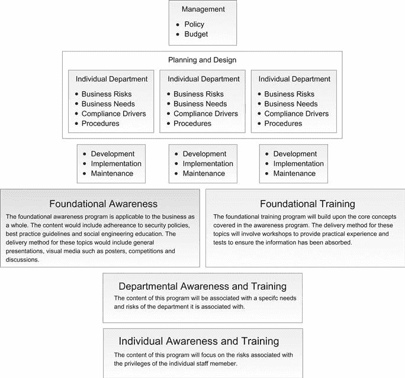

# 第十五章：员工意识和培训计划

加文·沃森，随机风暴有限公司高级安全工程师

员工意识培训可以是减轻社会工程攻击风险的最有效方法之一。然而，这种类型的员工培训通常设计不佳，很少执行。读者将了解企业常犯的错误以及如何避免这些错误。

### 关键词

意识培训；规划和设计；部门风险；部门要求；合规驱动程序；基础意识；基础培训；部门培训；个人培训

本章内容

• 当前意识培训

• 我们是否应该进行意识培训？

• 没有培训的意识

• 选择错误的管理模式

• 利用薄弱的培训计划

• 有效培训模型

• 管理的角色

• 规划和设计

• 各个部门

• 部门风险

• 部门要求

• 合规驱动程序

• 程序

• 发展

• 确保影响

• 基础意识

• 基础培训

• 部门培训

• 个人培训

• 实施

• 外部协助

• 维护

## 介绍

在第十四章中，详细介绍了建立强大社会工程政策的主题。本章将重点关注员工意识和培训计划。有效的安全意识计划经常被忽视，而且即使存在，也经常不符合要求。可能有读者还记得过去讨论过弱密码或重复使用密码、写下密码、将工作站解锁、打开电子邮件附件、在电话中提供个人或敏感业务信息、报告可疑行为、不允许别人在身后跟随以及在场所内质疑可疑个体的演示。不幸的是，尽管这样的安全培训经常发生，但几乎总是无法有效防止社会工程攻击。更糟糕的是，在一些罕见情况下，这种安全培训执行得如此糟糕，以至于对组织的整体安全产生负面影响。

本章将讨论意识和培训计划是否足够有益，值得进行重大投资，检查导致计划无法实现目标的各种缺陷。将涵盖各种问题，如缺乏实际的“培训”，不适合的管理模式以及容易被攻击者利用的计划。接下来将讨论如何改进设计计划的一般模型，更加关注社会工程学，而不是通用的安全良好实践。然后将讨论规划、设计、开发和实施等要素，确保在每个阶段考虑社会工程问题。将详细讨论不同类型的意识和培训计划，如基础意识、基础培训、部门培训和个人培训，包括研讨会和角色扮演练习的示例。之后，一个重要的话题是如何确保任何培训产生足够的影响，并且外部协助如何提高计划的有效性。

最后，本章将重点讨论如何确保培训计划不会淡出人们的视野。设计了有效的计划后，定期维护、测试、改进和重复是至关重要的。这种循环式的员工意识培训方法非常重要，因为社会工程师很可能会耐心等待某个员工变得冷漠并放松警惕。

## 当前意识培训

毫无疑问，安全意识培训对任何企业都有潜在的益处。通过演示、媒体、通讯、海报等方式提高人们对信息安全问题的意识的理念在理论上是合理的。这种意识和培训将为改善组织整体安全文化奠定基础。然而，意识和培训计划以变得乏味和未能实现其一般目标而臭名昭著，尤其是减少遭受成功的社会工程攻击的机会。事实上，大多数意识计划很少详细讨论社会工程，而是集中于基本的公司计算机使用政策和通用最佳实践等基础知识。这并不是说意识培训不应包括这些一般主题，事实上大部分都是必不可少的。问题在于大多数计划没有扩展这些概念，将其置于背景中或提供任何实际的“培训”来处理安全问题。

一个假设是，意识和培训导师可能认为“普通用户”无法吸收比绝对基础更复杂的任何东西。系统管理员经常对普通用户明显无法选择强密码而咒骂，并且几乎因发现密码写在便利贴上而气得要爆血管。用户在涉及安全性和企业面临的各种信息安全威胁时被告知政策和程序，问题在于这些信息很少被吸收。问题不在于用户，而在于培训计划。当涉及社会工程意识计划时，这甚至更为重要。一些计划会让用户意识到社会工程问题，但很少告诉他们这类攻击可能如何发生。保持培训尽可能非技术性可能会有一些好处，但这实际上不应该适用于社会工程。如前几章所述，社会工程是利用人类本性，这是一个任何人都应该能够理解的概念。

### 我们甚至应该进行意识培训吗？

越来越多的人认为意识培训是如此无效，以至于根本不应该进行。著名安全专家和行业大师布鲁斯·施奈尔曾评论说*“……对用户进行安全培训通常是浪费时间，这些钱可以更好地用在其他地方。”*。他认为安全培训的无效性源于*“你知道现在应该做什么和理论上未来的好处之间的抽象差距*。”。例如，鼓励使用强密码以帮助预防“可能”在未来某个时候发生的攻击。预防可能攻击的想法对于要记住多个复杂密码的烦恼来说几乎毫无安慰。因此，用户遵循这些常见的最佳实践的可能性要小得多。当涉及社会工程攻击时，这一点更加明显。用户被告知永远不要泄露诸如密码之类的敏感信息，但却没有得到太多关于为什么或如何有人可能试图欺骗他们透露这些信息的信息。不仅在良好实践建议和成功攻击的理论负面结果之间存在巨大差距，甚至对于攻击本身的具体理解也没有。因此，即使用户对安全最佳实践充满热情，他们仍然容易受到攻击。例如，用户可能知道永远不要在电话中泄露敏感的公司信息。然而，如果他们接到有关工作场所社交媒体政策的电话调查，他们可能会自由地透露公司信息。一个敏锐的社会工程师可能会问他们*“您是否允许使用工作电脑浏览社交媒体网站？”*。在回答这个看似无害的问题时，用户无意中透露了他们是否有出站互联网访问权限。在他们看来，他们并没有泄露任何敏感信息，而事实上出站互联网访问是社会工程师的关键信息之一。这个例子在第十章中有更详细的介绍。如果用户意识到了使用的秘密引诱技术和信息推断的概念，他们很可能会意识到并避免泄露。可以说，一项严格的政策阻止用户参与调查将阻止这种攻击，但正如前几章所示，有无数种实现相同目标的方法。例如，社会工程师可能会冒充一位同事询问*“……他们是否失去了对互联网的访问？”*。同样，这将揭示用户是否首先具有出站互联网访问权限。如果用户不了解攻击是如何执行的，那么他们不太可能发现变化。

在考虑近乎完美的社会工程攻击可能性时，我们真的能指望一般用户能够检测到它们吗？攻击者可能会计划一系列小攻击，持续数月甚至数年。第四章展示了长期攻击策略如何可以在很少被察觉的情况下获取敏感信息。数月间一系列完全无害的通话不太可能被注意到，但很可能正在为一个非常精心策划且严重的攻击铺平道路。简单的答案是一般用户不能期望他们会仔细审查每一次面对面的口头交流，盘问每一个打来电话的人，或者彻底检查每一封电子邮件是否存在潜在的诡计。一切都归结于风险及其减轻。企业永远无法完全消除风险，但他们需要意识到他们可以减少风险。高度组织化和资金充足的犯罪团伙在数月内策划和执行攻击的可能性相对较低，针对大多数中小型企业。然而，各种规模的企业接收到一般钓鱼邮件或可疑电话的机会相对较高。因此，通过意识和培训计划，企业并不指望能够免疫社会工程攻击；它只是降低了常见攻击成功的可能性。如果企业决定不实施意识和培训计划，因为他们无法阻止决心坚定的攻击者，那么他们将大大增加业余攻击者成功侵犯他们安全的可能性。

### 没有经过培训的意识

反应性安全意识和培训通常从最终开始，也就是说，它呈现了最坏的情况和不良安全实践的后果，然后推荐具体的良好实践解决方案。另一方面，对安全的积极态度必须从社会工程学的“什么”，“谁”，“为什么”和“如何”开始。例如，强调挑战未被识别的人进入场所的重要性是常见做法。也许一个佩戴访客徽章的人坐在热座位上，把笔记本电脑插入了网络。任何“安全意识强”的员工都会被期望挑战那个人。假设他们决定这样做，并收到回答*“哦，嗨，我和 IT 的斯图尔特一起工作，因为电话又出问题了。他说可以在人力资源部拿一个热座位，这样会安静一些，可以吗？”*。员工可能会觉得他们已经完成了任务，那个人确实受到了挑战，并且他们以一个已知的联系人和合理的故事回应了。对大多数人来说，挑战并不是一件自然的事情，只要情况看起来合适，挑战者宁愿接受它，而不是应对一个冒名顶替者的紧张局面。他们遵循了意识和培训，并以一种安全意识的方式行事。然而，意识培训并没有解决这起安全事件的“什么”，“谁”，“为什么”和“如何”。这可能是一名社会工程师试图通过冒充承包商来获取对网络的访问权限。上述冒名行骗包括伪造的访客徽章，通过提及 IT 工作人员的名字获得可信度，并提出对电话系统的维修借口。因此，更有效的反应将是“完成挑战”。个人，无论是访客还是承包商，都应该能够提供一个现场联系人。然后应该打电话确认访客的身份，因为他们目前是未陪同的。如果他们由于各种原因无法提供联系方式，则相关部门应立即被通知。

只有当安全事件从头到尾被理解时，才能理解如何解决它的概念。引入研讨会和基于角色的培训以支持意识演示，可以取得重大进展，而不仅仅依靠演示。假设意识演示告知员工社会工程师经常假装在电话上吵架，以此来阻止挑战者。员工现在将更好地应对这种特殊情况。然而，社会工程师却拄着拐杖来到，并示意要保持门开着。这种新情况没有被涵盖，员工变得更加脆弱。只有通过研讨会等团体主导的培训会议，才能探讨许多不同的情景。“意识”和“培训”之间存在根本性的区别。前者只是呈现一个安全问题，以便使人们意识到，通常仅涉及教学视频、海报和传单。后者是一个更实际的教授技能的方法。事实上，大多数安全意识和培训计划实际上并不涉及任何“培训”。

### 选择错误的管理模式

在设计和实施意识和培训计划时，所选择的模式可能会对其整体有效性产生重大影响。正如 NIST 的“构建信息技术安全意识和培训计划”中所述，“大多数意识和培训计划都遵循集中式程序管理模式，因此没有利用个别部门可能具有的洞察力。”集中式模型基本上由管理层监督整个计划的设计、开发和实施，然后将结果传递给各个部门。各部门随后将负责监控计划的有效性，并将任何结果传达回管理层。这种集中式模型最可能用于节省时间和一般管理的方便。然而，通过不整合每个部门的见解，存在着创建一个不会产生任何真正影响的非常通用的意识计划的风险增加。一个更可取的选择是使用“分散式”模型。这将设计、开发和实施的责任移交给每个部门，使管理层负责制定政策和预算。分散式模型通常在大型组织中采用，在这些组织中，让每个部门管理大部分任务更具实际意义。然而，该模型在社会工程方面的优势在于确保讨论部门特定的攻击，并制定适当的培训。

### 利用薄弱的培训计划

从攻击者的角度来看，一个标准的安全意识培训计划是一把双刃剑。一方面，它为员工提供了一般安全概念的基础知识。如果意识计划甚至部分成功，那么用户不太可能在办公室里大声喊出他们的个人电子邮件密码，或者打印出并交给大众公司的客户数据库。另一方面，由于培训是如此普遍，并且通常遵循相同的一般陈词滥调的安全主题，社会工程师可以利用它来获得信誉，并调整他们的攻击方案以与培训配合而不是反对它。例如，员工可能习惯于不向任何人透露他们的密码，即使是 IT 部门的成员也是如此。社会工程师可能会打电话给目标，冒充 IT 部门的工作人员，并声称他们收到了电子邮件帐户被锁定的报告。他们担心可能发生了漏洞，并希望确保该问题不是公司范围的。他们想要查看该员工当前是否被锁定，并可以远程检查。他们会告诉目标，他们显然不会要求通过电话透露密码。相反，他们可能会要求目标检查是否收到了解释安全问题的电子邮件，并且如果收到了，可以点击链接以确保他们仍然可以登录而没有任何问题。链接当然是恶意的，可以直接利用目标的网络浏览器中的漏洞，或者可能将其引导到公司电子邮件门户的克隆，从而收集用户的凭据。请参阅第九章以获取此类攻击的完整解析。

如果用户不了解攻击是如何进行的，并且没有接受相关培训来应对，那么利用这种无知和缺乏培训的情况相对容易。一个培训计划不仅可能无法实现其一般安全目标，而且可能效果非常不佳，以至于可能助长攻击者而不是防御攻击者。如果出现这种情况，那么这个意识和培训计划将是非常昂贵的公司时间的浪费。

## 一个有效培训的模型

图 15.1 展示了一个可能的标准模型，用于开发意识和培训计划，基于 NIST 的 2003 年“构建信息技术安全意识和培训计划”。它采用了一个分散的模型，将责任放在每个部门上来创建大部分的计划。以下各节将讨论模型的每个部分如何与社会工程相关联。

图 15.1 社会工程意识和培训计划模型。贡献自国家标准技术研究所

### 管理的角色

为了使任何意识和培训计划都能够起到作用，必须得到高层管理的完全支持。这就是为什么管理部门位于模型的最顶端的原因。管理团队将被期望在与每个部门讨论后，获得并提供一个合适的预算。分散式模型将责任放在每个部门身上，让他们评估自己的个别风险和需求，并将这些信息传达回管理层。管理层还负责制定和执行公司政策，这些政策构成了程序中涉及的主题的重要基础（参见第十四章以获取创建强化政策和程序的全面细节）。然而，从社会工程学的角度来看，管理层的支持具有更大的重要性。管理角色是社会工程师攻击的高价值目标，既可以用于冒充，也可以用于获取高权限。例如，可能已经有程序来在提供信息或执行任务之前验证呼叫者。如果管理决定“利用职权”并向员工施加压力放弃程序，因为他们记不住员工号码，那么社会工程师也可以完全做同样的事情。同样，如果额外的安全控制，如双因素身份验证已经应用于电子邮件账户，并且完全得到了管理的支持，因为他们的账户可能是第一个被攻击的目标。管理人员往往可能认为他们对于基本的程序（如屏幕保护程序锁定或复杂的密码）太重要，或者他们认为这些程序会带来太多的不便。管理者必须意识到他们的角色使他们成为社会工程师的独特目标。因此，管理层有更大的责任确保他们完全参与该计划，而不仅仅是制定政策和分配预算。

### 策划与设计

最初的规划和设计阶段对于确保培训计划与业务要求一致、在范围内并最终支持其使命至关重要。这尤为重要，以确保它不会成为无法吸引员工注意力的通用培训。该计划应直接将企业的关键资产与其整体面临的最重大风险相对应。某个特定业务可能必须应对 Web 服务器拒绝服务（DoS）攻击的严重风险，这将导致他们损失数百万美元。另一家企业可能认为他们的客户数据库是他们的主要资产，社会工程师入侵将导致其客户信心无法恢复的不可恢复损失。这些事件通常与传统的恶意黑客利用漏洞代码和分布式拒绝服务（DDoS）攻击有关。但是，社会工程也可以用来获取对网络的远程访问权限，禁用 Web 服务器并访问客户数据库。无论企业面临的是资产、威胁、漏洞还是风险，都应清楚地反映在所设计的培训计划中。这不应与每个部门面临的风险混淆。这些应该是公司整体的风险。

计划和设计阶段确定了培训计划的“基础意识”和“基础培训”部分的内容。这个最初的规划和设计阶段将制定出反映特定业务所面临的主要风险的最佳实践建议和正确使用指南。一旦这个最初的基础内容被规划和设计出来，各个部门就可以根据自己的特定风险和要求来进一步完善这些内容。

### 各个部门

现在管理层已经同意并制定了政策，各个部门可以率先创建定制的意识和培训计划内容。如前所述，分散化模型将主要任务置于各个部门的控制之下。尽管每个部门始终需要培训，但评估当前的安全状况并确定应优先关注的领域仍然是一个好主意。也许用户已经非常了解社会工程的威胁，但这并不意味着他们有能力应对。

社会工程师会以非常不同的方式针对不同部门的不同员工。接待员可能会通过电话被针对，安排会议或获取门禁通行证。财务管理员可能会被以面对面的方式针对，并被欺骗以提供对企业数据库的访问权限。先前的章节已经清楚地展示了不同的目标需要不同的情景。在潜在复杂性和创造力方面，社会工程攻击的广度是巨大的。因此，来自不同部门的员工将需要非常不同的培训。例如，接待员可以说是企业中被攻击最多的个人。他们接受培训要乐于助人，而这是理所当然的。他们通常掌握着社会工程师需要进入建筑物限制区域的钥匙或信息。针对接待员角色的培训类型将专注于特定于他们角色的引诱技术（即通过电话和物理安全元素，如假徽章和尾随）。培训主要涵盖了获取建筑物访问权限所使用的各种技术。这种类型的培训与针对首席执行官角色的培训非常不同。他们的培训更有可能集中在鱼叉式网络钓鱼攻击和凭证收集技术上，毕竟，获取首席执行官的电子邮件账户可能会带来灾难性的结果。因此，首席执行官的培训可能更多地侧重于技术方面（即远程攻击、电子邮件攻击向量）。第三方参与时风险呈指数增长，因为这使得冒充他们从未见过的员工更容易。第三方的培训将重点关注攻击者可能如何尝试规避当前重置密码的程序。然而，这并不意味着企业不应对接待员进行鱼叉式网络钓鱼攻击的培训，也不意味着首席执行官和帮助台技术人员不应对尾随行为的危险进行培训。只是培训计划越专注和有针对性，其达成目标的可能性就越大。

#### 部门风险

进行风险评估是提高安全性过程的关键部分。有许多方法可以实现这一点，例如定量和定性方法，客观和主观地表达风险。风险评估方法学超出了本书的范围，然而，了解它们在创建有效的意识和培训资料中的重要作用是很重要的。对个别部门的风险将因部门而异。财务部门可能认为其数据库完整性的丧失是最大的风险。而人力资源部门可能认为员工记录保密性的丧失是最大的风险。这些一般性风险很重要，它们必然会被纳入基础意识和培训中。然而，这些是一般部门风险，而从社会工程角度来看，可能还存在其他关注点。例如，在社会工程攻击方面，IT 部门面临被冒充以获取其权限的风险。销售部门可能面临远程电话攻击的风险，这些攻击旨在利用他们的销售意愿。销售员可能会收到一封带有诱人线索的电子邮件，只需一次点击即可查看。这些类型的社会工程风险对每个部门可能不会立即明显，特别是如果他们之前没有社会工程经验。确定谁将负责风险评估流程也很重要。管理层会承担这个过程的责任，还是会雇用第三方？应该确定并使用一般和社会工程风险作为程序部门特定培训部分的基础。

#### 部门需求

每个部门都将拥有一套不同的个体“需求”，这些需求具有安全性影响。财务部门可能需要打印和存储大量敏感的财务文件。这些文件可能存储在办公室内外的文件柜中。在规划和设计阶段，他们可能没有考虑到社会工程师简单地走进来并使用撬锁工具打开文件柜窃取文件的可能性。他们的风险评估可能仅仅侧重于数字数据库的妥协。

社会工程攻击的目的不仅仅局限于信息获取，它也可能旨在实现拒绝服务（DoS）的情况。因此，部门需求的另一个方面是他们认为对其运作至关重要的内容。每个部门都应考虑其有哪些基本需求，并探索社会工程师如何利用它们。

#### 合规驱动因素

法律责任对于大多数经理来说是一个持续的痛点，特别是那些处于信息安全领域的经理。然而，它们显然会提高安全性，即使只是将当前状态提升到接近令人满意的水平。如果没有合规性的驱动力，大多数公司将继续在幸福的安全无知和自满中前进，打开一切攻击的大门。在规划和设计意识和培训计划时，明显需要考虑到合规性驱动因素。在大多数情况下，由管理层制定的政策将考虑到合规性驱动因素、地方政策和国家政策，但仍然有必要在部门层面对其进行检查。公司可能确实需要进行社会工程评估和员工意识和培训。

#### 程序

如前面的章节清楚地显示的那样，社会工程师会在能够时利用弱程序。测试当前程序和设计硬化程序的方法在 第十四章 中有详细说明。该过程的结果应纳入意识和培训计划中。应清楚地显示，看似坚固的程序如何容易受到攻击，业务自身的程序如何经过测试和硬化，以及每个部门内可能受到攻击的具体程序。通过以上每个阶段向员工介绍，他们将更好地掌握检测攻击变化和发现可能被忽视的程序新弱点的能力。员工也更不可能因为方便而误解程序的安全影响或采取捷径。

### 开发

此时，各个部门将已经规划并设计了他们的项目部分；现在是开发交付方法的时候了。材料应该被分解为基础意识、基础培训、部门意识和培训，以及个人意识和培训。现在需要充分明确意识和培训之间的区别。意识材料将使员工意识到具体的问题，而培训将使他们理解和应对。以下是如何分解特定安全问题的示例。这个列表并非详尽无遗，只是为了说明将会呈现的不同材料。

• **第三方帮助台**

员工可以联系帮助台重置他们的微软 Outlook Web Access 电子邮件密码。

• **基础意识**

用户应了解以下主题：

• 服务是什么，它是如何工作的以及程序文件。

• 公司电子邮件的敏感性质和创建强密码的指南。

• 使用弱密码、重复使用密码和书写密码的危险性。

• 使用公共访问终端和不安全的无线网络访问他们的电子邮件账户的危险。

• **基础培训**

用户参与研讨会和动手演示，涵盖以下主题：

• 社会工程师可能会尝试访问他们的电子邮件账户

• 社会工程师可能会尝试欺骗用户透露其密码，包括电话技巧和恶意网站

• **部门意识和培训**

帮助台人员参与研讨会和动手演示，涵盖以下主题：

• 探索当前密码重置程序的发展历程，重点关注它们如何加固防范社会工程攻击。

• 合法呼叫者可能会尝试规避当前的密码重置程序。

• 社会工程师可能会尝试规避当前的密码重置程序。

• 执行内部社会工程演习的结果，以评估员工是否正确验证呼叫者并检测社会工程攻击企图。

• **个人意识和培训**

• 高度特权的部门工作人员，如管理人员或监管人员，参与讨论和研讨会，重点关注他们的具体特权以及如何利用它们（例如，如果密码重置程序在任何阶段都涉及他们的输入）。

#### 确保影响力

此阶段开发的意识和培训材料不仅与业务相关，而且与员工相关。部门和个人级别的培训将极大地提高用户对培训内容的理解。通过了解攻击如何在他们特定的部门或特定的流程中被规划和执行，员工更有可能意识到其重要性。

通过将安全问题与员工的个人生活联系起来，可以进一步提高影响力。例如，钓鱼电子邮件不仅被企业接收，而且被每个人接收。

当特定的部门培训被开发出来并且社会工程攻击被分解成阶段时，强调每个安全问题的最坏情况非常重要。如果不呈现不遵循建议的最终后果，即使他们彻底理解了攻击的始终过程，培训者也很难充分意识到问题的严重性。例如，用户经常被告知不要重复使用密码，因为这是一个非常常见的糟糕的安全实践。很少有人解释这一建议背后的原因。安全问题的解释可以如下所示。

如果密码在多个网站上重复使用，那么它们都只能像最薄弱的网站一样安全。攻击者可能会访问一个安全性较差且不包含敏感信息的网站，然后使用“重复使用”的密码访问包含敏感信息的网站。如果密码在个人和业务账户之间重复使用，这将成为公司的严重问题。

每个提出的安全问题都应该伴随着一个对企业造成最坏后果的场景，以便为员工提供背景信息。

鉴于不同的人对不同的培训方法有不同的反应（例如，有些人可能更喜欢通过阅读书籍和文章来吸收信息，而其他人则通过听演示和观看视频来学习），因此确保采用多种培训交付方法以确保有效的意识吸收是很重要的。

要小心不要在太长时间内向观众提供过多信息。定期进行短暂的 1 小时培训会议通常比全天研讨会更有效。

#### 基础意识

基础意识计划材料应适用于所有员工，但不应过于通用。重要的是要根据企业的价值观、目标和使命来定制材料。这一部分通常涵盖的主题可能包括以下内容：

• 病毒、蠕虫和恶意软件的威胁

• 正确的互联网使用

• 正确的电子邮件使用

• 密码管理

• 工作站安全、屏幕保护程序和锁定屏幕

• 笔记本电脑安全、盗窃和加密

• 移动设备安全

• 数据处理和分类

• 网络安全

• 隐私问题

通常社会工程只是上述列表中的一个单一主题。员工将了解什么是社会工程以及一些最陈词滥调的故事来解释犯罪分子可能如何使用它。仅以这种方式涵盖基础知识不太可能提供足够的意识水平来进行培训。因此，扩展这些一般主题以至少包括基本的常见社会工程技术是很重要的。以下是可能考虑包含的主题示例：

• 社会工程方法

• 尾随和质疑

• 窥视和隐私

• 鱼叉式网络钓鱼技术和垃圾邮件

• 电话信息引诱技术

• 利用公共信息

• 现实世界的社会工程示例

在这个阶段，意识和培训计划的基础正在被奠定。员工将获得所有他们可能需要的一般安全信息和最佳实践建议。下一步是在那些培训对他们最有益处的关键领域提供实际培训。

#### 基础培训

在进行社会工程训练时，动手研讨会对于培养人员可能需要探索、测试并了解各种安全问题的防御技能非常宝贵。当他们了解攻击是如何执行的时候，他们将能够检测到在不同情境下试图进行此类攻击的迹象。例如，发现常规钓鱼邮件相对较容易，通常是因为它们糟糕的英文使用和坚持常见主题，如银行账户被锁定或一次性赚钱计划。然而，发现针对性的钓鱼邮件并不那么容易，特别是如果它们是高度针对性和精心制作的。对于员工来说，培训他们了解这些攻击的工作原理比提供他们发现常见示例的一般提示更有效。

以下是可能用于考虑的典型研讨会活动示例：

公司正在考虑以下四种密码重置程序。以下程序存在哪些弱点，社会工程师如何利用它们？思维导图的想法，团队一起探索可能性。

1. 为了重置密码，您需要致电帮助台并提供您的用户名。

2. 帮助台要求您的部门经理发送一封电子邮件，才会重置您的密码。

3. 帮助台已同意重置您的密码，但只会将新密码的详细信息发送到另一个当前的工作电子邮件地址。

4. 您自己的密码重置程序与这些程序相比如何？

已经给出了一个任务，设计一封钓鱼邮件，以说服用户点击恶意链接。此恶意链接将利用其过时的 Web 浏览器软件中的漏洞。团队讨论：

• 你会把钓鱼邮件发送给谁？

• 您的消息会说些什么？

• 你会如何使你的邮件令人信服？

如今，下载电子邮件附件可能会有危险已是常识。恶意附件以各种不同的形式出现，从 Microsoft Office 文档到 PDF 文件都有。团队讨论：

• 社会工程师如何说服用户下载并运行附件，尽管众所周知不要这样做。

• 如果钓鱼邮件和附件巧妙伪装成同事发送的，您如何发现它们？

• 哪种附件对于针对业务的用户来说是个不错的选择？

接待员已成功被欺骗，提供了有效的通行证，允许进入目标建筑物。但是，在能够进入服务器房间之前，顾问被一名员工拦住。他们质疑身份和来此的目的。团队讨论：

• 根据您对业务的了解，您能说些什么来说服这位挑战者您是合法的员工？

• 如果您是挑战者，您会认为哪些行为可疑？

• 对于那些感到不舒服挑战不认识的人的人，你会给出什么建议呢？

• 有小组中的任何人挑战过别人吗？如果有，结果是什么？

将小组分成两个团队后，一组应该想出尽可能多的不同方式进入建筑物而不需要有效通行证，而另一组则想出尽可能多的不同方式阻止一个人进入建筑物而没有有效通行证。

• 组二的任何缓解策略与企业当前的策略相匹配吗？

• 一组是否设计了任何无法采取有效缓解策略的情景？

• 将小组分成两对，一人扮演挑战者，另一人扮演社会工程师。

• 挑战者在走廊上停下来询问这个人，因为他们没有证件。

• 挑战者停下来询问这个人，因为他们在干扰办公室的门锁。

• 挑战者停下来询问这个人，因为他们刚刚从文件柜中取走了一些敏感文件。

这些活动鼓励参与者探索各种安全情况，使他们更深入地了解社会工程师的思维方式。通常情况下，员工已经知道自己程序中的弱点，他们可能只是从未探讨过如何利用这些弱点。这种类型的培训通常可以揭示出企业员工开始剖析所工作企业的所有安全方面时的新安全问题。这些培训课程的结果通常会导致政策和程序的改进。

这些研讨会显然只是提高意识的一种方式，但应该是最有效的。同样的材料可以通过计算机培训、网络培训甚至书面测试来传达。然而，头脑图思想、交换故事和讨论各种可能性的小组情境非常有效。

#### 部门培训

部门级培训遵循与基础培训相同的主题，但焦点更窄。这个级别的培训将专注于特定部门的当前流程和风险。因此，每个部门都将参与部门级培训，但每个部门的内容可能大不相同。

以下是一个专门针对接待工作的研讨会活动示例。正如前几章所讨论的，接待员是高价值目标。他们面临许多风险，这些风险很少包括在任何一般的工作培训中。

已经给目标企业的主要接待部门打电话，以确定 IT 部门经理的姓名。作为一个小组讨论：

• 如果仅仅问是不行的，你怎样才能从接待员那里获取这些信息？

• 如果你是接待员，并且意识到来电者试图引诱信息，你会如何处理这种情况？

• 如果你成功获取了 IT 部门经理的姓名，你可以通过冒充他们实现什么目的？

在电话中验证来电者并不是一件容易的事，尤其是如果社会工程师准备充分的话。作为一个小组...

• 尽可能构思出验证电话中来电者身份的各种不同方式。

• 这些方法中有多少个有可能被纳入你们当前的程序中？

• 可以实施的方法中，如何可以被准备充分的社会工程师规避？

安全通行证通常存放在前台并分发给访客和承包商。社会工程师通常会试图安排有效通行证以获取进入建筑物的权限。作为一个小组讨论：

• 是否有任何当前的程序可以确保一个冒名顶替者无法获得有效通行证？

• 作为一个小组讨论这些程序如何被规避。社会工程师需要哪些信息？

• 你会如何改进当前的程序？

将团队分成两人一组，一个扮演前台接待员，另一个扮演社会工程师。

• 社会工程师试图找出首席执行官办公室的位置。

• 社会工程师试图找出员工午餐时间去哪里。

• 社会工程师正在冒充第三方技术支持公司，试图安排进入大楼的通行证。

上述例子涵盖了前台接待员可能面临的一些特定社会工程风险。在与会者尝试提供尽可能多不同场景的情况下，每个安全问题都会得到探讨。一旦前台人员参与了这种类型的培训，他们就会变得对攻击更加有抵抗力，因为他们将把它们视为培训中已经讨论过的另一种变化。

#### 个别培训

培训专业化应进一步提供个别级培训。企业内可能存在具有非常特殊权限的个别人员；也许他们是少数几个知道特定门禁码的人之一，也许他们是唯一有权访问闭路电视系统的人。无论是哪种特权，他们可能会因此而成为目标。这种类型的培训可以通过定制的基于计算机的学习、基于网络的评估，或者通过专业安全顾问提供的个别一对一培训来进行。该计划的重要部分是首先识别这些个别。明显的例子包括首席执行官和高层管理人员。然而，如果一个清洁工有一把可以打开建筑物内任何一扇门的钥匙，那么他们很可能是主要目标。另一个例子可能涉及到对离场位置的物理介质备份。因此，负责将介质从一个位置移动到另一个位置的个人（或第三方）可能会成为高价值目标。

### 实施

现在每个部门都已经制定了意识和培训材料，是时候实施培训了。分散模式将实施责任分配给每个部门。然而，他们将被要求向管理层定期提供进展和绩效更新。

在推出之前，员工应该被告知意识和培训计划以及为什么开发该计划。例如，该计划是因为企业对信息安全的持续奉献还是因为最近的违规事件而制定的？理由应该是完全透明的，并在可能的情况下支持该计划。

#### 外部协助

当企业在社会工程方面忽视了其易受攻击性以及对意识和培训计划的认识时，他们很可能会设计出低于标准的材料。同样，这些企业可能缺乏足够的知识来自信地向员工介绍这个主题。当这对于一家企业来说确实如此时，可能需要外部帮助。

可以提供的第一个和最明显的帮助是进行社会工程评估。这将提供企业对社会工程攻击易受攻击性的当前快照，并帮助企业评估他们是否需要投资于特定的意识和培训计划。如果当前已经存在培训计划，那么评估可能会突出该计划的弱点。前几章已经详细讨论了执行评估的各种好处，然而，当涉及到意识和培训计划时，评估的好处取决于结果如何被使用。评估结果可以作为基础，创造出真正有影响力的材料。各个部门可以根据实际发生的事件（即顾问能够实现的内容）来规划和设计他们的意识和培训计划，而不仅仅是可能发生的事情。基于实际事件的材料将有效地引起员工的共鸣，最终实现更大的影响和持久性。

有可能一家企业非常清楚自己的弱点，并认为评估不会揭示他们不知道的任何事情。当真正成功的社会工程攻击已经被检测到而未被阻止时，通常会出现这种情况。此时最常见的反应是聘请顾问提供标准培训课程，以尝试减轻未来的风险。然而，这些培训课程通常相当通用，不一定适用于特定企业可能面临的各种风险。相反，企业可以聘请安全顾问提供以下服务：

• 为了深入了解社会工程学，以协助设计公司特定的意识和培训材料。

• 作为传递公司特定培训的工具，而不是提供模板化的培训课程。

第一项服务允许公司在保持对意识和培训材料设计的控制的同时，利用顾问的知识。第二项服务通过让专业社交工程师传达材料，增加了额外的影响力。这并不是说模板化服务没有好处，只是企业理想情况下应该为员工提供相关的业务特定材料。当然，请求这两项服务可以真正加速项目的进展和表现。

对于非常注重安全的企业，他们对意识和培训计划的主要关注可能与维护相关，已经完全建立了一个计划。他们可能已经聘请了专业社交工程师来识别他们的程序中的漏洞和员工培训中的差距。在这一点上，企业可能决定探索与长期攻击策略相关的风险。也许企业资产的重要性非常重要，以至于需要减轻不太可能的风险。可以聘请专业社交工程师来探索跨越几个月的社交工程技术。顾问可以被聘请来针对特定个人或设计涉及多种混合攻击向量的精心构思的情景。这类评估的结果将形成非常具体的培训基础，也许与单个个人相关联。这种服务类型必然会附带巨大的价格标签，但会发现短期评估永远无法发现的弱点。

### 维护

商业信息安全可以被视为一个不断变化的生命体。政策和程序会更新，新员工入职，现有成员改变角色或离职，技术不断进步，攻击每天都在演变。要保持竞争力和有效性，别无选择，只能接受这个不断变化的环境，并在可能的情况下尽量拥抱它。然而，意识和培训材料是根据某一时刻的快照计划、设计和开发的，而不是根据一个不断变化的系统。如果材料被设计成适用于企业，而不管其当前状态如何，那么它将不可避免地变得普遍化并失去影响力。因此，任何意识和培训计划必须定期测试，以确保它仍然有效，并在必要时进行更新。

企业应记录所有意识演示和培训会议的情况，以确定该计划是否真正得到正确实施。如果员工不在场或不参加培训会议，那么安全的弱点将会产生。然而，跟踪其进展与跟踪其有效性是完全不同的。通常，一个计划的有效性是通过调查、访谈、问卷调查和正式报告的结果来确定的。这些可能会提供一些关于意识和培训材料是否提高了整体安全性的见解。然而，要真正知道该计划的有效性如何，唯一的方法就是实际测试。

要小心，不要通过多项选择测试或类似的纸质活动来评估社会工程意识和培训计划的有效性。这种测试可能适用于一般的基础意识材料，但不太可能确定个人对社会工程攻击的洞察力水平。这只能通过内部评估、基于评估的研讨会活动，甚至是一对一的讨论来实现。

如第十六章中所讨论的，内部社会工程评估是实际测试该计划有效性的最佳方式。这种内部评估可以高度控制，并且非常具体于安全的各个方面，比如一个单一的程序，甚至可能是一个特定的员工，尽管在这种情况下显然会涉及道德考虑。社会工程意识计划的每个方面都应定期进行测试，无论是内部测试还是通过专业的第三方公司。通过这些测试的结果，当前的材料可以得到改进，新的材料可以被创建。意识和培训计划应该与企业一起不断增长和发展。

## 总结

一般的意识和培训计划存在其缺陷，特别是在社会工程方面。缺乏实际的动手培训使员工无法有效地检测攻击，更不用说防止它们了。虽然安全专家们就意识培训是否应该进行进行争论不休，但社会工程培训却被推到了更加边缘的位置。令人担忧的问题在于，意识和培训计划是公司防范社会工程类攻击的一个至关重要的部分。技术、严格的政策和程序能够实现的有限。如果企业要有效地防范社会工程，他们需要妥善培训那些被攻击的个人。然而，重要的是要确保该计划经过适当设计、测试和定期改进，以免存在可以被攻击者利用的弱点。

提出了一个创建意识和培训计划的一般模型，并将每个部分与社会工程的各个方面进行了讨论。 在规划和设计的初期阶段，管理层的“买入”以及保持计划与企业使命的一致性的重要性是关键的第一步。 然后，各个部门可以主导创建定制的培训材料，确保正确的资产被识别出来，并解决最重要的风险。

部门和个人级别培训的使用为员工提供了他们需要的知识和技能，以帮助防止攻击。 像研讨会和角色扮演活动这样的培训鼓励用户探索各种安全问题，深入了解攻击及如何最好地防御它们。

一旦意识和培训计划被设计出来，就应该系统地实施，并监测其进展和表现。 应定期进行测试以确保计划达到其目标。 任何失败都应该迅速识别出来，并用来进一步改进计划，必要时利用专业社会工程师的外部协助。

下一章将讨论企业自行进行内部社会工程测试的好处和挑战。
