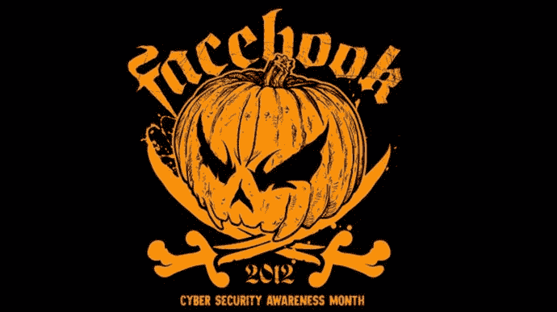

# 第十六章：内部社会工程评估

安德鲁·梅森，RandomStorm 有限公司技术总监

本章讨论内部社会工程评估作为一种防御策略的角色。内部社会工程评估是针对您自己的员工进行的一种测试，旨在突出安全弱点并在企业内部提高安全意识。本章探讨了为什么要进行这样的测试，并推荐了一些进行此类评估的框架。

### 关键词

内部测试；Hacktober；漏洞扫描；密码审计

本章内容

• 内部测试的必要性

• Facebook Hacktober

• 设计内部测试

• 测试基础设施

• 漏洞扫描

• 密码审计

• 测试人员和他们遊戏的流程

## 简介

第十五章讨论了围绕安全意识和培训计划的益处和挑战。

本章讨论内部社会工程评估作为一种防御策略的角色。内部社会工程评估是针对组织人员进行的一种测试，旨在突出安全弱点并在企业内部提高安全意识。本章探讨了为什么应该进行这样的测试，并推荐了一些进行此类评估的框架。

## 内部测试的必要性

突出的美国管理顾问彼得·德鲁克曾经说过，不能管理没有被衡量的事物。当考虑衡量组织内部政策和程序在信息安全方面的有效性时，这句话非常有道理。

第十四章和第十五章涵盖了硬化政策和程序以及员工意识培训的防御策略。以安全为重点创建硬化政策和程序有助于创建安全实践的基石，提供安全业务流程的框架。这些流程，无论多么强大和设计良好，只有实施它们的人才能做到。员工意识培训试图通过培训使员工了解风险并相应调整其行为。员工必须认识到需要安全工作实践的重要性，才能使任何员工意识培训计划被视为成功。

对于规模庞大的组织来说，这项工作可能是相当大的，并且需要组织内高级管理层在财务和时间方面进行大量投资，以便正确实施。

假设一个组织已经进行了调查现有政策和程序的工作，以期创建更安全的政策和程序，并且进行了全员意识培训计划，那么问题是如何衡量这些政策的实施以便进行管理？如果没有对这种干预进行充分的衡量，企业的利益相关者将无法真正知道变革的实施是否成功。

创建和执行内部社会工程评估是衡量组织内部政策和程序的有效性以及员工如何实施和遵循这些程序的一种方式。

一个经常被问到的问题是为什么需要进行内部测试，尤其是如果已经通过与外部专业测试公司进行基础设施渗透测试和社会工程评估。可以争论的一点是，如果外部公司定期进行测试，那么就不需要通过内部员工进行定期内部评估。然而，通常发现外部公司通常被合同要求每年进行测试，特别是在需要每年进行测试的合规要求下。外部评估可能非常昂贵，因为它们需要劳动密集型的高技能顾问，并且通常会审视整个基础设施，无论是出于需求还是合规要求。

内部评估将由内部资源执行，通常比外部公司能提供的更有针对性，这是由于时间和预算限制。进行漫长的内部评估并不罕见，这将会很昂贵，并且不是外部顾问可计费时间的最有效利用。内部评估的创建和执行扮演三个角色：

主要角色是衡量组织的安全姿态以及通过传统基于网络的手段或社会工程用户来获取未经授权访问企业资源的难易程度。

第二个角色是衡量最近提供的员工安全意识培训或其他旨在提高安全性的干预措施的有效性。

第三个角色是提高内部设计和执行评估的 IT 员工的技术技能。

公司的安全姿态只有在定期测试之后才能确保。经常听到 IT 管理员声称他们有反病毒软件，并且定期打补丁，所以他们的网络是安全的，这是在专业服务开始前客户常说的一句话，然而在评估中却发现网络存在许多安全漏洞，这些公司遮掩的安全流程和程序没有解决。这会让客户震惊地意识到，攻击一个单一入口有多容易，并且一旦在内部就可以完全控制基础架构。内部测试提供了定期测试的方式和方法，并且可以非常有针对性。试着选择一个领域，例如用户密码，然后设计并执行用户密码的评估，这在本章后面有所涉及。这种持续的测量为企业提供了关于真实安全姿态的反馈，并且可以用来调动预算资源，与外部公司签订合同，提供进一步的安全意识培训或更深入的安全测试，以彻底调查业务中的问题。

如果已经提供了安全意识培训或其他旨在提高业务安全姿态的干预措施，那么进行内部测试是评估进展的重要工具。显然，第一次执行任何内部评估时，将设定基线，然后未来的评估可以提供一种衡量安全姿态改善或退化的方式。这些评估必须经过精心设计，以考虑到新员工在角色内的情况或可能影响评估结果的新政策和程序。同样，这是一种希望证明改善业务安全姿态的投资产生了积极效果的好方法。

内部 IT 员工穿多顶帽子是相当普遍的，在当前的金融经济形势下，裁员似乎影响了各个 IT 部门的人员配备，导致员工在 IT 部门内承担多个角色。希望我们能够一致认为基础设施的安全是一个关键角色，而且不能简单地外包给外部咨询公司。鉴于此，重要的是要投资于内部 IT 团队的安全技能。并不是假设内部团队会获得专业知识或经验成为完全成熟的渗透测试人员，能够对第三方网络进行评估，但希望对团队进行的培训投资水平足够，使他们能够理解概念，并设计和实施有效的内部评估，以突出内部安全姿态的必要改进。除了为员工提供有价值的技能，可以为企业提供支持，这种最新的培训还有助于员工参与度，因为他们会感觉更加现代化，员工参与度与公司生产力之间存在许多积极联系。

当员工知道自己正在接受测试时，对员工的心理影响也是存在的。人们在知道可能被发现并在同事面前被作为榜样时，往往会展现出不同的行为。可以假设，意识到内部测试正在进行的员工更不太可能从事不安全的活动，通常会以更安全的方式工作。一个简单的行为，比如要求用户在离开工作区时锁定他们的工作站，可以通过抓住那些忘记锁定工作站的人来强制执行，从而产生一种安全恐慌感，员工会离开工作场所然后返回，因为他们意识到自己没有锁定工作站。

一个例子是许多零售环境中采用的个人包检查。在零售环境中，如果实施了随机抽查政策，每天都会检查某人的个人包，员工就不太可能盗窃商品。

一个进行内部测试的知名公司的例子是 Facebook 的 Hacktober 活动。

### Facebook Hacktober

如前所述，一个非常著名的公司进行此类内部安全测试的公司是 Facebook。自 2011 年以来，Facebook 每年十月都会举办他们所谓的 Hacktober 活动。这是一个为期一个月的活动，其中包含一系列模拟安全威胁，攻击 Facebook 员工的计算机，以查看谁会上当，谁会报告问题。这个事件是一个特别的事件，补充了不断进行的内部安全测试计划，以提高 Facebook 员工的意识。

图 16.1 Facebook Hacktober。

针对 Facebook 员工尝试了各种攻击，旨在以社会工程为基础欺骗员工以使他们屈服于攻击。这些攻击非常狡猾，通常与员工的工作角色一致，以免引起太多怀疑。如果员工识别并报告了一次钓鱼诈骗或安全威胁，他们将获得奖品和同行的赞誉。如果他们屈服于攻击，他们将获得进一步的安全意识培训，并被教育发生了什么，他们错在哪里，以及如何识别和报告未来可能出现的问题。

Facebook 采取的方法有助于企业内部的文化。Facebook 安全团队的一名主管报告说：“*网络研讨会在这里并不是很合适，所以我们想做一些符合我们黑客文化的独特的事情，教员工有关网络安全的知识，所以我们以十月、恐惧和恶作剧的主题创造了一些既有趣又有教育意义的东西*。”

Facebook 发现这种方法对员工非常吸引人，并且同事之间的内置竞争真的让员工意识到发生了什么。这就像在客户知道顾问即将到来时进行社会工程评估，他们只是不知道他们是谁，他们什么时候来，或者他们要做什么。这让整个企业都处于高度警惕状态，这使得员工更加质疑活动。

除了提高员工的意识和提高防范社会工程攻击的机会外，这种类型的练习还为衡量任何改进政策或程序的成功提供了一个很好的基准，以及衡量最近实施的安全意识培训的有效性。由于这是每年都进行的，它提供了根据这个记录的基准来衡量希望的改进的能力。

本月底，与万圣节相符，Facebook 为员工举办了一次以 Hacktober 为主题的欢乐时光和南瓜雕刻活动。

## 设计内部测试

现在，我们已经讨论了内部测试的需求以及进行内部测试的原因和好处。议程上的下一件事是如何计划和设计内部测试？每家企业都不同，每家企业都将根据其执行的业务流程有自己的需求，因此每个设计都将不同，但以下是一些建议可以在内部测试中进行考虑的领域。

内部测试有两个方面。第一个是测试基础设施，第二个是测试人员和他们遵循的流程。基础设施测试更符合传统的渗透测试，而测试人员和流程更符合社会工程测试。提供了两者的摘要以及一些建议的行动方案。

### 测试基础设施

本书涵盖了社会工程学，但没有涵盖基础设施测试领域。当人们谈论渗透测试时，大多数人想到的就是这种类型的测试，它涵盖了对客户基础设施的测试。这种基础设施由具有可达 IP 地址的项目组成（或者在适当情况下使用其他网络层协议），通常由网络设备组成，例如路由器、交换机和防火墙，以及用户工作站和服务器。基础设施不限于这些设备，本书的作者曾对从网络连接的冰箱到基于网络的百叶窗门控制器等任何东西进行基础设施测试。

可对基础设施运行的两个测试可以为内部评估提供有效结果，这两个测试是漏洞扫描和密码审计。

#### 漏洞扫描

漏洞扫描是大多数渗透测试的初始步骤之一，其中包括多个主机的范围，因为这是检查多个主机并提供初始漏洞列表的快速方法，这些漏洞可以由顾问进一步测试。为了执行漏洞扫描，需要一个漏洞扫描工具。幸运的是，针对大多数平台都有许多商业和开源扫描器可用，并且谷歌搜索将返回许多结果。在[SecTools.org](http://SecTools.org)网站上有一个可用扫描器的列表，网址为[`sectools.org/tag/vuln-scanners/`](http://sectools.org/tag/vuln-scanners/)。

可以使用的一个免费开源扫描器是 OpenVAS，可以从[`www.openvas.org`](http://www.openvas.org)获取。

漏洞扫描器提供了一个 IP 地址或可解析的主机名列表，并通过首先确定主机的可用性，然后通过各种端口扫描技术进行服务发现来执行扫描过程。一旦主机和服务确认，扫描器就会继续对主机进行分析，寻找软件漏洞和配置漏洞。大多数漏洞扫描器允许进行所谓的凭证扫描。这是一种漏洞扫描，其中扫描器可以获得管理员权限，以便它可以将驱动器映射到目标主机，并且还可以查询诸如主机注册表之类的项目，以提供更详细的评估水平。

软件漏洞是已知的安装在商业或开源软件中的 bug。一个软件漏洞的例子可能是微软在他们的安全公告 MS08-067 中宣布的 Conficker 漏洞的存在。这是一个众所周知的 Windows Server 漏洞（令人惊讶的是作者们仍然在商业网络中发现），微软在一个安全补丁中修复了它。漏洞扫描器知道如何从其插件数据库中识别这个漏洞，并将在扫描管理界面中报告它以及相应的风险细节。每年各个供应商都会发现成千上万个这样的漏洞，其中大多数都被 NIST 记录在他们的国家漏洞数据库中—[`nvd.nist.gov`](http://nvd.nist.gov)。所有这些都被分配了所谓的 CVE 参考。上面的软件漏洞示例被分配了 CVE 编号 CVE-2008-4250，并且可以在[`web.nvd.nist.gov/view/vuln/detail?vulnId=CVE-2008-4250`](http://web.nvd.nist.gov/view/vuln/detail?vulnId=CVE-2008-4250)找到。这个编号指的是它被发现的年份和从 0001 开始的时间顺序。因此，2014 年被分配 CVE 的第一个漏洞将是 CVE-2014-0001。

配置漏洞与软件配置方式有关，或者更恰当地说是配置错误。各种软件应用都需要配置。希望今天的软件供应商发布具有默认安全配置的软件，但是历史上许多供应商发布的软件并非如此，而是不安全的，依赖用户来保护它。这可以称为开放或封闭配置。最好从封闭配置开始，然后打开需要的部分。然而，最简单的解决方案是从开放配置开始，关闭不需要的部分，但是很多时候这些部分从未关闭，这就导致了配置漏洞，这将始终被严肃的渗透测试人员或更糟的是潜在的攻击者利用。配置漏洞的一个例子可能是网络设备，如路由器或交换机，使用了不安全的 Telnet 连接方法，而不是安全的 SSH 方法。如果不需要密码即可访问设备，则可能会进一步加重这种情况。这两者都是通过正确配置设备可以纠正的配置漏洞。

漏洞扫描可用于内部测试，以检查软件和配置漏洞。这对于确认服务器的补丁级别非常有用，在 Windows 环境中非常有用，以确保已应用所有关键的安全补丁。这种类型的扫描还可用于查找组织内部设备可能存在的任何配置错误。跟踪漏洞扫描结果，并确保任何主机都没有高级别漏洞，是提高安全性姿态并极大减少潜在攻击者访问任何企业资源能力的好方法。

#### 密码审核

在现代数字生活中，无论在工作还是家庭中，都需要对多种服务进行身份验证。一个非常好的内部测试是对组织内核心服务的用户密码强度进行测试。本书的作者定期执行基础设施评估，其中网络和服务器没有可利用的漏洞，但是一个弱用户或管理员密码允许他们访问网络，然后他们可以提升其权限，最终接管基础设施。密码似乎仍然是大多数组织安全姿态的软肋，存在长期以来的问题，即要么密码太复杂以至于难以记忆，要么密码易于记忆但过于简单。

假设作为政策强化的一部分，已实施了安全密码政策，并已实施相关控制，以确保所有基础架构中的核心服务强制执行足够长度和复杂度的强密码，以及在需要更高级身份验证时进行双因素身份验证。这也必须对网络上所有主机的服务和管理帐户强制执行。作者曾见过组织为其用户执行非常复杂的密码策略，但在未链接到密码策略的服务帐户和网络设备上发现了非常弱的密码。这就像一些 IT 团队对用户有一个规则，对自己有另一个规则一样，当发现测试中利用的弱密码属于服务帐户或 IT 团队成员时，这是相当令人尴尬的。

有许多工具可用于检查用户密码是否与各种服务匹配。 Windows 登录密码是开始检查用户列表的好地方。密码审核工具使用所谓的单词列表。这些单词列表是用户密码的文本文件。有许多公开可用的单词列表，其中一些包含大量生成的密码。也可以使用诸如[`www.randomstorm.com/rsmangler-security-tool.php`](http://www.randomstorm.com/rsmangler-security-tool.php)的工具创建自己的密码。RSMangler 接受一个与客户通用的小单词列表，然后将其转变为每个单词可能产生数千个变种，从而提供一个特定于组织的庞大单词列表。

一个推荐的密码工具是来自[`www.thc.org/thc-hydra/`](http://www.thc.org/thc-hydra/)的 Hydra。 Hydra 作为命令行工具和 GUI 工具都可用，用于针对以下服务执行密码审核：

• Asterisk、AFP、Cisco AAA、Cisco auth、Cisco enable、CVS、Firebird、FTP、HTTP-FORM-GET、HTTP-FORM-POST、HTTP-GET、HTTP-HEAD、HTTP-PROXY、HTTPS-FORM-GET、HTTPS-FORM-POST、HTTPS-GET、HTTPS-HEAD、HTTP-Proxy、ICQ、IMAP、IRC、LDAP、MS-SQL、MYSQL、NCP、NNTP、Oracle Listener、Oracle SID、Oracle、PC-Anywhere、PCNFS、POP3、POSTGRES、RDP、Rexec、Rlogin、Rsh、SAP/R3、SIP、SMB、SMTP、SMTP Enum、SNMP v1+v2+v3、SOCKS5、SSH（v1 and v2）、SSHKEY、Subversion、Teamspeak（TS2）、Telnet、VMware-Auth、VNC 和 XMPP。

可以使用密码审核在内部测试中检查用户密码的强度，并确保服务帐户和网络设备也应用了强密码。执行内部密码审计可以概述任何可能在外部公司测试或以前由潜在攻击者突出显示之前被纠正的问题。

### 测试人员及其遵循的流程

测试人员和流程是本书的主要关注点。这是社会工程学参与，其中人员和流程被放在考验中，以尝试获取特权资源。执行内部社会工程风格的参与比测试基础设施更进一步，也需要更多的规划，因为这些是针对每个组织定制的场景。

这提供了利用本书各章节中解释的一些项目的机会，以设计、筹备和执行内部组织的社会工程评估。

第八章涵盖了侦察和建立评估基础。本章展示了如何查找和操纵可用的数据。这包括收集电子邮件地址、文档元数据、公司网站和社交媒体。接下来的两章将介绍威胁建模的行为，以创建有效的场景。提供了三种攻击向量作为示例，这构成了社会工程师工作的支柱。这些是：

1. 电子邮件攻击向量

2. 电话攻击向量

3. 物理攻击向量。

第九章涵盖了电子邮件攻击向量，并涵盖了钓鱼和矛头钓鱼的非常有效方法。这提供了一个关于创建成功的钓鱼攻击所涉及的过程和工具的实例，以作为内部社会工程评估的一部分，旨在改进防御措施以抵御此类攻击。

第十章涵盖了电话攻击向量。电话是一种用于社会工程的很好的远程工具，可以用于收集有关目标公司的信息，或者欺骗用户执行导致内部安全完全被破坏的操作。由于电话的远程性质，以及许多服务允许匿名性，很明显这是远程工程师的一个不错选择，因为这是获取有关组织信息的一种相当安全的方法。

第十一章涵盖了物理攻击向量，这是可以在现场使用特定技能渗透组织的地方。如果顾问在整个组织中被认识，这可能会很困难，尽管如果有未知身份的远程办事处。这仍然可以是一个有效的攻击向量，本章解释了如何发展评估的物理方面。

利用这些章节中的信息将有助于开发一个内部评估，可用于确定内部组织的安全姿态。

## 摘要

本章已经解释了对组织进行内部评估的必要性。本章以解释在展示 Facebook 的例子之前对这种评估的需求开始，以及他们如何利用他们的 Hacktober 倡议来推动员工的安全意识。接下来看一下评估如何制定，并涵盖对组织内部基础设施的测试，以及对人员和流程的测试。漏洞扫描和密码审计被确定并概述为两种可以在查看人员和流程之前使用的方法，并涵盖了本书大部分内容涵盖的三种攻击向量：电子邮件攻击向量，电话攻击向量和物理攻击向量。

回到开头的一句话，管理不被衡量的事物是不可能的，而进行内部测试，正如前面提到的那样，是建立初始基准的一个很好的方法，然后再利用进一步的测试来展示希望员工的安全意识会有所改善。

下一章是本书的结束章节，将提供一个社会工程师的作弊表。本章将把整本书汇集成一个简单易用的作弊表和流程图，帮助安全工程师规划和执行社会工程评估。流程图将引用本书的章节，读者可以在其中获取进一步了解所需工具和技术的信息，目的是提供一个基于整本书中提出的方法论的易于使用的系统。
