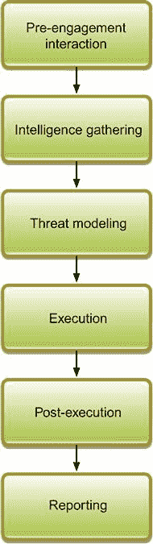
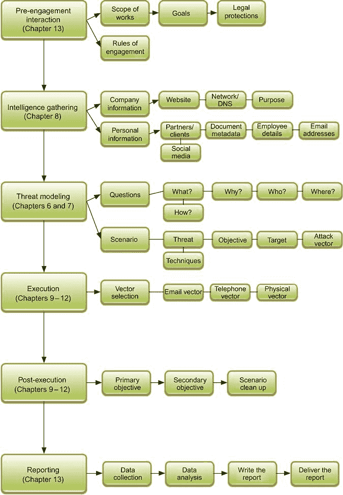

第十七章

# 社会工程评估备忘单

安德鲁·梅森，技术总监，RandomStorm 有限公司

本章将整本书汇总成一个简单易用的备忘单和流程图，帮助安全工程师规划和执行社会工程评估。流程图将引用书中的章节，读者可以进一步了解所需的工具和技术，目的是提供一个基于整本书中提出的方法论的易于使用的系统。

### 关键词

社会工程; 框架; 备忘单; 流程; 方法论

本章内容

• 社会工程框架

• 社会工程备忘单

## 介绍

第十六章讨论了社会工程评估如何在公司内部作为一种提高安全意识和建立更强策略的方法，希望能够防止真正的社会工程威胁暴露。

本章的目的是将书中所有要素汇总成一个简单易用的备忘单和流程图，帮助安全工程师规划和执行社会工程评估。流程图将引用书中的章节，读者可以进一步了解所需的工具和技术，目的是提供一个基于整本书中提出的方法论的易于使用的系统。

## 社会工程框架

第五章提出了一个社会工程框架，该框架在某种程度上基于渗透测试执行标准或 PTES—[`www.pentest-standard.org/index.php/Main_Page`](http://www.pentest-standard.org/index.php/Main_Page)。该框架的理念是为规划和执行社会工程评估提供结构，以便组织在进行此类咨询时遵循可重复的标准。

提议框架的基于流程图的概述可在图 17.1 中看到，并在下面解释如下。

• **前期互动**

本初步部分涵盖了参与之前发生的一切，并涵盖了诸如范围界定、目标、建立沟通渠道、参与规则和作为参与一部分所需的法律保护等主题。其中一些概念在第十三章中有涉及。

• **情报收集**

本节是在参与过程中的第一节，涵盖了揭示可作为社会工程评估一部分的信息的初步工作。收集信息的示例可以包括从搜索引擎和社交网络收集公司电子邮件地址，从公开可用的公司文件中解析文档元数据，以及建立电话交换和接待处的电话号码等联系方式。本节在第八章中有详细介绍。

• **威胁建模**

本节为社会工程评估创建了一个模型。该模型查看了初始信息收集的结果，并结合了客户的要求，使您可以基于所选的攻击向量创建一个有针对性的攻击方案。尽管威胁模型使用类似的攻击向量，但它们的设计和实施对于每个客户都是独特的。威胁建模在第六章和第七章中已有涉及。

• **执行**

本节涵盖了社会工程评估的实际执行，这被视为参与的主要目标。在此阶段，将使用收集到的所有信息来应对已经建模的威胁，以执行基于威胁的评估。顾问的目标是获得对早期评估阶段识别出的系统的访问权限，或者打破程序。有关通过三种主要攻击向量执行此类评估的信息可以在第九章至第十一章中找到。有关如何通过技术支持这些攻击向量的更多信息可以在第十二章中找到。

• **执行后**

本节涵盖了评估成功执行后才可能实现的次要目标。例如，主要目标可能是通过尾随来获取进入建筑物的物理访问权限，在执行期间已完成。执行后任务和次要目标可能是在不被发现或注意的情况下收集敏感信息并外泄。执行后的社会工程方面在第九章至第十二章中已有涉及。许多执行后任务是基于网络的，不在本书的范围内，因为它们被认为更符合基础设施渗透测试的范畴。

• **报告**

评估完成后，将从评估结果和执行评估的结果中创建报告。这是交付给客户的，并且是一个非常重要的工作，必须符合驱动社会工程评估的业务目标。报告采用书面形式，包括收集的所有证据和使用的方法。通常，报告由执行实际评估的顾问整理和撰写。还建议让顾问提供口头报告或至少参加电话会议，回答客户可能对执行的评估有关的任何问题。有关收集信息和撰写实际报告的更多信息可以在第十三章中找到。

图 17.1 社会工程框架。

## 社会工程小抄

在图 17.2 中看到的框架流程图的基础上，可以添加更多组件到图表中，以创建一个更深入的备忘单，总结并链接到本书提供的关键概念。本书在流程图中提供了广泛的章节和页面参考，以便可以将流程图与书中与主题相关的部分进行交叉引用。

图 17.2 社会工程备忘单。

## 摘要

这一最终章节提供了社会工程框架的简要总结和相关流程图，该框架在第五章中提出。接下来，流程图被扩展以在每个部分下包含更多细节，试图将其更多地转化为本书涵盖的主要概念的图形表示。希望这份备忘单可以作为一个摘要指南，将模型中的步骤与书中的章节联系起来，以便日后快速参考。
