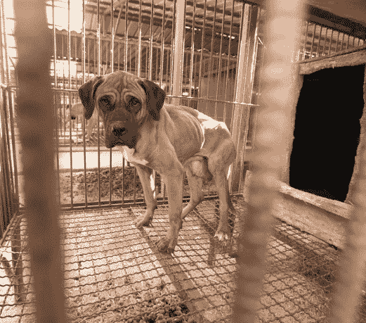
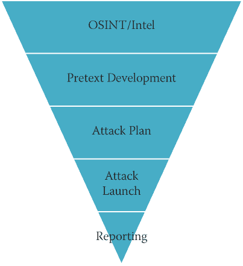

# 1

一个深入了解专业社会工程学的*新*世界

> *我认为你的安全就是你的成功，而你成功的关键就是你的美味口感。*

> —戈登·拉姆齐

我仍然清晰地记得坐在电脑屏幕前，开始撰写《社会工程：人类操纵的艺术》第一段的情景。那是在 2010 年，*很久*以前了。我几乎忍不住告诉你，那时我们还得用打字机一边上山一边写书，但我不想太夸张。

在那个时候，当你搜索“社会工程”时，你会得到一些关于社会工程传奇人物凯文·米特尼克和一些关于如何追女孩或者如何从麦当劳获得免费汉堡的视频。快进八年，现在 *社会工程* 这个术语几乎是一个家喻户晓的词汇。在过去的三四年里，我看到社会工程在安全、政府、教育、心理学、军事以及你能想象到的任何其他应用中都得到了应用。

这种转变引出了一个问题，为什么会这样。一位同事告诉我：“这是你的错，克里斯。”我想他是想侮辱我，尽管我对这句话感到有点自豪。然而，我不认为我是 *社会工程*（SE）这个术语几乎无所不在的唯一责任人。我认为我们现在看到它被每个人和他们的兄弟使用，不仅是因为它是七年前最简单的攻击向量，而且还因为它现在也是攻击者获得最大收益的攻击向量。

建立社会工程攻击的成本很低。风险甚至更低。而潜在的回报却是*巨大*的。我的团队一直在收集关于社会工程攻击的新闻报道，并在网络上搜集统计数据。我很自信地说，在 2017 年，超过 80%的所有数据泄露事件都涉及社会工程元素。

IBM 的“2017 年数据泄露成本研究”指出，数据泄露的平均成本为 362 万美元。当潜在回报如此巨大时，攻击者为什么会想要使用社会工程攻击显然不难理解。

我还记得在 2010 年我的《社会工程：人类操纵的艺术》出版后的第一次采访，当时有人问我：“你不担心你正在武装坏人吗？”但对我来说，社会工程就像任何新型战争一样。

为了更清晰地解释这一点，我想到了布鲁斯·李在 20 世纪 60 年代来到美国的故事。当时的种族偏见很严重，他在做一些其他人没有做过的事情：向任何种族、肤色或国籍的人教授截拳道（一种古老的中国武术）。他在他上学的大学与那些自认为很懂格斗的同学搏斗。但他把对手一个个制服。最终，一些对手甚至成为了布鲁斯的朋友或学生。

教训是什么？人们不得不适应一种新型战斗方式，否则他们就会一直被打败。布鲁斯·李的学生会不会利用他们新学到的技能伤害他人并做恶？是的，但布鲁斯认为教育人们是必要的，这样他们才能保护自己。

因此，我对问题：“你不担心你在武装坏人吗？”的答案与八年前一样：我无法控制你如何使用这些信息。你可以阅读这本书然后出去攻击别人并偷他们的钱。或者你可以阅读这本书学会成为正义的捍卫者。选择权在你手上，但好人需要有人帮助他们教导。

学习防御这种新型攻击不仅仅需要学会如何挨打。就像截拳道一样，它需要平衡学会如何进攻、学会如何防御以及何时做每一件事情。当你学会成为一名社会工程师时，你需要能够像坏人一样思考，同时记住你是好人。再举个类比，你需要有力量，但不要走向黑暗面。

现在你可能会问：“如果你的回答没有太多改变，那么为什么我们需要你的书的第二版呢？”好吧，让我告诉你。## 有什么改变？

这是社会工程学的一个根本问题。表面上看，答案是：“没有太多。”你可以追溯很久以前，找到关于社会工程的轶事。例如，我能找到的第一个记载的故事之一在《圣经·创世纪》中，据报道发生在公元前 1800 年左右。雅各想要得到应该给予他的哥哥以扫的祝福。知道他的父亲以撒视力减退，依靠其他感官来分辨他所说的话的对象，雅各穿着以扫的衣服，准备了以扫通常会准备的食物。最好的部分是：以扫以异常多毛而闻名，但雅各并非如此，因此他将两只小山羊的皮固定在手臂和脖子后面。当以撒伸手触摸雅各时，以撒依靠自己的嗅觉、触觉和味觉来判断他正在与以扫而非雅各在一起。根据《创世纪》中的记载，雅各的社会工程攻击成功了！

从有记载的历史开始，我们看到一个接一个的人类相互欺骗、欺骗、骗取或诈骗的故事。从表面上看，社会工程学并没有太多全新的东西，但这并不意味着什么都没有改变。

一个例子就是语音钓鱼。我老实记得第一次使用 *vishing* 这个词的情景。人们看着我就像我在说克林贡语一样。说真的，我倒不如说 *laH yIlo' ghogh HablI' HIv*（星际迷会欣赏）。然而，截至 2015 年，*vishing* 被加入到 *牛津英语词典* 中。

为什么*vishing*现在已经进入字典很重要？这表明社会工程向量对世界产生了多大影响。曾经看起来是“虚构”语言的词现在已经成为我们日常词汇的一部分。

不仅仅是词汇变得司空见惯。现在有一些专门帮助坏人更善于做坏事的服务。例如，当我为一个客户工作时，我偶然发现了一个专门提供校对和拼写检查恶意钓鱼邮件的服务。该公司提供 24/7 的英语支持。将这样的东西与我们的 BYOD（自带设备）文化以及大多数移动设备都是迷你超级计算机的事实结合在一起，再加上一些新世界社交媒体上瘾。你所剩下的就是一种全新的攻击景观的配方——社会工程风格。

除了景观的变化，我也发生了变化。当我写第一版这本书时，书名是*社会工程：人类黑客的艺术*。我选择了这个名字，因为我觉得我在那本书中描述的东西很像艺术。艺术是主观的；对不同的人意味着不同的东西。它可以被应用不同，可以被用于不同的目的，可以被看待、喜欢和讨厌出于完全不同的原因。

这第二版被称为*社会工程：人类黑客的科学*。韦氏词典给出了科学的一个定义：“知识的状态：与无知或误解区分开的知识。”八年前，我所做的大部分对于安全领域来说都是新的，我是边做边学。现在，由于我简历上额外的几年经验，我处于“知识的状态”。

那种经历，我希望，会让这本书对你更有意义，无论你是一个想要了解社会工程的安全专家，一个想要拓宽视野的爱好者，还是一个想要了解问题以包含在你的课程中的教育工作者。无论你为什么在读这本书，我希望通过更科学地思考这些话题，我可以以更有用和完整的方式传达这些信息。  ## 为什么你应该读这本书？

我觉得这第一章需要遵循我在第一本书中采取的相同模式，所以我想花点时间讨论为什么我觉得任何人都应该读这本书。是的，我意识到我可能有偏见，但请给我一点时间。

你是人类吗？我猜想如果你坐在这本书前面，读着这段文字，你要么是某种先进形式的人工智能，要么你是人类。我甚至敢说，这本书的 99.9999999%的读者是人类。社会工程利用人类做决策的方式并利用这些过程中的漏洞。

社会工程师的目标是让你在不经思考的情况下做出决定。你越是思考，就越有可能意识到自己被操纵，这对攻击者来说当然是不利的。在*社会工程师播客*的第 7 和第 70 集中，我有幸采访到了艾伦·兰格博士。她和我谈到了她所称之为阿尔法模式和贝塔模式的东西。

阿尔法模式是指一个人的大脑运行在每秒 8 到 13 个周期。它通常以“白日梦”或兰格博士所称的“放松、专注的注意力”为特征。

贝塔模式是指一个人的大脑运行在 14 到 100 个周期之间。这是我们的大脑警觉、观察和意识到周围发生的事情的时候。

哪种状态对社会工程师更有利？显然，答案是阿尔法模式，因为思考和意识减少了。这不仅仅是在恶意意图方面。操纵和某些类型的影响旨在让你在不经思考的情况下行动。

例如，你很可能看过这样的商业广告：一个著名的女性音乐艺人出现在屏幕上，背景中播放着一首非常悲伤的歌曲。画面转换成被殴打、受伤和挨饿的小猫和小狗。这些动物又脏又肮脏，看起来快要死了。现在艺人再次出现在屏幕上；她被健康的动物包围，她正在用爱抚宠物。信息是什么？只需几美元，那些营养不良、奄奄一息的动物就可以变成充满爱的宠物——健康、快乐，全都属于你。商业广告中的画面就像你在图 1-1 中看到的那样。

**图 1-1** 这让你感觉如何？

图片来源于亚马逊社区动物救援，[www.flickr.com/photos/amazoncares/2345707195](http://www.flickr.com/photos/amazoncares/2345707195)

商业广告制作者是出于自私目的在操纵你吗？并非完全如此。他们所学到的是，如果他们触发你的情绪，你将更有可能捐款或采取所需的行动。成功率远高于仅仅诉诸知识或逻辑。触发的情绪越多，你的理性思考就越少。你的理性思考越少，你就越快地基于触发的情绪做出决定。

所以，回到我之前的观点：如果你是人类，那么这本书可以帮助你了解存在哪些类型的攻击。你可以了解坏人是如何利用你的人性来对付你的，你可以学会如何抵御这些攻击，以保护你所爱的人免受成为受害者的命运。

让我首先给你一个社会工程的概述。## 社会工程概述

每当我讨论社会工程时，我通常都会从我过去 10 年一直在使用的定义开始。随着时间的推移，我只是稍微修改了它。

但在我给出社会工程的定义之前，我需要声明一个非常重要的观点：社会工程（SE）并不政治正确。这个 事实对许多人来说可能很难接受，但这是真实的：SE 利用了性别偏见、种族偏见、年龄偏见和地位偏见（以及这些偏见的组合）存在的事实。

例如，想象一下你必须潜入客户的建筑物。为了做到这一点，你需要制定一个让你轻松进入的借口。你的团队由几种不同类型的人组成。如果你确定这项工作的最佳借口是清洁工人，以下哪位团队成员最适合？

+   40 岁的白人，金发男性

+   43 岁的亚洲女性

+   27 岁的拉丁裔女性

如果你确定你的最佳借口是公司间厨房工作，以下哪位团队成员最适合？

+   40 岁的白人，金发男性

+   43 岁的亚洲女性

+   27 岁的拉丁裔女性

事实上，在任何类别中，一个技术娴熟的社会工程师都可以成功。但哪一个会导致思考最少？记住，思考是社会工程师的敌人。

有了这个理念，让我们回到我对社会工程的定义：

+   *社会工程* 是任何影响一个人采取行动的行为，这个行动可能有可能不符合他或她的最佳利益。

为什么我的定义如此广泛和一般？因为我相信社会工程并不总是负面的。

曾经有一段时间，你可以说，“我是一个黑客，”而不会让普通人四处奔跑，拔掉他们路径上的每个电子设备。成为黑客曾经意味着需要知道某件事情是如何工作的。黑客不满足于只有基础知识；那个人想深入了解任何事物的内部运作。然后，一旦了解了，黑客会看看是否有任何方法可以绕过、增强、利用或改变其原始目的。

当我开始写我的第一本书时，我想尝试确保我能以一种不总是暗示涉及可怕的骗子或骗子或骗子的方式来定义社会工程。我看到坏人使用的完全相同的原则可以应用于善良的目的，我希望人们知道这一点。

我经常用这个例子：如果你走过来对我说，“嘿，克里斯。我想和你举办一个公主茶话会——你坐在这里，我给你涂指甲油，你戴着粉色围巾，我们谈论迪士尼公主们，”我不仅会笑，而且会慢慢地后退，同时寻找最近的出口。然而，我必须承认可能有一些这种活动的照片在流传。

怎么会呢？我的女儿让我和她一起举行一个公主茶话会。在你说“嘿，这不公平比较—你爱她！”之前，我要承认，这在我决定加入她的决定中起了很大的作用，但是想想对我做出这个决定所起作用的心理学原理。为了同意一个我会在任何其他人问我之前就拒绝的决定，我必须绕过我的正常决策过程才能说“是”。

当你了解决策是如何做出的时，你就能开始理解一个恶意攻击者如何利用情感触发器、心理学原理以及社会工程学的艺术和科学来让你“采取不符合你最佳利益的行动”。

保罗·扎克博士出现在《社会工程师播客》第 44 集中。他写了《道德分子》（Dutton，2012）一书。在那本书和我们的播客中，扎克博士谈到了他对一种名为催产素的激素的研究。他的研究帮助我们看到它与信任是多么密切相关，因为他对催产素何时被释放到我们的血液中有了一个非常重要的评论，当我们感到有人信任我们时，你的大脑不仅会释放催产素，而且当*你感觉到*有人给了你信任时也会释放催产素。根据扎克博士的研究，这种现象已经在人与人之间、电话中、互联网上甚至在你看不到那个“信任”你的人的情况下得到了证实。

我们大脑另一种产生的化学物质是多巴胺。多巴胺是大脑产生并在愉悦、幸福和刺激时释放的一种神经递质。将催产素与多巴胺混合在一起，你就有了一种社会工程大脑鸡尾酒，可以打开你想要的任何门。

多巴胺和催产素在亲密时刻释放到我们的大脑中，但它们也可以在正常对话中释放。这些对话是社会工程的核心。

我相信我们每天都会使用这些相同的原则——很多时候是不知不觉地——与我们的配偶、老板、同事、牧师、心理医生、服务人员以及我们遇到的每个人交往。因此，理解社会工程学以及如何与你的同类交流对今天的所有人都至关重要。

在一个技术已经使得使用表情符号或少于 280 个字符的通讯变得容易的世界中，学习如何使用会话技巧变得更加困难，更不用说看出这些技巧何时被用来针对我们了。更进一步地说，社交媒体创造了一个告诉每个人关于自己一切的社会是可以接受的，甚至是被推广的社会。

当我从恶意的角度谈论社会工程时，我将其分解为以下四个向量：

+   **SMiShing：** 是的，这是一个真实存在的事物，它代表短信钓鱼，或者通过短信进行钓鱼。当富国银行在 2016 年遭受攻击时，我收到了图 1-2 中显示的 SMiShing 攻击。

    **图 1-2** 这次 SMiShing 攻击陷害了很多人。

    疯狂的是，我甚至都不用富国银行，但我还是收到了这种攻击。（不，我不会告诉你我用的是哪家银行—想得美。）

    通过简单的点击，这些攻击要么旨在窃取凭证，要么在移动设备上加载恶意软件，有时两者兼而有之。

+   **Vishing：** 正如我已经提到的，这是语音钓鱼。自 2016 年以来，这作为一种攻击手段大幅增加。对于攻击者来说，这是一种简单、廉价且非常有利可图的方式。而且几乎不可能通过来自国外的伪造号码来定位并抓住攻击者。

+   **钓鱼：** 在社会工程领域最被讨论的话题就是钓鱼。事实上，本书的技术编辑 Michele 和我在一本名为*钓鱼黑水：恶意电子邮件的攻击和防御*（Wiley，2016）的书中写到了这个话题。（是的，我刚刚无耻地为我的另一本书做了广告。）钓鱼被用来关闭制造厂、黑客入侵民主党全国委员会、侵入白宫以及数十家大公司，并在各种骗局中窃取了数百万美元。钓鱼是这四个主要攻击手段中最危险的。

+   **冒充：** 我知道，我们应该在这个上面也加上一些“ishing”的形式，但我能做的最好的就是把它列在最后，因为它与其他不同。然而，它在这个列表中的位置绝不意味着我们不必像对待其他问题那样担心它。在过去的 12 个月里，我们收集了数百个关于冒充警察、联邦特工和同事犯下一些真正可怕罪行的故事。2017 年 4 月，有一个关于一个冒充警察并被抓的故事。他涉及儿童色情，并利用他的冒充身份牟利。

你所读到的每一个社会工程攻击都可以归为这四类之一。最近，我们看到了我们所谓的组合攻击，恶意的社会工程师在一次攻击中结合了这些手段来达到他们的目的。

当我分析这些攻击时，我开始看到不仅可以识别使用了哪些工具和流程，还可以帮助安全专家更清晰地定义如何执行这些攻击，然后利用结果进行教育和保护。我把这称为*SE 金字塔*。## SE 金字塔

让我直接进入金字塔之前，我先定义一下为什么我提出这个概念以及每个部分的含义。金字塔如图 1-3 所示。

**图 1-3** 社会工程金字塔

正如您所看到的，金字塔分为几个部分，并从 SE 专业人士的角度来看待社会工程 - 也就是说，不是为了恶意目的而使用 SE，而是为了帮助客户和顾客。

我将定义金字塔的每个部分，并稍后在本书中更详细地讨论各层。

### OSINT

OSINT，即开源情报，是每次社会工程活动的命脉。它也是应该花费最多时间的部分。由于这一点，它占据了金字塔的第一部分，也是最大的部分。这部分金字塔中的一个方面很少被提及：文档。您将如何记录、保存和分类您找到的所有信息？我将在下一章中更详细地讨论这一关键因素。  ### 借口开发

基于 OSINT 阶段的所有发现，下一个逻辑步骤是开始制定您的借口。这是一个至关重要的部分，最好在考虑 OSINT 的情况下完成。在这个阶段，您可以看到需要进行哪些更改或添加以确保成功。这也是确定需要哪些道具和/或工具的时候。  ### 攻击计划

拥有一个借口并不意味着您已经准备好了。下一个阶段是计划三个 W：什么，何时和谁。

+   计划是什么？我们追求和试图实现什么？客户想要什么？这些问题将有助于制定下一步计划。

+   什么时候是发动攻击的最佳时机？

+   谁需要随时提供支持或帮助？  ### 攻击发动

现在是有趣的部分：发动攻击。通过攻击计划的准备工作，您已经准备好全速前进了。准备是重要的，但不要过于脚本化，以至于无法灵活应对。我完全赞成制定书面计划，我认为它可以在未来节省大量麻烦。我要提醒的是，如果您将需要采取的每个字或行动都编写成脚本，那么当发生意外情况时，可能会遇到问题。您的大脑意识到脚本上没有任何帮助，您开始结巴，变得紧张，并表现出恐惧的迹象。这可能会真正破坏您成功的能力。与其编写脚本，我建议使用大纲，这为您提供了一个要遵循的路径，但也允许艺术自由。  ### 报告

等一下，不要跳过这一部分。回来读一下。是的，报告并不好玩，但你可以这样想：你的客户刚刚支付了*x*美元来执行一些服务，而且很可能，你在那些攻击中非常成功。但客户支付你并不是因为他们想要显得很酷。他们支付你是为了了解他们可以做什么来解决问题。因此，报告阶段位于金字塔的顶端，是整个金字塔的基石。

如果遵循这个金字塔的五个阶段，不仅作为一个社会工程师，而且作为一个向客户提供社会工程服务的专业人士，你将取得成功。事实上，除了报告外，这些步骤是全世界恶意社会工程师遵循的。

2015 年，Dark Reading 报道了一个涉及这个金字塔的攻击。（你可以阅读文章“CareerBuilder Attack Sends Malware-Rigged Resumes to Businesses”在`[www.darkreading.com/vulnerabilities---threats/careerbuilder-attack-sends-malware-rigged-resumes-to-businesses/d/d-id/1320236?](http://www.darkreading.com/vulnerabilities---threats/careerbuilder-attack-sends-malware-rigged-resumes-to-businesses/d/d-id/1320236?).`)

1.  攻击者调查了一些目标并在进行 OSINT 阶段时发现他们的目标使用了一个名为 CareerBuilder 的流行网站。

1.  在完成 OSINT 阶段后，攻击者开始进行借口开发。这导致他们计划成为一个求职者的借口，他们希望被雇佣在目标提供的任何角色中。他们意识到他们需要的工具是一些恶意编码文件和一些看起来逼真的简历。

1.  他们开始计划攻击，回答一些关于这些 W 问题。

1.  然后，他们发动了攻击，将他们的恶意文档*不*上传到目标，而是上传到 CareerBuilder 网站。发布工作的公司将收到一封新申请者的通知邮件，该邮件将包含攻击者上传的附件。

1.  他们没有进行任何可操作的报告阶段，但由于 Proofpoint 的一些研究人员，对这次攻击有一些可操作的报告。

这次攻击成功是因为目标会收到一封来自信任和声誉良好来源（CareerBuilder）的附件的电子邮件。因此，目标会毫不犹豫地打开附件。这正是恶意社会工程师的目标：让目标在不经过深思熟虑的情况下采取*不符合*自身最佳利益的行动。## 这本书里有什么？

当我开始计划这本书时，我想确保遵循第一版《社会工程》的大纲，这样那些从中受益的人也会从这本书中受益。与此同时，我想改变这本书，并更新它以涵盖一些新的攻击和我在之前的书中从未讨论过的内容。

我想确保我采纳了粉丝、研究人员、读者和评论者的所有建议，希望我能使这本书比第一版更好。让我概述一下这本书的格式，这样你就知道可以期待什么了。

沿着金字塔的路径，第二章“你看到了我看到的吗？”讨论了 OSINT 并涵盖了一些被使用的经典技术。我避免过多地深入实际工具，尽管我提到了一些在过去十年中一直留在我的工具箱中的工具。

在第三章“通过交流对人进行剖析”中，我探讨了我在第一版中几乎没有涉及的一个话题。我深入研究了高级交流建模和剖析工具。

第四章“成为你想成为的任何人”是我开始深入探讨借口的地方。这是一个不多人在社会工程之外谈论的话题。我涵盖了多年来我所经历的许多经验（成功和失败）的技巧、诀窍和经验。

在第五章“我知道如何让你喜欢我”中，我整理了来自许多播客、通讯和与一些世界名人（如罗宾·德里克）的对话中的信息，并将建立关系的原则应用于社会工程。罗宾·德里克是 FBI 行为分析组的负责人，也是我的好朋友。他是建立关系和信任的大师，并已定义了实现这两者的步骤。

第六章“受影响”，将影响研究领域的领导者之一罗伯特·西奥尔迪尼的工作应用于社会工程领域。这一章介绍了他多年研究开发的原则，并展示了社会工程师如何使用和正在使用这些原则。

第七章“我甚至没有要求你那个”，定义了框架和引诱，并概述了任何人如何掌握这两者。

在第八章“我看到了你没有说的话”中，我们回到了我最喜欢的话题之一：非语言。我在我的书《揭开社会工程师的面纱：安全的人类要素》（Wiley，2014 年）中深入探讨了这个话题，但这一章是一个初学者指南，让你开始进入非语言世界。

在第九章“攻击人类”中，我将前八章应用于五种不同类型的社会工程攻击。这一章展示了作为专业社会工程师，应用本书原则的重要性。

随着我们接近尾声，第十章，“你有一个 M.A.P.P. 吗？”，涵盖了预防和减轻的内容。在一本关于专业社会工程的书中，有这一章节来介绍学会对抗所有社会工程攻击的四个步骤是合适的。

然后，像所有好事一样，这本书必须结束了。所以，第十一章，“接下来怎么办？”，结束了这本书。

这里有几个我对你的承诺：

+   我承诺不引用维基百科作为一个有价值的来源，尤其是在提及研究时。（我从错误中吸取了教训。）

+   我承诺会告诉你很多我在过去七年或更长时间里的经历。有时，我会从多个角度讲一个故事，以帮助你真正牢固地理解一些观点。但我会尽量混合这些故事，让你不会感到无聊。

+   当我在使用一些领域内最伟大头脑的研究或工作时，我会确保你有他们工作的参考资料，这样你就可以更深入地了解任何你可能感兴趣的主题。

+   就像我对我写过的第一本书一样，我欢迎所有的联系、评论、建议和批评。

我所要求的唯一回报是你以我所期望的方式阅读这本书。如果你是一个新手，这本书可以帮助你学习成为一名专业的社会工程师。如果你有经验，那么我希望我的分享一些故事、技巧和窍门能给你一些新的工具。如果你是一位热情者，那么我希望你像我写作时一样兴奋地阅读。如果你是一个怀疑者，那么请以我并不声称自己是社会工程的唯一救世主的思想阅读这本书。我只是一个有着多年经验的充满激情的社会工程师，我希望分享这些经验，试图让这个世界变得更安全一点。

我写的任何一本书都不会完整，没有烹饪的类比，所以我来了。就像任何一顿美餐一样，需要大量的计划，一个需要新鲜食材的好食谱，然后是艺术和科学的执行。社会工程虽然本质上很简单，但并不是新手的菜谱。它涉及理解人类如何做出决策，什么会激励他们，以及如何在利用他人的同时控制自己的情绪。

这本书的主题至今仍然像八年前一样重要——也许现在甚至更重要。在过去的八年里，我看到许多人成为专业社会工程师。我也看到许多恶意的社会工程师兴起和衰落。

鉴于攻击的本质如此严重地倾向于人为因素，所有安全专业人员都必须了解社会工程。但这个主题还有很多内容。我记得当我开始做厨师（在很久以前的前世）时，我的导师会拿一些食材给我尝一点。但为什么呢？

他告诉我，如果我不真正了解每种食材的味道，就不可能知道“品尝”是什么意思。如果我知道食谱需要一些山葵，而我想让它更辣一点，那么我就会明白我可以多加一点。了解某种食材也具有咸味可能会让我调整食谱中的盐，以免食物调味过多。你明白我的意思。

即使你不在安全行业，了解这些要素的“味道”也很重要，这样你就可以得到保护。建立与某人的融洽关系意味着什么，以及如何利用这一点让你放弃你的钱？（这在第五章中有所涵盖。）在引诱对话中撒入影响力，如何让某人在电话中泄露密码？（这在第六章和第七章中有所涵盖。）

这些要素中的每一个都可以帮助你学会“品味”。当你了解它们时，你可以识别当有人尝试在你身上使用它们时，你会更加安全。你可以感觉到有些不对劲，然后采取防御措施。

你有没有看过戈登·拉姆齐（Gordon Ramsay）的烹饪比赛？当他尝到一道他讨厌的菜时，他会指出具体问题：“这道菜太辣了，他们用了太多的油。” 另一方面，一个新手可能会说：“太辣，太油腻了。” 这两种描述是一样的吗？我认为不是。我的目标是帮助你成为社会工程领域的戈登·拉姆齐，但也许少点粗话。

说了这么多，让我们进入第一个内容丰富的章节，讨论 OSINT。
