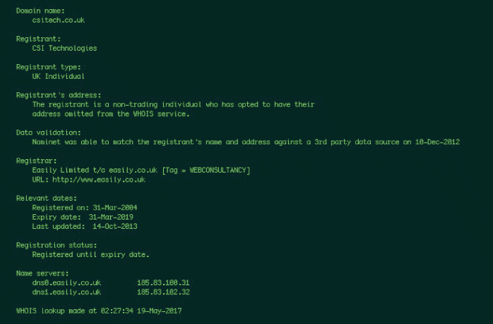

# 第二章：你看到了我看到的吗？

> *记住，失败是一个事件，而不是一个人。*

> —ZIG ZIGLAR

OSINT 代表开源情报，是社会工程的生命线。信息是每次参与的起点和支撑点。因为 OSINT 对我们作为社会工程师如此重要，所以你理解所有不同获取目标情报的方式是至关重要的。

无论你如何获取 OSINT，你都需要清楚地知道自己在寻找什么。这可能听起来很容易，但实际上并不像听起来那么容易。你不能简单地说，“我想要目标的所有信息。”每种信息都有不同的价值，而有价值的东西可能会随着你打算发动的攻击类型而改变。  ## 收集 OSINT 的现实世界示例

让我试着给你一些视角。根据网站`[www.worldwidewebsize.com](http://www.worldwidewebsize.com)`，有超过 44.8 *亿* 个被索引的网站。这还不包括未被索引的任何内容，暗网或深网上的网站等。全球年度互联网流量达到 1.3 泽字节（即 1,300,000,000,000,000,000,000 字节）。一些来源甚至告诉我们，互联网可以包含高达 10 尧字节的总数据量。（写成 10 尧字节看起来是这样的：10,000,000,000,000,000,000,000,000 字节。）

为什么了解互联网上的流量量甚至稍微重要呢？例如，如果你想发送一封鱼叉式钓鱼邮件，你的目标可能是寻找个人爱好、喜好、厌恶以及目标认为有价值的事物。但如果你打算钓鱼攻击你的目标，那么你可能想找到关于目标工作的细节，这个人在工作组织中扮演什么角色，以及这个人期望接到来自内部和外部资源的电话。如果你的目标是到现场，那么你需要知道目标是否会与人见面以及这些人是谁。

你有 44.8 亿个潜在网站可以搜索以寻找有用的数据。因此，在开始挖掘之前，规划你的 OSINT 参与是很重要的。

为了帮助你建立一些寻找的参数，使用表 2-1 中的问题列表。

**表 2-1** 样本 OSINT 问题

| **组织类型** | **需要询问的问题** |
| --- | --- |

| 公司 | 公司如何使用互联网？公司如何使用社交媒体？

公司是否有关于员工可以在互联网上发布什么内容的政策？

公司有多少供应商？

公司使用哪些供应商？

公司如何接受付款？

公司如何发放付款？

公司是否有呼叫中心？

总部、呼叫中心或其他分支机构位于哪里？

公司是否允许 BYOD（自带设备）？

公司是在一个地点还是多个地点？

是否有组织结构图可用？ |

| 个人 | 这个人使用哪些社交媒体账户？这个人有什么爱好？

这个人度假去哪里？

这个人最喜欢的餐馆是哪些？

这个人的家庭史（疾病、企业等）是什么？

人的教育水平是多少？这个人学过什么？

这个人的工作角色是什么，包括人们是否在家工作，自己工作，以及他们向谁汇报？

是否有其他提到这个人的网站（也许他们发表演讲、在论坛上发帖或是俱乐部的一部分）？

这个人是否拥有房产？如果是，房产税、留置权等是多少？

这个人的家庭成员的姓名是什么（以及之前提到的这些人的任何信息）？ |

当然，表中的问题只是触及表面。你可以添加其他关于使用的计算机类型、员工时间表、使用的语言、使用的防病毒保护类型等等的项目。

这是一个摘自 2017 年头条新闻的故事。 (你可以在`[`gizmodo.com/this-is-almost-certainly-james-comey-s-twitter-account-1793843641`](https://gizmodo.com/this-is-almost-certainly-james-comey-s-twitter-account-1793843641)`阅读其中一个报道。) 它以前联邦调查局局长詹姆斯·科米为中心。 一位互联网博主和研究人员想要看看她是否能找到詹姆斯·科米的社交媒体账户。 因为科米是联邦调查局局长，公众并不知道他是否有社交媒体账户，更不用说如何找到它们了。 这就是这个 OSINT 故事的起点。

博主用来揭示故事底细的步骤的完整概述显示在图 2-1 中。 看一看，然后我会一步一步地为你解释。


**图 2-1** 安全目标上的惊人 OSINT

首先，研究人员必须确定她想要揭示的内容：科米局长是否有社交媒体账户？如果有，它们在哪里？

仅仅使用互联网进行研究证明是非常困难的。 2016 年，一个网站列出了“前 60 个社交媒体平台”。 有这么多可用的平台——每个都有不同的规则和方法——要找到一个人可能非常困难。

幸运的是，最古老的 OSINT 形式之一对研究人员有利：倾听。 在一次公开露面中，科米局长提到他有 Twitter 和 Instagram 账户。

那个声明帮助研究人员将搜索范围从 60 多个社交媒体平台缩小到只有两个。两个数字在搜索中更容易管理。

在未找到任何与科米局长直接相关的账户后，研究人员找到了科米局长的儿子 Brien Comey 的 Twitter 账户。研究人员确认了 Brien Comey 与科米局长的关联，当 Brien 祝贺科米局长晋升为 FBI 局长时。

用户可以做的一件事是将多个社交媒体账户链接在一起。在这种情况下，Brien 已经将他的 Instagram 账户链接到了他的 Twitter 账户。研究人员查看了 Instagram 账户，但 Brien 已经将他的账户对公众锁定，只有获得账户许可的人才能看到他发布的内容。

研究人员决定请求关注 Brien。Instagram 的一个功能是，在等待用户接受您的关注请求时，您会被引导到同一圈子中的人，以防您也想关注这些人之一。Instagram 建议了一堆 Brien 的家庭成员（不包括科米局长）和一个 reinholdniebuhr 的账户。

如果您在互联网上搜索“Reinhold Niebuhr”，您很快就会了解到他是一位美国神学家和政治评论家。然而，他于 1971 年去世，因此他是否有 Instagram 账户是值得怀疑的。但通过进一步调查，研究人员了解到科米在他的大学论文中写到了 Reinhold Niebuhr。

拥有这些信息后，研究人员搜索了 Twitter，并找到了七个使用该名字的账户。在这七个账户中，有一个账户公开使用该名字，用户名为@ProjectExile7。

经过进一步的调查，研究人员发现 Project Exile 是科米在他担任美国里士满的联邦检察官时启动的一个项目的名称。

研究人员在没有接触任何非法内容、没有黑客任何东西的情况下，仅通过查看开源情报来源并思考线索，就做出了她的发现。

这是将非技术性和技术性 OSINT 融合在一起的绝佳示例，对所有社会工程师来说都是一个很好的教训。这是本章其余部分的基础：不同类型的 OSINT 以及如何作为社会工程师利用它们。我将其分为两个主要部分：非技术性 OSINT 和技术性 OSINT。## 非技术性 OSINT

我认为非技术性 OSINT 是指社会工程师与计算机之间没有*直接*互动的任何内容。您可能在目标使用计算机时进行肩部冲浪，但*您（社会工程师）*不是在使用计算机的人。这是您使用非技术手段收集的信息。我可以在这里介绍很多具体的方法，但我可以宽泛地将它们定义为*观察技能*，在接下来的部分中，我会给您一些例子。

### 观察技能

观察技能可能看起来很明显，很容易使用，但成功使用它们并不是一项常见的技能——尤其是在数字媒体时代。事实上，今天的营销策略训练我们不去注意细节。埃隆大学 Emily Drago 在 2015 年进行的一项研究（题为“技术对面对面交流的影响”）指出，由于技术的发展，面对面交流的质量已经下降。研究中观察到的 62%的个体在与他人交谈时使用移动设备，尽管他们知道这会降低交流的质量。

我们生活在一个主要通过 280 个字符和表情符号传递信息的社会，通过表情包或社交媒体帖子进行交流。使这些事情成为可能的进步是令人惊叹的，但它们造成了一个情况，即人们对他们正在交流的对象不够观察。这也是为什么观察技能在我非技术 OSINT 清单中排名靠前的原因。

你可能会问一些问题，比如：

+   术语*观察技能*包括什么？

+   你可以如何教会自己这些技能？

+   你应该期望获得什么？

让我们讨论每个问题，看看你能观察到和学到什么（你看我这样做了吗？）。

#### *观察技能* 包括什么？

以下情景为您提供了一些观察技能在现实世界中的应用示例。

##### 情景 1

你的任务是在大型医疗设施的邮件室获得进入权限。你必须在白天完成。你不能撬锁、爬墙或跳窗。你正在测试前台和安保人员是否允许你进入受控区域，因此你必须通过这些工作人员工作的医疗设施部分。

以下是你的观察技能库中应该具备的一些技能：

+   **服装：** 这个简单但有时被忽视的知识点很重要。在第一章“深入了解专业社会工程的新世界”中，我说社会工程师的目标是让你在不经思考的情况下做出决定。如果你闯入一个每个人都穿便装的地方，而你穿着三件套西装，你会引起人们的注意。反之亦然，所以你要了解员工们穿什么样的衣服，以便你也能穿得一样。

+   **进出口：** 在进入建筑物之前，了解你的出口位置。有没有一个门是吸烟者聚集的地方？有没有一个入口比另一个更受保护？是否有换班会导致某个岗位无人或人手不足？

+   **入场要求：** 进入设施或区域需要什么条件？你看到员工有胸卡吗？是什么样的胸卡？他们把胸卡戴在哪里？他们还需要知道密码吗？访客会有人陪同吗？访客会得到胸卡吗？当你走进去时，是否有人行闸门、旋转门、安检台或其他安全设置？

+   **周边安全：** 观察建筑外发生的事情。有安全摄像头吗？有巡逻的保安吗？垃圾箱上锁了吗？有任何警报或运动触发的防御系统吗？

+   **安保人员：** 他们是忙着看手机还是电脑屏幕，还是警惕并专心？他们看起来无聊至极还是感兴趣？

+   **大厅设置：** 是否设置了键盘或安全设备，可以通过肩膀窥视密码？（换句话说，你是否可以靠近足够接近，从别人的肩膀上窥视并捕捉正在输入的密码？）

当然，你可能还想观察更多事项，但这些是一些基础内容。

为了帮助你理解为什么这些标准如此重要，这里有一个真实故事，涉及服装、进出口、入场要求和周边安全。米歇尔（本书的技术编辑）和我被分配了我在本小节开头概述的情景。我们不得不进行大量的技术 OSINT，我稍后会在本章中详细介绍，但也有大量非技术 OSINT 导致了我们的成功。

我们决定利用一个被聘用来报价紧急除蜘蛛的害虫控制公司的借口。我们称呼我们的公司为大蓝害虫控制，并穿着完整的大蓝制服，携带着定制的蓝色“毒药”喷瓶，在报价过程中杀死我们看到的任何蜘蛛。这种毒药实际上只是一些蓝色的运动饮料装在喷瓶里。

我们开始绕着周边开车，注意入口、出口、摄像头位置、吸烟者聚集地以及看起来最拥挤和最空旷的入口。我们还注意到员工进出时是否有胸卡以及他们的着装。然后我们选择了初始的进入点，开始慢慢走向门口。慢慢走的原因是为了观察人们是如何被放行的。

我们看到两名安保人员监督着人们将胸卡按在金属支架上，然后被允许进入。右边还有一个安全台，有人在那里管理着签到表。

我们决定试图直接走过保安，跟随人群进入。但完全行不通。我们被一名保安拦住，问我们在做什么以及为什么在那里。我看了一下他的名牌，看到了他的名字，然后开始说，“安德鲁，我们被要求前来提供一份应急除蜘蛛喷洒的提案…” 保安在我讲话中途打断了我，说：“好的，去安检台签到。”

我以为我们可以进去了，但当我们走近前台时，那里的男人要求我们报上名字。当我们报上假名字时，他查看了一份名单。当他在名单上找不到我们时，他说：“抱歉，你们今天不在我们的访客名单上。没有授权，你们不能进来。”

我们试图解释、影响，甚至施加压力和请求帮助。无济于事。被拒绝。我们走出前门，边走边讨论我们该怎么做，看到几个在外面抽烟的人。我告诉米歇尔跟着我走，我们走向抽烟者，表现得好像我们属于这里，正在检查建筑物外部。我假装在我的剪贴板上做笔记。

我们再次缓慢地走着，直到看到几个人朝门口走去，于是我们就跟在他们后面。现在在建筑物里，我们跟随着这群人，我很快注意到我们直奔前方，那里是刚刚拒绝我们的安保人员所在的地方。我看到右边有一部电梯，但没有按钮。“该死”，我心里想，“一个由安保呼叫的电梯。”就在我想完这个念头的时候，电梯门打开了，我立即走了进去，希望米歇尔能看到并跟着我的步伐。

幸运的是，米歇尔在这方面非常擅长，既没有迷路也没有过度紧张。电梯里有一群人，米歇尔立即宣布让所有人都听到：“老板，我们能快点完成这项工作吗？我饿了，你说我们不能吃饭直到完成。”

我在电梯里被一个女人不满的眼神瞪了一眼，她说：“喂饱这可怜的女人吧。”我回答说：“我想喂她，但我们还有最后一个楼层要检查。我们越快完成，她就能越快吃饭。”

女人叹了口气说：“好吧，那么，让我们把你送到目的地吧……”，我插嘴说：“去邮件室。”女人拿出她的工作证，刷了电梯的接收器，按了几个按钮，说：“让我顺便把你送到那里。”

哇！多亏了米歇尔的观察力和我的迅速行动，我们没有被抓住，甚至还找到一个好心的女士给我们刷卡到那个安全楼层。（而米歇尔只是部分假装，因为她*总是*饿。）

到了邮件室所在的楼层，我们下了电梯，发现邮件室的门被锁上了。门上有一个标签写着“按铃寻求帮助”。我们按响了铃等待。

一个女人走到门口说：“我能帮你什么？”我们编造了一个关于做报价等等的借口。那女人回答说：“好吧，我得打电话给安保台批准这个。”

如果她叫了安保，我们的计划就会泡汤，所以我说：“好吧，如果你愿意的话，但是安德鲁是派我们下来完成这个任务的。”

她说：“哦，是安德鲁给你送来的吗？那就进来吧。”她让我们进入了邮件室，并说：“只是不要碰邮件。”我们在天花板上翻找，移动天花板瓷砖、网络电缆和大量的邮件。

正如你在整个故事中所看到的，很多事情都发生了，因为我们进行了快速观察，并将这些信息进行了分类以供以后使用。（这只是个开始。）

我不知道我会需要安德鲁的名字，米歇尔也不知道我们会在电梯里遇到一个心地善良的女人，我们俩也不知道我们会遇到一群不感兴趣的吸烟者，他们并不在意我们尾随进入。但是观察让我们利用了这些机会取得了成功。##### 场景 2

你的任务是对一家美国主要公司的一名知名律师进行 spear-phish 攻击。你可以使用任何你能找到的关于她的信息。

当我们进入技术 OSINT 部分时，这个故事会更加详细，但为了指出一个非常宝贵的教训，让我告诉你我是如何在这件事上彻底失败的。

我们的 OSINT 带领我们了解到，律师处理了马萨诸塞州的一些事务。我们发现了马萨诸塞州最近的税法更新，这可能会引起她的兴趣，并且非常有效地促使她点击链接或打开恶意附件。

我开始撰写一封关于马萨诸塞州情况变化的电子邮件，并计划了这次 spear 攻击的每一个方面。这封电子邮件写得很专业，没有威胁，包含了我们想要的有效载荷，给出了一个现实的阅读和回复期限，并且提供了足够的细节，以确保她不得不点击以获取更多信息。

发送邮件几分钟后，我们就被发现并报告了，整个活动彻底失败了。在前面的段落中，你有没有发现缺陷？在我告诉你之前，我会给你几秒钟回去看看。

*时间到！*

马萨诸塞州不是一个州，而是一个联邦共和国。这位注重细节的律师收到了一封关于*马萨诸塞州*税法变化的电子邮件，并对自己说：“嘿，他们应该知道马萨诸塞州不是一个州，而是一个联邦共和国！”这让她查看了“发件人”地址和 URL，并且变得足够怀疑，以至于报告了这件事。于是我们的计划失败了。

在这个故事中，我们没有观察到细节，这种观察不足让我们付出了代价。

这种情况的教训是，你需要观察你能观察到的一切。像你进行社会工程学的那个人一样思考。尝试理解他们期望看到什么，然后交付给他们。否则，一些细节可能会让你付出代价。#### *你能怎么做来教自己这些技能？*

这个话题很难在一本书的短篇章节中涵盖。每个人都有天生的能力以及可以使学习这些技能变得非常容易或非常困难的学习能力。因为我不认识你个人，所以我在这里所能做的就是告诉你我为增强自己的技能所做的事情。

我会玩一个类似于抢旗的游戏。如果我进入一个建筑物——比如说一个医生办公室——我会对自己说，“旗帜是为了记住我看到的前两个人，他们穿什么颜色的衬衫，看什么杂志或者在做什么。”

我会设定一些类似于这样的边界：

+   他们不能是柜台后面的与服务相关的人员。

+   我仍然要继续我的任务，不能停下或偏离。

+   我无法记下任何东西。

然后我会进入建筑物，观察我看到的东西，并尽力记住直到我离开建筑物。过程可能是这样的：

+   坐在左边穿着蓝色衬衫的老年妇女正在看《女性日报》杂志

+   年幼男童，穿着条纹 T 恤，在地板上玩积木

我会在脑海中记下这些事情，并尽力记住它们。我使用一些小的记忆技巧，比如对自己说几次以尝试将其牢记在脑海中。

当我觉得可以轻松地做出这样的心理笔记而不必费太多力气时，我会增加一些复杂度。最终，我的旗帜列表看起来是这样的：

+   X 个人的性别

+   他们穿着什么

+   我第一次看到这些人时他们在做什么活动

+   感知沟通特征（更多内容请参阅第三章，“通过沟通对人进行剖析”）

+   身体语言的暗示

从中，我会尝试在脑海中构建一个关于他们为何在我所在位置的故事，并利用故事中的细节来记住他们。

说实话，这个方法效果非常好——即使我的记忆力不好——我仍然记得三四年前走进过的一个办公室，那里有两位穿着黑色裙子和白色衬衫的女士在 iPad 上阅读着什么。左边的女士似乎不喜欢右边的女士，但她容忍了她，或者她有别的地方要去。我能够辨别这些事情是因为左边女士的臀部完全背对着右边的女士。

柜台后面有一名穿着安全服的男士——黑色西装，白色衬衫，黑色领带。他右手腕上戴着一块金表，表明他是左撇子。他的头发整洁，胡须修剪整齐。他正在用钢笔在记事本上写字。他对我以及大厅都很留心。

有一个年轻男子坐在柜台前的椅子上等候。他看着一份报纸，但在我看来他是在假装阅读。他盯着虚空，纸的边缘在颤抖。我编造了一个故事，说他是来面试的，很紧张但试图看起来镇定并用一份报纸分散注意力。

几乎就像我现在可以在脑海中看到那个大厅一样。这些小观察对帮助你作为社交工程师实现目标有很大帮助。我的建议是找出你自己的弱点，然后从小事做起，逐步积累。重要的是真正理解你必须练习的观点。我经常看到人们想要立刻 100%地实现某事，但这需要时间。

失败如果我们愿意的话可以教会我们更多，这就是为什么我需要谈谈期望。#### *你应该期望获得什么？*

在我与保罗·埃克曼博士合著的书《揭开社交工程师的面纱》中，我专注于非语言线索：身体语言和面部表情。当我开始学习如何首先注意然后解读这些表情时，我感觉自己像是某种能够读心的超级英雄。我可以看着一个脸，看到那个人试图隐藏的情绪，然后将其与身体语言和其他行为结合起来，几乎可以预测他们对问题或情况的反应。疯狂的是，我发现我的预测超过 50%的时间是正确的。问题就在这里。假设我 75%的时间是正确的。这意味着我错了 25%。除此之外，这影响了我的被认为的能力，我觉得我能看到更多，理解更多，因此比我实际上能够更多地进行社交工程。

我最令我感到羞愧的教训之一来自与埃克曼博士合作时，他一次又一次地纠正我。他说：“克里斯，仅仅因为你能看到‘什么’并不意味着你知道‘为什么’。”

在我讨论期望之前，我觉得重要的是让你反复听到这句话：仅仅因为你能看到“什么”并不意味着你自动知道“为什么”。你如何建立起“什么”和“为什么”之间的联系呢？有几种方法：提问、获取更多信息和更长时间的观察。

这里有一个例子：我正在教一堂课，我正在讲述我经历的一个社交工程故事。一名学生突然脸上露出愤怒的表情。他的身体语言从开放变为封闭。双臂交叉，他向椅子后倾斜，腿伸出。我感觉到他不相信我所说的话，于是开始给予他更多的个人关注。但这似乎并没有解决他的不信任感，他退缩了。几分钟后，他离开了教室。

我感到目瞪口呆。我做的一切都是对的。为什么他还生我的气？

此后不久，我们休息了一下。我正走向洗手间，思考着这件事以及我如何“解决”它。这名学生走向我，说：“嘿，很抱歉我离开了。我的老板在课堂中间给我发短信说我们在工作中有紧急情况。我试图告诉他我不能做任何事情，因为我在上课，但他命令我离开并参加这个荒谬的电话会议。我能补上我错过的课吗？”

我真的笑了起来，我不得不迅速解释一下，但我告诉他我是如何误解我所看到的一切的。我能听到艾克曼博士在我的脑海中说：“克里斯，我之前告诉过你什么？”这对我来说是一个很好的因果关系的教训。

关于 OSINT 和观察也是如此。不要假设我即将向你展示的东西都是“人类愚蠢”的结果。我更愿意认为人们只是对潜在危险不了解，而不是明目张胆地愚蠢。

快速看一下图 2-2 中的图片，并在心中做个笔记。


**图 2-2** 你看到了什么？

以社会工程师的思维方式，你在这张图片中看到了什么可以帮助你对这辆车的驾驶员进行轮廓化的信息？图 2-3 是一个可能会有所帮助的放大版本。


**图 2-3** 这样看起来更容易吗？

右侧有一枚乳腺癌支持贴纸。左侧有一枚儿童愿望网络支持贴纸。然后有一枚写着“10-20-Life”的贴纸。我不知道这是什么意思，所以我快速搜索了一下互联网，发现这是一枚支持对使用枪支犯罪的人实行更严厉判决的贴纸。

这些贴纸告诉你关于这个人的什么？他们支持慈善机构，哪些慈善机构对他们很重要。这可能是因为他们或家人患有癌症或儿童疾病？此外，他们对枪支法律和枪支犯罪有强烈的看法。这可能是因为他们是枪支犯罪的受害者或认识枪支犯罪的受害者？

根据这些信息，你认为能够开始一场引诱性对话吗？

小心！太多次了，我有学生会脱口而出：“我们将讨论枪支法律以及它们为什么是错误的”，或者类似的话。但想想在一次谈话中将*你*从一种信仰转变为另一种信仰有多困难。这个人也不会例外。将这一点与你的目标结合起来——让目标*不*思考，并记住你想谈论的是他们的兴趣，而不是你的兴趣。我在第七章“我甚至没有问你那个”中讨论引诱时会更详细地解释。

现在看看图 2-4。


**图 2-4** 你能从这张图片中得到什么信息？

你在这里注意到了什么？作为一名社会工程师，你能观察到什么？想象一下这张简单图片中的细微之处：

+   你可以看到工作环境的类型。

+   你可以看到此人使用的操作��统。

+   你可以注意到此人拥有什么类型的平板电脑。

+   你可以看到此人是某个情景喜剧的粉丝。

+   你能注意到他们使用的浏览器和邮件客户端吗？

+   你是否注意到了可能指示有关此人其他细节的迹象？

+   你还能挑出什么其他细节？

这只是一个简要的清单；可能还有更多你可以挑出的。基于此，你能否开发出足够的档案来制作一两封触发情感反应的网络钓鱼邮件？

然而，有时候一张图片甚至是面对面的互动还不够。这就是技术 OSINT 可以弥合这一差距的地方。### 技术开源情报

在你开始写一篇糟糕的评论，告诉全世界我有多糟糕，因为这一章没有包含每个 OSINT 从业者所知道的每个工具的全面清单之前，让我非常清楚地说明一件事：

+   ***本章不包含从技术手段收集 OSINT 的每个工具、每个流程和每种方法的完整清单。***

这是我*能*告诉你的：本章涉及我在日常业务中每天使用的工具和技术。在 OSINT 世界中有一些了不起的头脑，你可以深入了解。以下是我有幸接触过的一些人：

+   **Nick Furneaux：** 我飞往英国参加了 Nick 的为期四天的课程，被深深震撼。通过 API 和对社交媒体应用程序运作方式的理解，可以做出令人瞠目结舌的事情。Nick 的网站在`[www.csitech.co.uk](http://www.csitech.co.uk)`。

+   **Michael Bazzell：** Michael 是在消失在网络上方面的专家，但他还开发了一套令 OSINT 从业者叹为观止的工具，可以帮助他们深入挖掘社交媒体网站和其他搜索引擎。你可以在他的网站`[inteltechniques.com](http://inteltechniques.com)`找到他。

这些出色的家伙都是我的朋友，我个人从他们那里接受过培训、建议和帮助。我可以衷心地说他们是 OSINT 游戏中的大师。（厚颜无耻的宣传：他们都曾是*社会工程师播客*的嘉宾。搜索*OSINT*找到这些集数。）

我在 OSINT 领域的关注点是我所做工作的日常实际用途，可以分为四个简单的主题：社交媒体、搜索引擎、Google 和其他工具。我将涉及每个主题，让你了解我如何使用它们，然后你可以将这些知识作为进一步自我教育的基础。

#### *社交媒体*

没有关于 OSINT 的章节是完整的，至少应该简要提及社交媒体的话题。奇怪的是，我记得曾经读你姐姐的日记会导致多次殴打。现在，个人日记不仅在线上，而且如果你不阅读、评论和点赞，那就是一种侮辱。

社交媒体基本上是我们日常生活的一部分，它将继续存在。

这里有一些统计数据，根据 We Are Social（[`wearesocial.com/special-reports/digital-in-2017-global-overview`](https://wearesocial.com/special-reports/digital-in-2017-global-overview)）的数据，截至 2017 年 1 月：

+   世界人口为 74.76 亿。

+   互联网用户总数为 37.73 亿。

+   有 27.89 亿活跃社交媒体用户。

+   有 49.17 亿独立移动用户。

+   有 25.49 亿活跃的移动社交媒体用户。

作为社会工程师，理解这一点对你很重要。让我们考虑一些顶级社交媒体平台：

+   **LinkedIn** 拥有超过 1.06 亿用户，LinkedIn 可告诉一个人以下信息：

    +   你的工作经历

    +   你接受教育的地方

    +   你曾就读的高中

    +   你参与的俱乐部和学术成就

    +   为你的技能背书的人

+   **Facebook** 拥有超过 18 亿用户，Facebook 可告诉一个人以下信息：

    +   你最喜欢的音乐

    +   你最喜欢的电影

    +   你所属的俱乐部

    +   你的朋友

    +   你的家��

    +   你曾经去过的度假地

    +   你最喜欢的食物

    +   你曾居住过的地方

    +   还有更多更多

+   **Twitter** 拥有 3.17 亿用户，Twitter 可告诉一个人以下信息：

    +   你现在在做什么

    +   你的饮食习惯

    +   你的地理位置

    +   你的情绪状态（不超过 280 个字符）

我可以继续下去，但你已经明白了。这三个社交媒体应用程序为你发现目标提供了大量信息。我敢说你可以从中建立一个相当全面的目标档案。

根据社交媒体评估一个人不应与制定实际心理档案混淆。正如趣味事实所提到的，有些人在网上和面对面的沟通方式不同。尽管如此，社交媒体对社会工程师仍然很有价值，因为许多攻击是基于“在线”个性，学会如何与目标的这一方面进行沟通可能导致一次入侵。

随着数百个社交媒体平台和数十亿人使用它们，社交媒体对社会工程师来说是一个数据宝库。从社交媒体平台中获取信息的最佳方式之一是使用搜索引擎，这是下一节的主题。#### *搜索引擎*

互联网不断变化，包括在其以 yottabytes 为单位的缓存数据中查找信息的新方法和改进方法。这些不断的变化对大多数人来说可能是一种优势，但对社会工程师来说也可能是一种弱点，因为今天有效的搜索引擎可能明天就无效。

我记得 Spokeo 刚推出时。我几乎每天都在使用它。它是一个提供大量信息的神奇来源。随着它的流行度增加，广告数量也增加了。然后要求付费获取信息，然后不太可靠的信息似乎经常出现。

我并不是说 Spokeo 没有任何有用的东西，但作为一名专业的社会工程师，我的时间就是金钱。如果我必须使用另一个来源来验证我得到的每一个事实，那可能会让我失去一份工作。

在我的第一本书中，以及之后的许多书中，我发现列出工具对读者来说有点无用。经常发生几件事情：

+   书发布的那一天，工具已经过时，我给读者的想法也已经陈旧了。

+   新的更好的工具出现了。

+   前两件事的结合。

我不想给你一长串网站和工具的清单，我想带你一起进行对目标的 OSINT。是的，我会提到我使用的网站和工具，但重点将更多地放在如何思考成为一名社会工程师的这一方面。

我们的目标是我的好朋友尼克·弗诺（希望他在这本书出版后还是我的好朋友）。应该注意：对尼克没有恶意。我只是利用他来展示即使对于一个非常警觉、非常警觉和非常注重安全的人来说，互联网对于知道如何提问的人来说仍然有秘密。#### *d0xing the Furneaux*

那么，d0x 某人意味着什么？*d0x* 这个词是黑客术语，意思是在目标身上制作一个包含目标个人生活详情的文件。这些细节通常被用来进一步攻击目标，羞辱他们，或者犯下其他罪行。

这里的目标都不是这些。我只是向你展示了 OSINT 的力量以及它的用途。通常，我会从[pipl.com](http://pipl.com)的门开始。

Pipl（发音为*people*）是一个我描述为如果白页和社交媒体爬取网站并生下一个孩子会发生什么的网站。这个网站的好处在于你可以搜索一个名字、一个用户名、一个昵称或者其他你可能知道的关于目标的细节。

仅仅快速查看网页就告诉我们，尼克的 Twitter 账号是 nickfx。让我们看看我们能通过使用那个昵称在[pipl.com](http://pipl.com)找到什么。看看图 2-5。


**图 2-5** 你看到他了吗？

仅仅一瞥，我们就可以看到第一张图片展示了正确的“Nick”，而在下面的四行中，我们看到了与克里斯·H（我想知道那是谁）和一个全新的用户名相关联的尼克·弗诺。 

在我们继续之前，让我们看看当我点击我们知道是尼克的图片时会发生什么。结果显示在图 2-6 中。


**图 2-6** 确认

只需简单点击一下，我们就可以确认我们找到了正确的人以及他的位置。OSINT！我们知道他住在哪里。

现在，返回到结果页面的上一页，并点击下面的第四个链接。 那会揭示什么？ 看一下 图 2-7。


**图 2-7** 更多 OSINT！

我们这里有一些很棒的 OSINT，不是吗？ 一个 Facebook 页面和一个我们之前不知道 Nick 有的爱好。 他是一个滑雪者。 而且他一定非常喜欢那个 Chris H 人物； 他似乎无处不在。

当我点击 Facebook 链接时，我又被迎接了更多的 OSINT！

+   他住在英国布里斯托尔。

+   我可以看到一个朋友列表。

+   我找到了一个新的用户名：nick.furneaux.1。

当我回到 [pipl.com](http://pipl.com) 并仅输入他的名字和他所在地的布里斯托尔，英格兰时，我获得了更多关于他的详细信息：

+   以前的雇佣

+   领英简介

+   另一个用户名

+   他上学的地方

只需点击几下，我就能获得关于 Nick 的相当多的信息，这肯定对开发他的个人资料很有用。 我能获取更多信息吗？

接下来，我跳到一个叫做 [webmii.com](http://webmii.com) 的网站。 WebMii 的整个目标是帮助您了解人们的在线可见性。 在那里搜索“Nick Furneaux”返回了你在 图 2-8 中看到的结果。


**图 2-8** 关于 Nick 的更多信息

我立刻注意到了几件事情：Nick 的可见度得分是 4.22（这并不太高，因为它是 10 分制的）。 但点击它会向我们显示他在什么时候最为显眼（请参见 图 2-9）。 作为一个 OSINTer，Nick 最受欢迎的时候会引起我的兴趣——我想找出那些时候他生活中发生了什么。


**图 2-9** Nick 何时最受欢迎？

回到 图 2-8 中显示的图像，还有一些其他的数据可以获取：

+   第一张图片链接到 Twitter。

+   第三张图片链接到一个采访了 Nick 的播客。 它是 *The Social-Engineer Podcast*，我听说它真的很棒（又是一个不要脸的插销）。

+   许多其他图片链接到加拿大的 LinkedIn 页面，与我们感兴趣的 Nick Furneaux 无关。

+   第五张图片很奇怪：一个穿着某种动物连体衣的年轻人。 那是什么？

点击第五个链接将我带到了一家名为 AFB Productions 的公司制作的音乐视频。 当我点击“更多”按钮时，我看到了 图 2-10 中显示的内容。


**图 2-10** 更多 OSINT！

视频似乎是由一个名叫 Toby Furneaux（同姓！）制作的，视频中的司机正是 Nick Furneaux。当然，这个发现又打开了一个关于谁是 Toby 以及 AFB 是什么的兔子洞。不用多久（只需两三次点击），就可以意识到 Toby 是 Nick 的儿子，并且他经营着一个名为 Any Future Box（简称 AFB）的小型制作公司。

一个优秀的 OSINT 从业者会将所有这些细节都包含在他们的信息中，因为家庭成员（尤其是目标的孩子）通常是攻击向量的重要资源。

再次参考图 2-8。我偶然发现了 Nick 的这张照片出现在了几个地方。这张图片可能会引导到更多的资源，所以我获取了该图片的实际 URL，并将其加载到反向图片搜索中，您可以按照以下步骤操作：

1.  右键单击图片。

1.  点击查看图片。

1.  再次右键单击，然后单击复制图片位置。

1.  前往`[www.google.com](http://www.google.com)`并点击图片。

1.  单击通过 URL 粘贴图片，并粘贴第 3 步中复制的图像的 URL。

你应该看到一个类似图 2-11 的页面。


**图 2-11** 这就是 Nick 的全部。

除了看到他经常使用这张同样的头像外，我还发现 Nick 有一个 Blogspot 页面，并且也在一个法医学页面上写了东西。当我点击法医学页面的链接时，我找到了几年前的一次对 Nick 的采访，那次采访以他的电子邮件和网站 URL 结束。

当我快速进行了一次 WHOIS 查询 Nick 的网站域名时，它揭示了你在图 2-12 中看到的内容。



**图 2-12** 你是谁？

Nick 拥有这个网站已经很长时间了，而且它不会很快到期。有趣的是（也是聪明的），Nick 将他的域名私有化了。这意味着记录上没有任何信息；只有他的公司名称，我们已经知道了，以及他是英国的个人。

我刚刚带你经历的信息收集类型在社会工程领域非常普遍。想想为什么会这样。只需点击几下，我就能发现目标的相当多有用的信息。

诚然，我没有找到 Nick 所有密码或私人照片的链接（感谢上帝），但我确实找到了足够的信息，如果我想进行钓鱼或 vishing 攻击，这些信息将会很有帮助。

就这样了吗？当然不是。进入这个领域的重量级冠军无疑是 Google。#### *进入谷歌*

*谷歌。*这个词应该让社交工程师感到幸福。好吧，好吧——这个心理画面还是挺令人不安的。所以也许放下傻笑的想法，把它想象成知识充实的幸福的无声的微笑。

为什么呢？谷歌就像一个无所不知的神谕。她知道你曾经做过的所有事情，存储它们，甚至在你试图删除它们时对它们进行缓存（你知道，为了安全起见）。

拥有这一切力量和数以万亿计的索引网页，一个小小的社交工程师怎么能找到他或她所需的微小数据呢？在我回答这个问题之前，我需要快速解释一下谷歌（或任何搜索引擎，实际上）是如何工作的。

##### 揭秘搜索引擎！

实际上，在这一部分没有揭示任何神秘。标题是误导性的。你可能已经了解搜索引擎是如何工作的了，但如果你不了解，这里有一个非常快速和简单的解释。

搜索引擎使用被称为蜘蛛的小代码片段。蜘蛛“爬行”（我没编造这些东西）通过开放网络上的每个网页并缓存它们可以访问的内容。有一些文件，比如``robots.txt``，可以阻止蜘蛛索引某些区域，但大多数其他区域都被索引和缓存了。

那个缓存被放入一个数据库中，当你在搜索框中输入一个搜索词时，会提供像你在 图 2-13 中看到的结果。


**图 2-13** 他又回来了。

让我在 图 2-13 中指出一些关键的事情。首先，搜索在 0.59 秒内返回了 105,000 个结果。它是如何在 0.59 秒内搜索了 30 万亿个网页呢？请记住，这些页面已经被缓存在数据库中，这允许以惊人的速度进行搜索。

105,000 个网页的爬取不仅仅是不可能的，而且很可能是不可能的。所以，让我来告诉你一些运算符。 ##### 进入运算符

谷歌创建了一组称为*运算符*的搜索术语，限制了谷歌搜索的内容。把它想象成使用放大镜和显微镜的区别。两者都可以让你更接近你想要检查的物体，但如果你真的想深入了解细节，显微镜才是最好的选择。这些运算符就是搜索的显微镜。

以下两个网站列出了所有有用的谷歌运算符（甚至还有一些雅虎和必应的运算符）：

+   `[`support.google.com/websearch/answer/2466433?hl=en&ref_topic=3081620`](https://support.google.com/websearch/answer/2466433?hl=en&ref_topic=3081620)`

+   `[www.googleguide.com/advanced_operators_reference.html](http://www.googleguide.com/advanced_operators_reference.html)`

为了方便起见，这里是我认为最有用的一些运算符的列表：

+   ``intext``：这个操作符在搜索时会查找跟在它后面的内容，“在文本”中的网页或文档。例如，如果你输入``**intext:csitech**``，Google 会搜索该短语的所有出现。

+   ``site:`` 这个操作符将你的搜索词限制在你列出的网站上。例如，如果你输入``**site:[csitech.co.uk](http://csitech.co.uk)**``，Google 只搜索该域名，而不搜索外部内容。

+   ``inurl:`` 这个操作符听起来可能与``site``操作符类似，但它限制了你的搜索范围为包含你输入搜索词的任何*URL*。如果你输入``**inurl:[csitech.co.uk](http://csitech.co.uk)**``，搜索结果将包括任何 URL 中包含``[ccistech.co.uk](http://ccistech.co.uk)``的网站。例如，如果有一个名为``[forensicsmag.com/csitech.co.uk/interviews](http://forensicsmag.com/csitech.co.uk/interviews)``的网站，它会在这个搜索结果中返回，但在带有``site``操作符的搜索结果中不会返回。

+   ``filetype:`` 这个操作符的作用正如其名字所示——它限制了你选择的文件类型的搜索。

+   ``cache:`` 这个操作符搜索列出的域名、文件或其他物件的缓存版本。

+   ``info:`` 这个操作符会给出你列出的域名的信息。

像大多数涉及软件的事情一样，都有规则。Google 搜索也不例外。

+   搜索词跟在操作符后面，冒号后面，没有空格。例如，如果你搜索``**site:[whitehouse.gov](http://whitehouse.gov)**``，你将限制搜索范围为``[whitehouse.gov](http://whitehouse.gov)``。但如果你搜索``**site: [whitehouse.gov](http://whitehouse.gov)**``，你将限制搜索范围为冒号（``:``）后面的空格，这是无效的。

+   你可以在操作符前使用连字符（``-``）来从搜索结果中删除这些结果。例如，如果你知道你想找到所有 csitech 的参考资料，但不想要任何``.com``空间中的内容，你可以尝试这个搜索来限制你的结果：``**inurl:[csitech.co.uk](http://csitech.co.uk) –[site.com](http://site.com)**``。

+   如果你有一个超过一个词的搜索词，并且你希望所有词都包含在搜索中，你必须使用引号。例如，如果我想搜索 Nick Furneaux，我可以尝试``**intext:"Nick Furneaux"**``来在我的``intext``搜索中包含名和姓。

+   根据 Google（`[`support.google.com/gsa/answer/4411411#requests`](https://support.google.com/gsa/answer/4411411#requests)`）的说法，搜索词的数量是有限制的。默认为 50，上限为 150（但老实说，如果你使用超过 100 个搜索词进行搜索，你可能需要帮助）。

相信我，还有很多搜索词和其他好东西，不止我在这里列出的。Google 是一个强大的工具，我可以花很多时间深入研究它的每一个角落。但我们需要回到我们的 OSINT。让我们通过一些例子来工作，看看我们能找到什么。##### 限制为胜利

当我在本章早些时候中断了对尼克·费尔诺的信息搜索时，我正在创建一个关于他的小档案。谷歌能否重新确认我的发现或提供更多信息？

我已经找到了一些信息，比如他的名字和他在至少一个社交媒体平台上使用的昵称。如果我搜索这两个一起会发现什么呢？在谷歌搜索框中输入``**intext:"Nick Furneaux" intext:nickfx**``将得到图 2-14 中显示的结果。


**图 2-14** 0 到 206 在 .82 秒内完成

不到一秒钟，我就在目标上找到了 206 个结果。在谷歌搜索中的一个特点是能够看到与你搜索相关的图片。点击更多图片链接可以显示一些有趣的结果。在这种情况下，这些图片可以带我去谈论尼克的页面。

但我已经对尼克的许多信息了解了，所以让我们看看我还能找到什么。我将搜索词更改为``**intext:"Nick Furneaux" intext:UK**``。结果显示在图 2-15 中。


**图 2-15** 尼克，我们接近了吗？

第一个结果告诉我他正在一个叫布里斯托尔的城镇接受培训。最后一个结果提供了尼克可能仍然是一家公司的一部分，以及他的完整出生日期甚至是一个地址在——你猜对了——布里斯托尔。

该页面还包括他可能与之合作的公司的家人或朋友名单。这是一个信息宝库。

将先前搜索中的“``**UK**``”更改为“``**Bristol**``”将带领我们找到他的邮政编码甚至一些可能与他同住的其他家庭成员的名字。

这是我继续前进之前的最后一个例子。如果你执行以下谷歌搜索，你认为第一个结果会是什么？

```
`intext:"Nick Furneaux" site:linkedin.com intext:Bristol`
```

当我进行这个搜索时，我得到的第一个结果是尼克的 LinkedIn 页面。使用谷歌运算符，你可以添加从先前搜索中获得的小信息，以便不断接近直到找到你需要的确切信息。

我想向你展示更多关于谷歌的强大之处，但由于尼克仍然是我的朋友（或者至少上次我检查时是），我将把焦点从他身上转移到一般搜索上。##### 但标题中确实写着“私人”

你听说过 RSA 私钥吗？RSA 密钥是基于专有算法的密钥。它分为两部分：公钥，用于帮助识别它，和私钥，用于解锁王国。

根据这个定义，RSA 私钥用于建立安全连接。

那么，你会认为如果你搜索 RSA 私钥，你将找不到任何结果，对吧？但是使用以下搜索

```
`BEGIN (CERTIFICATE|DSA|RSA) filetype:key`
```

提供了超过 3,000 个结果，如图 2-16 所示。


**图 2-16** 为什么你称它为私人的？  ##### 但它被标记为机密

政府实体经常用特定的分类标记文件，以指示一般公众是否应该看到它们。像“机密”和“绝密”这样的标记通常表示这些文件不适合一般消费。你可能会认为你在网上找不到这些文件。（你知道人们对假设的看法吧…）

但是由于我喜欢在监狱墙外生活，我们只是想看看是否有任何包含密码的文件，这应该是机密的，对吧？

如果我搜索 site:gov.ir intext:password filetype:xls 会怎样？这应该限制我的搜索范围只在任何 gov.ir 域内，并且只搜索包含*password*这个词的 XLS 文件。结果显示在图 2-17 中。


**图 2-17** 发生了什么事？

嗯，这似乎不对。为什么伊拉克政府服务器中的文件会有英文单词*password*呢？啊，但如果我使用[translate.google.com](http://translate.google.com)网站将*password*这个词翻译成波斯语呢？会有帮助吗？图 2-18 显示了结果。


**图 2-18** 多语言谷歌搜索

谷歌的强大真正展现在这里。我不需要了解波斯语，甚至不需要用波斯语搜索。我只需要告诉它查找那个词，我就能找到文档。  #### *网络摄像头：是时候停止在内衣里跳舞了*

人们渴望在家中安装网络摄像头的热潮出现了。人们用它们来监视他们的孩子、保姆和宠物；用于安全；等等。

许多这些摄像头以默认设置出售，使它们容易受到攻击并且漏洞百出。有时，随摄像头出售的软件也让人感到不满。对用户来说容易吗？是的。但对攻击者也很容易。

其中一款软件是 webcamXP。就像它的名字所示，它是为了在 Windows XP、Vista、7、8、9、10、Server 2003、2008 和 2012 上运行而制作的。根据其网站，该软件的最后更新是在 2016 年。考虑到这一点，它现在应该不太受欢迎，所以你会想象现在搜索这些不会给你带来太多东西，对吧？

*对吧？！*

所以，我搜索了 ``intitle:"Webcam 7" inurl:8080 -intext:8080``，图 2-19 显示了结果。


**图 2-19** 摄像头大观园！

当然，许多这些网络摄像头是打算在线使用的，是供公众观看的。它们正在直播交通场景或海滨等区域。但有些人设置网络摄像头供个人使用，并在他们的院子或家中保持开放状态。关键是，如果这些网络摄像头没有得到适当的保护，任何稍有技巧的人都可能在观看你，而你甚至都不知道。#### *其他情报来源*

通常当我达到这一点时，人们的反应是一种恐惧和好奇的混合，好奇的是用谷歌搜索还能找到什么其他信息。我不想列出我做过的每一个谷歌搜索，但我可以告诉你一些我只用谷歌搜索就轻易发现的事情：

+   有人在观看他种植大麻的摄像头

+   人们手机中的私人照片

+   人们共享的音乐和电影目录

+   包含完整密码、出生日期和社会安全号码的文件

+   文件中包含成千上万的信用卡号码

+   充满信息的完全开放的 SQL 数据库

+   对交通监控摄像头的开放访问

+   对电力网格和控制系统的开放访问

+   一些儿童色情的临时存放地

列表还可以继续下去。### 另外两件事

单单这一节就可以写一本书。但在我继续并结束本章之前，如果我不提到另外两件事，那我就会感到遗憾。

#### *机器人很酷*

当我还是个孩子的时候，我非常想要一个机器人。我觉得如果我能得到一个 R2D2，它会是我的最好朋友。在这种情况下，我不是在谈论 *那* 种类型的机器人。我指的是 ``robots.txt`` 文件。

什么是 ``robots.txt`` 文件？这是网站所有者用来告诉爬虫或机器人爬取和抓取网站时什么是允许和不允许的文件。例如，在 ``robots.txt`` 文件中看到 ``Disallow`` 语句是很常见的，这表示机器人不被允许缓存该文件夹。例如，图 2-20 是 `[whitehouse.gov](http://whitehouse.gov)` 的 ``robots.txt`` 文件。


**图 2-20** 这是很多不允许的内容！

现在假装自己是一个社会工程师。 图 2-20 中的文件告诉你什么？

你可以看到存在哪些目录，但也可以看到他们不希望你访问的目录，或者他们不希望 Google 缓存的目录。

此外，像``mysql``或``pgpsql``这样的文件指示了网站在创建时使用的技术类型。

现在，如果这是一个真正的目标（这*不是*——我重申，*不是*），我们会进入每个目录，确保它被适当配置，并且不允许未经授权的访问。 如果可以访问，我们会查看那些日志和文件，看看服务器中是否有任何配置错误。

我曾为一家中等规模的公司做过一份工作。 这是一种罕见的“尽你所能并看看你能找到什么，然后毫不留情地攻击我们”的测试。 我从一点 OSINT 和一些谷歌搜索开始，在他们的``robots.txt``文件中发现他们在一个名为``admin``的目录上有一个``Disallow``语句。

为了检查一下，我输入了`[www.company.com/admin](http://www.company.com/admin)`，令我震惊的是，我竟然无需凭证就被放行了！ 这个目录包含了 CEO 的私人文件存储库，看起来他用这个来分享他在旅行时需要的文件。 里面包括合同、银行数据、护照照片以及许多其他敏感细节。

我找到了最近几天签署的合同。 我购买了一个与真实公司名称相差一两个字符的域名，为签署合同的人设置了一个电子邮件，并用恶意文件和一封邮件钓鱼 CEO，邮件中写着：“我不确定我是否回复了完整签署的合同，但第 14.1a 节有一个问题。 你能看一下并告诉我吗？”

在 15 分钟内，CEO 收到了邮件，打开了它，并被入侵了。 他随后给假地址发送邮件，说合同无法打开，而且一直崩溃。 预计需要一周的渗透测试（又称为 pen 测试）在大约三个小时内结束了。

我给 CEO 打了电话，我们的对话大致如下：

| **CEO：** | 你好 |
| --- | --- |
| **我：** | 嘿，保罗。我是社会工程师的克里斯。我想和你谈谈渗透测试…。 |
| **CEO：** | 哈！克里斯，这么快就放弃了？我知道我们是个难啃的硬骨头。 |
| **我：** | 保罗，我们已经拿到了你的护照、出生日期、信用卡、银行访问权限，以及网络上带有管理员凭证的远程 shell。 我想打个电话看看你是否真的希望我继续一周？ |
| **CEO：** | 别开玩笑��！这才刚开始几个小时。告诉我，是哪个笨蛋点击并给了 shell？我要和他谈谈。 |
| **我：** | 嗯，保罗…。（*我吞了口口水，不确定我是否能说出我脑海中的笑话。*）我不会对他太苛刻；他是个相当酷的家伙。 |
| **CEO：** | 哦是吗？谁？ |
| **我：** | 保罗，是你啊。 |

然后我向他解释了每一个细节，他很快意识到发生了什么。这次特定的渗透测试主要是因为一个``robots.txt``文件和一个配置错误的目录而成功。#### *一切都关乎元数据，宝贝*

根据牛津词典的定义，*meta*被定义为“指向自身或其类型的约定；自我指涉”。因此，元数据字面上就是关于数据的数据。非常*梦中奇妙*，不是吗？

让我更简单地解释一下。元数据是关于你在搜索中找到的文物的信息。很多时候，这些数据提供了一些相当有趣的事实——很多可能并非有意放在那里。

假设我进行了一个非常良性的谷歌搜索，找到了包含有关密码信息的``.doc``文件。我找到了一个名为``FinalPasswordPolicy``的小文件。元数据会揭示什么？看看图 2-21。


**图 2-21** “你是什么样的元你？！”（看我这样做了什么？）

这些元数据告诉我们制作日期和时间，最后保存它的人，作者的姓名/职称，文件经历了多少次修订，以及我这里没有提到的其他一些信息。你可能会想，“那又怎样？”

嗯，只是某物的名称和文档类型对社会工程师来说可能是巨大的情报。想象一下：如果一个社会工程师找到了你刚发布的新 HR 政策？元数据会显示政策上次修订的时间（在这种情况下，甚至不到一个月），谁写的，以及发布时间。当然，政策信息也在文档中。你认为一个看似来自撰写政策人员并似乎包含政策更新的钓鱼邮件会���到一些点击吗？

看看图 2-22。


**图 2-22** “不，真的。你是什么样的元你？！”

起初，你可能会再次想，“好吧。那么，我们要用优惠券诱骗这家伙买辣酱吗？”不。但看看元数据，显示在图 2-23 中。


**图 2-23** 答案是……

当你在网上找到一个看似无害的照片时，元数据会告诉你相机类型、日期、时间以及拍摄地点的 GPS 坐标。当你把这些坐标输入到谷歌地图中……好吧，看看图 2-24。


**图 2-24** 如果你问我，这相当有趣。

地图显示了 Pepe's 餐厅的停车场，这家餐厅恰好是那种辣酱的大量使用者。

所以，一个人用他的智能手机拍照。他的智能手机开启了 GPS，并且没有阻止相机应用在照片文件的后端嵌入所有这些元数据。当他将照片上传到社交媒体时，文件包含了所有这些信息，因此也向世界公开了。

你现在能看到这些影响了吗？想象一下你吃晚餐的不是你的朋友，而是以下之一：

+   一家大型公用事业公司的首席执行官，正受到一个国家级攻击的目标

+   一位亿万富翁的秘书，掌握着他的银行和转账权限信息

+   你 15 岁的女儿拍摄自己的淫秽照片

现在你能看到这些影响了吗？无论你想到了哪种情况，这些易于获取的信息很快就会变得危险。

我和我的团队曾经做过一份工作，我们被要求进行 OSINT，然后攻击国防领域的一个高级目标。目标不是为了妥协这个人，而是测试他愿意采取不应该采取的行动的程度。出于教育目的，我们需要记录任何通话和任何点击。

轻量级 OSINT 带领我们到他的社交媒体页面。当我们发现他是一个多产的推特用户，并且喜欢使用开启 GPS 的全新 iPhone 时，我们找到了宝藏。为什么这么重要呢？Twitter 让我们能够根据他每天从不同地点发推特的位置绘制出他的行踪。在短短几个小时内，我们知道了以下事项：

+   他每天早晨喜欢停下来喝咖啡的地方

+   他回家前去的健身房

+   他喜欢的两家餐厅

+   他的家庭地址

+   他有多讨厌城市交通

还有更多的 OSINT，但上述列表中的信息在我们的攻击中变得至关重要。首先，我们找到了一个与他健身房域名只有一个字母不同的域名。我们设置了一个快速的电子邮件，告诉他我们正在更新所有账户，��的信用卡信息已经无效。我们要求他“登录以立即输入信用卡信息”，这促使他非常迅速地点击通过。

知道页面将会 404 错误，我们等到看到点击后，然后打电话给他。对话大致如下：

| **来电者：** | 你好。这位是史密斯先生吗？ |
| --- | --- |
| **目标：** | 是的，是的。你是谁？ |
| **来电者：** | 我是 Cold's Gym 的 Sarah。我们今天早些时候发了封关于系统升级的电子邮件。嗯，邮件中的 URL 有问题，所以我们正在致电客户道歉。我可以给您发送一个新链接，或者接受您的信用卡信息并为您更新。哪种方式对您来说更容易？ |
| **目标：** | 没问题，莎拉，这是我的卡号。 |
| **来电者：** | 谢谢，史密斯先生！今晚见！ |

这次攻击成功是因为它涉及到他熟悉的话题，并且是可信的。只需一点点 OSINT，一个钓鱼攻击和一个电话，我们就获得了一个点击、一个信用卡号码，以及另外五个备用向量以备不时之需。

元数据对社会工程师来说非常有用和强大，因此我建议你确保在进行 OSINT 期间检查每个文件的元数据。

这可能令人望而生畏，尤其是当你要处理大量文件时。我个人喜欢使用类似 FOCA（[www.elevenpaths.com/labstools/foca/index.html](http://www.elevenpaths.com/labstools/foca/index.html)）和 Maltego（[www.paterva.com/web7](http://www.paterva.com/web7)）这样的工具，以便让这项工作变得更容易。

尽管我承诺在本书中不会深入讨论任何工具，但我觉得至少简要介绍这些工具以及另外两个有用的工具是必要的，我将在下一节中进行。## 行业工具

正如我在第一章中所说，我决定在本书中不过多关注工具，因为工具经常变化。

然而，有四个工具在过去的 5 到 10 年中一直留在我的工具箱中，我觉得不提及它们是不对的。尽管这些工具已经存在很长时间，但它们的界面和功能性发生了变化。如果我花大量时间逐个介绍每个功能，那么当你拿到这本书时，信息可能已经过时。相反，我会指引你去工具的网站，那里你可以获取教程并了解最新的发展。我保证，这次介绍会很快，但这是你不想错过的拼图中的一个重要部分。

### SET

我记得曾与我好友大卫·肯尼迪聊天。我告诉他我想要一个工具，可以让我钓鱼某人并自动传送恶意载荷、获取凭证或克隆任何网页。大卫的回应是：“我觉得我可以做到。”

不到整整 24 小时，他就有了一个原型。从那一刻起，大卫就像在完成一项使命一样投入到了被称为 SET 或社会工程师工具包的项目中。

他经常发布更新——似乎每天都有更新——而且他内置的功能使得我的最初的想法看起来相当无聊。这是一个令人惊叹的工具，已经有超过两百万次下载。

你可以从`[www.trustedsec.com/social-engineer-toolkit](http://www.trustedsec.com/social-engineer-toolkit)`获取该工具以及使用说明。### IntelTechniques

好吧，这个不是一个真正的“工具”，而更像是我好友迈克尔·巴泽尔收集的一组令人惊叹的搜索引擎。

Michael 是一些事情的专家，但有两件事情他真正热衷于、深入研究并睡眠：在互联网上找人和躲避在互联网上寻找你的人。老实说，有一次 Michael 告诉我，要从亚马逊购物，我应该在墨西哥设立一个虚拟公司，这样我就可以获得与我无关的信用卡。

Michael 建立了一个令人惊叹的工具集，可以搜索社交媒体、电话号码、IP 地址，甚至反向图片。你可以在`[`inteltechniques.com/menu.html`](https://inteltechniques.com/menu.html)`找到这些工具，我建议你在那个网站上花费相当多的时间。  ### FOCA

FOCA 代表着使用收集的档案对组织进行指纹识别。早在 2010 年 DEF CON 18 上，一小群巴西黑客发布了这个工具，并引起了互联网的风暴。

到目前为止，世界上*没有*其他像 FOCA 这样的工具。这是一个仅适用于 Windows 的工具，多年来经历了一些严重的起伏。有一段时间，我停止使用它，因为有一段时间没有更新，并且没有办法联系到任何运行它的人（而且这个工具也不是开源的）。

然后 ElevenPaths 的人接管了这个项目。他们进行了更新，并在他们的网站上发布了它`[`www.elevenpaths.com/labstools/foca/index.html`](https://www.elevenpaths.com/labstools/foca/index.html)`。遗憾的是，FOCA 仍然只适用于 Windows，但如果你不在 Windows 上，值得设置一个虚拟机。

FOCA 抓取文件并提取有用的元数据的速度令人惊叹。看看吧。  ### Maltego：所有工具中的鼻祖

冒着像是在为 Maltego 做广告的风险，我*喜欢*这个工具。真的。Paterva 的人们做了一件你很少见到的事情：他们制作了一个令人惊叹的工具，发布了一个更小的免费版本（同样令人惊叹），并保持商业版本的更新，使其始终向前发展，非常易用。

你问 Maltego 是什么？它是一个帮助你从在线来源收集数据，然后给你一个交互式图表来展示数据的工具。它可以帮助你编目、足迹、调查，并与公共情报来源建立联系。

Maltego 让我的工作变得比原来更容易，这个工具易于上手且使用起来很有趣。此外，Paterva（制造 Maltego 的公司）的人们提供了令人惊叹的培训视频和课程。最后，Maltego 适用于各种平台。

你可以直接从 Paterva 网站`[www.paterva.com/web7/downloads.php#tab-2](http://www.paterva.com/web7/downloads.php#tab-2)`查看并下载。我建���你从 Maltego Classic 开始。  ## 摘要

知识确实是力量，而对于你的目标来说，没有比 OSINT 更好的知识来源了。如果你遵循本章的原则，练习并磨练这些技能，你可以成为一个掌握甚至隐藏在互联网各处的细微细节的大师。

你已经完成了所有的 OSINT。你已经将每一部分都分类、收集和详细记录。你认为你已经找到了将成为你入侵目标的线索，现在需要开始准备你的借口。分析你找到的数据并寻找关于目标通信风格的关键指标将如何帮助？这将是下一章的主题。
