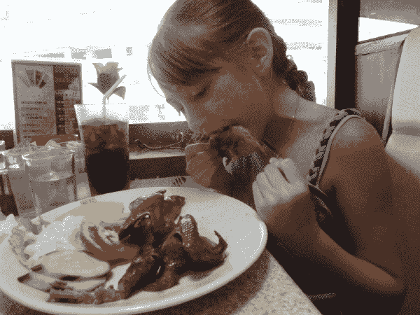
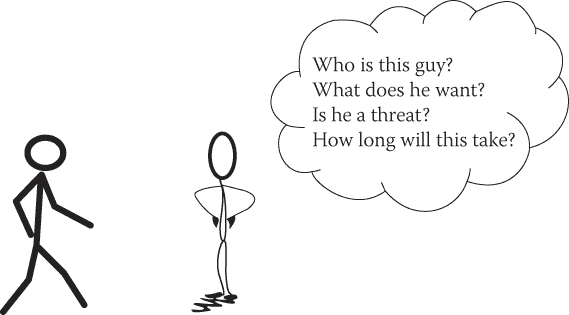
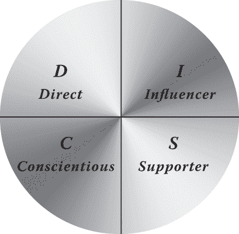
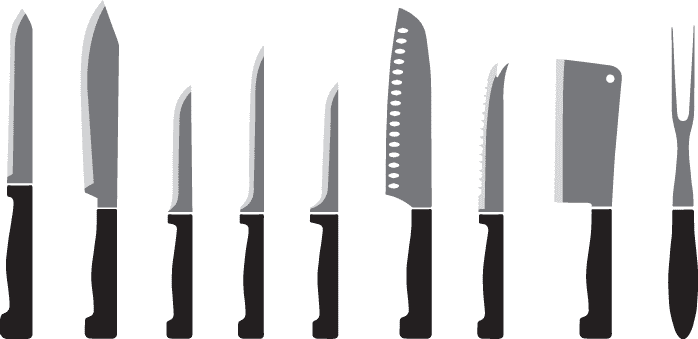
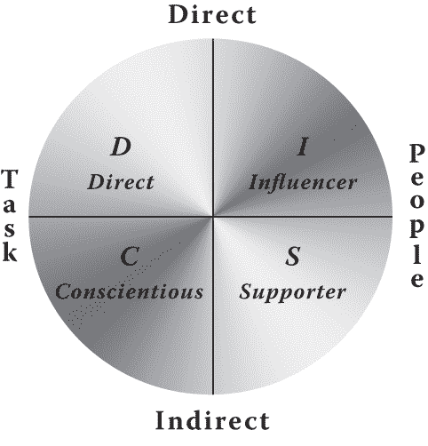
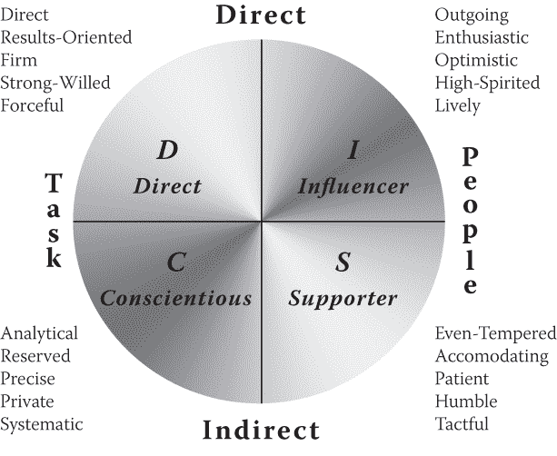

# 第三章：通过沟通对人进行剖析：（或者利用你的言语反击你）

> *为了有效地沟通，我们必须意识到我们每个人在感知世界的方式上都不同，并将这种理解作为我们与他人沟通的指导。*

> —托尼·罗宾斯

当我写《社交工程：人类操控的艺术》（Wiley，2010）时，我花了相当多的时间与 Lares Consulting 的所有者克里斯·尼克森（Chris Nickerson）讨论沟通建模。他非常有技巧，并且对这个主题有着深刻的理解。

他真的帮助我深入研究了这个主题，并理解了一些社交工程师使用沟通的方式。归根结底，我可以把沟通建模归结为以下几个关键点：

+   总会有一个来源。

+   有一个消息。

+   有一个通道。

+   有一个接收者。

如果你缺少其中之一，你就没有沟通。无论你是看香农-韦弗模型还是柏洛的发件人-消息-通道-接收者（SMCR）模型，它们都有相似的原理。

不管你熟悉哪一个，多年来我学到的一件事是，你使用的确切模型并不重要。我知道，我知道——你们中的一些人可能已经准备开始在街上焚烧这本书了，但我为什么这么说呢？

如果你运用这本书关于融洽、影响力、沟通剖析等原则，并且与你沟通的人接收到了消息，它*会*奏效。如果你按照你正在沟通的人希望被沟通的方式使用这些原则，沟通将会按照你想要的方式进行。

是的，我意识到这是一个大胆的说法，我并不是说这就像 1 + 1 等于 2 那样简单。

这可能有些复杂。我们经常阻碍自己。例如，我是一个非常直接的沟通者。因此，我不介意别人告诉我我做的事情不是最好的——关键在于你需要告诉我如何改进。我也倾向于用这种方式与其他人沟通，这在我与一个不喜欢直接说话的人沟通时会造成很多问题。

要随意切换你的沟通方式并不容易，尽管对某些人来说比其他人更容易。挑战出现在当我们感到舒适和放松时，因为我们的大脑触发了我们在目标中想要的所有相同的化学反应，而这些相同的反应会导致我们滑回我们的“舒适区”。

让我这样说明吧：你还记得自己年轻时（或者成年后）第一次尝试新事物的时候吗？比如尝试一种新的食物。自从我的孩子们还小的时候，我和妻子鼓励他们至少尝试一次东西。他们不必喜欢它或吃完它，但我们说过如果*你*不尝试它，你就不能评判它。

有一年，我们一家人去了香港旅行。我们进入了一家餐馆，我女儿在菜单上看到了一个引起她兴趣的东西——标着“整只鸽子”。她问我是否可以尝试。我的第一反应是说：“真的吗，那些讨厌的鸟？”但我很快就想起了我们鼓励孩子尝试新事物的做法。

我的女儿点了鸽子，然后她看着我说，“爸爸，你要尝试什么新东西？”我一直对海参很感兴趣，尽管我不确定我是否曾经想过吃它。听起来无害，对吧？

图 3-1 展示了我的女儿正在吃鸽子，但我没有一张图片可以展示我吃海参时发生的事情。它们基本上是生活在海洋中的巨型软体动物，所以请发挥你的想象力。

**图 3-1**是的，鸽子的头部包括在内。

我家在香港的饮食习惯的这个轶事与沟通模型有什么关系呢？好吧，当我尝到对我来说不舒服的东西（在我看来相当恶心）时，我开始寻找非常非常“美国”的东西。为什么呢？因为它是熟悉和舒适的。

沟通就像这样。当你第一次走出舒适区尝试新事物时，你可能会感到不舒服，想要退回你的舒适区，尤其是如果经历不是很惊人的话。然而，重要的是不要停留在舒适区。你尝试某事的次数越多，它成为你工具箱的可能性就越大。

为了帮助您作为社交工程师掌握沟通技巧，我在本章节中讨论了以下关键组成部分：

+   理解一个人在接近时在想些什么

+   了解 DISC

+   理解如何塑造你的 DISC 风格

+   利用 DISC 来使自己受益

在本书的其他章节中，某些技能是独立于同一章节中的其他技能的，但对于这一章节，所有技能都紧密联系在一起，并且是彼此重要的部分。让我们开始理解一个人在接近时在想些什么。##接近

当我教授我的为期五天的高级实用社交工程课程时，不可避免地有很多学生在一个领域遇到问题：接近。

与陌生人的首次关键互动将为接下来的互动设置基调。让我告诉你一个特别尴尬的失败故事来强调这一点。

有一天下课后，我和我好朋友罗宾·德里克以及一群学生在一起。我受到挑战要向他们展示“接近完全陌生人”有多“容易”。由于课堂上所有积极的反馈，因为整天教书带来的多巴胺流动，以及即将取得成功的肾上腺素冲动，我感到非常兴奋，准备利用我的绝妙技巧向他们展示成为社交工程师是多么容易。

大约有七八个人站在大厅里讨论我要如何接近，罗宾说他会为我挑选目标。我身高 6 英尺 3 英寸，罗宾挑选了一个比我矮大约 2 英尺的男人，他坐在我后面约 2 英尺的椅子上。他正坐在沙发上看着书，等待着某人。

现在，只是想象一下情景中的这一部分，并考虑对我来说什么是最好的方法。从后面过去？哎呀不！那会吓到人，并且引起恐惧。直接站在前面？也不对。他得往上看，拉伸脖子，这种不适会不利于谈话。你会怎么做？想一秒钟。

嗯，在罗宾告诉我我的目标之后，我毫不犹豫地转身说（用我的浓重纽约口音）：“嘿，你好吗？！我可以问你个问题吗？”

那个家伙被我突然转身和大声的打招呼吓了一跳，以至于他在椅子上往后倒了太远，失去了平衡，摔倒了。我赶紧跑到他身边，感到尴尬和担忧他是否受伤。不假思索地，我说：“让我帮你起来。”他比我预期的要轻很多，我把他和椅子都抬了起来，但是用了太多的力量，结果把他甩到了地板上。

他抬头喊道：“*走开，伙计！你到底怎么了？！*”（但他并没有用“走开”这个词，他声音中的愤怒是极端的。）

我转身离开他，说：“真的很抱歉，先生。”我低着头羞愧地走回大厅，而学生们却嘲笑着我。罗宾笑得肚子疼，我却感到很挫败。

类似这样的经历有好多年了，还有很多类似的故事，帮助我定义了一些真正改变了我对沟通看法的东西。你认为你即将沟通的人需要你什么才能感到舒适和安全？想想看。

想象一下你站在街上，看到有人明显向你走来并打算与你互动。你在想什么？我的经历帮助我确定了以下四件事：

+   你是谁？

+   你想要什么？

+   你是威胁吗？

+   这要多久？

当你接近某人时，如果你能在交流的前 5 到 10 秒内回答这四个关于那个人的问题，你就能改变你整个互动的方式。这些信息为本书的许多部分铺平了道路，所以请折叠或标记这页，因为我经常提到它。这四个因素也在其他章节讨论的以下主题中起作用：

+   你的前提(第四章，“成为你想成为的任何人”)

+   你口中的第一句话(第五章，“我知道如何让你喜欢我”)

+   身体语言和面部表情(第八章，“我可以看出你没有说的话”)

图 3-2 是一个图形，帮助你记住这四件事情。

**图 3-2** 这四个点对沟通至关重要。

我并不是说每个人每次有人接近他们时都在用这些确切的词语考虑这些问题，但它们是一个人拥有的关注、想法或担忧的一部分。如果你（作为沟通的发起者）能在最初的开场白中回答这四个问题，你就能让接收者放心并让他们放松下来。

历史上的骗子们知道这些事实，并使用各种技巧让他们的目标在开始真正目的之前放松下来。了解这一点不仅可以让你成为一个更好的社交工程师，而且还可以在有人试图利用这些技巧来对付*你*时保护你自己。

第一步是了解你的沟通风格。这就是我们介绍的一个非常强大但简单的沟通分析工具。## 进入 DISC

1893 年，威廉·莫尔顿·马斯顿出生。仅 22 岁，他就获得了哈佛的学士学位；三年后，他从哈佛法学院获得了法学学位；然后仅仅三年后，他从哈佛获得了心理学博士学位。他在美国大学担任了一份教职。

在他哈佛大学的学生时代，他正在研究说谎者和他们的血压之间的关系。1915 年，他建造了一台机器，可以测量一个人在被询问时血压的变化。

1917 年，马斯顿发表了他的研究成果，而从那时起——你猜对了——测谎仪应运而生。在 20 世纪 20 年代和 30 年代，他作为讲师和政府顾问非常活跃。他在当时很独特，因为他对异常心理学的兴趣不及对一个群体的行为感兴趣。

1928 年，他出版了一本名为《普通人的情感》的书，在 1931 年，他又出版了一本名为《整合心理学：一个单元反应研究》的书。正是从这些作品中，马斯顿得出了 DISC 系统。他正在寻找衡量行为和意识能量的方法。尽管他没有开发出我在本章讨论的测试，但他开发了这个模型，然后应用到了 1930 年他在环球影业的一些工作中。他们想要过渡从无声电影到带音频的电影，而马斯顿的工作对帮助创造更自然的手势和面部表情至关重要。

马斯顿博士的工作改变了我对社交工程的看法。 很多人都在尝试着如何快速心理分析某人，但马斯顿博士更简单的方法让我产生共鸣。 我不是心理学家，所以了解你的心理概况对我来说没什么用。 但我是一名社交工程师，所以了解你的沟通方式就像拥有一把开锁的钥匙。

### 什么是 DISC？

DISC 是一个缩写词。 有些人使用不同的描述词，但以下对我来说是最有意义的：

+   *D*：直接/支配

+   *I*：影响

+   *S*：支持者/稳定

+   *C*：认真/顺从

每个都是该样式所代表的描述。 通常，DISC 是以一种形状表示的。 我使用的是图 3-3 中显示的形状。

**图 3-3** 简单定义的 DISC

每种沟通风格都以一种独特的方式表示，这有助于我们预测行为。 使用 DISC，您会发现人们的行为有可预测的不同。

假设你正在处理一个*D*或直接沟通者。 一个直接的沟通者可能会很大声和喧闹；另一个可能会更安静和坚定；第三个可能正好介于两者之间。 尽管存在这些差异，但他们都直接且直截了当地沟通。 因此，如果你能快速了解人的特点，你就能够调整你的沟通方式以更好地影响这个人。

在我教授课程时，总会有一些关于这个问题的问题。 这是其中两个最常见的问题：

+   **问题：** 我怎么知道自己的首选样式？

+   **答案：** 这是一个很好的问题，但不容易回答，所以我会在下一节中详细讨论这个问题。

+   **问题：** 我可以是一个以上的样式吗？ 或者是一种混合？

+   **答案：** 是的，我们所有人都在超过一个样式上有优势，并且有可能在多个方面都很强大。 一些人最终会处于样式的交叉点，而且随着时间的推移可能会有所变化。

尽管这种评估方法非常准确，但请记住，任何像这样的评估并不总是 100%准确（至少在我看来是这样）。 它会根据一个人的回答方式和情境而变化。

我的看法是，这是作为专业社交工程师工具库中的另一个工具。 它帮助你更接近于真正运用所有专业技能。

在我甚至讨论你如何作为一名社交工程师使用 DISC 之前，我需要讨论一些可能是本书中最重要的部分之一的事情：首先了解你自己的沟通风格。 ### 认识自己是智慧的开始

那个标题不是一个奇怪的谜语；它是真正理解沟通分析如何工作的基础。在你能够成为与他人沟通的大师之前，首先了解自己至关重要。让我解释一下。

厨师在厨房里有很多不同的刀具。我有 4 英寸、8 英寸和 10 英寸的刀。每一把刀都有不同的形状和重量，用于不同的用途。图 3-4 展示了各种刀的样式。你认为哪种刀最适合切一颗卷心菜呢？

**图 3-4** 谨慎选择。

我会选择第四把离右边最远的刀，因为它具有切割厚蔬菜所需的重量，并且长度足够到底，这会使得切割对我的手臂和手腕更容易。我见过一些人选择第五或第六位置的刀来切卷心菜，猜猜会发生什么？切了几分钟，他们的手就酸了，手腕疼痛了——使用这些刀之一也存在着极大的受伤风险。通过了解哪种工具最适合工作，如何正确使用它，以及它的优点和缺点是什么，你可以选择适合工作的完美工具。

DISC 就像这幅图示。一些人格类型在某些任务中比其他人更有效。了解你的风格可以帮助你真正理解你的优点和缺点。它可以帮助你看清楚如何清晰地表达你的想法和意图。它也可以极大地增加你与沟通对象之间不产生反感的机会，而作为一名社交工程师，这是工作中非常重要的一部分。

我有几种方式帮助人们了解他们的主导沟通风格，但我主要使用的是一种 DISC 评估工具，它可以帮助一个人轻松地了解自己。但等等！在你跑去互联网浏览器搜索“免费 DISC 评估”之前，让我告诉你为什么那可能不是最好的主意。

我预览过的许多在线评估都使用了我认为有缺陷的方法。它们给出一句话，然后要求你回答一组预定义的关于那种情况的问题。例如：

+   想象一下你是克里斯的经理，他刚刚表现出了不服从命令的行为。你应该怎么做？

    1.  当场解雇他。

    1.  开几个玩笑，然后继续。

    1.  让他坐下来，详细解释他做错了什么。

    1.  尝试帮助他明白他的态度对团队不利。

DISC 评估中出现这种问题的困难在于，你可能没有任何背景知识可以回答它。如果你从未管理过其他人呢？如果你从未管理过一个不服从命令的人呢？有太多的变数使得这个问题不合适，并可能导致不准确的结果。

如果你要寻找一个可以使用的评估测试，我鼓励你寻找一个给你单词选择并要求你选择一个最像你和一个最不像你的，而不是基于情景的测试。这里有一个例子：

+   从单词列表中，选择一个*你*认为最能描述你的词和一个最不描述你的词。即使你对这些词没有真正强烈的感觉，根据你的个人评估，一个词会最能描述你，另一个词会最不描述你。

| **最** | **不** |
| --- | --- |
| 逻辑的 | 逻辑的 |
| 认真的 | 认真的 |
| 顺从的 | 顺从的 |
| 自由意志的 | 自由意志的 |

通过句子，你试图想象一个你从未经历过的情况，这对许多人来说可能非常困难。这就是为什么我喜欢推荐使用单词对的评估，这种评估类型可以更准确地进行科学工作。

我经常告诉我的学生，在思考他们在*工作*时的行为时回答每个问题，这通常与他们在家时的行为大不相同。因此，我得到了一个关于他们沟通风格的一致和诚实的描述。

不幸的是，我还没有想出如何向这本书的每位读者进行 DISC 评估测试，所以我必须有点创造性地帮助你理解这是多么强大。

看看图 3-5。

**图 3-5** 理解 DISC

在关注图中圆圈外的单词时（即，暂时忽略圆圈内的单词），回答关于自己的这两个问题：

1.  你在沟通风格上更直接还是更间接？*等等！*在你回答之前，请记住我不是在问你*别人*如何看待你—我要求你诚实地评估你是更直接还是更间接。你是否迅速直接地表达观点，还是花时间思考？你是否对直接性有问题，还是喜欢它？现在，根据你的答案，将“直接”或“间接”写下作为你的沟通风格。

1.  你更注重任务还是人际关系？当你在工作中参与任务时，你更关心完成任务还是帮助你完成任务的人？根据你对这个问题的回答，写下“任务”或“人员”。

如果我参加这个测试，我会写下“直接”和“任务”。在图 3-5 中，直接和任务之间的楔形标记为*D*代表*直接*。看看这是多么快速？

现在全面评估自己。你最终得出了什么结论？现在看看图 3-6 以获取更多细节。

**图 3-6** 详细的 DISC

以我自己为例，我把自己放在了*D*部分，看到我是直接的，结果导向的，坚定的，有毅力的，和有力的。这几乎完美地描述了我。（准确到近乎令人恐慌。）但这意味着什么呢？

我倾向于一种直接的*沟通风格*。记住，这不是心理分析——这是一种沟通分析。理解这一点意味着你可以更清楚地看到你可能需要改变沟通方法以更好地影响目标的地方。

现在你已经回答了我的两个测试问题，应该对自己有一个相当准确的评估了。但是当涉及到对其他人进行评估时，这意味着什么？你又该如何利用这些信息呢？

#### *利用 DISC 为自己谋利*

DISC 画像法如此有效，以至于我的团队已经在社交媒体、语音通话，甚至是照片上使用它，具有惊人的准确性。

罗宾·德里克与我分享了一个他仅仅使用一个家伙的照片构建的档案的故事。让我为你描绘一下现场。

照片显示了一条繁忙的城市街道，发生了一起车祸。这不是致命的——只是小剐蹭。街上挤满了人们跑向车辆，看看是否每个人都安全。目标站在事故的背后，不看——他的肩膀低垂，双手在口袋里。就是这样。

根据场景描述，你会把他放在 DISC 图上的哪个位置？

想一想我问过你的那些问题。根据我关于照片的描述，这个人更注重任务还是人际关系？你真的不能说“人际关系”，对吧？所以，答案似乎应该是“注重任务”。

他是直接的还是间接的？当其他人都在关注事故时，他在那个领域表现出了缺乏直接性。罗宾猜测是间接的。

这会把目标放在图中底部左侧的部分，或者说是*C*，在 图 3-6 中——这使他变得分析性、内敛、精确、谨慎和系统化。他正朝着某个地方前进，那项任务比任何其他事情都更重要。他的身体语言没有表现得外向或强势，这使他最准确地落在*C*区域内。

对罗宾来说，那个简要描述最终成为了一个很好的素材，如果你读过他的书 *不是关于“我”的全部：与任何人建立快速融洽关系的十大技巧*，你就可以看到最终的结果。 （提示：他成功了。）

通过专注于 DISC 的四个方面并将人放在正确的象限中，我已经能够在几分钟内培训我们班上的人学会进行这类评估。但是如果你不能完美地回答所有问题怎么办？#### *将 DISC 付诸实践*

想象一下，如果你无法判断我是以任务为导向还是以人际关系为导向，但你知道我是直接还是间接的呢？即使我也属于尽责或支持者类别，你仍然可以有效地与我沟通，因为我是一个直接的人。

如果你知道我属于任务类别而不是人物类别，同样适用。你可以将我视作 *D* 或 *C* 进行沟通，而不是作为 *S*。明白了吗？

这里有个小测试。看看我们的老朋友尼克·费尔诺的 Twitter 页面，链接为 `[`twitter.com/nickfx?lang=en`](https://twitter.com/nickfx?lang=en)`。

你会说尼克更关注任务还是关注人？仔细阅读他的推文，看看他的评论似乎更偏向哪一方。我阅读后觉得肯定是 *task*。那么他的风格是直接还是间接呢？嗯... 这个似乎有点难以确定。

看看他发布的媒体。我看到的是关于*事物*而不是人的非常直接的信息。这证实了我对尼克更偏向 *D* 的观点。

即使你不能百分之百地确定某人，你也可以接近。就尼克而言，你可以看到他绝对是以任务为重心而不是以人为重心。所以猜测他是 *D* 还是 *C* 是可以的。

行业内另一个秘密是看看这个人使用的一些描述词。回到 图 3-6，看看 *D* 和 *C* 旁边的描述词。哪些词描述了你在尼克的推文中看到的情况？他更加直接、有力和结果导向吗？还是更加精确、隐私和系统化？

当我阅读这些推文时，我确实更多地看到了 *D* 而不是 *C*。这意味着尼克是 100%的 *D* 沟通者吗？并不完全准确——有时人们的沟通方式取决于何时、如何以及与谁进行沟通。例如，当我培训时，我更倾向于作为 *I* 而不是 *D* 进行沟通。这对我、学生和所有其他人来说都更好。如果你想要影响我，你需要弄清楚我在你试图影响我的媒介中如何进行沟通。

迷惑了吗？不要过度思考。记住，这是你的箭之一，它可以帮助你在对话的前几分钟内更接近目标。

回到我们的例子：如果你已经将尼克定性为 *D*，那么你如何利用这一信息使自己受益？为了回答这个问题，你首先需要了解一些关于如何在每种风格中进行沟通的内容，无论你是否拥有权威地位。

##### *D* 通信者

如果你要使用权威的借口进行沟通：

+   直接而坦率。

+   设定明确的界限。

+   言简意赅。

+   回答 *what*。

如果你要使用更为低调的借口进行沟通：

+   强调 *what*，而不是 *how*。

+   提供选项，但强调结果。

+   注重逻辑。

+   同意事实和立场，而不仅仅是个人。##### *I* 通信者

如果你要使用权威的借口进行沟通：

+   友好和放松。

+   允许对方多说话。

+   帮助他们的想法转化为行动。

+   回答 *who*。

如果你要使用更为低调的借口进行沟通：

+   强调新颖和特殊之处。

+   提供交流的机会。

+   不要主导。

+   引用“专家”和推荐信  ##### *S* 传达者

如果你打算使用权威借口进行沟通：

+   要有系统性和客观性

+   要放松友好

+   使用一致性并回答 *为什么*

+   明确定义你所要求的内容

如果你��算使用更为低调的借口进行沟通：

+   要有耐心

+   提出 *如何* 问题

+   将焦点放在团队上  ##### *C* 传达者：

如果你打算使用权威借口进行沟通：

+   要详细

+   要可靠

+   提供认可

+   回答 *如何*

如果你打算使用更为低调的借口进行沟通：

+   使用数据和统计数据

+   提供逻辑和事实

+   强调可靠性

使用每种沟通风格的描述，让我们做一个小练习。假设米歇尔是 *I* 类型，我是 *D* 类型，我需要改变什么来影响米歇尔？（你也可以通过思考自己的风格并决定需要改变什么来影响米歇尔来进行这个练习。）

我想要简洁、客观和直截了当，但米歇尔更喜欢友好的互动交流，不过度主导。你看到挑战出现在哪里了吗？我需要确保我能制定一个借口，让我能够触及让米歇尔开心并打开影响之门的要点。要成为一个好的影响者，你必须更多地考虑在沟通时对方想要什么，而不是你更喜欢如何沟通。  #### *了解限制*

重要的是，无论你是面对面沟通、电话沟通、电子邮件沟通还是社交媒体沟通，这都适用。你只需要弄清楚目标的沟通风格、你的传递媒介以及你的沟通目标。从那里开始，其他事情似乎就变得容易了。

请不要被骗以为这是一根魔杖。有些因素可能会增加成功的可能性，也可能会减少成功的可能性。仅仅因为你对目标进行了分析，做出了正确的评估，并制定了一条能够触动他们沟通快乐区域的信息，并不意味着你总会取得 100%的成功。疾病、压力、工作量以及许多其他因素都可能影响某人有效沟通的能力。需要证明存在限制吗？想想你的孩子（或者你认识的人的孩子）。

我的女儿可以在一瞬间融化我的心。尽管她似乎有超人的能力让我做几乎任何事情，但当我处于压力之下或者有太多事情要处理时，我可能会对她不像平常那样耐心和友善。我的沟通方式会改变，这种情况发生在每个处理外部环境的人身上。

熟能生巧，所以如果你在最初几十次尝试中没有成功，不要放弃。当你做对了，你会惊讶于它的有效性。

这里还有另一个故事：当我的第一本书出版时，我被要求进行书签名。我没有预料到这一点，我对排队购买我的书并希望我签名的人们感到惊讶。

很多人对我的书和我说了很多好话——至少可以这么说，这有点让人不知所措。一个年轻人走上前来——对我说了整整一分钟关于我的书如何改变了他的生活。它帮助他度过了一些困难时期，甚至给了他一个职业道路。我被这件事深深打动，我清楚地记得自己当时在想，“这是真的还是戴夫又开的玩笑？为什么会有人对我关于*我的*书说这些话？”我微笑着对他说了声谢谢，然后递还了他签名的书。他明显感到失望，但是后面还有人在排队等着，所以我继续前进了。大约四五个人通过队伍，那个年轻人站在一边，他的身体语言清楚地表明他不高兴。

另一个年轻人进入队伍，把他的书递给我签名，并说：“书不错，但有大约四件事情我觉得真的很错，而且你引用了维基百科四次。作为作者，这简直糟透了。”我抬头看着他，给了他一个灿烂的微笑，然后请他坐在我旁边的桌子上，这样当队伍排完时，他就可以告诉我在书中哪里出了错。

当他绕过桌子坐到我旁边时，第一个年轻人跑回了桌子。现在，他显然很生气。他说了几句粗话，然后说：“我坐在这里告诉你你改变了我的生活，我是多么的你的粉丝，而你却把我像我根本不存在一样对待！！！但这家伙走上来告诉你你糟透了，你们却成了最好的朋友？？？！？！什么鬼……？”

那时，我真的没有回应。他的愤怒让我感到目瞪口呆，但我也理解。我道了歉，并邀请他过来坐下聊，但他太生气了。他很生气地走了出去。

直到后来我一遍又一遍地在脑海中回放整个场景，我才清楚地理解发生了什么。那个年轻人是一个*I*，他是在用*I*的方式和我交流——充满活力、外向、活泼、友好等等。他的*I*式沟通风格是如此强烈，以至于我——作为一个强大的*D*——不知道如何处理，所以我就关闭了，继续前进了。但是当第二个年轻人向我挑战并告诉我如何改进时，他的风格 resonated with 我，我想要更多。

我能做些什么来解决问题呢？或者更好的是，我应该怎么做才能彻底避免这个问题？

在对方的水平上进行沟通。当第一个年轻人带着花言巧语走上来时，我应该做以下事情：

+   询问他觉得书中哪一部分对他真正有帮助。

+   如果可以真诚而现实地夸奖他。

+   主动倾听，然后提出让他继续交谈，因为队伍排得很长。

这些事情会让他觉得被认可和特别，而不是愤怒和被抛弃。这里的道德是，即使当你搞砸了，也要花时间回放一遍，看看你能从错误中学到什么。## 摘要

DISC 是一个强大的工具，可以让你更接近建立融洽关系，并让你的目标信任你并愿意帮助你。学会快速读懂人，然后学会如何应用你的分析，并调整你的风格，这样你就能更容易地与你的目标沟通。

不要过于复杂化这个过程。记住，即使能够把一个人放在 DISC 圈的一半中，也会极大提高你的水平。重要的是要记住，DISC 不像街头魔术。你不会一夜之间（或者说也许永远不会）成为一个人类沟通建模的专家。

但那本来就不应该是你的目标。你的目标应该是保持对话关注于人，而不是你自己，并保持我在第一章提到的那两种化学物质（多巴胺和催产素）的流动。通过这样做，你将建立信任和融洽，这会让你作为社会工程师的工作更容易。

此时，你可能会说，“哇，这基本上是一种将沟通武器化的方法。”

你没有错。事实是，很多本来不是用作武器的东西经常被武器化。汽车就是一个很好的例子。

我有一辆我喜欢的车。我喜欢开它。这是我一直想要的车，现在我有了。当奥迪制造这辆车时，我不认为他们计划有这么多车祸是逃逸的。然而，根据 AAA 交通安全基金会 2016 年的报告，超过 11% 的所有与车有关的事故都是逃逸的。

这有什么意义呢？汽车可以是一台美丽的机器，开起来很有趣，可以带你到达各处。它也可以是一种致命的武器。这取决于人以及他们如何使用它。使用 DISC 也是一样的。

我在 Social-Engineer, LLC 的座右铭很简单：“让他们因为与你相遇而感觉更好。”

如果你记住这一点，你在这本书中学到的技能不仅会帮助你保护自己并帮助你抓住攻击者，而且还可以帮助你成为一名成功的社会工程专业人士。

当你分析一个人的沟通风格时，不要寻找利用他们或操纵他们的方法。要寻找改变你的风格的方法，这样你就能以他们的方式，以让他们开心的方式与他们沟通。

在尝试将本章学到的知识应用于社会工程之前，先在家人和朋友身上练习。在你已经证明了你在沟通模型上走在正确的道路上之后，开始在对话中提出你想要目标采取的小要求。试试水。

当你看到它起作用时，你可以开始进入下一个话题——一个将你的技能提升到更高水平的话题——假托。
