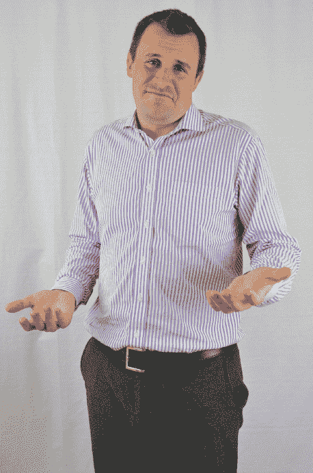

# 6

在影响下

> *我影响力的秘密一直是保持秘密。*

> — *萨尔瓦多·达利*

本章涵盖了影响力和操纵，但目前，我想重点关注影响力。你如何定义影响力？

我把它定义为“让别人*想要*做你想让他们做的事情。”这意味着这个人有做你想让他们做的事情的想法，或者至少他们会这样记得。因为这个人认为这个想法是他或她自己的，所以这是一个伟大的想法，这个人对它是承诺的。

历史上关于这个话题的最伟大的思想家之一是罗伯特·西尔迪尼博士。几十年来，他一直在研究、写作和完善影响力的艺术。在*社会工程师播客*的第 86 集中，我很荣幸地邀请到了鲍勃，他要求我这样称呼他。这是我所经历过的最引人入胜的对话之一，我从中学到了很多东西。

鲍勃写了一本书，我至今仍在使用，名为《影响力：说服的心理学》（William Morrow and Co., 1984）。在书中，他讨论了六个可以定义、可教授和可追踪的影响原则。作为我的实践的一部分，我将鲍勃的六个原则分解为八个原则。

在本章中，我首先定义了这八个原则，这些原则已经被像西尔迪尼博士这样的伟大思想家研究和研究过。我通过将每个原则的定义与社会工程联系起来来定义每个原则。

在我讨论每个原则之后，我谈论了框架，这与影响力紧密相关。简单来说，框架是你的信仰、观点和想法的基础。在本章后面，我将讨论如何改变你的目标的这些框架。我还讨论了操纵，这是影响力的更黑暗、更阴险的表兄弟，然后我总结了一切，给你一些建议，并送你上路去掌握这一了不起的才能。## 原则一：互惠

这个原则非常类似于建立和谐关系中的互惠互利。它基于人类希望回报那些对我们做好事或给我们享受的东西的人的方式。据 Cialdini 说，即使我们不想要给我们的物品，我们的大脑也会感到不安，直到我们觉得已经偿还了给予者。营销人员知道这一点，并且经常利用这个原则。

### 互惠原则的行动

想想上次你在杂货店拿到免费样品的时候。设置了样品展台的商店或营销公司知道，大多数人在收到产品的免费样品后更容易购买该产品。

人们在被赞美后更容易服从命令或提出请求。

我和妻子和女儿一起在伦敦处理一些工作。我们购买了高级经济舱机票，以相对舒适的方式回家。像听话的小旅行者一样，我们提前三个小时到达机场。

我推着我们的行李车，满载的行李摇摇欲坠。当我走到售票处时，我在地板上碰到了一个小坎，所有的行李包都哗啦一声摔到了地上！我只是开了一个大笑并说：“M5 上出了事故！”

因为我有美国口音，所有英国人都笑了，对一个美国人使用当地的路名开玩笑感到讽刺。一位在售票处的女士从电脑上抬起头，微笑着叫我们过去。我掏出我们的护照递给她，而我的妻子则开始告诉她她有多喜欢她的围巾。

现在，我的妻子并不是社交工程师。她只是一个天生令人惊叹、美丽而又美好的人，真心地喜爱人们。因此，她真心地夸奖这位女士，说了一些像“哇，你化的妆太完美了”和“我喜欢你的围巾和你的眼睛很搭”的话。

我看着这种互动，看着这位女士的非语言表达，她满脸自豪、快乐，还有大脑可以释放的所有好化学物质。我立即想到，“这是你的时候，克里斯——提出请求。”

当我递上我们的护照时，我靠近我的妻子，对那位女士说：“我美丽的妻子和我很好奇——升级到头等舱回家的飞行要多少钱？”

这不是玩笑：售票员开始疯狂地打字。她给了我们三张头等舱的机票，不用额外付费，并且在三小时的等待时间内可以享受完整的休息室服务。

想想看：几句以幽默开始、以请求结束的赞美。互惠原则赢了！

我对互惠的说明在图 6-1 中。

**图 6-1** 互惠原则的行动

互惠只有在遵循这条路径时才有效。你不能太早地插入命令或请求。只有在你制造出那些债务感之后才能提出请求，因为那些债务感会增加请求被接受的机会。 ### 作为社交工程师使用互惠原则

你脑海中可能有无数想法，想要运用互惠原则。让我给你一个快速的提示：你可以提出的请求水平取决于礼物对接收者的感知价值。

理解一下。记住，契尔迪尼说，无论接收者是否想要礼物，目标都会感到有义务回报。如果接收者重视这份礼物，他或她会更有冲动地回赠价值更大或相等的礼物。

我是一个小团体的黑客，也是威士忌爱好者。当我们聚会时，我们有时会交换威士忌瓶。我们每个人都为其他人带来一些东西，所以每个人都会带着与其他人不同的东西回家。通常，我们会设置一个主题，这样一个人不会带来价值一百美元的东西，而另一个人带来的东西要更值钱。这样可以控制回报的原则，没有人会感到更多或更少的被欠。

作为一名社会工程师，首先必须弄清目标人或公司重视的是什么。在此背景下，你需要准备好你的借口。当你向目标提供有价值的东西时，你成功的可能性更大。

例如，在我之前提到的任务 OpRentalCar 中，我很快发现目标真的很喜欢托尼的比萨。有了这个，我提出了免费食物以换取他的好主意。我没有说，“如果你给我*[顾客的]*地址，我就会给你披萨。”为什么我不这样做呢？

原因很简单：在这一点上，我们没有建立起任何关系。在我与目标建立关系之前要求像顾客的地址这样的东西会导致目标立即警觉，全力以赴，警戒状态启动。

通过提供免费食物的机会，然后插入我真正想要的东西，我让目标“提出”了我所需要的确切想法。

这是另一种情况，我在其中使用了这个原则：我必须矛头鱼叉一个 CEO。在开源情报收集阶段，我发现他是一个热衷于跑马拉松的跑步爱好者。我知道这是因为他在跑马拉松时拍了大量自拍照。

我的“矛头鱼叉”来自一个市场公司，是关于 CEO 最近参加的马拉松的。消息大致是这样的：“在你参加的最近的儿童马拉松中，我们拍摄了一些照片，我们想用于营销和推广。我们需要你批准使用这些照片。请点击这里查看照片并批准。”如果我没记错的话，CEO 在收到消息后不到 60 分钟就点击了链接。

当你找到了目标真正重视的东西时，目标会毫不犹豫地满足你的请求。## 原则二：义务

义务听起来和回报很相似，但有一点小小的区别。而回报是由于礼物或有价值的东西而产生的行动所引起的感觉，义务是基于社会规范或预期行为的同样感觉。

### 行动中的义务

我向来自全球各地的学生们提出了以下问题：如果你在交通拥堵中，你让一位司机在你前面并入，他或她有什么义务？他或她*必须*做什么？

学生们回答说，汽车司机必须挥手、竖起一个手指或点头，但所有这些手势都意味着一件事：汽车司机必须（或有义务）对你刚刚表现出的善意表示一定程度的尊重和感激之情。如果他们不这样做呢？

当时我在华盛顿特区，开车去参加一个在美丽的四车道高速公路上的会议，交通被迫合并到一条车道上。交通堵塞得几乎停滞不前。我决心不让它击败我，所以我把音乐开得很大，一边一点点地向前挪动。其他车辆试图从入口匝道上高速公路上并入，而我的其他司机并不感到太无私。他们不让别人并入。所以，我放慢了速度，闪着灯，让下一个等待并入的家伙进来。

当他驶到我的前面时，我透过他的后窗往里看，期待着他的必要的点头、挥手或对后视镜表示感激的表情。当我没有得到时，我感到我的血液开始沸腾。我的脸变红了，我驾驶的方式更加咄咄逼人。我开始想，“难怪每个人都对你很差劲，不让你进来！”——好像其他司机有某种第六感，能让他们看到这个司机将会不感激。

我给这个面前傲慢的废物编了一个整个故事情节。当几英里后其他车道开放时，我决心加速超越无礼的司机，向他展示谁才是路上的主人。

我踩下油门，我那六个气缸的超级跑车立即加速。当我来到另一位驾驶员的车窗旁时，我生气地看着他，发现……他只有一只手臂。这一瞬间我从愤怒变成了谦卑。我迅速地微笑着挥手，同时点头致意。

我告诉你这个非常令人尴尬的故事的目的是什么？当我觉得那个人没有履行感谢我的义务时，我很生气。只有当我看到他没有挥手的合理理由时，我才意识到自己判断错误。

下次你和别人交谈时试试。当他们问你一个好问题时，不要回答或承认他们。只是盯着他们。如果他们问你是否没事，就说，“是的。”

我可以想象你们大多数人现在都在发出一种紧张的奇怪笑声或微笑，因为你们想象着这种情景。为什么？想想不回答问题的义务是尴尬的。

**义务**是非常强大的，尤其是当它们涉及到社会规范时。图 6-2 说明了义务的循环。

**图 6-2** 义务的实践

作为一名社会工程师，你希望利用这些预期的反应。任何时候你不这样做，都会降低建立融洽关系的机会，因为目标会想知道你为什么没有表现得“正常”。 ### 作为社会工程师使用义务

社会工程师们利用社交场合来制造对目标行为的义务感。例如，不为女士或搬运箱子等物件开门被认为是粗鲁的，而社会工程师们利用这种习惯来谋利。

为了我的一份工作，我装满了一箱重重的电话和计算机零件。我等待午饭高峰期，朝着我应该进入的地方的门走去。当我走近时，有位善良的人说，“噢，让我帮你开门。”

当我踏进大楼时，一个很严厉的同事说，“在你让他进去之前，你应该看到他的工牌！”

我说，“他百分百正确。嘿，这箱子很重——我的工牌在我的前口袋里，如果你想拿出来的话。”我向那个严厉的男人倾斜了一下。

他马上说，“我可不会把手伸进你的前口袋，伙计！”

“天哪！我的脑子哪去了？”我尴尬地说。“这太尴尬了。这个箱子大约有 45 磅重——你想拿着它，我拿我的工牌？”

“走吧，伙计——我没时间了！”那人喊道，然后走了出去。

开门是出于义务。我利用了那位严厉男子所说的政策……假装出于义务地提供我的“口袋”。那家伙觉得伸手进我口袋很尴尬，就放我过去了。

这种情景在不止一个场合对我奏效。直到有一天，我遇到了一个员工，她说，“在这个口袋里？”她伸手向我的右前口袋。

我说，“哦，也许是另一个口袋。你可以试试两个。”我希望这种尴尬的情况会让她退后，但没用。她伸手进我的口袋摸了摸，顺便说一句，这对*我*来说很尴尬！

在第一个口袋里除了我的钥匙外什么也没找到，那位女士说，“给我另一边。”在那个口袋里，她找到了我的钱包和一把刀。她看着我说，“可能在你的钱包里吗？”

我说，“我不确定——也许吧”，尽管我心里清楚我的钱包里没有。她打开钱包，正前方是我婴儿女儿的照片。那位女士看到照片，惊叹道，“天哪，她太可爱了！她叫什么名字？”

然后我们谈论了 15 分钟关于我的家庭，而她拿着我的钱包、刀子和钥匙，我则拿着这个该死的沉重的箱子。大约 15 分钟后，她把一切都放回了一个口袋里，说，“嗯，你最好向安保报告一下丢了工牌，免得惹麻烦。我在办公室见。”说完，她放我走了。我们建立了融洽和友谊，她现在有义务信任我。

义务是一个强大的原则，可以让成为社会工程师变得更容易。 ## 第三原则：让步

*牛津英语词典*如下定义“让步”一词：“在首次否认或抵制之后承认或同意某事是真实的。”

记住，影响的定义就是，如果一个人觉得自己拥有某个想法，那么这个人很可能认为这是一个好主意！让步将帮助目标认为采取您想要的行动是“他们的想法”。

### 让步在行动

在我居住的地区，防止虐待动物协会（ASPCA）非常擅长利用让步来让人们捐款。一次募捐电话可能会是这样的：

| **来电者：** | 早上好，哈达尼先生。我是凯丽，代表蒙特罗斯的动物爱好者打来的。您的狗好吗？ |
| --- | --- |
| **我：** | *[回答并意识到我正在谈论与我亲近的事物并微笑——哦不，该怎么停下来？]:* 她很好。年纪也渐渐大了。 |
| **来电者：** | 我很高兴她过得好。和一个同样热爱动物的朋友交流真是太好了。作为一个动物爱好者，我今天需要您的帮助。您知道，我们需要帮助来继续照顾我们地区的所有流浪动物。我们希望每只动物都能像您的狗一样有一个充满爱的家。您能帮助我们吗？ |
| **我：** | *[认为几乎无法阻止即将发生的灾难]:* 嗯，我确实喜欢动物。您需要什么帮助？ |
| **来电者：** | *[清晰而坚定地说话]:* 今天我们请求您提供资金帮助，很多人都捐了大约$250 来帮助我们。 |
| **我：** | *[感到得意，因为我将阻止她]:* $250？！哇，抱歉。我没有那么多。我很愿意帮忙，但我现在就做不到。 |
| **来电者：** | 哦，我明白了。现在是艰难的时期，那确实是一大笔钱。那您今天帮我们只是$25，怎么样？ |

在我意识到之前，我已经拿出了我的信用卡。让我们看看发生了什么。我同意，或者说让步了一些事情：

+   我是一个动物爱好者。

+   我想帮忙。

+   我想帮忙，但第一个价钱太高了。

当我被提供了一个替代方案时，我无法说不。如果来电者从$25 开始会发生什么？捐款可能会以更低的金额结束，但是通过从一个更高的价值开始，她几乎已经确保了更多的捐款。

执法调查员经常使用这种策略。如果他们能够让犯人承认甚至是一个细节，承认一个事实，那么这个人几乎不可能收回他或她所说的话。

看看这两种不同的选择。侦探可以问：“在抢劫时，你是在李的酒吧里 11 点吗？”罪犯可以轻松回答：“不，我从来没去过那里。”或者侦探可以问：“那么，在晚上 11 点，你在李的酒吧里看到了什么？”罪犯可能会回答：“嗯，我什么都没看到。那里很黑。”通过这种回答，询问者知道被询问的人在晚上 11 点确实在李的酒吧里。罪犯已经做出了让步！通过回答这个问题，那个人承认了，或者让步了，关于他是否在酒吧里的未被问及的问题。

图 6-3 展示了让步循环的插图。

**图 6-3** 让步的实际应用  ### 将让步作为社会工程师

在一次 vishing 任务中，我们被要求获取员工的全名、员工 ID 和社会安全号码（政府 ID）作为标志的一部分。我们制定了两个我认为很可靠的借口，然后开始呼叫目标。

通话内容大致如下：

| **我：** | 你好，我是 IT 的保罗。这是莎莉·戴维斯吗？ |
| --- | --- |
| **目标：** | 是的，是的。我能帮你什么忙，保罗？ |
| **我：** | 嗯，昨晚我们在为 RFID 凭证系统的固件刷新 BIOS，结果丢失了一些记录。你今天早上使用凭证有遇到任何问题吗？ |
| **目标：** | 不，它让我顺利进入了。 |
| **我：** | 那太好了。你很幸运。许多标记账户在进入和使用打印机时遇到了问题。我需要核实一些你账户上的细节，这样你就不会遇到任何问题。大约需要 30 秒，好吗？ |
| **目标：** | 当然，你需要什么？ |
| **我：** | 只需要你的全名、员工 ID 和社会安全号码。 |
| **目标：** | 呃，嗯 … 那是很敏感的信息。你叫什么名字？我需要查一下你的信息。 |

许多通话都遵循这种模式，但我们最终失败了。于是，我坐下来思考影响力原则，并对借口进行了一次修改。以下对话正是在目标告诉我她当天早上毫无问题地进入系统后进行的。

| **目标：** | 不，它让我顺利进入了。 |
| --- | --- |
| **我：** | 那太好了。你很幸运。许多标记账户在进入和使用打印机时遇到了问题。我需要核实一些你账户上的细节，这样你就不会遇到任何问题。大约需要 30 秒，好吗？ |
| **目标：** | 当然，你需要什么？ |
| **我：** | 首先，我想确保你的名字拼写正确。我有你的名字是 S-A-L-L-Y … |
| **目标：** | 不，这是个问题。没有 *E*，只有两个 L。 |
| **我：** | 天哪，我真高兴打给你了。你干脆把你的姓拼给我听，这样我就能说对了？ |

从那里开始，我会询问部门，确认电子邮件地址，到我们询问员工号码和社会安全号码的时候，我们打电话的人已经同意提供所有这些信息并继续了。这使得我们在那次接触中的成功率达到了 84%——仅仅通过做出那一个改变。

作为一名社会工程师，请记住，你不需要立即获取你需要的确切标志。获取一些次要的标志来帮助建立那些会导致人们妥协和顺从的感觉。  ## 原则四：稀缺性

“即将关闭的大甩卖！”

“史上最低价格！”

“地球上只剩下 10 个！”

为什么这些陈述对我们有效？如果某物变得稀缺，或者变得不那么可获得，它的价值就会增加。当有 20 个杯子时，杯子有多有价值？现在，最后一个杯子有多有价值？

### 稀缺性的实践

有一次在 DEF CON 比赛中，我有一个很好的主意，那就是买一个带有泡沫飞镖的步枪，并雇一个“狙击手”，他会在我们每年举办的社会工程夺旗竞赛中射击孩子们。参赛者必须解决一个谜题，然后把一个管子插入房间后面的一个箱子中，里面有一个狙击手在射击孩子。如果一个参赛者被击中，那个人就必须重新离开房间重新开始。

我买的枪是 Nerf CS6 Long Shot。在我购买它之后的几个月内，Nerf 宣布他们不再生产那个特定型号。他们准备用一个许多人认为是劣质的型号来替代它。

我并不需要两支步枪，所以我把其中一支放到 eBay 上以 99 美元的价格出售。第一天，竞标价达到了 199 美元，然后是 250 美元，然后是 299 美元，然后是 340 美元。最终卖出价为 410 美元。这是 410 美元的塑料步枪，射程 50 英尺的泡沫飞镖！（当然，它带有瞄准镜和四个弹夹，并且我们进行了一些修改，但仍然……）

我可以用 410 美元买一支真正的步枪，那么为什么一支塑料步枪会卖那么贵？稀缺性。因为那款步枪已经停产，现在是独一无二的，所以它变得非常有价值。

公司经常将产品、食品、药品、时间、珠宝和任何有价值的东西变得稀缺，以帮助增加消费者眼中的价值。图 6-4 展示了稀缺性的连续性。

**图 6-4** 稀缺性的实践  ### 利用稀缺性作为社会工程师

在一次工作中，我们的 OSINT 引导我们找到了 CEO 的社交媒体账号，他在那里发布了关于他三年来第一次真正度假的所有内容。他带着全家去巴哈马。他有打包的照片，去机场的照片，家人在飞机上的照片，还有一张写着“现在开始的两周天堂”的照片。

拥有这些知识以及他公司的 IT 支持公司的名称，我们从垃圾箱中获得了这些信息，我走进前门，接近了门卫简。我们的对话大致如下：

| **简:** | 我能帮你什么忙？ |
| --- | --- |
| **我:** | 你好。我是来自 XYZ 公司的保罗。杰夫让我来处理…*[看着我的剪贴板，翻阅文件，仿佛在搜索什么]*…他台式电脑运行缓慢的问题。他认为这是病毒。 |
| **简:** | *[看着她的日程表]*: 保罗，我这里没有杰夫的这个约会记录。很抱歉，但你必须再回来。 |
| **我:** | 看，简。我不知道该告诉你什么。杰夫打电话说他要去巴哈马两周，让这个问题在他回来之前解决，否则他会生气。我不得不调整其他四个约会才能赶到这里。接下来一个月我没有时间了。*[我停顿了一秒。]*我猜那没问题。我会给杰夫发封邮件，告诉他他忘了告诉你，现在他必须等四周才能解决这个问题。 |
| **我:** | *[不停顿地把我的剪贴板转向简]*: 在这里签字以确认我告诉你我们在接下来的四周内没有空缺，请。 |
| **简:** | *[停顿了一秒，看着我]*: 嗯，他一直在抱怨他的电脑运行缓慢。我不想告诉他你四周后才能回来。我们走吧。我会让你进来的。 |

就这样，我独自进入了 CEO 的办公室，没有监督，危及了建筑物中的一切。

通过让我的时间稀缺，我增加了立即预约的价值和重要性。稀缺性让简认为拒绝我可能会在未来造成更大的问题。这导致了对公司的完全妥协。

作为一名社会工程师，你可以在你的借口中应用时间、信息甚至是你正在赠送的东西的稀缺性。稀缺性会使你拥有的东西更有价值，并影响目标基于这种感知价值做出决定。## 原则五：权威

当拥有适当权威的人做出某些声明时，其他人会非常认真对待。以下是一些例子：

+   如果一个穿着白大褂或医生工作服的人说：“脱裤子”，你会听从。

+   如果父母、老师或典狱长说：“不要碰那个！”你会听从。

+   如果你的军士长或指挥官说：“趴下给我做 20 个俯卧撑！”你肯定会听从。

所有这些人都有一个共同点：他们对你有权威。但是什么表明了权威？当你走进一个房间时，你如何知道哪个人有权威？

看看图 6-5 和图 6-6 中的本。你认为在哪张照片中本展现出权威？为什么这样认为？

**图 6-5** 他的面部表情和肢体语言告诉你什么？

**图 6-6** 信心的表现有哪些？

你可能认为图 6-6 中的本显示出权威和自信。在两张照片中，本穿着相同的衣服，年龄相同，发型也相同。他在两张照片中都是同一个人。但在图 6-6 中，他站着，胸部挺直，手指交叉，下巴抬高，并且脸上完全没有恐惧的表情。所有这些都表明了一个自信的人，而自信使我们将这个人视为权威人士。事实上，当我问我的学生们什么表明了权威，他们列出了诸如自信、大声的声音、挺胸、抬头、整洁的衣服、直接的性格等特征。

权威对我们有什么影响？它让我们对该人说的话有一定的信任，而无需该人证明我们为什么应该听从他们。

### 实践中的权威

这个话题上最有影响力的研究之一是由斯坦利·米尔格拉姆博士完成的。在 1963 年，米尔格拉姆博士研究了纳粹战争罪审判期间听到的对暴行的辩解。在那些审判中，被用作辩护的理由是：“我只是听从命令。” 在题为“服从行为研究”的研究中 (`[www.birdvilleschools.net/cms/lib/TX01000797/Centricity/Domain/1013/AP%20Psychology/milgram.pdf](http://www.birdvilleschools.net/cms/lib/TX01000797/Centricity/Domain/1013/AP%20Psychology/milgram.pdf)`)，米尔格拉姆博士概述了他的发现。

米尔格拉姆博士想要探究的是，是否可以通过权威来强迫正常的、守法的公民采取可能导致他人伤害或死亡的行动。当然，进行这种类型的研究会有巨大的限制。你怎么能证明 X 个人会或不会听从一个权威人士告诉他们伤害另一个人？

普通公民自愿参加了米尔格拉姆博士的研究。为了让实验进行，他们被告知会有一个学习者和一个老师，并且分配是随机的，但事实上，所有志愿者都被指定为老师。

志愿者们看着学习者被绑在椅子上，并给他们接上电极。志愿者被告知，回答问题错误将导致学习者接受电击。学习者实际上从未受到真正的电击——他们只是假装受到了电击的伤害。

老师（志愿者）被展示了一个大箱子，上面有切换开关，电压从 15 伏特到 450 伏特，每次增加 15 伏特。志愿者甚至用仅有的 45 伏特就受到了电击，所以他们有证据证明这是真实的。

然后，一位穿着白色实验服（权威）的男子坐下来，监督老师提问。随着学习者答错问题，他们的惩罚电压越来越高。

如果老师因为听到学习者受苦而提出异议，实验室白大褂的男子将被指示只说两种话中的一种：

+   “实验必须继续，请继续。”

+   “没有永久性组织损伤。请继续前行。”

这听起来不是太令人信服，是吗？但这项研究显示，所有老师中有 65% 把学习者带到了 450 伏特！

让这个事实深入人心。这些老师都是普通的、工人阶级的人。他们并不是从某种充满虐待狂的人群中被挑选出来的。然而，根据米尔格拉姆博士的研究，40 名志愿者中有 26 名（65%）继续增加电压至 450 伏特，因为有权威的人告诉他们继续下去。

图 6-7 说明了权威的循环。

**图 6-7** 权威行动  ### 将权威用作社会工程师

我总是在我的社会工程学假设中直接使用权威有问题。主要原因是因为我经常没有正确的知识，这意味着我会陷入困境和被抓住。

然而，有时暗示的权威或权威的转移就足够了。在一次工作中，我发现了一个关于我们目标的财务委员会会议的在线邀请。恰好在我们工作范围内，所以我决定使用它。我们对所有受邀参加会议的成员进行了 OSINT，并找到了一个看起来像权威人物的女性。除了在社交媒体上看起来和声音像权威外，在流行的员工评分网站上，她在几条评论中被称为工作起来非常困难。

所以，我拿了我搭档的手机号码，把手机中的名字改成了这个女人的名字。（我们称她为莎莉·史密斯。）我告诉我的搭档：“当你看到我和安检人员争论时，给我发这样一条短信：‘你到底在哪儿？我们等了 15 分钟！现在就回来！’”

我抓起一堆文件夹和文件，试图直接走过安检。我知道我会被拦下来，因为我们已经确定了安全措施非常严格。情况是这样的：

+   安检人员干脆地说道：“对不起，先生！您要去哪儿？停下！”

+   我停下脚步，震惊地转身，说：“什么？你没看到我刚刚走过你去我的车了吗？我在 14 号的财务董事会上。我现在必须走了。”

+   “对不起先生，但我没看到你走过。请出示你的工作证”，保安请求道，声音中带着困惑。

+   我长出一口气，“好吧，但是当我到那里后不得不解释为什么我耽搁时，我会告诉 Sally 你的名字。” 我开始拍打口袋，然后说，“我不知道，我一定是忘了…” 然后我的短信通知响了起来。

+   我拿出手机给他看。短信屏幕顶部显示着“Sally Smith”这个名字，下面的消息写着：“你到底在哪里？我们已经等了 15 分钟！现在立刻回来！”

+   我说：“你想给她打电话告诉她为什么我被拦住，而整个会议室都在等这些文件，还是我告诉她拦住我的保安的名字？”

+   他看了短信，然后看着我说：“真的很抱歉，先生。我刚没看到你走过。请，如果我们可以忘掉这件事——请直接去开会吧。”

+   “如果你现在让我通过，我们可以忘掉这一切。” 说完，我就进入了堡垒，自由地漫步。

权威，即使不是直接来自我，也让那名保安采取了一个*不符合*他最佳利益的行动。权威是一个强大的推动因素！## 第六原则：一致性和承诺

我们都希望看起来是一致的，这意味着我们希望我们说的话和我们认为自己展示的内容之间达成一致。当我们承诺某事时，这一点尤为重要。你有没有见过一个小孩承诺一个你知道是错误的答案？（“不，我没有打破那盏灯！”）即使你提供了压倒性的证据证明他们的谎言，孩子仍然坚持与他们最初回答一致的答案。

为什么一致性对我们很重要？我们想要—也许我们甚至需要—看起来我们是一致的，因为一致性是自信和力量的标志。

### 一致性和承诺的实践

我住在一个相当偏远的地区，但最近在地下发现了大量的石油和天然气。现在他们在整个县进行水力压裂、抽水和挖掘。因此，我的路上有很多卡车���

我看到一辆装满吨位设备的卡车以每小时 50 或 60 英里的速度飞驰而过我的路。司机们粗心而危险。我的一些邻居已经开始在自家院子里放手绘标志，告诉司机减速、安全行驶，像他们的孩子住在这个社区一样。如果我的邻居来找我，要求在我的院子里放一个这样的大标志，挡住我妻子美丽的花朵或我漂亮的车子，我会拒绝，尽管我希望司机们减速。

1966 年，研究人员乔纳森·L·弗里德曼（Jonathan L. Freedman）和斯科特·C·弗雷泽（Scott C. Fraser）研究了一致性和承诺，并在 1966 年 9 月的《人格与社会心理学杂志》（[Journal of Personality and Social Psychology](http://www.researchgate.net/publication/17217362_Compliance_Without_Pressure_The_Foot-in-the-Door_Technique)）中撰写了相关内容，题为《无压力的顺从：门槛技术》。 他们挨家挨户地请求社区居民在自家院子里放置大型的、字迹潦草的安全警示牌。 这些标志会阻挡住部分房屋的视线。 研究人员发现，所有房主中有 83%拒绝在他们的院子里放置这个标志。

然后，弗里德曼和弗雷泽在下一个社区对他们的请求进行了一次改变，结果他们得到了 76%的顺从！ 你没听错，76%的人说“是”！ 那个改变是什么？ 更好的字体？ 漂亮的标志？ 付费放置标志？ 出租空间？

不，不，不，不。 改变是标志的大小。 在第二个社区，他们首先要求房主在他们的窗户上显示一个 3 英寸的贴纸，上面写着相同的信息。 然后几周后，他们回来请求房主在他们的院子里放置大型、难看的标志，有 76%的人同意了。

弗里德曼和弗雷泽称这种方法为“门槛技术”。 一旦他们在门槛（窗户上的小贴纸）里，房主就更愿意遵从未来的请求（大型标志）。

自从弗里德曼和弗雷泽之后，已经进行了许多研究，结果都是惊人的。 当一个人首先同意了一些较小的事情时，顺从度会急剧增加。

当你将顺从与一贯性原则结合在一起时，这是一种无法阻挡的力量。 基本上，我们想要表现出一致性。 我们的大脑不喜欢我们内部争论。 因此，即使我们知道自己错了，如果我们已经做出承诺并且想要保持一致，我们也会坚定不移地走下去。 这在图 6-8 中有所体现。

**图 6-8** 承诺与一贯性的实施  ### 利用承诺与一贯性作为社会工程师

我个人的一条准则是*绝不破坏前提，除非你真的必须这样做*。 在你破坏前提之前，必须有一个相当严重的情况。 这个规则是因为我即将讲述的故事而形成的。

我被分配了一项多阶段的工作，我必须获得进入一个被锁住的区域内一组垃圾箱的权限。 这些垃圾箱是公司丢弃他们的技术设备的地方。

要到达垃圾箱，我必须绕过安全措施，进入校园内的安全区域，顺利进入而不被拦住，并且在寻找有价值的东西时不受干扰。

我开始 OSINT 阶段的目标是找到垃圾箱公司。目标公司对于提供任何其他供应商的信息都有严格的政策，但我决定打电话给财务部门，看看我是否能通过谈话获得这些信息。通话内容大致如下：

| **公司代表：** | 嗨，我是贝丝。我能帮你什么忙？ |
| --- | --- |
| **我：** | 贝丝，我是专业垃圾箱的保罗。我们在这个地区相对较新，正在努力获得更多本地业务。我想知道我能否给你发一份快速报价？ |
| **公司代表：** | 嗨，保罗。我们接受新供应商的报价。只需给我们发送每单位成本，如果价格匹配，我们会要求更多信息。 |
| **我：** | 好的，太好了。我可以有你的电子邮件地址吗？我要发给你。 |
| **公司代表：** | 嗯，你不会把它发给我。你会发给 vendors@company.com。 |
| **我：** | 哦，我明白了。有没有办法我能抄送给你，这样我就知道它已经发出去了。有些人说我的报价从来没有出现过。我是这个行业的新手，不太懂技术。 |
| **公司代表：** | 哦，好的。是 beth.p@company.com。 |
| **我：** | 贝丝，你真是救星。听��，我能相信你一些私人事情吗？ |
| **公司代表：** | 嗯，当然，我想是的。 |
| **我：** | 我几乎什么都卖过，但垃圾箱是我第一次接触的，我觉得我做得不太好。我甚至不确定我们的价格是否具有竞争力。 |
| **公司代表：** | 对不起，保罗。那一定很难。你知道的……。把那份提案发过来，我会亲自确保它被查看。 |
| **我：** | 贝丝，你真是救星。我知道这样问有点不礼貌，但你能告诉我我要面对谁吗？*[看，到现在她已经承诺帮助我，给了我她的电子邮件地址并进行了对话。但这种关系足够让我提出这个要求吗？]* |
| **公司代表：** | 保罗，嗯……*[明显叹了口气并停顿]* 我很想帮忙，但我们有关于这个的政策。我不想惹麻烦，但我真的希望我能帮忙。 |
| **我：** | 不，我明白了，贝丝。只是我在这里真的很挣扎。这样怎么样——我只说一些名字，你听到正确的名字时就咳嗽一下：优越废物，优秀垃圾箱，废物管理 *[贝丝咳嗽]*。贝丝，希望你感觉好些了——听起来你要感冒了！ |
| **公司代表：** | *[笑着]* 谢谢，我感觉自己好像要感冒了。祝你好运。 |

有了这些信息，我成功找到了合适的服装，进入了安全区域，并找到了一些未被摧毁的硬盘和 USB 设备，如果落入错误的手中，可能会导致全面妥协。

利用目标对保持承诺的渴望，无论是身体上还是心理上，都会让社交工程师更容易满足他们所提出的所有请求。## 第七原则：喜欢

人们喜欢与他们相似的人。人们喜欢喜欢他们的人。尽管这两个陈述听起来有些绕口或绕脑，但理解每个陈述的深层含义很重要。

在第五章，“我知道如何让你喜欢我”中，我谈到了部落心态。现在想想这个陈述的背景，“人们喜欢与*自己相似的人*”。如果我们相似，在同一个部落里——感觉舒适和熟悉——我们会受欢迎、被接受和信任。

现在，针对第二个陈述，“人们喜欢喜欢他们的人”，让我提醒你一下扎克博士对催产素的研究，我在第一章“深入了解专业社交工程的*新*世界”中提到过。这完全适用于这里。如果你喜欢某人，或者让某人感觉到自己被喜欢或被信任，那个人不由自主地会喜欢你。

在你说，“那很容易”，之前，让我给你一些基本规则：

+   **喜欢必须是真实的**。你不能只是假装喜欢某人然后希望这管用。即使在开始的几分钟管用，最终也会显露出来或变得明显，喜欢并不是真实的，这可能会破坏信任和融洽关系，无法修复。

+   **不要认为恭维自动等同于喜欢**。恭维要起作用，必须是真诚的，并且在你建立的融洽关系的水平上。

+   非语言在其中起到了重要作用。当你的非语言是真实的（记得我在第五章中讨论的适应性非语言），那么别人就更容易信任你、感到舒适，因此喜欢你。

所有这些事情的主题是，你对喜欢的表达必须是真实的。我的好朋友罗宾·德里克通过将每个人视为他或她自己的真人秀来实现这一点。他不必喜欢你的生活，或者你做的事情，但他有足够的兴趣想要找出情节及其展开方式。这种想要发现的愿望是真实的，这种真实感传达出来，从而更容易建立信任和融洽关系，并更容易施加影响。

为了帮助鼓励这种感觉，你可以寻找赞美的方式，并模仿身体语言和/或口头线索（不是死板地复述），以帮助对方对你产生温暖而模糊的感觉。图 6-9 说明了喜欢原则的工作方式。

**图 6-9** 喜欢的实际应用

### 将喜欢作为社交工程师的手段

在一次行动中，我想要尾随进入。当我朝着正门走去时，我知道我没有太多时间想出一个扎实的计划。

一个人正在驶出他的全新起亚，迅速朝着门口走去。我加快了步伐，并确保当我询问另一个朝门口走去的人时，我在他附近能听到，“嘿，你知道那辆起亚是谁的吗？”我与之交谈的那位女士转过头来看着我，仿佛我疯了一样，但这并不重要。这足以让车主减速并转身。

他看着我说：“是我的。有问题吗？”

我伸出手说：“我是人力资源部的保罗。”我停顿了一会儿，祈祷他不是来自人力资源部，然后我继续说：“抱歉，我是新来的。我和妻子刚刚看了那辆车。我很好奇你对它有什么看法。”

这就是所需要的一切。他想向我展示每个功能并谈论它。在简短地预览了车之后，我说：“嘿，我要去开会了。我们边走边聊可以吗？”

“一点也不，保罗。”当我们开始走时，他告诉我关于保修、舒适度、油耗等等的信息。他热爱他的车。

当我们走近前台时，我说：“你显然做出了最好的选择。你怎么变得这么了解汽车？”这样一来，我不仅称赞了他的选择，还验证了他的知识。他刷卡进去，甚至没有思考就为我开了门。

为了观察的保安，我掏出钱包，轻轻地碰了一下门柱上的 RFID 接收器，然后自然地继续行走。这个家伙和我谈论了他的起亚 20 分钟，当他带我去人力资源部时。当我们到达那里时，他说：“好了，我们到了—你的办公室。我的分机号是 4328。如果你需要更多信息，随时告诉我。”

我说：“嗯，我觉得我应该让你帮我买车—你知道得太多了。我下午 3 点能给你打电话吗？”

“当然！没问题！那时再聊。”然后他转过了拐角。

我喜欢他喜欢的东西，我也因为他的知识而喜欢他。仅凭这两点，我就成功地通过了安全检查，进入了建筑物，并摆脱了所有的安全检查。

喜好是一个强大的原则，从字面上和比喻上说，它可以为您作为一名专业的社会工程师打开许多门。如果你像我一样，最难的部分是学会足够感兴趣，使你的“喜好”显得真诚。## 原则八：社会证明

1969 年，罗伯特·奥康纳博士进行了一项名为“通过象征模拟改变社会性孤立”的研究（*应用行为分析杂志*，1969 年，[www.ncbi.nlm.nih.gov/pmc/articles/PMC1311030](http://www.ncbi.nlm.nih.gov/pmc/articles/PMC1311030)）。这项研究的对象是在学校中有社交焦虑并且自闭的年幼儿童。

将孩子们分成了两组。第一组观看了一个不包含社交互动水平的视频。第二组观看了一个大约 23 分钟的视频，其中孩子们非常社交，并取得了积极的结果。

第一组的孩子们没有改变他们的行为，而第二组的孩子们在他们的社交互动中有显着的改善。不仅如此，即使六周后医生回来观察孩子们时，那些属于第二组的孩子们现在在社交互动中处于领先地位。

医生能够通过使用所谓的*社会证明*来修改潜在的终身社交隔离的路径。视频向第二组的孩子们证明了更加社交化是好的、安全的，甚至是有益的。

### 社会证明的作用

有一个很棒的电视节目叫做*Candid Camera*，他们在节目中做了一个有趣的恶作剧，展示了社会证明对不同类型的人的强大影响。他们会找来三四个人参与恶作剧，装作彼此不认识，进入电梯，然后转向后面。那个不知情的人最终会转身顺应群体。有一次，他们甚至让一个年轻人转了一整圈并摘下了他的帽子，都是用社会证明。

我们每个人都想成为其他人一样。你们中的一些人可能会争辩说你们是独一无二的，不真正属于任何一个群体，但这本身就是一个群体。

当我们迷失、困惑或不确定时，我们通常会看看其他人是如何行动的以获取线索（社会证明）来指导我们应该做什么。

图 6-10 说明了社会证明的循环。

**图 6-10** 社会证明的作用  ### 作为社会工程师使用社会证明

许多时候，人们不想成为首先采取行动的人。然而，我发现使用社会证明可以让人们放心地做出他们不舒服的决定。

有一次，我需要进入建筑物的一个安全区域，所以我穿上了我能在短时间内准备的最好的电话技术员装备。我没有直接进入我的目标办公室，而是先去了隔壁的建筑物。我进去并介绍自己是保罗，来自 XYZ 电话公司的当地电话技术员。我说我将为该地区提供服务，并留下了一张假的名片。

我在目标两侧的企业都这样做了。然后我进入了目标办公室。我走到前台，说：“我叫保罗。我们的电话线出现波动，导致该地区电话和互联网中断。我需要检查街区内的每家公司，以确保系统设置没有问题。”前台的女士开始打断我，但我坚持下去，看着我的剪贴板说：“我和隔壁的贝丝聊过，但他们的线路测试正常。我还在这边的另一家邻居那里进行了测试，但弗雷德很高兴不是他们的问题。所以，我想既然我在这里，我应该测试一下你们的系统，确保问题不在这里。”

现在，我决定不看她，而是在我的剪贴板订单表上假装记一些其他两家公司的虚构笔记。女士略有犹豫地说：“哦，我打赌你让弗雷德开心了。他总是抱怨服务。”

说完，我已经走过前台，被引导到了服务器室。

我使用社会证据进行调查、钓鱼邮件、电话诈骗等。在一次电话诈骗活动中，我每次开始对话都会简短介绍后说：“我今天只剩下三通电话，然后就结束了。幸运的是，今天大多数人都很愉快。”然后我会立即提出我的问题。往往情况是这样，施加轻微的社会压力起作用了——部分是因为人们感到高兴不是第一个给我所有信息的人。社会证据是我使用过的最强大的影响因素之一。  ## 影响 vs. 操纵

当我讨论影响原则时，通常会出现一个问题：“你做的一些事听起来相当操纵，那么影响和操纵不是一回事吗？”事实上，影响和操纵是相似的，有时会被混淆。

让我非常清楚：我在这里分享的是我对这个话题的观点。我绝不是说这是*唯一*的观点。事实上，当我们在播客中邀请了 Cialdini 博士时，我了解到他对这个话题的看法与我的截然不同。

我将影响定义为“让别人想要做你想让他们做的事情”。我将操纵定义为“让别人做你想让他们做的事情”。区别在于操纵通常不包括关心目标的感受。而影响往往在主题上是积极的，操纵并不局限于此。

### 行动中的操纵

最好的方式来说明影响与操纵的概念是告诉你一个对我来说真正尴尬的故事，但它也是至关重要的，因为它改变了我的业务。

当我开始专注于成为一名专业的社交工程师时，我陷入了这样的思维中，认为我必须总是取得胜利。只有百分之百的胜利才算是成功，这是我所珍视的想法。这个想法激励我并不真正关心客户或他们的员工的感受，只要我“赢了”就可以。

在一份工作中，我*没有*获胜。我失败了。目标不会点击任何钓鱼邮件。他们经常在电话中拒绝我。无论我如何标记，我的 USB 钥匙都没有被插入。两次尝试尾随和使用重箱子计谋的失败让我感到沮丧。

我感到沮丧，我没有意识到现在是向客户展示他们有多棒的好时机。相反，我被驱使走向黑暗的一面。公司有一个室外的开放式午餐区。我曾试图通过那些门进入，但无法越过那里的安全保卫，但我可以自由进入午餐区。

这个前提是这样的：我是弗兰克·T.，一个新的人力资源项目的负责人，负责收集医疗保健项目的信息。我的秘书玛莎是一个单身母亲，神经紧张。我站在一桌员工的听力范围内，当玛莎低着头走过来，递给我一叠空白纸时。我看着它们，用非常愤怒的语气说：“这是什么破玩意儿，你这个一文不值的……”我长长地叹了口气，说：“看，如果一项简单的任务对你来说太难处理了，也许是时候你找一份新工作来养活自己和孩子了！我受够了！”

然后我狠狠地把纸砰地扔在桌子上，走开了，把纸留在后面。玛莎坐下开始哭泣。

我看见一个家伙直奔我而来，但当他看见玛莎哭泣时，他转向她说：“你还好吗？那是怎么回事？”

她抬起头来，又害怕又紧张地回答：“哦，对不起。我不是故意在午餐时打扰你的。你知道弗兰克是怎样的人。他很紧张。”

“弗兰克是谁？没有人有权这样对你说话。这太荒谬了。”他坐在她旁边。

“不，你不明白。他在家里有问题，他必须在今天结束之前填写这些表格，并且我忘记了。我本以为我会在午餐时做这个，但他刚刚对我发火了。我要被开除了。”

“他不应该这样对你说话……这是……”

她打断了，现在为她的施虐者辩护，“不，没事的。我应该上周就完成这件事了。这是我的错。他真的是个好人，他冒险相信了我。”

“公平与否，把那些纸给我！”那个男人，她的救星，站起来走到每一张桌子旁，说：“我们有直到今天结束之前完成这个任务的时间，但我希望在你们开始吃午餐之前完成。完成后，将它交给这位亲切的女士。”

他指着玛莎，现在笑着感谢他挽救了她的工作并且如此善良。

当经理命令午餐室里的所有人遵守规定时，我们收集了数十份表格，上面有全名、出生日期、网络 ID、社会安全号码、家庭地址、电子邮件地址、电话号码和其他个人身份信息。

当然，我赢了—但代价是什么？当人们发现这是一个骗局时，你认为会有教训吗？教训会是什么？不要表现得像一个体面的人？不要有同情心？这不是一个好的教训。

因为我使用了操纵，我在那家公司永远被称为“虐待秘书的家伙”。我可以告诉你，不仅没有学到任何教训，直到今天，我也没有从那家公司得到任何更多的工作。### 操纵原则

尽管它们是负面的，操纵确实有以下原则：

+   增加易感性

+   环境控制

+   强制重新评估

+   剥夺权力

+   惩罚

+   恐吓

单单名字就应该告诉你它们为什么如此负面，但有一项研究我认为概括了我为什么不喜欢使用这些原则。

1967 年，宾夕法尼亚大学的马丁·塞利格曼博士和史蒂文·F·迈尔博士进行了一项研究，以确定其中一些原则是如何起作用的。他们使用狗作为实验对象，看看它们如何接受无法控制的情况。塞利格曼博士和迈尔博士在一篇名为“学会无助”的文章中写道（*实验心理学杂志*，1967 年 5 月，`[`homepages.gac.edu/~jwotton2/PSY225/seligman.pdf`](http://homepages.gac.edu/~jwotton2/PSY225/seligman.pdf)`）。

本质上，他们训练了处于不同阶段的狗——要么单独在枷锁中，要么成群结队——然后用电击狗。在某些情况下，狗必须找出有一个面板，按下后可以停止疼痛。但在其他情况下，杠杆无法停止电击的疼痛，那些狗学会了他们无法做任何事情来停止惩罚——所以他们接受了这种痛苦作为生活的一部分，蜷缩在那里痛苦地呜咽而不试图逃跑。

尽管这项研究令人不安，但它对理解操纵原则至关重要。很多时候，受试者会接受他们害怕、受伤或知道是不好的事情，仅仅是因为他们看不到其他选择。恐惧和愤怒会覆盖大脑理性思考的能力，只留下情绪来做决定。作为一名专业的社会工程师，剥夺了用逻辑思考的选择，大多数情况下也剥夺了教育的机会。当目标发现他们的恐惧被用作测试时，会引发许多负面情绪，让人不愿意从你那里学习。

#### *作为社会工程师选择影响力或操纵*

如果你想成为一名专业的社会工程师，在大多数情况下，你会希望确保客户有机会从你的努力中学习。这意味着使用影响力而不是操纵。

然而，在你决定操纵永远不可用的时候，让我告诉你一些我使用操纵并且没有问题的情况。

在 Innocent Lives Foundation 中，我们有时发现需要使用操纵来实现我们的目标。当我们追踪儿童色情者或犯下可怕罪行的人时，我们使用任何有效的方法。

在进行国家攻击时，我也会使用操纵。很多时候，当我的特工团队保护国家资产或基础设施时，我们会同时运用影响力和操纵，以确保所有方面都得到测试。

我使用操纵的另一种情况是当客户要求时。通常情况下，这是在利害关系非常高的情况下，比如客户是一个大型金融机构、国家机构或基础设施支持组织，需要尽可能深入地测试。有时客户会说他们需要我的团队使用操纵而不是影响力来真正测试协议。通常，在进行了多次测试之后，我们需要将其提升到下一个级别时，才会提出这个要求。在进行这些额外的测试时，我们仍然确保有一个学习教训。

例如，我们的一个客户需要我们测试他们非常坚固和先进的电话支持代表。该公司保护价值数百万美元的数据，客户希望确保电话支持代表能够抵御来自现实世界攻击者的攻击。

在几次使用影响力测试后，我们决定升级到一个涉及我团队中两名女性特工的借口。

特工 1 打电话给部门，并请求一些信息来完成工资单，使用了一个非常可信的借口，情况如下：

| **SE agent 1:** | 你好，我是来自 XYZ 公司的莎拉。我的工资人员刚刚被解雇，我必须在今天做工资。我下周将要生我的第一个孩子，我需要在周末离开之前完成这件事。 |
| --- | --- |
| **Phone rep:** | 恭喜！多么令人兴奋！别担心，我可以帮你。我只需要验证您的身份，然后我可以重置账户让您进入。 |
| **SE agent 1:** | 太好了，谢谢。哎呀！ |
| **Phone rep:** | 莎拉，你还好吗？ |
| **SE agent 1:** | 我不知道。我只是感到一阵奇怪的疼痛。可能只是压力而已。好的，让我们开始吧，这样我就可以离开了。你需要什么？ |
| **Phone rep:** | 好的，我需要您的账号和身份验证 PIN 码。 |
| **SE agent 1:** | 先生，就像我说的，我刚刚解雇了我的工资人员，所以我没有那个 PIN 码。她重置了它，我需要重新进入这个账户。 |
| **Phone rep:** | 哦，莎拉，我很抱歉，但是我……” |
| **SE agent 1:** | *[开始分娩并掉落电话]* 哦，我的天啊，我的天啊，羊水破了！ |
| **电话代表：** | 你还好吗？女士？你还好吗？ |
| **社会工程师 1：** | *[像对同事大声喊道]:* 你！过来拿起这个电话，然后*[好像对另一个同事说]*你打 911！ |
| **社会工程师 2：** | 你好，你是谁？ |
| **电话代表：** | 天啊。嗨，我是 QRS 的史蒂夫。我刚刚在协助莎拉处理工资账户，但我觉得她需要帮助。你应该去。 |
| **社会工程师 1：** | *[在背景大声喊道]:* 如果你挂断电话，我会解雇你。获取工资信息，否则下周没人能拿到工资！ |
| **社会工程师 2：** | *[非常紧张的语气]:* 哦，史蒂夫，我只是需要进入账户，这样莎拉就会让我带她去医院。 |

令人惊讶的是，史蒂夫刚刚提供了账户号码和我们需要的所有信息。

富有创造力？是的。操纵？绝对！但公司要求我们确定其代表是否能够抵御来自恶意黑客的真实世界攻击，我们有机会证明什么会起作用，什么不会起作用。

我没有提供一个详尽的列表，说明你可能被要求使用操纵的情况，但我已经讨论了一些你需要考虑的事情，如果你将成为或目前是一名专业社会工程师。你会使用操纵吗？如果是，你将在什么时候使用它？你会使用多少？

所有影响和操纵的原则都适用于大多数非精神病的人类，我们中没有人可以在不变得黑暗的情况下花费太多时间在黑暗中。踩进泥巴中不沾上一点污垢是不可能的。我发现在我们将操纵作为一种策略后，与 Innocent Lives Foundation 的团队交谈很有用，以确保他们感觉良好，没有受到太大伤害。该基金会有一名心理学家在职，以确保我们的人员拥有一个安全健康的环境，可以卸���任何负面情绪的心理压力。  ## 摘要

如果你从这一章中只带走一件重要的事情，那就是：你是人类（就像我是人类一样）。影响力是有效的——简单明了。它对你的目标起作用，也对你自己起作用。无论你多么努力，都无法阻止它。

影响，当正确使用时，是有益的，并且可以改变某人的行为方式和与你的互动方式。当你掌握了将影响力与建立关系的技巧相结合的能力时，你真正变得无懈可击。

人们*会*想告诉你关于他们自己的一切。他们*会*想信任你。他们*会*想成为你的朋友并帮助你。这是强大的，如果你不小心，它可能会让你得意忘形，你可能会滥用这种权力。

通过不断提醒自己选择这条职业道路的原因来保持自己的状态。我经常告诉自己以下几点：

+   我正在做这件事是为了确保我的客户保持他们的安全。

+   我正在做这件事是因为我擅长这个。

+   我正在做这件事是为了帮助人们了解这种危险的途径。

+   我这样做是为了供养我的家人和雇佣的人。

这些责任在成为*专业*社会工程师中扮演着重要的角色。以这种方式思考*影响*了我的决定，使我的客户、我的员工和我自己受益。

我在本章中讨论的影响和操纵原则每天都被营销人员、广告商、销售人员、寻求捐款或招募人员的组织以及各种人使用。我们为什么不利用这些原则来帮助我们的客户了解这些原则在一个技艺娴熟的骗子或社会工程师手中是多么危险呢？

花点时间反复阅读本章，并挑选一个原则来研究。尝试以一种良性的方式在办公室或与家人交流。当你掌握了它的使用方法，它将成为你沟通的武器库中的一部分——箭袋中的另一支箭，使你成为更优秀的社会工程师。

我还有两个箭要给你作为你的箭袋。下一章将把我在前两章中谈到的技巧提升到一个新的高度：框架构建和引诱。
