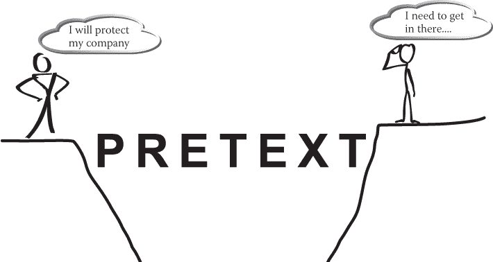

# 7

创建您的艺术品

> *艺术和科学在方法中有相交之处。*

> ——厄尔·爱德华·乔治·勋爵·布尔沃·利顿

我决定暂时回到我第一本书《社交工程：人类黑客的艺术》（Wiley，2011）的艺术主题，明确阐述为什么本章如此重要。当您建立通信计划、构建借口、掌握关系和影响技巧，并准备就绪后，您需要能够将所有这些付诸实践。这就是艺术与框架和引导的科学相遇之处。

正如 18 世纪的英国政治家和小说家厄尔·爱德华·乔治·布尔沃·利顿所说，*方法*是艺术与科学相遇甚至相互交叉的地方。本章讨论了作为一名专业社交工程师，您如何巧妙地学习如何使用引导和框架，以科学准确的方式。

当我第一次在厨房工作时，主厨（我的老板）递给我一袋芹菜，说：“把这袋切成丝。”作为一名新手，我完全不知道他是什么意思。对我来说，几秒钟仿佛是一辈子那么长，他说：“你完全不知道我在说什么，对吗？”

我点了一下头，60 秒内，厨师就打开了袋子，一堆看起来像图 7-1 的芹菜。

**图 7-1** 完美的芹菜丝

“啊，切成细条片”，我说得好像我是世界上最聪明的人一样。我开始慢慢地处理我的第一根芹菜——厨师观察着。他说：“干得好；现在我需要两袋那样的。”

感到自信，我试图模仿他的速度。为了那些胃口不太好的人着想，我不会张贴芹菜和手指混在一起的照片。

您可能想知道这个故事与本章主题有什么联系。烹饪是一门艺术，但使用工具的方式背后有着科学——你如何挥舞刀具可以决定你作为厨师的能力。了解如何让食物变得美味的艺术对厨师来说非常重要，同样重要的是了解如何准备食物（通常不包括手指部分）以增强菜肴的口感。将食物准备的艺术与将所有元素组合在一起的科学相结合，创造出一个完美平衡的菜肴。

本章旨在向您展示如何将框架和引导的艺术与科学相结合，将前六章的技能提升到熟练水平。如果您能正确应用本章学到的内容，您应该至少能够达到一个社交工程米其林星级。  ## 框架的动态规则

想象一下你的房子或公寓以及它的形状。当你从外面看它的时候，有一个房间比其他房间突出吗？你有一个奇怪形状的阳光房，还是只是一个正方形？它的外观——墙在哪里，窗户放在哪里，门的位置等等——是由房子的结构确定的。换句话说，你对房子看到和理解的一切都是基于框架如何构建的。

在沟通中，所谓的“框架”并没有那么不同。我认为，框架，或者说某人如何看待和对待某种情况，很大程度上取决于这个人在一生中所经历或理解的东西。而这些框架，或者观点，可以通过生活经历而改变。

当我 16 岁时，冲浪和滑板是我生活的中心。在我看来，没有什么值得活着。一个关于框架如何如此动态的例子来自我生活中的这段时间。

有一天，我们一群人把冲浪板放到两辆车的架子上，堆了进去，从佛罗里达州西海岸到东海岸开车，在半夜开车过去。我们听说有一场风暴要来了，想要去享受一些伟大的海浪。

我们大约在早上 5 点到达。太阳还要一个半小时才会升起。我们卸下了所有的冲浪板，打好了蜡。虽然太阳还需要大约 30 分钟才能升起到足够明亮，但我们又急又年轻，所以我们决定在天还没亮的时候划出去，以便第一时间冲击第一波。我们能听到海浪拍打着岸边，我们也能看到远处一些非常大的波组的轮廓。

我们六个人一个接一个地跑向海浪，划向了海面。我们坐在水里，上下浮动，等待着太阳升起。每隔几分钟，我们都能听到像是一声巨大的枪声。

我们并没有把这当回事，因为声音听起来相当遥远，也没有听起来很不祥。我开始闻到一股刺鼻的气味，所以我看了一下我的一个朋友，说：“嘿，这是红潮吗？”

红潮是一年中有一次很严重的藻类大量繁殖，会杀死鱼类和其他一切东西——而且气味相当糟糕。但我的朋友说：“不，还没有，不确定那是什么……”

只过了几分钟，太阳已经明显升过地平线，我们看到了美丽的剥落波组，准备好了可以冲浪了。我们还看到了一群渔民在离我们很近的码头上——在为捕鲨鱼而引诱鲨鱼！我们听到的枪声是渔民在把鲨鱼拉上岸时开枪的声音。所以，我和我的朋友们坐在鱼饵池中。我们几乎带着一种愚蠢的幽默感笑着，笑着笑着就忘记了这是多么危险。

我低头看到了我的冲浪板下面有一个巨大的阴影。我从来都不是一个好的尺度估量者，所以我不能告诉你它有多长，但我可以说它比我的冲浪板还大。

我和朋友们笑得更多了，我们划出了鲨鱼的鱼饵，捕捉到了一些很棒的浪。16 岁时，我的参照框架完全是关于冲浪的，鲨鱼的危险对我来说并不重要。

当我现在回想起那个情况，几乎 30 年后，我的参照框架肯定已经改变了。即使我离水域、鱼饵或冲浪很远，我仍然充满恐惧。当我那个 16 岁的冲浪者时，我世上无忧，冒险是我的生活的一部分。现在，作为两个孩子的父亲，一家企业的所有者，以及一个想要生活的人，想到身处充满鱼饵、鲨鱼的水域让我充满了适当的恐惧。而所谓的恐惧，我是指我想要建造一个时光机器，回到过去踢自己的屁股。

我的生活经历，我的年龄和我的内在构成都构成了这个框架。这一点太重要了，*框架是动态的，而不是静态的*。

框架是我们大脑运作的一个特征。我们的思维对某事物的背景做出反应，而不仅仅是对事物本身做出反应。以下是一些例子：

+   当月亮在地平线上时，看起来比直接在头顶上时要大。原因是因为我们的大脑对物体的背景（位置）做出反应，即使月亮在两个地方的大小是一样的。

+   我们不说我们杀死了我们的狗；我们说我们让它们安息了。这是我们用来帮助我们应对痛苦情况的一个框架。

+   1974 年，伊丽莎白·洛夫特斯在一项研究中展示了框架效应，通过改变句子中的一个词。在向人们展示了一段车祸视频后，她问了两个问题中的一个：

    +   车辆相撞时的速度有多快？

    +   车辆相撞时的速度有多快？第一个问题总是引起比第二个句子中使用*相撞*一词时更慢的速度的回应。（您可以在`[www.simplypsychology.org/loftus-palmer.html](http://www.simplypsychology.org/loftus-palmer.html)`阅读有关这项研究的内容。）

    在 1986 年由大卫·A·斯诺、E·伯克·罗奇福德、史蒂文·K·沃登和罗伯特·D·本福德撰写的题为“框架对齐过程、微动员和运动参与”的研究中（`[www.jstor.org/stable/2095581?seq=1#page_scan_tab_contents](http://www.jstor.org/stable/2095581?seq=1#page_scan_tab_contents)`），研究人员定义了以下四种不同的框架方面。

+   框架连接

+   框架放大

+   框架延伸

+   框架转换

我希望你把*框架连接*看作是一种社会工程师。当你接近一家公司时，你会看到一名保安。他的框架是阻止任何不属于这里的人进入。社会工程师的框架是获得进入建筑物的权限。

对于社会工程师来说，直接去找保安并说：“嘿，我需要进去偷点东西，制造点混乱。”这种方法不太管用。即使你是一名专业的渗透测试人员，也不能说：“看，我是一个专业人士，想要帮助测试你公司的漏洞。让我进去我可以入侵你们的服务器。”

那么，是什么构建了你的框架与保安的框架之间的桥梁呢？你能想到我在本书早些时候讨论过的东西吗？提示在图 7-2 中。

**图 7-2** 先入为主桥接了框架差距。

先入为主桥接了差距，并帮助你改变目标的框架，更容易接受你说的和做的事情。你在先入为主中投入的所有细节——你随身携带的东西，你的外表等等——使框架更容易，但其中还有更多内容。

2004 年，作家乔治·莱科夫（George Lakoff）出版了书籍《*不要想象大象！*》（Chelsea Green Publishing）。在那本书中，他定义了四条框架规则。了解这四条规则对于想要掌握这门艺术的人来说至关重要。我已经将莱科夫的四条规则改编成了适用于社会工程的规则。

### 规则 1：你说的一切都唤起了框架

要清楚地理解这条规则，你需要了解我们的大脑如何将事物形象化为图片。优秀的教师和讲故事者用他们的语言来帮助你想象故事中的要点。以下是关于同一事件的两个不同故事的例子：

+   **故事 1** 当我坐在冲浪板上时，我看到一大波向我袭来。我躺下划水，但浪却破裂了，我发现自己在水下想知道那只鲨鱼到底有多大。

+   **故事 2** 我望向地平线；太阳刚刚露出头顶。它的光芒不仅照亮了水面，还温暖了我的脸庞。我看到了一波像货车一样向我袭来。从浪的速度和厚度可以轻易地看出它的力量。它的泡沫头像一头愤怒的狮子向我扑来。

    我躺在我的冲浪板上，迅速地将它转向岸边。我使出了全身的力气划水。虽然水是流动的，但我感觉到每一次划水都像是在湿水泥中挖掘。

    浪抓住了我的冲浪板，就像是一个超自然力量抓住了它一样。我在几秒钟内就从静止转为了激动人心的过山车。当我努力站起来时，我的冲浪板摇摇晃晃地拍打着水面。当我转身时，我看到的只是即将朝我脸上拍的浪尖，就像一位愤怒的监工。

    当浪潮将我卷入水中时，我被迫在水下，我只能开始想象那条像导弹一样的鲨鱼朝我游来。我恐慌和恐惧中挣扎着想要浮出水面。当我做到时，我紧握着我的冲浪板，惊恐地划向岸边。

两个故事都是关于同一个事件，但哪一个帮助你真正在脑海中构建图像？哪一个让你觉得自己就在那里？

答案显而易见：故事 2。这就是为什么这条规则如此重要。有时，我们在日常词汇中选择的词语可能会给目标人物创造令人反感的心理画面。作为一名专业的社会工程师，我发现，如果我使用非冒犯性的语言而不是可能冒犯的语言，不仅我更成功，而且我有更多的回头客。

为了保持这本书的 PG-13 级别，我不会列举一长串可能令人反感的词语，但以下是一些关于应该避免的事情的一些建议：

+   **种族侮辱性词语** 即使以幽默的方式说出来，种族侮辱性词语也不好笑。它们不仅���好笑，而且通常被视为无知的标志。

+   **基于性别或性取向的侮辱性词语** 这些侮辱性词语与种族侮辱性词语具有相同的效果——它们是无知的标志，对建立关系是有破坏性的。

+   **咒骂词** 我发现，即使我的目标使用粗俗的语言，为了那些正在听到对话的人，我也可以避免使用。通常情况下，通过不使用与目标相同的语言，我可以有效地改变他们对那种语言的使用。

+   **身体功能** 这些词语会引发强烈的反感情绪，因此应该避免使用。

想想你在日常词汇中使用的词语，然后判断它们是否会让目标人物产生七种基本情绪之一：愤怒、惊讶、恐惧、反感、轻蔑、悲伤或快乐。然后判断这种情绪是积极的还是消极的。如果可能会对目标造成负面影响，请在使用这个词之前慎重考虑。### 规则 2：用框架定义的词语唤起框架

前几天晚上，我走到我的门廊上，看到灯光旁边的角落里有一只在网中的生物。它正在将一只昆虫包裹成一个后来的食物。

我描述给你的是什么？可能是你在图 7-3 中看到的东西。

**图 7-3** 如果你还在猜，是的，它是一只蜘蛛。

照片由 ARTYANGEL 提供，`[`pixabay.com/en/spider-fly-web-insect-2683918/`](https://pixabay.com/en/spider-fly-web-insect-2683918/)`

关键是我不需要使用*蜘蛛*这个词让你想到*蜘蛛*。我只需描述一只蜘蛛，你的大脑就会自动想象出来。

作为一名专业的社会工程师，我的借口会让你自动地想到我试图告诉你我在那里的工作。但我也可以通过描述情况而不是使用威胁来引发正确的情绪框架。

在一个案例中，我向客户发送了一封钓鱼邮件，内容大致如下：

> *1 月 4 日，您的车被拍摄闯红灯标记 XCV431。已开具罚单，尚未支付。不支付罚款可能会产生负面影响。*
> 
> *您可以在我们的安全门户网站* `[www.pleaseclickthisnowsoicanhackyou.com](http://www.pleaseclickthisnowsoicanhackyou.com)` *上提交索赔或验证您的付款*。

（是的，为了安全起见，URL 已更改。）请注意，我不需要威胁逮捕。我不需要威胁巨额罚款。我只是描绘了足够的文字画面来触发好奇和恐惧的情绪，但随后给接收者希望有一种出路。（是的，他点击了。）### 规则 3：否定框架

想象一下这个场景：我的学生被要求从一个人那里获取一些个人信息——只需全名、出生日期和一些简要历史。尽管学生对我观察时感到紧张，但对话开始得很顺利，一分钟后听起来是这样的：

| **学生：** | 哇，谢谢你的帮助。我在想给她买什么礼物，这是个好主意。*[学生对给妻子生日买礼物的一个主意做了一个非常好的验证性陈述。]* |
| --- | --- |
| **目标：** | 是的，没问题。那么，我得……*[她正要说走，但被学生打断了。]* |
| **学生：** | *[伸出手]:* 我是汤姆，汤姆·史密斯。*[他用一种很自然的节奏来帮助引出目标的名字。]* |
| **目标：** | 嗯，很高兴见到你，汤姆。我是莎拉。 |
| **学生：** | 莎拉，很高兴见到你。你姓什么？ |
| **目标：** | 嗯，你为什么想知道这个？ |
| **学生：** | 哦，没什么原因。只是好奇。无论如何，你生日的时候做什么？你是七月出生的吗？ |
| **目标：** | 嘿，汤姆，很高兴见到你，但我不确定我是否想随便透露那些信息。抱歉。 |
| **学生：** | 没问题，莎拉，我又不会*黑*你什么的！ |

在最后那句话时，目标实际上从我的学生身边倾斜，看了看手表，说她迟到了，然后离开了。

他做了什么？这就是我们所说的*否定框架*，即提到你不希望目标考虑的事情，实质上导致他们想到那件事。

当你作为专业社会工程师与他们互动时，你不希望目标想到的一件事是什么？*被黑*？！

如果你不希望他们考虑这个问题，那就不要说像这样的话

+   “我不会用它来黑你！”

+   “我又不是要闯入！”

+   “我绝不会给您发送钓鱼邮件。”

+   “我不是骗子！”

所有这些都是否定框架的例子。每当我们提到对立方的框架时，我们就否定了我们的框架。记住，他们的框架是为了保护。图 7-2。

寻找增强你的框架的方式，使用你的假设，服装或其他工具来增强；因此给目标提供绕过任何内部问题和疑虑的能力。### 规则 4：引起目标思考框架会加强框架

无论何时我们让某人思考一个框架，我们都会加强那个框架。不管那个框架是什么，我们都会加强它。例如，父母可以选择将积极的框架或消极的框架灌输给他们的孩子，如以下例子：

+   “你真笨！”

+   “你不擅长运动。”

+   “你什么都做不对？”

+   “你真的很漂亮，很聪明！”

+   “你可以做任何你下定决心要做的事情。”

+   “我知道这很难，但我知道你能做到！”

作为一名专业的社会工程师，你可以通过选择的词语，服装和假设来加强框架。

在我公司进行的一次电话诈骗工作中，我们的假设是我们从 IT 部门打电话，并且我们前一天晚上的员工工牌系统出现了问题。我们的目标是获取被分配给我们打电话的员工的全名，出生日期，员工编号和其他细节。大致如下：

| **目标：** | 这里是鲍勃。你需要我怎么帮你？ |
| --- | --- |
| **SE：** | 鲍勃，我是 IT 部门的保罗。昨晚，我们的工牌系统出现了错误，大约有 100 个帐户被标记了。你是个幸运儿。你今天进入建筑物有问题吗？ |
| **目标：** | 不，它起作用了。这是谁？ |
| **SE：** | 保罗，在 IT 部门的保罗·威廉姆斯。我和托尼 R 一起工作。看，这只会花一分钟。正如你所知，我们的工牌系统与工资单相关联，所以我们不想延误修复任何错误。 |
| **目标：** | 哈哈，说得对。那么，你需要什么？ |
| **SE：** | 我需要核实你的全名。你能给我拼写你的姓氏吗？ |
| **目标：** | 嗯，认真的吗？这不是太难了。 |
| **SE：** | 哇，感谢上帝我打电话了。这条记录中为此分机留有罗伯特·琼斯。这肯定会搞乱工资单的。我猜当腐败算法运行时，它尝试重新链接表格并使数据库计数器错位。*[我说这句话知道它毫无意义，但我打了个赌，认为会计部门的鲍勃不是个极客。]* |
| **目标：** | 是的，我不希望别人领取我的工资。让我们检查一下其余的。 |

从那时起，我一直在使用故意的虚假陈述和积极的强化来获取他的全名，出生日期，员工编号，甚至社会安全号码的最后四位数字。我的话和假设都加强了我的框架；因此，目标更容易接受它。

在开场白中让目标思考你的框架，这样转到下一节就会更容易。我们称之为*引出*。## 引出

你会如何定义*引出*？

我定义它为“获得你从未询问的信息。” 本质上，引诱看起来和听起来像一次谈话。在那次谈话中，一位技术娴熟的引诱者在引导对话朝着特定方向发展，以获取信息，而你并没有要求这样做。

引诱有一些自然规则和原则，这些规则和原则是其成功的内在基础。其中每一个本身就是一个强大的力量，但当你将它们结合起来时，你将掌握谈话的艺术，作为一名专业的社交工程师，这将使你成为不可忽视的力量。

当我介绍引诱的四条规则时，请记住一个重要的观点：如果做得正确，引诱应该看起来和感觉起来像是与你的目标进行的正常、非强迫性的谈话。

### 自我吸引

在第五章，“我知道如何让你喜欢我”中，我谈到了自我悬挂，而这一原则恰恰是其相反面。在这种情况下，你专注于目标的自我而不是考虑自己的。

什么是自我？*牛津英语词典*将其定义为：“一个人的自尊或自我重要感。” 这一点很重要，因为当我们听到这个词时，我们可能会自动假设我们必须膨胀目标的自我，但我并不是这么说。我是说你必须*吸引*他们的自我。

吸引目标的自我需要考虑以下三点：

+   你必须要真诚。

+   你必须拥有适当的亲近关系水平。

+   你必须要现实一点。

“假设我之前从未见过你只是刚刚见到你，然后我走过去说，哇，你是我见过的最有吸引力的人之一。” 如果我然后试图和你开始一段对话，你可能会想到以下一个或多个情况：

+   “变态！”

+   “你想要什么？”

+   “嗯，是什么骗局？”

+   “当然，我是的。现在请走开！”

无论你在那一刻所想的是什么，那种对你自我的吸引力都不是真诚地、现实地、以及我们建立的亲近关系的水平上做出的，所以它不会导致良好的引诱结果。

这是我妻子真实生活中的一个故事，她是我见过的最出色的引诱者之一。我们当时在纽约市。我带着她和家人去看我以前的地盘。有一次，我们在地铁上往北走。如果你去过地铁，你会知道人们只是待在自己的世界里。人们并不粗鲁，但也不友好。每个人都有自己要去的地方，都很紧张或疲惫。你只管做自己的事情。

我的妻子坐在对面的一位年长的非裔美国女士对面，看起来她要在到站之前小睡一会。我的妻子越过她的空间，抓住她的围巾摸了摸材质，说：“哇，这真是太漂亮了，而且触感如此柔软。我可以问一下你是在哪里购买的吗？”

现在我们在纽约的地铁上，我的妻子越过了个人、种族和空间的界限——然而，这两个人在几秒钟内成了最好的朋友。为什么？这是什么自我吸引？

我妻子不仅肯定了那位女士的服装选择，还请教这位女士从哪里购买的。而且这并不是骗局——我妻子真诚地感兴趣，这种真诚是很容易看到的。

多亏了这一切，我们进行了 20 分钟的对话，谈论在纽约购买服装的好去处。尽管我感到有些恼火，因为我意识到我现在要花更多的钱，但我还是忍不住惊叹于我的妻子，并观察并学习她如何成为一名大师引诱者。

现在，你怎样才能像阿里萨一样成为一名大师？秘诀是什么？以下是一些提示：

+   她真的很喜欢人，并对他们感兴趣。

+   她的意图是利他的。

+   她很可爱，笑容甜美。

但如果你不是像我妻子那样喜爱人、友好、可爱、笑容满面的小个子亚裔女性，那该怎么办呢？

首先，练习观察一些关于人的事情——比如说你的家人。明天下班回家时，留意一些事情：你的女儿有洗碗吗？你的儿子有倒垃圾吗？他们的作业做完了吗？你的妻子也度过了漫长的紧张一天吗？

尝试简单地说些像：“哇，我回家时发现碗已经洗好了。谢谢。”或者“嘿，亲爱的，你看起来超级累的。你今天过得还好吗？”

然后观察发生了什么。一个人的肢体语言会变得柔和。他们会开放并变得友好和更健谈。为什么呢？因为你肯定了他们并激起了他们的自尊心。

在家人身上练习过后，把它带到家外面，试试与陌生人交流。这会更加困难。你必须在不显得恶心的情况下观察，并在所有第五章的教训中进行你的方法。然后你开始激发他们的自尊心。

想象这种情景：你在星巴克排队，你的目标在你后面。他是一个 34 岁的高个子男性。他穿着整洁，有一种时尚但书呆子般的风格。你看到他掏出一部全新的 iPhone 并在上面打字。凭借这些信息，你能够用什么方式激发他的自尊心来开始一场对话？在你继续阅读之前，想一想。

我会试试这样：“打扰一下。我看到你有一部 iPhone。我正在考虑换过去。你到目前为止喜欢它吗？”

如果他刚花了$1000 买一部手机，那么他一定会有自己的观点。无论他给出什么样的意见，你都可以肯定并激发他，“哇，你真的帮了我大忙了。我从来不擅长做这些决定，但你让我轻松了许多。我叫克里斯，克里斯·哈德纳吉……”当我伸出手握住他的手时。

现在，一场对话已经开始了。### 共同兴趣

当今世界有很多非常热门的话题。其中许多似乎不仅会分裂人们，而且会导致像一个小州那么大的裂痕。这些极化的话题中有一些可能会引起激情，以至于如果存在分歧，一些人甚至会变得暴力。

对于一名专业的社交工程师来说，不仅要理解这一点，还要有能力把自己在这些热门话题上的想法放在一边，找到共同利益。

让我举个我自己的经历例子。我不会告诉你我站在哪一边。想象一下，如果你在那里的情况。

我走进一座办公大楼的大堂，我被指示尝试进入，我发现一群人围在电视机旁。发生了一起可怕的事件——一起校园枪击案。孩子们死伤惨重。枪手自杀身亡。这真是一个可怕的情况。

一个男人说：“如果我在那里，我会带着我的枪，他还没来得及开第一枪就会死。”

另一个人回答道：“这就是问题所在！因为购买枪支太容易了，所以这些事情不断发生！”

你可以看出房间已经分成了两派，气氛变得紧张起来，人们对自己在这个问题上的立场发表意见。一个人抬头看见我在那里，甚至没问我是谁。她只是说：“你听到新闻了吗？看，这简直太可怕了。”

我回答道：“不，我直到走进来才知道。听起来真是糟糕透顶。你在那个地区有亲友吗？”

“谢天谢地，没有，”她回答道。然后，甚至连一口气都没有，她说：“但没关系。比尔有解决方案——他将会给每个人发手枪，然后我们可以回到西部荒野时代。”

比尔看起来已经身心疲惫了，他说：“或者我们可以采纳你的想法，坐在那里唱歌祈祷，然后每个人都去杀我们的孩子。”

*哎呀.* 这事情急速恶化了。我意识到现在真的不是做专业社交工程师的时候，但我可以尝试缓解局势。由于他们两个的评论都指向了我，当比尔说完时，他们俩都怒视着对方，然后转向我，几乎是在问：“那么，你站在哪一边？”

我知道如果我站在任何一边，我会疏远一半的人，我说：“哦，天哪。那些可怜的家庭。我自己有两个孩子。我无法想象接到他们其中一个被杀的消息该怎么办。这真是个悲伤的日子。”

突然，分歧消失了。不再有隔阂。他们相互看着，想起这不是支持或反对枪支的问题。这是关乎我们的孩子。无论你是支持枪支还是讨厌它们——孩子在学校中被枪击是一个我们都认为可怕的话题。

当你的任务是社交工程某人或某个团体时，话题可能会有挑战性，或者人们可能不是你的最爱，要找到共同点。通常可以找到一件事，让大家都站在共同的基础上并开始交谈。

上述例子是一个严肃的例子，但即使在较小的情况下也同样有效。以下是一些通常可以帮助你找到共同点的话题：

+   **天气** 尤其是在有些奇怪的天气情况下——大雪暴、过多的雨水、不合时宜的酷热或寒冷——天气可以提供快速的话题来打破僵局。

+   **科技** 询问你观察到的目标拥有的技术产品（手机、笔记本电脑、智能手表等）的建议可能是一个让他们开口说话的好方法。

+   **孩子** 只要你在适当的亲和力水平上提出问题——而且你只是问一般性的关于孩子的问题，而不是关于他们的孩子具体情况的问题——这可以真正让人们开始交谈。

+   **宠物** 人们喜欢谈论（和分享照片）他们的宠物。

+   **体育** 尽管并不是每个人都对体育感兴趣，但如果你注意到某人穿着特定球队的球衣或帽子，这可能是一个很好的话题。只要你不说出像“啊，你是牛仔队的粉丝，啊？”这样的话——这不是一个很好的开场白。

我建议你避免政治、医疗保健、宗教、其他非常私人的选择或任何暴力新闻故事等话题。这些话题可能在你和你的目标之间造成巨大的分歧。

通过对目标及其周围环境的观察（无论是通过 OSINT 还是物理观察），找到可以共同感兴趣的话题，然后利用该话题开始对话。### 刻意错误陈述

刻意错误陈述原则是如此强大，以至于你必须尝试。当你在杂货店里听到排队的人说了一些你知道是错误的事情时，你会发生什么？

我听到和看到的一切都包括有人低声嘀咕（比如“嗯”或“是的，对”）到有人纠正一个完全陌生人。

为什么人们会这样反应呢？我们有正确的需求和纠正错误的需求。当我们听到我们“知道”的错误信息时，我们通常会纠正它，即使这只是在我们自己的头脑中。根据我们是谁，我们在哪里，以及我们对话题的热情程度，我们可能会让这个想法从我们的头脑中释放出来，进入公开场合。

这是一个甚至让我震惊于它的效果有多好的例子。我和 Robin Dreeke 坐在一家餐馆里，我们计划了这次对话，看看刻意的错误陈述会有什么效果。这是一家小餐馆，桌子彼此之间很近。如果愿意的话，用餐者很容易听到别人的对话。

Robin 大声说道：“嘿，你看到《时报》上那篇文章了吗？说超过 80% 的人将自己的出生日期作为他们的 ATM 密码？”

这项研究实际上并不存在，Robin 提到的那篇文章并不真实，而且我希望那个统计数字真的非常、非常离谱。

我插话说：“不，那不是真的。我用的是我妻子和我的出生日期的组合，所以是 0411。”

Robin 说：“嗯，我觉得是真的，因为我就是这样做的。”

然后我们俩沉默了几秒钟，仿佛是在默契地，我们旁边的那对夫妻看了过来，丈夫说：“我一直告诉她，不要用她的生日作为那个个人识别码，但她告诉我那个容易记住。”令人惊讶的是，他的妻子说：“那你怎么能忘记 0660 呢，对吧？”

哇，这个女人刚刚给我们——在餐厅里的完全陌生人——她的个人识别码吗？我希望我能说那就到此为止了。但事实并非如此！我们身边的另一个人转向他的伴侣说：“那么，你使用什么样的个人识别码？”

她毫不犹豫地回答道：“我的银行让我使用六位数，所以我实际上使用的是我女儿的完整生日：031192。”

在旁边监督这一切的女服务员说：“我的银行让我选择一个实际的单词，我用键盘输入它。我儿子给他的第一只宠物取名为*山姆森*，所以我就用那个。”

我就坐在一个公共餐厅里，因为一个有意的错误陈述，收集着每个人的生日、宠物的名字，还有，令人恐惧的是，银行卡的个人识别码。

我如此着迷于这个原则，以至于我开始在各个地方使用它并教授它。然后我有了一个成为我的老师的学生。我在课堂上讲述了这个故事，他说：“哇，我有一些想要尝试的东西的想法。”

在课堂上的后来，我在公共场合观察他与一些目标的互动。他走到一个坐在桌边吃草莓的女人跟前。没有任何介绍，没有任何关系，他进行了这样的对话：

| **学生：** | 嘿，你喜欢草莓。你一定是二月份出生的！ |
| --- | --- |
| **目标：** | 呃，不，实际上我是在七月份出生的。 |
| **学生：** | 哦，就像在四号，有个假期？ |
| **目标：** | 不，是 11 号。为什么？ *[她一脸困惑地看着他。]* |
| **学生：** | 好的，酷。再见。 |

然后他走了开。我说：“这绝对不会再起作用。” 但是他接着走向一个又一个完全陌生的人，并说出最奇怪的有意的错误陈述。每次，人们都会给他提供信息。

这种方法的缺陷在于没有建立起关系。因此，当他结束时，他的目标会感到困惑，不知道发生了什么。他们绝对不会因为见过他而“感觉更好”。

谨慎使用有意的错误陈述，并遵循这些准则：

+   连续多次使用有意的错误陈述会让你显得无知，这会让你的目标对你失去信任。

+   不要将有意的错误陈述与否定框架混淆。如果你不想让目标想到黑客，就不要在你的有意的错误陈述中提到“黑客”。

+   在与目标建立一定程度的关系之后，有意的错误陈述效果要好得多。

+   故意的虚假陈述必须具有真实的味道。如果我的学生走向第一个女士并说，“哦，你喜欢草莓—你一定会飞龙”，他就无处可去；混乱将是结果，而不是需要纠正。

我真的挑战你尝试故意的虚假陈述。你会惊讶于它的效果有多好，以及你将获得多少信息。

走向一个完全陌生人并要求他或她的 PIN 码、出生日期或其他个人信息将导致（大多数情况下）各种警报被触发。但通过使用故意的虚假陈述，你可以将所有这些个人细节融入到对话中。### 拥有知识

不要混淆拥有知识和自以为是。这两件事完全不同。在与目标进行采集时，对所涉及的主题有所了解可以帮助很多。又是一个失败的故事时间，这次导致了工作上的失败。

我的公司被委托进入一所大学的服务器房间。在勘察服务器房间所在的建筑时，我们注意到一个教授会在早上 7:00 左右进入建筑物。那时候没有其他员工在建筑物里，所以我们认为那是一个很好的进入时机。所有的门都使用 RFID 锁，因为这是一个社会工程工作，我们认为我们应该先尝试人为角度。

我们对教授进行了 OSINT，发现他写了一篇关于量子物理和其他一些我不理解的大词的论文。凭借我的无限智慧和技巧（这里有一大剂讽刺），我记住了论文的名字，第二天早上，我计划接近教授。

当他迅速走向建筑物时，我的计划是开始谈论论文，我们会一起走进建筑物，当我们分开时，我会闯入服务器房间区域。

我开始说，“早上好，先生。我叫保罗·威廉姆斯。您是史密斯教授，对吗？”

“是的，我是。我能帮您什么忙？”教授问道，一边走向建筑物。

“我想问您一些关于您在量子物理方面写的论文的问题，”我边毫不费力地念出论文的标题边说。

他稍微停顿了一下，然后说，“好的。你有什么问题？”

*哦，不！* 我的大脑飞速运转。我怎么没想到这一点？我们仍然朝着门走去，但现在似乎距离很远。我真的试图想出一个聪明的话来说，而我最好的回答是，“嗯，那么，是什么促使您写那篇论文？”我的声音在最后变得不确定。

自我接近他以来，教授第一次停下来，完全转向我，说，“我不确定你在玩什么游戏，孩子，但等你真正读过它再回来。”然后他转身更快地走向门。

当然，我可以阅读这篇论文，但即使我读了几十遍，我怀疑我也无法提出一个或两个有智慧的问题。或者我可以找到一个了解这个主题的人来帮助我制定有智慧的问题。然而，这两种解决方案都不会简化事情。最简单的方法是我利用我所拥有的知识制定一个适合我的假设。也许我可以是一个想要选修这位教授课程的学生，我想知道我应该读哪些论文或书籍才能让他的课程更有趣。

当我接近他时，我应该了解大学的情况，我将与哪些课程和教师交流，以及存在哪些项目。拥有这些知识并不意味着我必须立即使用它并从一开始就把它们全部说出来以证明我的观点，但拥有这些知识会使我说话的方式和我说的话更加可信。这样，如果出现了“你现在上的课程是什么？”这样的问题，我会有这些知识方便使用，这样我就能保持可信度。

你越可信，目标就越容易相信你就是你所说的人。### 问题的使用

问题是谈话的自然部分。从我们开始说话的那一刻起，我们就用问题来发送和接收数据。这就是为什么理解四种不同类型的问题以及如何使用它们对成为一个好的引导者至关重要的原因。下一节将介绍这个内容。

问题是沟通中强大的部分。一旦我们听到一个问题，我们的大脑就开始构思回答。即使那个答案从未被说出，构思出一个答案也是不可避免的。

熟练运用问题使目标投入到对话中。每种类型的问题都可以被一个技术娴熟的社会工程师用来从目标身上引出信息和情感。

为了帮助你理解如何利用不同类型的问题进行社会工程，这里有一个我自己经历的故事，我称之为 OpOfficeSpace。

我的任务是进入一幢办公楼的第 16 层，但占据该层的公司并不拥有整幢大楼。我编造了一个假设，说我是从公司派来的，要进行一次突击检查，看看是否遵守了工作场所安全政策，比如保持出口畅通。

我的伪装基于我们发现的一些有关新政策和这家公司因员工工作条件恶劣而受到的负面报道的 OSINT。公开来说，公司曾发誓要解决这些问题，并声称他们向所有分公司发出了强硬的指示。

我制作了一个徽章，上面有公司的标志，顶部用粗体字写着“安全检查员”。手持我的剪贴板、相机和一些其他工具，我走进了大门，径直走过了安检台。

前台的女士站起身来问道，“先生，请问您要去哪里？”

我几乎没有停下来就回答道，“我要去 16 楼。”

“嗯，请停下。由于您没有正确的徽章可以使用电梯，我需要拿到您的身份证。”

“哦，抱歉。让我解释一下。夫人，您叫什么名字？”

“我是艾丽西亚·史密斯，”她说着指向她的徽章。

“很高兴见到你，艾丽西亚。我在 16 楼的 ABC 公司工作，由于最近一些设施发生的问题，我被委托负责进行突击检查。这些设施并未收到通知。您听说过我们在员工���作条件方面遇到的最近问题吗？”

她耸了耸肩膀，但回答道，“是的，我在新闻上看到了。”

“好的，那么你知道我们遇到了多大麻烦。我相信您的雇主会很好地照顾您，而这些检查都是为了确保我们的员工得到妥善照顾，但它们必须保持突然才能有效。”

“好的，我明白了。我觉得看到一个如此重视这一点的公司很棒。我会在电梯里给您徽章到 16 楼。”说完，我和我的新盟友朝着安全电梯走去。

我停下来问道，“艾丽西亚，有些电梯需要徽章才能双向使用。你们电梯的安全系统是什么样的？”

“哦，我真是太傻了。我差点忘了，是的。我们刚刚安装了这种新型的电梯安全系统，您需要徽章才能使用。让我给您拿一个访客徽章。请在这里等一下。”她跑回柜台给我拿了一个未签名的徽章，然后让我继续前行。

我在 16 楼的电梯里出来，左右两侧都是玻璃门。我可以看到右边有一个秘书坐在那里，她用越来越好奇的眼神看着我。当我走到柜台前时，我知道她会问我一些问题，我想要先发制人，所以我说，“嗨。我是来自公司的保罗。”我拿出我的徽章，简短地给她看了一下，但我不确定它有多准确，所以我拿出笔指向了剪贴板。“这是 43211 办公室，对吧？”我指着一个工作订单问道。

“嗯，是的。保罗，你为什么在这里？你不在排班表上。”她说，看起来很困惑。

“我不会在排班表上——这是一次突击检查。在上个月与 OSHA 的问题之后，我们需要确保我们的工作空间得到了极大的改善。你收到内部备忘录了，对吧？”

她点了点头，说，“是的。我被要求打印出来，确保每个人都有实体副本。”

“好的。那么这标记了我的第一个复选框。”我转向第二页，在说出“谢谢！您让我的工作开始得很顺利！我想把您的名字写在旁边，作为遵循指示的员工之一。您叫什么名字？”之前，我勾选了一个框。

“贝丝。贝丝·西蒙斯。”

“很好，贝丝。你这么细心，我相信你看到了一些需要特别关注的地方。我应该从哪里开始？”

她看向一个区域，说：“我觉得我们这里都是合规的，但我不确定。我不想让任何人陷入麻烦。”

“我明白了，贝丝。谢谢你如此诚实。我将开始我的实地考察。完成后我会亲自通知你。” 说完，我独自在办公空间里。

#### *开放式问题*

开放式问题听起来就像它的名字一样，不会引导接收者朝任何特定方向回答，而是允许他们仅从自己的观点回答。开放式问题通常不能简单地回答是或否。开放式问题允许目标决定他们将提供多少信息。这对涉及的人来说是有力量和验证的，可以帮助建立关系。开放式问题是这样的，“这个城镇里你最喜欢的餐厅是什么？”；而不是，“这家酒店附近有好的餐厅吗？” 两个问题都是有效的，但一个会引出能让您更全面了解目标的信息。您在问题中使用的词语引发情绪，这些情绪会影响您得到的答案。开放式问题鼓励目标运用他们的知识、态度、信念、观点和感受。

这些问题的成功很大程度上取决于您作为专业社会工程师如何运用积极倾听和引导问题以获取有用信息。这一点很重要，因此在制定您的借口时，您可以开始计划您自然会使用的问题类型。记住，目标是让目标开放地谈论相关细节，以帮助完成社会工程活动的最终目标。

在 OpOfficeSpace 中，我多次使用开放式问题，但你可能记得的一个是我问保安艾丽西亚有关电梯的问题。她不仅回答了问题，还继续告诉我有关电梯安装的新安全系统。在这种情况下使用开放式问题不仅让我获得了通行证，还获得了有关他们安全系统的关键情报。#### *封闭式问题*

封闭式问题引发简短和狭窄的回答。通常，它们可以用一两个词回答。熟练的审讯者经常使用封闭式问题来验证他们已经获得的事实。此外，封闭式问题非常适合用于阅读非言语信息。当提出封闭式问题时，我们的身体会在我们的嘴巴之前回答。大多数情况下，即使我们说谎，我们的身体语言也会给出诚实的答案。我们可能耸肩或摇头表示否定，但口头上说“是”。

我经常用封闭式问题与我的孩子们交流。例如，我可能对其中一个说：“我告诉过你，晚上 11 点是睡觉时间。你真的在 11 点关掉电脑去睡觉了吗？” 头摇*否*，但孩子说：“我想是的。我没有看到确切的时间。”

封闭式问题的好处在于，它们确保社交工程师能够引出细节并获得特定的信息片段。当你使用封闭式问题时，最好先从基本问题开始，然后再深入讨论。谁、什么、在哪里、为什么以及如何等基本问题是一个好的开始。

在 OpOfficeSpace 中，当我问接待员贝丝是否收到备忘录时，我使用了封闭式问题。她不仅点了点头表示“是”，而且口头回答：“是的。”然而，当我向阿丽西亚询问有关 ABC 公司问题的消息时，我使用了同样类型的问题，她耸了耸肩回答：“是的。”这种不一致告诉我她对此并不确定。由于我觉察到她的困惑，我可以添加一些可能不完全真实的事实。#### *引导性问题*

我收到了一个包含视频的网页链接。网页开头是这样写的：“在这项研究中，只有真正观察力强和聪明的人才能数出白衬衫传球的次数。”

我坐在那里想：“我是一名社交工程师——地球上最观察力强的人之一。我能搞定！”我点击了播放按钮。

我从未眨眼，我数了每一次传球。我一直盯着屏幕看。视频结束时，我被提供了一些传球次数的选项。当正确的数字出现时，我对着屏幕喊道：“*就是这个！*”声音中带着严肃的自豪感。

随后视频继续说道：“但你们中有多少人看到一个穿着大猩猩服和芭蕾裙的男人跨过球场跳舞，然后从另一边离开？”

我惊讶地喊道：“根本没有大猩猩！”毕竟，我是一名社交工程师，也是地球上最观察力强的人之一，对吧？我不可能错过那么明显的事情。

我重新播放了视频的开头，惊讶地发现，一个身高六英尺的男人穿着大猩猩服和芭蕾裙走上场，转了个圈，然后从另一边离开了。

我怎么没看见呢？

答案很简单：引导。我被引导关注一件事情——穿白衬衫的人传球的次数——而我的大脑忽略了其他一切。

那么，社交工程师如何利用引导形式的问题呢？在 OpOfficeSpace 情景中，我成功地引导目标思考不遵守我要求进入 CEO 办公室可能产生的后果。我通过将陈述与引导性问题结合起来做到了这一点：“我了解到我没有被列入日程表中，贝丝，那么当史密斯先生从假期回来后，你建议我们如何向他解释我未能修好他的电脑呢？

除了引导性问题之外，当我进入建筑物时，我经常使用误导技巧。我有一个带有摄像头的夹板。前面嵌有一个大（银币大小）的孔，里面有一个突出的镜头，另一个较小的孔有一个麦克风。我经常担心目标会看到它。我把工作订单或其他文件放在夹板的正面，然后用一支漂亮的金属笔敲打那张纸，同时说着像“是的，你看这里？我应该检查电动机的序列号，看看是否有召回。”之类的话。到目前为止，没有人曾看到摄像头，因为我引导他们不去看它。

作为一名专业的社会工程师，你必须提前计划好如何使用引导性问题。把它们融入你的借口中。计划你将要做什么，以便引导目标远离你不希望他们注意到的事物。

在 OpOfficeSpace 中，我不希望 Beth 花太多时间盯着我的徽章。如果它不是与真实徽章相匹配，她会注意到，所以我迅速使用我的钢笔和一个工作订单引导她关注我想要她关注的地方。这是很有力量的，让我不仅可以重定向，还可以为我的主张增加合法性。#### *假设性问题*

社会工程师在进行诱导过程中收集情报的另一种方法是使用假设性的陈述和问题。当你有一些知识并能做出假设以确认该知识时，你可以使用这些类型的问题。

这是我用来了解不清楚的细节的另一种技巧，我也用过这个技巧来询问我的孩子们，例如：

| **我：** | 所以，当你在聚会上时，Tammy 出现了吗？ |
| --- | --- |
| **我的孩子：** | 直到晚上晚些时候才会——你不用担心，爸爸。 |

那次简短的交流让我知道我的儿子在聚会上，所以我可以继续朝着那个方向进行探索，以获取更多信息。

作为一名专业的社会工程师，在初次接触时可以使用假设性问题来绕过某些阻碍对话的情况。阻碍对话就像它听起来的那样：一种意图阻止某人继续向特定人或区域前进的声明或一系列声明。

在 OpOfficeSpace 中，我在初次接触时对 Alicia 和 Beth 使用了假设。我假设我属于我所在的地方，他们应该知道我为什么在那里以及他们应该允许我在那里。我没有使用傲慢或愤怒——只是一种归属感，好像我知道我要去哪里以及我为什么在那里。## 总结

一个对话就像一个洋葱——两者都有许多层。当你剥开一层时，你可以越来越深入地到达中心。

每种引诱技术都是对话的重要组成部分。学习如何使用每种技巧可以帮助你成为对话的大师和出色的社交工程师。引诱的目标是在一个听起来正常的对话中提取信息。如果你练习这些技能，这正是你将能够做到的。有趣的是，这并不局限于口头对话——这些技能在你进行电子邮件、聊天、短信、电话或任何其他方式的对话时同样适用。

就像厨师决定使用什么工具和原料来制作一道菜一样，你可以在对话中撒几个问题，加入一些刻意的虚假陈述，再加入大量的共同兴趣，来引出你需要的信息。

当你开始掌握这项技能时，你将能够提供完美的引诱和对话菜肴。有了这个技能，你所需要的最后一件就是我在下一章描述的：阅读非言语和肢体语言。
