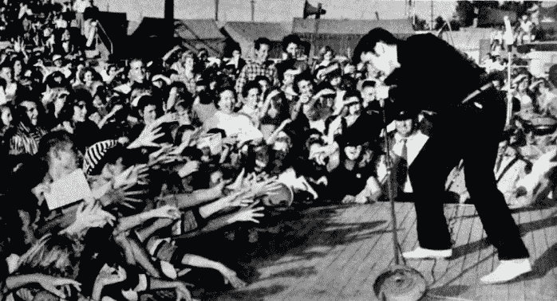
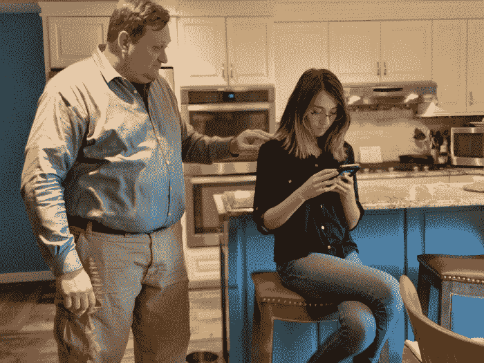
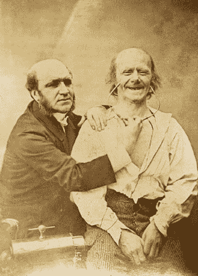

# 第八章：我能看到你没有说出口的东西

> *成为情商高的人是我们的责任。这些都是技能，它们并不容易，自然界没有把它们赋予我们——我们必须学会它们。*

> ——保罗·埃克曼博士

当我写我的第一本书《社会工程学：人类操控艺术》（Wiley，2010）时，我对非语言的世界还比较陌生。但我已经与保罗·埃克曼博士建立了关系，并从他那里学到了很多。保罗·埃克曼博士从 20 世纪 50 年代末开始了解非语言，60 多年来一直领导着非语言交流领域的研究。

埃克曼博士不仅帮助我完善了我的工作，还帮助我改进了沟通方式。这导致了我的第二本书《揭开社会工程师的面纱：安全的人类要素》（Wiley，2014），该书深入探讨了面部表情、肢体语言、手势以及非语言的方方面面。我甚至涵盖了你看不见的非语言交流部分：杏仁核的劫持。

如果你之前关注、阅读或听过我的任何作品，那么也许不难相信，当涉及到埃克曼博士时，我基本上的反应就像你在**图 8-1**中看到的一样。

**图 8-1** 大多数人想象我在看到埃克曼博士时会做什么（离真相不远）。

照片来源：`[`commons.wikimedia.org/wiki/File:Elvis_Presley_-_TV_Radio_Mirror,_March_1957_01.jpg`](https://commons.wikimedia.org/wiki/File:Elvis_Presley_-_TV_Radio_Mirror,_March_1957_01.jpg)`

我在这一章中有几个目标。首先，我希望确保我遵循埃克曼博士设定的高标准，确保我所说的一切都可以用研究加以支持。其次，我不想只是复制我的前两本书中的任何一本，特别是如果你已经读过其中一本或两本的话。在这本书中，我介绍了一个关键领域的非语言，它可以改变你作为社会工程师的生活：了解舒适和不舒适之间基线变化的理解。

在这一章中，我打破了你对某些肢体语言暗示的先入为主的错误观念，并向你展示了作为社会工程专业人士究竟应该看什么。## 非语言至关重要

在我进入本章的重点之前，让我帮你看看为什么理解如何阅读非语言交流很重要。当然，做到这一点最好的方法就是讲一个故事。

当我和埃克曼博士合作撰写《揭开社会工程师的面纱》时，他的角色是确保我说的话在科学上是准确的、有意义的、逻辑的，并且经过了他几十年的研究得到了认可。

我写了一章关于一项关于镜像神经元的研究。这项研究基本上表明，研究人员相信大脑中有一组神经元的作用是镜像他们从其他人那里看到的非语言。

根据艾克曼博士的研究，我们知道当我们感受到一种情绪时，我们会有一种无意识的反应，而这种反应通过微表情显示出来。此外，当我们做出面部表情时，我们会产生与该表情相关的情绪。

我建立了这样一个联系：如果镜像神经元使我们模仿某人的表情——伴随着情绪——我们就可以控制我们目标的情感内容。

当我写《揭开社会工程师的面具》时，关于镜像神经元及其背后的研究存在着科学上的争论。因此，艾克曼博士给我写了一封非常友好的电子邮件，在邮件中他基本上说：“如果这项研究被否定，你想让你的书中有过时或被证明错误的研究吗？”

我回答道：“但是，但是，但是…我已经写了 40 页关于这个的内容。而且章节在五天内就要交稿了。” 我希望艾克曼博士基本上会回答：“好吧，那很酷。”

相反，他说：“那么，我想你有五天时间阅读这里关于杏仁核的研究，并写一章关于它。” 然后，我大约有 60 页关于我几乎无法发音的东西的信息可以研究、理解和写作。

当然，艾克曼博士给了我很大的帮助，但这对我来说也有一个或三个教训。

+   如果我真的要真正帮助我的客户，了解事物的运作方式是很重要的。

+   适应和与新研究一起成长是很重要的。

+   睡眠真的很被低估。

当我写关于杏仁核劫持的那一章时，我再次在研究中看到了种植情感内容和控制目标反应之间的联系。如果在大脑有机会“开启”之前，杏仁核处理情绪刺激，而我可以让目标感到轻微的悲伤或恐惧，那么我就可以利用他们的共情反应。

换句话说，精通借口的使用可以帮助我引发我主体中想要的情感；我可以让他们感受到我想让他们感受到的情感。现在我们终于到了理解非语言的重要性的关键点了。

当我即将作为工作的一部分闯入某个地方，或者我即将进行一些电话钓鱼，我感到了一些相当强烈的恐惧：害怕失败，害怕被抓，害怕搞砸。让我们来探讨一下我所感受到的情绪。

恐惧如何在生理上影响我？

+   我的眼睛睁得很大，眼皮绷紧。

+   我的嘴形成了一个“啊”字形，我吸入了急促的呼吸。

+   我的肌肉绷紧，经常在我准备战斗或逃跑时冻结。

+   我的心率升高了。

+   我的出汗增加了。

现在，让我们讨论一下我应该处于什么样的生理状态来引发我所期望的目标情感反应（正如我之前提到的，这将是轻微的悲伤来引发共情）：

+   我的眼睛是柔软的，不紧张。

+   我的嘴唇拱起，角落下垂。

+   我的头低了下来。

+   我的肌肉不紧张。

+   我的呼吸变得更浅。

你看到了区别吗？如果我的前提是使用悲伤情绪，但我的肢体语言显示恐惧，目标会发生什么？我猜大多数人永远不会想到，“哇，这个人正在使用基于悲伤的故事，但表现出恐惧。这是不一致的情绪内容，让我感到不安。”然而，我们都有内在的雷达，告诉我们何时感到（或应该感到）需要提高警惕，更加防御。如果我表现出恐惧但试图引起悲伤和同情，我的目标的雷达会升起护盾。

一项真正了不起的研究标题为“同类情绪压力的化学感应线索激活人类杏仁核”（`[www.ncbi.nlm.nih.gov/pmc/articles/PMC2713432](http://www.ncbi.nlm.nih.gov/pmc/articles/PMC2713432)`）以一种……嗯……有趣的方式证明了这一点。

研究人员收集了锻炼过的人的汗垫。然后他们收集了一群人的汗垫，这些人在 13,000 英尺高空跳伞。然后研究人员通过给一组受试者头部安装 fMRI 并让他们嗅每个汗垫来进行测试。（恶心，但是事实。）

当这个测试组嗅到从飞机上跳下的人群的汗垫时，受试者的恐惧中枢，即杏仁核，被触发。当受试者嗅到锻炼组的汗垫时，没有触发恐惧。所以，你能闻到恐惧的老话确实是真的。

现在我们知道别人能感知到我们的恐惧，让我们考虑一下当我准备接近目标时我需要做什么。我有两个选择：

+   学会控制我的恐惧，这样我就能展示正确的情绪。

+   如果不可能，建立一个使用我的自然情绪的借口。

了解这一点可以帮助你更好地掌握自己的情绪，知道你展示的是什么，并学会如何使用、阅读和正确地对待情绪以及这些情绪的非语言产物作为一名专业社会工程师。

在我详细介绍非语言内容之前，你首先需要了解如何解释情绪基线。## 所有你的基线都属于我们

能够读懂别人的情绪内容确实可以提升你的沟通能力。我想专注于观察基线变化如何帮助专业社会工程师。

让我首先定义一个基线。简单来说，它是你开始观察时看到的情绪内容。你不是在寻找了解他们一生的基线。所以，放松——我不是要求你在每次测试之前跟踪你的目标几个月或几年。

看看图 8-2。阿玛娅做了一些不太好的事情，她的妈妈正在告诉她。

**图 8-2** 你在这里看到了什么基线？

你观察到了什么？在图 8-2 中，我的妻子阿里莎的情感内容是什么？你看到了紧绷的下巴吗？指向性的手指和紧闭的嘴唇？她在表达愤怒。

那么阿玛娅呢？她的手臂交叉，下巴高高抬起，脸上表现出烦躁。她封闭了自己，并没有真正倾听的心情。

现在看看图 8-3，看看在那次“讨论”结束后阿玛娅的样子以及阿里莎和阿玛娅已经分道扬镳后的情况。

**图 8-3** 这里有什么变化？

阿玛娅看起来有点悲伤和自我安慰。也许她甚至在反思那场争论。

现在看看图 8-4。阿玛娅和阿里莎刚刚结束了一天愉快的购物活动，一起喝了杯茶。

**图 8-4** 你在这张图片中看到了哪些基线？

这里存在哪些基线？两人看起来都很快乐。他们互相倾听，享受着交谈。

这三张照片展示了同样的人在不同情况下显示出不同的基线。其中包含了一个非常宝贵的教训。一个基线不是一个人的个性定义。它不是心理特征。它并不涵盖长期。基线仅仅是在特定时刻展示的情感内容。

能够在你接近某个人的那一刻读懂他的情绪状态对你作为一名社交工程师至关重要。你对目标阿里莎的方法从图 8-2 到图 8-4 的变化必须非常大，如果你想成功的话。

许多时候，我听到人们说他们可以在几秒钟内被教会区分谎言和真相。

大卫·松本博士、黄慧成博士、丽莎·斯金纳博士和马克·弗兰克博士在一篇名为“评估真实性和检测欺骗”的文章中写道（`[`leb.fbi.gov/articles/featured-articles/evaluating-truthfulness-and-detecting-deception`](https://leb.fbi.gov/articles/featured-articles/evaluating-truthfulness-and-detecting-deception)`）其中有一个非常重要的观点：“仅仅是行为的存在或缺失，比如视线规避或坐立不安，并不表明是撒谎。相反，真相与谎言之间的区别在于这些非语言线索如何随时间从一个人的基线变化以及它们如何与个人的语言结合起来。当仅考虑来自这些来源的行为线索时，它们准确地区分了撒谎和说真话。”

你是否清楚地掌握了它们的表达？并不存在一种神秘的迹象总是能够表明是谎言还是真相。一个人的线索如何随时间变化表明了情感的内容以及我们应该如何解读它。

### 谨防误解

人们经常对某些身体语言“暗示”持有一些先入之见，你需要在踏上这条道路之前了解并摆脱这些先入之见。如果不这样做，你会做出一些错误的假设。

让我们一起分析一些例子。看看图 8-5。你看到了什么？

**图 8-5** 阿玛雅是不是心烦意乱？

多年来，人们一直被告知双臂交叉是封闭的明显指示。这并不一定正确。如果有人从开放的姿势转变为封闭的姿势，当我靠近时，那*可能*是真的，但有些人习惯性地坐或站着双臂交叉，因为这样做很舒服，而不是因为他们封闭。在图 8-5 的两侧，阿玛雅的双臂交叉，但她的面部表情和头部位置表明了她的情绪。

现在看看图 8-6。

**图 8-6** 她是生气了，即将说谎，冷漠还是舒适？

在这张静态图片中看不到，但阿玛雅的腿每分钟跳动约 500 次。这是欺骗即将发生的迹象吗？或者她只是不舒服？很难说。有些人腿部活动频繁。再次注意这种运动何时开始以及观察它开始或停止的频率，以弄清楚它的含义。看看图 8-6 的整体画面：阿玛雅的身体姿势，她的腿跳动，她手放在脖子后面。当你考虑所有元素时，你可能会认为阿玛雅看起来不舒服。

我儿子科林的腿就像一个永动机。我一直认为如果我们能把它连接到发电机上，我们就能为家里提供电力。他并不欺骗；他只是动作很多。这是我如何利用对科林习惯的了解的一个例子：

我说，“嘿，科林，前几天的聚会怎么样？玩得开心吗？”

科林，他的腿在地上钻了个洞，会说，“是的，还好。没什么大不了的。”

现在，在这种情况下，我知道曾经和斯图尔特发生过争执，我想要了解详情。我会说，“哦，很酷。那里又有谁？”

科林列出了所有在场的人，但他漏掉了斯图尔特。嗯。我回答说，“哦，所以斯图尔特没来？我以为他会去的。”

现在科林的腿突然停住了，“是的，他也在那里，”他说，随着他的腿再次开始移动。

“哦。斯图尔特一切都好吗？”我问道。

现在，科林的腿牢牢地踏在地上，“是的，挺好的。”这次，在科林再次开始移动腿之前有一段停顿。

表明存在问题的指标不是科林的腿在动，而是它停下来了。从那时起，几秒钟之内，我就知道了整个故事。

现在看看图 8-7，看看你能解读出什么。

**图 8-7** 这是舒适还是不适？

揉脸、挠痒或其他类型的操纵动作可能是不适的指标，但有时人们只是脸痒。注意它是什么时候开始的，以及为什么。

我也可以以我儿子科林为例。他有哮喘和过敏。有很多时候他全身都痒。在花粉季节，科林总是摸或挠脸。在这种情况下，烦躁不安并不是因为科林在撒谎，而是因为他的过敏。

如果我们陷入这些误解，就会陷入一种在那里情感不存在的情况下分配情感内容的陷阱。这可能很危险，因为你可能开始对不存在的情感做出反应。当别人只是感到寒冷时，你不想把他们当成封闭的，或者假设某人的行为是由过敏引起的时，你不想认为他们是在欺骗。

对抗这种错误的最佳方法是在每种情况下都不使用预设的判断，即使你是在接触之前就已经与目标互动过。在初次接触的 15 到 20 秒之后再做出判断。

当涉及到身体语言时，我试图关注基线的变化，然后寻找表明舒适与不适的变化。在*揭开社交工程师的面纱*中，我详细介绍了面部表情和身体语言，所以如果你想更多了解这个主题，可以查看那本书。

对于这本书，我想给你的只是了解舒适和不适之间区别的基础知识。一旦你清楚地了解了这些指标是什么样子，你就会有一张地图告诉你要寻找什么以及如何解释你看到的东西。### 了解基本规则

这一部分涵盖了你在阅读身体语言时要牢记的四个好规则。如果你应用了这些规则，你会看到在如何阅读和解释身体语言方面有着巨大的差异。

这些规则不是指“数学”，而是指你必须做到 1 + 2 + 3 + 4，但如果你想掌握阅读非语言的技巧，那么所有这些都必须做到。

#### *规则 1：专注于“是什么”*，而不是“为什么”

这个规则很简单：在没有所有信息的情况下，不要在“是什么”和“为什么”之间建立联系。

我经常在我的非语言训练课程开始时帮助学生记住一件事：“仅仅因为你能看到*是什么*并不意味着你知道*为什么*。”

想一想：当我对着班级讲话时，我看着你说了一些话。我注意到你交叉双臂，你的眉毛皱了起来，眼睛仍然睁着，你的下巴紧绷了。我注意到你的手臂和手上有紧张感。所有这些迹象都指向愤怒或者不适。

我可以假设你对我或者我说的某事感到愤怒或者不适。然而，也许你是因为去年做的手术感到疼痛而作出反应。或者你有胃部痉挛让你感到愤怒。或者你根本没有在关注，而是想到了一些让你生气的事情。

不管你身体语言的原因是什么，我如何将“做什么”连接到“为什么”？正如我在第七章中所讨论的，“构建你的艺术品”，这一切都是关于问题。在课堂场景中，我停止我的讲座来询问你为什么看起来生气是不合适的。#### *规则 2：检查群集*

当你开始练习与目标进行互动时，很容易只关注一个特定的身体语言动作或者面部表情，然后认为你能理解正在传达的意思。然而，只关注一个线索是危险的。你需要上下文和其他身体语言线索来表明真正传达的意思。寻找匹配的非言语线索，指示显示的情绪是什么。

考虑这种情景：你正在和你的配偶交谈，告诉他们你不同意一个决定。当你陈述你的观点时，你的配偶抱起双臂。这是否自动意味着他们关闭了，生气了，或者不喜欢他们所听到的？

将你的视野扩展一点。你看到你配偶的脸上有愤怒吗？你看到他们的臀部和脚有变化吗，以至于现在他们的指向远离你了吗？还有哪些其他情绪“群集”可以帮助你确定抱臂是否是一个孤立的动作还是更大的情绪暴露的一部分？#### *规则 3：寻找一致性*

寻找口头和非口头沟通之间的一致性。如果有人摇头表示“不”，但是说“是”，那么这两个指示都在告诉你事情不一致。

当你发现你感知到的某人的信息缺乏一致性时，依靠非言语传达来表明真正传达的是什么。检查非言语线索，并寻找非言语沟通与口头沟通之间的不一致性，将帮助你非常接近准确读取目标正在告诉你的内容。#### *规则 4：注意上下文*

假设我看到我的女儿坐在外面。她使自己变小，几乎蜷缩成一团。她双臂交叉在胸前，下巴低垂。她的头低低地埋在交叉的手臂中。所有这些都是悲伤和不适的迹象。

我没告诉你的是，外面只有 35 华氏度，而她没有穿合适的夹克。

在上下文中，你会明白阿玛雅感到寒冷。如果没有关于温度的上下文细节，她看起来似乎是悲伤和不舒服的。为了避免误读非语言信息，你必须了解你的目标所处情境的背景。

除了这四条规则之外，在我详细介绍每种情绪之前，你需要了解一些关于身体语言的基础知识。## 了解非语言信息的基础知识

在开始学习非语言信息的道路上，有一些基本的事情你应该了解。这些基本特征适用于所有人类，不与特定文化、性别、种族或宗教有关。了解这些基础知识将帮助你理解我们的身体如何准确传达我们的感受，无论我们试图展示什么。

外部刺激通过我们的五种感觉方式进入大脑，假设没有受损：视觉、嗅觉、味觉、触觉和听觉。这些刺激被我们的大脑处理，刺激可以触发七种基本情绪之一：愤怒、恐惧、惊讶、厌恶、蔑视、悲伤或快乐。被触发的情绪会在我们的面部和身体上产生生理反应。

例如，当一个人自信时，他们会让自己变得更大，这会提高血液中的睾酮水平并降低皮质醇水平，根据研究人员 R. S. Minvaleev、A. D. Nozdrachev、V. V. Kir'yanova 和 A. I. Ivanov 的研究题为“健康受试者的姿势对激素水平的影响”（[`link.springer.com/article/10.1023/B:HUMP.0000036341.80214.28`](https://link.springer.com/article/10.1023/B:HUMP.0000036341.80214.28)）。研究人员想要测试某些瑜伽姿势是否会增加或减少皮质醇、睾酮、去氢表雄酮（DHEA）和醛固酮。对于我们的目的，让我们专注于皮质醇和睾酮。

研究人员发现，仅通过摆出与自信行为相关的姿势，一个人的睾酮水平就会增加超过 16％，皮质醇水平下降 11％。巧合的是，睾酮被认为会增加与自信人士相关的行为。因此，几乎可以说是自我实现的预言，摆出自信的姿势似乎释放了有助于让你感觉和行动更自信的化学物质。

本质上，你需要理解的重要一点是：似乎基于舒适的非语言信息有助于产生快乐、自信和强大的化学和生理反应，而基于不舒适的非语言信息可能会引发压力、焦虑和基于负面情绪的反应。

了解某些非语言信息如何影响你和你的目标是很重要的。作为一名专业的社交工程师，你正在影响或操纵你的目标的情绪内容。不要轻视这一点。

因为你的借口对目标的影响可能是短期的或长期的，所以计划你的借口非常重要。记住座右铭：让他们因为见到你而感到更好。在可能的情况下，尽量使用那些不会对目标产生长期负面影响的触发情感内容的借口。

你如何确定你选择的借口是否会产生长期的负面影响呢？试着确定你的借口基于什么情绪。恐惧、愤怒、厌恶和轻视等负面情绪是如此强烈，以至于你冒着让目标因为见到你而受伤的风险。

例如，有一个欺骗性的邮件标题是：“感谢您最近购买了这台 55 英寸的电视”，而另一个是：“您的账户已被入侵，您的银行账户已被清空。”

了解非语言和情感如何深刻影响目标应该能帮助你确定如何在社会工程活动中使用这些情感。为此，我从埃克曼博士那里学到的最深刻的一课是，拥有一种情感不仅会触发非言语回应，而且如果你强迫自己做出非言语回应，你就能触发那种情感。这个概念得到了许多研究人员的支持，包括在一项名为“人类微笑的抑制和促进条件：面部反馈假设的一项非侵入性测试” (`[www.ncbi.nlm.nih.gov/pubmed/3379579](http://www.ncbi.nlm.nih.gov/pubmed/3379579)`) 的研究中。研究人员斯特拉克、马丁和斯特佩测试了埃克曼博士在 1970 年代和 1980 年代提出的假设，并能够证明如果你制造了表情，你就能触发那种情感。他们通过要求受试者把笔放在嘴里以触发模拟微笑的肌肉使用来做到这一点。他们证明了埃克曼博士在他的研究中所述的相同事情：制造面部表情（即使是通过强迫）也能引起与之相关联的情感。

记住的关键点是，如果你制造了一种情绪，或者你导致目标表达了那种情绪，你就能让目标感受到那种情绪。在使用这种超能力时必须谨慎。 ## 安慰 vs. 不适

学会如何有效地沟通很重要，其中一部分是非语言沟通。有一些研究人员已经开发出关于我们所说的话有多少是非语言的统计数据。我听说过 80%、85% 甚至 90%，但我从埃克曼博士那里学到的一件事是，尽管我们都同意沟通的很大一部分是非语言的，但沟通的方式（口头、书面、面对面）会影响非语言的使用方式。

在正常交流中，我们的身体和面部展示的东西对于能够识别所展示情感的人来说可能是令人难以承受的。在正常交流中，一个人的身体和面部可以展示出多种情感，试图解释它们可能是令人难以承受的。因此，当你作为一名社会工程师刚开始时，最好专注于最容易解释的非语言表达：舒适和不舒适。

对于这本书，我正在尝试一些我在其他书中没有尝试过的东西。我从情感的角度来讨论这个话题，然后讨论你作为社会工程师是否想要在目标中触发这种情感。我解释了如何寻找可能表明与该情感相关的舒适或不舒适表现的迹象。我将这一部分按照每种情感进行了划分，并描述了面部和身体中该情感的一些指标。这并不意味着要列出每一个动作，但它为你提供了一个基础，让你在练习和掌握这项技能时建立在其上。

除了学习本节以了解如何读懂他人的肢体语言，你还应该利用这些信息来了解你的肢体语言如何影响你的目标。如果你展现了我在本节中描述的情感，那么你可以在他人身上引发这些情感。决定你想要引发哪些情感，然后练习这些情感的非语言表达。还要学会识别你不想在他人身上引发的情感和触发因素。

### 愤怒

愤怒是一种被标记为通往其他情感、感觉或行为的情感。这意味着很多时候，愤怒会导致其他情感、感觉或行为。这些行为可以从使用粗话或愤怒的言辞一直升级到展示暴力行为。

生理上，愤怒使我们变得紧张、紧绷，并准备好战斗或防御。肌肉绷紧，下颚紧闭，人可能握紧拳头——所有这些都是为了战斗或防御做准备。当人靠近采取暴力行动时，你甚至可能看到他们的下巴下垂以保护颈部。

尽管事情紧张而紧绷，你可能会注意到一个正在经历愤怒的人试图让自己变得更大。例如，一个愤怒的人可能扩展胸部，挺直肩膀，加宽站姿。此外，他们的呼吸加深，心率增加。

一个愤怒的人具有以下面部特征：

+   眉头会皱起，但眼睛不会眯起。它们会睁得很大。

+   下颚紧闭。

+   牙齿咬紧，或者，如果嘴巴张开，那么这个人通常不会说愉快的事情。

你可以在图 8-8 中看到所有这些。

**图 8-8** 面部的愤怒

愤怒也可以表现在身体的其他部位。图 8-9 展示了我紧咬的下颚和握紧的拳头。此外，我的胸部膨胀起来，让我看起来更大。所有这些都指向愤怒。（顺便说一句：这是我将交给任何对 Amaya 表现出兴趣的男孩的照片。）如果你注意到你接近一个人时出现了这些迹象，最好避开那个人。

**图 8-9** 身体中的愤怒

愤怒的另一种形式在图 8-10 中展示，其中 Amaya 展现出微妙的愤怒。她的瞪视、紧咬的下颚和微微皱起的眉毛都是愤怒的迹象。

**图 8-10** 微妙的愤怒

大多数情况下，你可以推断出愤怒是一种不适的非语言表达。这是我特别不喜欢在我的目标中引起的情绪之一。因此，我会留意这种情绪的迹象，并尽量不在我的交流中使用它。

许多时候，如果我的方式过于激进或者我的前提太消极，我会察觉到愤怒的迹象。这是一个很好的警告信号，让我退后，软化我的声音或身体语言，以减轻目标中的一些愤怒感情。### 恶心

恶心也是一种非常强烈的情感。恶心可以针对一个人、地方或事物。通常情况下，一些让我们产生非常强烈恶心反应的东西会在我们接触到它之后很长一段时间内留在我们的记忆中。

当我还是个小男孩的时候，我的父母养了一些鸡。我喜欢跑到鸡舍，抓几个新鲜的鸡蛋，然后做我聪明地称之为“鸡蛋面包”的东西。简单来说，就是一片涂了黄油的面包，中间有一个鸡蛋。

有一天，我拿起鸡蛋，在我超热的铸铁锅中打开它。从里面掉出来的不是一个新鲜的鸡蛋，而是一个未完全形成的小鸡。当它掉进锅里时，它开始在死去时翻滚。那景象和气味让我感到恶心，我在水槽里呕吐了起来。因为我如此厌恶，我忘了关火，所以可怜的东西被烤焦了，整个厨房里弥漫着烧焦的小鸡的气味。

触发的恶心情绪是如此之强烈，以至于即使十年后，烹饪鸡蛋的气味也会让我立即感到恶心。最终，我克服了这一点，但是恶心是一种如此强烈的情感，如果你在你的目标身上触发了它，你可能无法恢复过来。

想想什么会触发你目标的恶心情绪：体味、身体功能、脸上或牙齿上的食物、粗话、用词选择等等。在接近之前，仔细分析你的方法和自己是很重要的，这样你就不会让你的目标感到恶心了。

厌恶可以以几种不同的方式表现出来。在脸上，它是双侧表达，意思是脸的两侧显示相同的表情，就像图 8-11 中所示。

**图 8-11** 厌恶

当我们准备拍照时，我的狗在客厅里做了一些恶心的事情。我不想错过这个机会，所以我拍下了 Areesa 清理的照片。请注意她鼻子两侧的皱起，这既阻塞了嗅觉，也阻挡了视线。本质上，她在生理上阻止了引起她厌恶的事物。

在身体上，一个人通过阻止或转身来表现厌恶。观察缺乏兴趣或排斥的迹象。

注意 图 8-12 中 Amaya 的腿部位置。她的兴趣在哪里？显然不是在她爸爸身上（虽然这让我很难过）。虽然她没有显示出真正厌恶的明显迹象，但她的身体语言显示出不适和不感兴趣的迹象。

**图 8-12** 不感兴趣

由于厌恶是一种强烈的负面情绪，我倾向于在交往中不使用它。然而，我曾被问及是否可以利用它来创建一个对同一事物感到厌恶的人群。虽然这样做可以起到作用并且非常强大，但如果处理不当可能会导致一些危险的结果。### 蔑视

蔑视是一种独特的情绪。*牛津英语词典* 将蔑视定义为“认为某人毫无价值的感觉。” 埃克曼博士提供了一个更简单的定义，称蔑视是一种道德优越感的情感。

根据埃克曼博士对蔑视的定义，蔑视只能针对一个人，并且它是唯一的单侧表达，这意味着它只在脸的一侧显示出来。起初，蔑视可能看起来像是一丝嘲笑，甚至是微笑的开始，就像图 8-13 中所示。

**图 8-13** 蔑视可能会被误认为是快乐。

蔑视的特征是面部的一侧被抬起，例如，唇角只有一侧被抬起，就像图 8-13 中所示。即使只是轻微的，这种情况下也很常见见到下巴抬高。

由于蔑视是对另一个人的一种优越感，而且往往会成为愤怒的入口，你可能会看到以下类型的蔑视体语言：

+   对另一个人感到自己比较优越会让人感到自信。这种自信的感觉可以通过多种方式展现出来，但通常，这个人会通过使自己变得更大来占据更多的空间。

+   如果鄙视导致了愤怒，你可能会看到与我在前一节中描述的相同的身体语言。然而，在这些愤怒的非言语行为完全展示出来之前，你可能会注意到下颚的紧绷和更具攻击性的姿势。

在我看来，鄙视在职业社会工程活动中几乎没有用处。我能理解一个国家可能会如何使用它，我也看到过恐怖组织如何利用它来招募并转变人们的信仰，但对于大多数标准的社会工程活动来说，它不会导致期望的结果。 ### 恐惧

恐惧有很多目的，比如它会提醒我们危险，但当它受控制时，它也可以让人感到兴奋和愉快。一些人甚至喜欢被吓到或感到恐惧。

对于职业社会工程师来说，失望、失败或做出错误决定的恐惧可能是有用的，但我一般避免使用更强烈的恐惧。直接威胁或吓唬一个人的假象——比如那些让他们担心自己的工作、生活或家人的假象——会引发如此强烈的情绪，以至于当他们发现自己正在接受测试时，他们可能会感到厌恶或鄙视，然后是愤怒。

恐惧有一些明显的生理特征：

+   眼睛睁得大大的，以便全景观察。

+   身体绷紧，通常会听到一声可听见的喘息声。

+   嘴巴张开，嘴唇向耳朵拉动，好像人在说“嘘”一样。

你可以在图 8-14 中看到这些特征。

**图 8-14** 经典的恐惧表情

在身体上，恐惧有着与面部表情类似的表现。身体后退，绷紧，僵硬，并准备好战斗或逃跑。如果你吓到了你的目标，你可能会看到人们的反应就像图 8-15 中所描述的那样。

**图 8-15** 被惊吓的恐惧体现在身体语言中

注意阿玛雅如何用整个身体后退并绷紧。她的嘴呈现出“嘘”状。这种恐惧可能会很强烈，因为她没有逃跑的物理方式。她被困在椅子上。

图 8-16 展示了另一个女性表现恐惧时我们所看到的方面——用手遮住颈前窝。

**图 8-16** 用手遮住颈前窝表明恐惧。

注意观察微妙的身体语言指示，可以让你了解目标可能的感受。如果你看到恐惧的迹象，你可以决定显示的恐惧是否合适，以及你愿意采取多大程度的手段来使用它。如我之前所述，我作为一名专业的社会工程师使用恐惧，但我避免使用可能让目标感到威胁或处于危险境地的恐惧。 ### 惊喜

惊喜经常被误解为恐惧，因为它看起来很相似。惊喜时，眼睛睁得很大，就像恐惧时一样。身体通常会冻结，嘴巴也张开。但嘴巴不是以“咦”形状张开，而是以更像“哦”的形状张开。你可以在 图 8-17 中看到这一点。

**图 8-17** 惊喜，通常会被误解为恐惧

惊喜对专业的社会工程师来说可能很有用，但与我提到的其他一些情绪一样，它取决于你如何使用它。我不建议躲在衣柜里然后跳出来吓唬你的目标，但是一个突如其来的审计、访问或奖励可能会起到适当的反应。在一次完全是语音钓鱼的接触中，我使用了一个意外的奖励，取得了一些惊人的成果。通话大致如下：

| **目标：** | 喂，我是贝丝。有什么我可以帮你的吗？ |
| --- | --- |
| **我：** | 贝丝，我是人力资源部的保罗。我有个好消息。你可能还没有听说，但我们把你的部门报名参加了一次全新 iPhone 的抽奖活动，而且你被抽中了！ |
| **目标：** | 开玩笑吧！这太棒了！ |
| **我：** | 我知道。我喜欢这样的电话。我们要送出 10 个，这些电话一直很有趣。 |
| **目标：** | 是的，我从来没有赢过什么。太棒了！ |
| **我：** | 如你所知，我们在 XYZ 公司有几个贝丝，所以我需要核实一些细节，以确保我找到了正确的贝丝。你能拼出你的全名吗？ |
| **目标：** | *伊-莉莎白·斯马斯顿*。 |
| **我：** | 很好。我需要你的员工编号，以便将其输入系统中。 |
| **目标：** | T238712P。 |
| **我：** | 好的，你就是贝丝。现在我需要你去一个网站，在那里你将被要求使用你的域凭据登录，并告诉网站你想把电话寄到哪里，等等。去 [iphone.company-website.com](http://iphone.company-website.com)。 *[这是我们设置的一个什么都不做的网站；没有一个按钮有效。]* |
| **目标：** | 好的，网站出来了。我看到我们的标志，但是当我点击 Enter 按钮时，什么也没有发生。我该怎么办？ |
| **我：** | 嗯，我现在就在上面。当你点击 Enter 按钮时，它没有跳到另一个页面吗？我现在看到另一个页面。 |
| **目标：** | 不行。我试了一个不同的浏览器。 *[她试了她拥有的每个浏览器。]* 真是的；我赢了什么，甚至都不能领。 |
| **我：** | 不，我们不会容忍这种情况。看，我会为你要求它。你要我输入你的信息吗？ |
| **目标：** | 真的吗？你会这么做吗？ |
| **我：** | 当然，我会的。*[感觉像条蛇一样内疚]*。它要求你的全名，我有……”*[我假装打字时每个字母我都念出来。]* 好的，点击下一步。它要你的员工 ID——你给了我，所以我现在会输入。 |
| **目标：** | 非常感谢。这太酷了。 |
| **我：** | 好的。它要你的域登录，我猜只是 E.Smarston 吧？ |
| **目标：** | 不，实际上我把它设为了 B.Smarston。对贝丝…… |
| **我：** | 好的，太棒了。现在我唯一需要的是你的密码。 |
| **目标** | *[甚至不停顿一秒]*：我使用长密码真的很好。就是“JustinandBeth99”！ |
| **我：** | 太好了，成功了。它说你将在 24 小时内收到一封电子邮件，其中有关于索取手机的进一步说明。恭喜，贝丝！ |
| **目标：** | 非常感谢！ |

有了这个，我们完全妥协了网络。是的——对于那些正在准备写恶毒邮件的人来说——那是有点操纵性的，并且使用了一种后来让目标有点沮丧的前提。但是，请记住，我没有威胁她；我没有让她难堪；我没有给她造成伤害。我使用了一种惊喜来引发基于幸福的情感，这导致她毫不考虑地向我提供了各种信息。

从身体语言的角度来看，有一些事情可能会让你感到惊讶。这些在图 8-18 和图 8-19 中显示。

**图 8-18** 惊讶可能导致人们身体向后倾斜，面部表情抬高。

**图 8-19** 震惊，一种惊讶的形式，可能表现为人们捂住嘴巴。

在我看来，惊讶是一个专业社交工程师的好情感。通过适当的规划和执行，它可以为你带来巨大的胜利。### 悲伤

悲伤是一种非常复杂的情感。它也有很大的范围，因为它可以从稍微感到沮丧到彻底绝望。作为一个社交工程师，你可以运用一些方式来利用悲伤：

+   注意到目标的悲伤，然后利用那种情绪引发反应。

+   创造一个很可能会导致目标感到悲伤并使他们按照你所希望的方式做出反应的情况。

+   通过你自己的非语言行为表现出悲伤，以引起基于共情的反应。

其中一些方法比其他方法更具操纵性。这完全取决于你如何运用这些情感以及你所使用这些情感的人的结果性情感状态。

悲伤有一些面部指标，这些指标在图 8-20 中有展示。

**图 8-20** 悲伤的面部元素

在脸上，悲伤表现为

+   嘴角下垂

+   眼睑下垂

+   眉毛的角落聚在一起并上扬

在一些极端的悲伤情况下，你可以从脸部的某一部分读出这种情绪。

悲伤也可以通过一个人的身体传达。悲伤让我们想要保护、安慰，并变得更小——这与自信的反应相反。

一些自我安慰的非言语展示示例显示在图 8-21、图 8-22 和图 8-23 中。

**图 8-21** 自我安慰的拥抱

**图 8-22** 眼部遮挡

**图 8-23** 身体姿势低沉

这只是一个简短的列表，但你明白了。这些非言语信号可以帮助你看出这个人感到明显的不适。

悲伤，以其所有的复杂性，对于社会工程师来说可能非常有用——无论是学习如何读懂它还是展示它。然而，我警告你要控制如何使用这种情绪，以及在你的借口中使用到什么程度。

我从不希望让我的目标感到极度悲伤或悲伤，但使用适当程度的悲伤可以引发强烈的共情反应。在 Jorge A. Barraza 和 Paul J. Zak 撰写的题为“对陌生人的共情引发催产素释放和随后的慷慨”的研究中，研究人员表明当共情被触发时，催产素释放增加了 47%，即使共情的感觉是在完全陌生人之间，而悲伤可能会在大脑中造成缺乏血清素、多巴胺和催产素。作为一名专业人士，我尽量坚持悲伤的共情一面，而不是担忧、悲伤或抑郁的一面。

想想这种策略在营销和慈善活动中被使用了多少次。从无家可归的孩子到受虐待的动物，目标是引发一种共情的反应，鼓励你更容易决定放弃你的钱。这并不意味着这些组织是不诚实或操纵性的——他们只是知道我们的大脑是如何运作的，这有助于他们实现目标。### 快乐

幸福是一种我们都认为对所有人际互动非常有用的情绪。当我们感到幸福、满足、平静或放松时，我们更容易做出更多的利他主义决定。我们倾向于喜欢让我们感到这种情绪的人、地方或事物。

出于这个原因，很容易看出，作为一名社会工程师，幸福是你想要掌握的一种情绪。真正有助于你看到自己是否做得很好并且能够创造幸福的第一件事情就是学会识别真实微笑和假微笑之间的区别。将真实微笑与假微笑区分开的唯一标志就是轨骨眼肌的激活。当触发时，这个肌肉会提起你的脸颊并形成我们所说的眼角的“鱼尾纹”。

在 19 世纪中叶，一位名叫吉约姆·迪尚的法国研究者提出了一个观点，即真实的微笑可以被伪造。他正在使用一种非常侵入性的电击形式研究神经科学。他施加电击以刺激肌肉运动（`[www.thevintagenews.com/2016/05/07/44782-2](http://www.thevintagenews.com/2016/05/07/44782-2)`）。

由于疼痛的原因，迪尚没有在这项研究中取得太大进展，但他对情感如何通过面部表情展示出来的研究表明，面部是情感的地图。约在 1855 年，他开发了一种使用电击刺激肌肉反应的方法，并在他的著作《人类面部表情机制》中写道他的发现。结果就是你在图 8-24 中看到的。

**图 8-24** 一个假微笑

照片来源 `[HTTPS://PUBLICDOMAINREVIEW.ORG/COLLECTIONS/THE-MECHANISM-OF-HUMAN-PHYSIOGNOMY](https://publicdomainreview.org/collections/the-mechanism-of-human-physiognomy)` 来自《人类面部表情机制》

阅读这项研究可以帮助你理解为什么幸福会产生被称为微笑的面部表情。但作为一名专业的社会工程师，你需要学会识别其他与幸福相关的身体语言指标。

幸福的情绪如何通过一个人的肢体语言展现出来？如果幸福释放强烈的神经化学物质并创造出自信的环境，那么我们也可以期待看到一些特定的身体表达。寻找像图 8-25、图 8-26 和图 8-27 中所示的身体姿势。

**图 8-25** 注意开放、自信的手臂姿势。

**图 8-26** 开放式腹部展示表明信任和幸福。

**图 8-27** 开放性的腹部展示通常与友好或热情的问候相关联。

在脸上，我们期望眼睛参与笑容，除此之外，嘴巴形成闭合或张开的笑容（见图 8-28）。很多时候，感到快乐的人也会向着他们的快乐对象靠近。

**图 8-28** 脸上的快乐由真诚的笑容和头部倾斜展示

其他的快乐迹象可能包括像是抬高脚趾或者在脚趾球上跳跃之类的动作。当人们感到自信或者良好时，他们倾向于使自己更大或者更有活力。

快乐是我作为一名专业的社交工程师经常使用的情绪之一。吸引一个人的自尊心是创造快乐的好方法，这可能导致情绪决策。然而，为了使之奏效，自尊心的吸引必须是现实的、可信的，并且与你在那一刻建立的关系水平相适应。

我发现，如果符合我的预设，以开放性的腹部展示和一个热情的微笑以及适当的头部倾斜方式接近目标会在使目标感到舒适方面起到很大的作用。

寻找在你的社交工程预设中创造快乐环境的方法，你将会得到良好的结果。 ## 概要

非语言是一个复杂而庞大的主题，我意识到在一个相对简短的章节里无法涵盖。正如我在开头提到的，我希望通过对这些信息进行高层次的概述，你能够从中获得一些不同的工具。理解情绪如何起作用将使你受益良多。你越了解一个人在没有用词语表达时在说什么，就能更清晰地理解他们的沟通。以下是我希望你从这一章中带走的主要思想：

+   **基础工具** 作为一个起点，本章可以帮助你学会在脸部和身体上寻找每种情绪的微妙变化。

+   **更好的理解** 我希望你对哪些情绪适合你有了更好的理解，以及如何不仅在他人身上看到这些情绪，而且自己也表现出来。

+   **防御** 理解情绪是如何通过面部表情和身体语言传达的也可以对你有所帮助。意识到这些情绪如何被使用，将使你在它们被用来针对你时更加警觉。

+   **提升** 作为一名专业的社交工程师，不断学习和提升自己的技能是至关重要的。

我想再给你讲一个关于社会工程的故事，这可能有助于巩固本章的思想。在一次 DEF CON 期间，我与一位员工的互动帮助我看到了时刻保持对非言语的观察是多么重要。

对我和我的团队来说，会议总是一个忙碌的时期。在这五天中，我觉得我很少有时间休息，甚至没有几分钟属于我自己。我只是把开关打开，“开”着，因为我从人群中的能量和积极的氛围中获得了动力。

这对我来说很有力量，但这也可能让我忽略了别人的感受。我四处跳动，大声下命令，确保事情都被完成了。在这个会议上，我给一些员工下达了一些命令，让他们开始收拾东西。这是我们的最后一天，我们急忙整理好一切，这样我们就可以出去在我们最喜欢的寿司店享用最后的团队晚餐。

事情进展顺利；一切都进行得百分之百完美。我们需要进行闭幕仪式，然后我们终于可以放松一下。我试图更加关注别人的情绪，我注意到一个人的脸上不仅表现出疲劳，而且表现出彻底的精疲力竭。另一个人表达了一些严重的困扰。

对于第一个人，我说，“嘿，如果你真的累了，你知道你可以要求不参加这一部分，你不需要来参加结束。”

“什么？*真的*？我本来可以选择退出？”他惊讶地问道。

“是啊，兄弟—我以为那是理所当然的。抱歉我之前没有提到。”

“我完全不知道我们可以选择退出。我以为这是强制性的，”他说。

“好吧，只有米歇尔是强制性的。其他人—你可以选择退出。”

然后，我的员工松了口气。

当我接近下一个人时，我需要小心。我不能在其他人面前制造问题而指责她。我从她的情绪中读到的是一种悲伤、愤怒和恐惧的混合。

我私下接近她，将她拉开，问她是否没事。我不会详细描述互动，但有很多眼泪。她感到压力，因为她觉得事情被忽略了或被忽视了。而且她因为缺乏休息时间而感到非常紧张。

所以，我学到了一个新的课程。在会议的最后一天，我特别留心和关注我的团队的情绪。然而，我意识到我应该在整个会议的五天中都使用这种技能，以便在我们达到那种压力水平之前就发现问题。

让我把这个故事应用到社会工程学中：要观察，但不仅仅是在参与中。寻找“标志”，但也要在所有交流中保持观察。要注意基线的变化和情绪泄露，这可以帮助你在交互之前、期间甚至之后看到一个人可能的感受。

能够阅读非言语交流是一种强大的技能。当你能够利用非言语交流引发目标的情绪时，你几乎已经达到了超级英雄的水平。

这就是我在其中概述我作为一名专业社会工程师所使用的大部分技能的章节的结尾。在下一章中，你将学习如何将这些技能应用于社会工程渗透测试。这些技能可以应用于哪些向量？这正是下一章的主题。
