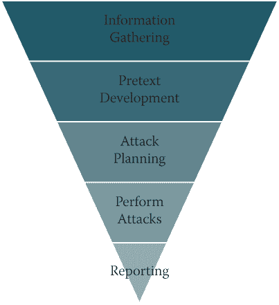
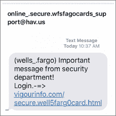
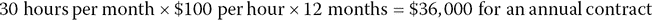

# 9

黑客攻击人类

> *如果金钱是你对独立的希望，你永远不会拥有它。一个人在这个世界上唯一真正的安全是知识、经验和能力的储备。*

> —亨利·福特

简要回顾一下，我已经讨论了过去七年左右社会工程领域发生的变化：OSINT 以及如何使用它，沟通建模，假托，建立关系，影响力，操纵，引诱和非言语交流。从沟通的角度来看，这是一个很好的知识基础，但因为我是一名专业的社会工程师，我需要告诉你如何应用这些信息并在社会工程环境中使用它。

从恶意社会工程的角度来看，我看到被用于攻击的四个主要向量：钓鱼、vishing、SMiShing 和冒充。还有这些攻击的组合，陷害我们。

��本章中，我将讨论如何运用我在每个向量中讨论的技能。然后我会简要地讨论一下总是有趣的报告主题。最后，我会讨论如何进入这个行业并吸引一些客户。

然而，在讨论任何这些之前，我必须讨论渗透测试的原则。这将为你如何进行社��工程渗透测试奠定基础。## 一个平等机会的加害者

我想从一开始就提到的另一件事是，社会工程向量并不只是针对愚蠢的人有效。它们对所有人都有效。在正确的情绪触发器、正确的情境中，正确的借口可以让我们中的任何一个成为猎物。

我经常被问到是否曾经受到恶意社会工程攻击。不幸的是，答案是肯定的。在恰当的时机，恰当的触发器让我上当受骗，点击了一封钓鱼邮件。幸运的是，除了一些尴尬之外，对我来说没有造成重大损失，因为我知道如何迅速做出反应以及如何解决问题。我有一个 M.A.P.P.（这是第十章“你有 M.A.P.P. 吗？”的主题）。

我不喜欢“没有补丁可以修复人类愚蠢”之类的口号。是的，我承认从安全角度来看，有许多问题是由于懒惰甚至愚蠢导致的，但这并不意味着只有愚蠢的人才会上当受骗。

有一个案例，一位大学教授收到了一封 419 诈骗邮件（也被称为尼日利亚王子诈骗）。教授百分之百上当受骗。他上当受骗得如此彻底，以至于在耗尽了自己的积蓄后，他从大学的金库中盗取了钱款。即使在被抓住并牵涉到 FBI 的情况下，他也指责探员试图窃取他的线索，以便他们能够获得他即将在账户中看到的数百万美元的利益。

听起来很愚蠢，对吧？嗯，这是一个简单的答案。相反，我看待这种情况，并考虑是什么让这个人如此投入于这次攻击。以下是一些值得考虑的想法：

+   他正面临严重的经济问题，而这个骗局给了他对财务自由的*希望*。

+   他的 *贪婪* 感是由他认为会看到转入银行账户的巨额数字所引发的。

+   一旦他 *承诺*，他就想保持 *一致* 他的决定。

+   他觉得他正在 *帮助* 第三世界国家的一个人过上更好的生活，同时也在帮助自己。

通过从这个角度审视情况，我更容易理解教授是如何对这个骗局如此投入，以至于毁掉了自己的生活，犯下了偷窃和欺诈行为，并欺骗了自己的妻子—所有这一切都是为了希望、贪婪和保持一贯和致力于帮助自己和另一个人。

我无法告诉你有多少次 CEO 或其他高层人员告诉我，他们 *绝不会* 被我的欺诈所骗，只有当他们发现他们是渗透测试期间远程访问的源头时才真正生气。无论一个人在组织中的职位如何，都可能成为攻击的受害者。## 渗透测试原则

渗透测试，是 *penetration testing* 这个术语的缩写，是指一家公司聘请专业人士尝试渗透该公司的网络。最终目标是，渗透测试应该帮助暴露并修补任何问题，以防恶意攻击者利用它们。

多年来，渗透测试已经成为一种标准的安全工具，许多合规委员会要求公司至少每年进行一次渗透测试。截至目前，还没有多少政府合规法律要求公司在这些测试中包含社会工程。

事实上，一个只是想打勾以满足合规要求的公司通常是一个相当糟糕的客户。他们这样做是因为他们被迫这样做，而不是因为他们想要这样做。从这个角度来看：当你的孩子因为想给你一个惊喜而打扫厨房时，他们的表现比起被强迫做家务时要好得多。

有一些关于渗透测试的书面标准，以及可以帮助渗透测试人员学习一些执行测试的最佳实践的法规。2009 年，我开始撰写社会工程的框架，现在已经成为 `[www.social-engineer.org](http://www.social-engineer.org)` 的骨干。它被称为“SE 框架”，全球许多组织在规划他们年度 SE 项目的服务时都将其用作标准。然而，目前仍然没有明确的社会工程渗透测试标准。我认为主要是因为社会工程是如此动态，几乎不可能计划每个阶段。

有一些步骤或阶段组成了一个 SE 攻击向量的正常路径，这在 图 9-1 中有所说明。

**图 9-1** SE 阶段

信息是社会工程攻击的命脉。因此，OSINT 或信息收集总是第一步。在研究完成之前，你实际上无法计划攻击。

在收集了你的 OSINT 之后，你可以轻松确定哪些借口可能有效或无效。了解公司如何使用社交媒体、沟通方式、地理位置以及其他关于他们内部运作的细节，使你能够制定一些好的借口想法。

在开发这些想法之后，你可以开始规划攻击向量。你会发送钓鱼邮件吗？还是会通过电话要求更多信息或凭证？你会使用移动设备攻击吗？你会亲自前往现场吗？你会结合这些向量吗？当你开始规划攻击时，你可以回答所有这些问题。

从那里开始，你发起这些攻击，收集所有步骤的结果，并向客户报告发生的一切。然而，渗透测试并不总是严格按照线性步骤进行。你可能正在进行 OSINT，想出一个很好的攻击向量，然后想要做更多的 OSINT 来看看是否能找到一些支持数据。

无论你如何对待它，社会工程渗透测试的原则应包括以下几点：

+   你想录制电话吗？在许多州未经同意是违法的，不要假设雇佣你的客户就等同于他们给予你“同意”随心所欲。你想录制你的闯入过程的视频吗？确保得到批准。

+   不要假设客户应该准确了解社会工程渗透测试的每一步。详细说明你想提供的服务，以便清楚明了。这也让他们有机会在你继续前进并潜在地造成问题之前询问渗透测试的每一步。

+   确保你获得书面许可记录你将要进行的通话。

    许多州都是双方同意录音的，这种情况下，你需要获得公司的同意，以免陷入法律问题。

+   详细说明使用的确切 Google 搜索字符串或工具，以便客户在需要时可以复制这些步骤。

    我听过一些渗透测试人员说他们担心他们正在武装客户自己进行渗透测试。然而，在我做这个多年来，从来没有一次客户因为我过度教育他们而不再使用我的服务。

+   故事和结果一样重要。

    例如，你可以告诉客户点击率为 90%，并且 47%的被打电话的人在电话中给了你他们的域凭证，这些数据确实令人担忧。但你也必须解释每个步骤，你是如何制定攻击向量的，以及是谁阻止了你以及为什么—因为所有这些细节对客户来说都是故事的重要部分。

+   不要在社交媒体上实时发布关于你成功利用客户的漏洞的内容*。（说真的，当我看到人们这样做时，我感到不安。）*

    想象一下去看医生进行侵入性检查。他在您不愿意被探查的地方探查。这让人感到不舒服，甚至有点疼痛，当然也很尴尬。他完成检查后离开办公室一分钟。您拿出手机查看一些应用程序，看到他发的一条推文，上面写着：“你应该看看我刚刚检查的这个胖家伙的肿瘤有多大。哈哈” 他没有提到您的名字，也没有您的照片，但这会让*您感觉*如何？您喜欢这位医生吗？您觉得他站在您这边吗？如果我是患者，这将是我最后一次去看这位医生。

    将其应用于实时发布有关轻松闯入客户场所或其安全性有多糟糕的推文。这是令人尴尬和不专业的。

这五个原则是适用于您的专业工作的良好指导方针。在我介绍可以帮助您在每个向量上作为专业社会工程师时的规则之前，我有两个更多的指导原则：**记录**一切，并谨慎选择借口。

### 记录一切

客户付费让您深入挖掘，即使您在攻击中没有使用您找到的 OSINT，客户仍然需要知道您发现了什么。在您的工作中不可避免地会有时候您会发现真正敏感的材料。问题是，您该如何处理？

在一次测试中，我们公司被聘请对金融机构的一位高级主管进行渗透测试。在我们的搜索中，我们发现她在 20 多岁时自愿拍摄的照片，现在被摄影师用作宣传材料放在其网站上。令人遗憾的是，其中一些照片被色情网站盗用，并被用来宣传他们的网站。作为专业社会工程师，您该如何处理这种情况？

我们确定这些信息过于破坏和尴尬，不能作为鱼叉式网络钓鱼的主题。因此，我们搁置了这个问题，进行了我们的渗透测试，然后请求与相关高管进行特别会议。我们提出帮助她将这些照片从网站上撤下，并不向她的公司报告。她非常感激，直到今天仍然是我的朋友。  ### 谨慎选择借口

我找到一些真正令人尴尬的客户信息的次数比我能数的还要多。我个人选择永远不使用这些作为借口主题。你们中有些人可能认为我在浪费好机会。然而，请记住我的目标是“让他们因见到我而感觉更好”。此外，我想能够提供教育，如果我只是羞辱某人，这是很难实现的。因此，我在选择使用借口时要谨慎和敏感。话虽如此，记住我之前建议您始终报告您发现的内容——因此，即使您不使用尴尬的信息，也应告诉客户您发现了什么。

我有一个客户要求我的公司进行一些鱼叉式钓鱼。他们的一名员工使用了公司的电子邮件地址注册了一个“约会”网站，并在一些非常吸引人且衣着不足的女性的帖子下留言，告诉她们他要出差并想见面。请不要考虑他对欺骗妻子或在像这样的网站上公开使用公司电子邮件帐户的安全问题的看法。这些女士中的一位发来的钓鱼消息会奏效吗？我几乎可以百分之百地保证，但我们没有使用它。再次强调，专业社交工程师的目标是教育和帮助而不是羞辱和胜利。## 钓鱼

钓鱼被定义为发送假冒声誉良好来源的恶意电子邮件的行为。钓鱼的目标可以分解如下：

+   交付恶意负载，使远程攻击者获得访问权限

+   收集凭证

+   收集其他情报以进行进一步的攻击

钓鱼邮件的目标决定了其内容、假设和交付方法。作为一名专业的社交工程师，您可能会被要求发送几种不同类型的钓鱼方法。

### 教育性钓鱼

有时，客户不想测试公司的网络资源，他们只想测试人的一面。一个有效的方法是发送教育性钓鱼电子邮件，这意味着当一个人与消息互动时，不会传递恶意代码或远程访问。它只是返回到一个站点报告说点击了钓鱼消息。统计数据被用来帮助客户看到人们对钓鱼攻击向量的易受攻击性以及教育可能需要的地方。

通过这种类型的钓鱼，目标是利用好奇心、贪婪、幸福或健康的恐惧来让人们点击。为此，您可以基于对特定目标或整个公司的开放源情报进行假设。我和我的团队曾一次向一个人发送过这种类型的钓鱼电子邮件，也曾一次向数十万人发送过。

下面是一个例子，说明遵循上一节原则的重要性：我为一个客户编写了一个看起来像合法的 LinkedIn 邀请的钓鱼邮件。我将其发送给了客户的 7,000 位用户。点击率非常高——约为 73%。我感到非常兴奋，每个人，包括我在内，都对这次钓鱼活动的成功印象深刻。

另一个渗透测试项目即将开始，我能够重复使用我成功的 LinkedIn 邀请钓鱼。我在第二周向 10,000 位用户发送了该邮件，点击率几乎没有。当活动完成时，点击率仅约为 4%。我简直不敢相信。毕竟，这是一个*天才*的钓鱼方法，对吧？我要求客户尝试从他们的用户那里找出为什么这次钓鱼尝试失败得如此彻底。

结果证明，失败是我的错。公司 1 是一家制造商，员工年龄在 35 到 55 岁之间。公司 2 是一家零售商，员工的平均年龄是 19 到 29 岁。当公司 2 询问员工是否看到了邮件以及为什么不点击时，他们回答说：“是的，我看到了，但只有老人才用 LinkedIn。我用 Facebook。”

*<facepalm>* 因为我对公司 1 的成功感到兴奋，所以我没有停下来思考这不是一种“一鱼多吃”的情况。每家公司都需要定制化的钓鱼信息。这种经历也加深了我对完全依赖模板的钓鱼软件服务（SaaS）解决方案的不满。

即使你进行钓鱼尝试的目的是教育性的，它仍然需要遵循 图 9.1 中的金字塔步骤。从 OSINT 开始，准备一条钓鱼信息，吸引目标受众并实现期望的目标。### 渗透测试钓鱼

渗透测试钓鱼基本上与教育性钓鱼相同，除了一个重大的区别：最终目标。与教育目的不同，渗透测试钓鱼旨在获取远程访问权限、凭证或其他类型的妥协。

渗透测试钓鱼通常使用涉及恐惧、贪婪、惊喜甚至悲伤的借口。我使用这些情绪，因为在渗透测试中使用的钓鱼中，我需要的不仅仅是点击。通常，我需要目标打开一个文档，并点击忽略警告和/或输入凭证。因为这些步骤会占用目标更多的时间，所以我需要让目标保持在 Alpha 模式更长的时间，因此情绪触发器需要更强。

一个例子是一家我渗透测试过的公司，他们非常喜爱一切苹果产品。这家公司几乎所有员工都使用 MacBook，并谈论他们全新的 iPhone。渗透测试是在 iPhone 的新版本发布时进行的。我向公司员工发送的钓鱼邮件上有一张新 iPhone 的漂亮图片，以及似乎来自人力资源的消息：

> [公司名称] *将奖励 10 名幸运员工一部全新的 iPhone 和 1 年的服务计划费用 100% 报销。抽奖将于下周五下午 3 点举行。*
> 
> *只需进入此内部网络页面并输入您的公司登录名和密码，您将自动进入：* `[`iphone.updates-company.com`](https://iphone.updates-company.com)`
> 
> *祝好运！*

我们购买了域名``[updates-company.com](http://updates-company.com)``，并创建了一个模拟的内部网络页面，其中包含两个文本框和一个按钮，以及公司标志。我向 1000 人发送了钓鱼邮件，并收到了 750 个公司登录凭证。

在适当的时间给予正确的人正确的情绪触发器会导致巨大的成功。### 鱼叉式钓鱼

Spear phishing，以及其所有变体，是一种非常个性化的钓鱼形式。经过对目标和我能找到的任何家庭的深度 OSINT 之后，我通常会从列表中挑选一些非常个人化的东西作为我的借口。很多时候，我找到并使用的 OSINT 来自家庭成员在社交媒体上发布的帖子。

在一个案例中，我发现一个目标和他的一群朋友去了拉斯维加斯度周末。他的朋友们在那个周末的冒险活动中发布的大量照片促使我选择这个 OSINT 作为借口。

我的钓鱼邮件来自他住过的酒店，以下是邮件内容：

> *先生* [目标的姓名]，
> 
> *在 7 月 3 日至 8 日，你住在我们的酒店。退房时，我们的清洁人员找到了一件可能是你的物品。请查看附上的图片，并告诉我们这件物品是否属于你？*
> 
> *如果这件物品是你的，请点击此链接填写表格，以便我们将其寄还给你。*
> 
> *真诚地，*
> 
> *酒店员工*

现在，我为什么选择放置链接，即使我知道带有恶意软件的附件不会显示图片呢？因为有可能收到邮件的人会无论如何要求该物品。表格要求提供以下信息：

+   全名

+   邮寄地址

+   电话号码

+   电子邮件地址

+   DOB（用于证明年满 18 岁）

+   目标用来预订房间的信用卡的最后四位数字

这个借口非常成功，不仅导致了全面的妥协，还有大量额外的 OSINT 供我进一步发动攻击使用。

即使我使用个人信息作为针对特定目标的钓鱼借口，我也不会使用可能对此人造成损害的 OSINT。例如，在这次相同的钓鱼渗透测试中，我不会使用像这样的借口：“我们找到了你在拉斯维加斯与妓女合影的照片。点击此处支付赎金。”——甚至是与此相似的任何内容，即使那是事实。如果我在 OSINT 中发现了这类数据，我会直接向目标报告，并询问他或她希望我们如何处理此事。### 钓鱼摘要

我不知道你怎么看，但我每天平均收到 200 或 250 封来自所有账户的邮件。上次我检查时，我的工作*不是*只是检查电子邮件。

因为电子邮件是我们进行业务、全球沟通、保持联系、发送信件甚至购物的方式，它也是用于社会工程攻击的最广泛使用的矢量。作为专业的社会工程师，你需要学会如何制作基于扎实 OSINT 的专业外观的电子邮件，以真正测试你的客户对这一矢量的易感性。## Vishing

2015 年，*vishing*这个词被收录到*牛津英语词典*中。我试图为这个词的流行声称责任，但没有人相信我。（我部分是在开玩笑。）

Vishing 是*语音钓鱼*的结合，即通过电话进行钓鱼。这种攻击向量现在比几年前更常见，我认为它之所以如此受欢迎是因为它是一种非常有效的攻击方式。

以下是我选择在渗透测试中使用 vishing 的几个原因：

+   凭证收���

+   OSINT

+   完全妥协

我将讨论每个内容，让你清楚地了解它们的区别。

### 凭证收集

在渗透测试中，我和我的团队经常有技术上的妥协计划，但我们尝试 vishing 或 phishing，看看是否能获取凭证，以便更轻松地进入网络。

有一次，在线进行 OSINT 后，我有 10 到 15 个我想尝试用于凭证收集的号码。我根据其他 OSINT 开发了我的借口。我发现目标公司正在使用第三方外包的 IT 公司来管理他们从一个操作系统迁移到另一个操作系统的过程。这是一个巨大的升级，不仅涉及操作系统，还涉及所有其他软件，这些软件也需要随之更新。

我的借口是我是来自安全 IT 的保罗（这本书中完全虚构的名字），我想检查公司员工升级状态，因为我们发现他们机器上的流量出现了一些问题。情况是这样的：

| **目标：** | 早上好。我是史蒂夫。我能帮你什么？ |
| --- | --- |
| **我：** | 嘿，史蒂夫。我是来自安全 IT 的保罗。我想… |
| **目标：** | *[打断]*：哦，你们这些家伙！你知道我有多少工作要做吗？你们的新花哨升级正在搞乱我的生活！ |
| **我：** | 我明白了，史蒂夫。这就是我打电话的原因。我们注意到你的 IP 地址发出了一堆格式错误的数据包，我认为这可能是由于堆栈溢出导致的 DNS 中毒问题。*[当我祈祷他不懂技术时，我的声音渐渐消失了。]* |
| **目标：** | 我的电脑中毒了？保罗，你到底在说什么啊？ |
| **我：** | 对不起。我总是说一些技术术语。真的很抱歉。这意味着在安装过程中可能出现了导致你电脑变慢的问题。我可以指导你执行一些步骤，看看我们能否解决。你想这样做吗？ |
| **目标：** | 听着，保罗。我宁愿你派个代表过来修复它—我真的不明白你说的那些东西。 |
| **我：** | 我明白了，史蒂夫。我至少需要四五天才能派人过去。但还有另一种选择，我可以远程帮助你。如果你愿意，我可以远程登录并修复。 |
| **目标：** | 当然，如果你能让这台机器重新工作，我完全支持。你需要什么？ |
| **我：** | 我已经准备好登录并进行调整—我只需要你的用户名和用于登录到机器的密码。 |
| **目标：** | *[毫不犹豫]*：SMaker，别忘了大写*S*和*M*。我的密码很好，所以别偷走它：Krikie99。 |

有了这些，我掌握了王国的钥匙。

在进行凭证钓鱼时，我发现如果我能找到一些开源情报（OSINT），可以帮助我建立一个可信的假设，并使用与目标相关的真实细节，工作会更容易。此外，除了钓鱼获得域凭证外，我还钓取了 VPN、电子邮件、安全存储、特定数据库甚至门禁代码的凭证。  ### 电话钓鱼获取 OSINT

有时，在渗透测试期间，我没有足够的细节来完成一次攻击，或者我想在攻击之前验证一些细节。有一次，我计划对一个目标进行一次矛盾钓鱼和电话钓鱼攻击，但我们找到了几个可能是他的电话号码和电子邮件地址。

我们制定了一个快速的假设来确定哪些号码是真实的。我们发现目标经常在加拿大和伦敦之间旅行。我们找到了伦敦希尔顿酒店的号码，并冒充该酒店，然后逐一拨打我们对目标的号码。

| **目标：** | 喂？ |
| --- | --- |
| **我：** | 你好，这是阿尔弗雷德·盖恩斯先生吗？ |
| **目标：** | 嗯，可以。你是谁？ |
| **我：** | 对不起。我是伦敦希尔顿酒店的保罗。我想花一分钟感谢你最近与我们的入住。如果你有 30 秒，我们有一份关于你入住情况的简短调查…。 |
| **目标：** | 入住？你在说什么？我几个月没在伦敦的希尔顿住过了。你怎么拿到这个号码的？ |
| **我：** | 先生，对混淆感到非常抱歉。这是阿尔弗雷德·盖恩斯的电话号码 846-555-1212，对吗？ |
| **目标：** | 是的，没错，但你可能有我的最近入住记录错了。 |
| **我：** | 好的，我能把发票发到你邮箱吗？然后你确认一下是你吗？ |
| **目标：** | 当然可以。 |
| **我：** | 很好。我能把那个发到 a.gaines@hmail.com 吗？ |
| **目标：** | 嗯，我更愿意使用我的另一个电子邮件地址。那个我不经常检查。发到 gainesat@gmail.com 去吧。 |
| **我：** | 好的，没问题，先生。我们会立即发送出去。 |

这为我们确认了电话号码、电子邮件地址，并为目标会接受的电话钓鱼呼叫提供了明确的矢量。

我和我的团队已经多次使用了这种技术来验证我们找到的数据，并发现了新的情报片段。我发现这种电话钓鱼非常有效，因为目标没有太多时间来决定是否帮助。而且，大多数公司没有适当地教育他们的员工防范这种向量。这种组合给公司带来了很大的风险。  ### 完全妥协的电话钓鱼

仅使用电话钓鱼就有可能进行全面妥协。原则仍然相同，有了正确的假设和支持性证据，专业的社会工程师甚至可以轻松获取最敏感的细节。

在一个案例中，我的团队和我被要求使用电话钓鱼作为攻击手段来测试一家大型金融机构。目标是以 C 级员工的身份打电话，看看我们是否能够获取他们的用户名和密码或系统或数据的其他部分的访问权限。

我们的借口是一个女性高管正在前往夏威夷度蜜月，当她在机场时，她的老板打电话说他找不到周一会议所需的报告。她知道它在她的桌面上，但忘记了远程访问的登录信息。

我们加载了一个名为“机场背景噪音”的 YouTube 视频并开始通话。我静音听着，作为支持者提供快速想法或建议。对话进行如下：

| **Target:** | 支持。我能帮你什么？ |
| --- | --- |
| **SE agent:** | *[沉重的叹息和声音中带着压力]:* 你能听清楚我说话吗？这个机场的噪音太大了。 |
| **Target:** | 嗨，是的，很吵，但你说话很清楚。今天我在和谁交谈？ |
| **SE agent:** | 哦，对不起。*[又叹了口气]* 我是财务高级副总裁詹妮弗·蒂利。我正要去夏威夷度蜜月，我的直接领导打电话告诉我最新的预算报告不见了。他需要它用于周一的会议，我需要登录并将其发送给他，但我忘记了我的登录信息。 |
| **Target:** | 好的。让我看看能否帮到你。首先，我需要验证你的身份。但在此之前，让我祝贺你的婚礼，并希望你在夏威夷度过愉快的时光。 |
| **SE agent:** | 非常感谢。我太兴奋了。这是我第一次去夏威夷，而且我还能和我最好的朋友和新丈夫一起去。 |
| **Target:** | 祝福你。听到人们这样说真是让我感到温暖。蒂利女士，我可以知道你的身份证号码吗？ |
| **SE agent:** | 你知道什么很疯狂吗？因为我被承诺两周不用工作，所以我没有带任何笔记本电脑或身份证。我有时候连自己的生日都记不住，所以我觉得我根本不会记得我的身份证。 |
| **Target:** | *[试图帮忙]:* 嗯，也许如果你试试。它以 17 开头——你只需要记住另外五个数字。*[这个情报非常重要。]* |
| **SE agent:** | 我真的一头雾水。我不知道我是不是漏掉了什么，像是 98231？ |
| **Target:** | 嗯，数字中有一个九和一个八，但是，让我们试试其他方法。你能告诉我你经理的名字吗？ |
| **SE agent:** | 当然，我是迈克·法利。 |
| **Target:** | 好的，很好。你能确认一下你的邮箱吗？ |
| **SE agent:** | j.tilly@companyname.com |
| **目标：** | 完美。好的，这是我能做的，我可以重置你的密码并发送到你的移动设备上；然后你就可以登录并获取那份报告。让我看看……*[背景中传来打字和点击声]* 蒂莉女士，抱歉，但我还没有看到你的远程访问已经安装好了。所以即使我重置了，你也无法进入。 |
| **SE 代理：** | 哦，不。这太糟糕了。我要离开两周，我的航班在不到 30 分钟后就要登机。我们该怎么解决？请帮帮我！*[声音带着高度焦虑几乎要哭出来]* |

我刚给 SE 代理发了一条消息，建议她我们需要看看是否能让目标在她的机器上安装远程访问，并给我们一个一次性代码，当谈话继续时：

| **目标：** | 嗯，我们可以提出远程访问安装的请求，但这很可能需要几个小时甚至直到明天。 |
| --- | --- |
| **SE 代理：** | 你一直那么善良，现在，我丈夫并不太高兴。我们本应该一起坐在休息室里分享一些香槟，而我却在处理这个工作问题。我们能加快进度吗？ |
| **目标：** | 你知道吗，詹妮弗女士？你将度过一个美妙的蜜月；让我看看我能做些什么。如果我让你等几分钟，你会没问题吗？ |
| **SE 代理：** | 当然，只是不要太久。我们很快就要登机了。 |

随着这个，我们听到目标在背景对同事说：“这个可怜的女人正在去度蜜月；我们需要帮助她进入她的机器。我相信我们可以快速解决，对吧？”

我们实际上听不清对方的评论，但我们感觉到每个人都在真心帮助詹妮弗。几分钟后，目标把电话放在等待中，打了另一个电话，然后回到了与 SE 代理的通话中：

| **目标：** | 蒂莉女士，我为你准备了一份结婚礼物——一个代理正在为你安装远程访问。再过 10 分钟，我们就可以让你上机了。 |
| --- | --- |
| **SE 代理：** | 你是我遇到过的最了不起的人！我的丈夫会很高兴的，这是最好的礼物！谢谢！ |
| **目标：** | 当我收到代理的通知时，我会给你发一个一次性代码，然后你就可以进入访问。 |
| **SE 代理：** | 哦，我做不到。我没带工作手机，所以我无法查看那条短信。 |
| **目标：** | 哦，不，蒂莉女士。我们无法通过这一部分。我不知道该怎么办。 |
| **SE 代理：** | 这太糟糕了！这会教训我，让我变得如此愚蠢。我应该带上手机的。现在我将不得不取消这次航班并推迟我的行程。嗯，这很悲伤，但你真的很了不起，很有帮助。非常感谢你。 |
| **目标：** | *不行！* 我们不能让你错过蜜月；那是不可接受的…… *[用非常低的声音]* 听着，我会把代码发到你的手机上；然后当它被分配时，我会通过电话把密码告诉你，好吗？ |
| **社工特工：** | 你会为我做到这一点吗？我可能会哭。 |
| **目标：** | 现在，不要再谈论这些了。我们必须让你上飞机时完全不考虑工作。 |

有了这个，我们就有了远程访问、密码和如果我们想的话可以妥协整个机构的能力。

利用 vishing 进行全面妥协可以让渗透测试人员的工作变得更加轻松。许多时候，重要的是要理解，为了进行妥协而进行 vishing 可能需要从 OSINT vishing 开始，然后逐渐过渡到更加详细的假设。 ### Vishing 总结

Vishing 是一个强大的向量，在错误的手中可能会造成毁灭性打击。因为它几乎可以用于社会工程攻击的各个方面，所以它是一种强大的武器。

对于专业社会工程师来说，如果想成功，不害怕电话是至关重要的。学会拥抱它，即使它不是你最喜欢的交流方式。掌握电话技巧，学会建立融洽关系，获得信任，然后在看不到目标的情况下获取信息，这会让你更成功。  ## SMiShing

这是一个简短的部分，因为 SMiShing 并不被攻击者或专业社会工程师广泛使用。在 2017 年，富国银行遭受了入侵，之后我们看到了更多的 SMiShing 攻击。其中许多看起来非常像你在图 9-2 中看到的。大多数 SMiShing 消息都很简单，但它们很有效，通常旨在在移动设备上加载恶意软件或窃取凭据。

**图 9-2** 入侵后流行的 SMiShing 消息

在过去的两年里，移动操作系统一直是恶意软件和其他攻击的目标，希望能够获取受害者设备的访问权限。随着公司也允许 BYOD（自带设备）的趋势，我们也看到了移动设备入侵的增加。移动设备入侵，例如阅读电子邮件，远程打开摄像头或麦克风，并将移动设备用作某种远程访问点，一直是许多组织的担忧。

因此，对于社会工程师来说，了解如何在实践中使用 SMiShing 至关重要。以下是一些使 SMiShing 与网络钓鱼大不相同的规则：

+   **简洁至上。** 一条 SMiSh 需要简短而简洁 —— 没有铺垫，没有开场和结束语，只有事实和一个链接。

+   **链接。** 在我看来，最好的是拥有一个看起来类似于你发动攻击的域，但如果这不可能，那么在短信中使用缩短的 URL 比在电子邮件中更可接受。在移动设备上悬停以检查链接几乎是不可能的，因此用户需要接受高级培训才能看到恶意链接。

+   **不要省略。** 如果你试图进行凭证收集，不要认为你不需要品牌或网页看起来合法，因为目标使用的是移动设备。为了确保你充分测试目标，一定要花时间使一切看起来真实。

+   **不要设计太多步骤。** 目标是移动设备，如果有三个或更多步骤，你就会失去你的受众，他们就不会有动力继续下去。

随着 BYOD 和家庭员工的增加，专业社会工程师更需要了解这一向量以及如何对人口进行测试。

手机已经成为我们移动工作生活中不可或缺的一部分，而且它们越来越强大和融入。这将使我们的客户更难以检测到攻击。## 冒充

冒充是最危险的向量之一，但也是社会工程师代理使用最冒险的向量之一。因此，它是四个向量中最不常用的。冒充是对目标公司的员工或可信任的权威人士（执法机构、公用事业工作者等）的身体冒充。

对于我和我的团队来说，冒充是帮助客户最有趣的向量，但对我们的风险相当低。实际攻击中，冒充存在相当大的风险，这意味着需要最多的规划。在我们的渗透测试中，我们有一封“逃脱监狱的免责函”，这意味着我们实际上不会因为我们的攻击行为而惹上麻烦，而真正的坏人，如果被抓，将花费大量时间在监狱里。

### 规划冒充渗透测试

社会工程渗透测试人员需要记住，当涉及到冒充向量时，目标的 *所有* 感官都被激活。而钓鱼只涉及视觉，而电话诈骗只涉及听觉，冒充需要涵盖几乎所有感官（虽然它可能不太涉及味觉）。

由于这个原因，彻底规划渗透测试的原则非常重要，如下面的小节所述。

#### *信息收集*

信息收集是现场冒充评估的重要组成部分。我经常要求学生给我一个可以确保进入的借口。想一想这个问题。你有什么想法吗？

学生们经常建议类似于 UPS 送货。我的后续问题帮助他们思考他们的初始陈述：“好的，不错—但接下来呢？你们中有多少人见过 UPS 的送货员在大楼里转悠？他们通常过不了前台或邮件室。”

OSINT 对于开发一个合理的冒名顶替理由至关重要。在我的一次工作中，我发现当地的建筑工程导致了通常在春季出现的蜘蛛提前出现。这非常令人烦恼，甚至成为了当地新闻。我的假设是为蜘蛛灭虫，而且效果非常好。#### *假设开发*

当我谈论收集信息时，我提到了假设开发，但不要犯一个错误，就是试图在进行 OSINT *之前*计划你的假设。此外，选择假设后，你需要考虑一些其他事情：服装，工具，你的外表等等。此外，考虑道具是否看起来新的还是用过的。你必须考虑使假设看起来可信的所有事情。把你的基础盖牢。

最近，我和我的一名员工闯入了几家银行，我通过 OSINT 得知银行刚刚完成了 PCI 合规性测试。我们找到了进行测试的公司名称，于是我们穿戴整齐，带着徽章，假装成为了 PCI 合规性公司。这让我们毫无问题地进入了 ATM 测试中心。从那里，我们进入了两台不同的计算机，甚至获得了立方体内其他员工的凭证。

当经理走过来问我们的内部联系人是谁时，我们没有一个名字。这是我的一个疏忽，也是导致我们被抓住的一个失败。是的，你可以争论说到那个时候，我们已经破坏了网络，并且在 ATM 测试中心有了接近 30 分钟的时间，可以访问多台计算机，但是那一个数据可能会拯救我们并给我们更多时间。#### *攻击规划与执行*

一旦你有了假设，你就需要了解进入建筑物时的目标是什么。另一种说法是你需要知道你 *不能* 做什么。你是否允许获取远程 shell？你是否被允许破坏服务器？你是否被允许从建筑物中拿走设备？不要做一个可怕的假设，即仅仅因为你被聘请来扮演一个坏人，你就可以为所欲为。那将是一个非常糟糕的假设。

规划攻击的起止点，然后确保你手头上有并且测试过能够实现这些目标的工具。

一旦计划完成，请确保你的 GOOJFL（“免责信”）涵盖了所有你想做的事情，如果没有涵盖所有内容，就把它加上。

完美的实践造就完美。#### *报告*

记住，参与的最重要部分是告诉客户你做了什么，怎么做的以及下一步需要做什么。甚至在你开始之前，请确保你有权限记录音频和视频。或者如果你没有这个权限，想想你如何确保你能为报告捕捉到完整的故事。

对我来说，通过这种攻击讲述一个故事很重要。我希望客户感觉他们可以看到、听到、感受到完整的攻击，并了解什么奏效了，什么没有。我发现对他们的成功充满赞美，并对我的成功采取一种实事求是的态度非常有益。

我在报告中的目标是“让读者读后感觉更好”。为了达到这个目标，我不能令人尴尬，也不能过于花哨或者有任何贬低性质的言论。

到目前为止，这里所述的原则将帮助你进行现场的实体工作。我发现这部分工作需要进行更多的规划。不过，在报告中包含一些信息可能还有一些问题。以下是我对一些敏感数据处理的想法。#### *录制的合法性*

记住，我*不是*律师，我所说的任何话都不应被视为法律建议。你应该一定要有一个律师来审查这些事情。

对于我们公司的项目，我们会执行以下操作：

+   在工作之前，研究一下州和/或国家关于音频和视频录制的法律。

+   从客户处书面获得录音许可。

+   永远、永远、永远、永远、永远（我说过*永远*吗？）不要在未经许可的情况下在演讲或培训中使用这些录音。

    即使得到了许可，你也应该清除录音，确保*没有*可识别的内容。所谓“清除”，就是删除所有的姓名、工作地点和任何其他可识别的词语。

+   确保所有录音都交给客户用于他们的教育。

+   确保存储、运输和使用始终安全。

理解你所做的事情的风险并知道你计划如何使用你收集到的东西是很重要的。在一次工作中，我要求一个女士在附近的电脑上输入她的用户 ID 和密码。当她遵循我的请求时，我不仅记录了她的面部，还用摄像机记录了她的凭据。为了避免让她难堪，我将她的面部从视频中模糊处理了。当然，客户本来可以告诉我他们想要未经模糊处理的视频——这是他们的选择和权利。但我首先展示了模糊处理的视频，客户没有提出异议。如果视频用于教育目的，我不会让这个女士永远重新经历她的尴尬。### 清除处理的注意事项

在一次工作中，我使用了藏在剪贴板中的针孔摄像头录制了一切。当我试图躲避安全检查时，我溜进了一个服务器间，无意间撞见两个人在……嗯……做一些你不会想到他们会在工作中做的事情。（是的，如果你还没猜到的话，是性行为。）撞见那个情景让我忘记了我本应该是一个 SE。在壁橱里的那对情侣生气地对我大喊，我就跑了出去。后来，我意识到由于他们的不专业行为，我几乎拍了 60 秒的性爱录像。这显然不是我可以发给客户的东西，我不得不考虑如何处理这个情况。

最终，我决定公司花了一大笔钱来帮助我保护他们、他们的网络和人员安全。 我目睹的是公司政策的违反，而且据我所知，可能是个陷阱。 如果我不报告，然后听说公司被入侵了而我本可以阻止，那我会承担多大责任？

我决定报告这一事件是我的义务。 而且，是的，这确实导致了那位先生被解雇。 为什么女士没有被解雇？ 嗯，她不是公司的员工——那个家伙把一个外人带到服务器机房，参与应该在家、酒店或任何地方但不是工作环境中进行的活动。

你必须决定你记录的哪部分需要消毒。 当有人采取的行动不违法时，我会消毒——如果他们只是上了社交工程的当，但并未违反公司规定。 我的重点始终是确保教育是第一步，而不是解雇。

但是，如果我发现有人下载色情内容，从事性活动，盗窃，访问他们不应该访问的数据，或者天堂不允许，从事任何形式的儿童剥削，他们不应该期望来自试图保护其客户的专业社会工程师的任何善意。  ### 设备采购

有很多地方可以找到“间谍装备”。 从亚马逊到专卖店（我最喜欢的之一在线上是 [`spyassociates.com`](https://spyassociates.com)），有很多地方可以获得这种类型的装备。 请记住，一分钱一分货。 25 美元的笔式摄像头质量会很差而且摇晃不定，而具有 DVR 录像功能的 600 美元按钮式摄像头很可能会好得多。

在购买之前进行一些研究。 我在下订单之前总是做以下几点：

+   我检查退货政策，并确保如果物品损坏我不必将其运送到外国。

+   我阅读了有关产品和公司的评论，以确保我物有所值。  ### 冒名摘要

通过正确的规划，可以使这种复杂向量的执行变得更容易。 记住，冒名与红队行动不同，您需要做出良好的坚实规划，以确保彻底测试物理安全协议。

作为 SE 渗透测试人员，你了解自己正在做的范围很重要，这样你才能实现客户想要的所有目标。 特别是因为最终目标是包括报告的一部分，概述如何解决找到的问题。 如果您作为 SE 不仅了解了什么（您做了什么）而且为什么（它有效），那么该部分将更有用。

我们看到越来越多的安全物理方面的违规行为——USB 插入、设备的物理盗窃，甚至更糟糕的是，工作场所的暴力事件。因此，作为专业的安全工程师渗透测试人员，掌握模仿社会工程向量是实践的重要组成部分。## 报告

在我的职业生涯早期，我被聘请入侵七个仓库。我的成功率是 100%。我甚至能在同一天两次进入同一个仓库，使用不同的借口。

那是一种很棒的感觉，我已经把整个过程录制下来，为客户准备好了。项目负责人告诉我开始写报告，并给我发送了一个模板文档。模板文档除了一些标题之外是空白的。

我想我盯着它看了好几个小时——开始、停下、擦掉，然后重新开始。经过数十个小时，我完成了我认为是报告史上的杰作。

我设想着，报告组会收到它，阅读它，并在我进入大楼时为我抛掷棕榈叶。我把它发送出去，等待着赞誉的赞美。

一天后，电话响了，通话内容是这样的（我尽量让它更适合家庭观看）：

+   “嘿，克里斯，你给我发到收件箱的这一堆垃圾是什么鬼？这是在开玩笑吗？你认为这会被当作报告通过吗？它被打回来要求修改了。现在就弄好！”

当我收到报告时，它不再是黑白的了——变成了红色、绿色和白色。似乎没有一个段落没有重大修改。

我花了两个星期来修复这个文档，这是我报告生涯中最糟糕的经历。然而，与此同时，这也是我经历过的最好的经历。它教会了我什么是一个好的报告看起来和感觉起来是什么样子的。我的初稿包含了一个让我看起来像是强大而酷炫的情节——就像是给詹姆斯·邦德注射了类固醇。然而，它缺少了一些对客户可能有帮助的关键要素。

这一章的内容并不是关于报告写作的研讨会，但我有一些原则想和你分享。

### 专业精神

专业精神是成为专业人士的艺术。想象一下去看医生，希望并祈祷他是专业人士的人。如果你站上秤，他说：“*哇呦！* 有人给这头鲸鱼找条鱼吗？” 然后拍拍你的背说他“只是开玩笑。” 你会有什么感觉呢？

我想很少有人会喜欢那种感觉。同样，我们的客户也不想听到像“我们彻底击败了你！”或者“哇，这家伙真的把这个放到网上了吗？”或者“你们所有的仓库都属于我们。”这样的话。（我可能是因为经验而了解到最后一句。）

记住这份报告将被许多人阅读，而变革的最佳环境是让人们感到快乐而不是尴尬或羞辱。你的语言、描述词和传达事实的方式都应展现出专业性。### 语法和拼写

语法和拼写是我个人的一大烦恼。应该是*攻击向量*，而不是*附加向量*。应该是*关系*，而不是*报告*。你明白我的意思。你应该考虑花时间对报告进行拼写检查，然后让一个可信赖的人校对。

即使进行了这些检查，你仍然可能会留下一些错误。错误是难免的。不要期望完美，但也不要提交一个错误太多的报告，让客户觉得你对这部分工作不在乎。### 所有细节

我曾听到过一些渗透测试人员说他们会省略某些细节，比如他们是如何找到 OSINT 的，他们使用的确切 Google 搜索字符串，或者其他一些证据，因为他们觉得如果给客户太多信息，客户就不再需要社会工程服务了。

对我来说，这简直太愚蠢了。当我写我的书《钓鱼黑水》时，我听到了同样的论点，我在书中概述了制作钓鱼程序的确切方法和过程。然而，情况却相反：许多公司正在使用那本书建立令人惊叹的钓鱼意识计划，以及许多读者读后想要我的帮助为他们设置该计划。

不要太担心给客户太多信息。他们中的大多数人会欣赏你的知识，并对你的发现印象深刻。他们会想要和一个足够自信的人合作，给他们所有这些细节。

话虽如此，如果发现了超敏感的项目，请务必与您的联系人沟通，澄清报告中应包含什么和不应包含什么。### 缓解

缓解可能是报告中最重要的部分，但也是最容易被忽视的。你希望医生告诉你患有可怕的疾病，然后祝你“好运”并离开房间吗？还是说，“下次体检见…希望一切顺利。”？当然不是。你也不应该这样对待你的客户。相反，给他们一些可行的缓解措施。

如果缓解步骤只是我所说的陈词滥调和废话，那对你的客户意味着什么？例如，假设你为客户进行了 vishing 测试，并在一个月内实现了 80%的妥协比率。你认为以下哪种缓解选项将更有助于客户？

+   **选项 1：**

    *社会工程师建议您继续测试您的人员，并使用积极的强化来引出对 vishing 攻击的正确反应。*

+   **选项 2：**

    *社会工程师分析了本月 vishing 活动的数据，并注意到以下两点可以用于进一步教育：*

    +   *女性打电话者倾向于在使用与男性打电话者相同的借口时做得更好。这可能表明需要更多关于如何识别引诱的教育。*

    +   *当被呈现一个虚假的员工姓名时，你的人口中只有 12%尝试验证姓名，甚至有一些人在找不到姓名后仍然继续提供信息。这表明需要更多关于如何正确验证来电者的教育。*

    *社会工程师希望安排一个电话来讨论如何将这些内容纳入教育项目中，因为我们继续测试。*

显然，第二个选择是最好的，但太多次（我承认我的团队也有过这样的情况），报告中包含了一些无法执行的陈述，这些陈述实际上并没有帮助客户，只是充当填充物。

即使做了多年，确保不自满仍然是一场持久的斗争，我正在为我的客户全力以赴。

除了缓解（修复问题）之外，客户通常还想知道：“接下来怎么办？”包括下一步是报告的基本结束。这使客户知道他们应该做什么，以及未来会有什么期望。

我并不是说你应该简单地说：“下次渗透测试见。”你需要遵循我之前讨论过的同样的缓解规则。给予客户足够的细节，让他们感觉有一条清晰的前进之路。

我的许多客户是月度服务客户，因此前进的道路已经被确定，但这并不意味着我可以完全依赖于此。客户仍然想知道我们是否应该改变事物或适应以增强程序。

当你把所有这些步骤结合起来时，你将拥有令人惊叹的报告，这些报告将真正帮助你的客户，并让他们和你感觉更好。 ## 社会工程渗透测试的热门问题

当我结束这一章时，我想涵盖我作为专业社会工程渗透测试员经常被问到的一些最常见的问题。我相信还有很多其他问题，但这些是最常见的。我希望这些问题能帮助你，无论你目前是否从事社会工程作为职业，还是努力将其作为职业。

### 我如何成为一名社会工程师？

这可能是我整个职业生涯中被问得最多的问题。在决定要开始之后，你要做什么？好吧，你必须从某个地方开始，这就是为什么这个答案如此困难。也许你已经在你现在的职业上工作了过去的 10 年。你在那个领域有专业知识和技能，你的薪水也相应。作为一名社会工程师开始一个新的职业意味着不仅在专业知识和技能上重新开始，而且可能在薪水上也重新开始。我最好的建议是你愿意做以下事情：

+   走出你的舒适区。

+   重新开始。

+   学习全新的技能集。

+   如果有必要，降低薪水。

如果你能做到这些，你可以期待在社会工程领域有一个不错的职业。*但是*（总是有一个*但是*，不是吗？）你不能指望社会工程公司会给你打电话来提供工作。我们社会工程师只有少数几个，你仍然需要证明自己与所有其他候选人不同。这需要你付出一些努力。### 如何让我的客户做社会工程？

假设你已经是一名渗透测试员并在进行一些社会工程工作，本节为你提供了一些关于如何让你现有的客户雇佣你进行更多社会工程工作的想法。

#### *不要免费提供部分服务*

有人建议，如果你为客户提供一些免费服务，这些客户会看到你所做的好处，并为更多工作付费。我有一个轶事可以解释为什么这种策略不会按照你的期望方式起作用。

当我开始在科技行业工作并组装电脑时，我尝试举办一场关于如何作为小型企业保持安全的免费研讨会。在这场研讨会上，我提供了超过 60 分钟的实用防病毒、网络、文件共享等方面的建议。最后，我进行了 5 分钟的销售推广，解释为什么公司需要选择我作为他们所有这些方面的服务提供商。

我与当地商会合作，免费提供演讲。我们举办了三场这样的研讨会，报名的人数*惊人*。每场研讨会都有 20、30 甚至更多人报名。我已经看到了赚钱的希望，感觉自己赢了。

第一次研讨会的日子到了，我去了会议室，设置了投影仪，摆出了我自己掏腰包买的宣传资料和所有赠品。开始时间前五分钟，房间里只有一个人。开始时间前两分钟，房间里仍然只有一个人。开始时间到了，没有其他人出现。情况非常尴尬。我开始向这个人演讲。五分钟后，他说：“嘿，这真的很奇怪。我们要不去吃午饭聊聊？”

我很迷茫——我搞不清楚发生了什么。在第二场研讨会也发生同样的事情后，我直接取消了第三场。有人建议：“嘿，下一场研讨会每人收取 50 美元的费用。告诉他们他们将获得价值超过 50 美元的免费物品，但让他们付费。”

我非常不愿意尝试。我认为如果他们不是免费参加，他们不可能愿意付费参加。然而，当我为研讨会收费时，有 10 人坐在房间里，每人支付了 50 美元。

什么？？？重要的不是出席人数比我最初的报名人数少。重要的是那 10 个人实际上为出席付费。

后来，我和建议我对研讨会收费的商业朋友坐在一起，他解释说，当人们付费时，即使是一点点，他们也会给予价值。如果有人报名并支付了费用，但最终没有参加，他们将损失不可退还的 50 美元。这成为一种强大的参与动力。

当我刚开始我的社会工程职业生涯时，我似乎没有学到关于免费提供服务的任何东西。我收到了全球各地演讲的邀约，而且我什么费用都没有收取。我发现很多时候，人们会在最后一刻取消或不承诺。

我的一个朋友，Ping Look，告诉我停止免费收费，开始收取固定金额。我非常不愿意听从她的建议，但我反思了以前的经验，决定尝试一下。

令人惊讶的是，人们更愿意支付更高的费用。他们似乎也更重视我。这改变了我的做生意方式，从那时起，我再也不会免费提供服务。

这个漫长故事的寓意是：不要认为免费提供你的才能会让人们重视你。这行不通。你可以在提供高端服务时提供一些折扣，或者提供一个三个月合同中的一个月免费。在收费方面可以有创意，但要知道免费工作只会贬低你的专业知识。#### *快速失败，继续前行*

如果我遇到一个潜在客户不愿意使用我的服务，我会提议从对公司内部高层人员进行一次钓鱼攻击开始，以展示其有效性。通常情况下，当决策者看到危险和好处时，他们就会准备为这类服务拨出预算。一次小的合作通常足以导致与公司更多的合作。但有时这还不够，公司不愿意继续进行社会工程服务。

如果你做的一切都无法说服一家公司你可以提供帮助，你应该怎么办？离开。意识到快速失败并离开比试图让一个方形木栓适应圆孔更好。

如果一家公司看不到将社会工程（SE）作为安全制度的必要性，那么你可能不希望他们成为你的客户。与他们合作会让你感到沮丧，最终他们也不会看到你的价值。

我有一个客户跟我合作了四年。当我刚开始与这家公司合作时，他们几乎是完美的客户。我有一个了不起的联系人，而且那个人非常积极。项目非常成功，客户看到了巨大的变化。我们内部负责运行项目的女士得到了一家更大公司的工作邀约，希望她负责其安全项目。她迫不及待地接受了这个机会，我也理解为什么。后来，一位新女士被聘请来接替她的位置。

从与新女士一起工作的第一天开始，情况就不一样了。新的联络点容易受到冒犯，对此过于个人化，不愿意冒险，也不愿意将项目推向她的前任所做的深度。因此，项目失败了。人们回到了他们的旧习惯，尽管网络钓鱼统计数据在纸上看起来仍然很好，但该项目停滞不前。

六个月前，我告诉我的团队我们会失去他们作为客户，事实证明我是对的。这只是我们失去的第二个客户，但我认为这是最好的结果。他们不愿意将项目引向需要的方向，所以这对他们和我们都很沮丧。

在一天中只有固定数量的小时和我们可以处理的客户时，我宁愿与想要看到变化的客户一起度过时间。不要因为他们不是合适的人而害怕放弃交易。  ### 我应该收取多少费用？

我经常听到这个问题，但这是我考虑过不在这本书中放入的问题，因为答案并不容易或简单。但是，由于这是一个如此受欢迎的常见问题，我尽力涵盖这个主题。

首先，你需要了解作为顾问你可以收取的小时费率。我进行了一些调查，并找到了几个网站，这些网站提供了关于全球不同地区安全领域顾问可以接受的费率的建议。

费率取决于多个因素，如经验年限，领域专业知识，你的公司知名度以及你提供的服务。

为了便于计算，假设我决定我的费率应该是每小时 100 美元。我通过经验决定，每月对 1000 封电子邮件进行网络钓鱼将花费我 20 小时。我花了三小时在 OSINT 上，七小时在报告上，这意味着我每月将投入总共 30 小时。我的费率计算将如下：

这不是一条硬性规定，只是我用来衡量我的价格的方法。我可能会根据诸如以下事项来调整费率

+   公司的规模

+   多年的合同

+   我对客户的感觉（非常主观）

关键是，上述计算可以帮助你接近确定你的费率，但可能不是精确的。至少它给了你一些关于如何开始为你的服务收费的指导。  ## 总结

我看过一份报告，说美国只有少数公司通过每月的宣传活动积极提供网络钓鱼意识培训。

如果只有少数美国公司提供培训，而我的公司在过去三年里增长了 300%，当 20%，30%或 50%的美国公司开始积极培训时会发生什么？

事实是，专业、高质量的社会工程渗透测试人员需求巨大。我一个人无法完成所有工作，所以我可能会帮助尽可能多的人进入这个领域，以便为所有需要的公司提供最优质的服务。

我认为人类永远不会退出劳动大军。因此，人类的脆弱性将永远存在。此外，人们不得不应对对他们的共情中心、恐惧中心和逻辑中心的永无休止的攻击。这些攻击会使我们精疲力竭，并导致我们做出糟糕的决定。

我们将永远需要社会工程专业人士来帮助公司学习如何抵御这些攻击。我认为人工智能和技术将会大幅增加，帮助对抗这些攻击，但我们永远不会不需要人类来帮助其他人类。

也许你正在阅读这本书是因为你想进入社会工程业务。或者你是作为一个现有的专业人士在寻找新的窍门和技巧而阅读这本书。或者你可能因为其他一些原因拿起了这本书。无论出于哪些原因，你都想要真正专注于下一章，它将帮助你准备一个 M.A.P.P. 。
