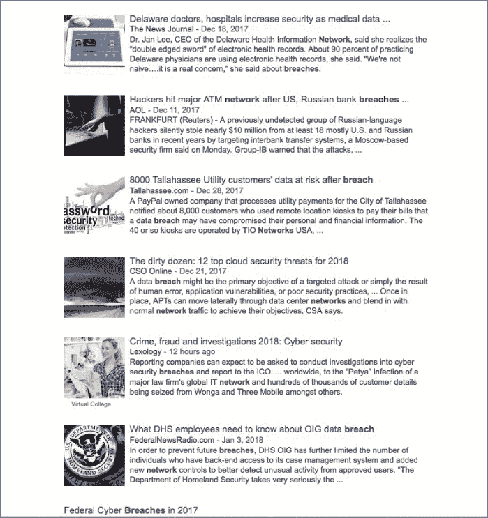

# 第十章：你有 M.A.P.P. 吗？

> *我非常相信控制你能控制的事情，忘记你无法控制的事情，不要浪费精力在那些不值得的事情上。*

> —乔希·西特龙

我觉得一本专注于培养专业社会工程师的书籍如果没有这一章，就不会真正完整。你可以结合所有的攻击、心理学、生理学和报告撰写来实现一些东西，但是没有 M.A.P.P.，就缺了一个重要的部分。什么是 M.A.P.P.？它代表*减轻和预防计划*。

为什么你需要一个减轻和预防计划？你如何帮助你的公司或你的客户制定一个？你可以减轻和规划哪些社会工程攻击？我在这一章中回答了这些问题。

当我开始与我的客户积累经验时，我意识到了一件重要的事情。我的目标需要是非常奇特的：变得如此出色，以至于最终我会失业。是的，你没看错。我需要帮助我的客户学会如何防御社会工程攻击，以至于最终他们不再需要我。

你知道那些宣传他们*总是*有 100%成功率的渗透测试公司吗？好吧，对于一个客户来说，知道他们永远不会变得更好，写支票给你有多么泄气。或者无论他们变得多么出色，社会工程师仍然总是会赢？其中的信息是没有希望。他们所做的任何事情都永远无法堵住他们安全防御的所有漏洞。最终，你可能会明白为什么客户会说，“为什么要费力保护自己呢？”

在我的顿悟中，我决定我必须帮助我的客户计划如何减轻攻击，并计划如何变得如此擅长捕捉这些攻击，以至于最终他们所需要的只是维护。如果你像我一样是专业的社会工程师，那么你需要这一章来取得成功。如果你是一家公司，这一章将帮助你规划你的 M.A.P.P.。

当我意识到我需要改变我的健康状况时，这对我产生了影响。我尝试了很多自己的方法，结果都很糟糕。在白帽子黑客社区中，我看到了一些人做出了一些严重的健康改变。我和其中一位交谈，问他是如何做到的，他让我与一个名叫乔希·西特龙的人联系。

乔希想要通过视频聊天进行我们的第一次交谈。我真的不想——我想象他身材超好，我最不想做的就是与我的胖身影一起在摄像头前视频聊天。更糟糕的是，我查了一下他在互联网上的信息，不难找到一些他的照片。他是某种可以举起小车但仍然可以跑六英里的野兽人类嵌合体。

现在，想象一下，如果在我与乔什的第一次会议中，他的开场白是：“好的，克里斯。这是交易的条件。如果你按照我说的做，如果你听从每一个字，永远不作弊，继续支付我……那么，你永远也赢不了。你会一直胖下去，也许永远都不会变强壮。所以，让我们开始吧！”我可能会觉得乔什疯了！或者如果他在视频聊天中轻蔑地看着我，因为他所看到的只是一个胖子，那么我很可能不会继续跟他合作。

然而，乔什告诉我，如果我按照他说的做，我会看到渐进的变化，当我达到目标时，我们将转移到一个仅维护的计划。因为他也尊重我，我准备好了。

乔什帮助我制定了一份可以减少不良习惯风险并养成新的更好习惯的 M.A.P.P.。这不是一种激进的饮食方式，将所有像食物一样的东西都剔除，只吃沙拉和悲伤。我改变了习惯，增强了我的决策能力，并获得了在所有情况下做出最佳决策的知识。

这个过程可以直接应用于开发社会工程和安全 M.A.P.P.。我制定了四个步骤，遵循这些步骤将创建这个 M.A.P.P. 并获得所有与之相伴的好处：

+   第一步：学会识别社会工程攻击

+   第二步：制定可行和现实的政策

+   第三步：定期进行真实世界的检查

+   第四步：实施适用的安全意识计划

我承诺的是：如果你遵循这些步骤，你*将*看到你想要的人口变化。这不会一夜之间发生——事实上，取决于诸如人员流动、企业文化等因素，可能需要几年甚至更长的时间——但它*确实*有效。

你准备好开始了吗？  ## 第一步：学会识别社会工程攻击

当我年轻时，我想学会打架，所以我学了一种武术。我记得我第一次见我的教练的那一天。作为一个测试，他让我挡住他向我打出的拳头。在我看来，他似乎凭空创造了针对我头部和身体每一个部位的拳头。我无法挡住一击。

幸运的是，他实际上并没有打我，而是轻轻拍了我一下，但每一击都击中了。快进一年：我已经成功地阻挡住了大多数来袭。改变的是我学会了识别攻击的外观和感觉，因此我不仅能够识别，还学会了如何应对。

第一步似乎很简单，但事实并非如此。你认为你公司有多少人能够定义钓鱼、vishing、SMiShing 和冒充攻击？你认为有多少人意识到你的垃圾箱供应商的名字在攻击者手中有多危险？你认为你的员工中有多少人知道恶意软件、勒索软件和特洛伊木马？

不要误会：我并不是说每个员工都需要成为社会工程师的李小龙，但每个人至少需要了解战斗可能涉及的内容。了解攻击是什么，它们可能是什么样子，以及它们对你可能造成的影响的第一步至关重要。

你可能会坐在那里问：“但我们该如何做到这一点？”这是一个很好的问题。想象一下，如果我走进那个道场，教练对我说：“好的，你想学习战斗吗？和这位已经战斗了 20 年的五段高手上场吧。”我会从道场里跑出去。如果他只是让我在电脑前坐 20 分钟，给我看一个关于武术的 CBT（基于计算机的培训视频），然后让我上场，我会有类似的反应。（放下长矛。我并不是说基于计算机的培训完全没有用，但依赖它作为您计划的主要部分是一个错误。CBT 有特定的作用，我稍后在本章中会谈到。）

我从我的教练那里得到的——以及您应该从社会工程专家那里期望得到的——是如何识别和*承受*社会工程形式的“打击”。我接受了正确的站姿和身体位置训练，然后我被安排在重袋和轻袋前。当教练觉得我准备好了，我和一个不想杀死我的人进行了搏斗；他想帮助我学习。

学习如何识别和了解这些攻击存在的第一步将使您的团队领先于普通人数光年。帮助您的员工了解他们所拥有的信息的价值——电子邮件可以用来入侵整个公司；电话用于获取密码和其他敏感信息；如果他们的移动设备遭到入侵，它可以用来攻击他们的家庭和工作网络；而且只因为一个人面带微笑友好，你不能忽视佩戴徽章的政策。

帮助您的员工了解可能的攻击可以让他们更加警觉。因为我每天都在做这件事，有时候我会忘记并不是每个人都知道这些攻击存在。

我和一个朋友坐在一起，他告诉我他的祖母因为有人打电话声称是她的孙子需要保释金而通过 MoneyGram 转账了一大笔钱。我说：“哦，不。她中了奶奶诈骗！”

他问道：“什么？”

我解释了这种类型的攻击是多么常见。他的反应是愤怒，他说：“如果你知道这些事情存在，为什么不警告你的朋友？”

哇，他说得对。我只是假设每个人都读过这些事情，但事实并非如此。我的警告会拯救他们吗？也许不会，但教训仍在那里。

回想一下我与健康和健身教练乔希，训练师的经历。在那次最初的视频聊天会议之后，有一段时间我每周都要给他发送我的日志，而且有失败的日子。你知道乔希从来没有做过什么吗？他从来没有像对待孩子一样责骂我，从来没有让我感到愧疚，从来没有放弃过我。相反，他会说：“好的，这周我们做得更好些吧。”

应用并从中学习。不要假设对于这些攻击的知识只是常识。当某人没有这方面的知识时，这并不意味着他们就是愚蠢、无聊且注定失败的。相反，要有同情心，思考：“好吧，下次我们可以做得更好。我们怎么做呢？”这将真正帮助你使下一步更成功。## 第二步：制定可操作和现实的政策

乔希启动我的其中一件事就是学会了真正的食物份量是什么样的。他会告诉我一天应该消耗多少蛋白质、碳水化合物和脂肪，然后由我来做决定。所以，我可以一顿饭把它全部消耗掉，但之后我会非常饥饿。

乔希还教会了我不要只依赖我的眼睛。他曾经告诉我，在盘子里放上我认为是几种食物正确份量的量。然后我要去称重。哇，重量远远超出了我曾经猜测过的。这条规则或“政策”帮助我学会了一个关于改变我的决策习惯的宝贵教训。

在安全世界中，“政策”可能听起来像是一个坏词。大多数人讨厌制定政策、执行它们和/或遵循它们。我发现政策经常因为它们没有意义或意图不清晰而受到指责。有时，政策是如此限制性，以至于它们似乎在与人群之间建立对抗性关系。

找到平衡并不容易，但对于成功创造一个充满安全意识文化的安全环境至关重要。

一个好政策是什么样的——既不太限制，又可行而现实？有几个方面是一个好政策的，这将帮助你建立稳固的改进规则。

### 将思考从政策中剔除

太多时候，政策过于宽泛和笼统，以至于可以将太多思考或决策交给尚未接受过有关这些攻击是什么的教育的人。现在，我并不是说你应该把你的员工当成笨蛋。只是要知道，员工花在思考某事上的时间越少，越好。简单最好。

这是一个例子：我的公司为一家大型金融机构做了一些诈骗工作，超过 80%的时间，我们成功地获得了目标的非常个人的细节。我们利用他们的同情心和信任，并利用了这些东西。

值得赞扬的是，这家公司有真正友善的员工，我们不希望这种情况发生变化。如果减轻建议是“让你的员工更加偏执和不信任”，那将是多么可怕。这家公司所做的令人震惊。他们制定了一个真正可行的政策：“不允许向未经身份验证的用户提供任何信息。”

他们并没有止步于此。他们定义了什么是有价值的信息以及如何正确验证用户。然后他们做了一件让巨大差异的事情：如果问题没有被正确回答，他们禁止员工继续前进。例如：

| **攻击者：** | 你好。我是乔·史密斯。我需要我的账户信息。我有我的账号，但我忘记了密码。你能帮我吗？ |
| --- | --- |
| **代理人：** | 当然可以。但在我这样做之前，乔，我需要你验证你的身份。你能……代理人将被指示提出一系列问题，输入答案到文本框中，只有正确的答案才能解锁代理人继续前进的能力。 |

我跟进了政策并进行了一些教育，然后我们再次测试。当代理人掌握了这个出色的政策、扎实的教育和知识时，他们变得无懈可击。他们仍然是善良的人——事实上，至少有十几次代理人真的很难过，因为他们无法帮助我，尽最大努力找到方法，但却无法做到。政策和教育使代理人能够保护自己，而无需考虑该做什么。### 消除同理心绕过的能力

这个指南并没有说“去除同理心”。我绝不会建议那样做。然而，你需要去除同理心激发绕过的能力。

我在英国有一个好朋友，莎朗·康海迪。当她怀孕晚期时，她做了一份 SE 工作。她利用怀孕来发挥同理心的作用。

莎朗装满了一个大箱子，里面装着看起来很重的物品。当她走向门口时，夸大她与箱子的斗争，多名男子跑来帮助她。他们不仅把箱子搬到了服务器室，而且甚至没有想到检查她的身份证或徽章。毕竟，罪犯永远不可能怀孕，对吧？

这些家伙在帮助一位怀孕妇女时做了正确的事情。你绝不希望阻止人们表现出那种关心。相反，公司制定了一项政策，教育员工应该始终帮助有需要的人，但在将任何人引导到公司任何地方之前，要检查是否有适当的身份证。

仅仅说“检查所有身份证”是不够的，因为当同理心发挥作用时，那个古老的杏仁核会关闭逻辑中心，使人们仅仅基于情感思维做出决定。教育、提醒和明确的指示有助于消除同理心绕过，并确保安全流程。### 使政策现实可行

我亲眼见过一些政策，上面写着“不要点击恶意链接”。这听起来怎么样？如果你说：“是的，太好了——我会用这个”，我想让你放下这本书，慢慢地用后面的封面扇自己一巴掌。

现在你已经完成了，继续阅读吧。

那种政策很糟糕，因为对员工来说不够详细。他们怎么知道什么是恶意链接？他们知道[支持-微软.com](http://support-microsoft.com)和[微软.com](http://Microsoft.com)不一样吗？

这个政策没有包含一个*if*条款。如果你点击了链接，那么呢？这个政策需要进一步的补充，比如说：“如果与电子邮件、电话呼叫或真人互动，并且你觉得有些不对劲，请将所有这些情况报告给 xxxxxxx@company.com。”

但等等，还有更多！现在你需要告诉你的员工*如何*正确报告——转发电子邮件，发送来电显示信息等等。你希望报告哪些细节？报告的后果是什么？

一个现实的政策帮助员工从各个角度看待问题，并且不留下疑问。在与一家公司合作时，我帮助制定了关于网络钓鱼的新政策的教育。它大致是这样的：

> *网络钓鱼对我们公司和你个人都构成威胁。恶意攻击者想要获取你的信息，他们可以通过基于电子邮件的攻击来实现。他们可能使用带有扩展名如 EXE、PDF、XLS 或 DOC 的恶意文档。或者他们可能向你发送链接到不是它们所说的网站，并包含恶意软件或其他危险程序。*
> 
> *如果你收到来自任何来源的电子邮件，你不确定是否安全，请在采取行动之前将其报告给 abuse@company.com，点击电子邮件的 FORWARD，并在“TO”部分输入该地址。*
> 
> *来自该部门的某人将在 24 小时内回复，告诉你那封电子邮件是否安全。*
> 
> *如果你点击了链接或打开了附件，并且觉得可能存在恶意，还不算太晚。请将该电子邮件报告给滥用部门。*

当然，政策中还包含更多信息和内部培训以及其他资源的链接。你明白了，对吧。一个好的政策是现实的，并清晰地指导应该采取和不应该采取的行动。

回到我的武术故事，这一步就像教练向我展示如何站立，如何握住我的手臂和手，并告诉我应该看哪里，并解释每一件事情为什么重要。一个好的政策不仅帮助人们知道做什么，它还解释了为什么。如果做得好，最终你的员工群体将对这些事情有肌肉记忆。

当发生这种情况时，你就准备好进入第三步了。## 第三步：进行定期的现实世界检查

每周，我都会给乔什发送一张表，上面列出了我的热量摄入量、锻炼情况、睡眠情况、体重等一系列详细信息。每天，我记录这些项目，知道他会看到。这种真实世界的检查让我保持在正确的轨道上。它还帮助我牢记目标，并提醒乔什不一致或出现问题。

有一次我经常出差，停止了跟踪并尝试猜测。当乔什看到事实和数据并不完全吻合时，他问了我一系列问题，然后我们找出了问题的根源，以便纠正它并继续前进。这种真实世界的检查使得一个成功的程序和一个失败的程序之间产生了差异。

这正是你的安全计划的第三步。你已经向你的员工提供了有关这些攻击的教育。你已经向你的员工提供了在遇到这些攻击时该怎么做的培训。你已经制定了政策，帮助他们在遭遇攻击时做出最佳决策。现在，所有这些信息都记住了吗？当员工被测试时，肌肉记忆会发挥作用吗？唯一的方法是选择合适的安全顾问合作伙伴并与他们合作。

选择你的顾问合作伙伴是重要的。如果你是希望成为一家公司供应商的社会工程师，那么你需要知道一个聪明的公司正在寻找什么。记住，这不仅仅是始终保持 100% 或者做过最惊人的黑客攻击，更多的是关于你的知识以及如何将其应用于帮助公司改进。

你怎么知道你正在考虑的合作伙伴是否合适？以下是一些建议：

+   **提出好问题。**  不要害怕要求讲述之前工作的故事，或者公司如何建议处理特定情况。答案是否符合你的核心价值观？

+   例如，我曾经咨询过一家公司，他们问我应该如何建议他们处理那些在我们的测试中失败的人。我的答案是诚实而简单的：我告诉他们，教育人们了解他们做错了什么是至关重要的，在教育后重新测试他们，然后确定他们是否对组织构成威胁。但是系统地解雇因失败而解雇的人是一个糟糕的想法。这个答案与他们的信仰体系一致，是一个很好的匹配。在第一次与一家雇佣我进行社会工程工作的公司的发现会议中，他们经常问我打算使用的确切攻击场景。我通常告诉他们，我需要在开发任何主题之前进行 OSINT，但然后提供我在类似公司做过的事情作为例子。

+   如果你是寻求合作伙伴的公司，那么带着好问题进入会议，如果你是回答这些问题的公司，那么给出好答案。

+   **具有资格的推荐人。**寻找允许你将其作为推荐的公司可能很难，因为很多客户不想公开它们为他们提供的社会工程服务。许多大型组织都是通过它们的供应商遭受了入侵。在我的情况下，我找到了三到四个客户，他们允许我将他们作为未来客户的推荐人。如果你能够得到推荐，我认为这是谜题的一个非常重要的部分。从第三方了解与你想要雇佣的公司合作的情况会有所帮助。

+   请记住，没有供应商会给你一个生气的客户作为推荐人。目标是了解他们如何与客户合作以及他们提供的质量。

+   **清楚地定义规则。**作为客户，最糟糕的事情莫过于认为渗透测试只会进行一层深入，然后发现渗透测试人员已经深入到了五层，所以现在你必须向你的老板解释发生了什么。确保没有问题的最佳方法是为测试制定一套明确的规则，以便不会越界。明确定义的规则就像拳击手在拳击比赛中穿的保护装备。

作为寻找渗透测试人员的客户，你可能有一些你喜欢在选择供应商时使用的要求，但这三个是确保你选择最佳合作伙伴的良好起点。

一旦你选择了一个合作伙伴，就开始测试，然后利用结果确定你需要什么样的服务以及你将如何频繁地接受测试。一个好的合作伙伴可以帮助你确定需要什么，并且也会诚实地告诉你你的需求（而不是基于金钱符号）。

有些服务最好是每月进行一次，比如钓鱼测试。其他服务最好是年度服务或半年度服务，比如渗透测试。没有一种适合所有情况的解决方案——这在很大程度上取决于你的需求以及你想要实现的目标。

另一个因素是你如何有效地应用第四步。## 第四步：实施适用的安全意识计划

Josh 会发布一些关于自己进行某些锻炼、跑步和参与其他健康活动的视频。他发布的视频是对他的项目进行解释的小教育片段。这就像应用安全意识计划一样。

也许你正在那里想：“你刚刚不是讲了安全意识吗？这是重复的吗？”嗯，不；不完全是。所有前述步骤当然都是你的安全意识计划的一部分，但这一步特别关注你如何将前三步应用到创建真正可行和适用的意识计划中。

让我给你讲另一个故事来帮助说明。我曾经有一个客户，我们为他进行了一系列的测试。我的安全工程团队投入了大量时间进行开源情报收集，然后进行了电话钓鱼和网络钓鱼攻击。

我们发现，在电话诈骗方面，公司的人员几乎有着不可思议的能力来阻止我们。他们拒绝提供姓名，不给出分机号，甚至不确认某人是否在办公室。但当我们对他们进行网络钓鱼攻击时，我们发现了一些严重的漏洞。

我们研究了他们过去的做法，并发现他们对电话诈骗和网络钓鱼都有一个健全的教育计划，但他们的电话诈骗教育涵盖了所有方面。它教导员工有关攻击的知识，提供真实的场景和实际可操作的政策，并在安全环境中定期对其进行测试。

然而，他们的网络钓鱼计划每年只包括几个基于计算机的视频模块。我本可以向他们推销一个全新的电话诈骗和网络钓鱼培训计划，但他们不需要。相反，我与他们一起制定了网络钓鱼计划，并鼓励他们在电话诈骗计划上*不做任何改变*。换句话说，我帮助他们根据前三个步骤的情况使他们的意识计划适用于公司的具体情况。

下一个客户将*不*是相同的，因为下一个将是不同的，接下来的也将是不同的——所有的都将是独一无二的。这就是为什么创建适用的计划需要一些严肃的工作，并且不能简单地使用模板或模块化的安全方法。

通过使安全意识计划适用于客户的特定需求，您可以帮助他们的员工不仅了解不应该做什么，还了解在发生不良事件时应该做什么。适用的安全意识帮助员工理解并支持已建立的政策和程序。

根据我受 Josh 辅导的经验，这里有另一个例子。当 Josh 告诉我减少某种食物或增加某种活动时，我可以完全支持他的这些改变，即使我不喜欢它们。为什么呢？

+   我看到了这些变化的积极影响。

+   Josh 充分解释了他在做什么，所以对我来说很清楚。

+   当我面临挑战时，他给了我一些可行的成功提示。

+   当我失败时（因为我确实失败了），Josh 并不像个失败者一样责骂我（这就是我感觉的）。相反，他把我当作一个需要更多帮助的人，并试图为下一次制定一个更为可靠的计划。

这个计划帮助我在改善健康方面产生了一些严重的动力，而适用的安全计划也可以为您的安全带来同样的效果。不要假设因为*你*最终明白了，公司中的每个人也会明白。他们可能需要更多的时间来跟上。

回想一下，在你的手机拥有包括带有 GPS 的完全加载的世界地图在内的一切功能之前的那个黑暗时代。你还记得那么久以前的事吗？我记得。

我记得以前用纸质地图寻路。就像第一步——学会识别攻击一样——我在地图上有一个起点。我寻找最快的路线，避开收费公路和小路，同时让我离目的地更近。

然后，就像第二步——拥有可行的现实世界政策一样——我确保我留在高速公路上，这样我就知道我可以最大限度地提高速度。

然后，就像第三步——定期进行现实世界的检查一样——我会定期检查我所在的道路，并将其与地图进行比较，以确保它们匹配。

最后，最后一步是可行的意识计划（第 4 步），就像使用真实地图的最终目标一样；我安全、可靠地从 A 点到达 B 点，而且按照我计划的时间。

在现实生活中有一张地图带我游览了美国的各个地方。在你的安全计划中有一个 M.A.P.P.同样可以帮助你思考你的缓解和预防计划，从而达到同样的效果。

只做一步是不够的，就像只在车上放一张物理地图不能把你从 A 点带到 B 点一样。你需要有一个计划，然后采取行动来使它实现。

我不能保证你们每个人都能变成“安全的乔什”，但这四个步骤可以积极地锻炼你的安全意识。 （看我是怎么做的？）

本章的其余部分描述了其他一些可以帮助你创建你的 M.A.P.P.  ## 必须保持更新

假设你已经掌握了这四个步骤。你能在你的门上贴上“防黑客”的标志吗？

嗯，你可以，但只有在你想要被嘲笑时才会这样。通常，遵循这些步骤会确保你*不是*低 hanging 的果实，并帮助保持你的人际网络抵御攻击。这是一个好地方，但总有可能有公司内的某人会上钩，相信钓鱼、冒充、短信钓鱼或冒充尝试。如果发生这种情况，还有什么可以帮助你更安全地保护自己呢？

确保你的计算机更新。在例行安全审计中，我不知道有多少次发现公司使用的浏览器、PDF 阅读器、邮件客户端甚至（噢！）操作系统已经过时三四个版本。那些旧版本可能包含大量的漏洞。保持系统更新可以保护您免受被黑客攻击并在网络中使用旧软件引发的潜在漏洞。

我写这篇文章时充分意识到，这比做起来要容易得多。我意识到可能存在需要时间、精力和金钱来升级的传统系统。但是，请记住，截至 2017 年，平均安全漏洞给公司造成的损失为 362 万美元。而且那只是平均数！在 2017 年，有些漏洞的成本高达 1 亿至 3 亿美元。

我并不天真到认为更新会拯救这些公司中的每一家免受入侵，但我试图表明一个观点。你可以在入侵之前（保护自己免受入侵）或之后（付出后果的代价）承担成本。但是如果你对安全的想法类似于图 10-1，那我们可能需要进行更严肃的讨论。

**图 10-1** 这并*不是*安全。

把头埋在沙子里，*希望*掠食者看不见你不会使这成为事实。决定你何时愿意付出代价：在入侵之前还是之后。我赞成在之前—尽管可能会花费时间、金钱和压力，但这会保护你的客户和声誉，并避免你因被入侵而尴尬。  ## 让同行的错误成为你的教师

前往谷歌，输入**网络入侵**这些词，然后点击新闻选项卡。当我这样做的那天，我看到了你在图 10-2 中看到的内容。

**图 10-2** 目前新闻的简单示例

每个故事都包含入侵的详细信息，包括如何发生，造成的原因以及利用了什么漏洞（无论是人为、硬件、软件还是所有这些）。了解影响其他公司的攻击可以帮助你的公司保持安全。

当你看到某个防火墙正在使用当前的漏洞并且已经侵入了公司时，就该检查一下你的网络中是否有这个防火墙，并且是否已打了补丁。当你看到商业电子邮件欺诈（BEC）钓鱼诈骗正在增加时，就该通过教育和适当的政策来加强对其的防范。无论你读到的入侵事件的原因是什么，开始记录当前的威胁并将其与你的基础设施进行比较以查看哪里存在漏洞，这都是一个好的经验教训。

有很多公司提供威胁建模服务来帮助应对这个问题，你可能需要他们的帮助。否则，开始自己进行建模并确定你在哪里可以加强、巩固和加强你当前的程序和协议，以保持对攻击的警惕。  ## 创建安全意识文化

我将再次以乔及其对我的培训为例来说明这一点。在与乔一起工作一段时间后，更容易识别可能会危及我的进展的行为和情况。例如，不在一天中计算我的卡路里，或者试图估计一份食物的份量而不是称重，通常是可能导致没有适当增益的小行为。另一方面，去一家自助披萨店，并试图说服自己只吃两片后就停下来，将是一个重大挫折。

乔帮助我意识到，我一天中所做的决定可以让我养成健康的生活方式。当我只需要 6 盎司的牛排时，我就不需要 24 盎司的波特豪斯牛排。如果我想吃甜点，我需要确保我在一天的早些时候做出更好的决定，这样我就不会毁了整个计划。等等等等。

这与在你的组织中创建一种安全意识文化有什么关系？一切！

通过适当的培训、提醒和奖励，你可以创造一种文化，让你的员工知道他们所做的微小决定可能会产生长远的影响。他们将意识到，如果做出错误的选择，重大决策可能会具有毁灭性的影响。

在我与乔一起工作时，奖励是减肥、感觉更好、看起来更好，以及总体健康状况更好。这种奖励对我来说是一个很好的动力，让我坚持下去。并不是每个员工都会对“捕捉钓鱼者”或“报告虚假信息”感到同样的满足。这并不是因为他们不关心或讨厌公司——只是有些人太忙了，可能会将培训计划视为一种浪费时间的必要之恶。

这些人将是最难转变的，但是转变是可能的。在我工作过的一家公司中，一个部门经理明确表示他讨厌我们正在进行的测试。因此，他的 450 人的部门似乎是该公司最大的威胁之一。恶意软件、网络钓鱼和其他攻击经常在该部门造成问题。

经理意识到他的人员没有遵守规定。他感到沮丧，他想使用耻辱和尴尬的方法，通过公开批评最严重的违规者来施加压力。我从未见过这种方法有效——通常情况下，它会在经理和团队之间建立对抗性关系。在这些情况下，如果有的话，遵从是出于恐惧、愤怒或怨恨。在与客户的会议上，我提议尝试与他们的呼叫中心团队进行一场快速游戏。我说我会给他们寄一个毛绒鱼娃娃，我希望他们宣布每个月第一个**不点击**并**报告**网络钓鱼的人将在他们的小隔间里得到这条鱼。那个人将被称为当月的“钓鱼之王”。

现在，你可能坐在那里认为这听起来像个荒谬的想法。你是对的，确实是。但是两个月后，你不会相信 450 个成年人之间为了在他们的隔间里有那个填充动物而展开的竞争。成为“钓鱼王”成为一种荣誉徽章。

结果不仅仅是我们的项目与员工之间的互动增加了。由于员工积极寻找钓鱼网站，报告的比例在几个月内从仅为 7%增加到了 87%以上。同时，点击率从约 57%下降到了不到 10%。最令人满意的结果是，在同一时间内，实际在网络上发现的恶意软件下降了超过 79%。

这个简单的改变创造了一个安全意识文化。员工开始做出更好的决策，他们看到了变化，并且他们被激励保持这种变化。

什么会让你的组织发生改变？我不能准确告诉你需要什么，而不与你交谈，但这里有一些多年来我见过有效的几个想法：

+   **奖励** 我见过从之前提到的毛绒鱼娃娃到抽奖赠送礼品卡等一切奖励行为的情况。当然，如果你的团队规模庞大，奖励可能会变得很昂贵，或者如果奖励不实用或太微不足道，它可能会缺乏激励力量。在一个组织中，他们尝试每个季度向那些整个季度保持理想行为的人赠送一张价值 5 美元的礼品卡。奖励太小，不能激励。奖励需要激励，但这并不意味着它必须是一台全新的 60 英寸平板电视或一年的薪水。它只需是一些能代表你有多么感激所要求的行动和态度的东西。

+   **正面强化** 我见过一些公司在其企业内网上列出了那些保持了 X 个月理想行为的人的名单。有些人在他们的企业内网页面上称赞“明星员工”，那些连续 X 个月抓到钓鱼网站的人。正面强化比耻辱和尴尬要好得多，它以正确的理由激励持续的理想行为。

+   **额外培训** 在你开始烧毁我的谷仓之前，让我解释一下我所说的“额外培训”是什么意思。我见过许多公司成功举办了他们称之为“午餐和学习”的课程。他们提供比萨或其他类型的食物（如果你邀请我，请提供沙拉或其他健康食物，这样乔什就不会生我的气），然后他们进行一个关于某个安全主题的简短演讲、视频或演示，这些对参加者有益。当然，起初参加者可能只是为了免费食物而来，但我参加过的会议总是以许多人至少能带走一点有用信息而结束。这也是你巩固你想要员工采取的概念和行动的好机会。

+   **自上而下的强化** 这似乎具有近乎神秘的力量，就好像你在你的员工群体上施了魔法。当 CEO 告诉团队他们每个月也会受到员工群体的钓鱼攻击，并说明他或她的表现如何时，这传达了一个非常明确的信息：“我们共同努力……真的。” 我曾与一个组织合作，该组织对钓鱼计划的初始反应不尽理想。在一个极端案例中，一名女性在收到钓鱼邮件时采取了所有错误的行动，她非常生气，要求我打电话，她花了 10 分钟责骂我。她告诉我我是一个可怕的人，需要重新评估我的人生道路。几个月后，这家大型组织的 CEO 举行了一次全员企业会议。在会议上，CEO 提到了钓鱼计划；他解释说他像其他人一样被钓鱼攻击，他正在意识到自己需要更加警觉。仿佛有一种神秘的护身符在员工群体上挥舞，愤怒消失了，对我的 SE 团队的攻击大大减少，我们看到了更大比例的遵从。有时员工群体会觉得他们被单独挑出来被当作愚蠢的样子。这可能导致对抗性关系，让公司的高层管理支持这一倡议真的有助于解决问题。

这里还有两点你应该记住：

+   +   **要有耐心**

        不要假设因为你现在正在正确培训他们，你的员工群体会立刻跟随潮流。让员工看到你的愿景并对其充满热情可能需要时间和持续的努力。

    +   **管理期望**

        这听起来熟悉吗？应该的。这不仅可以帮助建立融洽关系，还可以帮助你在公司内部创建一种安全意识文化。仅仅因为你能识破钓鱼邮件或识别电话诈骗或找出不属于公司的人，并不意味着每个员工都会如此迅速做到。

通过耐心和管理期望，你将帮助你的员工与新的教育保持一致。  ## 总结

虽然一开始可能很难相信你能做到这一点，但你可以创造一种安全意识的文化。你可能会看到你目前的“状态”并认为这需要太多的努力或时间。然而，这种努力是值得的。拥有安全意识文化的回报远远超过风险。

在 Josh 发给我的一封电子邮件中，他说：“这是一次终身旅程，而不是 3 到 12 个月的旅程。改变习惯是*困难*的，但我们都在不断进步。”

这并不意味着你应该一直做同样的事情并希望情况会好转。快速失败并继续前进很重要。尝试本章中的某些内容，如果不起作用，不要继续。看到它不起作用，尝试新的方法。

乔什经常改变我的计划，有时每周一次。计划保持不变超过一个月是罕见的。我不是说你需要这么频繁地调整，但其中有一个教训。为了让我的计划奏效，我必须每周与乔什核对，向他展示我上周的全部情况。然后他会考虑到我的出行、饮食选择、运动量，甚至我这周的个人问题水平。所有这些信息帮助他看到是否需要做出改变以保持进展顺利。我相信他进行了大量分析，并且有一个决策的流程。

这直接关系到你如何将这一章节应用到你的 SE 意识计划中。确保你对组织有一个全面的了解——从测试的物理方面到员工群体的心理学。试着了解他们可能面临的压力以及这如何影响他们的决策。一旦你有了这个全面的画面，就更容易规划你的安全计划。制定一个清晰的前进路径，启动计划，然后观察它的进展。

我不能告诉你这会让你免受黑客攻击。我甚至无法预测你将看到的成功率。然而，我可以承诺你会看到变化。我可以承诺你将开始创造一个不仅知道有哪些攻击类型存在，而且能够抵御这些攻击的人文化。

你如何将这本书中的所有知识应用到成为社会工程渗透测试员或作为一家寻求抵御社会工程师的公司？最后一章帮助将这一切联系在一起，我保证我甚至不会提到乔什。（抱歉，乔什。你的 15 分钟已经结束了。）
