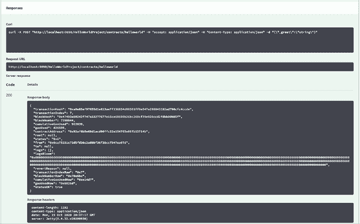

# Web3j - OpenAPI

> 原文：<https://blog.web3labs.com/web3development/web3j-open-api>

我们在 Web3 实验室的目标之一是让以太坊的开发尽可能简单。在过去的三年中，我们看到许多团队(包括我们自己)在 Web3j 之上一次又一次地编写 RESTful 服务，为他们的服务器应用程序提供与以太坊的直接集成。今年早些时候，我们决定对此做些什么，并很高兴地宣布了 [Web3j 开放 API](https://github.com/web3j/web3j-openapi#web3j-open-api) 项目。这个最新的项目允许您轻松地签订智能合同，并生成符合 OpenAPI 的服务器应用程序(通过 Swagger 使用完整的 OpenAPI 文档)。

要了解更多关于如何从 API 而不是以太坊集成代码的角度开始思考，请继续阅读！

## **Web3j open API 生成器**

Web3j-OpenAPI 是一个用于 Solidity 智能合约的 OpenAPI 生成器。它提供了一种通过简单直观的 HTTP 请求与以太坊区块链进行交互的方式。这些交互可以使用普通的 HTTP 请求或者通过 Swagger-UI 来完成，每个项目都会生成 Swagger-UI。

工作流程可以总结为以下步骤:

*   写一份可靠的智能合同
*   使用 Web3j-OpenAPI 生成相应的 OpenAPI 项目
*   将生成的项目作为独立服务器运行
*   使用 Swagger-UI 或使用我们的客户端实现从客户端应用程序发送 HTTP 请求

## **例子**

以下 Hello World 合约:

```java
// SPDX-License-Identifier: Apache-2.0
pragma solidity ^0.7.0;

// Modified Greeter contract. Based on example at https://www.ethereum.org/greeter.

contract Mortal {
    /* Define variable owner of the type address*/
    address owner;

    /* this function is executed at initialization
       and sets the owner of the contract */
    constructor () {owner = msg.sender;}

    modifier onlyOwner {
        require(
            msg.sender == owner,
            "Only owner can call this function."
        );
        _;
    }

    /* Function to recover the funds on the contract */
    function kill() onlyOwner public {
        selfdestruct(msg.sender);
    }
}

contract HelloWorld is Mortal {
    /* define variable greeting of the type string */
    string greet;

    /* this runs when the contract is executed */
    constructor (string memory _greet) {
        greet = _greet;
    }

    function newGreeting(string memory _greet) onlyOwner public {
        emit Modified(greet, _greet, greet, _greet);
        greet = _greet;
    }

    /* main function */
    function greeting() public view returns (string memory)  {
        return greet;
    }

    event Modified(
        string indexed oldGreetingIdx,
        string indexed newGreetingIdx,
        string oldGreeting,
        string newGreeting
    );
}
```

我们可以使用 Web3j OpenAPI 创建一个 RESTful 服务来部署并无缝集成这个应用程序。该服务包含一个 Swagger UI，因此您可以轻松地试用它。


## **入门**

## 创建新的应用程序

要使用 [Web3j-OpenAPI](https://docs.web3j.io/4.8.7/web3j_openapi/) 生成器生成 OpenAPI 项目，您需要在您的机器上安装 Epirus-CLI(注意——epi RUS CLI 已经取代了 Web3j CLI)。

使用以下命令安装 [Epirus-CLI](https://docs.epirus.io/getting_started/#free) (找到 [Windows 指令](https://docs.epirus.io/quickstart/#installation)

```java
$ curl -L get.epirus.io | sh
```

要检查安装是否成功以及 OpenAPI 生成器是否正常工作，请运行以下命令:

```java
$ epirus openapi import --help
```

您应该会看到生成器帮助显示:


在本文中，我们将使用上面的 Hello World 契约。首先，将名为 HelloWorld.sol 的文件中的上述代码复制到本地目录中。

然后，执行以下命令:

```java
$ epirus openapi import \
    -s=HelloWorld.sol \
    --package=com.tutorial \
    --project-name=HelloWorldProject \
    --output-dir=. 
```

您应该会看到类似如下的输出:


这意味着 OpenAPI 项目与 SwaggerUI 一起成功生成。验证您的目录中是否有一个名为 HelloWorldProject 的文件夹。

如果是这样，那么您就成功地使用 Web3j-OpenAPI 生成了您的第一个 OpenAPI 项目。

还有其他方法可以生成 OpenAPI 项目。请在[文档](https://docs.web3j.io/4.8.7/web3j_openapi/)中检查它们。

下一步是运行项目。

您可以使用 [Epirus-CLI](https://docs.epirus.io/getting_started/#free) 毫不费力地运行项目，无需指定任何配置。

如果没有，您需要指定运行时参数:例如，用于签名的私钥或钱包文件、要连接的节点端点等。

### 配置环境

要检查所有可用选项，请使用- help 标志运行项目:

```java
$ cd HelloWorldProject
$ ./gradlew run --args="--help"
```

您将看到以下显示:


有多种方法可以指定这些参数:

*   环境变量
*   配置文件
*   直接从 CLI

这里我们将通过环境变量传递参数，但是您可以在[文档](https://docs.web3j.io/4.8.7/web3j_openapi/)中阅读其他选项。

为此，请运行以下命令:

```java
$ export web3j_ENDPOINT = <link_to_your_ethereum_node>
$ export web3j_PRIVATE_KEY =<your_PRIVATE_KEY>
$ export web3j_open API_HOST = localhost
$ export web3j_open API_PORT = 9090
```
### 运行应用程序

按如下方式运行应用程序

```java
$ ./gradlew run
```

您应该能够运行服务器并看到以下内容:


### **与 API 交互**

运行项目后，您将定义端点，等待请求。为了发送请求，我们将使用生成的 Swagger-UI。

### 使用 SwaggerUI

Swagger-UI 可以通过以下链接访问:`http://<host>:<port>/swagger-ui`。

在我们的例子中，它将位于[http://localhost:9090/swagger-ui](http://localhost:9090/swagger-ui)。

然后，使用端点 POST/HellowWorldProject/contracts/hello world 来部署您的契约:


如果合同部署成功，您应该会看到一个事务接收模型:



如果没有，您应该会收到一条错误消息，您可以在响应或服务器日志中看到这条消息。

然后，我将通过提供我们在之前的交易收据中收到的合同地址来调用 greeting GET 方法:


您应该会看到以下响应:


### 通过 Java/Kotlin 进行交互

我们还可以使用 Java 或 Kotlin 客户端与 OpenAPI 项目进行交互。

为此，首先将 Web3j-OpenApi 客户端依赖项添加到您的项目中:

```java
dependencies {
    implementation "org.web3j.openapi:web3j-openapi-client:4.7.1"
}
```

然后，按如下方式与服务进行交互:

```java
var service = new ClientService("http://localhost:9090");
var helloWorldProject = ClientFactory.create(
    HelloWorldProjectApi.class, service
);

System.out.println("Deploying the HelloWorld contract...");

var deployParams = new HelloWorldDeployParameters("Hello");
var receipt = helloWorldProject.getContracts()
    .getHelloWorld().deploy(deployParams);

System.out.println("Deployed contract address: " +
    receipt.getContractAddress());

// Load the contract from the returned transaction receipt
var helloWorld = helloWorldProject.getContracts()
    .getHelloWorld().load(receipt.getContractAddress());

// Change the greeting message
var newReceipt = helloWorld.newGreeting(
    new NewGreetingParameters("Hello Web3j-OpenAPI")
);

System.out.println("NewGreeting transaction hash: " +
    newReceipt.getTransactionHash());

// Check that the smart contract has been updated
var greeting = helloWorld.greeting().getResult();
System.out.println("Greeting method result: " + greeting);
```

根据您使用的网络，部署可能需要一些时间。

### 处理事件

在 Web3j-OpenAPI 中，我们使用[服务器发送的事件](https://docs.huihoo.com/jersey/2.13/sse.html) (SSE)来处理事件。

简而言之，SSE 是一种单向机制，一旦客户端建立了客户端-服务器连接，它就允许服务器将数据从服务器异步推送到客户端。

要从 Kotlin/Java 中查询事件，请像上面一样添加 Web3j-OpenAPI-client 依赖项。然后，使用以下代码:

```java
var countdownLatch = new CountDownLatch(1);

// Start listening for events
helloWorld.getEvents().getModified().onEvent(e -> {
    System.out.println("Received event: " +
        modifiedEvent.getNewGreeting());
    countdownLatch.countDown();
});

helloWorld.newGreeting(new NewGreetingParameters(
    "This will trigger a modified event"));

countdownLatch.await(); // Waits for the event
```

然后运行这段代码。您应该能够在屏幕上看到打印的事件。


### **结论**

现在，您已经知道了，开始为您的智能合约构建 API 端点是多么容易的一个演示。鉴于它们现在可以很容易地生成，我们希望您可以开始考虑以太坊集成的 API，而不是到目前为止一直是标准的讨厌的集成代码。

如果您想运行这些应用程序而不必考虑容器化、钱包、资金和网络连接，我鼓励您看看我们的 [Epirus 平台](https://www.web3labs.com/epirus)，它可以用两个命令创建和运行 OpenAPI 项目！