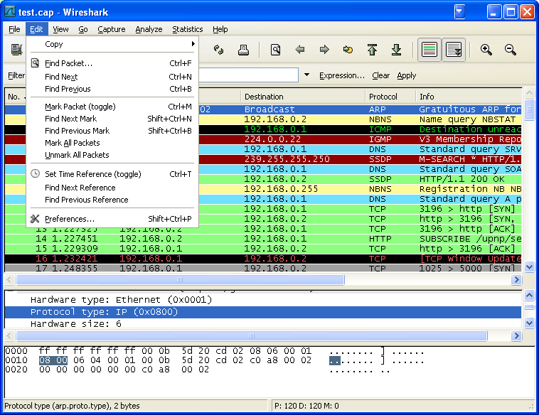
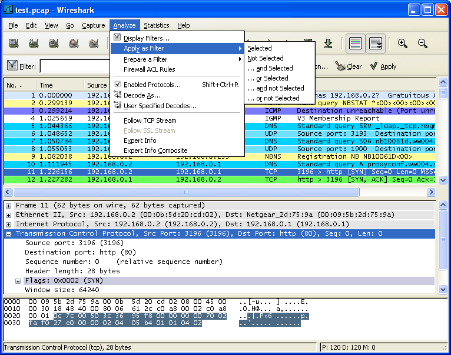
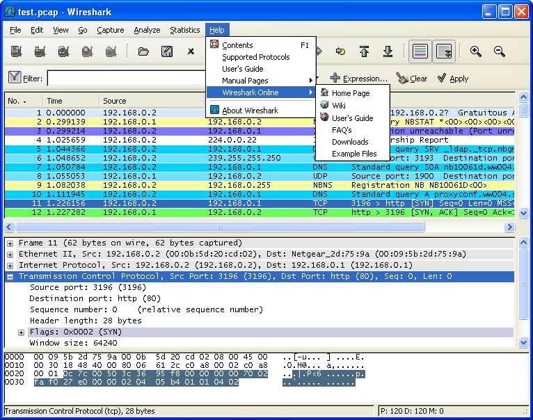
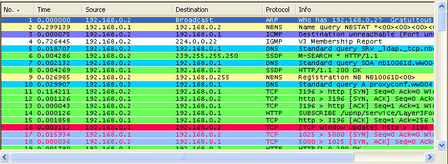

# 第三章 用户界面

**目录**

*   3.1\. 须知
*   3.2\. 启动 Wireshark
*   3.3\. 主窗口
    *   3.3.1\. 主窗口概述
*   3.4\. 主菜单
*   3.5\. "File"菜单
*   3.6\. "Edit"菜单
*   3.7\. "View"菜单
*   3.8\. "Go"菜单
*   3.9\. "Capture"菜单
*   3.10\. "Analyze"菜单
*   3.11\. "Statistics"菜单
*   3.12\. "Help"菜单
*   3.13\. "Main"工具栏
*   3.14\. "Filter"工具栏
*   3.15\. "Pcaket List"面板
*   3.16\. "Packet Details"面板
*   3.17\. "Packet Byte"面板
*   3.18\. 状态栏

## 3.1\. 须知

现在您已经安装好了 Wireshark,几乎可以马上捕捉您的一个包。紧接着的这一节我们将会介绍：

*   Wireshark 的用户界面如何使用

*   如何捕捉包

*   如何查看包

*   如何过滤包

*   ……以及其他的一些工作。

## 3.2\. 启动 Wireshark

你可以使用 Shell 命令行或者资源管理器启动 Wireshark.

> 
> 
> 提示
> 
> 开始 Wireshark 时您可以指定适当的参数。参见第 9.2 节 “从命令行启动 Wireshark”
> 
> 
> 
> 注意
> 
> 在后面的章节中，将会出现大量的截图，因为 Wireshark 运行在多个平台 ，并且支持多个 GUI Toolkit(GTK1.x/2x),您的屏幕上显示的界面可能与截图不尽吻合。但在功能上不会有实质性区别。尽管有这些区别，也不会导致理解上的困难。

## 3.3\. 主窗口

先来看看图 3.1 “主窗口界面”，大多数打开捕捉包以后的界面都是这样子（如何捕捉/打开包文件随后提到）。

**图 3.1\. 主窗口界面**

和大多数图形界面程序一样，Wireshark 主窗口由如下部分组成：

1.  菜单（见第 3.4 节 “主菜单”）用于开始操作。

2.  主工具栏(见第 3.13 节 “"Main"工具栏”)提供快速访问菜单中经常用到的项目的功能。

3.  Fiter toolbar/过滤工具栏(见第 3.14 节 “"Filter"工具栏”)提供处理当前显示过滤得方法。(见 6.3:”浏览时进行过滤”)

4.  Packet List 面板（见第 3.15 节 “"Pcaket List"面板”）显示打开文件的每个包的摘要。点击面板中的单独条目，包的其他情况将会显示在另外两个面板中。

5.  Packet detail 面板（见第 3.16 节 “"Packet Details"面板”）显示您在 Packet list 面板中选择的包德更多详情。

6.  Packet bytes 面板（见第 3.17 节 “"Packet Byte"面板”）显示您在 Packet list 面板选择的包的数据，以及在 Packet details 面板高亮显示的字段。

7.  状态栏（见第 3.18 节 “状态栏”）显示当前程序状态以及捕捉数据的更多详情。

> 
> 
> 注意
> 
> 主界面的三个面版以及各组成部分可以自定义组织方式。见第 9.5 节 “首选项”

### 3.3.1\. 主窗口概述

Packet list 和 Detail 面版控制可以通过快捷键进行。表 3.1 “导航快捷键”显示了相关的快捷键列表。表 3.5 “"GO"菜单项”有关于快捷键的更多介绍

**表 3.1\. 导航快捷键**

| 快捷键 | 描述 |
| --- | --- |
| Tab,Shift+Tab | 在两个项目间移动，例如从一个包列表移动到下一个 |
| Down | 移动到下一个包或者下一个详情 |
| Up | 移动到上一个包或者上一个详情 |
| Ctrl-Down,F8 | 移动到下一个包，即使焦点不在 Packet list 面版 |
| Ctrl-UP,F7 | 移动到前一个报，即使焦点不在 Packet list 面版 |
| Left | 在 Pactect Detail 面版，关闭被选择的详情树状分支。如果以关闭，则返回到父分支。 |
| Right | 在 Packet Detail 面版，打开被选择的树状分支. |
| Backspace | Packet Detail 面版，返回到被选择的节点的父节点 |
| Return,Enter | Packet Detail 面版，固定被选择树项目。 |

另外，在主窗口键入任何字符都会填充到 filter 里面。

## 3.4\. 主菜单

Wireshark 主菜单位于 Wireshark 窗口的最上方。图 3.2 “主菜单”提供了菜单的基本界面。

**图 3.2\. 主菜单**

主菜单包括以下几个项目:

File

包括打开、合并捕捉文件，save/保存,Print/打印,Export/导出捕捉文件的全部或部分。以及退出 Wireshark 项.见第 3.5 节 “"File"菜单”

Edit

包括如下项目：查找包，时间参考，标记一个多个包，设置预设参数。（剪切，拷贝，粘贴不能立即执行。）见第 3.6 节 “"Edit"菜单”

View

控制捕捉数据的显示方式，包括颜色，字体缩放，将包显示在分离的窗口，展开或收缩详情面版的地树状节点，……见第 3.7 节 “"View"菜单”

GO

包含到指定包的功能。见第 3.8 节 “"Go"菜单”

Capture

允许您开始或停止捕捉、编辑过滤器。见第 3.9 节 “"Capture"菜单”

Analyze

包含处理显示过滤，允许或禁止分析协议，配置用户指定解码和追踪 TCP 流等功能。见第 3.10 节 “"Analyze"菜单”

Statistics

包括的菜单项用户显示多个统计窗口，包括关于捕捉包的摘要，协议层次统计等等。见第 3.11 节 “"Statistics"菜单”

Help

包含一些辅助用户的参考内容。如访问一些基本的帮助文件，支持的协议列表，用户手册。在线访问一些网站，“关于”等等。见第 3.12 节 “"Help"菜单”

本章链接介绍菜单的一般情况，更详细的介绍会出现在后续章节。

> 
> 
> 提示
> 
> 你可以直接点击访问菜单项，也可以使用热键，热键显示在菜单文字描述部分。例如：您可以使用 CTR+K 打开捕捉对话框。

## 3.5\. "File"菜单

WireSharkFile 菜单包含的项目如表表 3.2 “File 菜单介绍”所示

**图 3.3\. File 菜单**

**表 3.2\. File 菜单介绍**

| 菜单项 | 快捷键 | 描述 |
| --- | --- | --- |
| **Open...** | Ctr+O | 显示打开文件对话框，让您載入捕捉文件用以浏览。见第 5.2.1 节 “打开捕捉文件对话框” |
| **Open Recent** |   | 弹出一个子菜单显示最近打开过的文件供选择。 |
| **Merg** |   | 显示合并捕捉文件的对话框。让您选择一个文件和当前打开的文件合并。见第 5.4 节 “合并捕捉文件” |
| **Close** | Ctrl+W | 关闭当前捕捉文件，如果您未保存，系统将提示您是否保存（如果您预设了禁止提示保存，将不会提示） |
| **Save** | Crl+S | 保存当前捕捉文件，如果您没有设置默认的保存文件名，Wireshark 出现提示您保存文件的对话框。详情第 5.3.1 节 “"save Capture File As/保存文件为"对话框” |
|   |   |  |
|   |   | 注意 |
|   |   | 如果您已经保存文件，该选项会是灰色不可选的。 |
|   |   |  |
|   |   | 注意 |
|   |   | 您不能保存动态捕捉的文件。您必须结束捕捉以后才能进行保存 |
| **Save As** | Shift+Ctrl+S | 让您将当前文件保存为另外一个文件面，将会出现一个另存为的对话框(参见第 5.3.1 节 “"save Capture File As/保存文件为"对话框”) |
| **File Set>List Files** |   | 允许您显示文件集合的列表。将会弹出一个对话框显示已打开文件的列表,参见第 5.5 节 “文件集合” |
| **File Set>Next File** |   | 如果当前載入文件是文件集合的一部分，将会跳转到下一个文件。如果不是，将会跳转到最后一个文件。这个文件选项将会是灰色。 |
| **File set>Previous Files** |   | 如果当前文件是文件集合 的一部分，将会调到它所在位置的前一个文件。如果不是则跳到文件集合的第一个文件，同时变成灰色。 |
| **Export> as “Plain Text” File…** |   | 这个菜单允许您将捕捉文件中所有的或者部分的包导出为 plain ASCII text 格式。它将会弹出一个 Wireshark 导出对话框,见第 5.6.1 节 “"Export as Plain Text File"对话框” |
| **Export >as "PostScript" Files** |   | 将捕捉文件的全部或部分导出为 PostScrit 文件。将会出现导出文件对话框。参见第 5.6.2 节 “"Export as PostScript File" 对话框” |
| **Export > as "CVS" (Comma Separated Values Packet Summary)File...** |   | 导出文件全部或部分摘要为.cvs 格式（可用在电子表格中）。将会弹出导出对话框,见第 5.6.3 节 “"Export as CSV (Comma Separated Values) File" 对话框” File" 对话框")。 |
| **Export > as “PSML” File…** |   | 导出文件的全部或部分为 PSML 格式（包摘要标记语言）XML 文件。将会弹出导出文件对话框。见第 5.6.4 节 “"Export as PSML File" 对话框” |
| **Export as "PDML" File...** |   | 导出文件的全部或部分为 PDML(包摘要标记语言)格式的 XML 文件。将会弹出一个导出文件对话框,见第 5.6.5 节 “"Export as PDML File" 对话框” |
| **Export > Selected Packet Bytes…** |   | 导出当前在 Packet byte 面版选择的字节为二进制文件。将会弹出一个导出对话框。见第 5.6.6 节 “"Export selected packet bytes" 对话框” |
| **Print** | Ctr+P | 打印捕捉包的全部或部分，将会弹出打印对话框。见第 5.7 节 “打印包” |
| **Quit** | Ctrl+Q | 退出 Wireshark,如果未保存文件，Wireshark 会提示是否保存。 |

## 3.6\. "Edit"菜单

Wireshark 的"Edit"菜单包含的项目见表 3.3 “Edit 菜单项”

**图 3.4\. "Edit"菜单**

**表 3.3\. Edit 菜单项**

| 菜单项 | 快捷键 | 描述 |
| --- | --- | --- |
| **Copy>As Filter** | Shift+Ctrl+C | 使用详情面版选择的数据作为显示过滤。显示过滤将会拷贝到剪贴板。 |
| **Find Packet...** | Ctr+F | 打开一个对话框用来通过限制来查找包，见??? |
| **Find Next** | Ctrl+N | 在使用 Find packet 以后，使用该菜单会查找匹配规则的下一个包 |
| **Find Previous** | Ctr+B | 查找匹配规则的前一个包。 |
| **Mark Packet(toggle)** | Ctrl+M | 标记当前选择的包。见第 6.9 节 “标记包” |
| **Find Next Mark** | Shift+Ctrl+N | 查找下一个被标记的包 |
| **Find Previous Mark** | Ctrl+Shift+B | 查找前一个被标记的包 |
| **Mark ALL Packets** |   | 标记所有包 |
| Unmark All Packet |   | 取消所有标记 |
| **Set Time Reference(toggle)** | **Ctrl+T** | 以当前包时间作为参考,见第 6.10.1 节 “包参考时间” |
| **Find Next Reference** |   | 找到下一个时间参考包 |
| **Find Previous Refrence...** |   | 找到前一个时间参考包 |
| **Preferences...** | Shift+Ctrl+P | 打开首选项对话框，个性化设置 Wireshark 的各项参数，设置后的参数将会在每次打开时发挥作用。详见第 9.5 节 “首选项” |

## 3.7\. "View"菜单

表 3.4 “"View"菜单项”显示了 Wireshar View 菜单的选项

**图 3.5\. "View"菜单**

**表 3.4\. "View"菜单项**

| 菜单项 | 快捷键 | 描述 |
| --- | --- | --- |
| **Main Toolbar** |   | 显示隐藏 Main toolbar(主工具栏),见第 3.13 节 “"Main"工具栏” |
| **Filter Toolbar** |   | 显示或隐藏 Filter Toolbar(过滤工具栏)见第 3.14 节 “"Filter"工具栏” |
| **Statusbar** |   | 显示或隐藏状态栏,见第 3.18 节 “状态栏” |
| **Packet List** |   | 显示或隐藏 Packet List pane(包列表面板),见第 3.15 节 “"Pcaket List"面板” |
| **Packet Details** |   | 显示或隐藏 Packet details pane(包详情面板).见第 3.16 节 “"Packet Details"面板” |
| **Packet Bytes** |   | 显示或隐藏 packet Bytes pane(包字节面板)，见第 3.17 节 “"Packet Byte"面板” |
| **Time Display Fromat>Date and Time of Day: 1970-01-01 01:02:03.123456** |   | 选择这里告诉 Wireshark 将时间戳设置为绝对日期-时间格式(年月日，时分秒)，见第 6.10 节 “时间显示格式及参考时间” |
|   |   |  |
|   |   | 注意 |
|   |   | 这里的字段"Time of Day","Date and Time of Day","Seconds Since Beginning of Capture","Seconds Since Previous Captured Packet"和"Seconds Since Previous Displayed Packet"几个选项是互斥的，换句话说，一次同时有一个被选中。 |
| **Time Display Format>Time of Day: 01:02:03.123456** |   | 将时间设置为绝对时间-日期格式(时分秒格式),见第 6.10 节 “时间显示格式及参考时间” |
| **Time Display Format > Seconds Since Beginning of Capture: 123.123456** |   | 将时间戳设置为秒格式，从捕捉开始计时，见第 6.10 节 “时间显示格式及参考时间” |
| **Time Display Format > Seconds Since Previous Captured Packet: 1.123456** |   | 将时间戳设置为秒格式，从上次捕捉开始计时，见第 6.10 节 “时间显示格式及参考时间” |
| **Time Display Format > Seconds Since Previous Displayed Packet: 1.123456** |   | 将时间戳设置为秒格式，从上次显示的包开始计时,见第 6.10 节 “时间显示格式及参考时间” |
| **Time Display Format > ------** |   |   |
| **Time Display Format > Automatic (File Format Precision)** |   | 根据指定的精度选择数据包中时间戳的显示方式，见第 6.10 节 “时间显示格式及参考时间” |
|   |   |  |
|   |   | 注意 |
|   |   | "Automatic","Seconds"和"...seconds"是互斥的 |
| **Time Display Format > Seconds: 0** |   | 设置精度为 1 秒，见第 6.10 节 “时间显示格式及参考时间” |
| **Time Display Format > ...seconds: 0....** |   | 设置精度为 1 秒，0.1 秒，0.01 秒，百万分之一秒等等。 见第 6.10 节 “时间显示格式及参考时间” |
| **Name Resolution > Resolve Name** |   | 仅对当前选定包进行解析第 7.6 节 “名称解析” |
| **Name Resolution > Enable for MAC Layer** |   | 是否解析 Mac 地址 |
| **Name Resolution > Enable for Network Layer** |   | 是否解析网络层地址(ip 地址),见第 7.6 节 “名称解析” |
| **Name Resolution > Enable for Transport Layer** |   | 是否解析传输层地址第 7.6 节 “名称解析” |
| **Colorize Packet List** |   | 是否以彩色显示包 |
|   |   |  |
|   |   | 注意 |
|   |   | 以彩色方式显示包会降低捕捉再如包文件的速度 |
| **Auto Scrooll in Live Capture** |   | 控制在实时捕捉时是否自动滚屏，如果选择了该项，在有新数据进入时， 面板会项上滚动。您始终能看到最后的数据。反之，您无法看到满屏以后的数据，除非您手动滚屏 |
| **Zoom In** | Ctrl++ | 增大字体 |
| **Zoom Out** | Ctrl+- | 缩小字体 |
| **Normal Size** | Ctrl+= | 恢复正常大小 |
| **Resiz All Columnus** |   | 恢复所有列宽 |
|   |   |  |
|   |   | 注意 |
|   |   | 除非数据包非常大，一般会立刻更改 |
| **Expend Subtrees** |   | 展开子分支 |
| **Expand All** |   | 看开所有分支，该选项会展开您选择的包的所有分支。 |
| **Collapse All** |   | 收缩所有包的所有分支 |
| **Coloring Rulues...** |   | 打开一个对话框，让您可以通过过滤表达来用不同的颜色显示包。这项功能对定位特定类型的包非常有用。见第 9.3 节 “包色彩显示设置” |
| **Show Packet in New Window** |   | 在新窗口显示当前包，(新窗口仅包含 View,Byte View 两个面板) |
| Reload | Ctrl+R | 重新再如当前捕捉文件 |

## 3.8\. "Go"菜单

Wireshark "GO"菜单的内容见表 3.5 “"GO"菜单项”

**图 3.6\. "GO"菜单**

**表 3.5\. "GO"菜单项**

| 菜单项 | 快捷键 | 描述 |
| --- | --- | --- |
| **Back** | Alt+Left | 跳到最近浏览的包，类似于浏览器中的页面历史纪录 |
| **ForWard** | Alt+Right | 跳到下一个最近浏览的包，跟浏览器类似 |
| **Go to Packet** | Ctrl+G | 打开一个对话框，输入指定的包序号，然后跳转到对应的包，见第 6.8 节 “到指定的包” |
| **Go to Corresponding Packet** |   | 跳转到当前包的应答包，如果不存在，该选项为灰色 |
| **Previous Packet** | Ctrl+UP | 移动到包列表中的前一个包，即使包列表面板不是当前焦点，也是可用的 |
| **Next Packet** | Ctrl+Down | 移动到包列表中的后一个包，同上 |
| **First Packet** |   | 移动到列表中的第一个包 |
| **Last Packet** |   | 移动到列表中的最后一个包 |

## 3.9\. "Capture"菜单

"Capture"菜单的各项说明见表 3.6 “"Capture"菜单项”

**图 3.7\. "Capture"菜单**

**表 3.6\. "Capture"菜单项**

| 菜单项 | 快捷键 | 说明 |
| --- | --- | --- |
| **Interface...** |   | 在弹出对话框选择您要进行捕捉的网络接口,见第 4.4 节 “捕捉接口对话框” |
| **Options...** | Ctrl+K | 打开设置捕捉选项的对话框,(见第 4.5 节 “捕捉选项对话框”)并可以在此开始捕捉 |
| **Start** |   | 立即开始捕捉，设置都是参照最后一次设置。 |
| **Stop** | Ctrl+E | 停止正在进行的捕捉，见第 4.9.1 节 “停止捕捉” |
| **Restart** |   | 正在进行捕捉时，停止捕捉，并按同样的设置重新开始捕捉.仅在您认为有必要时 |
| **Capture Filters...** |   | 打开对话框，编辑捕捉过滤设置，可以命名过滤器，保存为其他捕捉时使用见第 6.6 节 “定义，保存过滤器” |

## 3.10\. "Analyze"菜单

"Analyze"菜单的各项见表 3.7 “"analyze"菜单项”

**图 3.8\. "Analyze"菜单**

**表 3.7\. "analyze"菜单项**

| 菜单项 | 快捷键 | 说明 |
| --- | --- | --- |
| **Display Filters...** |   | 打开过滤器对话框编辑过滤设置，可以命名过滤设置，保存为其他地方使用，见第 6.6 节 “定义，保存过滤器” |
| **Apply as Filter>...** |   | 更改当前过滤显示并立即应用。根据选择的项，当前显示字段会被替换成选择在 Detail 面板的协议字段 |
| **Prepare a Filter>...** |   | 更改当前显示过滤设置，当不会立即应用。同样根据当前选择项，过滤字符会被替换成 Detail 面板选择的协议字段 |
| **Firewall ACL Rules** |   | 为多种不同的防火墙创建命令行 ACL 规则(访问控制列表),支持 Cisco IOS, Linux Netfilter (iptables), OpenBSD pf and Windows Firewall (via netsh). Rules for MAC addresses, IPv4 addresses, TCP and UDP ports, 以及 IPv4+混合端口。以上假定规则用于外部接口。 |
| **Enable Protocols...** | Shift+Ctrl+R | 是否允许协议分析，见第 9.4.1 节 “"Enable Protocols"对话框” |
|   |   | [a] 看样子他们有个关于这部分的章节 |

## 3.11\. "Statistics"菜单

Wireshark "statistics"菜单项见表 3.8 “”

**图 3.9\. "Statistics"菜单**

**表 3.8\.**

| 菜单项 | 描述 |
| --- | --- |
| Summary | 显示捕捉数据摘要,见第 8.2 节 “摘要窗口” |
| Protocol Hierarchy | 显示协议统计分层信息，见第 8.3 节 “"Protocol Hierarchy"窗口” |
| Conversations/ | 显示会话列表(两个终端之间的通信),见??? |
| EndPoints | 显示端点列表(通信发起，结束地址),见第 8.4.2 节 “"Endpoints"窗口” |
| IO Graphs | 显示用户指定图表，(如包数量-时间表)见第 8.6 节 “"IO Graphs"窗口” |
| Conversation List | 通过一个组合窗口，显示会话列表,见第 8.5.3 节 “协议指定“Conversation List/会话列表”窗口” |
| Endpoint List | 通过一个组合窗口显示终端列表，见第 8.4.3 节 “特定协议的"Endpoint List"窗口” |
| Service Response Time | 显示一个请求及其相应之间的间隔时间，见第 8.7 节 “服务相应时间” |
| ANSI | 见第 8.8 节 “协议指定统计窗口” |
| GSM | 见第 8.8 节 “协议指定统计窗口” |
| H.225... | 见第 8.8 节 “协议指定统计窗口” |
| ISUP Message | 见第 8.8 节 “协议指定统计窗口” |
| Types | 见第 8.8 节 “协议指定统计窗口” |
| MTP3 | 见第 8.8 节 “协议指定统计窗口” |
| RTP | 见第 8.8 节 “协议指定统计窗口” |
| GSM | 见第 8.8 节 “协议指定统计窗口” |
| SIP | 见第 8.8 节 “协议指定统计窗口” |
| VOIP Calls... | 见第 8.8 节 “协议指定统计窗口” |
| WAP-WSP... | 见第 8.8 节 “协议指定统计窗口” |
| HTTP | HTTP 请求/相应统计，见第 8.8 节 “协议指定统计窗口” |
| ISUP Messages | 见第 8.8 节 “协议指定统计窗口” |
| ONC-RPC Programs | 见第 8.8 节 “协议指定统计窗口” |
| TCP Stream Graph | 见第 8.8 节 “协议指定统计窗口” |

## 3.12\. "Help"菜单

帮助菜单的内容见表 3.9 “”

**图 3.10\. 帮助菜单**

**表 3.9\.**

| 菜单项 | 快捷键 | 描述 |
| --- | --- | --- |
| Contents | F1 | 打开一个基本的帮助系统 |
| Supported Protocols |   | 打开一个对话框显示支持的协议或工具 |
| Manaul Pages>... |   | 打开浏览器，显示安装在本地的手册 |
| Wireshark Online> |   | 按照选择显示在线资源 |
| About Wireshark |   | 弹出信息窗口显示 Wireshark 的一些相关信息，如插件，目录等。 |

> 
> 
> 注意
> 
> 有些版本可能不支持调用 WEB 浏览器。如果是这样，可能会隐藏此菜单。
> 
> 
> 
> 注意
> 
> 如果调用浏览器错误，检查 Wireshark 首选项关于浏览器设置。

## 3.13\. "Main"工具栏

主工具栏提供了快速访问常见项目的功能,它是不可以自定义的，但如果您觉得屏幕屏幕过于狭小，需要更多空间来显示数据。您可以使用浏览菜单隐藏它。

在主工具栏里面的项目只有在可以使用的时候才能被选择，如果不是可用则显示为灰色，不可选(例如：在未载入文件时，保存文件按钮就不可用.)

**图 3.11\.**

**表 3.10\. 主工具栏选项**

| 工具栏图标 | 工具栏项 | 对应菜单项 | 描述 |
| --- | --- | --- | --- |
|  | 接口 | Capture/Interfaces... | 打开接口列表对话框,见第 4.3 节 “开始捕捉” |
|  | 选项。。。 | Capture/Options | 打开捕捉选项对话框，见第 4.4 节 “捕捉接口对话框” |
|  | **Start** | Capture/Start | 使用最后一次的捕捉设置立即开始捕捉 |
|  | **STOP** | Capture/Stop | 停止当前的捕捉，见第 4.3 节 “开始捕捉” |
|  | **Restar** | Caputer/Rstart | 停止当前捕捉，并立即重新开始 |
|  | **Open...** | File/Open | 启动打开文件对话框，用于载入文件，详见第 5.2.1 节 “打开捕捉文件对话框” |
|  | **Save As...** | File/Save As... | 保存当前文件为任意其他的文件，它将会弹出一个对话框，(见第 5.3.1 节 “"save Capture File As/保存文件为"对话框” |
|   |   |   |  |
|   |   |   | 注意 |
|   |   |   | 如果当前文件是临时未保存文件，图标将会显示为  |
|  | **Close** | File/Close | 关闭当前文件。如果未保存，将会提示是否保存 |
|  | **Reload** | View/Reload | 重新载入当前文件 |
|  | **Print** | File/Print | 打印捕捉文件的全部或部分，将会弹出一个打印对话框(见第 5.7 节 “打印包”) |
|  | **Find packet...** | Edit/Find Packet... | 打开一个对话框，查找包。见第 6.7 节 “查找包” |
|  | **Go Back** | Go/Go Back | 返回历史记录中的上一个 |
|  | **Go Forward** | Go/Go Forward | 跳转到历史记录中的下一个包 |
|  | **Go to Packet...** | Go/Go to Packet... | 弹出一个设置跳转到指定的包的对话框 |
|  | **Go To First Packet** | Go/First Packet | 跳转到第一包 |
|  | **Go To Last Packet** | Go/Last Packet | 跳转到最后一个包 |
|  | **Colorize** | View/Coloreze | 切换是否以彩色方式显示包列表 |
|  | **Auto Scroll in Live** | View/Auto Scrool in Live Capture | 开启/关闭实时捕捉时自动滚动包列表 |
|  | **Zoom in** | View/Zoom In | 增大字体 |
|  | **zoom out** | View/Zoom Out | 缩小字体 |
|  | **Normal Size** | View/Normal Size | 设置缩放大小为 100% |
|  | **Resize Columns** | View/Resize Columns | 重置列宽，使内容适合列宽(使包列表内的文字可以完全显示) |
|  | **Capture Filters..** | Capture/Capture Filters... | 打开对话框，用于创建、编辑过滤器。详见第 6.6 节 “定义，保存过滤器” |
|  | **Display Filters..** | Analyze/ Filters... | 打开对话框，用于创建、编辑过滤器。详见第 6.6 节 “定义，保存过滤器” |
|  | **Coloring Rules...** | View/Coloring Rules... | 定义以色彩方式显示数据包的规则详见第 9.3 节 “包色彩显示设置” |
|  | **Preferences...** | Edit/Preferences | 打开首选项对话框，详见第 9.5 节 “首选项” |
|  | **Help** | Help/Contents | 打开帮助对话框 |

## 3.14\. "Filter"工具栏

过滤工具栏用于编辑或显示过滤器，更多详情见第 6.3 节 “浏览时过滤包”

**图 3.12\. 过滤工具栏**

**表 3.11\.**

| 工具栏图标 | 工具栏项 | 说明 |
| --- | --- | --- |
|  | **过滤** | 打开构建过滤器对话框,见第 6.7 节 “查找包”[a] |
|   | **过滤输入框** | 在此区域输入或修改显示的过滤字符，见第 6.4 节 “建立显示过滤表达式”,在输入过程中会进行语法检查。如果您输入的格式不正确，或者未输入完成，则背景显示为红色。直到您输入合法的表达式，背景会变为绿色。你可以点击下拉列表选择您先前键入的过滤字符。列表会一直保留，即使您重新启动程序。 |
|   |   |  |
|   |   | 注意 |
|   |   | 做完修改之后，记得点击右边的 Apply(应用)按钮，或者回车，以使过滤生效。 |
|   |   |  |
|   |   | 注意 |
|   |   | 输入框的内容同时也是当前过滤器的内容（当前过滤器的内容会反映在输入框） |
|  | **表达式...** | 标签为表达式的按钮打开一个对话框用以从协议字段列表中编辑过滤器，详见第 6.5 节 ““Filter Expression/过滤表达式”对话框” |
|  | **清除** | 重置当前过滤器，清除输入框 |
|  | **应用** | 应用当前输入框的表达式为过滤器进行过滤 |
|   |   |  |
|   |   | 注意 |
|   |   | 在大文件里应用显示过滤可能要很长时间 |
|   |   | [a] 我看到的 Filter 按钮貌似没有图标，可能只出现在 0.99.4 版中 |

## 3.15\. "Pcaket List"面板

Packet list/包列表面板显示所有当前捕捉的包

**图 3.13\. "Packet list/包列表"面板**

列表中的每行显示捕捉文件的一个包。如果您选择其中一行，该包得更多情况会显示在"Packet Detail/包详情"，"Packet Byte/包字节"面板

在分析(解剖)包时，Wireshark 会将协议信息放到各个列。因为高层协议通常会覆盖底层协议，您通常在包列表面板看到的都是每个包的最高层协议描述。

例如：让我们看看一个包括 TCP 包,IP 包,和一个以太网包。在以太网(链路层？)包中解析的数据(比如以太网地址），在 IP 分析中会覆盖为它自己的内容(比如 IP 地址)，在 TCP 分析中会覆盖 IP 信息。

包列表面板有很多列可供选择。需要显示哪些列可以在首选项中进行设置，见第 9.5 节 “首选项”

默认的列如下

*   **No.** 包的编号，编号不会发生改变，即使进行了过滤也同样如此

*   **Time** 包的时间戳。包时间戳的格式可以自行设置，见第 6.10 节 “时间显示格式及参考时间”

*   **Source** 显示包的源地址。

*   **Destination** 显示包的目标地址。

*   **Protocal** 显示包的协议类型的简写

*   **Info** 包内容的附加信息

右击包，可以显示对包进行相关操作的上下文菜单。见第 6.3 节 “浏览时过滤包”

## 3.16\. "Packet Details"面板

"Packet Details/包详情"面板显示当前包(在包列表面板被选中的包)的详情列表。

**图 3.14\. "Packet Details/包详情"面板**

该面板显示包列表面板选中包的协议及协议字段，协议及字段以树状方式组织。你可以展开或折叠它们。

右击它们会获得相关的上下文菜单。见第 6.4 节 “建立显示过滤表达式”

某些协议字段会以特殊方式显示

*   **Generated fields/衍生字段** Wireshark 会将自己生成附加协议字段加上括号。衍生字段是通过该包的相关的其他包结合生成的。例如：Wireshark 在对 TCP 流应答序列进行分析时。将会在 TCP 协议中添加[SEQ/ACK analysis]字段

*   **Links/链接** 如果 Wireshark 检测到当前包与其它包的关系，将会产生一个到其它包的链接。链接字段显示为蓝色字体，并加有下划线。双击它会跳转到对应的包。

## 3.17\. "Packet Byte"面板

Packet Byte/包字节 面板以 16 进制转储方式显示当前选择包的数据

**图 3.15\. Packet Byte/包字节面板**

通常在 16 进制转储形式中，左侧显示包数据偏移量，中间栏以 16 进制表示，右侧显示为对应的 ASCII 字符

根据包数据的不同，有时候包字节面板可能会有多个页面，例如：有时候 Wireshark 会将多个分片重组为一个，见第 7.5 节 “重组包”.这时会在面板底部出现一个附加按钮供你选择查看

**图 3.16\. 带选项的"Paket Bytes/包字节"面板**

> 
> 
> 注意
> 
> 附加页面的内容可能来自多个包。

右击选项按钮会显示一个上下文菜单显示所有可用的页的清单。如果您的面板尺寸过小，这项功能或许有所帮助

## 3.18\. 状态栏

状态栏用于显示信息

通常状态栏的左侧会显示相关上下文信息，右侧会显示当前包数目

**图 3.17\. 初始状态栏**

该状态栏显示的是没有文件载入时的状态，如：刚启动 Wireshark 时

**图 3.18\. 载入文件后的状态栏**

左侧显示当前捕捉文件信息，包括名称，大小，捕捉持续时间等。

右侧显示当前包在文件中的数量，会显示如下值

*   P:捕捉包的数目

*   D:被显示的包的数目

*   M: 被标记的包的数目.

**图 3.19\. 已选择协议字段的状态栏**

如果你已经在"Packet Detail/包详情"面板选择了一个协议字段，将会显示上图

> 
> 
> 提示
> 
> 括号内的值(如上图的 app.opcode)可以作为显示过滤使用。它表示选择的协议字段。