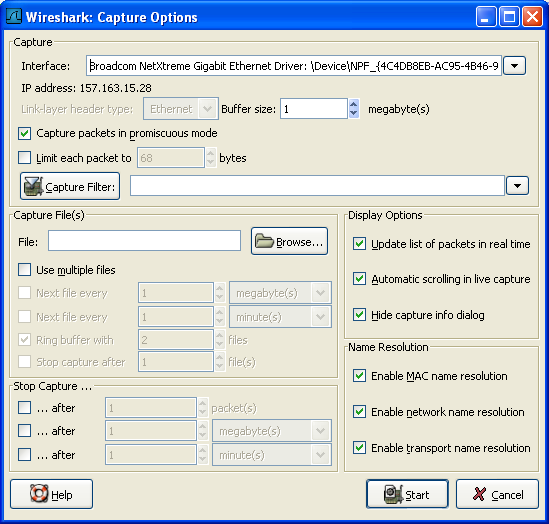
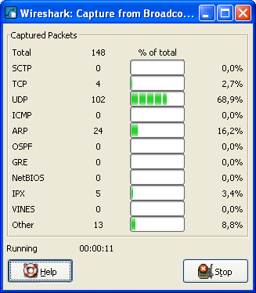

# 第四章 实时捕捉数据包

**目录**

*   [4.1\. 介绍](http://man.lupaworld.com/content/network/wireshark/capturing_live.html#c4.1)
*   4.2\. 准备工作
*   4.3\. 开始捕捉
*   4.4\. 捕捉接口对话框
*   4.5\. 捕捉选项对话框
    *   [4.5.1\. 捕捉桢](http://man.lupaworld.com/content/network/wireshark/c4.5.html#c4.5.1)
    *   [4.5.2\. 捉数据帧为文件。](http://man.lupaworld.com/content/network/wireshark/c4.5.html#c4.5.2)
    *   [4.5.3\. 停止捕捉桢](http://man.lupaworld.com/content/network/wireshark/c4.5.html#c4.5.3)
    *   [4.5.4\. 显示桢选项](http://man.lupaworld.com/content/network/wireshark/c4.5.html#c4.5.4)
    *   [4.5.5\. 名称解析设置](http://man.lupaworld.com/content/network/wireshark/c4.5.html#c4.5.5)
    *   [4.5.6\. 按钮](http://man.lupaworld.com/content/network/wireshark/c4.5.html#c4.5.6)
*   4.6\. 捕捉文件格式、模式设置
*   4.7\. 链路层包头类型
*   4.8\. 捕捉时过滤
    *   [4.8.1\. 自动过滤远程通信](http://man.lupaworld.com/content/network/wireshark/c4.8.html#c4.8.1)
*   4.9\. 在捕捉过程中
    *   [4.9.1\. 停止捕捉](http://man.lupaworld.com/content/network/wireshark/c4.9.html#c4.9.1)
    *   [4.9.2\. 重新启动捕捉](http://man.lupaworld.com/content/network/wireshark/c4.9.html#c4.9.2)

## 4.1\. 介绍

实时捕捉数据包时 Wireshar 的特色之一

Wiershark 捕捉引擎具备以下特点

*   支持多种网络接口的捕捉(以太网，令牌环网，ATM...)

*   支持多种机制触发停止捕捉，例如：捕捉文件的大小，捕捉持续时间，捕捉到包的数量...

*   捕捉时同时显示包解码详情

*   设置过滤，减少捕捉到包的容量。见第 4.8 节 “捕捉时过滤”

*   长时间捕捉时，可以设置生成多个文件。对于特别长时间的捕捉，可以设置捕捉文件大小罚值，设置仅保留最后的 N 个文件等手段。见第 4.6 节 “捕捉文件格式、模式设置”

Wireshark 捕捉引擎在以下几个方面尚有不足

*   从多个网络接口同时实时捕捉，(但是您可以开始多个应用程序实体，捕捉后进行文件合并)

*   根据捕捉到的数据停止捕捉(或其他操作)

## 4.2\. 准备工作

第一次设置 Wireshark 捕捉包可能会遇到一些小麻烦

> 
> 
> 提示
> 
> 关于如何进行捕捉设置的较为全面的向导可以在:[`wiki.wireshark.org/CaptureSetup.`](http://wiki.wireshark.org/CaptureSetup.)

这里有一些常见需要注意的地方

*   你必须拥有 root/Administrator 特权以开始捕捉[12]

*   必须选择正确的网络接口捕捉数据

*   如果您想捕捉某处的通信，你必须作出决定：在什么地方可以捕捉到

*   ……以及许多

如果你碰到设置问题，建议看看前面的那个向导，或许会有所帮助

[12] 记得在 Windows 安装那一节层提到如果作为服务启动可以避免非管理员无法进行捕捉，不知道二者能否相互印证。

## 4.3\. 开始捕捉

可以使用下任一方式开始捕捉包

*   使用打开捕捉接口对话框，浏览可用的本地网络接口，见图 4.1 “"Capture Interfaces"捕捉接口对话框”,

    选择您需要进行捕捉的接口启动捕捉

*   你也可以使用"捕捉选项"按钮启动对话框开始捕捉，见图 4.2 “"Capture Option/捕捉选项"对话框”

*   如果您前次捕捉时的设置和现在的要求一样，您可以点击"开始捕捉"按钮或者是菜单项立即开始本次捕捉。

*   如果你已经知道捕捉接口的名称，可以使用如下命令从命令行开始捕捉：

    ```
    wireshark -i eth0 -k 
    ```

    上述命令会从 eht0 接口开始捕捉，有关命令行的介绍参见第 9.2 节 “从命令行启动 Wireshark”

## 4.4\. 捕捉接口对话框

如果您从捕捉菜单选择"Interface..."，将会弹出如图 4.1 “"Capture Interfaces"捕捉接口对话框”所示的对话框

> 
> 
> 警告
> 
> 打开"Capture Interfaces"/捕捉对话框时 同时正在显示捕捉的数据，这将会大量消耗您的系统资源。尽快选择您需要的接口以结束该对话框。避免影响系统性能
> 
> 
> 
> 注意
> 
> 这个对话框只显示本地已知的网络接口，Wireshark 可能无法检测到所有的本地接口，Wireshark 不能检测远程可用的网络接口，Wireshark 只能使用列出可用的网络接口

**图 4.1\. "Capture Interfaces"捕捉接口对话框**


**描述**

从操作系统获取的接口信息

**IP**

Wireshark 能解析的第一个 IP 地址，如果接口未获得 IP 地址（如，不存在可用的 DHCP 服务器)，将会显示"Unkow",如果有超过一个 IP 的，只显示第一个(无法确定哪一个会显示).

**Packets**

打开该窗口后，从此接口捕捉到的包的数目。如果一直没有接收到包，则会显示为灰度

**Packets/s**

最近一秒捕捉到包的数目。如果最近一秒没有捕捉到包，将会是灰度显示

**Stop**

停止当前运行的捕捉

**Capture**

从选择的接口立即开始捕捉，使用最后一次捕捉的设置。

Options

打开该接口的捕捉选项对话框,见 第 4.5 节 “捕捉选项对话框”

**Details(仅 Win32 系统)**

打开对话框显示接口的详细信息

**Close**

关闭对话框

## 4.5\. 捕捉选项对话框

如果您从捕捉菜单选择"start..."按钮(或者从主工具栏选择对应的项目),Wireshark 弹出"Capture Option/捕捉选项"对话框。如图 4.2 “"Capture Option/捕捉选项"对话框”所示

**图 4.2\. "Capture Option/捕捉选项"对话框**



> 
> 
> 提示
> 
> 如果你不了解各项设置的意义，建议保持默认。

你可以用对话框中的如下字段进行设置

### 4.5.1\. 捕捉桢

**Interface**

该字段指定你想用于进行捕捉的借口。一次只能使用一个接口。这是一个下拉列表，简单点击右侧的按钮，选择你想要使用的接口。默认第一是支持捕捉的 non-loopback(非环回)接口，如果没有这样的接口，第一个将是环回接口。在某些系统中，回借口不支持捕捉包(windows 平台下的环回接口就不支持。)

在命令行使用-i <interface>参数可以替代该选项

**IP address**

表示选择接口的 IP 地址。如果系统未指定 IP 地址，将会显示为"unknown"

**Link-layer header type**

除非你有些特殊应用，尽量保持此选项默认。想了解更多详情，见 第 4.7 节 “链路层包头类型”

Buffer size: n megabyte(s)

输入用于捕捉的缓层大小。该选项是设置写入数据到磁盘前保留在核心缓存中捕捉数据的大小，如果你发现丢包。尝试增大该值。

> 
> 
> 注意
> 
> 该选项仅适用于 Windows 平台

Capture packets in promiscuous mode

指定 Wireshark 捕捉包时，设置接口为杂收模式(有些人翻译为混杂模式)。如果你**未**指定该选项，Wireshark 将只能捕捉进出你电脑的数据包(不能捕捉整个局域网段的包)[13]

> 
> 
> 注意
> 
> 如果其他应用程序将网卡设置为杂收模式，即使不选中该选项，也会工作于杂收模式下。
> 
> 
> 
> 注意
> 
> 即使在杂收模式下，你也未必能够接收到整个网段所有的网络包。详细解释见[`www.wireshark.org/faq.html#promiscsniff`](http://www.wireshark.org/faq.html#promiscsniff)

Limit each packet to n bytes

指定捕捉过程中，每个包的最大字节数。在某些地方被称为。"snaplen".[14]如果禁止该选项，默认值为 65535，这适用于大多数协议，下面是一些大多数情况下都适用的规则(这里又出现了拇指规则，第一章，系统需求时提到过。这里权且翻译作普适而非绝对的规则))

*   如果你不确定，尽量保持默认值

*   如果你不需要包中的所有数据。例如：如果您仅需要链路层、IP 和 TCP 包头，您可能想要选择一个较小的快照长度。这样只需要较少的 cpu 占用时间用于复制包，包需要的缓存也较少。如此在繁忙网络中捕捉时丢失的包也可能会相应少一点。

*   如果你没有捕捉包中的所有数据(适用 snpaplen 截断了包)，你可能会发现有时候你想要的包中的数据部分被截断丢弃了。或者因为缺少重要的部分，想对某些包进行重组而发现失败。

Capture Filter

指定捕捉过滤。捕捉过滤器将会在有第 4.8 节 “捕捉时过滤”详细介绍，默认情况下是空的。

同样你也可以点击捕捉按钮，通过弹出的捕捉过滤对话框创建或选择一个过滤器，详见第 6.6 节 “定义，保存过滤器”

### 4.5.2\. 捉数据帧为文件。

捕捉文件设置的使用方法的详细介绍见第 4.6 节 “捕捉文件格式、模式设置”

File

指定将用于捕捉的文件名。该字段默认是空白。如果保持空白，捕捉数据将会存储在临时文件夹。详见第 4.6 节 “捕捉文件格式、模式设置”

你可以点击右侧的按钮打开浏览窗口设置文件存储位置

Use multiple files

如果指定条件达到临界值，Wireshark 将会自动生成一个新文件，而不是适用单独文件。

Next file every n megabyte(s)

仅适用选中 Use multiple files,如果捕捉文件容量达到指定值，将会生成切换到新文件

Next file every n minutes(s)

仅适用选中 Use multiple files,如果捕捉文件持续时间达到指定值，将会切换到新文件。

Ring buffer with n files

仅适用选中 Use multiple files,仅生成制定数目的文件。

Stop caputure after n file(s)

仅适用选中 Use multiple files,当生成指定数目文件时，在生成下一个文件时停止捕捉(生成 n 个还是 n+1 个文件?)

### 4.5.3\. 停止捕捉桢

... after n packet(s)

在捕捉到指定数目数据包后停止捕捉

... after n megabytes(s)

在捕捉到指定容量的数据(byte(s)/kilobyte(s)/megabyte(s)/gigabyte(s) )后停止捕捉。如果没有适用"user multiple files",该选项将是灰色

... after n minute(s)

在达到指定时间后停止捕捉

### 4.5.4\. 显示桢选项

Update list of packets in real time

在包列表面板实时更新捕捉数据。如果**未选定**该选项，在 Wireshark 捕捉结束之前将不能显示数据。如果选中该选项，Wireshark 将生成两个独立的进程，通过捕捉进程传输数据给显示进程。

Automatic scrolling in live capture

指定 Wireshark 在有数据进入时实时滚动包列表面板，这样您将一直能看到最近的包。反之，则最新数据包会被放置在行末，但不会自动滚动面板。如果未设置"update list of packets in real time",该选项将是灰色不可选的。

Hide capture info dialog

选中该选项，将会隐藏捕捉信息对话框

### 4.5.5\. 名称解析设置

Enable MAC name resolution

设置是否让 Wireshark 翻译 MAC 地址为名称，见第 7.6 节 “名称解析”

Enable network name resolution

是否允许 Wireshark 对网络地址进行解析，见第 7.6 节 “名称解析”

### 4.5.6\. 按钮

进行完上述设置以后，你可以点击**start**按钮进行捕捉,也可以点击**Cancel**退出捕捉.

开始捕捉以后，在你收集到足够的数据时你可以停止捕捉。见第 4.9 节 “在捕捉过程中”

[13] 网卡在局域网内会接到很多不属于自己的包，默认情况下，网卡会不对这些包进行处理。貌似设置为杂收模式，Wireshak 会监听所有的包，但并不作出相应。

[14] 粗略查了一下,未找到该词的合适翻译,多见于 Winpcap 的描述，如果把该单词拆分，snap:单元，快照，len:长度，似乎就是单位长度，单元大小的意思。在看看该段下面第二个如果中提到的 snapshot length,snaplen 应该是二者的简写形式，快照长度

## 4.6\. 捕捉文件格式、模式设置

在 捕捉时，libpcap 捕捉引擎(linux 环境下)会抓取来自网卡的包存放在(相对来说)较小的核心缓存内。这些数据由 Wireshark 读取并保存到用户指定的捕捉文件中。

保存包数据到捕捉文件时，可采用差异模式操作。

> 
> 
> 提示
> 
> 处理大文件(数百兆)将会变得非常慢。如果你计划进行长时间捕捉，或者处于一个高吞吐量的网络中，考虑使用前面提到的"Multiple files/多文件"选项。该选项可以将捕捉包分割为多个小文件。这样可能更适合上述环境。
> 
> 
> 
> 注意
> 
> 使用多文件可能会切断上下文关联信息。Wireshark 保留载入包的上下文信息，所以它会报告上下文关联问题(例如流问题)和关联上下文协议信息(例如：何处数据产生建立阶段，必须查找后续包)。这些信息仅能在载入文件中显示，使用多文件模式可能会截断这样的上下文。如果建立连接阶段已经保存在一个文件中，你想要看的在另一个文件中，你可能无法看到可用的上下文关联信息。
> 
> 
> 
> 提示
> 
> 关于捕捉文件的目录信息，可见???

**表 4.1\. 捕捉文件模式选项**

| "File"选项 | "Use multiple files"选项 | "Ring buffer with n files"选项 | Mode | 最终文件命名方式 |
| --- | --- | --- | --- | --- |
| - | - | - | Single temporary file | etherXXXXXX (where XXXXXX 是一个独立值) |
| foo.cap | - | - | Single named file | foo.cap |
| foo.cap | x | - | Multiple files,continuous | foo_00001_20040205110102.cap, foo_00002_20040205110102.cap, ... |
| foo.cap | x | x | Multiple files,ring buffer | foo_00001_20040205110102.cap, foo_00002_20040205110102.cap, ... |

Single temporary file

将会创建并使用一个临时文件(默认选项).捕捉文件结束后，该文件可以由用户指定文件名。

Single named file

使用单独文件，如果你想放到指定目录，选择此模式

Multiple files,continuous

与 single name file 模式类似，不同点在于，当捕捉达到多文件切换临界条件时之一时，会创建一个新文件用于捕捉

Multiple files,ring buffer

与"multiple files continuous"模式类似，不同之处在于，创建的文件数目固定。当达到 ring buffer with n 值时，会替换掉第一个文件开始捕捉，如此循环往复。

该模式可以限制最大磁盘空间使用量，即使未限制捕捉数据输入，也只能保留最后几个捕捉数据。

## 4.7\. 链路层包头类型

在通常情况下，你不需要选择链路层包头类型。下面的段落描述了例外的情况，此时选择包头类型是有必要的，所以你需要知道怎么做：

如果你在某种版本 BSD 操作系统下从某种 802.11 设备(无线局域网设备)捕捉数据，可能需要在"802.11"和"Ethernet"中做出选择。"Ethernet"将会导致捕捉到的包带有伪以太网帧头(不知道是不是应该叫伪首部更准确些);"802.11"将会导致他们带有 802.11 帧头。如果捕捉时的应用程序不支持"802.11 帧头"，你需要选择"802.11"

如果你使用 Endace DAG card(某种网络监视卡)连接到同步串口线(译者注：E 文为 synchronous serial line，权且翻译作前文吧，未接触过此卡、未熟稔此线名称)，可能会出现"PPP over serial" 或 "Cisco HDLC"(自己 google 去)供选择。根据你自己的情况选择二者中的一个。

如果你使用 Endace DAG card(同上)连接到 ATM 网络，将会提供"RFC 1483 IP-over-ATM"、"Sun raw ATM"供选择。如果捕捉的通信是 RFC 1483 封装 IP(RFC 1483 LLC-encapsulated IP,不翻译为妙)，或者需要在不支持 SunATM 帧头的应用程序下捕捉，选择前者。反之选择后者。

如果你在以太网捕捉，将会提供"Ethernet"、"DOCSIS"供选择，如果您是在 Cisco Cable Modem Termination System(CMTS 是思科同轴电缆终端调制解调系统？)下捕捉数据。它会将 DOCSIS(同轴电缆数据服务接口)通信放置到以太网中，供捕捉。此时需要选择"DOCSIS",反之则反之。

## 4.8\. 捕捉时过滤

Wireshark 使用 libpcap 过滤语句进行捕捉过滤(what about winpcap?)。在 tcpdump 主页有介绍，但这些只是过于晦涩难懂，所以这里做小幅度讲解。

> 
> 
> 提示
> 
> 你可以从[`wiki.wireshark.org/CaptureFilters`](http://wiki.wireshark.org/CaptureFilters)找到捕捉过滤范例.

在 Wireshark 捕捉选项对话(见图 4.2 “"Capture Option/捕捉选项"对话框”)框输入捕捉过滤字段。下面的语句有点类似于 tcpdump 捕捉过滤语言。在 tcpdump 主页[`www.tcpdump.org/tcpdump_man.html`](http://www.tcpdump.org/tcpdump_man.html)可以看到 tcpdump 表达式选项介绍。

捕捉过滤的形式为：和取值(**and/or**)进行进行基本单元连接，加上可选的，高有限级的**not**:

```
[not] **primitive** [and|or [not] **primitive** ...] 
```

**例 4.1\. 捕捉来自特定主机的 telnet 协议**

```
tcp port 23 and host 10.0.0.5 
```

本例捕捉来自或指向主机 10.0.0.5 的 Telnet 通信，展示了如何用 and 连接两个基本单元。另外一个例子例 4.2 “捕捉所有不是来自 10.0.0.5 的 telnet 通信”展示如何捕捉所有不是来自 10.0.0.5 的 telnet 通信。

**例 4.2\. 捕捉所有不是来自 10.0.0.5 的 telnet 通信**

```
tcp host 23 and not src host 10.0.0.5 
```

此处笔者建议增加更多范例。但是并没有添加。

一个基本单元通常是下面中的一个

[src|dst] host <host>

此基本单元允许你过滤主机 ip 地址或名称。你可以优先指定 src|dst 关键词来指定你关注的是源地址还是目标地址。如果未指定，则指定的地址出现在源地址或目标地址中的包会被抓取。

ether [src|dst] host <ehost>

此单元允许你过滤主机以太网地址。你可以优先指定关键词 src|dst 在关键词 ether 和 host 之间，来确定你关注的是源地址还是目标地址。如果未指定，同上。

gateway host<host>

过滤通过指定**host**作为网关的包。这就是指那些以太网源地址或目标地址是**host**，但源 ip 地址和目标 ip 地址都不是**host**的包

[src|dst] net <net> [{mask<mask>}|{len <len>}]

通过网络号进行过滤。你可以选择优先指定**src|dst**来确定你感兴趣的是源网络还是目标网络。如果两个都没指定。指定网络出现在源还是目标网络的都会被选择。另外，你可以选择子网掩码或者 CIDR(无类别域形式)。

[tcp|udp] [src|dst] port <port]

过滤 tcp,udp 及端口号。可以使用**src|dst**和**tcp|udp**关键词来确定来自源还是目标，**tcp**协议还是**udp**协议。**tcp|udp**必须出现在**src|dst**之前。

less|greater <length>

选择长度符合要求的包。（大于等于或小于等于）

ip|ether proto <protocol>

选择有指定的协议在以太网层或是 ip 层的包

ether|ip broadcast|multicast

选择以太网/ip 层的广播或多播

<expr> relop <expr>

创建一个复杂过滤表达式，来选择包的字节或字节范围符合要求的包。请参考[`www.tcpdump.org/tcpdump_man.html`](http://www.tcpdump.org/tcpdump_man.html)

### 4.8.1\. 自动过滤远程通信

如果 Wireshark 是使用远程连接的主机运行的(例如使用 SSH,X11 Window 输出，终端服务器)，远程连接必须通过网络传输，会在你真正感兴趣的通信中产生大量数据包(通常也是不重要的)

想要避免这种情况，wireshark 可以设置为如果发现有远程连接(通过察看指定的环境变量)，自动创建一个过滤器来匹配这种连接。以避免捕捉 Wireshark 捕捉远程连接通信。

下列环境变量可以进行分析

SSH——CONNECTION(ssh)

```
&lt;remote IP&gt; &lt;remote port&gt; &lt;local IP&gt; &lt;local port&gt; 
```

SSH_CLIENT (ssh)

```
&lt;remote IP&gt; &lt;remote port&gt; &lt;local port&gt; 
```

REMOTEHOST (tcsh, others?)

```
&lt;remote name&gt; 
```

DISPLAY (x11)

```
[remote name]:&lt;display num&gt; 
```

SESSIONNAME (terminal server)

```
&lt;remote name&gt; 
```

## 4.9\. 在捕捉过程中

捕捉时，会出现下面的对话框

**图 4.3\. 捕捉信息对话框**



上述对话框会向你显示捕捉到包的数目，捕捉持续时间。选择的被统计的协议无法更改(什么鸟意思？)

> 
> 
> 提示
> 
> 这个对话框可以被隐藏，在前次的捕捉选项对话框设置"Hide capture info dialog box"即可。

### 4.9.1\. 停止捕捉

运行中的捕捉线程可以用下列方法停止：

1.  使用捕捉信息对话框上的"stop"按钮停止。

    |  | 注意 | |

    捕捉信息对话框有可能被隐藏，如果你选择了"Hide capture info dialog"

    |

2.  使用菜单项"Capture/ Stop"

3.  使用工具栏项" Stop"

4.  使用快捷键:Ctrl+E

5.  如果设置了触发停止的条件，捕捉达到条件时会自动停止。

### 4.9.2\. 重新启动捕捉

运行中的捕捉进程可以被重新启动。这将会移出上次捕捉的所有包。如果你捕捉到一些你不感兴趣的包，你不想保留它，这个功能十分有用。

重新启动是一项方便的功能，类似于停止捕捉后，在很短的时间内立即开始捕捉。以下两种方式可以实现重新启动捕捉:

1.  使用菜单项"Capture/ Restart"

2.  使用工具栏项" Restart"