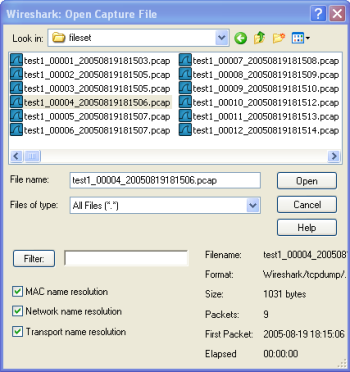
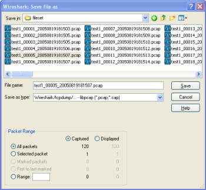
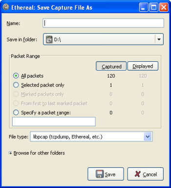
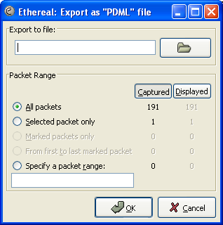

# 第五章 文件输入／输出及打印

**目录**

*   5.1\. 说明
*   5.2\. 打开捕捉文件
    *   5.2.1\. 打开捕捉文件对话框
    *   5.2.2\. 输入文件格式
*   5.3\. 保存捕捉包
    *   5.3.1\. "save Capture File As/保存文件为"对话框
    *   5.3.2\. 输出格式
*   5.4\. 合并捕捉文件
    *   5.4.1\. 合并文件对话框
*   5.5\. 文件集合
    *   5.5.1\. 文件列表对话框
*   5.6\. 导出数据
    *   5.6.1\. "Export as Plain Text File"对话框
    *   5.6.2\. "Export as PostScript File" 对话框
    *   5.6.3\. "Export as CSV (Comma Separated Values) File" 对话框
    *   5.6.4\. "Export as PSML File" 对话框
    *   5.6.5\. "Export as PDML File" 对话框
    *   5.6.6\. "Export selected packet bytes" 对话框
    *   5.6.7\. "Export Objects" 对话框
*   5.7\. 打印包
    *   5.7.1\. 打印 对话框
*   5.8\. 包范围选项
*   5.9\. 包格式选项

## 5.1\. 说明

本章将介绍捕捉数据的输入输出。

*   打开／导入多种格式的捕捉文件

*   保存／导出多种格式的捕捉文件

*   合并捕捉文件

*   打印包

## 5.2\. 打开捕捉文件

Wireshark 可以读取以前保存的文件。想读取这些文件，只需选择菜单或工具栏的：“File/**Open**”。Wireshark 将会 弹出打开文件对话框。详见第 5.2.1 节 “打开捕捉文件对话框”

> 
> 
> 如果使用拖放功能会更方便
> 
> 要打开文件，只需要从文件管理器拖动你想要打开的文件到你的 Wireshark 主窗口。但拖放功能不是在所有平台都支持。

在你载入新文件时，如果你没有保存当前文件，Wireshark 会提示你是否保存，以避免数据丢失。(你可以在首选项禁止提示保存)

除 Wireshark 原生的格式(libpcap 格式，同样被 tcpdump/Windump 和 其他基于 libpcap/WinPcap 使用)外，Wireshark 可以很好地读取许多捕捉文件格式。支持的格式列表见第 5.2.2 节 “输入文件格式”

### 5.2.1\. 打开捕捉文件对话框

打开文件对话框可以用来查找先前保存的文件。表 5.1 “特定环境下的打开文件对话框”显示了一些 Wireshark 打开文件对话框的例子。

> 
> 
> 对话框的显示方式取决于你的操作系统
> 
> 对话框的显示方式取决于操作系统，以及 GTK+工具集的版本。但不管怎么说，基本功能都是一样的。

常见对话框行为：

*   选择文件和目录

*   点击 Open/OK 按钮，选择你需要的文件并打开它

*   点击 Cancle 按钮返回 Wireshark 主窗口而不载入任何文件。

Wireshark 对话框标准操作扩展

*   如果选中文件，可以查看文件预览信息(例如文件大小，包个数。。。)

*   通过"filter:"按钮、显示字段指定显示过滤器。过滤器将会在打开文件后应用。在输入过滤字符时会进行语法检查。如果输入正确背景色为绿色，如果错误或输入未结束，背景色为绿色。点击 filter 按钮会打开过滤对话框，用于辅助输入显示过滤表达式。(详见第 6.3 节 “浏览时过滤包”)

    XXXX-we need a better description of these read filters(貌似说这一段需要更多的做介绍)

*   通过点击复选框指定那些地址解析会被执行。详见第 7.6 节 “名称解析”

    > 
    > 
    > 在大文件中节约大量时间 |
    > 
    > 你可以在打开文件后修改显示过滤器，和名称解析设置。但在一些巨大的文件中进行这些操作将会占用大量的时间。在这种情况下建议在打开文件之前就进行相关过滤，解析设置。

**表 5.1\. 特定环境下的打开文件对话框**

**图 5.1\. Windows 下的打开对话框**



**Microsoft Windows(GTK2 installed)**

此对话框一般都带有一些 wireshark 扩展

此对话框的说明：

*   如果可用，"help"按钮将会打开本节的用户手册。

*   "Filter."按钮 在当前版本的 windows 下不可用(我看了一下，的确不可用，但过滤输入框还是可用的)

*   错误提示功能:如果 Wireshark 无法识别选中的捕捉文件，Open 按钮将为灰色不可用[a]

**图 5.2\. 新版 GtK 下的打开对话框**


**Unix/Linux:GTK version >= 2.4**

这是在 Gimp/GNOME 桌面环境下的打开文件对话框

对此对话框的说明。

*   “+”按钮可以将右侧选中的目录添加到收藏夹。成为预设目录。

*   "-"按钮可以移除左侧目录列表中选中的目录。("Home","Desktop","Filesystem"不可以移除)

*   如果 Wireshark 不能识别选中的捕捉文件，"Open"按钮将是灰色不可用。

**图 5.3\. 旧版 GTK 下的打开对话框**


**Unix/Linux: GTK version < 2.4 / Microsoft Windows (GTK1 installed)**

gimp/gnome 桌面环境，或 windows gtk1 下的的。

该对话框说明

*   如果未能识别不做文件，Open 按钮将为灰色不可用

[a] 我测试了一下，无论什么文件，Wireshark 都会去尝试打开，更遑论错误检查

### 5.2.2\. 输入文件格式

可以打开的捕捉文件格式列表：

*   libpcap, tcpdump and various other tools using tcpdump's capture format

*   Sun snoop and atmsnoop

*   Shomiti/Finisar Surveyor captures

*   Novell LANalyzer captures

*   Microsoft Network Monitor captures

*   AIX's iptrace captures

*   Cinco Networks NetXray captures

*   Network Associates Windows-based Sniffer and Sniffer Pro captures

*   Network General/Network Associates DOS-based Sniffer (compressed or uncompressed) captures

*   AG Group/WildPackets EtherPeek/TokenPeek/AiroPeek/EtherHelp/PacketGrabber captures

*   RADCOM's WAN/LAN Analyzer captures

*   Network Instruments Observer version 9 captures

*   Lucent/Ascend router debug output

*   HP-UX's nettl

*   Toshiba's ISDN routers dump output

*   ISDN4BSD i4btrace utility

*   traces from the EyeSDN USB S0

*   IPLog format from the Cisco Secure Intrusion Detection System

*   pppd logs (pppdump format)

*   the output from VMS's TCPIPtrace/TCPtrace/UCX$TRACE utilities

*   the text output from the DBS Etherwatch VMS utility

*   Visual Networks' Visual UpTime traffic capture

*   the output from CoSine L2 debug

*   the output from Accellent's 5Views LAN agents

*   Endace Measurement Systems' ERF format captures

*   Linux Bluez Bluetooth stack hcidump -w traces

*   Catapult DCT2000 .out files

> 
> 
> 不正确的包类型可能无法会导致打开错误。
> 
> 某些类型的捕捉包可能无法读取。以太网环境下捕捉的大部分类型格式一般都等打开。但有些包类型(如令牌环环包)，不是所有的格式都被 wireshark 支持。

## 5.3\. 保存捕捉包

你可以通过 File->Save As...菜单保存捕捉文件。在保存时可以选择保存哪些包，以什么格式保存。

> 
> 
> 保存可能会丢失某些有用的信息
> 
> 保存可能会少量都是某些信息。例如：已经被丢弃的包会丢失。详见???

### 5.3.1\. "save Capture File As/保存文件为"对话框

"Save Capture File As"对话框用于保存当前捕捉数据到文件。???列举了该对话框的一些例子。

> 
> 
> 对话框的显示方式取决于你的操作系统
> 
> 对话框的显示方式取决于你的操作系统和 GTK+工具集版本的不同。但大部分基本功能都是一样的。

**表 5.2\. 特定环境下的"Save Capture File As"对话框**

| <a name="d0e4171"></a>

**图 5.4\. Windows 下的保存为对话框**

<a name="fig5.4"></a> | **Microsoft Windows(GTK2 installed)**

此对话框一般都带有一些 wireshark 扩展

此对话框的说明：

*   如果可用，"help"按钮将会打开本节的用户手册。

*   如果你未输入文件扩展名-例如.pcap,Wireshark 会自动添加该文件格式的标准扩展名。

**图 5.5\. 新版 GtK 下的保存为对话框**



**Unix/Linux:GTK version >= 2.4**

这是在 Gimp/GNOME 桌面环境下的保存文件对话框

对此对话框的说明。

*   "Browse for other flders"前的“+”按钮可以让你指定文件保存的位置。。

**图 5.6\. 旧版 GTK 下的保存为对话框**


**Unix/Linux: GTK version < 2.4 / Microsoft Windows (GTK1 installed)**

gimp/gnome 桌面环境，或 windows gtk1 下的的。

通过这些对话框，你可以执行如下操作：

1.  输入你指定的文件名。

2.  选择保存的目录

3.  选择保存包的范围，见第 5.8 节 “包范围选项”

4.  通过点击"File type/文件类型"下拉列表指定保存文件的格式。见???

    > 
    > 
    > 可供选中的文件格式可能会没有那么多 |
    > 
    > 有些类型的捕捉格式可能不可用，这取决于捕捉包的类型。
    > 
    > 
    > 
    > 可以直接保存为另一种格式。]
    > 
    > 你可以以一种格式读取捕捉文件，保存时使用另外一种格式(这句可能翻译有误。)

1.  点击"Save/OK"按钮保存。如果保存时遇到问题，会出现错误提示。确认那个错误提示以后，你可以重试。

2.  点击"Cancel"按钮退出而不保存捕捉包。

### 5.3.2\. 输出格式

可以将 Wireshark 不着的包保存为其原生格式文件(libpcap)，也可以保存为其他格式供其他工具进行读取分析。

> 
> 
> 各文件类型之间的时间戳精度不尽相同
> 
> 将当前文件保存为其他格式可能会降低时间戳的精度，见第 7.3 节 “时间戳”

Wireshark 可以保存为如下格式。

*   libpcap, tcpdump and various other tools using tcpdump's capture format (*.pcap,*.cap,*.dmp)

*   Accellent 5Views (*.5vw)

*   HP-UX's nettl (*.TRC0,*.TRC1)

*   Microsoft Network Monitor - NetMon (*.cap)

*   Network Associates Sniffer - DOS (*.cap,*.enc,*.trc,*fdc,*.syc)

*   Network Associates Sniffer - Windows (*.cap)

*   Network Instruments Observer version 9 (*.bfr)

*   Novell LANalyzer (*.tr1)

*   Sun snoop (*.snoop,*.cap)

*   Visual Networks Visual UpTime traffic (*.*)

## 5.4\. 合并捕捉文件

有时候你需要将多个捕捉文件合并到一起。例如：如果你对多个接口同时进行捕捉，合并就非常有用(Wireshark 实际上不能在同一个实体运行多次捕捉，需要开启多个 Wireshark 实体)

有三种方法可以合并捕捉文件：

*   从"File"菜单使用，**menu item "Merge"(菜单项 "合并")**，打开合并对话框，见第 5.4.1 节 “合并文件对话框”

*   使用拖放功能，将多个文件拖放到主窗口。Wireshark 会创建一个临时文件尝试对拖放的文件按时间顺序进行合并。如果你只拖放一个文件，Wireshark 可能(只是)简单地替换已经打开的文件。

*   使用**mergecap**工具。该工具是在命令行进行文件合并的。它提供了合并文件的丰富的选项设置。见???

### 5.4.1\. 合并文件对话框

通过该对话框可以选择需要合并的文件，并载入合并它们。

> 
> 
> 首先你会被提示有一个文件未保存
> 
> 如果当前文件未保存，Wireshark 会在启动合并对话框之前提示你是否保存文件。

此处的对话框的大多数内容与"Open Capture Files/打开捕捉文件"对话框类似，参见第 5.2.1 节 “打开捕捉文件对话框”

合并对话框中用于合并的控制选项：

将包插入已存在文件前

将选择文件内的包插入到当前已经载入文件之前

按时间顺序合并文件

将当前选择的文件和已载入的文件里的所有包按时间顺序合并

追加包到当前文件

将选择文件的包插入到当前载入文件的末尾

**表 5.3\. 不同环境下的"Merge Capture File As"对话框**

**图 5.7\. Windows 下的"合并"对话框**


**Microsoft Windows(GTK2 installed)**

此对话框一般都带有一些 wireshark 扩展

**图 5.8\. 新版 GtK 下的合并话框**


**Unix/Linux:GTK version >= 2.4**

这是在 Gimp/GNOME 桌面环境下的合并对话框

**图 5.9\. 旧版 GTK 下的合并对话框**


**Unix/Linux: GTK version < 2.4 / Microsoft Windows (GTK1 installed)**

## 5.5\. 文件集合

在进行捕捉时(见：第 4.6 节 “捕捉文件格式、模式设置”)如果设置"Multiple Files/多文件"选项，捕捉数据会分割为多个文件，称为文件集合.

大量文件手动管理十分困难，Wirreshark 的文件集合特性可以让文件管理变得方便一点。

> **Wireshark 是如何知道一个文件所属的文件集合 t 的?**
> 
> 文件集合中的文件名以前缀号码+"*"+号码+"*"+日期时间+后缀的形式生成的。类似于："test_00001_20060420183910.pcap".文件集合所有的文件都有一个共同的前缀(例如前面的"test")和后缀(例如:".pcap")以及变化的中间部分。
> 
> 要查找一个文件集合的所有文件。Wireshark 会扫描当前载入文件的目录下的所有文件，找到那些和当前文件名具有相同部分（前缀和后缀）的作为文件集合。
> 
> 这个简单的机制通常能正常运行，但也有它的弊端。如果几次进行的捕捉具有相同的前缀和后缀，Wireshark 会将它们看作同一个文件集合。如果文件被更名或者放在不同的目录下，这样的按文件名查找机制会无法找到文件集合的所有文件。

使用"File"菜单项的子菜单"File Set"可以对文件集合集合进行很方便的控制。

*   **List Files** 对话框显示一个对话框列出所有被识别出来属于当前文件集合的文件列表。

*   **Next Files** 关闭当前文件，打开文件集合列表中的下一个文件。

*   **Previous Files** 关闭当前文件，打开文件集合列表中的前一个文件。

### 5.5.1\. 文件列表对话框

**图 5.10\. 文件列表对话框**


每行包含文件集合中的一个文件的相关信息。

*   **Filename** 文件名称。如果你双击文件名称(或者单击单选钮)，当前文件会被关闭，同时载入对应的文件。

*   **Created** 文件创建时间。

*   **Last Modified** 最后一次修改文件的时间。

*   **size** 文件的大小。

最后一行"...indirctory:"显示所有文件所在的目录。

在每次捕捉文件被打开、关闭时，对话框的内容会变化。

Close 按钮关闭该对话框。

## 5.6\. 导出数据

Wireshark 支持多种方法，多种格式导出包数据，本节描述 Wireshark 常见的导出包数据方法。

> 
> 
> 注意
> 
> 个别数据需要使用许多特殊方式导出，在合适的时候我们会对其进行介绍。

XXX - add detailed descriptions of the output formats and some sample output, too./同样需要对导出格式进行介绍，同样也需要一些范例范例

### 5.6.1\. "Export as Plain Text File"对话框

导出包数据为"plain AscⅡ "文本文本见，适合打印包数据。

**图 5.11\. "Export as Plain Text File"对话框**


*   **Export to file:**导出包数据为指定的文件

*   **Packet Range** 参见第 5.8 节 “包范围选项”

*   **Packet Details** 参见???

### 5.6.2\. "Export as PostScript File" 对话框

导出数据为 PostScript 格式，PostScript 是一种打印格式。

> 
> 
> 提示
> 
> PostScribt 文件可以使用 ghostscrip 转换为 PDF 格式。例如导出文件名为 foo.ps，然后调用**ps2pdf foo.ps**命令就可以进行转换。

**图 5.12\. "Export as PostScript File" 对话框**


*   Export to file: 导出包数据为指定的文件

*   Packet Range: 参见第 5.8 节 “包范围选项”

*   Packet Details: 参见???

### 5.6.3\. "Export as CSV (Comma Separated Values) File" 对话框

*注：笔者认为此处应该增加截屏，因为我的 xp 下界面与前图风格迥异，这里就不提供了*

导出包的摘要为 CVS 格式，可以被电子表格程序使用。

*   **Export to file** 导出包数据为指定的文件

*   **Packet Range** 参见第 5.8 节 “包范围选项”

### 5.6.4\. "Export as PSML File" 对话框

导出包数据为 PSML 格式，它是一种仅包含包摘要信息的 xml 格式。PSML 格式的说明参见：[`www.nbee.org/Docs/NetPDL/PSML.htm.`](http://www.nbee.org/Docs/NetPDL/PSML.htm)

**图 5.13\. "Export as PSML File"对话框**


*   Export to file:导出包数据为指定的文件

*   Packet Range: 参见第 5.8 节 “包范围选项”

上图没有诸如 Packet details 的选项，因为 PSML 文件格式有特殊要求，不包含这些内容。

### 5.6.5\. "Export as PDML File" 对话框

导出数据包为 PDML 格式，PDML 是包含包详情的 xml 格式文件。PDML 文件的说明见:[`www.nbee.org/Docs/NetPDL/PDML.htm`](http://www.nbee.org/Docs/NetPDL/PDML.htm)

> 
> 
> 注意
> 
> PDML 格式还没有发行版，Wireshark 执行 PDML 还处在测试阶段，期望外来版本会有所变化。

**图 5.14\. "Export as PDML File"对话框**



*   **Export to file**:将包数据导出到

*   **Packet Range**: 参见第 5.8 节 “包范围选项”

上述对话框里没有诸如 Packet details 选项，这是由于 PDML 格式约定的内容决定的。

### 5.6.6\. "Export selected packet bytes" 对话框

**图 5.15\. "Export Selected Packet Bytes" 对话框**


*   **Name:** 导出数据包为文件

*   **Save in folder:**导出数据包到指定目录

*   **Browser for other folders** 通过浏览来指定导出数据的目录。

### 5.6.7\. "Export Objects" 对话框

这个对话框是用来扫描当前打开包文件或者是正在捕捉中的包文件，将其中的对象，如 HTML 文档，图片文件，可执行文件等等任何可以通过 HTTP 传输的对象进行重组集合，让你可以将他们保存刀磁盘。如果捕捉正在进行中，列表会在发现新对象之后的几秒内立即更新。保存的对象不需要进行额外处理就可以被对应的查看工具打开，或者直接运行(如果它可以在 Wireshark 所在的平台运行的话)。这项功能在 GTK1 下的 Wireshark 中无法使用。

**图 5.16\. "Export Objects"对话框**


**各列说明**

Packet num

包含该对象数据的包的数目，有时候多个对象可能包含在同一个包里。

Hostname

作为服务器相应 HTTP 请求发送对象的主机的主机名。

Content Type

对象的 HTTP 内容类型

Bytes

对象的字节数

Filename

URL 的最后一部分(最后一个"/"之后)。通常这部分是文件名，但有时是一个又常又复杂的字符串，这通常表明该文件是一个"HTTP POST"请求。(类似于填写表单以后通过 CGI 提交后跳转页面的 URL)

**按钮说明：**

Help

打开本节的用户手册(5.6.7 节？)

Close

关闭该对话框

Save As

用指定文件名保存当前选择对象。默认文件名是 filename 列中显示的对象文件名。

Save All

将列表中所有对象按 filename 列显示名称保存。系统会提示你选择哪个目录/文件夹保存他们。如果文件名在当前操作系统或者文件系统下不合法,Wireshark 会提示错误，该对象不会被保存(但其他对象会被保存)。

## 5.7\. 打印包

要打印包，选择 File 菜单的"Print..."菜单项。这时会弹出如图 5.17 “ "Print" 对话框”所示的打印对话框。

### 5.7.1\. 打印 对话框

**图 5.17\. "Print" 对话框**


下面的字段在打印对话可用。

Printer

该字段包括一对互斥的单选钮

Print Text

指定包打印为 plain text 格式

PostScript

在打印过程中使用 PostScrtipt 打印软件生成打印输出。[15]

Output to file

打印为文件，文件名使用输入的字段或者在浏览按钮选择。

如果你没有选择**Output to file**:复选框,你输入字段的地方或 Browse。。按钮都是灰色。

Print command

设置打印时使用的命令

> 
> 
> 注意
> 
> 打印命令在 Windows 平台不可用。

用于打印的命令通常是**lpr**.You would change it to specify a particular queue if you need to print to a queue other than the default.例如:

```
lpr -Pmypostscript 
```

如果没有选中**Output to file**,该字段将是灰色不可用的。

Packet Range

需要要被打印的包，参见：第 5.8 节 “包范围选项”

Packet Format

选择输出文件的格式。你可以选择包以何种方式打印包。见图 5.19 “"Packet Format"选项卡”

[15] 译者注：此处需要说明的是，如果没有打印机，或者不想打印，你应该在后面指定 Output to file,指定打印输出未知，另，out put to file 输出的后缀名是.out,如果想用 acrobat 导入，可以考虑将后缀名修改为.ps,这样可以被直接识别，当然，直接把文件拖放到 Acrobat Distiller 也可以直接生成 PDF 文件。

另：使用 PostScript 输出的文件具有良好的形式，比如在页首会加上列名，而直接打印为 print text 却没有这样的内容。

## 5.9\. 包格式选项

包格式选项卡在很多输出对话框都能看到，它可以指定包的那些部分会被输出。

**图 5.19\. "Packet Format"选项卡**


Packet summary line

导出包的摘要行，就是"Packet List"面板的内容

Packet Details

导出 Packet Details 树

All collaspsed

"Packet Details"面板在"all collapsed"状态下的所有信息(折叠所有分支)

As displayed

"Packet Details"面板当前状态下的信息

All expanded

"Packet Details"面板"all expanded"状态下的信息(展开所有分支)

Packet bytes

导出包字节，就是"Packet Bytes"面板的内容

Each Packet on a new page

输出是每个包单独一页(例如，如果保存/打印成 text 文件，会在包之间加上分节符)