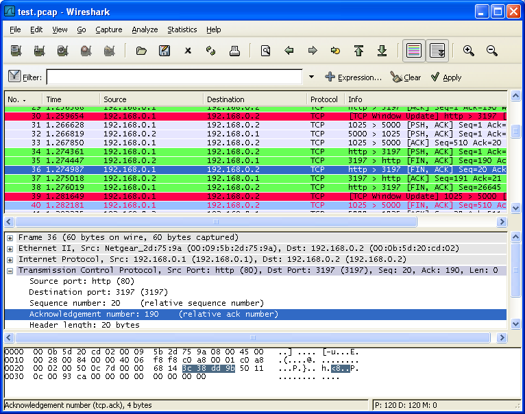

# 第六章 处理已经捕捉的包

**目录**

*   [6.1\. 浏览您捕捉的包](http://man.lupaworld.com/content/network/wireshark/chek_packet.html#c6.1)
*   6.2\. 弹出菜单项
    *   [6.2.1\. 包列表面板的弹出菜单](http://man.lupaworld.com/content/network/wireshark/c6.2.html#c6.2.1)
    *   [6.2.2\. 包详情面板的弹出菜单](http://man.lupaworld.com/content/network/wireshark/c6.2.html#c6.2.2)
*   6.3\. 浏览时过滤包
*   6.4\. 建立显示过滤表达式
    *   [6.4.1\. 显示过滤字段](http://man.lupaworld.com/content/network/wireshark/c6.4.html#c6.4.1)
    *   [6.4.2\. 比较值](http://man.lupaworld.com/content/network/wireshark/c6.4.html#c6.4.2)
    *   [6.4.3\. 组合表达式](http://man.lupaworld.com/content/network/wireshark/c6.4.html#c6.4.3)
    *   [6.4.4\. 常见的错误](http://man.lupaworld.com/content/network/wireshark/c6.4.html#c6.4.4)
*   6.5\. “Filter Expression/过滤表达式”对话框
*   6.6\. 定义，保存过滤器
*   6.7\. 查找包
    *   [6.7.1\. 查找包对话框](http://man.lupaworld.com/content/network/wireshark/c6.7.html#c6.7.1)
    *   [6.7.2\. "Find Next/查找下一个"命令](http://man.lupaworld.com/content/network/wireshark/c6.7.html#c6.7.2)
    *   [6.7.3\. "Find Previous/查找上一个"命令](http://man.lupaworld.com/content/network/wireshark/c6.7.html#c6.7.3)
*   6.8\. 到指定的包
    *   [6.8.1\. "GO Back"返回命令](http://man.lupaworld.com/content/network/wireshark/c6.8.html#c6.8.1)
    *   [6.8.2\. "Go Forward /向前"命令](http://man.lupaworld.com/content/network/wireshark/c6.8.html#c6.8.2)
    *   [6.8.3\. "Go to Packet/到指定的包"对话框](http://man.lupaworld.com/content/network/wireshark/c6.8.html#c6.8.3)
    *   [6.8.4\. "Go to Corresponding Packet/到对应的包"命令](http://man.lupaworld.com/content/network/wireshark/c6.8.html#c6.8.4)
    *   [6.8.5\. "Go to Firest Packet/到第一个包"命令](http://man.lupaworld.com/content/network/wireshark/c6.8.html#c6.8.5)
    *   [6.8.6\. "Go to Last Packet/到最后一个包"命令](http://man.lupaworld.com/content/network/wireshark/c6.8.html#c6.8.6)
*   6.9\. 标记包
*   6.10\. 时间显示格式及参考时间
    *   [6.10.1\. 包参考时间](http://man.lupaworld.com/content/network/wireshark/c6.10.html#c6.10.1)

## 6.1\. 浏览您捕捉的包

在你已经捕捉完成之后，或者打开先前保存的包文件时，通过点击包列表面版中的包，可以在包详情面板看到关于这个包树状结构以及字节面版

通过点击左侧"+"标记,你可以展开树状视图的任意部分。你可以在面板点击任意字段来选择它。例如：在下图[图 6.1 “Wireshark 选择了一个 TCP 包后的界面”](http://man.lupaworld.com/content/network/wireshark/chek_packet.html#fig6.1 "图 6.1\. Wireshark 选择了一个 TCP 包后的界面")显示的就是选中 TCP 字段。同样可以选择ＴＣＰ包头的应答号(ack:190)，同时会出现在下方的字节浏览面版中。[16]

**图 6.1\. Wireshark 选择了一个 TCP 包后的界面**



在 Wireshark 正在捕捉时，您也可以进行同样的选择。(前提是您在捕捉选项对话框选择了实时更新列表(update list of packet in real time ))

另外，您可以使用分离的窗口浏览单独的数据包，见[图 6.2 “在分离窗口浏览包”](http://man.lupaworld.com/content/network/wireshark/chek_packet.html#fig6.2 "图 6.2\. 在分离窗口浏览包") ，想要这样做，你只需要在选中包列表面版中您感兴趣的包，菜单 Display->Show Packet in New Windows 。它可以让你很轻松地比较两个或多个包。

**图 6.2\. 在分离窗口浏览包**


[16] 不甚了解下方的 16 进制转储怎么表达 190 的

## 6.2\. 弹出菜单项

在包列表面板，包详情面板，包字节面板点击右键，都会出现对应的上下文弹出菜单

### 6.2.1\. 包列表面板的弹出菜单

**图 6.3\. 包列表面板弹出菜单**


下表列出了该面版可用弹出菜单项的概述，主菜单能实现同样功能的菜单项，以及简短的描述。

**表 6.1\. 包列表弹出菜单项**

| 项目 | 对应主菜单项 | 描述 |
| --- | --- | --- |
| **Mark Packet(toggle)** | Edit | 标记/取消标记包 |
| **Set Time Reference(toggle)** | Edit | 设置/重设时间参考 |
| **Apply as Filter** | Analyze | 用当前选中的项作为过滤显示 |
| **Prepare a Filter** | Analyze | 准备将当前选择项作为过滤器 |
| **Conversation Filter** | - | 将当前选择项的地址信息作为过滤设置。选中该选项以后，会生成一个显示过滤，用于显示当前包两个地址之间的会话(不分源目标地址)。(XXX - add a new section describing this better.---作者似乎建议添加新章节详细描述) |
| **STCP** | - | 有待补充 |
| **Follow TCP Stream** | Analyze | 浏览两个节点间的一个完整 TCP 流所有数据 |
| **Follow SLL Stream** | Analyze | 同上，将 TCP 替换成 SSL 理解 |
| **Copy/Summary(TEXT)** | - | 将摘要字段复制到剪贴板。(以 tab 分开的文本) |
| **Copy/Summary(CVS)** | - | 将摘要字段复制到剪贴板，(CVS 格式,逗号分开) |
| **Copy/As Filter** | - | 以当前选择项，建立一个显示过滤器，复制到剪贴板 |
| **Copy/Bytes(Offset Hex Text)** | - | 以 16 进制转储格式将包字节复制到剪贴板。 |
| **Copy/Bytes(Offset Text)** | - | 以 16 进制转储格式将包字节复制到剪贴板。不包括文本部分。 |
| **Copy/ Bytes (Printable Text Only)** | - | 以 ASCII 码格式将包字节复制到剪贴板，包括非打印字符。 |
| **Copy/ Bytes (HEX Stream)** | - | 以 16 进制未分段列表数字方式将包字节复制到剪贴板，（an unpunctuated list of hex digits 应该有专有名词，有兴趣的查一下） |
| **Copy/ Bytes (Binary Stream)** | - | 以 raw binary 格式将包字节复制到剪贴板。数据在剪贴板以"MIME-type application/octet-stream"存储，该功能在 GTK+1.x 环境下不支持 |
| **Export Selected Packet Bytes...** | File | 与文件菜单同名项目功能一样。允许将 Raw packet 字节转换为二进制文件它 |
| **Decode As...** | Analyze | 在两个解析之间建立或修改新关联(不知所云) |
| **Print...** | File | 打印包 |
| **Show Packet in New Window** | View | 在新窗口显示选中的包 |

### 6.2.2\. 包详情面板的弹出菜单

**图 6.4\. 包详情面板弹出上下文菜单项**


下表介绍了包详情列表菜单项的功能描述，及其他可以提供该功能的主菜单

**表 6.2\. 包详情面板弹出上下文菜档项**

| 项目 | 对应的主菜单 | 描述 |
| --- | --- | --- |
| **Expand Subtrees** | View | 展开当前选择的子树 |
| **Expand All** | View | 展开捕捉文件的所有包的所有子树 |
| **Collapse All** | View | 关闭包中所有已展开的子树 |
| **Copy/Description** | - | 复制选择字段显示的文本到剪贴板 |
| **Copy/AS Filter** | Edit | 将选择项目作为显示过滤内容复制到剪贴板 |
| **Copy/Bytes(Offset Hex Text)** | - | 将包字节以 Hexdump-like 格式存储到剪贴板；类似于包列表面板中同名的命令，但是拷贝结果仅仅是树分支中被选中部分(包字节面板中被选中字节) |
| **Copy/Bytes(Offset Hex)** | - | 以 Hexdump-linke 格式保存到剪贴，不包括文本部分。类似于包列表命令，不同之处在于此处仅拷贝树分支选中部分(包字节面板选中部分) |
| **COPY/Bytes (printable Text Only)** | - | 以 ASCII 格式拷贝包字节，非打印字符除外；类似于包列表面板中同样的命令。不同点在于此处仅拷贝选择的树分支（包字符被选择部分） |
| **Copy/Bytes(Hex Stream)** | - | j 以 unpunctuated list hex digits 形式保存到剪贴板，类似于包列表面板中的命令，不同之处在于仅复制选中子树部分(包字节面板选中部分) |
| **Copy/Bytes(Binary Stream)** | - | 以 raw binary 格式拷贝到剪贴板；类似于包列表面板中的命令，不同之处在于仅拷贝选中部分子树(包字节面板选中部分)。数据以 MIME-type“Application/octet-stream”存储在剪贴板.该功能在 GTK+1.x 下不可用 |
| **Export Selected Packet Bytes...** | File | 同文件菜单中的同名项一样。导出 raw packet 字节为二进制文件。 |
| **Apply as Filter** | analyze | 将当前选择项作为过滤内容，并应用 |
| **Preapare a Filter** | Analyze | 将当前选择项作为过滤内容，但不立即应用 |
| **Follow TCP Stream** | Analyze | 追踪两个节点见，被选择包所属 TCP 流的完整数据 |
| **Follow SSL Stream** | Analyze | 同上 |
| **Wiki Protocol Page** | - | 显示当前选择协议的对应 WIKI 网站协议参考页 |
| **Filter Field Reference** | - | 显示当前过滤器的 WEB 参考 |
| **Protocol Preferences...** | - | 如果协议字段被选中，点击该选项，打开属性对话框，选择对应协议的页面，??? |
| **Decode As...** | Analyze | 更改或应用两个解析器之间的关联(什么鸟意思？) |
| **Resolve Name...** | View | 对选择的包进行名称解析，不是指所有的包 |
| **Go to corresponding Packet ...** | Go | 跳到当前选择包的相应包。 |

TNND,表格让人崩溃

## 6.3\. 浏览时过滤包

Wireshark 有两种过滤语法：一种是捕捉包时使用，另一种是显示包时使用。本节介绍第二种过滤语法：显示过滤。第一种过滤语法在第 4.8 节 “捕捉时过滤”提到

显示过滤可以隐藏一些你不感兴趣的包，让你可以集中注意力在你感兴趣的那些包上面。你可以用从以下几个方面选择包:

*   协议

*   预设字段

*   字段值

*   字段值比较

*   。。。以及许多

根据协议类型选择数据报，只需要在**Filter**框里输入你刚兴趣的协议，然后回车开始过滤。???显示了你输入 tcp 进行过滤后的图。

**图 6.5\. 用 TCP 协议过滤**


或许你没有注意到，上图显示的已经仅有 TCP 协议了（从图中可以看到 1-10 号包已经被隐藏）。因为包的编号是固定不变的，所以第一个包显示的编号是 11。

> 
> 
> 注意
> 
> 当你使用过滤时，所有的包依然保留在捕捉文件里。显示过滤只是更改捕捉文件的显示方式而非内容。

你只能对 Wireshark 可以识别的协议进行过滤。你也可以对解析器已经添加到树视图的字段进行过滤，但仅限于解析器已经为字段加上了协议缩写的。在**Add Expression...**对话框可以看到可用的字段列表.详见第 6.5 节 ““Filter Expression/过滤表达式”对话框”

例如：想要限制包列表面板仅显示来自或指向 192.168.0.1 的包，可以使用**ip.addr==192.168.0.**

> 
> 
> 注意
> 
> 点击**Clear**可以移除过滤

## 6.4\. 建立显示过滤表达式

Wireshark 提供了简单而强大的过滤语法，你可以用它们建立复杂的过滤表达式。你可以比较包中的值，合并表达式为多个指定表达式。本节介绍了相关操作。

> 
> 
> 提示
> 
> 你可以在 Wireshark Wiki Display 页找到发现大量的显示过滤范例。[`wiki.wireshark.org/DisplayFilters.`](http://wiki.wireshark.org/DisplayFilters)

### 6.4.1\. 显示过滤字段

包详情面板的每个字段都可以作为过滤使用。应用这些作为过滤将会仅显示包含该字段的包。例如：过滤字符串:TCP 将会显示所有包含 TCP 协议的包。

通过"Help/Support Protocals"/帮助/协议支持菜单项访问"Display Filter Fields/显示过滤字段"可以查看完整完整的过滤字段列表。

### 6.4.2\. 比较值

你可以通过在许多不同的比较操作建立比较过滤。详见表 6.3 “显示滤镜比较操作符”

> 
> 
> 提示
> 
> 你可以使用下表中的英语和比较符(c-link)项达到同样的效果，它们也可以混合使用。

**表 6.3\. 显示滤镜比较操作符**

| English | C-linke | 描述及范例 |
| --- | --- | --- |
| eq | == | **Equal** `ip.addr==10.0.0.5` |
| ne | != | **Not equal** `ip.addr!=10.0.0.5` |
| gt | > | **Greate than** `frame.pkt_len>10` |
| lt | < | **Less than** `frame.pkt_len<128` |
| ge | >= | **Greater than or equal to** `frame.pkt_len >= 0x100` |
| le | <= | **Equal** `frame.pkt_len <= 0x20` |

### 6.4.3\. 组合表达式

你可以用逻辑操作符将过滤表达式组合在一起使用，见表 6.4 “显示过滤的逻辑操作符”

**表 6.4\. 显示过滤的逻辑操作符**

| English | C-linke | 描述和范例 |
| --- | --- | --- |
| and | && | **Logical AND** `ip.addr==10.0.0.5 and tcp.flags.fin` |
| or | &#124;&#124; | **Logical OR** `ip.addr==10.0.0.5 or ip.addr==192.1.1.1` |
| xor | ^^ | **Logical XOR** `tr.dst[0:3] == 0.6.29 xor tr.src[0:3] == 0.6.29` |
| not | ! | **Logical Not** `not llc` |
|   | [...] | **Substring Operator** Wireshark 允许选择一个序列的子序列。在标签后你可以加上一对[]号，在里面包含用逗号(是不是冒号？)分离的列表范围。 |
|   |   | `eht.src[0:3] == 00:00:83` |
|   |   | 上例使用 n:m 格式指定一个范围。在这种情况下，n 是起始位置偏移(0 表示没有偏移，即是第一位，同理 1 表示向右偏移一位，便是第二位)，m 是从指定起始位置的区域长度。 |
|   |   | `eth.src[1-2] == 00:83` |
|   |   | 上例使用 n-m 格式一个范围。在本例中 n 表示起始位置偏移,m 表示终止位置偏移 |
|   |   | `eth.src[:4]=00:00:83:00` |
|   |   | 上例使用:m 格式，表示从起始位置到偏移偏移位置 m。等价于 0:m |
|   |   | `eth.src[4:]=20:20` |
|   |   | 上例使用 n:格式，表示从最后位置偏移 n 个序列 |
|   |   | `eht.src[2] == 83` |
|   |   | 上例使用 n 形式指定一个单独的位置。在此例中中序列中的单元已经在偏移量 n 中指定。它等价于 n:1 |
|   |   | `eth.src[0:3,102,:4,4:,2] == 00:00:83:00:83:00:00:83:00:20:20:83` |
|   |   | Wireshark 允许你将多个分号隔开的列表组合在一起表示复合区域，如上例所示 |

### 6.4.4\. 常见的错误

> 
> 
> 警告
> 
> 在组合表达式中使用"!="操作符，像 eth.addr,ip.addr,tcp.port,udp.port 等元素可能会产生非预期效果

经常有人用**ip.addr ==1.2.3.4** 表达式来选择所有包含 ip 地址为 1.2.3.4 的包，

如果有人想用**ip.addr !=1.2.3.4** 表达式来排除 ip 地址为 1.2.3.4 的包，很不幸。它不会像你期待的那样。

相反，那个表达式为真值得条件是源地址或目标地址中的任意一个不等于 1.2.3.4 即可。因此，那个表达式**ip.addr !=1.2.3.4** 可以被读作："该包包含的 ip 字段值必须不为 1.2.3.4"。因为一个 ip 数据报同含源地址和目标地址，只要两个地址有一个不为 1,2,3,4 表达式就为真。

接着上面的话题，如果你真想过滤捕捉文件中，ip 地址包含 1.2.3.4 的包，正确的表达式应该是**!(ip.addr==1.2.3.4)**。它可以读作:"显示所有**'字段名为 ip.addr 值存在 1.2.3.4'**为非真的包'",换句话说:"筛选所有**字段名 ip.addr 的值中未出现 1.2.3.4**的包"

## 6.5\. “Filter Expression/过滤表达式”对话框

当你熟悉 Wireshark 过滤系统，并了解你可以用那些标签进行过滤以后，你可以快速简单地输入过滤字符

但如果你是一个 Wireshark 新手，或者处理一些相对陌生的协议，你可能很难通过直接输入字符进行过滤。过滤表达式对话框会帮你解决这些问题

> 
> 
> 提示
> 
> 过滤表达式对话框是学习输入表达式的不错的工具。(不知道用不错是不是有点委屈)

**图 6.6\. 过滤表达式对话框**


打开上图的对话框以后。将会显示一个按协议类型分组的树分支列表，一个关系选择框。

Field Name

从协议字段树中选择协议字段。每个可过滤协议都放在第一级。点击+号展开列表，可以获得关于那些协议的可过滤字段。

Relation

从可用关系列表中选择关系。**is present**是一元关系，表示如果你选择的字段存在，表达式就为真值。其它关系都为二元关系，需要附加数据(例如：一个值来匹配)来完成。

如果你从字段名列表选择一个字段，并选择一个二元关系(例如等于关系"=="),你可能需要输入值，也有可能是范围信息。

Value

在此输入合适的配置值，输入的值同样要符合你选择的**field name**的属性值类型(例如 字符串).

Predefined values

有些协议字段包含预设值可用，这一点跟 C 语言中的枚举变量类似。如果选择的协议有这样的值定义，你可以在此选择。

Range

**此处作者留空了**

OK

如果你已经建立好了表达式，点击 OK 即可创建你的过滤字符串

Cancel

你可以点击**Cancle**按钮不做任何修改离开 Add Expression。。。对话框。

## 6.6\. 定义，保存过滤器

你可以定义过滤器，并给他们标记以便以后使用。这样可以省去回忆、重新输入某些你曾用过的复杂过滤器的时间。

定义新的过滤器或修改已经存在的过滤器有两种方法：1、在 Capture 菜单选择**Capture Filters...**；2、在 Analyze 菜单选择**Display filter...**。Wireshark 将会弹出如图 6.7 “"捕捉过滤器"和"显示过滤器"对话框”所示话框。

> 
> 
> 注意
> 
> 因为捕捉和显示滤镜的设定义和保存方式几乎完全一样。所以这里放在一起讲，二者之间的不同点会做标记
> 
> 
> 
> 警告
> 
> 你必须用**Save**来保存你的过滤器，**OK**或者**Apply**不会保存过滤器。关闭 wireshark 时会随之消失

**图 6.7\. "捕捉过滤器"和"显示过滤器"对话框**


New

增加一个新的过滤器到列表中。当前输入的 Filter name，Filter string 值将会被使用。如果这些都为空，将会被设置为"new"(是说 filtername 还是说二者都是？)

Delete

删除选中的过滤器。如果没有过滤器被选中则为灰色

Filter name

修改当前选择的过滤器的名称

> 
> 
> 注意
> 
> 过滤器名称仅用在此处为了区分方便而已，没有其他用处。你可以将多个过滤器使用同一个名称，但这样会很不方便

Filter string

修改当前选中过滤器的的内容。仅适用显示过滤：在输入时进行语法检查。

Add Expression

仅适用显示过滤：打开增加表达式对话框，辅助创建过滤表达式。详见第 6.5 节 ““Filter Expression/过滤表达式”对话框”

OK

仅适用显示过滤：为当前显示应用选择的过滤器，关闭当前对话框。

save

保存当前对话框设置。文件位置和格式见???

Close

关闭当前对话框。将会放弃未保存的设置。

## 6.7\. 查找包

当你捕捉到一些包以后，或者读取以前存储的包的时候，可以很容易的进行查找。从**Edit**菜单选择**Find Packet...**菜单项.Wireshark 将会弹出图 6.8 “"Find Packet/查找包"对话框”所示对话框.

### 6.7.1\. 查找包对话框

**图 6.8\. "Find Packet/查找包"对话框**


首先你需要选择查找方式：

Display filter

在 Filter:输入字段，选择查找方向，点击 OK(过滤器方式)

例如：查找 192.168.0.1 发起的三步握手建立连接，使用如下字符:

```
ip.addr == 192.168.0.1 and tcp.flags.syn 
```

显示过滤的详情，参见第 6.3 节 “浏览时过滤包”

Hex Value

在包数据中搜索指定的序列

例如，使用"00:00"查找下一个包含两个空字节的包数据。

String

在包中查找字符串，可以指定多种参数

输入的查找值将会被进行语法检查。如果语法检查无误，输入框背景色会变成绿色，反之则是红色。

你可以指定查找的方向通过：

UP

向上查找包列表（包编号递减方式）

Down

向下查找包列表(包编号递增方式)

### 6.7.2\. "Find Next/查找下一个"命令

适用最后一次的查找设置继续查找

### 6.7.3\. "Find Previous/查找上一个"命令

适用最后一次的设置修改查找方向，继续查找。

## 6.8\. 到指定的包

通过"Go"菜单可以很轻松跳转到指定的包

### 6.8.1\. "GO Back"返回命令

使用 Go back 返回包历史记录，工作方式跟 web 浏览器的页面历史记录类似

### 6.8.2\. "Go Forward /向前"命令

前进到包的历史记录，工作方式跟 web 浏览器的页面历史记录类似

### 6.8.3\. "Go to Packet/到指定的包"对话框

**图 6.9\. "GO to packet/转到指定包"对话框**


输入包的编号，点击 OK，跳转到指定的包(他妈的我怎么看都是 jump to,怎么成了 OK?).

### 6.8.4\. "Go to Corresponding Packet/到对应的包"命令

如果被选择协议字段指向文件中的另一个包，该命令将会跳转到那个包。

> 
> 
> 注意
> 
> 该协议字段看起来有点像超链接(就像浏览器里的)，双击该字段也可以跳转到对应的包。

### 6.8.5\. "Go to Firest Packet/到第一个包"命令

跳到第一个包

### 6.8.6\. "Go to Last Packet/到最后一个包"命令

跳到最后一个包

## 6.9\. 标记包

你可以在包列表面板对包进行标记。被标记的包背景色为黑色，不管原来设置的颜色是怎样的。标记包有助于分析大的包文件时进行查找。

> 
> 
> 警告
> 
> 包标记并没有存储在捕捉文件中或任何其他地方，关闭文件后，所有标记将会丢失。

在保存/导出/打印包时，你可以使用包标记控制输出包。标记包以后，可以输出进行区间选择。见第 5.8 节 “包范围选项”

对标记包可以进行三项操作

*   **Mark packet(toggle)** 冻结以标记的单个包

*   **Mark all packets** 标记所有包.

*   **Unmark all packets** 取消所有标记

这些标记功能出现在"Edit"菜单。“Mark packet(toggle)”功能在弹出包列表面板弹出上下文菜单同样可以找到。

## 6.10\. 时间显示格式及参考时间

在捕捉包的过程中，每个包都带有时间戳。时间戳会被保存在捕捉文件中，以备将来分析用。

关于时间戳，时区以及相关的东西的描述介绍，见第 7.3 节 “时间戳”

包列表的时间戳格式预设和精度可在浏览菜单选择，见第 3.5 节 “"File"菜单”

可用的预置格式如下:

*   **Date and Time of Day: 1970-01-01 01:02:03.123456** 包捕捉的绝对日期和时间

*   **Time of Day: 01:02:03.123456** 包捕捉的绝对时间

*   **Seconds Since Beginning of Capture: 123.123456** 相对与文件开始捕捉的时间或第一个时间参考包的 到这个包之前的时间。(见第 6.10.1 节 “包参考时间”)

*   **Seconds Since Previous Captured Packet: 1.123456** 相对前一个捕捉包的时间

*   **Seconds Since Previous Displayed Packet: 1.123456** 相对前一个显示包的时间（过滤／显示）

可用精度(正如你所致的，数字是以 10 进制形式的)有：

*   **Automatic** 使用载入文件格式具有的时间戳精度。(默认选项)

*   **Seconds, Deciseconds, Centiseconds, Milliseconds, Microseconds or Nanoseconds** 强制使用你指定的精度。如果实际精度比你指定的低，会在后面自动追加 0.如果实际精度比你指定的高。数据会被截尾。

精度距离：如果你有个时间戳，显示时使用：“Seconds Since Previous Packet”，：它的值可能是 1.123456.默认会采用"Automatic"精度设置，也就是来自 libpcap 格式文件的固有精度(百万分之一秒)。如果你指定精度为秒，则显示为 1，如果你使用。纳秒(nanoseconds),将会显示为 1.123456000.

### 6.10.1\. 包参考时间

用户可以为包设置时间参考。时间参考是所有后续包的起算时间。如果你想知道到某一个特定包的时间间隔,会很有用。例如：开始一个新请求。可以在一个包里面设置多个参考时间。

> 
> 
> 警告
> 
> 时间参考不能保存到包文件中，关闭文件后就会丢失。
> 
> 
> 
> 注意
> 
> 时间参考可能仅仅在时间格式为"Seconds Since Beginning of Capture"模式下比较有用。其他时间显示形式下可能要么是不能工作，要么是没作用。

要使用时间参考，选择 Edit 菜单下“Time Reference”项中的一个。详见第 3.6 节 “"Edit"菜单”,或者从包列表的右键弹出项选择。

*   **Set Time Refernce(toggle)** 切换当前包时间参考状态开关

*   **Find Next** 在包列表面板查找下一个时间参考包

*   **Find Previous** 在包列表面板查找前一个时间参考包

**图 6.10\. 时间参考举例**


作为时间参考的包，在 time 列会有*REF*字符串作为标记(见上图第 10 个包)。所有后续包都会用最后一个时间参考来显示时间。