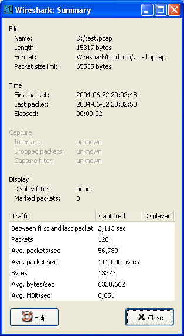
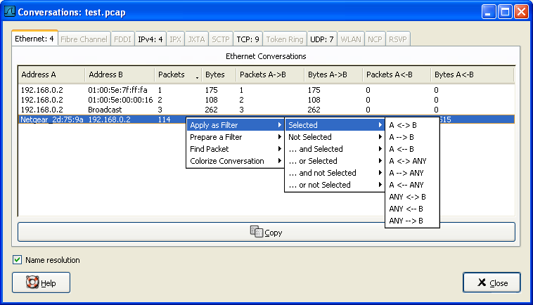
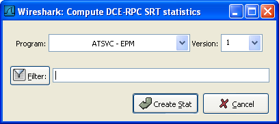

# 第八章 统计

**目录**

*   8.1\. 说明
*   8.2\. 摘要窗口
*   8.3\. "Protocol Hierarchy"窗口
*   8.4\. "Endpoints"
    *   8.4.1\. 什么是 Endpoint?
    *   8.4.2\. "Endpoints"窗口
    *   8.4.3\. 特定协议的"Endpoint List"窗口
*   8.5\. 会话/conversations
    *   8.5.1\. 什么是会话/conversation?
    *   8.5.2\. "Conversations/会话" window
    *   8.5.3\. 协议指定“Conversation List/会话列表”窗口
*   8.6\. "IO Graphs"窗口
*   8.7\. 服务相应时间
    *   8.7.1\. "Service Response Time DCE-RPC"窗口
*   8.8\. 协议指定统计窗口

## 8.1\. 说明

Wireshark 提供了多种多样的网络统计功能

包括，载入文件的基本信息(比如包的数量)，对指定协议的统计(例如，统计包文件内 HTPP 请求和应答数)，等等。

*   一般统计

    *   **Summary：**捕捉文件摘要

    *   **Protocal Hierarchy:** 捕捉包的层次结构

    *   **Endpoints** 例如：通讯发起，终止方的 ip 地址

    *   **Conversations** 例如：两个指定 IP 之间的通信

    *   **IO Graphs** 包数目随时间变化的曲线图。

*   指定协议统计

    *   **Service Response Time** 从发起请求到相应请求的服务间隔时间。

    *   **Various other** 协议特有的统计

> 
> 
> 注意
> 
> 协议特定的统计，需要有特定协议的细节了解。除非你对那个协议非常熟悉，统计结果不是那么那么容易理解的。

## 8.2\. 摘要窗口

当前捕捉文件的一般信息

**图 8.1\. "Summary" 窗口**

File

捕捉文件的一般的信息

Time

第一个包和最后一个包的时间戳

Capture

包捕捉完成时的一些信息(仅当包数据已经从网络捕捉，还没有从文件载入)

Display

与显示有关的信息

Traffic

网络传输的相关统计，如果设置了显示过滤，你会看到两列。**Captured**列显示过滤前的信息，**Displayed**列显示过滤后对应的信息。

## 8.3\. "Protocol Hierarchy"窗口

显示捕捉包的分层信息

**图 8.2\. "Protocol Hierarchy" 窗口**

这个窗口现实的是捕捉文件包含的所有协议的树状分支。你可以展开或折叠分支，通过点击+/-图标。默认情况下，所有分支都是展开的。

每行包含一个协议层次的统计值

每列代表的意思

Protocol

协议名称

%Packets

含有该协议的包数目在捕捉文件所有包所占的比例

Packet

含有该协议的包的数目

Bytes

含有该协议的字符数

MBit/s

该协议的带宽，相对捕捉时间

End Packets

End Bytes

End MBit/s

> 
> 
> 注意
> 
> 包通常会包含许多协议，有很多协议会在每个包中被统计。例如：截屏中包括 99.17%的 IP，85.83%的 TCP 协议(它们的和超过了 100%)
> 
> 
> 
> 注意
> 
> 包的协议组成部分可以不包含高层协议，高层协议包统计百分比和可能并不等于 100%，例如:截屏中 TCP 占 85.83%，但是上层协议(HTTP...)却比 85%更少。这可能是因为 TCP 协议，例如：TCP ACK 包不会被统计到高层协议。
> 
> 
> 
> 注意
> 
> 一个单独的包可以包含相同的协议不止一次，这种情况下，协议会被计数超过一次。例如某些通道配置的协议，IP 层会出现两次。(通道封装的内容包括 ip 层，传输时将封装过在用 IP 封装一次)

## 8.4\. "Endpoints"

端点不着的统计

> 
> 
> 提示
> 
> 如果在其他网络工具工具中看到被称为**Hostlist/主机列表**的东西，在这里就是 Endpoint 了。

### 8.4.1\. 什么是 Endpoint?

一个网络端点是在特定的协议层的通信的逻辑端点。Wireshark 端点统计会将列出下列端点:

Ethernet

以太网端点显示的是以太网 MAC 地址

Fibre Channel

笔者未描述

FDDI

FDDI 端点是 FDDI MAC 地址

IPV4

IP 端点是 IP 地址

IPX

笔者未介绍

TCP

TCP 端点由 IP 地址和 TCP 端口组成，同样的 IP 地址加上不同的端口号，表示的是不同的 TCP 端点

Token Ring

Token Ring(令牌环)端点是 Token Ring MAC 地址

UDP

UDP 端点是由 IP 地址和 UDP 端口组成，不同的 UDP 地址用同一个 IP 地址表示不同的 UDP 端点

> 
> 
> Broadcast / multicast endpoints（广播/多播端点）
> 
> 广播/多播通信会用额外的端点单独显示。当然，这些端点都是虚拟端点，真实的通信会被所有(多播的一部分)列出的单播端点接收。

### 8.4.2\. "Endpoints"窗口

该窗口显示端点捕捉的统计信息

**图 8.3\. "Endpoints"窗口**

在该窗口中，每个支持的协议，都显示为一个选项卡。选项标签显示被捕捉端点数目(例如："Ethernet :5"表示有 5 个 ethenet 端点被捕捉到)。如果某个协议没有端点被捕捉到，选项标签显示为灰色(尽管可以查看选项卡对应的页面).

列表中每行显示单个端点的统计信息。

**Name resolution** 如果选中该选项，将会对指定的协议层进行名字解析(当前选中的 Ethernet endpoint 页面是 MAC 层)。你可能注意到，第一行将前三个字节解析为"Netgear",第二行地址被解析为 IP 地址(通过 arp 协议解析)，第三行解析为广播地址(未解析时 mac 地址为:ff:ff:ff:ff:ff:ff)，最后两行的 MAC 地址未被解析。

> 
> 
> 提示
> 
> 该窗口可能会频繁那更新内容，在你进行实时捕捉之前打开了它(或者在这期间打开了它)，也依然有用。

### 8.4.3\. 特定协议的"Endpoint List"窗口

Before the combined window described above was available, each of its pages were shown as separate windows. Even though the combined window is much more convenient to use, these separate windows are still available. The main reason is, they might process faster for very large capture files. However, as the functionality is exactly the same as in the combined window, they won't be discussed in detail here.

## 8.5\. 会话/conversations

已经捕捉的会话统计

### 8.5.1\. 什么是会话/conversation?

一个网络会话，指的是两个特定端点之间发生的通信。例如，一个 IP 会话是两个 IP 地址间的所有通信。

### 8.5.2\. "Conversations/会话" window

除了列表内容之外，会话窗口和端点窗口基本一样，见第 8.4.2 节 “"Endpoints"窗口”

**图 8.4\. "Conversations"对话框**

### 8.5.3\. 协议指定“Conversation List/会话列表”窗口

Before the combined window described above was available, each of its pages were shown as separate windows. Even though the combined window is much more convenient to use, these separate windows are still available. The main reason is, they might process faster for very large capture files. However, as the functionality is exactly the same as in the combined window, they won't be discussed in detail here.

## 8.6\. "IO Graphs"窗口

用户可配置的捕捉网络数据图形。

你可以设置五种不同颜色的图形

**图 8.5\. "IO Graphs" 窗口**

用户可以对一下内容进行设置。

Graphs

*   **Graph 1-5:** 开启 1-5 图表(默认仅开启 graph 1)

*   **Color:** 图表的颜色(不可修改)

*   **Filter:**指定显示过滤器(only the packets that pass this filter will be taken into account for that graph)

*   **Style:**图表样式(Line/Impulse/FBar)

X Axis

*   **Tick interval** 设置 X 轴的每格代表的时间(10/1/0.1/0.01/0.001 seconds))

*   **Pixels per tick** 设置 X 轴每格占用像素 10/5/2/1 px

Y Axis

*   **Unit y**轴的单位(Packets/Tick, Bytes/Tick, Bits/Tick, Advanced...)

*   **Ssale Y**轴单位的刻度(10,20,50,100,200,500,...)

XXX - describe the Advanced feature.

## 8.7\. 服务相应时间

服务响应时间是发送请求到产生应答之间的时间间隔。响应时间在很多协议中可用。

服务相应时间统计，在以下协议中可用

*   DCE-RPC

*   Fibre Channel

*   H.225 RAS

*   LDAP

*   MGCP

*   ONC-RPC

*   SMB

后面将会以 DCE-RPC 为例介绍响应时间。

> 
> 
> 注意
> 
> 其他服务相应时间在 Windows 平台下都是相同的处理方法(或者仅仅轻微不同)

### 8.7.1\. "Service Response Time DCE-RPC"窗口

DCE-RPC 的服务相应时间是在请求发起到相应请求的时间间隔

**图 8.6\. "Compute DCE-RPC statistics"窗口**

你可以设置显示过滤，减少用于统计的包的数量

**图 8.7\. The "DCE-RPC Statistic for ..." 窗口**

Each row corresponds to a method of the interface selected (so the EPM interface in version 3 has 7 methods). For each method the number of calls, and the statistics of the SRT time is calculated.

## 8.8\. 协议指定统计窗口

The protocol specific statistics windows display detailed information of specific protocols and might be described in a later version of this document. Some of these statistics are described at the [`wiki.wireshark.org/Statistics`](http://wiki.wireshark.org/Statistics) pages.