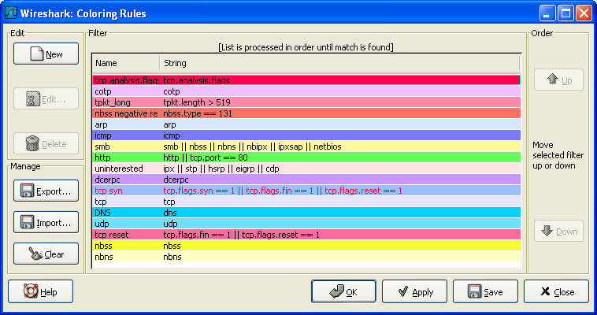

# 第九章 个性化 Wireshark

**目录**

*   9.1\. 说明
*   9.2\. 从命令行启动 Wireshark
*   9.3\. 包色彩显示设置
*   9.4\. 设置协议解码
    *   9.4.1\. "Enable Protocols"对话框
    *   9.4.2\. 用户指定解码器
    *   9.4.3\. 显示用户指定解码器
*   9.5\. 首选项
*   9.6\. 用户表表
*   9.7\. 创建过滤宏
*   9.8\. Tektronics K12xx/15 RF5 协议表
*   9.9\. 用户 DLTs 协议表
*   9.10\. SNMP 用户表

> **写在前面**
> 
> 本章自 9.6 节起的内容在译者的 0.99.5 版 Wireshark 中都未曾见到对应的功能。

## 9.1\. 说明

Wireshark 默认行为通常可以很好地吻合你的习惯，当你十分熟悉 Wireshark 的时候，你可以对 Wireshark 进行个性化设置以更好地适合你的需要。在本章我们将介绍:

*   如何从命令启动 Wireshark

*   如何将包列表色值化(以颜色区分不同的包)

*   如何控制包解析

*   如何使用多种多样的首选项设置

## 9.2\. 从命令行启动 Wireshark

Wireshark 支持从命令行启动，同样也可以从大多数窗口管理软件启动。这节我们看看如何从命令行启动。

Wireshark 支持丰富的命令行参数。要想看看都有那些参数，在命令行键入**Wireshark -h**就会显示帮助信息（以及其他相关的）。详细参数列表见例 9.1 “Wireshark 帮助信息”

**例 9.1\. Wireshark 帮助信息**

```
Version 0.99.0
Copyright 1998-2006 Gerald Combs <gerald@wireshark.org> and contributors.

Compiled with GTK+ 2.6.9, with GLib 2.6.6, with WinPcap (version unknown),
with libz 1.2.3, with libpcre 6.4, with Net-SNMP 5.2.2, with ADNS, with Lua 5.1.

Running with WinPcap version 3.1 (packet.dll version 3, 1, 0, 27), based on 
libpcap version 0.9[.x] on Windows XP Service Pack 2, build 2600.

wireshark [ -vh ] [ -DklLnpQS ] [ -a <capture autostop condition> ] ...
        [ -b <capture ring buffer option> ] ...
        [ -B <capture buffer size> ]
        [ -c <capture packet count> ] [ -f <capture filter> ]
        [ -g <packet number> ] [ -i <capture interface> ] [ -m <font> ]
        [ -N <name resolving flags> ] [ -o <preference/recent setting> ] ...
        [ -r <infile> ] [ -R <read (display) filter> ] [ -s <capture snaplen> ]
        [ -t <time stamp format> ] [ -w <savefile> ] [ -y <capture link type> ]
        [ -X <eXtension option> ] [ -z <statistics> ] [ <infile> ] 
```

我们随后将对每个选项进行介绍

首先需要注意的是，**Wireshark**命令会启动 Wireshark。不管怎样，你可以在启动时追加许多参数(如果你喜欢)。他们的作用如下(按字母顺序)：

笔者注：按字母顺序是不是一个好主意？按任务顺序会不会更好点？

-a <capture autostop condition>

设置一个标准用来指定 Wireshark 什么时候停止捕捉文件。标准的格式为 test:value,test 值为下面中的一个。

duration:value

当捕捉持续描述超过 Value 值，停止写入捕捉文件。

filesize:value

当捕捉文件大小达到 Value 值 kilobytes(kilobytes 表示 1000bytes,而不是 1024 bytes)，停止写入捕捉文件。如果该选项和-b 选项同时使用，Wireshark 在达到指定文件大小时会停止写入当前捕捉文件，并切换到下一个文件。

files:value

当文件数达到 Value 值时停止写入捕捉文件

-b <capture ring buffer option>

如果指定捕捉文件最大尺寸，因为 Wireshark 运行在"ring buffer"模式，被指定了文件数。在"ring buffer"模式下，Wireshark 会写到多个捕捉文件。它们的名字由文件数和创建日期，时间决定。

当第一个捕捉文件被写满，Wireshark 会跳转到下一个文件写入，直到写满最后一个文件，此时 Wireshark 会丢弃第一个文件的数据(除非将 files 设置为 0，如果设置为 0，将没有文件数限制)，将数据写入该文件。

如果 duration 选项被指定，当捕捉持续时间达到指定值的秒数，Wireshark 同样会切换到下个文件，即使文件未被写满。

duration:value

当捕捉持续描述超过 Value 值，即使文件未被写满，也会切换到下个文件继续写入。

filesize:value

当文件大小达到 value 值 kilobytes 时(kelobyte 表示 1000bytes,而不是 1024bytes)，切换到下一个文件。

files:value

当文件数达到 value 值时，从第一个文件重新开始写入。

-B <capture buffer size (Win32 only)>

仅适合 Win32:设置文件缓冲大小(单位是 MB,默认是 1MB).被捕捉驱动用来缓冲包数据，直到达到缓冲大小才写入磁盘。如果捕捉时碰到丢包现象，可以尝试增大它的大小。

-c <capture packet count>

实时捕捉中指定捕捉包的最大数目，它通常在连接词-k 选项中使用。

-D

打印可以被 Wireshark 用于捕捉的接口列表。每个接口都有一个编号和名称(可能紧跟在接口描述之后？)会被打印，接口名或接口编号可以提供给-i 参数来指定进行捕捉的接口(这里打印应该是说在屏幕上打印)。

在那些没有命令可以显示列表的平台(例如 Windows,或者缺少**ifconfig -a**命令的 UNIX 平台)这个命令很有用;接口编号在 Windows 2000 及后续平台的接口名称通常是一些复杂字符串，这时使用接口编号会更方便点。

注意，"可以被 Wireshark 用于捕捉"意思是说：Wireshark 可以打开那个设备进行实时捕捉；如果在你的平台进行网络捕捉需要使用有特殊权限的帐号(例如 root，Windows 下的 Administrators 组)，在没有这些权限的账户下添加-D 不会显示任何接口。参数

-f <capture filter>

设置捕捉时的内置过滤表达式

-g <packet number>

在使用-r 参数读取捕捉文件以后，使用该参数跳转到指定编号的包。

-h

-h 选项请求 Wireshark 打印该版本的命令使用方法(前面显示的)，然后退出。

-i <capture interface>

设置用于进行捕捉的接口或管道。

网络接口名称必须匹配**Wireshark -D**中的一个；也可以使用**Wireshark -D**显示的编号，如果你使用 UNIX,**netstat -i**或者**ifconfig -a**获得的接口名也可以被使用。但不是所有的 UNIX 平台都支持-**a**,**ifconfig**参数。

如果未指定参数，Wireshark 会搜索接口列表，选择第一个非环回接口进行捕捉，如果没有非环回接口，会选择第一个环回接口。如果没有接口，wireshark 会报告错误，不执行捕捉操作。

管道名即可以是 FIFO(已命名管道)，也可以使用"-"读取标准输入。从管道读取的数据必须是标准的 libpcap 格式。

-k

**-k**选项指定 Wireshark 立即开始捕捉。这个选项需要和-i 参数配合使用来指定捕捉产生在哪个接口的包。

-l

打开自动滚屏选项，在捕捉时有新数据进入，会自动翻动"Packet list"面板（同-S 参数一样）。

-m <font>

设置显示时的字体（编者认为应该添加字体范例）

-n

显示网络对象名字解析(例如 TCP,UDP 端口名，主机名)。

-N <name resolving flags>

对特定类型的地址和端口号打开名字解析功能；该参数是一个字符串，使用 m 可以开启 MAC 地址解析，n 开启网络地址解析，t 开启传输层端口号解析。这些字符串在-n 和-N 参数同时存在时优先级高于-n，字母 C 开启同时(异步)DNS 查询。

-o <preference/recent settings>

设置首选项或当前值，覆盖默认值或其他从 Preference/recent file 读取的参数、文件。该参数的值是一个字符串，形式为 prefname:value,prefnmae 是首选项的选项名称(出现在 preference/recent file 上的名称)。value 是首选项参数对应的值。多个**-o <preference settings>** 可以使用在单独命中中。

设置单独首选项的例子：

wireshark -o mgcp.display_dissect_tree:TRUE

设置多个首选项参数的例子：

```
 wireshark -o mgcp.display_dissect_tree:TRUE -o mgcp.udp.callagent_port:2627 
```

> 
> 
> 提示
> 
> 在???可以看到所有可用的首选项列表。

-p

不将接口设置为杂收模式。注意可能因为某些原因依然出于杂收模式；这样，-p 不能确定接口是否仅捕捉自己发送或接受的包以及到该地址的广播包，多播包

-Q

禁止 Wireshark 在捕捉完成时退出。它可以和-c 选项一起使用。他们必须在出现在-i -w 连接词中。

-r <infile>

指定要读取显示的文件名。捕捉文件必须是 Wireshark 支持的格式。

-R <read(display) filter>

指定在文件读取后应用的过滤。过滤语法使用的是显示过滤的语法，参见第 6.3 节 “浏览时过滤包”，不匹配的包不会被显示。

-s <capture snaplen>

设置捕捉包时的快照长度。Wireshark 届时仅捕捉每个包<snaplen>字节的数据。

-S

Wireshark 在捕捉数据后立即显示它们，通过在一个进程捕捉数据，另一个进程显示数据。这和捕捉选项对话框中的"Update list of packets in real time/实时显示数据"功能相同。

-t <time stamp format>

设置显示时间戳格式。可用的格式有

*   **r** 相对的，设置所有包时间戳显示为相对于第一个包的时间。

*   **a** absolute,设置所有包显示为绝对时间。

*   **ad** 绝对日期，设置所有包显示为绝对日期时间。

*   **d** delta 设置时间戳显示为相对于前一个包的时间

*   **e** epoch 设置时间戳显示为从 epoch 起的妙数(1970 年 1 月 1 日 00:00:00 起)

-v

请求 Wireshark 打印出版本信息，然后退出

-w <savefile>

在保存文件时以 savefile 所填的字符为文件名。

-y <capture link type>

如果捕捉时带有-k 参数，-y 将指定捕捉包中数据链接类型。The values reported by -L are the values that can be used.

-X <eXtension option>

设置一个选项传送给 TShark 模块。eXtension 选项使用 extension_key:值形式，extension_key:可以是：

**lua**_script:lua_script_filename,它告诉 Wireshark 载入指定的脚本。默认脚本是 Lua scripts.

-z <statistics-string>

得到 Wireshark 的多种类型的统计信息，显示结果在实时更新的窗口。笔者注：在此处增加更多的细节

## 9.3\. 包色彩显示设置

Packet colorization(按色彩显示包)是 Wireshark 一个非常有用的特性。你可以设置 Wireshark 通过过滤器将包按颜色设置。可以将你感兴趣的包通过颜色强调显示。

> 
> 
> 提示
> 
> 你可以在[`wiki.wireshark.org/ColoringRules`](http://wiki.wireshark.org/ColoringRules)的**Wireshark Wiki Coloring Rules page**找到颜色规则的举例。

想要按色彩显示包，选择 View 菜单的“Coloring Rules...”菜单项，将会弹出"Coloring Rules"对话框，如图 9.1 “"Coloring Rules"对话框”所示

**图 9.1\. "Coloring Rules"对话框**



启动 Coloring Rules 对话框以后，有许多按钮可以使用，当然这取决于是否已经装入颜色过滤器(碰到 once sth,you have a lot of 之类的句子就觉得特别 tmd 的恶心。)

> 
> 
> 注意
> 
> 在对色彩规则进行排序（然后运用时）需要注意：他们是按自上而下的顺序应用的。因此，特定的协议应该排在一般的协议的前面(高层协议应该排在底层协议之前)。例如：如果你将 UDP 协议排在 DNS 之前，那么 DNS 颜色规则就不会被应用(因为 DNS 使用 UDP 协议，UDP 色彩规则首先被匹配。译者注：这里有点像 netscreen 防火墙规则，从上而下匹配，匹配了第一个规则以后就不会询问后续规则了。)

如果你第一次使用色彩规则，点击“NEW”按钮打开色彩过滤编辑对话框，如???所示：

**图 9.2\. "Edit Color Filter"**


在编辑色彩对话框，输入颜色过滤器名称，然后在 String 输入框输入过滤字符串。???显示的是 arp,arp 表示过滤器名为 arp,string 填的 arp 表示选择的协议类型是 arp。输入这些值以后，你可以选择前景色和配景色匹配这个过滤表达式。点击 **Foreground color...** /前景色或者**Background color...**/背景色按钮就会弹出**Choose foreground/background color for protocol**对话框(见图 9.3 “"Choose color"对话框”)，进行前景色、背景色设置了。

**图 9.3\. "Choose color"对话框**


选择你需要的颜色，点击 OK

> 
> 
> 注意
> 
> You must select a color in the colorbar next to the colorwheel to load values into the RGB values. Alternatively, you can set the values to select the color you want.

图 9.4 “在 Wireshark 中使用色彩过滤”显示了默认情况下使用多个色彩过滤器的例子。如果你不太喜欢的话，可以自己随时修改它。

如果你不确定哪个颜色规则会对特定包发生作用，查看[Coloring Rule Name: ...] and [Coloring Rule String: ...] 字段。

**图 9.4\. 在 Wireshark 中使用色彩过滤**


## 9.4\. 设置协议解码

用户可以协议如何被解码。[18]

每个协议都有自己的解码器,因此包可能需要使用多个解码器才能完成解码。wireshark 会尝试为每个包尝试找到正确的解码器(使用静态"routes"和结构"guessing"),特定的情况有可能会选择错误的解码器。例如，如果你将一个常见协议使用用一个不常见的 TCP 端口，Wireshark 将无法识别它，例如：HTTP 协议使用 800 端口而不是标准 80 端口。

有两种方式可以控制协议和解码器关联：完全禁止协议解码器，或者临时调用解码器。

### 9.4.1\. "Enable Protocols"对话框

Eable Protocols 对话框可以 enable、disable 特定的协议，默认情况下是所有协议都 enable。如果某个协议被 disabled,Wireshark 在碰到这个协议时会略过不处理。

> 
> 
> 注意
> 
> 禁止某个协议解码会阻止依附该协议的更高层协议显示。例如，假定你禁止了 IP 协议，选择某个包含 Ethernet,IP,TCP 和 HTTP 信息的包。将只会显示以太网信息，IP 协议不会显示，基于 IP 协议的 TCP,HTTP 协议信息也不会显示。

**图 9.5\. "Enabled Protocols"对话框**


通过点击复选框，或者在协议高亮选中时按空格键可以切换协议 enable/disable 状态。

> 
> 
> 警告
> 
> 必须通过 Save 按钮保存设置，OK，Apply 按钮不会保存设置，关闭 Wireshark 以后就会丢失设置。

按钮功能介绍

1.  **Enable All** 允许列表中所有协议

2.  **Disable All** 禁止列表中所有协议

3.  **Invert** 切换列表中所有协议的 enable/disable 状态

4.  **OK** 应用当前修改，关闭对话框

5.  **Apply** 应用修改，不关闭对话框

6.  **Save** 保存当前设置

7.  **Cancel** 取消修改，退出对话框

### 9.4.2\. 用户指定解码器

在"packet list"面板，选中包，"Decode As"，打开 Decode As 对话框，可以临时设置解码器。在协议不使用常见端口时会有所帮助。

**图 9.6\. "Decode As" 对话框**


对话框的内容取决于当前选择包的信息。

> 
> 
> 警告
> 
> 用户指定解码器不能保存。退出 Wireshark 以后，这些设置会丢失

1.  **Decode** 使用选择的方式解码。

2.  **Do not decode** 不要用选定方式解码。

3.  **Link/Network/Transport** 指定使用那个解码器对各网络层进行解码。三个页面中哪个页面可用取决于被选择包的内容。

4.  **Show Current** 打开一个对话框显示当前用户**已经**指定的解码器列表。

5.  **OK** 应用当前选定的解码器，关闭对话框。

6.  **Apply** 应用当前选定的解码器，保持对话框打开

7.  **Cancel** 取消修改，关闭对话框。

### 9.4.3\. 显示用户指定解码器

下面对话框显示了当前用户指定的解码器

**图 9.7\. "Decode As: Show" 对话框**


1.  **OK** 关闭对话框

2.  **Clear** 移除所有解码器

[18] dissector:析像器，应用在光学领域，dissct 解剖，这里姑且把他们翻译成解码器，解码，不过有 decode，似乎当作解码有点欠妥。

## 9.5\. 首选项

Wireshark 的许多参数可以进行设置。选择"Edit"菜单的"Preferences..."项，打开 Preferences 对话框即可进行设置。如???所示:默认"User interface"是第一个页面。点击左侧的树状列表中的项目可以打开对应的页面。

> 
> 
> 注意
> 
> 参数设置会频繁追加。想了解关于参数设置的最新介绍，请参考**Wireshark Wiki Preferences** 页:[`wiki.wireshark.org/Preferences`](http://wiki.wireshark.org/Preferences.).
> 
> 
> 
> 警告
> 
> OK 和 Apply 按钮不会保存设置，你必须点击 Save 按钮保存设置。

*   OK 应用参数设置，关闭对话框

*   Apply 应用参数设置，不关闭对话框

*   Save 应用参数设置，保存参数设置到硬盘，并且保持对话框打开

*   Cancel 重置所有参数设置到最后一次保存状态。

**图 9.8\. preferences 对话框**


## 9.6\. 用户表编辑器[19]

用户表编辑器是用来管理各种用户自定义参数表。它的主对话框操作方式类似于<a title="9.3. ">第 9.3 节 “包色彩显示设置”</a>

[19] 找遍了 Wireshark 也没看到 User table 编辑器，版本问题？

## 9.7\. 创建过滤宏

Display Filter Macros 是用来创建复杂显示过滤器的快捷方式的工具，例如：定义一个显示过滤宏，名称为 tcp_conv 文本为 **( (ip.src == $1and ip.dst == $2 and tcp.srcpt == $3 and tcp.dstpt == $4) or (ip.src == $2and ip.dst == $1 and tcp.srcpt == $4 and tcp.dstpt == $3) )**，以后你就可以使用**${tcp_conv:10.1.1.2;10.1.1.3;1200;1400}** 替代整个过滤字符串。

显示过滤宏可以通过第 9.6 节 “用户表表”，选择 Display Filter Macros 菜单下的 View 菜单进行管理。用户表有下面两个字段。(好像没有所谓的 User table)

name

宏的名称

text

宏的替代文本。使用$1,$2,$3...作为输入参数时。

> **过滤宏的使用说明（译者注）**
> 
> 首先需要说明的是，实际上在 Windows 平台 GTK2 环境下，并没有看到有显示过滤宏功能，可能有的原因有 3 种：1、0.99.5 版本根本没有过滤宏功能；2、我视力不好，没看到，如果是这样，希望谁能帮我找找。3、Windows+GTK2 下面没有，其他平台有。
> 
> 这里暂且不管有没有，我先按我的理解介绍一下宏的创建使用方法。
> 
> 以笔者提到的宏的例子，先说如何创建宏
> 
> 1.  定义宏的名称，如范例中的 tcp_conv
> 
> 1.  定义宏的文本部分，显示过滤宏内容其实和显示过滤器结构上没有本质区别，只是将具体的值换成了参数。，比如例题中第一部分是**ip.src == $1and ip.dst == $2 and tcp.srcpt == $3 and tcp.dstpt == $4**,这里的$1,$2,$3,$4，如果在显示过滤器中，应该是具体的 ip 地址和端口号，在这里使用了$1,$2,$3,$4,是作为参数。就像定义函数的参数一样，供调用宏时传递参数用的。
> 
> 1.  如何使用宏：如例中所示，需要在显示过滤框输入或在过滤表达式编辑器中应用宏，输入宏的格式是${宏名称:参数 1;参数 2;参数 3;....}，参数就是定义宏时的参数的传入值，如例中的**${tcp_conv:10.1.1.2;10.1.1.3;1200;1400}**,tcp_conv 是宏名称，10.1.1.2 是$1 的取值，其他类推。
> 
> 再次声明，我装的 Wireshark 并没有这个功能。希望你们碰到这个共能时能用上。

## 9.8\. Tektronics K12xx/15 RF5 协议表

Tektronix's K12xx/15 rf5 文件格式使用 helper files(*.stk)验证指定接口的各种协议。Wireshark 不能读取 stk 文件，它使用一个表来识别底层协议。(这句没整明白)

Stk 文件协议匹配通过第 9.6 节 “用户表表”来设置,它有两列：

match

a partial match for an stk filename, the first match wins, so if you have a specific case and a general one the specific one must appear first in the list

protos

This is the name of the encapsulating protocol (the lowest layer in the packet data) it can be either just the name of the protocol (e.g. mtp2, eth_witoutfcs, sscf-nni ) or the name of the encapsulation protocol and the "application" protocol over it separated by a colon (e.g sscop:sscf-nni, sscop:alcap, sscop:nbap, ...)

## 9.9\. 用户 DLTs 协议表

当一个 pcap 文件使用用户 DLTs (147 to 162)表中的一个时 ,Wireshark 使用这个表来识别每个 DLT 表使用哪个协议。

通过第 9.6 节 “用户表表”管理的 DLT 表有如下列：

encap

一个用户 dlts 表

payload_proto

payload(包的最底层协议)协议名称

header_size

如果有 header 协议(在 payload 之前)，这个选项告诉 Wireshark header 的大小。设置为 0 的话，禁止 header protocol.

header_proto

header 协议的名称(默认使用"data")

trailer_size

如果有 trailer 协议的话(追踪协议，在 paylod 协议之后)，告诉系统它的大小。设置为 0 表示禁止该协议。

trailer_proto

trailer 协议的名称(默认是"data")

## 9.10\. SNMP 用户表

Wireshark 使用 SNMP 表验证 SNMPv3 包的授权并进行揭秘。

该表通过第 9.6 节 “用户表表”进行管理，它包括如下字段。

engine_id

如果输入了 engine id,会使用在那些 engine id 是这些值的包。该字段是一个 16 进制的字符串，值通常形式为：0102030405

userName

用户名，当一个用户名有多个密码对应不同的 SNMP-engines 时，第一个匹配的将会被使用。if you need a catch all engine-id (empty) that entry should be the last one.

验证模式

使用什么验证模式,(MD5 或者 SHA1)

authPassword

授权密码，使用"\xDD"作为非打印字符。一个 16 进制密码必须输入为"\xDD"形式。例如：16 进制密码 010203040506 就必须输入为'\x01\x02\x03\x04\x05\x06'.

priv_proto

使用的加密算法(DES 或 AES)

privPassword

私有密钥，使用"\xDD"作为非打印字符。一个 16 进制密码必须输入为"\xDD"形式。例如：16 进制密码 010203040506 就必须输入为'\x01\x02\x03\x04\x05\x06'.