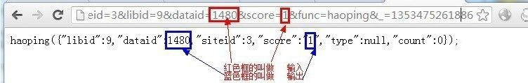
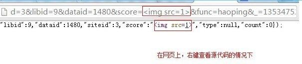
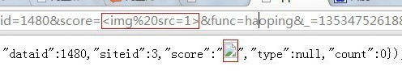
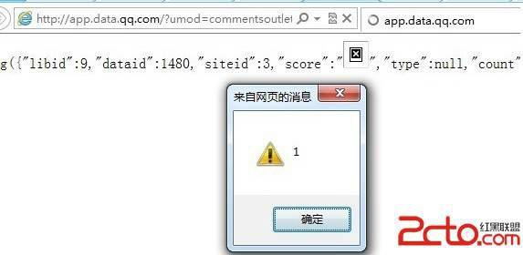

# 1\. 什么都没过滤的入门情况

> 来源：[1\. 什么都没过滤的入门情况](http://www.wooyun.org/bugs/wooyun-2010-015957)

## 简要描述

只是些反射型 XSS，单单发出来没有什么意义。 只是些反射型 XSS，腾讯怎么修都修不完。 只是些反射型 XSS，我想让它变得更有价值。 只是些反射型 XSS，我拿他们做成了教程。

## 详细说明

1\. XSS 的存在，一定是伴随着输入，与输出 2 个概念的。

2\. 要想过滤掉 XSS，你可以在输入层面过滤，也可以在输出层面过滤。

3\. 如果输入和输出都没过滤。 那么漏洞将是显而易见的。

4\. 作为第一个最基础的例子，

我们拿出的是一个什么都没过滤（其实还是有些转义的，主要没过滤`<` , `>`）的例子。

这种例子出现在 腾讯这种大网站的概率不是很高。 但是还是让我找到了一个。

5.

```
http://app.data.qq.com/?umod=commentsoutlet&act=count&siteid=3&libid=9&dataid=1480&score=1&func=haoping&_=1353475261886 
```

6\. 对于上面这个例子。我们可以看到什么是输入，什么是输出。



7\. 经过测试，我们发现，score 这个【输入】参数，没有进行任何过滤，即，输入是什么，输出就是什么？ 通俗点就是“吃什么，拉什么”。。。 如下图：



网页中看到的效果如下：



8\. 既然可以直接输入 `<` `>` HTML 标签，接下来的利用也就相对简单了。

```
http://app.data.qq.com/?umod=commentsoutlet&act=count&siteid=3&libid=9&dataid=1480&score=&func=haoping&_=1353475261886 
```

效果如下：



## 修复方案

```
<HTML 标签></HTML 标签>
[输出]
<HTML 标签></HTML 标签> 
```

或

```
<HTML 标签>[输出]</HTML 标签> 
```

a. 通常，我们只需要在输出前，将 `<` , `>` 过滤掉即可。

b. 这类 XSS 在小型网站中比较常见，在大型网站中少见。

c. 这类 XSS 通常都被浏览器的 XSS 过滤器秒杀了，所以一般来说，威力较小。

d. 对于普通用户来说，请使用 IE8 及以上版本（并开启 XSS 过滤器功能，默认开启），或 chrome 浏览器，将可以防御大部分此种类型 的 XSS 攻击