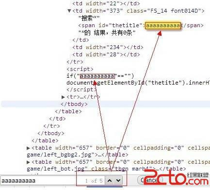
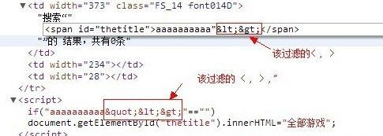
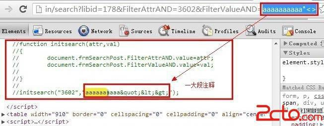
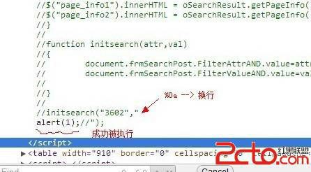

# 6\. 换行符复仇记

> 来源：[6\. 换行符复仇记](http://www.wooyun.org/bugs/wooyun-2010-016003)

## 简要描述

还是在`<script>`之间的场景，某些情况下，我们仅仅需要的只是一个换行符，就可以绕过过滤了。 它让双引号，尖括号知道了“它 们不是一个符号在战斗”。

1.实际场景是下面这个例子。

```
http://datalib.games.qq.com/cgi-bin/search?libid=178&FilterAttrAND=3602&FilterValueAND=aaaaaaaaaa 
```

对应的，我们可以看到我们的输入 aaaaaaaaa 会在页面的哪些输出点出现呢？



2\. 不错，一共有 5 处，有在 HTML 标签之间的（教程 1），也有在`<script>..</script>`之间的。但是呢，该过滤的，`<` , `>` 过滤掉了，该过滤的 `"` ，也过滤掉了。。



3\. 也就是说传统的已经不行啦，我们继续看 5 处的其他地方。呀，竟然还有一大段注释里，也出现了我们的【输出】



4\. 嗯，这样一来，是否会想到这样一个用法呢？

```
//我是注释，我爱洗澡，哦～哦～哦～ [我是输出] 
```

如果可以使用换行符的话。

这样 `alert(1);` 就会被成功执行。

5\. 恩，带着这样一个想法，我们不难构造出以下利用。

```
http://datalib.games.qq.com/cgi-bin/search?libid=178&FilterAttrAND=3602&FilterValueAND=%0aalert(1);// 
```

看下输出。嘿，果然没过滤。



6\. 这样，这一次我们的换行符立功了， 它不是一个符号在战斗！

## 修复方案

尽量不要在 JS 的注释里输出内容。还挺危险的。