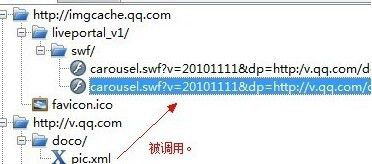
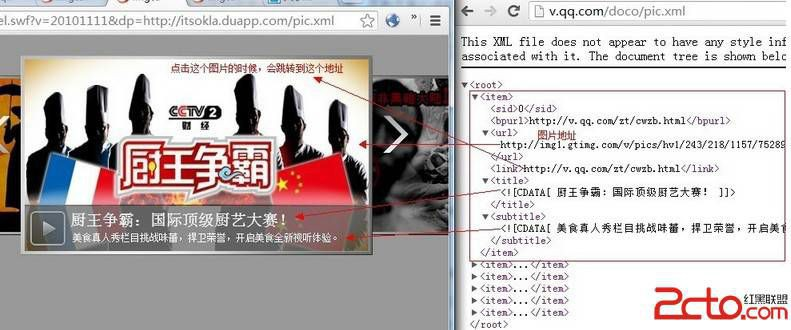
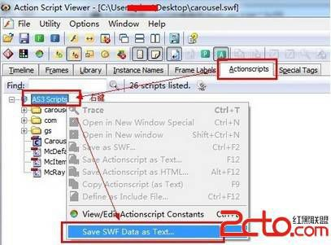
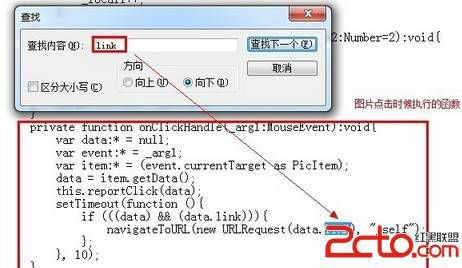
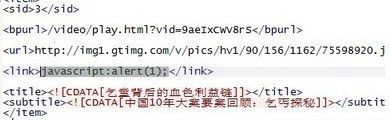
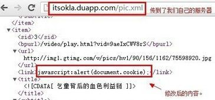
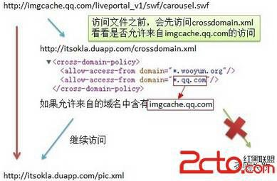
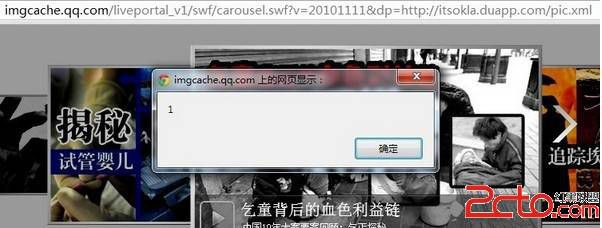

# 14\. Flash Xss 入门 [navigateToURL]

> 来源：[14\. Flash Xss 入门 [navigateToURL]](http://www.wooyun.org/bugs/wooyun-2010-016512)

## 简要描述

接下来，我们将讲解 Flash Xss。由于乌云及社会各界的白帽子的上报，腾讯目前已经对绝大多数可能存在问题的 Flash 进行了修复。 使得我在寻找真实案例时着实麻烦了不少。但是为了使得本教程足够完善和系统，我还是很艰难的找出了一些可以参考的例子。例子本 身危害可能不大，但是希望能够借助例子给新手们描述清楚比较基本的东西。

Flash 的 actionscript 脚本目前网络上存在 2 种版本，即 2.0 与 3.0，本次教程先以 as3.0 为例。同时教程还会在如何使用搜索引擎搜 索，如何查找关键词及构造利用代码方面进行详细的讲解。

## 详细说明

1\. 首先，第一步，我们需要找到存在缺陷的 FLASH 文件。如何找到这类文件呢？最好的办法，当然是 GOOGLE 搜索。但是其 实很多人是不太会用搜索引擎。或者知道怎么用，但是不知道该如何搜索关键词。因而教程的开始，我们来说一说，如何搜索关键词。

2\. 基本语句肯定是 `site:qq.com filetype:swf` 意思是，限定域名为 qq.com 文件类型为 FLASH 文件。

3\. 显然这样会搜索出很多 FLASH 文件，不利于我们后续的漏洞查找，所以我们需要输入某个关键词来进一步缩小范围。这里我列举一 些寻找关键词的方式。

1\. 已知存在缺陷的 FLASH 文件名或参数名，如：swfupload,jwplayer 等

2\. 多媒体功能的 FLASH 文件名，如：upload，player, music, video 等 3.3 调用的外部配置或数据文件后缀，如: xml, php 等

3\. 前期经验积累下来的程序员特征参数名用词，如: callback, cb , function 等

4\. 结合以上经验，本例使用其中第三条： 我们搜索： site:qq.com filetype:swf inurl:xml 可以找到这个 FLASH

```
http://imgcache.qq.com/liveportal_v1/swf/carousel.swf?v=20101111&dp=http://v.qq.com/doco/pic.xml 
```

5\. 如果你对 FLASH 有一定了解或者你天资聪慧的话，通过以上地址，你或许能猜到这个 FLASH 会调用 [`v.qq.com/doco/pic.xml`](http://v.qq.com/doco/pic.xml) 这个 XML 文件的数据，为了看看是什么数据，我们可以使用抓包软件【这里我使用的是 charles web proxy】来看看。



6\. 我们看看 [`v.qq.com/doco/pic.xml`](http://v.qq.com/doco/pic.xml) 的内容，对应着 FLASH 来看。



7\. 这里我们重点关注的是 xml 里的`<link>`结点。也就是当我们点击图片时，会跳转到 link 所指向的地址。

8.接着我们先说下基础知识。要实现上面点击图片，打开链接的功能，在 FLASH 里通常以以下代码来实现的。 当图片点击时执行 函数 A

函数 A 内容如下：

```
//as3.0 版本
navigateToURL(new URLRequest(link), "_self");
//as2.0 版本 getURL(link,"_self"); 
```

其中 link 就是被打开的链接。

9\. 但是这里存在一个问题，如果 link 是 "javascript:alert(1)" 那么就可以执行 JS 代码了。这里的点击执行代码的效果类似于网页里的

```
<a href="javascript:alert(1)">点我弹出 1</a> 
```

10\. 基于以上基础知识，我们可以先来反编译一下腾讯的 FLASH 文件，看看是不是上面这样的。 这里我用到的反编译软件是 actionscript viewer 2009。

把下载好的 FLASH 文件，拖到软件里，然后把 AS 都保存出来，保存为文本文件。





如上图，我们可以看到 AS 代码具有目录结构，这种是 AS3 的。如果不是这样目录的样子，则是 AS2 的代码。 由于我们要定位的是使用到 link 的代码。 我们打开保存的 as 代码，进行搜索。

可以看到，当点击图片时，直接将数据里的 link 作为参数传递到了 URLRequest 中。

11\. 既然如此，我们把 [`v.qq.com/doco/pic.xml`](http://v.qq.com/doco/pic.xml) 给下载下来，

将 xml 文件里的 `<link>` 部分修改一下。



12\. 上传修改后的 pic.xml 到我们自己的服务器。



13\. 这样一来， 腾讯的 [`imgcache.qq.com/liveportal_v1/swf/carousel.swf`](http://imgcache.qq.com/liveportal_v1/swf/carousel.swf) 就会跨域加载我们的 [`itsokla.duapp.com/pic.xml`](http://itsokla.duapp.com/pic.xml) 文件。

14\. 既然是跨域加载，有必要说点基础知识。 FLASH 跨域请求的流程大致如下：



15\. 因而，我们要允许来自 imgcache.qq.com 的 FLASH 文件，访问我们的 xml 文件才行。

在我们自己网站的根目录下，放置一个 crossdomain.xml

```
<?xml version="1.0"?>
<cross-domain-policy>
<allow-access-from domain="*.qq.com" />
</cross-domain-policy> 
```

16\. 最后，看看我们的效果。点击图片时，触发。



## 修复方案

对 XML 中传入的 link url 进行正则判断 或者限制加载第三方网站的 XML 文件