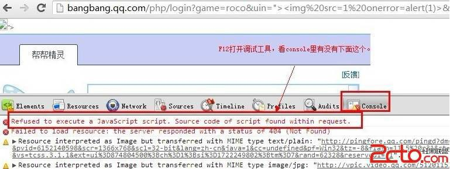
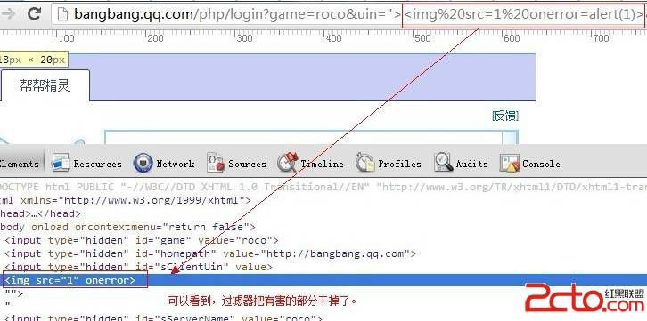
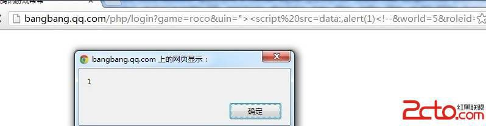

# 17\. XSS 过滤器绕过 [通用绕过]

> 来源：[17\. XSS 过滤器绕过 [通用绕过]](http://www.wooyun.org/bugs/wooyun-2010-016672)

## 简要描述

关于反射型的基本东西，暂时就到这啦，如果后面有什么好的 case，再做增补。最近，有些人会问到怎么绕过浏览器的 XSS 过滤 器，所以从这节开始，给出点绕过的例子。当然这些绕过浏览器的方法，不是万能的。不同浏览器，不同场景都会存在差异。满足场景 要求时，才可以使用。

此文给出的是一个来自 sogili 分享的 chrome 下绕过过滤器的方法，在腾讯某处 XSS 上的应用。 这一类都算是“结合了一定场景”，绕过了浏览器自身的防御机制，具有一定的通用性，我们称为“通用绕过”（瞎起的名字，别在意）。但是在后续版本的浏览器中，这些技巧可能会被浏览器干掉从而失效。再次强调：通用不是全部都行，意思是所适用的场景实际发生的概率比较高！

## 详细说明

1\. 其实就是个普通的 XSS 点，uin 参数没有对任何字符进行过滤。

```
http://bangbang.qq.com/php/login?game=roco&uin](http://bangbang.qq.com/php/login?game=roco&uin)=">&world=5&roleid=44583443&level=8&role=%2 
```

2\. 正是由于这个点什么都没过滤，浏览器自身的防御机制也最好发挥作用，瞧瞧，chrome 拦截了。。



有的新手，不知道有过滤器的，更是会觉得 “啊，这是怎么回事，怎么不行啊，明明可以的。。” 我们只要看到 console 里有上面那句，就说明 chrome 的过滤器大发神威了！！

3\. 我们也看看源码。



危害部分被和谐了。

4\. 那么怎么绕过呢？ 这里直接说方法。

5\. 首先要求缺陷点，允许 `<` , `>` 。其次，要求缺陷点的后方存在 `</script>` 标签。 我们看看当前的这个点的代码。

```
...
<input type="hidden" id="sClientUin" value="">">
...
<script type="text/javascript" src="http://pingjs.qq.com/tcss.ping.js"></script>
... 
```

6\. 可以看到上面的要求均满足。我们就可以使用以下技巧。

7\. 代入到我们的利用代码里。

```
http://bangbang.qq.com/php/login?game=roco&uin="><script src=data:,alert(1)<!--&world=5&roleid=44583443&level=8&role=%2 
```

这次，我们就成功啦。



## 修复方案

参见教程 （1\. 什么都没过滤的入门情况）